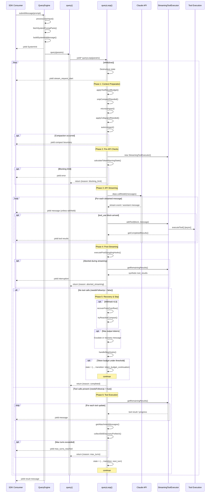
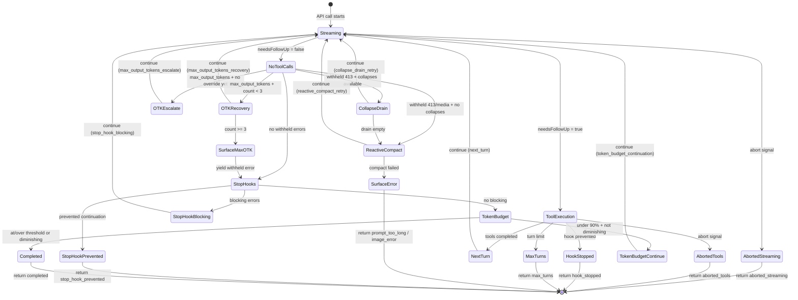
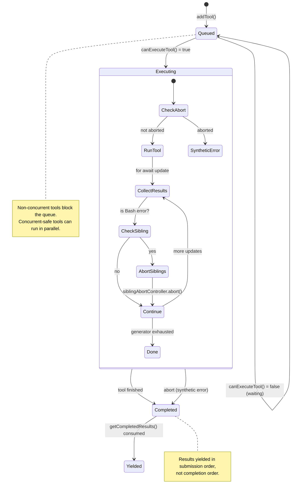
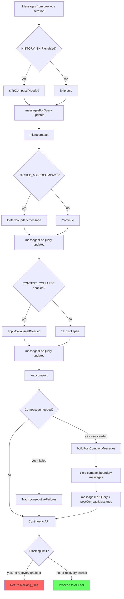

# Core Engine Research Document

> Source files analyzed: `src/QueryEngine.ts`, `src/query.ts`, `src/query/deps.ts`, `src/query/config.ts`, `src/query/tokenBudget.ts`, `src/query/stopHooks.ts`, `src/services/tools/StreamingToolExecutor.ts`, `src/services/tools/toolOrchestration.ts`

---

## 1. QueryEngine -- The High-Level Orchestrator

### 1.1 QueryEngineConfig Type

The `QueryEngineConfig` type is the full configuration surface for constructing a `QueryEngine`. Every conversation begins here.

```typescript
export type QueryEngineConfig = {
  cwd: string
  tools: Tools
  commands: Command[]
  mcpClients: MCPServerConnection[]
  agents: AgentDefinition[]
  canUseTool: CanUseToolFn
  getAppState: () => AppState
  setAppState: (f: (prev: AppState) => AppState) => void
  initialMessages?: Message[]
  readFileCache: FileStateCache
  customSystemPrompt?: string
  appendSystemPrompt?: string
  userSpecifiedModel?: string
  fallbackModel?: string
  thinkingConfig?: ThinkingConfig
  maxTurns?: number
  maxBudgetUsd?: number
  taskBudget?: { total: number }
  jsonSchema?: Record<string, unknown>
  verbose?: boolean
  replayUserMessages?: boolean
  handleElicitation?: ToolUseContext['handleElicitation']
  includePartialMessages?: boolean
  setSDKStatus?: (status: SDKStatus) => void
  abortController?: AbortController
  orphanedPermission?: OrphanedPermission
  snipReplay?: (
    yieldedSystemMsg: Message,
    store: Message[],
  ) => { messages: Message[]; executed: boolean } | undefined
}
```

Notable fields:
- `snipReplay` -- injected by `ask()` when the `HISTORY_SNIP` feature flag is active, allowing feature-gated strings to stay inside the gated module (keeps `QueryEngine` free of excluded strings and testable despite `feature()` returning false under `bun test`).
- `taskBudget` -- API task_budget, distinct from the `TOKEN_BUDGET` auto-continue feature. `total` is the budget for the whole agentic turn; `remaining` is computed per iteration from cumulative API usage.
- `canUseTool` -- the permission-checking hook; wrapped inside `submitMessage` to track `SDKPermissionDenial` events.

### 1.2 Class Structure

```typescript
export class QueryEngine {
  private config: QueryEngineConfig
  private mutableMessages: Message[]
  private abortController: AbortController
  private permissionDenials: SDKPermissionDenial[]
  private totalUsage: NonNullableUsage
  private hasHandledOrphanedPermission = false
  private readFileState: FileStateCache
  private discoveredSkillNames = new Set<string>()
  private loadedNestedMemoryPaths = new Set<string>()
}
```

Design: **One QueryEngine per conversation.** Each `submitMessage()` call starts a new turn within the same conversation. State (messages, file cache, usage) persists across turns.

### 1.3 Constructor

```typescript
constructor(config: QueryEngineConfig) {
  this.config = config
  this.mutableMessages = config.initialMessages ?? []
  this.abortController = config.abortController ?? createAbortController()
  this.permissionDenials = []
  this.readFileState = config.readFileCache
  this.totalUsage = EMPTY_USAGE
}
```

### 1.4 submitMessage -- The Turn Entry Point

```typescript
async *submitMessage(
  prompt: string | ContentBlockParam[],
  options?: { uuid?: string; isMeta?: boolean },
): AsyncGenerator<SDKMessage, void, unknown>
```

This is an **AsyncGenerator** -- it yields `SDKMessage` events as they become available, enabling streaming to SDK consumers.

**submitMessage flow (in order):**

1. **Destructure config** -- extracts all configuration from `this.config`
2. **Clear turn-scoped state** -- `this.discoveredSkillNames.clear()`
3. **Set cwd** -- `setCwd(cwd)`
4. **Wrap canUseTool** -- wraps the permission hook to track permission denials for SDK reporting
5. **Resolve model** -- user-specified model or default main loop model
6. **Resolve thinking config** -- provided config, adaptive default, or disabled
7. **Fetch system prompt parts** -- `fetchSystemPromptParts()`
8. **Build user context** -- merges base user context with coordinator context
9. **Load memory prompt** -- optional, when custom prompt + memory path override
10. **Assemble system prompt** -- `asSystemPrompt([...defaults, ...memory, ...appended])`
11. **Register structured output enforcement** -- if JSON schema + synthetic output tool
12. **Build ProcessUserInputContext** -- the context struct for slash command processing
13. **Handle orphaned permission** -- once per engine lifetime
14. **Process user input** -- `processUserInput()` handles slash commands, returns messages and flags
15. **Push messages** -- `this.mutableMessages.push(...messagesFromUserInput)`
16. **Persist transcript** -- `recordTranscript(messages)` (blocking for cowork, fire-and-forget for bare mode)
17. **Load skills and plugins** -- `getSlashCommandToolSkills()` and `loadAllPluginsCacheOnly()` in parallel
18. **Yield system init message** -- `buildSystemInitMessage()`
19. **Handle non-query results** -- if `shouldQuery` is false, yield local command output and return
20. **File history snapshot** -- if enabled and persistent session
21. **Enter query loop** -- `for await (const message of query({...}))` -- the main delegation

**SDK message dispatch (inside the for-await loop):**

The loop dispatches every message from `query()` through a switch on `message.type`:

| Type | Action |
|------|--------|
| `tombstone` | Skip (control signal for removing messages) |
| `assistant` | Push to mutableMessages, yield normalized, track stop_reason |
| `progress` | Push to mutableMessages, record transcript inline, yield normalized |
| `user` | Push to mutableMessages, yield normalized, increment turnCount |
| `stream_event` | Track usage (message_start/delta/stop), optionally yield if includePartialMessages |
| `attachment` | Push to mutableMessages, handle structured_output / max_turns_reached / queued_command |
| `stream_request_start` | Suppressed (not yielded) |
| `system` | Handle snip boundary replay, compact boundary, api_error; other subtypes not yielded |
| `tool_use_summary` | Yield to SDK |

**Budget/limit checks** after each message:
- `maxBudgetUsd` -- USD spend limit
- Structured output retry limit (default 5 attempts)

**Final result yield** -- After the query loop completes, `submitMessage` determines the result:
- Checks `isResultSuccessful()` for the last assistant/user message
- Yields `{ type: 'result', subtype: 'success' | 'error_during_execution' | 'error_max_turns' | 'error_max_budget_usd' | 'error_max_structured_output_retries' }`

### 1.5 Other Public Methods

```typescript
interrupt(): void           // Aborts the AbortController
getMessages(): readonly Message[]
getReadFileState(): FileStateCache
getSessionId(): string
setModel(model: string): void
```

### 1.6 The ask() Convenience Wrapper

```typescript
export async function* ask({...params}): AsyncGenerator<SDKMessage, void, unknown>
```

This is a one-shot wrapper around `QueryEngine`. It:
1. Creates a `QueryEngine` with the provided config (including conditional `snipReplay` injection when `HISTORY_SNIP` is active)
2. Delegates to `engine.submitMessage(prompt, { uuid, isMeta })`
3. In the `finally` block, writes the file state cache back: `setReadFileCache(engine.getReadFileState())`

---

## 2. The Query Loop -- The Agentic Core

### 2.1 QueryParams Type

```typescript
export type QueryParams = {
  messages: Message[]
  systemPrompt: SystemPrompt
  userContext: { [k: string]: string }
  systemContext: { [k: string]: string }
  canUseTool: CanUseToolFn
  toolUseContext: ToolUseContext
  fallbackModel?: string
  querySource: QuerySource
  maxOutputTokensOverride?: number
  maxTurns?: number
  skipCacheWrite?: boolean
  taskBudget?: { total: number }
  deps?: QueryDeps
}
```

### 2.2 State Type (Loop State Machine)

```typescript
type State = {
  messages: Message[]
  toolUseContext: ToolUseContext
  autoCompactTracking: AutoCompactTrackingState | undefined
  maxOutputTokensRecoveryCount: number
  hasAttemptedReactiveCompact: boolean
  maxOutputTokensOverride: number | undefined
  pendingToolUseSummary: Promise<ToolUseSummaryMessage | null> | undefined
  stopHookActive: boolean | undefined
  turnCount: number
  transition: Continue | undefined
}
```

The `State` struct is the **single mutable value** carried between loop iterations. At each `continue` site in the loop, a new `State` object is assembled (never mutating the old one in-place -- quasi-immutable transitions). The `transition` field records *why* the previous iteration continued.

### 2.3 Terminal and Continue Types (Transition Tags)

Inferred from usage in `query.ts`, the Terminal type captures all possible loop exit reasons:

```typescript
// Terminal -- returned when the loop exits
type Terminal =
  | { reason: 'blocking_limit' }
  | { reason: 'image_error' }
  | { reason: 'model_error'; error: unknown }
  | { reason: 'aborted_streaming' }
  | { reason: 'aborted_tools' }
  | { reason: 'prompt_too_long' }
  | { reason: 'completed' }
  | { reason: 'stop_hook_prevented' }
  | { reason: 'hook_stopped' }
  | { reason: 'max_turns'; turnCount: number }

// Continue -- recorded when the loop continues to next iteration
type Continue =
  | { reason: 'next_turn' }
  | { reason: 'collapse_drain_retry'; committed: number }
  | { reason: 'reactive_compact_retry' }
  | { reason: 'max_output_tokens_escalate' }
  | { reason: 'max_output_tokens_recovery'; attempt: number }
  | { reason: 'stop_hook_blocking' }
  | { reason: 'token_budget_continuation' }
```

### 2.4 The query() Outer Function

```typescript
export async function* query(
  params: QueryParams,
): AsyncGenerator<
  | StreamEvent
  | RequestStartEvent
  | Message
  | TombstoneMessage
  | ToolUseSummaryMessage,
  Terminal
>
```

This thin wrapper:
1. Creates `consumedCommandUuids: string[]`
2. Delegates to `yield* queryLoop(params, consumedCommandUuids)`
3. After normal return, notifies command lifecycle for each consumed UUID
4. On throw, the error propagates through `yield*`
5. On `.return()`, both generators close

### 2.5 queryLoop() -- The Main Loop

```typescript
async function* queryLoop(
  params: QueryParams,
  consumedCommandUuids: string[],
): AsyncGenerator<
  | StreamEvent | RequestStartEvent | Message | TombstoneMessage | ToolUseSummaryMessage,
  Terminal
>
```

#### 2.5.1 Initialization (before the while loop)

1. **Destructure immutable params** -- `systemPrompt`, `userContext`, `systemContext`, `canUseTool`, `fallbackModel`, `querySource`, `maxTurns`, `skipCacheWrite`
2. **Resolve deps** -- `params.deps ?? productionDeps()`
3. **Initialize State** -- all fields to their defaults, `turnCount: 1`, `transition: undefined`
4. **Create budget tracker** -- `feature('TOKEN_BUDGET') ? createBudgetTracker() : null`
5. **Initialize taskBudgetRemaining** -- `undefined` until first compact
6. **Snapshot config** -- `buildQueryConfig()` (immutable for the whole loop)
7. **Start memory prefetch** -- `startRelevantMemoryPrefetch()` with `using` keyword for auto-dispose

#### 2.5.2 Iteration Phases (the while(true) body)

Each iteration follows this exact sequence:

**Phase 1: Setup & Context Preparation**
1. Destructure `state` (local variables for this iteration)
2. Start skill discovery prefetch (per-iteration, non-blocking)
3. Yield `{ type: 'stream_request_start' }`
4. Initialize/increment query tracking (`chainId`, `depth`)
5. Get messages after compact boundary
6. Apply tool result budget (`applyToolResultBudget`)
7. **Snip compaction** (feature `HISTORY_SNIP`) -- `snipCompactIfNeeded()`
8. **Microcompact** -- `deps.microcompact()`
9. **Context collapse** (feature `CONTEXT_COLLAPSE`) -- `applyCollapsesIfNeeded()`
10. **Autocompact** -- `deps.autocompact()` -- yields compact boundary messages if triggered
11. Update `toolUseContext.messages`

**Phase 2: Pre-API Checks**
1. Set up `StreamingToolExecutor` (if gate enabled)
2. Resolve current runtime model
3. Create `dumpPromptsFetch` for ant users
4. **Blocking limit check** -- if auto-compact is off and tokens are at the blocking limit, yield error and return `{ reason: 'blocking_limit' }`

**Phase 3: API Streaming (inner while loop for fallback)**
```
while (attemptWithFallback) {
  attemptWithFallback = false
  try {
    for await (message of deps.callModel({...})) {
      // Handle streaming fallback (tombstone old messages, reset)
      // Backfill tool_use inputs
      // Withhold recoverable errors (PTL, max_output_tokens, media)
      // Yield non-withheld messages
      // Track assistant messages and tool_use blocks
      // Feed tool_use blocks to StreamingToolExecutor
      // Yield completed streaming tool results
    }
  } catch (FallbackTriggeredError) {
    // Switch to fallback model, retry
    currentModel = fallbackModel
    attemptWithFallback = true
    continue
  }
}
```

**Phase 4: Post-Streaming**
1. Execute post-sampling hooks (fire-and-forget)
2. Handle abort (streaming abort path):
   - Consume `streamingToolExecutor.getRemainingResults()` for synthetic tool_results
   - Yield interruption message
   - Return `{ reason: 'aborted_streaming' }`
3. Yield pending tool use summary from previous turn

**Phase 5: No-Follow-Up Branch (model finished, no tool calls)**

When `needsFollowUp === false`:

1. **Prompt-too-long recovery** -- withheld 413 errors:
   - Try context collapse drain first (`recoverFromOverflow`)
   - Try reactive compact (`tryReactiveCompact`)
   - If neither recovers, yield the withheld error and return
2. **Media size error recovery** -- reactive compact strip-retry
3. **Max output tokens recovery**:
   - Escalation: retry at 64k tokens (once per turn)
   - Multi-turn recovery: inject a "resume" meta message (up to 3 times)
   - If exhausted, yield the withheld error
4. **Stop hooks** -- `handleStopHooks()` (detailed in section 2.7)
   - If `preventContinuation`, return `{ reason: 'stop_hook_prevented' }`
   - If `blockingErrors`, continue loop with `{ reason: 'stop_hook_blocking' }`
5. **Token budget check** (feature `TOKEN_BUDGET`):
   - If under 90% of budget, continue with nudge message
   - If diminishing returns (< 500 tokens for 2+ consecutive checks after 3+), stop
6. Return `{ reason: 'completed' }`

**Phase 6: Tool Execution (needsFollowUp === true)**

1. Consume tool results (streaming or sequential):
   ```typescript
   const toolUpdates = streamingToolExecutor
     ? streamingToolExecutor.getRemainingResults()
     : runTools(toolUseBlocks, assistantMessages, canUseTool, toolUseContext)
   ```
2. Track `shouldPreventContinuation` from hook attachments
3. Generate tool use summary (fire-and-forget Haiku call)
4. Handle tool-call abort
5. Handle hook prevention
6. Collect attachment messages (file changes, queued commands)
7. Consume memory prefetch (if settled)
8. Consume skill discovery prefetch
9. Drain consumed commands from queue
10. Refresh tools (MCP servers may have connected mid-query)
11. **Max turns check** -- if exceeded, yield max_turns_reached attachment, return
12. **Assemble next State** and `continue`

#### 2.5.3 All Continue Sites (State Transitions)

| Transition Reason | Trigger | Key State Changes |
|---|---|---|
| `next_turn` | Tool results ready, loop should call API again | messages = [...query, ...assistant, ...toolResults], turnCount++ |
| `collapse_drain_retry` | 413 error, context collapses available | messages = drained messages |
| `reactive_compact_retry` | 413/media error, reactive compact succeeded | messages = post-compact, hasAttemptedReactiveCompact = true |
| `max_output_tokens_escalate` | Output hit 8k cap, retry at 64k | maxOutputTokensOverride = ESCALATED_MAX_TOKENS |
| `max_output_tokens_recovery` | Output hit limit, inject resume message | messages += [assistants, recoveryMessage], count++ |
| `stop_hook_blocking` | Stop hook returned blocking errors | messages += [assistants, blockingErrors], stopHookActive = true |
| `token_budget_continuation` | Under 90% of token budget | messages += [assistants, nudgeMessage] |

#### 2.5.4 All Terminal Sites (Loop Exits)

| Reason | Trigger |
|---|---|
| `blocking_limit` | Token count at blocking limit, auto-compact off |
| `image_error` | ImageSizeError or ImageResizeError thrown |
| `model_error` | Unhandled error from callModel |
| `aborted_streaming` | AbortController fired during streaming |
| `aborted_tools` | AbortController fired during tool execution |
| `prompt_too_long` | Withheld 413 with no recovery |
| `completed` | Model finished (no tool calls) and no hooks blocked |
| `stop_hook_prevented` | Stop hook explicitly prevented continuation |
| `hook_stopped` | Tool-level hook stopped continuation |
| `max_turns` | Turn count exceeded maxTurns |

### 2.6 Error Handling Constants

```typescript
const MAX_OUTPUT_TOKENS_RECOVERY_LIMIT = 3
```

### 2.7 Helper: yieldMissingToolResultBlocks

```typescript
function* yieldMissingToolResultBlocks(
  assistantMessages: AssistantMessage[],
  errorMessage: string,
)
```

When the API throws or is aborted after yielding `tool_use` blocks but before yielding matching `tool_result` blocks, this generator fills in the gaps with synthetic error results. This prevents the API from rejecting the conversation on the next call due to orphaned tool_use blocks.

### 2.8 Helper: isWithheldMaxOutputTokens

```typescript
function isWithheldMaxOutputTokens(
  msg: Message | StreamEvent | undefined,
): msg is AssistantMessage {
  return msg?.type === 'assistant' && msg.apiError === 'max_output_tokens'
}
```

Mirrors `reactiveCompact.isWithheldPromptTooLong`. Withheld messages are *not* yielded to SDK consumers during streaming -- they are surfaced only after recovery is attempted. This prevents SDK consumers (cowork/desktop) from terminating the session on an intermediate error.

---

## 3. Streaming Protocol

### 3.1 AsyncGenerator Yield Types

The `queryLoop` generator yields a union of event types:

```typescript
AsyncGenerator<
  | StreamEvent        // Raw API stream events (message_start, content_block_delta, etc.)
  | RequestStartEvent  // { type: 'stream_request_start' }
  | Message            // Assistant, User, System, Progress, Attachment messages
  | TombstoneMessage   // { type: 'tombstone', message: AssistantMessage } -- remove from UI
  | ToolUseSummaryMessage  // Haiku-generated summary of tool use batch
  ,
  Terminal             // Return value: the reason the loop ended
>
```

### 3.2 Message Flow: QueryEngine to SDK Consumer

```
query() yields -> QueryEngine.submitMessage() switch-dispatches -> SDK consumer
```

Each message from `query()` is processed by the switch statement in `submitMessage`:
- **Recorded to transcript** (assistant, user, compact_boundary)
- **Pushed to mutableMessages** (assistant, progress, user, attachment, system)
- **Normalized** via `normalizeMessage()` before yielding
- **Usage accumulated** from stream_event message_start/delta/stop
- **Selectively withheld** (stream_request_start not yielded; system subtypes other than compact_boundary/api_error not yielded)

### 3.3 Withholding Protocol

Three categories of messages are withheld during streaming and only surfaced after recovery:

1. **Prompt-too-long (413)** -- withheld by context collapse or reactive compact gates
2. **Media size errors** -- withheld when reactive compact is enabled
3. **Max output tokens** -- withheld via `isWithheldMaxOutputTokens()`

The withheld message is still pushed to `assistantMessages` for the recovery checks to find it. If recovery succeeds, the loop continues with new state. If recovery fails, the message is yielded and the loop returns.

---

## 4. Dependency Injection

### 4.1 QueryDeps Type

```typescript
export type QueryDeps = {
  // -- model
  callModel: typeof queryModelWithStreaming

  // -- compaction
  microcompact: typeof microcompactMessages
  autocompact: typeof autoCompactIfNeeded

  // -- platform
  uuid: () => string
}
```

Design rationale (from source comments): "Passing a `deps` override into QueryParams lets tests inject fakes directly instead of `spyOn`-per-module -- the most common mocks (callModel, autocompact) are each spied in 6-8 test files today with module-import-and-spy boilerplate."

Using `typeof fn` keeps signatures in sync with real implementations automatically. Scope is intentionally narrow (4 deps) to prove the pattern.

### 4.2 productionDeps Factory

```typescript
export function productionDeps(): QueryDeps {
  return {
    callModel: queryModelWithStreaming,
    microcompact: microcompactMessages,
    autocompact: autoCompactIfNeeded,
    uuid: randomUUID,
  }
}
```

### 4.3 Usage in queryLoop

```typescript
const deps = params.deps ?? productionDeps()
```

Tests pass `{ deps: { callModel: mockFn, ... } }` as part of `QueryParams`. Production code uses the default.

---

## 5. Immutable Query Config

### 5.1 QueryConfig Type

```typescript
export type QueryConfig = {
  sessionId: SessionId

  gates: {
    streamingToolExecution: boolean
    emitToolUseSummaries: boolean
    isAnt: boolean
    fastModeEnabled: boolean
  }
}
```

Design: "Immutable values snapshotted once at `query()` entry. Separating these from the per-iteration State struct and the mutable ToolUseContext makes future `step()` extraction tractable -- a pure reducer can take `(state, event, config)` where config is plain data."

Feature gates (`feature()`) are intentionally excluded: they are tree-shaking boundaries and must stay inline at guarded blocks for dead-code elimination.

### 5.2 buildQueryConfig Factory

```typescript
export function buildQueryConfig(): QueryConfig {
  return {
    sessionId: getSessionId(),
    gates: {
      streamingToolExecution: checkStatsigFeatureGate_CACHED_MAY_BE_STALE(
        'tengu_streaming_tool_execution2',
      ),
      emitToolUseSummaries: isEnvTruthy(
        process.env.CLAUDE_CODE_EMIT_TOOL_USE_SUMMARIES,
      ),
      isAnt: process.env.USER_TYPE === 'ant',
      fastModeEnabled: !isEnvTruthy(process.env.CLAUDE_CODE_DISABLE_FAST_MODE),
    },
  }
}
```

The comment on `fastModeEnabled` explains an important dependency concern: "Inlined from `fastMode.ts` to avoid pulling its heavy module graph (axios, settings, auth, model, oauth, config) into test shards that didn't previously load it -- changes init order and breaks unrelated tests."

---

## 6. Tool Execution Coordination

### 6.1 StreamingToolExecutor -- Core Types

```typescript
type MessageUpdate = {
  message?: Message
  newContext?: ToolUseContext
}

type ToolStatus = 'queued' | 'executing' | 'completed' | 'yielded'

type TrackedTool = {
  id: string
  block: ToolUseBlock
  assistantMessage: AssistantMessage
  status: ToolStatus
  isConcurrencySafe: boolean
  promise?: Promise<void>
  results?: Message[]
  pendingProgress: Message[]
  contextModifiers?: Array<(context: ToolUseContext) => ToolUseContext>
}
```

### 6.2 StreamingToolExecutor Class

```typescript
export class StreamingToolExecutor {
  private tools: TrackedTool[] = []
  private toolUseContext: ToolUseContext
  private hasErrored = false
  private erroredToolDescription = ''
  private siblingAbortController: AbortController
  private discarded = false
  private progressAvailableResolve?: () => void

  constructor(
    private readonly toolDefinitions: Tools,
    private readonly canUseTool: CanUseToolFn,
    toolUseContext: ToolUseContext,
  )
}
```

### 6.3 Concurrency Model

The concurrency model follows three rules:

1. **Concurrent-safe tools** can execute in parallel with other concurrent-safe tools
2. **Non-concurrent tools** must execute alone (exclusive access)
3. **Results are buffered and emitted in order** tools were received

Concurrency safety is determined per tool invocation by calling `toolDefinition.isConcurrencySafe(parsedInput)`. If input parsing fails or `isConcurrencySafe` throws, the tool defaults to non-concurrent.

```typescript
private canExecuteTool(isConcurrencySafe: boolean): boolean {
  const executingTools = this.tools.filter(t => t.status === 'executing')
  return (
    executingTools.length === 0 ||
    (isConcurrencySafe && executingTools.every(t => t.isConcurrencySafe))
  )
}
```

### 6.4 addTool -- Enqueueing During Streaming

```typescript
addTool(block: ToolUseBlock, assistantMessage: AssistantMessage): void
```

Called from the streaming loop as each `tool_use` block arrives. If the tool definition is not found, a synthetic error result is immediately stored (status `'completed'`). Otherwise the tool is queued and `processQueue()` is invoked.

### 6.5 processQueue -- Starting Execution

```typescript
private async processQueue(): Promise<void> {
  for (const tool of this.tools) {
    if (tool.status !== 'queued') continue
    if (this.canExecuteTool(tool.isConcurrencySafe)) {
      await this.executeTool(tool)
    } else {
      if (!tool.isConcurrencySafe) break
    }
  }
}
```

Key invariant: if a non-concurrent tool is blocked, the loop breaks -- no tools behind it can start. This preserves ordering guarantees for non-concurrent tools.

### 6.6 executeTool -- Per-Tool Execution

Each tool gets its own child `AbortController` (child of `siblingAbortController`):

```
toolUseContext.abortController (parent -- query-level)
  -> siblingAbortController (child -- fires on Bash error to kill siblings)
    -> toolAbortController (grandchild -- per-tool)
```

Abort bubble-up: if a per-tool controller aborts for a reason other than `'sibling_error'`, and the parent isn't already aborted, and we're not discarded, the abort propagates UP to the query-level controller. This is critical for permission dialog rejections (ExitPlanMode).

**Error cascade rule**: Only Bash tool errors cancel siblings. Bash commands often have implicit dependency chains (mkdir fails -> subsequent commands pointless). Read/WebFetch/etc. are independent -- one failure should not nuke the rest.

```typescript
if (tool.block.name === BASH_TOOL_NAME) {
  this.hasErrored = true
  this.erroredToolDescription = this.getToolDescription(tool)
  this.siblingAbortController.abort('sibling_error')
}
```

### 6.7 Result Yielding

Two generators for consuming results:

**`getCompletedResults()` (synchronous Generator)** -- called during streaming to drain what's ready:
```typescript
*getCompletedResults(): Generator<MessageUpdate, void>
```
- Always yields pending progress messages immediately regardless of tool status
- Yields completed tool results in order
- Breaks at executing non-concurrent tools (preserves ordering)

**`getRemainingResults()` (async Generator)** -- called after streaming to drain everything:
```typescript
async *getRemainingResults(): AsyncGenerator<MessageUpdate, void>
```
- Processes queue, yields completed results
- Waits for executing tools or progress via `Promise.race`
- Uses a progress-available signal pattern: a stored `resolve` callback that executing tools call when they have progress

### 6.8 Abort Reasons and Synthetic Errors

```typescript
private getAbortReason(tool: TrackedTool):
  'sibling_error' | 'user_interrupted' | 'streaming_fallback' | null
```

Synthetic error messages vary by abort reason:
- `user_interrupted` -> `REJECT_MESSAGE` with memory correction hint
- `streaming_fallback` -> "Streaming fallback - tool execution discarded"
- `sibling_error` -> "Cancelled: parallel tool call {description} errored"

### 6.9 Discard Mechanism

```typescript
discard(): void { this.discarded = true }
```

Called when streaming fallback occurs. All generators (`getCompletedResults`, `getRemainingResults`) return immediately when `discarded === true`. This prevents orphaned tool_results from the failed streaming attempt from leaking into the retry.

### 6.10 Interrupt Behavior

Tools can declare `interruptBehavior()` returning `'cancel'` or `'block'`:
- `'cancel'` tools are cancelled on user interrupt
- `'block'` tools are left running (abort isn't fired)
- Default is `'block'`

The executor tracks whether all executing tools are interruptible:
```typescript
private updateInterruptibleState(): void {
  const executing = this.tools.filter(t => t.status === 'executing')
  this.toolUseContext.setHasInterruptibleToolInProgress?.(
    executing.length > 0 &&
      executing.every(t => this.getToolInterruptBehavior(t) === 'cancel'),
  )
}
```

### 6.11 Non-Streaming Fallback: runTools

When streaming tool execution is disabled, the fallback is `runTools()`:

```typescript
export async function* runTools(
  toolUseMessages: ToolUseBlock[],
  assistantMessages: AssistantMessage[],
  canUseTool: CanUseToolFn,
  toolUseContext: ToolUseContext,
): AsyncGenerator<MessageUpdate, void>
```

This partitions tool calls into concurrent-safe batches and non-concurrent individual calls, running concurrent batches with `runToolsConcurrently` (max concurrency from `CLAUDE_CODE_MAX_TOOL_USE_CONCURRENCY`, default 10).

---

## 7. Compaction System

### 7.1 Overview

The compaction system is a multi-layered context management pipeline that runs in a specific order within each loop iteration. The layers are:

1. **Snip** (feature `HISTORY_SNIP`)
2. **Microcompact**
3. **Context Collapse** (feature `CONTEXT_COLLAPSE`)
4. **Autocompact**
5. **Reactive Compact** (error recovery only, feature `REACTIVE_COMPACT`)

### 7.2 Snip Compaction

Runs first, before microcompact. Operates on the full message array.

```typescript
// In queryLoop, Phase 1:
if (feature('HISTORY_SNIP')) {
  const snipResult = snipModule!.snipCompactIfNeeded(messagesForQuery)
  messagesForQuery = snipResult.messages
  snipTokensFreed = snipResult.tokensFreed
  if (snipResult.boundaryMessage) {
    yield snipResult.boundaryMessage
  }
}
```

`snipTokensFreed` is plumbed to autocompact so its threshold check reflects what snip removed. Without this, `tokenCountWithEstimation` alone cannot see the freed tokens (it reads usage from the protected-tail assistant, which survives snip unchanged).

In `QueryEngine.submitMessage`, snip boundaries are handled via the injected `snipReplay` callback:
```typescript
snipReplay: (yielded: Message, store: Message[]) => {
  if (!snipProjection!.isSnipBoundaryMessage(yielded)) return undefined
  return snipModule!.snipCompactIfNeeded(store, { force: true })
}
```

When replay executes, mutableMessages is replaced:
```typescript
if (snipResult.executed) {
  this.mutableMessages.length = 0
  this.mutableMessages.push(...snipResult.messages)
}
```

### 7.3 Microcompact

Runs after snip, before autocompact:

```typescript
const microcompactResult = await deps.microcompact(
  messagesForQuery,
  toolUseContext,
  querySource,
)
messagesForQuery = microcompactResult.messages
```

For cached microcompact (`CACHED_MICROCOMPACT` feature), the boundary message is deferred until after the API response so actual `cache_deleted_input_tokens` can be used instead of client-side estimates.

### 7.4 Context Collapse

Runs after microcompact, before autocompact. This is a read-time projection:

```typescript
if (feature('CONTEXT_COLLAPSE') && contextCollapse) {
  const collapseResult = await contextCollapse.applyCollapsesIfNeeded(
    messagesForQuery,
    toolUseContext,
    querySource,
  )
  messagesForQuery = collapseResult.messages
}
```

Design notes from the source: "Nothing is yielded -- the collapsed view is a read-time projection over the REPL's full history. Summary messages live in the collapse store, not the REPL array. This is what makes collapses persist across turns: `projectView()` replays the commit log on every entry."

Context collapse also has an error-recovery path (`recoverFromOverflow`) used for prompt-too-long recovery before reactive compact.

### 7.5 Autocompact

The main compaction system:

```typescript
const { compactionResult, consecutiveFailures } = await deps.autocompact(
  messagesForQuery,
  toolUseContext,
  {
    systemPrompt, userContext, systemContext,
    toolUseContext, forkContextMessages: messagesForQuery,
  },
  querySource,
  tracking,
  snipTokensFreed,
)
```

When compaction succeeds:
- Logs analytics with token counts
- Updates `taskBudgetRemaining` (captures pre-compact final context window)
- Resets tracking: `{ compacted: true, turnId: uuid(), turnCounter: 0, consecutiveFailures: 0 }`
- Yields post-compact messages
- Replaces `messagesForQuery` with post-compact messages

The tracking state includes a consecutive failure count for circuit-breaking.

### 7.6 Reactive Compact (Error Recovery)

Reactive compact is the last resort for prompt-too-long and media-size errors:

```typescript
const compacted = await reactiveCompact.tryReactiveCompact({
  hasAttempted: hasAttemptedReactiveCompact,
  querySource,
  aborted: toolUseContext.abortController.signal.aborted,
  messages: messagesForQuery,
  cacheSafeParams: {
    systemPrompt, userContext, systemContext,
    toolUseContext, forkContextMessages: messagesForQuery,
  },
})
```

Guard: `hasAttemptedReactiveCompact` prevents infinite loops. After a reactive compact attempt, the flag is set to `true` in the next State. The flag is preserved across stop-hook blocking transitions to prevent a death spiral: compact -> still too long -> error -> stop hook blocking -> compact -> ...

### 7.7 Blocking Limit Check

Before calling the API, a pre-flight check prevents sending prompts that are too large:

```typescript
if (
  !compactionResult &&
  querySource !== 'compact' &&
  querySource !== 'session_memory' &&
  !(reactiveCompact?.isReactiveCompactEnabled() && isAutoCompactEnabled()) &&
  !collapseOwnsIt
) {
  const { isAtBlockingLimit } = calculateTokenWarningState(
    tokenCountWithEstimation(messagesForQuery) - snipTokensFreed,
    toolUseContext.options.mainLoopModel,
  )
  if (isAtBlockingLimit) {
    yield createAssistantAPIErrorMessage({
      content: PROMPT_TOO_LONG_ERROR_MESSAGE,
      error: 'invalid_request',
    })
    return { reason: 'blocking_limit' }
  }
}
```

The check is skipped when:
- Compaction just happened (stale usage numbers)
- This is a compact/session_memory query source (would deadlock)
- Reactive compact is enabled + auto-compact on (let the error flow to recovery)
- Context collapse owns recovery (same reason)

---

## 8. Token Budget System

### 8.1 BudgetTracker Type

```typescript
export type BudgetTracker = {
  continuationCount: number
  lastDeltaTokens: number
  lastGlobalTurnTokens: number
  startedAt: number
}
```

### 8.2 TokenBudgetDecision Type

```typescript
type ContinueDecision = {
  action: 'continue'
  nudgeMessage: string
  continuationCount: number
  pct: number
  turnTokens: number
  budget: number
}

type StopDecision = {
  action: 'stop'
  completionEvent: {
    continuationCount: number
    pct: number
    turnTokens: number
    budget: number
    diminishingReturns: boolean
    durationMs: number
  } | null
}

export type TokenBudgetDecision = ContinueDecision | StopDecision
```

### 8.3 checkTokenBudget Logic

```typescript
export function checkTokenBudget(
  tracker: BudgetTracker,
  agentId: string | undefined,
  budget: number | null,
  globalTurnTokens: number,
): TokenBudgetDecision
```

**Constants:**
- `COMPLETION_THRESHOLD = 0.9` (90% of budget)
- `DIMINISHING_THRESHOLD = 500` tokens

**Decision logic:**
1. If `agentId` is set, or budget is null/zero, stop (no event)
2. Compute `pct = (turnTokens / budget) * 100` and `deltaSinceLastCheck`
3. **Diminishing returns check**: after 3+ continuations, if last two deltas are both under 500 tokens, stop (with event)
4. **Under threshold**: if not diminishing and under 90%, continue with nudge message
5. **Over threshold or diminishing with prior continuations**: stop with completion event
6. **No budget engagement**: stop without event

---

## 9. Stop Hooks

### 9.1 StopHookResult Type

```typescript
type StopHookResult = {
  blockingErrors: Message[]
  preventContinuation: boolean
}
```

### 9.2 handleStopHooks Generator

```typescript
export async function* handleStopHooks(
  messagesForQuery: Message[],
  assistantMessages: AssistantMessage[],
  systemPrompt: SystemPrompt,
  userContext: { [k: string]: string },
  systemContext: { [k: string]: string },
  toolUseContext: ToolUseContext,
  querySource: QuerySource,
  stopHookActive?: boolean,
): AsyncGenerator<
  StreamEvent | RequestStartEvent | Message | TombstoneMessage | ToolUseSummaryMessage,
  StopHookResult
>
```

**Execution flow:**

1. Build `REPLHookContext` (messages + system/user context)
2. Save cache-safe params for `/btw` command and side_question
3. Run template job classification (feature `TEMPLATES`, if in a dispatched job)
4. Background tasks (non-bare mode only):
   - Prompt suggestion (fire-and-forget)
   - Memory extraction (feature `EXTRACT_MEMORIES`, fire-and-forget)
   - Auto-dream (fire-and-forget)
5. Computer use cleanup (feature `CHICAGO_MCP`, main thread only)
6. Execute stop hooks via `executeStopHooks()`
7. Track progress messages, errors, and hook infos
8. Create summary system message if hooks ran
9. Handle `preventContinuation` flag
10. Return blocking errors
11. If teammate: run `TaskCompleted` and `TeammateIdle` hooks

**Error handling**: entire block wrapped in try/catch. On error, yields a system warning message and returns empty result (no blocking, no prevention).

---

## 10. Design Patterns

### 10.1 AsyncGenerator as Primary Abstraction

The entire engine is built on **nested AsyncGenerators**. This provides:
- **Streaming**: events flow to consumers as they're produced
- **Backpressure**: consumers pull at their own pace
- **Cancellation**: `generator.return()` closes the chain
- **Composability**: `yield*` delegates between generators

### 10.2 Quasi-Immutable State Transitions

State is never mutated in place between iterations. Each `continue` site assembles a new `State` object:
```typescript
const next: State = { ...newValues }
state = next
continue
```

The `transition` field acts as a discriminated tag recording why the loop continued. This pattern approaches a state machine / reducer: `(state, event, config) => state`.

### 10.3 Feature Gating via Bun Bundle

```typescript
import { feature } from 'bun:bundle'

if (feature('HISTORY_SNIP')) {
  // Dead-code eliminated in builds where HISTORY_SNIP is false
}
```

Feature-gated modules are loaded via `require()` inside the gate. This keeps gated strings and module graphs out of external builds. `feature()` can only appear in if/ternary conditions for tree-shaking to work.

### 10.4 Withhold-Then-Recover Pattern

For recoverable API errors:
1. **During streaming**: the error message is withheld (not yielded to SDK)
2. **After streaming**: recovery is attempted (collapse drain, reactive compact, escalation)
3. **If recovered**: loop continues with new state
4. **If not recovered**: the withheld message is yielded and the loop returns

This prevents SDK consumers from seeing intermediate errors that would cause premature session termination.

### 10.5 Dependency Injection via Typed Factory

`QueryDeps` uses `typeof realFunction` to keep mock signatures in sync. The factory function `productionDeps()` is the default; tests override individual deps.

### 10.6 AbortController Hierarchy

Three-level abort hierarchy for tool execution:
```
Query AbortController (parent)
  -> SiblingAbortController (Bash error cascading)
    -> Per-tool AbortController (individual tool cancellation)
```

### 10.7 Ordered Concurrent Execution

StreamingToolExecutor maintains tool ordering while enabling concurrency:
- Concurrent-safe tools run in parallel
- Non-concurrent tools block the queue
- Results are yielded in submission order, not completion order
- Progress messages bypass ordering (yielded immediately)

---

## 11. Mermaid Diagrams

### 11.1 Full Query Cycle Sequence Diagram



### 11.2 State Machine Diagram: Recovery Paths



### 11.3 StreamingToolExecutor Concurrency Diagram



### 11.4 Compaction Pipeline Diagram



---

## 12. ToolUseContext -- The Runtime Context Object

This is the large mutable context passed to tools during execution:

```typescript
export type ToolUseContext = {
  options: {
    commands: Command[]
    debug: boolean
    mainLoopModel: string
    tools: Tools
    verbose: boolean
    thinkingConfig: ThinkingConfig
    mcpClients: MCPServerConnection[]
    mcpResources: Record<string, ServerResource[]>
    isNonInteractiveSession: boolean
    agentDefinitions: AgentDefinitionsResult
    maxBudgetUsd?: number
    customSystemPrompt?: string
    appendSystemPrompt?: string
    querySource?: QuerySource
    refreshTools?: () => Tools
  }
  abortController: AbortController
  readFileState: FileStateCache
  getAppState(): AppState
  setAppState(f: (prev: AppState) => AppState): void
  setAppStateForTasks?: (f: (prev: AppState) => AppState) => void
  handleElicitation?: (
    serverName: string,
    params: ElicitRequestURLParams,
    signal: AbortSignal,
  ) => Promise<ElicitResult>
  setToolJSX?: SetToolJSXFn
  addNotification?: (notif: Notification) => void
  appendSystemMessage?: (msg: Exclude<SystemMessage, SystemLocalCommandMessage>) => void
  sendOSNotification?: (opts: { message: string; notificationType: string }) => void
  nestedMemoryAttachmentTriggers?: Set<string>
  loadedNestedMemoryPaths?: Set<string>
  dynamicSkillDirTriggers?: Set<string>
  discoveredSkillNames?: Set<string>
  messages: Message[]
  queryTracking?: { chainId: string; depth: number }
  agentId?: string
  agentType?: string
  contentReplacementState?: ContentReplacementState
  setInProgressToolUseIDs: (updater: (prev: Set<string>) => Set<string>) => void
  setHasInterruptibleToolInProgress?: (value: boolean) => void
  // ... additional fields
}
```

The `ToolUseContext` is the bridge between the query loop and tool execution. It is updated at each continue site via spread:
```typescript
toolUseContext = { ...toolUseContext, messages: messagesForQuery }
```

Context modifiers from non-concurrent tools are applied in-place by `StreamingToolExecutor` (not supported for concurrent tools).

---

## 13. Cross-Cutting Concerns

### 13.1 Analytics/Telemetry

Every significant transition and event is tracked:
- `tengu_auto_compact_succeeded` -- compaction metrics
- `tengu_streaming_tool_execution_used/not_used` -- tool execution path
- `tengu_query_error` -- unhandled errors
- `tengu_model_fallback_triggered` -- model fallback
- `tengu_orphaned_messages_tombstoned` -- streaming fallback cleanup
- `tengu_query_before_attachments` / `tengu_query_after_attachments` -- message counts
- `tengu_post_autocompact_turn` -- post-compaction turn tracking
- `tengu_max_tokens_escalate` -- output token escalation
- `tengu_token_budget_completed` -- budget completion
- `tengu_stop_hook_error` -- hook failures
- `tengu_pre_stop_hooks_cancelled` -- hooks cancelled by abort

### 13.2 Profiling Checkpoints

The loop is instrumented with `queryCheckpoint()` calls at every phase boundary:
- `query_fn_entry`, `query_setup_start`, `query_setup_end`
- `query_snip_start`, `query_snip_end`
- `query_microcompact_start`, `query_microcompact_end`
- `query_autocompact_start`, `query_autocompact_end`
- `query_api_loop_start`, `query_api_streaming_start`, `query_api_streaming_end`
- `query_tool_execution_start`, `query_tool_execution_end`
- `query_recursive_call`

### 13.3 Transcript Persistence

Messages are persisted at key points:
- User messages: before entering query loop
- Assistant messages: fire-and-forget (order-preserving write queue)
- Compact boundaries: flush pre-boundary messages, then record
- Progress/attachment: record inline to prevent dedup issues on resume

Eager flush is triggered for cowork mode: `CLAUDE_CODE_EAGER_FLUSH` or `CLAUDE_CODE_IS_COWORK`.

### 13.4 Memory Management

- `dumpPromptsFetch` is created once per query session (not per iteration) to avoid retaining all request bodies (~500MB for long sessions)
- Compact boundary GC: `this.mutableMessages.splice(0, mutableBoundaryIdx)` releases pre-compaction messages
- `using pendingMemoryPrefetch` auto-disposes via the `Disposable` protocol

---

## 14. Key Invariants

1. **Tool use blocks must have matching tool results.** `yieldMissingToolResultBlocks()` ensures this on all error/abort paths.
2. **Non-concurrent tools execute in order.** `StreamingToolExecutor.processQueue()` breaks on blocked non-concurrent tools.
3. **Withheld errors are either recovered or surfaced.** The withhold-recover pattern has explicit fallthrough to yield.
4. **Reactive compact fires at most once per turn.** `hasAttemptedReactiveCompact` is preserved across stop-hook transitions.
5. **Only Bash errors cascade.** Other tool errors are independent and don't cancel siblings.
6. **Abort propagates up from per-tool to query level** (unless caused by sibling error).
7. **Feature-gated strings never appear in ungated code.** Gated modules are loaded via `require()` inside `feature()` blocks.
8. **State is never mutated between iterations.** New `State` objects are assembled at each `continue` site.
