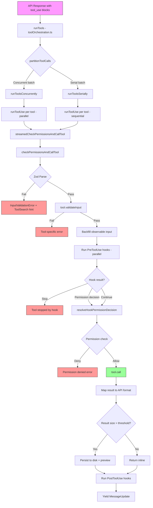
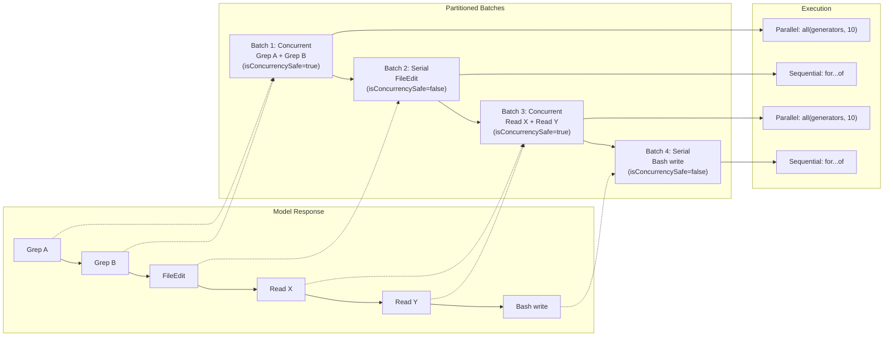
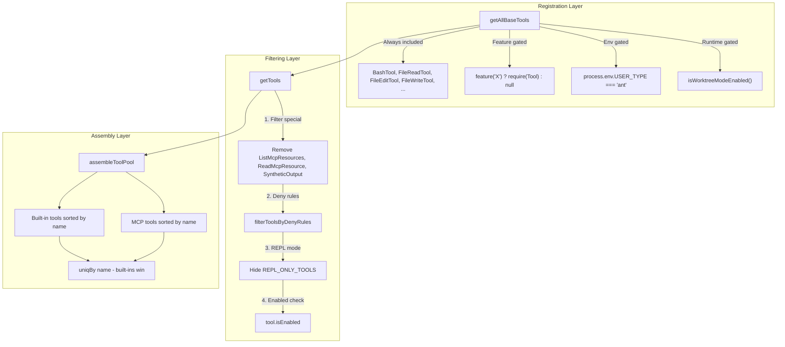
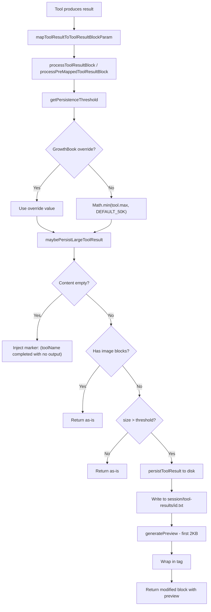

# Research Document: The Tool System

> Source codebase: Claude Code CLI
> Files analyzed: `src/Tool.ts`, `src/tools.ts`, `src/services/tools/toolOrchestration.ts`, `src/services/tools/toolExecution.ts`, `src/tools/BashTool/BashTool.tsx`, `src/tools/FileReadTool/FileReadTool.ts`, `src/tools/FileEditTool/FileEditTool.ts`, `src/tools/GlobTool/GlobTool.ts`, `src/tools/GrepTool/GrepTool.ts`, `src/tools/WebFetchTool/WebFetchTool.ts`, `src/tools/ToolSearchTool/ToolSearchTool.ts`, `src/tools/shared/gitOperationTracking.ts`, `src/utils/toolResultStorage.ts`, `src/constants/toolLimits.ts`

---

## 1. Tool Interface

The entire tool system is built around a single generic interface, `Tool<Input, Output, Progress>`, defined in `src/Tool.ts`. Every tool -- built-in, MCP, or dynamically loaded -- must conform to this contract.

### 1.1 The `Tool<I, O, P>` Type (Complete Definition)

```typescript
export type Tool<
  Input extends AnyObject = AnyObject,
  Output = unknown,
  P extends ToolProgressData = ToolProgressData,
> = {
  // --- Identity ---
  readonly name: string
  aliases?: string[]                    // Backwards compatibility for renamed tools
  searchHint?: string                   // 3-10 word phrase for ToolSearch keyword matching

  // --- Schema ---
  readonly inputSchema: Input           // Zod schema for input validation
  readonly inputJSONSchema?: ToolInputJSONSchema  // MCP tools: raw JSON Schema
  outputSchema?: z.ZodType<unknown>     // Optional output schema (TODO: make required)

  // --- Core execution ---
  call(
    args: z.infer<Input>,
    context: ToolUseContext,
    canUseTool: CanUseToolFn,
    parentMessage: AssistantMessage,
    onProgress?: ToolCallProgress<P>,
  ): Promise<ToolResult<Output>>

  // --- Permission & Validation ---
  validateInput?(input: z.infer<Input>, context: ToolUseContext): Promise<ValidationResult>
  checkPermissions(input: z.infer<Input>, context: ToolUseContext): Promise<PermissionResult>
  preparePermissionMatcher?(input: z.infer<Input>): Promise<(pattern: string) => boolean>

  // --- Behavioral declarations ---
  isEnabled(): boolean
  isConcurrencySafe(input: z.infer<Input>): boolean
  isReadOnly(input: z.infer<Input>): boolean
  isDestructive?(input: z.infer<Input>): boolean
  interruptBehavior?(): 'cancel' | 'block'
  isSearchOrReadCommand?(input: z.infer<Input>): { isSearch: boolean; isRead: boolean; isList?: boolean }
  isOpenWorld?(input: z.infer<Input>): boolean
  requiresUserInteraction?(): boolean
  inputsEquivalent?(a: z.infer<Input>, b: z.infer<Input>): boolean

  // --- Descriptors / Prompts ---
  description(input: z.infer<Input>, options: { ... }): Promise<string>
  prompt(options: {
    getToolPermissionContext: () => Promise<ToolPermissionContext>
    tools: Tools
    agents: AgentDefinition[]
    allowedAgentTypes?: string[]
  }): Promise<string>
  userFacingName(input: Partial<z.infer<Input>> | undefined): string
  userFacingNameBackgroundColor?(input: ...): keyof Theme | undefined
  getToolUseSummary?(input: ...): string | null
  getActivityDescription?(input: ...): string | null
  toAutoClassifierInput(input: z.infer<Input>): unknown

  // --- Result handling ---
  maxResultSizeChars: number
  mapToolResultToToolResultBlockParam(content: Output, toolUseID: string): ToolResultBlockParam
  backfillObservableInput?(input: Record<string, unknown>): void
  getPath?(input: z.infer<Input>): string

  // --- Rendering ---
  renderToolUseMessage(input: Partial<z.infer<Input>>, options: { ... }): React.ReactNode
  renderToolResultMessage?( ... ): React.ReactNode
  renderToolUseProgressMessage?( ... ): React.ReactNode
  renderToolUseQueuedMessage?(): React.ReactNode
  renderToolUseRejectedMessage?( ... ): React.ReactNode
  renderToolUseErrorMessage?( ... ): React.ReactNode
  renderGroupedToolUse?( ... ): React.ReactNode | null
  renderToolUseTag?(input: ...): React.ReactNode
  isResultTruncated?(output: Output): boolean
  extractSearchText?(out: Output): string
  isTransparentWrapper?(): boolean

  // --- Deferred / Lazy loading ---
  readonly shouldDefer?: boolean
  readonly alwaysLoad?: boolean

  // --- MCP/LSP flags ---
  isMcp?: boolean
  isLsp?: boolean
  mcpInfo?: { serverName: string; toolName: string }

  // --- Strict mode ---
  readonly strict?: boolean
}
```

### 1.2 `ToolUseContext` (Complete Definition)

`ToolUseContext` is the ambient context carried through every tool invocation. It provides access to application state, abort signaling, file caching, and numerous callbacks.

```typescript
export type ToolUseContext = {
  options: {
    commands: Command[]
    debug: boolean
    mainLoopModel: string
    tools: Tools
    verbose: boolean
    thinkingConfig: ThinkingConfig
    mcpClients: MCPServerConnection[]
    mcpResources: Record<string, ServerResource[]>
    isNonInteractiveSession: boolean
    agentDefinitions: AgentDefinitionsResult
    maxBudgetUsd?: number
    customSystemPrompt?: string
    appendSystemPrompt?: string
    querySource?: QuerySource
    refreshTools?: () => Tools
  }
  abortController: AbortController
  readFileState: FileStateCache
  getAppState(): AppState
  setAppState(f: (prev: AppState) => AppState): void
  setAppStateForTasks?: (f: (prev: AppState) => AppState) => void
  handleElicitation?: ( ... ) => Promise<ElicitResult>
  setToolJSX?: SetToolJSXFn
  addNotification?: (notif: Notification) => void
  appendSystemMessage?: ( ... ) => void
  sendOSNotification?: (opts: { message: string; notificationType: string }) => void
  nestedMemoryAttachmentTriggers?: Set<string>
  loadedNestedMemoryPaths?: Set<string>
  dynamicSkillDirTriggers?: Set<string>
  discoveredSkillNames?: Set<string>
  userModified?: boolean
  setInProgressToolUseIDs: (f: (prev: Set<string>) => Set<string>) => void
  setHasInterruptibleToolInProgress?: (v: boolean) => void
  setResponseLength: (f: (prev: number) => number) => void
  pushApiMetricsEntry?: (ttftMs: number) => void
  setStreamMode?: (mode: SpinnerMode) => void
  onCompactProgress?: (event: CompactProgressEvent) => void
  setSDKStatus?: (status: SDKStatus) => void
  openMessageSelector?: () => void
  updateFileHistoryState: ( ... ) => void
  updateAttributionState: ( ... ) => void
  setConversationId?: (id: UUID) => void
  agentId?: AgentId
  agentType?: string
  requireCanUseTool?: boolean
  messages: Message[]
  fileReadingLimits?: { maxTokens?: number; maxSizeBytes?: number }
  globLimits?: { maxResults?: number }
  toolDecisions?: Map<string, { source: string; decision: 'accept' | 'reject'; timestamp: number }>
  queryTracking?: QueryChainTracking
  requestPrompt?: ( ... ) => (request: PromptRequest) => Promise<PromptResponse>
  toolUseId?: string
  criticalSystemReminder_EXPERIMENTAL?: string
  preserveToolUseResults?: boolean
  localDenialTracking?: DenialTrackingState
  contentReplacementState?: ContentReplacementState
  renderedSystemPrompt?: SystemPrompt
}
```

**Key architectural insight**: `ToolUseContext` is an immutable-by-convention bag. Modifications flow through functional updaters (`setAppState`, `setInProgressToolUseIDs`). The `contextModifier` field on `ToolResult` enables tools to chain context changes for serial execution, but these modifiers are only honored for tools that are NOT concurrency-safe.

### 1.3 `ToolResult<T>` Type

```typescript
export type ToolResult<T> = {
  data: T
  newMessages?: (UserMessage | AssistantMessage | AttachmentMessage | SystemMessage)[]
  contextModifier?: (context: ToolUseContext) => ToolUseContext
  mcpMeta?: {
    _meta?: Record<string, unknown>
    structuredContent?: Record<string, unknown>
  }
}
```

`contextModifier` is the mechanism by which tool execution feeds back into the execution environment. This is critical: it is only applied for tools in serial batches. Concurrent tools queue their context modifiers and apply them in block order after all finish.

### 1.4 `ValidationResult` Type

```typescript
export type ValidationResult =
  | { result: true }
  | { result: false; message: string; errorCode: number }
```

### 1.5 `ToolPermissionContext` Type

```typescript
export type ToolPermissionContext = DeepImmutable<{
  mode: PermissionMode
  additionalWorkingDirectories: Map<string, AdditionalWorkingDirectory>
  alwaysAllowRules: ToolPermissionRulesBySource
  alwaysDenyRules: ToolPermissionRulesBySource
  alwaysAskRules: ToolPermissionRulesBySource
  isBypassPermissionsModeAvailable: boolean
  isAutoModeAvailable?: boolean
  strippedDangerousRules?: ToolPermissionRulesBySource
  shouldAvoidPermissionPrompts?: boolean
  awaitAutomatedChecksBeforeDialog?: boolean
  prePlanMode?: PermissionMode
}>
```

### 1.6 Helper Types and Functions

```typescript
export type Tools = readonly Tool[]         // Branded array type for tracking
export type AnyObject = z.ZodType<{ [key: string]: unknown }>

export function toolMatchesName(tool: { name: string; aliases?: string[] }, name: string): boolean
export function findToolByName(tools: Tools, name: string): Tool | undefined
```

---

## 2. buildTool() Factory

### 2.1 Purpose

`buildTool()` is the sole factory for creating `Tool` instances. It fills in safe defaults for commonly-stubbed methods so that tool definitions remain concise while the resulting `Tool` objects are always complete.

### 2.2 Defaultable Keys

```typescript
type DefaultableToolKeys =
  | 'isEnabled'
  | 'isConcurrencySafe'
  | 'isReadOnly'
  | 'isDestructive'
  | 'checkPermissions'
  | 'toAutoClassifierInput'
  | 'userFacingName'
```

### 2.3 Default Values (Fail-Closed)

```typescript
const TOOL_DEFAULTS = {
  isEnabled: () => true,
  isConcurrencySafe: (_input?: unknown) => false,     // Assume NOT safe
  isReadOnly: (_input?: unknown) => false,             // Assume writes
  isDestructive: (_input?: unknown) => false,
  checkPermissions: (input, _ctx?) =>
    Promise.resolve({ behavior: 'allow', updatedInput: input }),  // Defer to general system
  toAutoClassifierInput: (_input?) => '',              // Skip classifier
  userFacingName: (_input?) => '',
}
```

**Design principle**: Defaults are fail-closed where it matters for safety. A tool that forgets to declare `isConcurrencySafe` is treated as serial-only. A tool that forgets `isReadOnly` is treated as a write. This prevents accidental parallel execution of tools with side effects.

### 2.4 ToolDef Type (What Authors Write)

```typescript
export type ToolDef<Input, Output, P> =
  Omit<Tool<Input, Output, P>, DefaultableToolKeys> &
  Partial<Pick<Tool<Input, Output, P>, DefaultableToolKeys>>
```

### 2.5 BuiltTool Type (What Callers Receive)

```typescript
type BuiltTool<D> = Omit<D, DefaultableToolKeys> & {
  [K in DefaultableToolKeys]-?: K extends keyof D
    ? undefined extends D[K] ? ToolDefaults[K] : D[K]
    : ToolDefaults[K]
}
```

### 2.6 Implementation

```typescript
export function buildTool<D extends AnyToolDef>(def: D): BuiltTool<D> {
  return {
    ...TOOL_DEFAULTS,
    userFacingName: () => def.name,  // Name-derived default
    ...def,                          // Author overrides win
  } as BuiltTool<D>
}
```

The spread order ensures: TOOL_DEFAULTS first, then a dynamic `userFacingName` that reads the tool's name, then the author's definition. TypeScript's `BuiltTool<D>` mapped type mirrors this spread at the type level.

---

## 3. Tool Registration

### 3.1 `getAllBaseTools()` -- The Master Registry

Located in `src/tools.ts`, this function returns the exhaustive list of all tools available in the current environment. It is the **single source of truth**.

```typescript
export function getAllBaseTools(): Tools {
  return [
    AgentTool,
    TaskOutputTool,
    BashTool,
    ...(hasEmbeddedSearchTools() ? [] : [GlobTool, GrepTool]),
    ExitPlanModeV2Tool,
    FileReadTool,
    FileEditTool,
    FileWriteTool,
    NotebookEditTool,
    WebFetchTool,
    TodoWriteTool,
    WebSearchTool,
    TaskStopTool,
    AskUserQuestionTool,
    SkillTool,
    EnterPlanModeTool,
    // ... 30+ conditional tools via feature gates ...
    ...(isToolSearchEnabledOptimistic() ? [ToolSearchTool] : []),
  ]
}
```

### 3.2 Feature Gate Patterns

The codebase uses multiple gate mechanisms for conditional tool inclusion:

| Pattern | Example | Mechanism |
|---------|---------|-----------|
| `feature('FLAG')` | `feature('PROACTIVE')` | Bun bundle-time dead code elimination |
| `process.env.USER_TYPE` | `=== 'ant'` | Runtime environment check |
| `isEnvTruthy()` | `ENABLE_LSP_TOOL` | Truthy env var check |
| Utility functions | `isWorktreeModeEnabled()` | Complex runtime logic |
| `require()` conditional | `feature('X') ? require(...) : null` | Lazy-loaded with DCE |

**Ant-only tools** (Anthropic internal): `ConfigTool`, `TungstenTool`, `SuggestBackgroundPRTool`, `REPLTool`. These use `process.env.USER_TYPE === 'ant'` or conditional `require()`.

**Feature-gated tools**: `SleepTool` (PROACTIVE/KAIROS), `CronTools` (AGENT_TRIGGERS), `WebBrowserTool` (WEB_BROWSER_TOOL), `SnipTool` (HISTORY_SNIP), `WorkflowTool` (WORKFLOW_SCRIPTS).

### 3.3 `getTools()` -- Permission-Filtered Tools

```typescript
export const getTools = (permissionContext: ToolPermissionContext): Tools => {
  // CLAUDE_CODE_SIMPLE mode: only Bash, Read, Edit
  if (isEnvTruthy(process.env.CLAUDE_CODE_SIMPLE)) {
    // ... minimal tool set
  }
  // Full mode:
  const tools = getAllBaseTools().filter(tool => !specialTools.has(tool.name))
  let allowedTools = filterToolsByDenyRules(tools, permissionContext)
  // REPL mode: hide primitives that REPL wraps
  if (isReplModeEnabled()) { ... }
  // Filter by isEnabled()
  return allowedTools.filter((_, i) => isEnabled[i])
}
```

**Three filtering stages**:
1. **Deny rules**: `filterToolsByDenyRules()` removes blanket-denied tools before the model ever sees them.
2. **REPL mode**: When REPL is active, primitive tools (Bash, Read, Edit, etc.) are hidden -- REPL wraps them internally.
3. **isEnabled()**: Per-tool runtime enablement check.

### 3.4 `assembleToolPool()` -- Full Pool Assembly

```typescript
export function assembleToolPool(
  permissionContext: ToolPermissionContext,
  mcpTools: Tools,
): Tools {
  const builtInTools = getTools(permissionContext)
  const allowedMcpTools = filterToolsByDenyRules(mcpTools, permissionContext)
  // Sort each partition for prompt-cache stability
  const byName = (a: Tool, b: Tool) => a.name.localeCompare(b.name)
  return uniqBy(
    [...builtInTools].sort(byName).concat(allowedMcpTools.sort(byName)),
    'name',
  )
}
```

**Prompt cache stability**: Built-in tools are kept as a contiguous sorted prefix. MCP tools follow as a separate sorted partition. This prevents cache invalidation when MCP tools are added/removed -- the built-in prefix remains stable across sessions.

### 3.5 `filterToolsByDenyRules()` -- Pre-Model Filtering

```typescript
export function filterToolsByDenyRules<T extends { name: string; mcpInfo?: ... }>(
  tools: readonly T[],
  permissionContext: ToolPermissionContext,
): T[] {
  return tools.filter(tool => !getDenyRuleForTool(permissionContext, tool))
}
```

This uses the same matcher as runtime permission checks. MCP server-prefix rules like `mcp__server` strip all tools from that server before the model sees them.

---

## 4. Execution Pipeline

### 4.1 Overview Flow

The execution pipeline spans two files:
- `toolOrchestration.ts`: partitioning and batch coordination
- `toolExecution.ts`: individual tool execution with permission checks, hooks, and telemetry

### 4.2 `runTools()` -- Top-Level Entry Point

```typescript
export async function* runTools(
  toolUseMessages: ToolUseBlock[],
  assistantMessages: AssistantMessage[],
  canUseTool: CanUseToolFn,
  toolUseContext: ToolUseContext,
): AsyncGenerator<MessageUpdate, void> {
  let currentContext = toolUseContext
  for (const { isConcurrencySafe, blocks } of partitionToolCalls(...)) {
    if (isConcurrencySafe) {
      // Run concurrently, queue context modifiers
      for await (const update of runToolsConcurrently(...)) { ... }
      // Apply queued context modifiers in block order
    } else {
      // Run serially, apply context modifiers immediately
      for await (const update of runToolsSerially(...)) { ... }
    }
  }
}
```

**Key design**: The function is an async generator. It yields `MessageUpdate` objects (message + new context) as tools complete, enabling streaming UI updates.

### 4.3 `runToolUse()` -- Per-Tool Entry

Located in `toolExecution.ts`, this handles a single tool use block:

```
1. Find tool by name (primary name, then aliases for deprecated names)
2. Check abort signal
3. Delegate to streamedCheckPermissionsAndCallTool()
```

When a tool is not found:
- It first checks `getAllBaseTools()` for alias matches (deprecated tools)
- If still not found, yields an error tool_result message

### 4.4 `checkPermissionsAndCallTool()` -- The Core Pipeline

This ~600-line function is the heart of tool execution. The complete pipeline:

```
Phase 1: Input Validation
  1. Zod schema validation (safeParse)
     - If deferred tool schema wasn't sent, appends ToolSearch hint
  2. Tool-specific validateInput()
     - Tool-specific logic (e.g., FileEdit checks file exists, old_string found)

Phase 2: Input Preparation
  3. Speculative bash classifier start (parallel with hooks)
  4. Strip _simulatedSedEdit from model-provided input (defense-in-depth)
  5. Backfill observable input (shallow clone for hooks/canUseTool)

Phase 3: Pre-Tool Hooks
  6. Run PreToolUse hooks (parallel)
     - May produce: hookPermissionResult, hookUpdatedInput, preventContinuation, stop

Phase 4: Permission Resolution
  7. Start OTel tool span
  8. resolveHookPermissionDecision()
     - Combines hook result with canUseTool interactive check
  9. Log tool_decision OTel event
  10. Handle permission denial (error message, PermissionDenied hooks)

Phase 5: Tool Execution
  11. Reconcile callInput (restore model's original file_path if unchanged)
  12. Start session activity tracking
  13. Call tool.call() with onProgress callback
  14. Track execution duration

Phase 6: Post-Execution
  15. Map result to API format (mapToolResultToToolResultBlockParam)
  16. Process tool result (persist large results to disk)
  17. Add accept feedback / content blocks from permission decision
  18. Run PostToolUse hooks (may modify MCP tool output)
  19. Add newMessages from tool result
  20. Handle shouldPreventContinuation from pre-hooks
```

### 4.5 `streamedCheckPermissionsAndCallTool()` -- Stream Adapter

This function bridges the async `checkPermissionsAndCallTool()` with the generator-based pipeline. It uses a `Stream` (custom async iterable) to merge progress events and final results into a single stream:

```typescript
function streamedCheckPermissionsAndCallTool( ... ): AsyncIterable<MessageUpdateLazy> {
  const stream = new Stream<MessageUpdateLazy>()
  checkPermissionsAndCallTool( ... ,
    progress => {
      stream.enqueue({ message: createProgressMessage({ ... }) })
    },
  )
    .then(results => { for (const r of results) stream.enqueue(r) })
    .catch(error => { stream.error(error) })
    .finally(() => { stream.done() })
  return stream
}
```

### 4.6 Error Handling Strategy

Errors at each phase produce different results:

| Phase | Error Type | Result |
|-------|-----------|--------|
| Tool not found | Missing tool | `is_error: true` with "No such tool available" |
| Abort signal | AbortError | `CANCEL_MESSAGE` tool_result |
| Zod validation | InputValidationError | `is_error: true` with formatted Zod error |
| Tool validation | ValidationResult.false | `is_error: true` with tool-specific message |
| Permission denied | deny behavior | `is_error: true` with denial message |
| Tool execution | Any Error | `is_error: true` with formatted error |
| MCP auth error | McpAuthError | Updates MCP client status to 'needs-auth' |

---

## 5. Concurrency Model

### 5.1 Partitioning Algorithm

```typescript
function partitionToolCalls(
  toolUseMessages: ToolUseBlock[],
  toolUseContext: ToolUseContext,
): Batch[] {
  return toolUseMessages.reduce((acc: Batch[], toolUse) => {
    const tool = findToolByName(toolUseContext.options.tools, toolUse.name)
    const parsedInput = tool?.inputSchema.safeParse(toolUse.input)
    const isConcurrencySafe = parsedInput?.success
      ? tool?.isConcurrencySafe(parsedInput.data) ?? false
      : false
    if (isConcurrencySafe && acc[acc.length - 1]?.isConcurrencySafe) {
      acc[acc.length - 1]!.blocks.push(toolUse)  // Merge into current batch
    } else {
      acc.push({ isConcurrencySafe, blocks: [toolUse] })  // Start new batch
    }
    return acc
  }, [])
}
```

**Design**: Consecutive concurrency-safe tools are merged into a single batch. A non-safe tool always starts a new batch of size 1. If `isConcurrencySafe()` throws (e.g., shell-quote parse failure), it defaults to `false` (conservative).

### 5.2 Concurrency Safety Declarations Per Tool

| Tool | isConcurrencySafe | isReadOnly | Rationale |
|------|------------------|------------|-----------|
| BashTool | `this.isReadOnly(input)` | Checks `checkReadOnlyConstraints` | Only read-only commands are concurrent |
| FileReadTool | `true` | `true` | Pure read |
| FileEditTool | default (`false`) | default (`false`) | Writes files |
| GlobTool | `true` | `true` | Pure search |
| GrepTool | `true` | `true` | Pure search |
| WebFetchTool | `true` | `true` | Network read |

### 5.3 Serial Execution

```typescript
async function* runToolsSerially( ... ) {
  let currentContext = toolUseContext
  for (const toolUse of toolUseMessages) {
    // Mark as in-progress
    for await (const update of runToolUse( ... )) {
      if (update.contextModifier) {
        currentContext = update.contextModifier.modifyContext(currentContext)
      }
      yield { message: update.message, newContext: currentContext }
    }
    // Mark as complete
  }
}
```

Context modifiers are applied immediately between serial tools. This allows one tool's side effects to be visible to the next.

### 5.4 Concurrent Execution

```typescript
async function* runToolsConcurrently( ... ) {
  yield* all(
    toolUseMessages.map(async function* (toolUse) { ... }),
    getMaxToolUseConcurrency(),  // Default: 10
  )
}
```

Uses a `utils/generators.ts` `all()` helper that runs N async generators concurrently with a concurrency limit. Context modifiers are **queued** during concurrent execution and applied in block order after all tools complete.

### 5.5 Concurrency Limit

```typescript
function getMaxToolUseConcurrency(): number {
  return parseInt(process.env.CLAUDE_CODE_MAX_TOOL_USE_CONCURRENCY || '', 10) || 10
}
```

Configurable via environment variable, defaults to 10.

---

## 6. Result Budgeting

### 6.1 Constants

From `src/constants/toolLimits.ts`:

```typescript
export const DEFAULT_MAX_RESULT_SIZE_CHARS = 50_000    // Global cap
export const MAX_TOOL_RESULT_TOKENS = 100_000          // ~400KB
export const BYTES_PER_TOKEN = 4
export const MAX_TOOL_RESULT_BYTES = 400_000           // Derived
export const MAX_TOOL_RESULTS_PER_MESSAGE_CHARS = 200_000  // Per-message aggregate
export const TOOL_SUMMARY_MAX_LENGTH = 50
```

### 6.2 Per-Tool `maxResultSizeChars` Settings

| Tool | maxResultSizeChars | Rationale |
|------|-------------------|-----------|
| BashTool | 30,000 | Moderate output |
| FileReadTool | **Infinity** | Self-bounds via maxTokens; persisting creates circular Read loop |
| FileEditTool | 100,000 | Diffs can be large |
| GlobTool | 100,000 | Many file paths |
| GrepTool | 20,000 | Bounded by head_limit default (250) |
| WebFetchTool | 100,000 | Web pages can be large |

### 6.3 Persistence Threshold Resolution

```typescript
export function getPersistenceThreshold(
  toolName: string,
  declaredMaxResultSizeChars: number,
): number {
  // Infinity = hard opt-out (FileReadTool)
  if (!Number.isFinite(declaredMaxResultSizeChars)) return declaredMaxResultSizeChars
  // GrowthBook override wins when present
  const override = overrides?.[toolName]
  if (typeof override === 'number' && override > 0) return override
  // Clamp to global default
  return Math.min(declaredMaxResultSizeChars, DEFAULT_MAX_RESULT_SIZE_CHARS)
}
```

### 6.4 Disk Persistence Flow

When a tool result exceeds its persistence threshold:

```typescript
async function maybePersistLargeToolResult(
  toolResultBlock, toolName, persistenceThreshold
): Promise<ToolResultBlockParam> {
  // 1. Check for empty content (inject marker to prevent model stop-sequence)
  if (isToolResultContentEmpty(content)) {
    return { ...toolResultBlock, content: `(${toolName} completed with no output)` }
  }
  // 2. Skip persistence for image content
  if (hasImageBlock(content)) return toolResultBlock
  // 3. Check size vs threshold
  if (size <= threshold) return toolResultBlock
  // 4. Persist to disk
  const result = await persistToolResult(content, toolResultBlock.tool_use_id)
  // 5. Build preview message
  const message = buildLargeToolResultMessage(result)
  return { ...toolResultBlock, content: message }
}
```

### 6.5 Persisted Result Format

```typescript
export function buildLargeToolResultMessage(result: PersistedToolResult): string {
  // Output:
  // <persisted-output>
  // Output too large (42.3 KB). Full output saved to: /path/to/file.txt
  //
  // Preview (first 2.0 KB):
  // [first 2000 bytes of content]
  // ...
  // </persisted-output>
}
```

Files are stored at `{projectDir}/{sessionId}/tool-results/{toolUseId}.{txt|json}`.

### 6.6 Content Replacement State (Aggregate Budget)

```typescript
export type ContentReplacementState = {
  seenIds: Set<string>           // Results that passed the budget check
  replacements: Map<string, string>  // Persisted results -> preview strings
}
```

This state is:
- Provisioned once per conversation thread
- Never reset (stale UUID keys are inert)
- Cloned for subagents (cache-sharing forks need identical decisions)
- Ensures prompt-cache stability: once a result's fate is decided, it's frozen

### 6.7 Empty Result Handling

```typescript
// Empty tool_result at prompt tail causes models to emit stop sequences.
// Inject marker for every empty result:
if (isToolResultContentEmpty(content)) {
  return { ...toolResultBlock, content: `(${toolName} completed with no output)` }
}
```

---

## 7. Progress Reporting

### 7.1 Progress Type Hierarchy

```typescript
// From Tool.ts
export type ToolProgress<P extends ToolProgressData> = {
  toolUseID: string
  data: P
}

export type ToolCallProgress<P extends ToolProgressData = ToolProgressData> = (
  progress: ToolProgress<P>,
) => void

export type Progress = ToolProgressData | HookProgress
```

The `ToolProgressData` type is defined in `types/tools.ts` (bundle-generated) and includes discriminated union variants:

- `BashProgress` (type: 'bash_progress') -- output, fullOutput, elapsedTimeSeconds, totalLines, totalBytes, taskId, timeoutMs
- `MCPProgress` -- MCP tool execution progress
- `AgentToolProgress` -- Subagent execution progress
- `WebSearchProgress` -- Web search progress
- `TaskOutputProgress` -- Task output streaming
- `SkillToolProgress` -- Skill execution progress
- `REPLToolProgress` -- REPL tool progress

### 7.2 BashTool Progress Reporting

```typescript
// From BashTool.tsx call():
do {
  generatorResult = await commandGenerator.next();
  if (!generatorResult.done && onProgress) {
    onProgress({
      toolUseID: `bash-progress-${progressCounter++}`,
      data: {
        type: 'bash_progress',
        output: progress.output,
        fullOutput: progress.fullOutput,
        elapsedTimeSeconds: progress.elapsedTimeSeconds,
        totalLines: progress.totalLines,
        totalBytes: progress.totalBytes,
        taskId: progress.taskId,
        timeoutMs: progress.timeoutMs,
      },
    });
  }
} while (!generatorResult.done);
```

Progress is only shown after `PROGRESS_THRESHOLD_MS = 2000` (2 seconds).

### 7.3 Progress Flow Through the Pipeline

```
Tool.call(onProgress)
  -> streamedCheckPermissionsAndCallTool(onToolProgress)
    -> stream.enqueue(createProgressMessage(...))
      -> runToolsConcurrently/runToolsSerially yields MessageUpdate
        -> UI renders progress via renderToolUseProgressMessage()
```

### 7.4 Hook Progress

Pre/Post hooks also emit progress through the same pipeline:

```typescript
// In checkPermissionsAndCallTool:
for await (const result of runPreToolUseHooks(...)) {
  switch (result.type) {
    case 'message':
      if (result.message.message.type === 'progress') {
        onToolProgress(result.message.message)
      }
      break
  }
}
```

Hook timing is tracked and displayed inline when > 500ms (`HOOK_TIMING_DISPLAY_THRESHOLD_MS`).

---

## 8. Deferred Tools

### 8.1 Concept

When the tool count exceeds a threshold, Claude Code switches to a "deferred tools" mode. Deferred tools send only their name to the API (with `defer_loading: true`). The model must use `ToolSearch` to load the full schema before calling a deferred tool.

### 8.2 `isDeferredTool()` Logic

```typescript
export function isDeferredTool(tool: Tool): boolean {
  // Explicit opt-out (MCP _meta['anthropic/alwaysLoad'])
  if (tool.alwaysLoad === true) return false
  // MCP tools are always deferred
  if (tool.isMcp === true) return true
  // Never defer ToolSearch itself
  if (tool.name === TOOL_SEARCH_TOOL_NAME) return false
  // Never defer AgentTool when fork-first is enabled
  if (feature('FORK_SUBAGENT') && tool.name === AGENT_TOOL_NAME) {
    if (isForkSubagentEnabled()) return false
  }
  // Never defer Brief (communication channel)
  if (BRIEF_TOOL_NAME && tool.name === BRIEF_TOOL_NAME) return false
  // Check tool.shouldDefer flag
  return tool.shouldDefer === true
}
```

### 8.3 Tools With `shouldDefer: true`

From the codebase analysis:
- `WebFetchTool` -- `shouldDefer: true`
- MCP tools -- always deferred by isMcp check
- Various other optional tools declare shouldDefer

### 8.4 ToolSearchTool Implementation

```typescript
export const ToolSearchTool = buildTool({
  name: TOOL_SEARCH_TOOL_NAME,  // 'ToolSearch'
  inputSchema: z.object({
    query: z.string().describe('Query to find deferred tools...'),
    max_results: z.number().optional().default(5),
  }),
  // ...
})
```

**Search capabilities**:
- `"select:Read,Edit,Grep"` -- Direct tool selection by name
- `"notebook jupyter"` -- Keyword search against tool descriptions
- `"+slack send"` -- Require "slack" in name, rank by remaining terms

**Scoring algorithm**: The tool parses names (CamelCase splitting, MCP prefix splitting) and matches against the searchHint, tool description, and name parts. Results are scored and ranked.

### 8.5 Schema Not Sent Hint

When a deferred tool is called without its schema being loaded:

```typescript
export function buildSchemaNotSentHint(tool, messages, tools): string | null {
  if (!isDeferredTool(tool)) return null
  const discovered = extractDiscoveredToolNames(messages)
  if (discovered.has(tool.name)) return null
  return `This tool's schema was not sent to the API...
    Load the tool first: call ${TOOL_SEARCH_TOOL_NAME} with query "select:${tool.name}"`
}
```

This hint is appended to Zod validation errors for deferred tools, guiding the model to load the schema first.

---

## 9. Built-in Tools Analysis

### 9.1 BashTool

**File**: `src/tools/BashTool/BashTool.tsx`
**Name**: `'Bash'`
**maxResultSizeChars**: 30,000

**Input Schema**:
```typescript
z.strictObject({
  command: z.string(),
  timeout: semanticNumber(z.number().optional()),
  description: z.string().optional(),
  run_in_background: semanticBoolean(z.boolean().optional()),
  dangerouslyDisableSandbox: semanticBoolean(z.boolean().optional()),
  _simulatedSedEdit: z.object({ filePath: z.string(), newContent: z.string() }).optional()
    // Internal only -- stripped from model-facing schema
})
```

**Output Schema**:
```typescript
z.object({
  stdout: z.string(),
  stderr: z.string(),
  rawOutputPath: z.string().optional(),
  interrupted: z.boolean(),
  isImage: z.boolean().optional(),
  backgroundTaskId: z.string().optional(),
  backgroundedByUser: z.boolean().optional(),
  assistantAutoBackgrounded: z.boolean().optional(),
  dangerouslyDisableSandbox: z.boolean().optional(),
  returnCodeInterpretation: z.string().optional(),
  noOutputExpected: z.boolean().optional(),
  structuredContent: z.array(z.any()).optional(),
  persistedOutputPath: z.string().optional(),
  persistedOutputSize: z.number().optional(),
})
```

**Concurrency**: `isConcurrencySafe(input)` delegates to `isReadOnly(input)`, which calls `checkReadOnlyConstraints()`. Only read-only commands (cat, ls, git status, etc.) run concurrently.

**Permission flow**: Delegates to `bashToolHasPermission()` which implements complex logic including:
- Speculative classifier check (started in parallel before hooks)
- Prefix-based rule matching for compound commands
- Shell-quote parsing for security analysis

**Command classification sets**:
```typescript
BASH_SEARCH_COMMANDS = ['find', 'grep', 'rg', 'ag', 'ack', 'locate', 'which', 'whereis']
BASH_READ_COMMANDS = ['cat', 'head', 'tail', 'less', 'more', 'wc', 'stat', 'file', 'strings', 'jq', 'awk', 'cut', 'sort', 'uniq', 'tr']
BASH_LIST_COMMANDS = ['ls', 'tree', 'du']
BASH_SILENT_COMMANDS = ['mv', 'cp', 'rm', 'mkdir', 'rmdir', 'chmod', 'chown', 'chgrp', 'touch', 'ln', 'cd', 'export', 'unset', 'wait']
BASH_SEMANTIC_NEUTRAL_COMMANDS = ['echo', 'printf', 'true', 'false', ':']
```

**Special features**:
- Background task support (`run_in_background`, `ASSISTANT_BLOCKING_BUDGET_MS = 15_000`)
- Sandbox mode (`shouldUseSandbox()`, `SandboxManager`)
- Simulated sed edit (pre-computed from permission preview)
- Git operation tracking
- Claude Code hints protocol (zero-token side channel)
- Image output detection and resizing
- Large output persistence (> 64MB truncated)

### 9.2 FileReadTool

**File**: `src/tools/FileReadTool/FileReadTool.ts`
**Name**: `'Read'`
**maxResultSizeChars**: **Infinity** (never persisted -- self-bounds via token limits)

**Input Schema**:
```typescript
z.strictObject({
  file_path: z.string(),
  offset: z.number().int().nonnegative().optional(),
  limit: z.number().int().positive().optional(),
  pages: z.string().optional(),  // PDF page range
})
```

**Output Schema** (discriminated union):
```typescript
z.discriminatedUnion('type', [
  z.object({ type: z.literal('text'), file: { filePath, content, numLines, startLine, totalLines } }),
  z.object({ type: z.literal('image'), file: { base64, type, originalSize, dimensions } }),
  z.object({ type: z.literal('notebook'), file: { filePath, cells } }),
  z.object({ type: z.literal('pdf'), file: { filePath, base64, originalSize } }),
  z.object({ type: z.literal('parts'), file: { filePath, originalSize, count, outputDir } }),
  z.object({ type: z.literal('file_unchanged'), file: { filePath } }),
])
```

**Key behaviors**:
- `isConcurrencySafe: true`, `isReadOnly: true`
- Blocked device paths: `/dev/zero`, `/dev/random`, `/dev/stdin`, etc.
- macOS screenshot path resolution (thin space vs regular space)
- File read listeners (observer pattern for notifications)
- Token limit validation (`MaxFileReadTokenExceededError`)
- Supports: text files, images (PNG/JPG/GIF/WEBP), Jupyter notebooks, PDFs

**Permission**: Uses `checkReadPermissionForTool()` with filesystem-level checks.

### 9.3 FileEditTool

**File**: `src/tools/FileEditTool/FileEditTool.ts`
**Name**: `'Edit'`
**maxResultSizeChars**: 100,000
**strict**: true

**Input Schema**:
```typescript
z.strictObject({
  file_path: z.string(),
  old_string: z.string(),
  new_string: z.string(),
  replace_all: z.boolean().optional().default(false),
})
```

**Validation checks** (in order):
1. Team memory secret detection
2. old_string === new_string rejection
3. Deny rule matching for file path
4. UNC path security check (Windows NTLM)
5. File size limit (1 GiB)
6. File existence (new file creation with empty old_string)
7. Notebook file detection (redirects to NotebookEditTool)
8. Read-before-write enforcement (`readFileState` cache)
9. File modification timestamp check
10. String-to-replace existence and uniqueness
11. Settings file validation

**Key behaviors**:
- `isConcurrencySafe: false` (default), `isReadOnly: false` (default)
- Quote style preservation (`findActualString`, `preserveQuoteStyle`)
- File history tracking for undo support
- LSP diagnostic clearing
- Skill directory discovery on edit

### 9.4 GlobTool

**File**: `src/tools/GlobTool/GlobTool.ts`
**Name**: `'Glob'`
**maxResultSizeChars**: 100,000

**Input Schema**:
```typescript
z.strictObject({
  pattern: z.string(),
  path: z.string().optional(),
})
```

**Output Schema**:
```typescript
z.object({
  durationMs: z.number(),
  numFiles: z.number(),
  filenames: z.array(z.string()),
  truncated: z.boolean(),
})
```

**Key behaviors**:
- `isConcurrencySafe: true`, `isReadOnly: true`
- Default result limit: 100 files (configurable via `globLimits`)
- Paths relativized to cwd to save tokens
- Permission: `checkReadPermissionForTool()`

### 9.5 GrepTool

**File**: `src/tools/GrepTool/GrepTool.ts`
**Name**: `'Grep'`
**maxResultSizeChars**: 20,000

**Input Schema** (rich parameter set):
```typescript
z.strictObject({
  pattern: z.string(),
  path: z.string().optional(),
  glob: z.string().optional(),
  output_mode: z.enum(['content', 'files_with_matches', 'count']).optional(),
  '-B': z.number().optional(),     // Lines before
  '-A': z.number().optional(),     // Lines after
  '-C': z.number().optional(),     // Context alias
  context: z.number().optional(),
  '-n': z.boolean().optional(),    // Line numbers
  '-i': z.boolean().optional(),    // Case insensitive
  type: z.string().optional(),     // File type filter
  head_limit: z.number().optional(),
  offset: z.number().optional(),
  multiline: z.boolean().optional(),
})
```

**Key behaviors**:
- Wraps ripgrep (`ripGrep()` utility)
- Default head_limit: 250 entries
- VCS directories auto-excluded: `.git`, `.svn`, `.hg`, `.bzr`, `.jj`, `.sl`
- Plugin cache glob exclusions
- `isConcurrencySafe: true`, `isReadOnly: true`

### 9.6 WebFetchTool

**File**: `src/tools/WebFetchTool/WebFetchTool.ts`
**Name**: `'WebFetch'`
**maxResultSizeChars**: 100,000
**shouldDefer**: true

**Input Schema**:
```typescript
z.strictObject({
  url: z.string().url(),
  prompt: z.string(),
})
```

**Permission model**:
- Preapproved hosts bypass permission entirely
- Domain-level permission rules (`domain:hostname`)
- Three-tier check: deny rules, ask rules, allow rules

**Key behaviors**:
- `isConcurrencySafe: true`, `isReadOnly: true`
- Fetches URL, converts to markdown, applies prompt
- Auth warning always included in prompt text
- Domain-based permission suggestions

### 9.7 ToolSearchTool

**Name**: `'ToolSearch'`
**Purpose**: Lazy-load deferred tool schemas

**Search modes**:
- Direct selection: `"select:Read,Edit,Grep"`
- Keyword search: `"notebook jupyter"`
- Name-required search: `"+slack send"`

**Caching**: Tool descriptions are memoized. Cache invalidated when deferred tool set changes.

---

## 10. Shared Utilities

### 10.1 Git Operation Tracking

**File**: `src/tools/shared/gitOperationTracking.ts`

Detects git operations in bash command output for metrics and UI:

```typescript
export function detectGitOperation(command: string, output: string): {
  commit?: { sha: string; kind: CommitKind }
  push?: { branch: string }
  branch?: { ref: string; action: BranchAction }
  pr?: { number: number; url?: string; action: PrAction }
}
```

**Detected operations**:
- `git commit` / `git commit --amend` / `git cherry-pick`
- `git push` (with branch extraction)
- `git merge` / `git rebase` (with ref extraction)
- `gh pr create/edit/merge/comment/close/ready` (with PR URL/number extraction)
- `glab mr create` (GitLab)
- curl-based PR creation

### 10.2 Lazy Schema Pattern

Tools use `lazySchema()` to defer Zod schema construction:

```typescript
const inputSchema = lazySchema(() =>
  z.strictObject({ ... })
)
```

This avoids constructing schemas at import time, reducing startup overhead.

### 10.3 Semantic Type Coercers

```typescript
semanticNumber(z.number().optional())   // Coerces "123" -> 123
semanticBoolean(z.boolean().optional()) // Coerces "true" -> true
```

These handle the model's tendency to emit string-typed values for numbers and booleans.

---

## 11. Mermaid Diagrams

### 11.1 Tool Execution Pipeline



### 11.2 Concurrency Partitioning



### 11.3 Tool Registration and Assembly



### 11.4 Result Budgeting Flow



---

## 12. Architectural Patterns and Design Decisions

### 12.1 Fail-Closed Defaults

The `buildTool()` factory defaults to the safest option for each behavioral flag:
- `isConcurrencySafe: false` -- prevents accidental parallel execution
- `isReadOnly: false` -- prevents accidental skip of write permissions
- `isDestructive: false` -- soft default, tools explicitly opt in
- `checkPermissions: allow` -- defers to the general permission system rather than blocking

### 12.2 Generator-Based Streaming

The entire orchestration layer uses async generators (`AsyncGenerator<MessageUpdate, void>`). This enables:
- Streaming UI updates as tools complete
- Backpressure (consumer controls iteration pace)
- Composable parallel/serial execution patterns

### 12.3 Observable Input Backfilling

The `backfillObservableInput` pattern solves a subtle problem: hooks and permission checks need normalized inputs (absolute paths), but the tool result must embed the model's original path for transcript stability. The solution:
1. Create a shallow clone of the input
2. Backfill derived fields on the clone (used by hooks)
3. Preserve the original input for `tool.call()` (used in results)
4. If hooks return a fresh `updatedInput`, use that instead

### 12.4 Speculative Permission Checking

For BashTool, the classifier check starts speculatively in parallel with hooks:
```typescript
if (tool.name === BASH_TOOL_NAME) {
  startSpeculativeClassifierCheck(
    command, toolPermissionContext, signal, isNonInteractiveSession
  )
}
```
This overlaps the classifier's network roundtrip with hook execution, reducing latency.

### 12.5 Prompt Cache Stability

Multiple design decisions optimize for API prompt cache hit rates:
- `assembleToolPool()` sorts tools alphabetically within partitions
- Built-in tools form a stable prefix; MCP tools are a separate suffix
- `ContentReplacementState` freezes persistence decisions per tool_use_id
- `isDeferredTool()` keeps critical tools (Agent, Brief) in the initial prompt

### 12.6 Defense in Depth

Security-sensitive fields are validated at multiple layers:
- `_simulatedSedEdit` is stripped from model input before processing
- UNC paths are blocked to prevent NTLM credential leaks on Windows
- Device paths (`/dev/zero`, `/dev/random`) are blocked in FileRead
- Team memory secrets are checked before file edits
- Read-before-write enforcement prevents blind overwrites

---

## 13. Key Type Relationships Summary

```
Tools (readonly Tool[])
  -> Tool<Input, Output, Progress>
    -> .call() returns ToolResult<Output>
      -> .data: Output (tool-specific)
      -> .contextModifier: ToolUseContext -> ToolUseContext
      -> .newMessages: Message[]
    -> .checkPermissions() returns PermissionResult
    -> .validateInput() returns ValidationResult
    -> .inputSchema: Zod schema
    -> .mapToolResultToToolResultBlockParam() returns ToolResultBlockParam

ToolUseContext
  -> .options.tools: Tools
  -> .abortController: AbortController
  -> .readFileState: FileStateCache
  -> .getAppState(): AppState -> .toolPermissionContext: ToolPermissionContext
  -> .contentReplacementState: ContentReplacementState

toolOrchestration.ts
  -> runTools() yields MessageUpdate { message, newContext }
  -> partitionToolCalls() returns Batch[]
  -> runToolsConcurrently/Serially() yields MessageUpdateLazy

toolExecution.ts
  -> runToolUse() yields MessageUpdateLazy
  -> checkPermissionsAndCallTool() returns MessageUpdateLazy[]
  -> processToolResultBlock() returns ToolResultBlockParam
```
