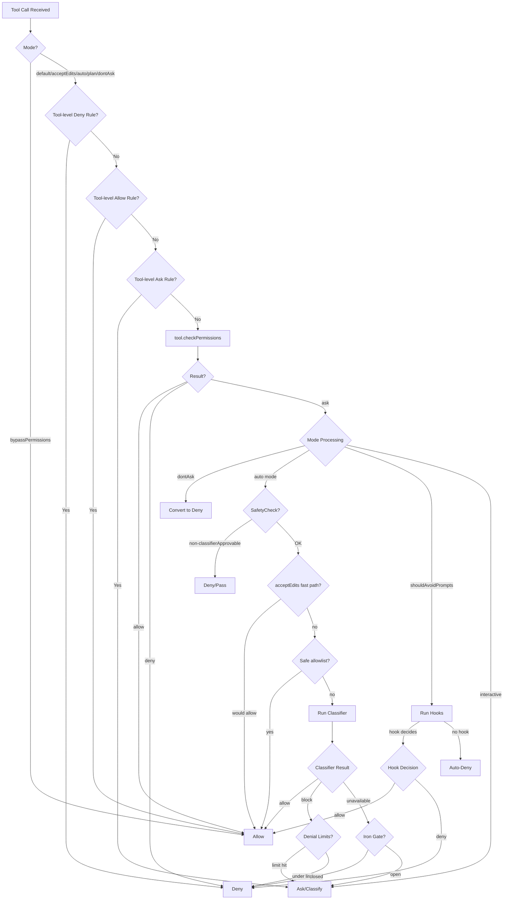
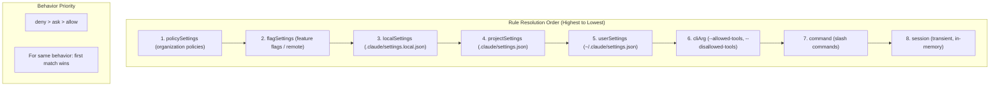
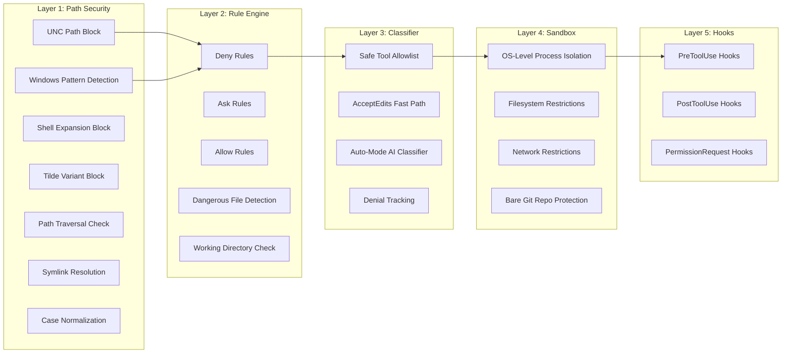
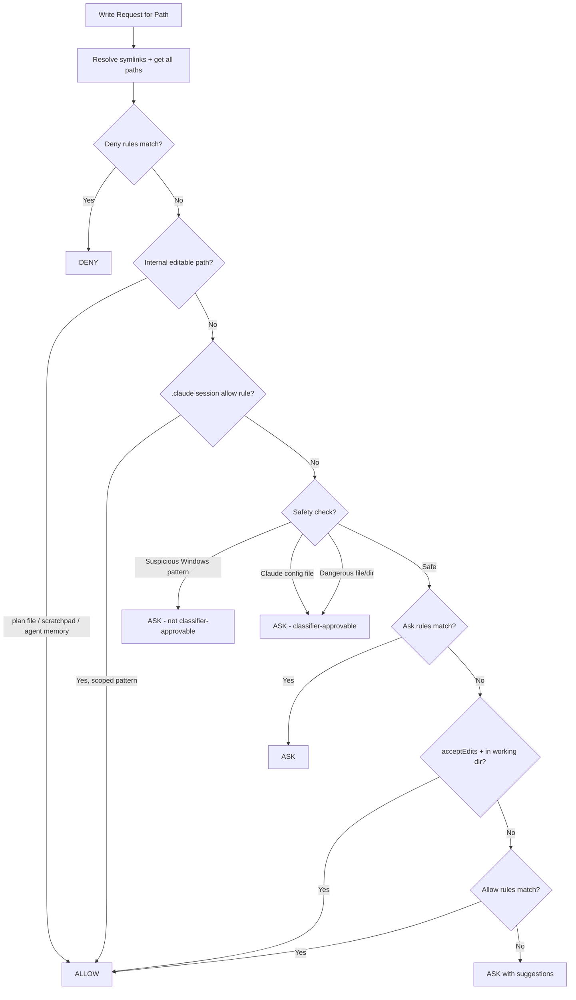
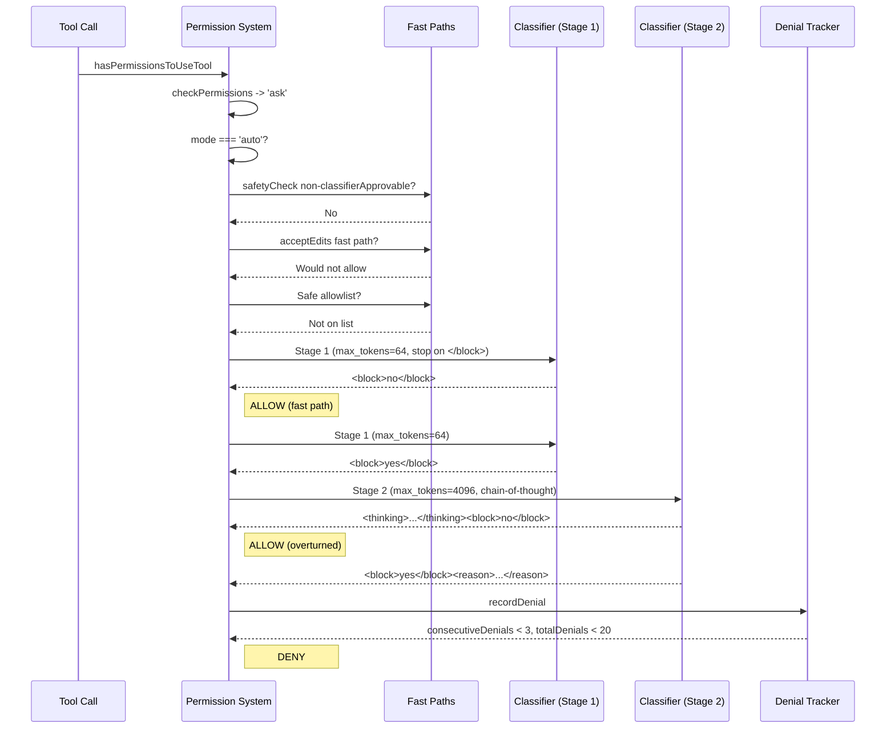

# Chapter 3 Research: Permission and Security System

## Source Files Analyzed

| File | Path | Purpose |
|------|------|---------|
| `permissions.ts` | `src/utils/permissions/permissions.ts` | Main permission orchestration, `hasPermissionsToUseTool` |
| `permissionSetup.ts` | `src/utils/permissions/permissionSetup.ts` | Rule loading, mode initialization, dangerous-rule detection |
| `filesystem.ts` | `src/utils/permissions/filesystem.ts` | Filesystem permission rules, path matching, dangerous-file detection |
| `yoloClassifier.ts` | `src/utils/permissions/yoloClassifier.ts` | Auto-mode AI classifier (2-stage XML) |
| `classifierDecision.ts` | `src/utils/permissions/classifierDecision.ts` | Safe-tool allowlist for auto mode |
| `bashClassifier.ts` | `src/utils/permissions/bashClassifier.ts` | Bash command pattern classifier (stub in external builds) |
| `permissionExplainer.ts` | `src/utils/permissions/permissionExplainer.ts` | User-facing risk explanations via LLM |
| `pathValidation.ts` | `src/utils/permissions/pathValidation.ts` | Path security, glob validation, tilde/UNC/shell-expansion blocking |
| `PermissionRule.ts` | `src/utils/permissions/PermissionRule.ts` | Rule type definitions |
| `PermissionResult.ts` | `src/utils/permissions/PermissionResult.ts` | Decision type definitions |
| `PermissionMode.ts` | `src/utils/permissions/PermissionMode.ts` | Mode enum and configuration |
| `sandbox-adapter.ts` | `src/utils/sandbox/sandbox-adapter.ts` | Sandbox integration adapter |
| `readOnlyCommandValidation.ts` | `src/utils/shell/readOnlyCommandValidation.ts` | Destructive command detection |
| `permissions.ts` (types) | `src/types/permissions.ts` | Centralized permission type definitions |
| `commands.ts` | `src/utils/bash/commands.ts` | Command parsing and redirection detection |
| `dangerousPatterns.ts` | `src/utils/permissions/dangerousPatterns.ts` | Dangerous shell interpreter patterns |
| `denialTracking.ts` | `src/utils/permissions/denialTracking.ts` | Consecutive denial tracking and limits |

---

## 1. Permission Modes

Claude Code operates in one of several permission modes, each with distinct security posture. The modes are defined in `src/types/permissions.ts`:

### 1.1 Mode Definitions

```typescript
// External modes (visible to users)
export const EXTERNAL_PERMISSION_MODES = [
  'acceptEdits',
  'bypassPermissions',
  'default',
  'dontAsk',
  'plan',
] as const

// Internal modes (includes ant-only)
export type InternalPermissionMode = ExternalPermissionMode | 'auto' | 'bubble'
export type PermissionMode = InternalPermissionMode
```

### 1.2 Mode Behavior Summary

| Mode | Behavior | File Edits in CWD | Bash Commands | Classifier Used |
|------|----------|-------------------|---------------|-----------------|
| `default` | Prompt for every write/execute | Ask | Ask | No |
| `acceptEdits` | Auto-allow file edits within working directory | Allow (in CWD) | Ask | No |
| `bypassPermissions` | Skip all permission checks | Allow | Allow | No |
| `dontAsk` | Never prompt; deny anything that would require asking | Deny (if needs prompt) | Deny (if needs prompt) | No |
| `plan` | Read-only plan mode; may activate auto classifier during planning | Varies | Varies | Conditional |
| `auto` | AI classifier decides allow/deny without user prompts | Classifier decides | Classifier decides | Yes |
| `bubble` | Internal-only mode | N/A | N/A | No |

### 1.3 Mode Configuration (`PermissionMode.ts`)

Each mode has a display configuration:

```typescript
type PermissionModeConfig = {
  title: string       // e.g., "Auto mode"
  shortTitle: string  // e.g., "Auto"
  symbol: string      // e.g., "⏵⏵"
  color: ModeColorKey // e.g., 'warning'
  external: ExternalPermissionMode // Mapping to external mode
}
```

The `auto` mode is only available when the `TRANSCRIPT_CLASSIFIER` feature flag is enabled.

### 1.4 Mode Initialization Priority

In `initialPermissionModeFromCLI` (permissionSetup.ts), modes are resolved in this priority order:

1. `--dangerously-skip-permissions` flag -> `bypassPermissions`
2. `--permission-mode` CLI flag -> parsed mode
3. `settings.permissions.defaultMode` -> settings mode
4. Fallback -> `default`

Critical guards:
- `bypassPermissions` can be disabled by Statsig gate `tengu_disable_bypass_permissions_mode` or settings `permissions.disableBypassPermissionsMode: 'disable'`
- `auto` mode is blocked when circuit breaker is active (`tengu_auto_mode_config.enabled === 'disabled'`)
- In CCR (Claude Code Remote), only `acceptEdits`, `plan`, and `default` modes are allowed from settings

### 1.5 Mode Transitions

The `transitionPermissionMode` function centralizes all state transitions:

```
default <-> acceptEdits : direct switch
default <-> auto        : strips/restores dangerous permissions
default <-> plan        : saves prePlanMode, handles plan attachments
auto    <-> plan        : auto remains active within plan mode
```

When entering `auto` mode:
- `setAutoModeActive(true)` is called
- `stripDangerousPermissionsForAutoMode` removes rules that bypass the classifier (e.g., `Bash(*)`, `Bash(python:*)`)
- Stripped rules are saved to `strippedDangerousRules` for restoration on exit

When leaving `auto` mode:
- `setAutoModeActive(false)` is called
- `restoreDangerousPermissions` re-applies the stripped rules

---

## 2. Rule System

### 2.1 Rule Types

Defined in `src/types/permissions.ts`:

```typescript
export type PermissionBehavior = 'allow' | 'deny' | 'ask'

export type PermissionRuleValue = {
  toolName: string      // e.g., "Bash", "Edit", "mcp__server1__tool1"
  ruleContent?: string  // e.g., "npm test:*", "/.env", "domain:example.com"
}

export type PermissionRule = {
  source: PermissionRuleSource
  ruleBehavior: PermissionBehavior  // 'allow' | 'deny' | 'ask'
  ruleValue: PermissionRuleValue
}
```

### 2.2 Rule Sources (7 Layers)

```typescript
export type PermissionRuleSource =
  | 'userSettings'      // ~/.claude/settings.json
  | 'projectSettings'   // .claude/settings.json (in project)
  | 'localSettings'     // .claude/settings.local.json
  | 'flagSettings'      // Feature flag settings (remote)
  | 'policySettings'    // Organization policy settings
  | 'cliArg'            // --allowed-tools, --disallowed-tools
  | 'command'           // From slash commands
  | 'session'           // Session-scoped rules (transient)
```

The `PERMISSION_RULE_SOURCES` constant combines `SETTING_SOURCES` (the first 5) with `cliArg`, `command`, and `session`:

```typescript
const PERMISSION_RULE_SOURCES = [
  ...SETTING_SOURCES,   // userSettings, projectSettings, localSettings, flagSettings, policySettings
  'cliArg',
  'command',
  'session',
] as const
```

### 2.3 Rule Storage Structure

Rules are stored in `ToolPermissionContext`:

```typescript
export type ToolPermissionContext = {
  readonly mode: PermissionMode
  readonly additionalWorkingDirectories: ReadonlyMap<string, AdditionalWorkingDirectory>
  readonly alwaysAllowRules: ToolPermissionRulesBySource  // { [source]: string[] }
  readonly alwaysDenyRules: ToolPermissionRulesBySource
  readonly alwaysAskRules: ToolPermissionRulesBySource
  readonly isBypassPermissionsModeAvailable: boolean
  readonly strippedDangerousRules?: ToolPermissionRulesBySource
  readonly shouldAvoidPermissionPrompts?: boolean
  readonly prePlanMode?: PermissionMode
}
```

### 2.4 Rule Matching

Rules are resolved by `getRuleByContentsForToolName`, which produces a `Map<string, PermissionRule>` keyed by `ruleContent`. Matching uses two mechanisms:

**Tool-level matching** (`toolMatchesRule`):
- Direct tool name match: rule `Bash` matches tool `Bash`
- MCP server-level: rule `mcp__server1` matches `mcp__server1__tool1`
- MCP wildcard: rule `mcp__server1__*` matches all tools from server1

**Content-level matching** (in `filesystem.ts` `matchingRuleForInput`):
- Uses the `ignore` library (gitignore-style glob matching)
- Patterns resolve relative to their source root:
  - `//path` -> absolute from filesystem root
  - `~/path` -> relative to home directory
  - `/path` -> relative to settings file directory
  - `path` -> relative to working directory (no root)

### 2.5 Dangerous Rule Detection

`permissionSetup.ts` defines detection for rules that would bypass the auto-mode classifier:

**Dangerous Bash patterns** (from `dangerousPatterns.ts`):
```typescript
export const DANGEROUS_BASH_PATTERNS: readonly string[] = [
  // Interpreters
  'python', 'python3', 'python2', 'node', 'deno', 'tsx', 'ruby', 'perl', 'php', 'lua',
  // Package runners
  'npx', 'bunx', 'npm run', 'yarn run', 'pnpm run', 'bun run',
  // Shells
  'bash', 'sh', 'zsh', 'fish',
  // Execution primitives
  'eval', 'exec', 'env', 'xargs', 'sudo',
  // Remote
  'ssh',
  // Ant-only additions: 'curl', 'wget', 'gh', 'git', 'kubectl', 'aws', 'gcloud', etc.
]
```

**Dangerous PowerShell patterns** (in `isDangerousPowerShellPermission`):
- All cross-platform patterns plus PS-specific cmdlets: `iex`, `invoke-expression`, `invoke-command`, `start-process`, `add-type`, `new-object`, `new-pssession`, etc.
- `.exe` suffix variants are matched (e.g., `python.exe`)

**Detection logic** (`isDangerousBashPermission`):
- Tool-level allow with no content (e.g., `Bash`, `Bash(*)`, `Bash()`) -> dangerous
- Prefix patterns for interpreters (e.g., `python:*`, `python*`, `python *`) -> dangerous
- Dash-wildcard patterns (e.g., `python -c*`) -> dangerous

---

## 3. Decision Flow

### 3.1 Entry Point: `hasPermissionsToUseTool`

This is the main permission check function. It wraps `hasPermissionsToUseToolInner` and applies post-processing:

```
hasPermissionsToUseTool(tool, input, context, assistantMessage, toolUseID)
  |
  v
hasPermissionsToUseToolInner(tool, input, context)
  |
  v
[result: PermissionDecision]
  |
  +-- behavior === 'allow' -> reset consecutive denials, return allow
  |
  +-- behavior === 'ask' ->
       |
       +-- mode === 'dontAsk' -> convert to deny
       |
       +-- mode === 'auto' or (mode === 'plan' + autoModeActive) ->
       |    |
       |    +-- Non-classifierApprovable safetyCheck -> deny (headless) or pass through
       |    +-- Tool requiresUserInteraction -> pass through as 'ask'
       |    +-- PowerShell (no POWERSHELL_AUTO_MODE) -> deny (headless) or pass through
       |    +-- acceptEdits fast-path check (skip Agent, REPL) -> allow if would pass
       |    +-- Safe allowlist check -> allow
       |    +-- Run classifier (classifyYoloAction) ->
       |         +-- shouldBlock=false -> allow
       |         +-- shouldBlock=true, transcriptTooLong -> fall back to prompting
       |         +-- shouldBlock=true, unavailable -> fail-closed (deny) or fail-open
       |         +-- shouldBlock=true -> deny, check denial limits
       |
       +-- shouldAvoidPermissionPrompts -> run hooks, auto-deny if no hook decision
```

### 3.2 Tool-Level Permission Flow (inside `hasPermissionsToUseToolInner`)

The inner function delegates to each tool's own `checkPermissions` method:

```
1. If mode === 'bypassPermissions' -> allow (with sandbox override check)
2. Check toolAlwaysAllowedRule (tool-level allow) -> allow
3. Check getDenyRuleForTool (tool-level deny) -> deny
4. Check getAskRuleForTool (tool-level ask) -> ask
5. tool.checkPermissions(input, context) -> tool-specific logic
```

### 3.3 File Permission Flow (filesystem.ts)

**Read permission** (`checkReadPermissionForTool`):
1. Block UNC paths (defense-in-depth)
2. Block suspicious Windows path patterns
3. Check read-specific deny rules
4. Check read-specific ask rules
5. Edit access implies read access
6. Allow reads in working directories
7. Allow reads from internal paths (session-memory, plans, tool-results)
8. Check read-specific allow rules
9. Default: ask

**Write permission** (`checkWritePermissionForTool`):
1. Check deny rules (both original and symlink-resolved paths)
1.5. Allow writes to internal editable paths (plan files, scratchpad, agent memory)
1.6. Check `.claude/**` session-only allow rules (bypass safety for skills editing)
1.7. Comprehensive safety validations (Windows patterns, Claude config, dangerous files)
2. Check ask rules
3. If `acceptEdits` mode and path is in working directory -> allow
4. Check allow rules
5. Default: ask

### 3.4 Decision Types

```typescript
export type PermissionDecision<Input> =
  | PermissionAllowDecision<Input>   // { behavior: 'allow', updatedInput?, decisionReason? }
  | PermissionAskDecision<Input>     // { behavior: 'ask', message, suggestions?, pendingClassifierCheck? }
  | PermissionDenyDecision           // { behavior: 'deny', message, decisionReason }

export type PermissionResult<Input> =
  | PermissionDecision<Input>
  | { behavior: 'passthrough', message, suggestions? }  // Used for internal chaining
```

### 3.5 Decision Reasons

```typescript
export type PermissionDecisionReason =
  | { type: 'rule'; rule: PermissionRule }
  | { type: 'mode'; mode: PermissionMode }
  | { type: 'subcommandResults'; reasons: Map<string, PermissionResult> }
  | { type: 'permissionPromptTool'; permissionPromptToolName: string }
  | { type: 'hook'; hookName: string; hookSource?; reason? }
  | { type: 'asyncAgent'; reason: string }
  | { type: 'sandboxOverride'; reason: 'excludedCommand' | 'dangerouslyDisableSandbox' }
  | { type: 'classifier'; classifier: string; reason: string }
  | { type: 'workingDir'; reason: string }
  | { type: 'safetyCheck'; reason: string; classifierApprovable: boolean }
  | { type: 'other'; reason: string }
```

---

## 4. Bash Security

### 4.1 Command Parsing (`commands.ts`)

The `splitCommandWithOperators` function is the foundation of bash command security analysis:

**Injection-resistant placeholder generation**:
```typescript
function generatePlaceholders() {
  const salt = randomBytes(8).toString('hex')
  return {
    SINGLE_QUOTE: `__SINGLE_QUOTE_${salt}__`,
    DOUBLE_QUOTE: `__DOUBLE_QUOTE_${salt}__`,
    NEW_LINE: `__NEW_LINE_${salt}__`,
    // ...
  }
}
```
Security: Random salt prevents malicious commands from containing literal placeholder strings that would be replaced during parsing.

**Line continuation handling**:
```typescript
// SECURITY: Only join when odd number of backslashes before newline.
// Even: backslashes pair up, newline is command separator.
// Odd: last backslash escapes newline (line continuation).
const commandWithContinuationsJoined = processedCommand.replace(
  /\\+\n/g,
  match => {
    const backslashCount = match.length - 1
    if (backslashCount % 2 === 1) {
      return '\\'.repeat(backslashCount - 1) // Remove escaping backslash + newline
    }
    return match // Keep as command separator
  },
)
```

**Redirection detection** (`isStaticRedirectTarget`):
Rejects dynamic content in redirect targets:
- Shell variables (`$HOME`, `${VAR}`)
- Command substitution (`` `pwd` ``)
- Glob patterns (`*`, `?`, `[`)
- Brace expansion (`{1,2}`)
- Tilde expansion (`~`)
- Process substitution (`>(cmd)`, `<(cmd)`)
- History expansion (`!!`, `!-1`)
- Zsh equals expansion (`=cmd`)
- Whitespace (indicates merged tokens from parser differential)
- Empty strings (would resolve to CWD)
- Comment-prefixed targets (`#file`)

### 4.2 Read-Only Command Validation (`readOnlyCommandValidation.ts`)

Defines exhaustive maps of safe flags for git subcommands and external commands:

**Git read-only commands**:
- `git diff`, `git log`, `git show`, `git shortlog`, `git reflog`, `git stash list`
- `git ls-remote`, `git status`, `git blame`, `git ls-files`, `git ls-tree`
- `git config --get`, `git remote`, `git remote show`, `git merge-base`
- `git rev-parse`, `git rev-list`, `git describe`, `git cat-file`

Each command has a `safeFlags` map and optional `additionalCommandIsDangerousCallback`:

```typescript
export type ExternalCommandConfig = {
  safeFlags: Record<string, FlagArgType>
  additionalCommandIsDangerousCallback?: (rawCommand: string, args: string[]) => boolean
  respectsDoubleDash?: boolean  // Default true
}
```

Flag argument types:
```typescript
export type FlagArgType =
  | 'none'    // No argument (--color)
  | 'number'  // Integer argument (--context=3)
  | 'string'  // Any string argument (--relative=path)
  | 'char'    // Single character (delimiter)
  | '{}'      // Literal "{}" only
  | 'EOF'     // Literal "EOF" only
```

**Security-critical flag corrections**:
The `-S`, `-G`, and `-O` flags in `git diff` were corrected from `'none'` to `'string'`:
> Previously 'none' caused a parser differential with git: `git diff -S -- --output=/tmp/pwned` -- validator sees -S as no-arg, advances 1 token, breaks on `--`, --output unchecked. git sees -S requires arg, consumes `--` as the pickaxe string, parses --output=... as long option -> ARBITRARY FILE WRITE.

**Dangerous subcommand detection** (e.g., `git reflog`):
```typescript
// Block 'expire', 'delete', 'exists' subcommands
// Allow: 'show', ref names (HEAD, refs/*, branch names)
additionalCommandIsDangerousCallback: (_rawCommand, args) => {
  const DANGEROUS_SUBCOMMANDS = new Set(['expire', 'delete', 'exists'])
  for (const token of args) {
    if (!token || token.startsWith('-')) continue
    if (DANGEROUS_SUBCOMMANDS.has(token)) return true
    return false
  }
  return false
}
```

### 4.3 UNC Path Detection

```typescript
export function containsVulnerableUncPath(path: string): boolean
```
Detects Windows UNC paths (`\\server\share`, `//server/share`) that could:
- Access remote network resources
- Leak NTLM credentials via WebDAV
- Bypass working directory restrictions

### 4.4 Dangerous Bash Patterns

From `dangerousPatterns.ts`, cross-platform code execution entry points:

```typescript
export const CROSS_PLATFORM_CODE_EXEC = [
  'python', 'python3', 'python2', 'node', 'deno', 'tsx',
  'ruby', 'perl', 'php', 'lua',
  'npx', 'bunx', 'npm run', 'yarn run', 'pnpm run', 'bun run',
  'bash', 'sh', 'ssh',
]
```

---

## 5. Filesystem Security

### 5.1 Path Validation (`pathValidation.ts`)

The `validatePath` function is the unified entry point for file path validation:

```
validatePath(path, cwd, toolPermissionContext, operationType)
  |
  +-- expandTilde (~ -> $HOME; ~user BLOCKED)
  +-- Block UNC paths (containsVulnerableUncPath)
  +-- Block tilde variants (~root, ~+, ~-, ~N) -> TOCTOU risk
  +-- Block shell expansion syntax ($, %, =cmd) -> TOCTOU risk
  +-- Block glob patterns in write operations
  +-- For read globs: validateGlobPattern (check base directory)
  +-- Resolve path (absolute + symlink resolution)
  +-- isPathAllowed(resolvedPath, context, operationType)
```

**`isPathAllowed` decision chain**:
1. Deny rules take precedence
2. Internal editable paths (write only): plan files, scratchpad, agent memory
3. Safety validations (write only): Windows patterns, Claude config, dangerous files
4. Working directory check: read always allowed; write requires `acceptEdits`
5. Internal readable paths (read only): project temp, session memory
6. Sandbox write allowlist (write only, outside working dir)
7. Allow rules
8. Default: not allowed

### 5.2 Dangerous Files and Directories

```typescript
export const DANGEROUS_FILES = [
  '.gitconfig', '.gitmodules',
  '.bashrc', '.bash_profile', '.zshrc', '.zprofile', '.profile',
  '.ripgreprc', '.mcp.json', '.claude.json',
]

export const DANGEROUS_DIRECTORIES = [
  '.git', '.vscode', '.idea', '.claude',
]
```

Exception: `.claude/worktrees/` is explicitly excluded from the `.claude` directory check since it is a structural path for git worktrees.

### 5.3 Case-Insensitive Security

```typescript
export function normalizeCaseForComparison(path: string): string {
  return path.toLowerCase()
}
```
Applied consistently to prevent bypasses on case-insensitive filesystems (macOS/Windows) using paths like `.cLauDe/Settings.locaL.json`.

### 5.4 Windows Path Pattern Detection

`hasSuspiciousWindowsPathPattern` detects:

| Pattern | Example | Risk |
|---------|---------|------|
| NTFS Alternate Data Streams | `file.txt::$DATA`, `file.txt:stream` | Hidden data access |
| 8.3 short names | `GIT~1`, `SETTIN~1.JSON` | Bypass string matching |
| Long path prefixes | `\\?\C:\...`, `//./C:/...` | Bypass path validation |
| Trailing dots/spaces | `.git.`, `.claude ` | Windows strips during resolution |
| DOS device names | `.git.CON`, `settings.json.PRN` | Special device access |
| Triple dots | `.../file.txt` | Path confusion |
| UNC paths | `\\server\share` | Network credential leak |

Checked on ALL platforms (NTFS can be mounted on Linux/macOS via ntfs-3g).

### 5.5 Glob Matching

File permission rules use gitignore-style patterns via the `ignore` library:

```typescript
export function matchingRuleForInput(
  path: string,
  toolPermissionContext: ToolPermissionContext,
  toolType: 'edit' | 'read',
  behavior: 'allow' | 'deny' | 'ask',
): PermissionRule | null
```

Pattern resolution by prefix:
- `//path` -> absolute from root (e.g., `//.aws/**` becomes `/.aws/**`)
- `~/path` -> relative to home directory
- `/path` -> relative to settings file directory root
- `./path` -> normalized to `path` (dot-slash removed)
- `path` -> no root (matches anywhere)

### 5.6 Temp Directory Handling

```typescript
export const getClaudeTempDir = memoize(function getClaudeTempDir(): string {
  const baseTmpDir = process.env.CLAUDE_CODE_TMPDIR || '/tmp'
  const resolvedBaseTmpDir = fs.realpathSync(baseTmpDir)  // Resolve symlinks
  return join(resolvedBaseTmpDir, `claude-${uid}`) + sep
})
```

- Per-user directories (`claude-{uid}`) prevent multi-user permission conflicts
- Symlinks resolved to match permission check paths (macOS `/tmp` -> `/private/tmp`)
- `getBundledSkillsRoot` uses a per-process random nonce for defense against symlink attacks:
  ```typescript
  const nonce = randomBytes(16).toString('hex')
  return join(getClaudeTempDir(), 'bundled-skills', MACRO.VERSION, nonce)
  ```

### 5.7 Skill Scope Detection

```typescript
export function getClaudeSkillScope(filePath: string):
  { skillName: string; pattern: string } | null
```

Returns a narrowed permission pattern for files within `.claude/skills/{name}/`:
- Rejects path traversal (`..`), dot-only names, glob metacharacters (`*`, `?`, `[`, `]`)
- Returns pattern like `/.claude/skills/my-skill/**` for session-scoped access

---

## 6. Classifier System

### 6.1 Auto-Mode (Yolo) Classifier (`yoloClassifier.ts`)

The auto-mode classifier is an AI-based security gate that evaluates tool calls without user prompts.

**Architecture**: 2-stage XML classifier with configurable modes:

| Mode | Stage 1 (Fast) | Stage 2 (Thinking) | Description |
|------|----------------|---------------------|-------------|
| `both` (default) | Yes (max_tokens=64) | Only if stage 1 blocks | Fast path: allow on pass, escalate on block |
| `fast` | Yes (max_tokens=256) | No | Stage 1 verdict is final |
| `thinking` | No | Yes (max_tokens=4096) | Skip fast stage entirely |

**Classifier Tool Schema**:
```typescript
const YOLO_CLASSIFIER_TOOL_SCHEMA: BetaToolUnion = {
  type: 'custom',
  name: 'classify_result',
  input_schema: {
    type: 'object',
    properties: {
      thinking: { type: 'string', description: 'Brief step-by-step reasoning.' },
      shouldBlock: { type: 'boolean', description: 'Whether the action should be blocked' },
      reason: { type: 'string', description: 'Brief explanation of the classification decision' },
    },
    required: ['thinking', 'shouldBlock', 'reason'],
  },
}
```

**XML Output Format** (used instead of tool_use in 2-stage mode):
```
If blocked: <block>yes</block><reason>one short sentence</reason>
If allowed: <block>no</block>
```

**Transcript Building**:
```typescript
export function buildTranscriptEntries(messages: Message[]): TranscriptEntry[]
```
- Includes user text messages and assistant tool_use blocks
- Excludes assistant text (model-authored, could be crafted to influence classifier)
- Queued user messages extracted from attachment messages
- Tool inputs encoded via `toAutoClassifierInput` per-tool projection

**CLAUDE.md Integration**:
The classifier receives the user's CLAUDE.md configuration wrapped in a delimiter:
```
The following is the user's CLAUDE.md configuration. These are instructions
the user provided to the agent and should be treated as part of the user's
intent when evaluating actions.
<user_claude_md>
{content}
</user_claude_md>
```

**System Prompt Assembly** (`buildYoloSystemPrompt`):
1. Base prompt (from `auto_mode_system_prompt.txt`)
2. Permissions template inserted (external vs. Anthropic internal)
3. User allow/deny/environment rules substituted from `settings.autoMode`
4. Bash prompt rules and PowerShell guidance conditionally added

### 6.2 Classifier Result Type

```typescript
export type YoloClassifierResult = {
  thinking?: string
  shouldBlock: boolean
  reason: string
  unavailable?: boolean
  transcriptTooLong?: boolean
  model: string
  usage?: ClassifierUsage
  durationMs?: number
  promptLengths?: { systemPrompt: number; toolCalls: number; userPrompts: number }
  errorDumpPath?: string
  stage?: 'fast' | 'thinking'
  stage1Usage?: ClassifierUsage
  stage1DurationMs?: number
  stage2Usage?: ClassifierUsage
  stage2DurationMs?: number
  // ... request/message IDs for telemetry
}
```

### 6.3 Fail-Closed / Fail-Open Behavior

When the classifier is unavailable (API error):
- **`tengu_iron_gate_closed` gate = true** (default): Deny with retry guidance (fail closed)
- **`tengu_iron_gate_closed` gate = false**: Fall back to normal permission handling (fail open)

When transcript exceeds context window:
- Deterministic error, won't recover on retry
- Headless mode: abort
- Interactive mode: fall back to normal prompting

### 6.4 Denial Tracking (`denialTracking.ts`)

```typescript
export type DenialTrackingState = {
  consecutiveDenials: number
  totalDenials: number
}

export const DENIAL_LIMITS = {
  maxConsecutive: 3,
  maxTotal: 20,
}
```

When limits are hit, the system falls back to interactive prompting so the user can review. This prevents infinite denial loops in auto mode.

### 6.5 Safe Tool Allowlist (`classifierDecision.ts`)

Tools that skip classifier evaluation entirely:

```typescript
const SAFE_YOLO_ALLOWLISTED_TOOLS = new Set([
  // Read-only file operations
  FILE_READ_TOOL_NAME,
  // Search / read-only
  GREP_TOOL_NAME, GLOB_TOOL_NAME, LSP_TOOL_NAME, TOOL_SEARCH_TOOL_NAME,
  LIST_MCP_RESOURCES_TOOL_NAME, 'ReadMcpResourceTool',
  // Task management (metadata only)
  TODO_WRITE_TOOL_NAME, TASK_CREATE_TOOL_NAME, TASK_GET_TOOL_NAME,
  TASK_UPDATE_TOOL_NAME, TASK_LIST_TOOL_NAME, TASK_STOP_TOOL_NAME, TASK_OUTPUT_TOOL_NAME,
  // Plan mode / UI
  ASK_USER_QUESTION_TOOL_NAME, ENTER_PLAN_MODE_TOOL_NAME, EXIT_PLAN_MODE_TOOL_NAME,
  // Swarm coordination
  TEAM_CREATE_TOOL_NAME, TEAM_DELETE_TOOL_NAME, SEND_MESSAGE_TOOL_NAME,
  // Misc
  SLEEP_TOOL_NAME,
  // Internal classifier tool
  YOLO_CLASSIFIER_TOOL_NAME,
])
```

Note: Write/edit tools are NOT in this list. They use the `acceptEdits` fast-path check instead.

### 6.6 AcceptEdits Fast Path

Before running the expensive classifier API call, the system checks if the tool would be allowed in `acceptEdits` mode:

```typescript
// Skip for Agent and REPL -- their checkPermissions returns 'allow' for
// acceptEdits mode, which would silently bypass the classifier.
if (tool.name !== AGENT_TOOL_NAME && tool.name !== REPL_TOOL_NAME) {
  const acceptEditsResult = await tool.checkPermissions(parsedInput, {
    ...context,
    getAppState: () => ({
      ...state,
      toolPermissionContext: { ...state.toolPermissionContext, mode: 'acceptEdits' },
    }),
  })
  if (acceptEditsResult.behavior === 'allow') {
    return { behavior: 'allow', ... }  // Skip classifier
  }
}
```

### 6.7 Bash Classifier (`bashClassifier.ts`)

In external builds, this is a stub that always returns `{ matches: false }`. The actual implementation is ant-only and provides:

```typescript
export type ClassifierResult = {
  matches: boolean
  matchedDescription?: string
  confidence: 'high' | 'medium' | 'low'
  reason: string
}

export type ClassifierBehavior = 'deny' | 'ask' | 'allow'
```

The bash classifier provides `getBashPromptAllowDescriptions` and `getBashPromptDenyDescriptions` that feed into the auto-mode classifier's system prompt.

### 6.8 Permission Explainer (`permissionExplainer.ts`)

User-facing risk assessment using LLM side-query:

```typescript
const EXPLAIN_COMMAND_TOOL = {
  name: 'explain_command',
  input_schema: {
    properties: {
      explanation: { type: 'string', description: 'What this command does (1-2 sentences)' },
      reasoning: { type: 'string', description: 'Why YOU are running this command' },
      risk: { type: 'string', description: 'What could go wrong, under 15 words' },
      riskLevel: { type: 'string', enum: ['LOW', 'MEDIUM', 'HIGH'] },
    },
  },
}
```

Risk levels:
- **LOW**: Safe dev workflows
- **MEDIUM**: Recoverable changes
- **HIGH**: Dangerous/irreversible

Enabled by default; disabled via `config.permissionExplainerEnabled = false`.

---

## 7. Sandbox Architecture

### 7.1 Overview

The sandbox system (`sandbox-adapter.ts`) wraps `@anthropic-ai/sandbox-runtime` with Claude CLI-specific integrations. It provides OS-level process isolation for bash commands.

### 7.2 Sandbox Configuration

```typescript
export function convertToSandboxRuntimeConfig(settings: SettingsJson): SandboxRuntimeConfig {
  return {
    network: {
      allowedDomains,    // From WebFetch allow rules
      deniedDomains,     // From WebFetch deny rules
      allowUnixSockets,
      allowLocalBinding,
      httpProxyPort,
      socksProxyPort,
    },
    filesystem: {
      denyRead,     // From Read deny rules + sandbox.filesystem.denyRead
      allowRead,    // From sandbox.filesystem.allowRead
      allowWrite,   // From Edit allow rules + sandbox.filesystem.allowWrite
      denyWrite,    // Settings paths + sandbox.filesystem.denyWrite
    },
    ignoreViolations,
    enableWeakerNestedSandbox,
    enableWeakerNetworkIsolation,
    ripgrep: ripgrepConfig,
  }
}
```

### 7.3 Filesystem Restrictions

**Always writable**:
- Current working directory (`.`)
- Claude temp directory (`getClaudeTempDir()`)
- Git worktree main repo path (if applicable)
- Additional directories from `--add-dir` and settings

**Always denied for writes**:
- All settings.json files across all setting sources
- Managed settings drop-in directory
- `.claude/skills/` directories (both original and current CWD)
- CWD settings files when CWD differs from original

**Bare git repo protection**:
```typescript
// SECURITY: Git's is_git_directory() treats cwd as a bare repo if it has
// HEAD + objects/ + refs/. An attacker planting these escapes the sandbox
// when Claude's unsandboxed git runs.
const bareGitRepoFiles = ['HEAD', 'objects', 'refs', 'hooks', 'config']
```
- If these files exist: deny-write (read-only bind mount)
- If they don't exist: scrub post-command (`scrubBareGitRepoFiles`)

### 7.4 Network Restrictions

Domains extracted from WebFetch permission rules:
- Allow rules: `WebFetch(domain:example.com)` -> allow domain
- Deny rules: `WebFetch(domain:evil.com)` -> deny domain
- `allowManagedDomainsOnly`: Only policy-settings domains are allowed

### 7.5 Path Resolution for Sandbox

```typescript
export function resolvePathPatternForSandbox(pattern: string, source: SettingSource): string {
  if (pattern.startsWith('//')) return pattern.slice(1)     // Absolute
  if (pattern.startsWith('/'))  return resolve(root, ...)   // Settings-relative
  return pattern                                             // Pass through
}

// Separate function for sandbox.filesystem.* settings (NOT permission-rule convention)
export function resolveSandboxFilesystemPath(pattern: string, source: SettingSource): string {
  if (pattern.startsWith('//')) return pattern.slice(1)     // Legacy compat
  return expandPath(pattern, settingsRoot)                   // Standard path semantics
}
```

### 7.6 Sandbox Enablement

```typescript
function isSandboxingEnabled(): boolean {
  if (!isSupportedPlatform()) return false    // macOS, Linux, WSL2+
  if (checkDependencies().errors.length > 0) return false
  if (!isPlatformInEnabledList()) return false  // Optional platform restriction
  return getSandboxEnabledSetting()
}
```

Platform support: macOS (sandbox-exec), Linux (bubblewrap), WSL2+ (bubblewrap). WSL1 is NOT supported.

### 7.7 SandboxManager Interface

```typescript
export interface ISandboxManager {
  initialize(sandboxAskCallback?): Promise<void>
  isSandboxingEnabled(): boolean
  wrapWithSandbox(command, binShell?, customConfig?, abortSignal?): Promise<string>
  cleanupAfterCommand(): void           // Includes scrubBareGitRepoFiles
  getFsReadConfig(): FsReadRestrictionConfig
  getFsWriteConfig(): FsWriteRestrictionConfig
  getNetworkRestrictionConfig(): NetworkRestrictionConfig
  getExcludedCommands(): string[]       // Commands that bypass sandbox
  refreshConfig(): void                 // Sync settings update
  // ... additional methods
}
```

### 7.8 Excluded Commands

Commands that should NOT be sandboxed (configured via `sandbox.excludedCommands`):
```typescript
function getExcludedCommands(): string[] {
  const settings = getSettings_DEPRECATED()
  return settings?.sandbox?.excludedCommands ?? []
}
```

`addToExcludedCommands` extracts command patterns from permission suggestions.

---

## 8. Read-Only Validation

### 8.1 Git Command Validation

The `GIT_READ_ONLY_COMMANDS` map provides exhaustive safe-flag definitions for 20+ git subcommands. Each entry specifies:

1. **Safe flags**: Every flag that doesn't modify repository state
2. **Flag argument types**: Precise argument expectations to prevent parser differentials
3. **Dangerous subcommand callbacks**: Custom validation for commands with write-capable positional subcommands

Key security patterns:

**Parser differential prevention**:
Flags that consume required arguments must be typed correctly. If a flag like `-S` is typed as `'none'` but git treats it as requiring an argument, an attacker can construct commands where the validator skips the next token but git consumes it, leaving subsequent dangerous flags unchecked.

**Subcommand safety**:
For `git reflog`, only `show` and ref names are safe. `expire`, `delete`, and `exists` are blocked because they write to `.git/logs/`.

For `git remote`, only bare `git remote` and `git remote -v/--verbose` are safe. Any positional arguments (which could be subcommands like `add`, `remove`, `set-url`) are blocked.

### 8.2 External Read-Only Commands

```typescript
export const EXTERNAL_READONLY_COMMANDS: Record<string, ExternalCommandConfig>
```
Cross-shell commands that work in both bash and PowerShell.

### 8.3 Flag Validation Algorithm

```
For each token after the command:
  1. If token is '--' and respectsDoubleDash: stop checking (rest are positional)
  2. If token starts with '-': look up in safeFlags
     a. If found with type 'none': continue
     b. If found with argument type: consume next token as argument
     c. If NOT found: command is DANGEROUS
  3. If token is positional: pass through (ref names, paths, etc.)
  4. Run additionalCommandIsDangerousCallback if defined
```

---

## 9. Hook Integration

### 9.1 PermissionRequest Hooks

When a tool needs permission and the system cannot show a UI prompt (headless/async agents), hooks are invoked:

```typescript
async function runPermissionRequestHooksForHeadlessAgent(
  tool: Tool,
  input: { [key: string]: unknown },
  toolUseID: string,
  context: ToolUseContext,
  permissionMode: string | undefined,
  suggestions: PermissionUpdate[] | undefined,
): Promise<PermissionDecision | null>
```

Hook results can:
- **Allow**: Return allow decision with optional `updatedInput` and `updatedPermissions`
- **Deny**: Return deny decision with optional `interrupt` flag (aborts the agent)
- **No decision**: Return null -> system falls back to auto-deny

### 9.2 Hook Decision Flow

```
tool needs permission AND shouldAvoidPermissionPrompts
  |
  v
executePermissionRequestHooks(toolName, toolUseID, input, context, ...)
  |
  +-- For each hook result:
  |    +-- behavior === 'allow' ->
  |    |    - Apply updatedPermissions if provided
  |    |    - Return allow with updatedInput
  |    +-- behavior === 'deny' ->
  |    |    - If interrupt: abort controller
  |    |    - Return deny
  |    +-- No result: continue to next hook
  |
  +-- No hook decided -> return null -> auto-deny
```

### 9.3 PreToolUse / PostToolUse Hooks

These hooks are referenced in the permission system but executed in the tool use lifecycle. The `decisionReason` type `'hook'` records which hook affected the decision:

```typescript
{ type: 'hook'; hookName: string; hookSource?: string; reason?: string }
```

### 9.4 Permission Message Construction

The `createPermissionRequestMessage` function constructs user-facing messages based on decision reason:

- **Classifier**: "Classifier '{name}' requires approval for this {tool} command: {reason}"
- **Hook**: "Hook '{name}' blocked this action: {reason}" or "requires approval"
- **Rule**: "Permission rule '{rule}' from {source} requires approval"
- **SubcommandResults**: Lists the specific operations needing approval
- **Mode**: "Current permission mode ({mode}) requires approval"
- **SandboxOverride**: "Run outside of the sandbox"
- **SafetyCheck/Other/WorkingDir**: Direct reason string

---

## 10. Mermaid Diagrams

### 10.1 Permission Decision Tree



### 10.2 Rule Priority Stack



### 10.3 Security Layers



### 10.4 Filesystem Write Permission Flow



### 10.5 Auto-Mode Classifier Pipeline



---

## Appendix A: Key Security Invariants

1. **Deny rules always take precedence over allow rules** - checked first in every permission flow
2. **Safety checks run before allow rules for writes** - prevents accidental grants to protected files
3. **Symlink resolution on both path and working directory** - prevents bypass via symlinks
4. **Case normalization on all path comparisons** - prevents bypass on case-insensitive FS
5. **Random salt in command parsing placeholders** - prevents injection via literal placeholder strings
6. **Odd/even backslash counting for line continuations** - prevents command hiding
7. **Flag argument type correctness** - prevents parser differentials between validator and shell
8. **Classifier fails closed by default** - `tengu_iron_gate_closed` gate
9. **Dangerous rules stripped on auto-mode entry** - prevents classifier bypass via `Bash(*)`, interpreter prefixes
10. **Per-user temp directories with UID** - prevents multi-user permission conflicts
11. **Per-process random nonce for bundled skills root** - prevents symlink pre-creation attacks
12. **Bare git repo file scrubbing** - prevents sandbox escape via planted `.git` files
13. **Settings files always denied for sandbox writes** - prevents sandbox escape via config modification

## Appendix B: Permission Update Types

```typescript
export type PermissionUpdate =
  | { type: 'addRules'; destination; rules: PermissionRuleValue[]; behavior }
  | { type: 'replaceRules'; destination; rules: PermissionRuleValue[]; behavior }
  | { type: 'removeRules'; destination; rules: PermissionRuleValue[]; behavior }
  | { type: 'setMode'; destination; mode: ExternalPermissionMode }
  | { type: 'addDirectories'; destination; directories: string[] }
  | { type: 'removeDirectories'; destination; directories: string[] }
```

Valid update destinations: `userSettings`, `projectSettings`, `localSettings`, `session`, `cliArg`

Not valid destinations: `flagSettings`, `policySettings`, `command` (read-only sources)
