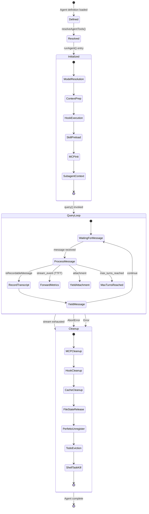
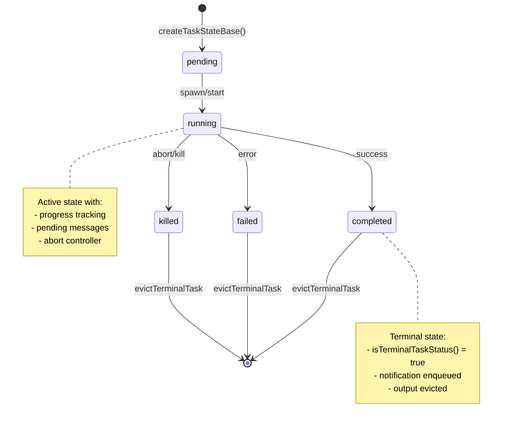
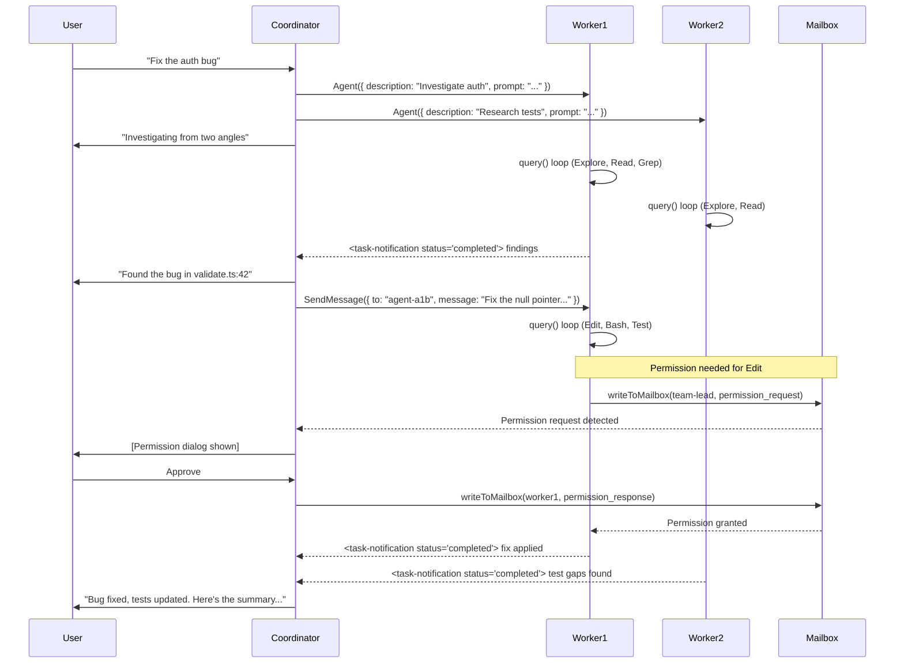
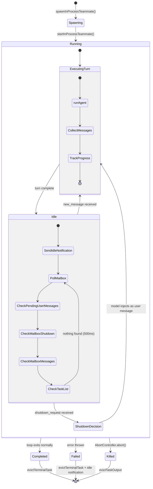
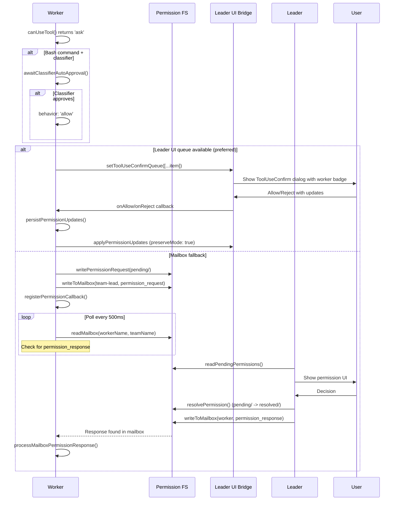
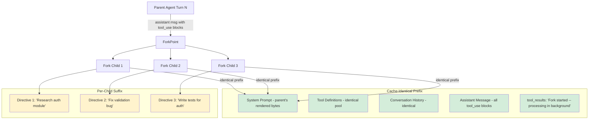
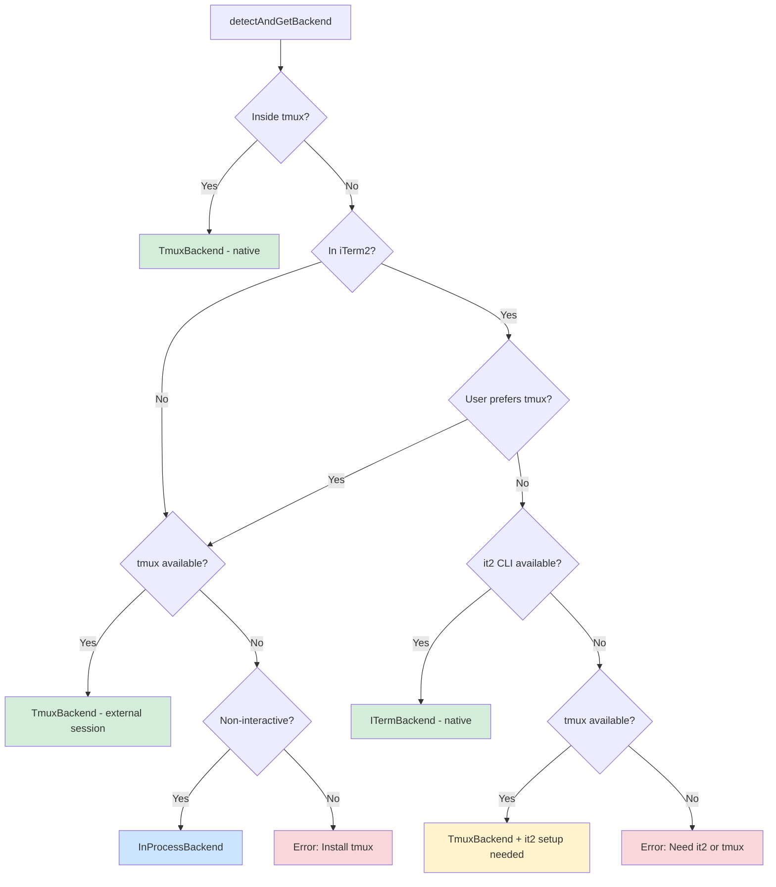

# Research Document: Agent and Task Orchestration System

## Table of Contents

1. [Agent Definition](#1-agent-definition)
2. [Agent Tool](#2-agent-tool)
3. [runAgent()](#3-runagent)
4. [Task Type System](#4-task-type-system)
5. [Task Implementations](#5-task-implementations)
6. [Coordinator Mode](#6-coordinator-mode)
7. [Swarm System](#7-swarm-system)
8. [In-Process Runner](#8-in-process-runner)
9. [Permission Synchronization](#9-permission-synchronization)
10. [Fork Subagent](#10-fork-subagent)
11. [Agent Summary](#11-agent-summary)
12. [Inter-Agent Communication](#12-inter-agent-communication)
13. [Mermaid Diagrams](#13-mermaid-diagrams)

---

## 1. Agent Definition

### 1.1 Schema and Type Hierarchy

The agent definition system uses a union type hierarchy with a shared base. Every agent -- built-in, custom (user/project/policy), or plugin -- shares a `BaseAgentDefinition` that defines capabilities, constraints, and runtime configuration.

**Source:** `src/tools/AgentTool/loadAgentsDir.ts`

```typescript
export type BaseAgentDefinition = {
  agentType: string
  whenToUse: string
  tools?: string[]
  disallowedTools?: string[]
  skills?: string[]
  mcpServers?: AgentMcpServerSpec[]
  hooks?: HooksSettings
  color?: AgentColorName
  model?: string
  effort?: EffortValue
  permissionMode?: PermissionMode
  maxTurns?: number
  filename?: string
  baseDir?: string
  criticalSystemReminder_EXPERIMENTAL?: string
  requiredMcpServers?: string[]
  background?: boolean
  initialPrompt?: string
  memory?: AgentMemoryScope  // 'user' | 'project' | 'local'
  isolation?: 'worktree' | 'remote'
  pendingSnapshotUpdate?: { snapshotTimestamp: string }
  omitClaudeMd?: boolean
}
```

Three discriminated subtypes extend the base:

```typescript
// Built-in agents: dynamic prompts, no static systemPrompt
export type BuiltInAgentDefinition = BaseAgentDefinition & {
  source: 'built-in'
  baseDir: 'built-in'
  callback?: () => void
  getSystemPrompt: (params: {
    toolUseContext: Pick<ToolUseContext, 'options'>
  }) => string
}

// Custom agents from user/project/policy settings
export type CustomAgentDefinition = BaseAgentDefinition & {
  getSystemPrompt: () => string
  source: SettingSource
  filename?: string
  baseDir?: string
}

// Plugin agents with plugin metadata
export type PluginAgentDefinition = BaseAgentDefinition & {
  getSystemPrompt: () => string
  source: 'plugin'
  filename?: string
  plugin: string
}

// Union type
export type AgentDefinition =
  | BuiltInAgentDefinition
  | CustomAgentDefinition
  | PluginAgentDefinition
```

**Type guards:**
```typescript
export function isBuiltInAgent(agent): agent is BuiltInAgentDefinition {
  return agent.source === 'built-in'
}
export function isCustomAgent(agent): agent is CustomAgentDefinition {
  return agent.source !== 'built-in' && agent.source !== 'plugin'
}
export function isPluginAgent(agent): agent is PluginAgentDefinition {
  return agent.source === 'plugin'
}
```

### 1.2 Agent Sources and Loading Priority

Agents are loaded from multiple sources. The priority chain determines which agent definition wins when names collide:

```
built-in < plugin < userSettings < projectSettings < flagSettings < policySettings
```

The function `getActiveAgentsFromList()` processes groups in order and uses a `Map<string, AgentDefinition>` keyed by `agentType`, so later groups overwrite earlier ones.

```typescript
export function getActiveAgentsFromList(allAgents: AgentDefinition[]): AgentDefinition[] {
  const agentGroups = [
    builtInAgents,
    pluginAgents,
    userAgents,
    projectAgents,
    flagAgents,
    managedAgents,
  ]
  const agentMap = new Map<string, AgentDefinition>()
  for (const agents of agentGroups) {
    for (const agent of agents) {
      agentMap.set(agent.agentType, agent)
    }
  }
  return Array.from(agentMap.values())
}
```

### 1.3 Agent Definition Results

```typescript
export type AgentDefinitionsResult = {
  activeAgents: AgentDefinition[]
  allAgents: AgentDefinition[]
  failedFiles?: Array<{ path: string; error: string }>
  allowedAgentTypes?: string[]
}
```

### 1.4 Custom Agent JSON Schema

Custom agents from settings use Zod validation:

```typescript
const AgentJsonSchema = z.object({
  description: z.string().min(1),
  tools: z.array(z.string()).optional(),
  disallowedTools: z.array(z.string()).optional(),
  prompt: z.string().min(1),
  model: z.string().trim().min(1).transform(...).optional(),
  effort: z.union([z.enum(EFFORT_LEVELS), z.number().int()]).optional(),
  permissionMode: z.enum(PERMISSION_MODES).optional(),
  mcpServers: z.array(AgentMcpServerSpecSchema()).optional(),
  hooks: HooksSchema().optional(),
  maxTurns: z.number().int().positive().optional(),
  skills: z.array(z.string()).optional(),
  initialPrompt: z.string().optional(),
  memory: z.enum(['user', 'project', 'local']).optional(),
  background: z.boolean().optional(),
  isolation: z.enum(['worktree', 'remote']).optional(),
})
```

### 1.5 Markdown Agent Parsing

Custom agents can be defined as Markdown files with YAML frontmatter. The `parseAgentFromMarkdown()` function extracts:
- `name` (required) -> `agentType`
- `description` (required) -> `whenToUse`
- `tools`, `disallowedTools`, `skills` -> parsed via `parseAgentToolsFromFrontmatter()`
- `color`, `model`, `effort`, `permissionMode`, `maxTurns`, `background`, `memory`, `isolation`, `initialPrompt`, `mcpServers`, `hooks`
- The Markdown body becomes the system prompt, returned via `getSystemPrompt()` closure

When agent memory is enabled, the `getSystemPrompt()` closure appends the memory prompt:
```typescript
getSystemPrompt: () => {
  if (isAutoMemoryEnabled() && memory) {
    return systemPrompt + '\n\n' + loadAgentMemoryPrompt(agentType, memory)
  }
  return systemPrompt
}
```

### 1.6 MCP Server Requirements

Agents can specify `requiredMcpServers` patterns that must match available MCP server names (case-insensitive substring match):

```typescript
export function hasRequiredMcpServers(
  agent: AgentDefinition,
  availableServers: string[],
): boolean {
  return agent.requiredMcpServers.every(pattern =>
    availableServers.some(server =>
      server.toLowerCase().includes(pattern.toLowerCase()),
    ),
  )
}
```

### 1.7 Built-in Agents (Analyzed)

**Source:** `src/tools/AgentTool/builtInAgents.ts` and `src/tools/AgentTool/built-in/`

The function `getBuiltInAgents()` assembles the built-in list:
- Always includes: `GENERAL_PURPOSE_AGENT`, `STATUSLINE_SETUP_AGENT`
- Conditional: `EXPLORE_AGENT`, `PLAN_AGENT` (feature-gated by `tengu_amber_stoat`)
- Non-SDK entrypoints: `CLAUDE_CODE_GUIDE_AGENT`
- Feature-gated: `VERIFICATION_AGENT` (gated by `tengu_hive_evidence`)
- Coordinator mode: replaces all with `getCoordinatorAgents()`

#### 1.7.1 Explore Agent

**File:** `src/tools/AgentTool/built-in/exploreAgent.ts`

- `agentType`: `'Explore'`
- `model`: `'inherit'` (ants) or `'haiku'` (external)
- **Read-only**: Disallows `Agent`, `ExitPlanMode`, `FileEdit`, `FileWrite`, `NotebookEdit`
- `omitClaudeMd: true` -- saves ~5-15 Gtok/week across 34M+ Explore spawns
- Specialized for file search and codebase navigation
- Adapts to embedded search tools (bfs/ugrep) vs standalone Glob/Grep

#### 1.7.2 Plan Agent

**File:** `src/tools/AgentTool/built-in/planAgent.ts`

- `agentType`: `'Plan'`
- `model`: `'inherit'`
- **Read-only**: Same disallowed tools as Explore
- `omitClaudeMd: true`
- Outputs structured plans with "Critical Files for Implementation" section
- Shares `tools` configuration with `EXPLORE_AGENT`

#### 1.7.3 General Purpose Agent

**File:** `src/tools/AgentTool/built-in/generalPurposeAgent.ts`

- `agentType`: `'general-purpose'`
- `tools`: `['*']` (wildcard -- all tools)
- `model`: omitted -- uses `getDefaultSubagentModel()`
- Can search, analyze, and execute multi-step tasks
- Shared prefix and guidelines used across agent prompts

#### 1.7.4 Verification Agent

**File:** `src/tools/AgentTool/built-in/verificationAgent.ts`

- `agentType`: `'verification'`
- `color`: `'red'`
- `background: true` -- always runs as background task
- `model`: `'inherit'`
- **Read-only for project files**: Can write to `/tmp` for ephemeral test scripts
- Disallows `Agent`, `ExitPlanMode`, `FileEdit`, `FileWrite`, `NotebookEdit`
- Has `criticalSystemReminder_EXPERIMENTAL` injected at every turn
- Adversarial testing focus: concurrency, boundary values, idempotency
- Must end with `VERDICT: PASS`, `VERDICT: FAIL`, or `VERDICT: PARTIAL`
- Extensive prompt (~130 lines) addressing verification avoidance patterns

#### 1.7.5 Claude Code Guide Agent

**File:** `src/tools/AgentTool/built-in/claudeCodeGuideAgent.ts`

- `agentType`: `'claude-code-guide'`
- `model`: `'haiku'`
- `permissionMode`: `'dontAsk'`
- Tools: `Glob`, `Grep`, `Read`, `WebFetch`, `WebSearch` (with embedded tool adaptation)
- Dynamic `getSystemPrompt()` that receives `toolUseContext` and injects:
  - Available custom skills, custom agents, MCP servers, plugin commands, user settings
- Fetches external docs maps from `code.claude.com` and `platform.claude.com`

#### 1.7.6 Statusline Setup Agent

**File:** `src/tools/AgentTool/built-in/statuslineSetup.ts`

- `agentType`: `'statusline-setup'`
- `tools`: `['Read', 'Edit']` (minimal)
- `model`: `'sonnet'`
- `color`: `'orange'`
- Converts shell PS1 configurations to Claude Code `statusLine` commands
- Updates `~/.claude/settings.json`

---

## 2. Agent Tool

### 2.1 Tool Input/Output Schema

**Source:** `src/tools/AgentTool/agentToolUtils.ts`

The Agent tool result schema captures comprehensive execution metrics:

```typescript
export const agentToolResultSchema = z.object({
  agentId: z.string(),
  agentType: z.string().optional(),
  content: z.array(z.object({ type: z.literal('text'), text: z.string() })),
  totalToolUseCount: z.number(),
  totalDurationMs: z.number(),
  totalTokens: z.number(),
  usage: z.object({
    input_tokens: z.number(),
    output_tokens: z.number(),
    cache_creation_input_tokens: z.number().nullable(),
    cache_read_input_tokens: z.number().nullable(),
    server_tool_use: z.object({
      web_search_requests: z.number(),
      web_fetch_requests: z.number(),
    }).nullable(),
    service_tier: z.enum(['standard', 'priority', 'batch']).nullable(),
    cache_creation: z.object({
      ephemeral_1h_input_tokens: z.number(),
      ephemeral_5m_input_tokens: z.number(),
    }).nullable(),
  }),
})
```

### 2.2 Tool Resolution

```typescript
export type ResolvedAgentTools = {
  hasWildcard: boolean
  validTools: string[]
  invalidTools: string[]
  resolvedTools: Tools
  allowedAgentTypes?: string[]
}
```

Tool resolution proceeds through layers of filtering:

1. **`filterToolsForAgent()`**: Removes tools based on agent type:
   - MCP tools (`mcp__` prefix) always allowed
   - `ALL_AGENT_DISALLOWED_TOOLS`: globally blocked for all agents
   - `CUSTOM_AGENT_DISALLOWED_TOOLS`: blocked for non-built-in agents
   - Async agents limited to `ASYNC_AGENT_ALLOWED_TOOLS` (with exceptions for in-process teammates who get `Agent` and task tools)
   - `ExitPlanMode` allowed for agents in plan mode

2. **`resolveAgentTools()`**: Maps declared tools to available tools:
   - Wildcard (`*` or `undefined`): all tools after filtering
   - Named tools: matched against `availableToolMap`
   - Agent tool spec can carry `allowedAgentTypes` metadata
   - `disallowedTools` are removed before wildcard expansion

### 2.3 Execution Paths

The Agent tool has multiple execution paths visible in `agentToolUtils.ts`:

1. **Sync execution**: Agent runs in the foreground. Shares the parent's `setAppState` and `abortController`.

2. **Async (background) execution**: Via `runAsyncAgentLifecycle()`. Gets a new unlinked `AbortController`. Runs independently with progress tracking. Calls `enqueueAgentNotification()` on completion/failure/kill.

3. **Remote execution**: Via `RemoteAgentTask`. Spawns a cloud-based session.

4. **Worktree isolation**: Agent runs in an isolated git worktree with translated paths.

5. **Fork execution**: Implicit fork that inherits the parent's full conversation context. Cache-optimized with byte-identical API request prefixes.

### 2.4 Async Agent Lifecycle

```typescript
export async function runAsyncAgentLifecycle({
  taskId, abortController, makeStream, metadata,
  description, toolUseContext, rootSetAppState,
  agentIdForCleanup, enableSummarization, getWorktreeResult,
}: { ... }): Promise<void>
```

The lifecycle:
1. Creates a `ProgressTracker` and `ActivityDescriptionResolver`
2. Optionally starts background summarization via `startAgentSummarization()`
3. Iterates the message stream, accumulating messages
4. Updates progress on each message (`updateAsyncAgentProgress`)
5. Emits SDK task progress events
6. On stream completion: `finalizeAgentTool()` builds the `AgentToolResult`
7. Marks task completed via `completeAsyncAgent()`
8. Optionally runs `classifyHandoffIfNeeded()` for safety checks
9. Retrieves worktree result and enqueues agent notification

Error handling:
- `AbortError`: Kill pathway -- marks killed, sends partial result notification
- Other errors: Fail pathway -- marks failed, sends error notification
- Finally: Cleans up invoked skills and dump state

### 2.5 Handoff Classification

When `TRANSCRIPT_CLASSIFIER` feature is active and auto mode is on, the handoff classifier reviews the sub-agent's work:

```typescript
export async function classifyHandoffIfNeeded({
  agentMessages, tools, toolPermissionContext,
  abortSignal, subagentType, totalToolUseCount,
}: { ... }): Promise<string | null>
```

Returns either:
- `null`: No issues found
- A security warning string prepended to the final message
- An "unavailable" warning if the classifier could not run

### 2.6 Finalization

```typescript
export function finalizeAgentTool(
  agentMessages: MessageType[],
  agentId: string,
  metadata: { prompt, resolvedAgentModel, isBuiltInAgent, startTime, agentType, isAsync },
): AgentToolResult
```

Extracts text content from the last assistant message (with fallback if the final message is pure `tool_use`). Logs a `tengu_cache_eviction_hint` for cache chain cleanup. Fires `tengu_agent_tool_completed` analytics.

---

## 3. runAgent()

### 3.1 Generator Function Signature

**Source:** `src/tools/AgentTool/runAgent.ts`

`runAgent()` is an `AsyncGenerator<Message, void>` that drives a complete agent execution lifecycle.

```typescript
export async function* runAgent({
  agentDefinition,
  promptMessages,
  toolUseContext,
  canUseTool,
  isAsync,
  canShowPermissionPrompts?,
  forkContextMessages?,
  querySource,
  override?: {
    userContext?, systemContext?, systemPrompt?, abortController?, agentId?
  },
  model?,
  maxTurns?,
  preserveToolUseResults?,
  availableTools,
  allowedTools?,
  onCacheSafeParams?,
  contentReplacementState?,
  useExactTools?,
  worktreePath?,
  description?,
  transcriptSubdir?,
  onQueryProgress?,
}): AsyncGenerator<Message, void>
```

### 3.2 Initialization Phase

1. **Model resolution**: `getAgentModel()` resolves model from: agent definition, parent's main loop model, explicit model param, and permission mode.

2. **Agent ID**: Uses `override.agentId` or creates a new one with `createAgentId()`.

3. **Transcript routing**: If `transcriptSubdir` is provided, routes transcript to that subdirectory.

4. **Perfetto tracing**: Registers agent in hierarchy visualization.

5. **Context message preparation**: Fork context messages are filtered for incomplete tool calls. Combined with prompt messages as `initialMessages`.

6. **File state cache**: Fork children clone the parent's cache; others get a fresh cache.

7. **User/system context resolution**:
   - Explore/Plan agents: git status stripped from system context
   - Agents with `omitClaudeMd: true`: CLAUDE.md stripped from user context
   - Kill switch: `tengu_slim_subagent_claudemd`

### 3.3 Permission Mode Override

The agent's `getAppState` wrapper handles layered permission overrides:

```typescript
const agentGetAppState = () => {
  const state = toolUseContext.getAppState()
  // Override permission mode unless parent is bypassPermissions, acceptEdits, or auto
  // Set shouldAvoidPermissionPrompts for agents that can't show UI
  // Set awaitAutomatedChecksBeforeDialog for background agents with prompts
  // Scope tool permissions: preserve SDK cliArg rules, replace session rules
  // Override effort level from agent definition
}
```

### 3.4 Tool and Context Assembly

1. **Tool resolution**: `useExactTools` passes tools through directly (fork path); otherwise `resolveAgentTools()` filters.

2. **System prompt**: Built from `getAgentSystemPrompt()` (or passed via `override.systemPrompt` for fork).

3. **AbortController**: Override > new unlinked (async) > parent's (sync).

4. **SubagentStart hooks**: Execute and collect additional context.

5. **Frontmatter hooks**: Registered with `registerFrontmatterHooks()` (scoped to agent lifecycle).

6. **Skill preloading**: Skills listed in frontmatter are resolved and loaded.

7. **MCP server initialization**: `initializeAgentMcpServers()` connects agent-specific servers, merges tools.

### 3.5 Agent MCP Server Initialization

```typescript
async function initializeAgentMcpServers(
  agentDefinition: AgentDefinition,
  parentClients: MCPServerConnection[],
): Promise<{
  clients: MCPServerConnection[]
  tools: Tools
  cleanup: () => Promise<void>
}>
```

Supports two spec types:
- **String reference**: Looks up existing MCP config by name (shared connection, no cleanup)
- **Inline definition**: `{ [name]: config }` creates a new connection (cleaned up on agent exit)

Plugin-only policy checks: Admin-trusted sources (plugin, built-in, policySettings) bypass the restriction.

### 3.6 Subagent Context Creation

```typescript
const agentToolUseContext = createSubagentContext(toolUseContext, {
  options: agentOptions,
  agentId,
  agentType: agentDefinition.agentType,
  messages: initialMessages,
  readFileState: agentReadFileState,
  abortController: agentAbortController,
  getAppState: agentGetAppState,
  shareSetAppState: !isAsync,
  shareSetResponseLength: true,
  criticalSystemReminder_EXPERIMENTAL: ...,
  contentReplacementState,
})
```

Agent-specific options:
```typescript
const agentOptions = {
  isNonInteractiveSession: useExactTools ? parent's : isAsync ? true : parent's,
  tools: allTools,
  commands: [],
  mainLoopModel: resolvedAgentModel,
  thinkingConfig: useExactTools ? parent's : { type: 'disabled' },
  mcpClients: mergedMcpClients,
  querySource,  // for fork guard
}
```

### 3.7 The Query Loop

The core loop iterates over `query()` results:

```typescript
for await (const message of query({
  messages: initialMessages,
  systemPrompt: agentSystemPrompt,
  userContext: resolvedUserContext,
  systemContext: resolvedSystemContext,
  canUseTool,
  toolUseContext: agentToolUseContext,
  querySource,
  maxTurns: maxTurns ?? agentDefinition.maxTurns,
})) {
  // Forward API metrics (TTFT) to parent display
  // Yield attachment messages (including max_turns_reached)
  // Record recordable messages to sidechain transcript
  // Yield messages to caller
}
```

**Message type filtering**: `isRecordableMessage()` accepts:
- `assistant`, `user`, `progress` messages
- `system` messages with `subtype === 'compact_boundary'`

### 3.8 Cleanup (finally block)

The `finally` block performs comprehensive cleanup:
1. MCP server cleanup (`mcpCleanup()`)
2. Session hooks cleanup (`clearSessionHooks()`)
3. Prompt cache tracking cleanup
4. File state cache clear
5. Initial messages array emptied (memory release)
6. Perfetto agent unregistration
7. Transcript subdir mapping cleared
8. Todo entries removed from AppState
9. Shell tasks killed (`killShellTasksForAgent()`)
10. Monitor MCP tasks killed (if feature enabled)

---

## 4. Task Type System

### 4.1 TaskType Enum and TaskStatus Lifecycle

**Source:** `src/Task.ts`

```typescript
export type TaskType =
  | 'local_bash'
  | 'local_agent'
  | 'remote_agent'
  | 'in_process_teammate'
  | 'local_workflow'
  | 'monitor_mcp'
  | 'dream'

export type TaskStatus =
  | 'pending'
  | 'running'
  | 'completed'
  | 'failed'
  | 'killed'
```

Terminal state guard:
```typescript
export function isTerminalTaskStatus(status: TaskStatus): boolean {
  return status === 'completed' || status === 'failed' || status === 'killed'
}
```

### 4.2 Task State Base

```typescript
export type TaskStateBase = {
  id: string
  type: TaskType
  status: TaskStatus
  description: string
  toolUseId?: string
  startTime: number
  endTime?: number
  totalPausedMs?: number
  outputFile: string
  outputOffset: number
  notified: boolean
}
```

### 4.3 Task Handle and Context

```typescript
export type TaskHandle = {
  taskId: string
  cleanup?: () => void
}

export type TaskContext = {
  abortController: AbortController
  getAppState: () => AppState
  setAppState: SetAppState
}
```

### 4.4 Task Interface

```typescript
export type Task = {
  name: string
  type: TaskType
  kill(taskId: string, setAppState: SetAppState): Promise<void>
}
```

### 4.5 Task ID Generation

IDs use a prefixed format with cryptographically random suffixes:

```typescript
const TASK_ID_PREFIXES: Record<string, string> = {
  local_bash: 'b',
  local_agent: 'a',
  remote_agent: 'r',
  in_process_teammate: 't',
  local_workflow: 'w',
  monitor_mcp: 'm',
  dream: 'd',
}

// 36^8 ~ 2.8 trillion combinations
const TASK_ID_ALPHABET = '0123456789abcdefghijklmnopqrstuvwxyz'

export function generateTaskId(type: TaskType): string {
  const prefix = getTaskIdPrefix(type)
  const bytes = randomBytes(8)
  let id = prefix
  for (let i = 0; i < 8; i++) {
    id += TASK_ID_ALPHABET[bytes[i]! % TASK_ID_ALPHABET.length]
  }
  return id
}
```

---

## 5. Task Implementations

### 5.1 Task Registry

**Source:** `src/tasks.ts`

```typescript
export function getAllTasks(): Task[] {
  const tasks: Task[] = [
    LocalShellTask,
    LocalAgentTask,
    RemoteAgentTask,
    DreamTask,
  ]
  if (LocalWorkflowTask) tasks.push(LocalWorkflowTask)  // feature: WORKFLOW_SCRIPTS
  if (MonitorMcpTask) tasks.push(MonitorMcpTask)          // feature: MONITOR_TOOL
  return tasks
}

export function getTaskByType(type: TaskType): Task | undefined {
  return getAllTasks().find(t => t.type === type)
}
```

### 5.2 LocalAgentTask

**Source:** `src/tasks/LocalAgentTask/LocalAgentTask.tsx`

The local agent task handles background agent execution.

```typescript
export type LocalAgentTaskState = TaskStateBase & {
  type: 'local_agent'
  agentId: string
  prompt: string
  selectedAgent?: AgentDefinition
  agentType: string
  model?: string
  abortController?: AbortController
  unregisterCleanup?: () => void
  error?: string
  result?: AgentToolResult
  progress?: AgentProgress
  retrieved: boolean
  messages?: Message[]
  lastReportedToolCount: number
  lastReportedTokenCount: number
  isBackgrounded: boolean
  pendingMessages: string[]        // SendMessage queue, drained at tool-round boundaries
  retain: boolean                   // UI holding this task (blocks eviction)
  diskLoaded: boolean              // Bootstrap has read sidechain JSONL
  evictAfter?: number              // Panel visibility deadline
}
```

**Progress tracking:**

```typescript
export type ToolActivity = {
  toolName: string
  input: Record<string, unknown>
  activityDescription?: string
  isSearch?: boolean
  isRead?: boolean
}

export type AgentProgress = {
  toolUseCount: number
  tokenCount: number
  lastActivity?: ToolActivity
  recentActivities?: ToolActivity[]
  summary?: string
}

export type ProgressTracker = {
  toolUseCount: number
  latestInputTokens: number         // cumulative per turn
  cumulativeOutputTokens: number    // summed per turn
  recentActivities: ToolActivity[]  // max 5
}
```

**Pending message system:**

```typescript
export function queuePendingMessage(taskId, msg, setAppState): void
export function drainPendingMessages(taskId, getAppState, setAppState): string[]
export function appendMessageToLocalAgent(taskId, message, setAppState): void
```

**Notification system:**

Notifications use XML-structured messages pushed to `enqueuePendingNotification()`:
```xml
<task-notification>
<task-id>{taskId}</task-id>
<tool-use-id>{toolUseId}</tool-use-id>
<output-file>{outputPath}</output-file>
<status>{completed|failed|killed}</status>
<summary>{human-readable summary}</summary>
<result>{finalMessage}</result>
<usage><total_tokens>N</total_tokens><tool_uses>N</tool_uses><duration_ms>N</duration_ms></usage>
<worktree><worktree-path>{path}</worktree-path><worktree-branch>{branch}</worktree-branch></worktree>
</task-notification>
```

**Kill operations:**

```typescript
export function killAsyncAgent(taskId, setAppState): void
export function killAllRunningAgentTasks(tasks, setAppState): void
export function markAgentsNotified(taskId, setAppState): void
```

### 5.3 RemoteAgentTask

**Source:** `src/tasks/RemoteAgentTask/RemoteAgentTask.tsx`

Remote agent tasks represent cloud-based agent sessions.

```typescript
export type RemoteAgentTaskState = TaskStateBase & {
  type: 'remote_agent'
  remoteTaskType: RemoteTaskType   // 'remote-agent' | 'ultraplan' | 'ultrareview' | 'autofix-pr' | 'background-pr'
  remoteTaskMetadata?: RemoteTaskMetadata
  sessionId: string
  command: string
  title: string
  todoList: TodoList
  log: SDKMessage[]
  isLongRunning?: boolean
  pollStartedAt: number
  isRemoteReview?: boolean
  reviewProgress?: {
    stage?: 'finding' | 'verifying' | 'synthesizing'
    bugsFound: number
    bugsVerified: number
    bugsRefuted: number
  }
  isUltraplan?: boolean
  ultraplanPhase?: Exclude<UltraplanPhase, 'running'>
}
```

**Precondition checks:**

```typescript
export async function checkRemoteAgentEligibility(): Promise<RemoteAgentPreconditionResult>
```

Verifies: logged in, cloud environment available, git repo, git remote, GitHub app installed, policy allows.

**Completion checkers:** Pluggable per-task-type checkers that run on every poll tick:
```typescript
export function registerCompletionChecker(
  remoteTaskType: RemoteTaskType,
  checker: RemoteTaskCompletionChecker,
): void
```

**Metadata persistence:** Remote agent metadata is persisted to the session sidecar for session restore:
```typescript
async function persistRemoteAgentMetadata(meta: RemoteAgentMetadata): Promise<void>
async function removeRemoteAgentMetadata(taskId: string): Promise<void>
```

### 5.4 InProcessTeammateTask

**Source:** `src/tasks/InProcessTeammateTask/types.ts` and `InProcessTeammateTask.tsx`

```typescript
export type TeammateIdentity = {
  agentId: string      // "researcher@my-team"
  agentName: string    // "researcher"
  teamName: string
  color?: string
  planModeRequired: boolean
  parentSessionId: string
}

export type InProcessTeammateTaskState = TaskStateBase & {
  type: 'in_process_teammate'
  identity: TeammateIdentity
  prompt: string
  model?: string
  selectedAgent?: AgentDefinition
  abortController?: AbortController
  currentWorkAbortController?: AbortController  // aborts current turn only
  unregisterCleanup?: () => void
  awaitingPlanApproval: boolean
  permissionMode: PermissionMode
  error?: string
  result?: AgentToolResult
  progress?: AgentProgress
  messages?: Message[]
  inProgressToolUseIDs?: Set<string>
  pendingUserMessages: string[]
  spinnerVerb?: string
  pastTenseVerb?: string
  isIdle: boolean
  shutdownRequested: boolean
  onIdleCallbacks?: Array<() => void>
  lastReportedToolCount: number
  lastReportedTokenCount: number
}
```

**Message capping:** To prevent memory bloat (observed: ~20MB RSS per agent at 500+ turns, 36.8GB in a whale session with 292 concurrent agents):

```typescript
export const TEAMMATE_MESSAGES_UI_CAP = 50

export function appendCappedMessage<T>(prev: T[] | undefined, item: T): T[] {
  if (prev === undefined || prev.length === 0) return [item]
  if (prev.length >= TEAMMATE_MESSAGES_UI_CAP) {
    const next = prev.slice(-(TEAMMATE_MESSAGES_UI_CAP - 1))
    next.push(item)
    return next
  }
  return [...prev, item]
}
```

### 5.5 LocalShellTask

**Source:** `src/tasks/LocalShellTask/LocalShellTask.tsx`

Handles background bash command execution with:
- Stall detection: 5-second check interval, 45-second threshold
- Interactive prompt pattern matching (`(y/n)`, `Press Enter`, etc.)
- Output-side monitoring via `tailFile()`
- Sends notification when command appears blocked

```typescript
export type LocalShellSpawnInput = {
  command: string
  description: string
  timeout?: number
  toolUseId?: string
  agentId?: AgentId
  kind?: 'bash' | 'monitor'
}
```

### 5.6 DreamTask

**Source:** `src/tasks/DreamTask/DreamTask.ts`

Background memory consolidation ("dreaming") task:

```typescript
export type DreamTurn = {
  text: string
  toolUseCount: number
}

export type DreamPhase = 'starting' | 'updating'

export type DreamTaskState = TaskStateBase & {
  type: 'dream'
  phase: DreamPhase
  sessionsReviewing: number
  filesTouched: string[]
  turns: DreamTurn[]           // max 30 turns
  abortController?: AbortController
  priorMtime: number           // for lock rollback on kill
}
```

Phase transitions:
- `'starting'` -> `'updating'`: when first `Edit/Write` tool_use lands
- Kill: rolls back the consolidation lock mtime via `rollbackConsolidationLock()`

---

## 6. Coordinator Mode

### 6.1 Mode Detection and Management

**Source:** `src/coordinator/coordinatorMode.ts`

```typescript
export function isCoordinatorMode(): boolean {
  if (feature('COORDINATOR_MODE')) {
    return isEnvTruthy(process.env.CLAUDE_CODE_COORDINATOR_MODE)
  }
  return false
}
```

Session mode matching on resume:
```typescript
export function matchSessionMode(
  sessionMode: 'coordinator' | 'normal' | undefined,
): string | undefined
```

Flips the environment variable so `isCoordinatorMode()` returns the correct value.

### 6.2 Coordinator System Prompt

The coordinator receives a ~370-line system prompt that defines:

**Role**: Orchestrator that directs workers, synthesizes results, communicates with user.

**Tools available to coordinator:**
- `Agent` -- spawn new workers
- `SendMessage` -- continue existing workers
- `TaskStop` -- stop running workers
- `subscribe_pr_activity / unsubscribe_pr_activity` -- GitHub PR events

**Worker communication protocol:** Workers report via `<task-notification>` XML messages that appear as user-role messages.

**Task workflow phases:**
| Phase | Who | Purpose |
|-------|-----|---------|
| Research | Workers (parallel) | Investigate codebase |
| Synthesis | Coordinator | Read findings, craft specs |
| Implementation | Workers | Make changes, commit |
| Verification | Workers | Test changes |

**Prompt engineering principles:**
- Workers can't see the coordinator's conversation -- every prompt must be self-contained
- "Never write 'based on your findings'" -- anti-pattern detection
- Continue vs. spawn decision matrix based on context overlap
- Verification must prove code works, not just confirm it exists

### 6.3 Worker Tool Context

```typescript
export function getCoordinatorUserContext(
  mcpClients: ReadonlyArray<{ name: string }>,
  scratchpadDir?: string,
): { [k: string]: string }
```

Provides workers with:
- Available tool list (from `ASYNC_AGENT_ALLOWED_TOOLS` minus internal tools)
- MCP server names
- Scratchpad directory for cross-worker knowledge sharing

### 6.4 Internal Worker Tools

```typescript
const INTERNAL_WORKER_TOOLS = new Set([
  TEAM_CREATE_TOOL_NAME,
  TEAM_DELETE_TOOL_NAME,
  SEND_MESSAGE_TOOL_NAME,
  SYNTHETIC_OUTPUT_TOOL_NAME,
])
```

These are filtered out of the worker capabilities description shown to the coordinator.

---

## 7. Swarm System

### 7.1 Backend Types

**Source:** `src/utils/swarm/backends/types.ts`

```typescript
export type BackendType = 'tmux' | 'iterm2' | 'in-process'
export type PaneBackendType = 'tmux' | 'iterm2'
```

### 7.2 TeammateExecutor Interface

The unified interface for teammate lifecycle management:

```typescript
export type TeammateExecutor = {
  readonly type: BackendType
  isAvailable(): Promise<boolean>
  spawn(config: TeammateSpawnConfig): Promise<TeammateSpawnResult>
  sendMessage(agentId: string, message: TeammateMessage): Promise<void>
  terminate(agentId: string, reason?: string): Promise<boolean>
  kill(agentId: string): Promise<boolean>
  isActive(agentId: string): Promise<boolean>
}
```

### 7.3 TeammateSpawnConfig

```typescript
export type TeammateSpawnConfig = TeammateIdentity & {
  prompt: string
  cwd: string
  model?: string
  systemPrompt?: string
  systemPromptMode?: 'default' | 'replace' | 'append'
  worktreePath?: string
  parentSessionId: string
  permissions?: string[]
  allowPermissionPrompts?: boolean
}
```

### 7.4 PaneBackend Interface

Terminal pane backends provide low-level operations:

```typescript
export type PaneBackend = {
  readonly type: BackendType
  readonly displayName: string
  readonly supportsHideShow: boolean
  isAvailable(): Promise<boolean>
  isRunningInside(): Promise<boolean>
  createTeammatePaneInSwarmView(name, color): Promise<CreatePaneResult>
  sendCommandToPane(paneId, command, useExternalSession?): Promise<void>
  setPaneBorderColor(paneId, color, useExternalSession?): Promise<void>
  setPaneTitle(paneId, name, color, useExternalSession?): Promise<void>
  enablePaneBorderStatus(windowTarget?, useExternalSession?): Promise<void>
  rebalancePanes(windowTarget, hasLeader): Promise<void>
  killPane(paneId, useExternalSession?): Promise<boolean>
  hidePane(paneId, useExternalSession?): Promise<boolean>
  showPane(paneId, targetWindowOrPane, useExternalSession?): Promise<boolean>
}
```

### 7.5 Backend Detection and Registry

**Source:** `src/utils/swarm/backends/registry.ts`

Detection priority:
1. Inside tmux -> always use tmux (even in iTerm2)
2. In iTerm2 with `it2` CLI -> use iTerm2 backend
3. In iTerm2 without `it2` -> use tmux fallback (recommend it2 setup)
4. tmux available -> use tmux (external session mode)
5. Nothing available -> throw with platform-specific install instructions

**In-process mode resolution:**
```typescript
export function isInProcessEnabled(): boolean {
  // Non-interactive sessions: always in-process
  // 'in-process' mode: always enabled
  // 'tmux' mode: always disabled
  // 'auto' mode: check environment
  //   - inProcessFallbackActive: true
  //   - Inside tmux/iTerm2: false
  //   - Otherwise: true
}
```

**Executor selection:**
```typescript
export async function getTeammateExecutor(
  preferInProcess: boolean = false,
): Promise<TeammateExecutor>
```

### 7.6 TmuxBackend

**Source:** `src/utils/swarm/backends/TmuxBackend.ts`

- Manages tmux pane creation with serialized lock mechanism (`acquirePaneCreationLock`)
- 200ms shell initialization delay after pane creation
- Color mapping from `AgentColorName` to tmux color names
- Supports both user session (native) and external session (swarm socket) modes

### 7.7 ITermBackend

**Source:** `src/utils/swarm/backends/ITermBackend.ts`

- Uses `it2` CLI for native iTerm2 split panes
- Parses session IDs from `it2 session split` output
- Gets leader session ID from `ITERM_SESSION_ID` environment variable
- Same serialized lock mechanism for parallel spawn protection

### 7.8 InProcessBackend

**Source:** `src/utils/swarm/backends/InProcessBackend.ts`

```typescript
export class InProcessBackend implements TeammateExecutor {
  readonly type = 'in-process'
  private context: ToolUseContext | null = null

  setContext(context: ToolUseContext): void
  async isAvailable(): Promise<boolean>  // always true
  async spawn(config: TeammateSpawnConfig): Promise<TeammateSpawnResult>
  async sendMessage(agentId: string, message: TeammateMessage): Promise<void>
  async terminate(agentId: string, reason?: string): Promise<boolean>
  async kill(agentId: string): Promise<boolean>
  async isActive(agentId: string): Promise<boolean>
}
```

Key behaviors:
- `setContext()` must be called before `spawn()` (provides AppState access)
- `spawn()` calls `spawnInProcessTeammate()` then `startInProcessTeammate()` (fire-and-forget)
- `sendMessage()` uses file-based mailbox (`writeToMailbox()`)
- `terminate()` sends shutdown request via mailbox + sets `shutdownRequested` flag
- `kill()` uses `killInProcessTeammate()` which aborts the controller

---

## 8. In-Process Runner

### 8.1 Spawning

**Source:** `src/utils/swarm/spawnInProcess.ts`

```typescript
export async function spawnInProcessTeammate(
  config: InProcessSpawnConfig,
  context: SpawnContext,
): Promise<InProcessSpawnOutput>
```

Creates:
1. Independent `AbortController` (not linked to parent -- teammates survive leader query interruption)
2. `TeammateIdentity` (plain data in AppState)
3. `TeammateContext` (for AsyncLocalStorage)
4. Perfetto trace registration
5. `InProcessTeammateTaskState` with initial values:
   - `status: 'running'`, `isIdle: false`, `shutdownRequested: false`
   - Random spinner verb and past-tense verb for UI
   - `permissionMode: planModeRequired ? 'plan' : 'default'`
6. Cleanup handler registration
7. Task registration in AppState

### 8.2 Execution Loop

**Source:** `src/utils/swarm/inProcessRunner.ts`

```typescript
export async function runInProcessTeammate(
  config: InProcessRunnerConfig,
): Promise<InProcessRunnerResult>
```

The core loop (simplified):

```
1. Build system prompt (default + addendum, optionally agent/custom prompt)
2. Resolve agent definition with teammate-essential tools injected
3. Create canUseTool function with permission bridge
4. Create content replacement state
5. Set initial prompt
6. LOOP:
   a. Create turn AbortController (linked to teammate's main controller)
   b. Run runAgent() with prompt, collecting messages
   c. Track progress, update AppState
   d. Mark as idle
   e. Send idle notification to leader
   f. Wait for next prompt, shutdown request, or abort
   g. Process mailbox messages (team-lead priority over peers)
   h. Check task list for unclaimed tasks
   i. If new prompt: inject as user message, continue loop
   j. If shutdown: inject as user message for model decision
   k. If aborted: exit loop
7. Mark task completed/failed, cleanup
```

### 8.3 canUseTool for In-Process Teammates

```typescript
function createInProcessCanUseTool(
  identity: TeammateIdentity,
  abortController: AbortController,
  onPermissionWaitMs?: (waitMs: number) => void,
): CanUseToolFn
```

Two permission resolution paths:

**Path 1: Leader ToolUseConfirm dialog (preferred)**
- Uses `getLeaderToolUseConfirmQueue()` to inject into the leader's UI
- Worker badge shown with teammate color
- Supports allow, reject, abort, and recheck callbacks
- Permission updates written back to leader's context (with `preserveMode: true`)

**Path 2: Mailbox fallback**
- Creates `SwarmPermissionRequest` via `createPermissionRequest()`
- Sends to leader's mailbox via `sendPermissionRequestViaMailbox()`
- Registers callback with `registerPermissionCallback()`
- Polls teammate's mailbox at 500ms interval for response
- Processes response via `processMailboxPermissionResponse()`

For bash commands: Tries classifier auto-approval first (via `awaitClassifierAutoApproval()`).

### 8.4 Prompt Loop and Idle State

The teammate enters idle state between prompts. The `waitForNextPromptOrShutdown()` function polls every 500ms:

```typescript
type WaitResult =
  | { type: 'shutdown_request'; request; originalMessage }
  | { type: 'new_message'; message; from; color?; summary? }
  | { type: 'aborted' }
```

Polling priority:
1. In-memory `pendingUserMessages` (from transcript viewing)
2. Shutdown requests in mailbox (highest priority, prevents starvation)
3. Team-lead messages (leader represents user intent)
4. First unread peer message (FIFO)
5. Unclaimed tasks from team task list

### 8.5 Task List Integration

Teammates can claim tasks from a shared task list:

```typescript
async function tryClaimNextTask(taskListId, agentName): Promise<string | undefined>
```

A task is available if: status is `pending`, no owner, not blocked by unresolved dependencies.

### 8.6 Entry Point

```typescript
export function startInProcessTeammate(config: InProcessRunnerConfig): void {
  const agentId = config.identity.agentId
  void runInProcessTeammate(config).catch(error => {
    logForDebugging(`[inProcessRunner] Unhandled error in ${agentId}: ${error}`)
  })
}
```

---

## 9. Permission Synchronization

### 9.1 Architecture

**Source:** `src/utils/swarm/permissionSync.ts`

The permission system uses file-based synchronization for cross-agent permission coordination:

```
Worker needs permission
  -> Creates SwarmPermissionRequest (pending/)
  -> Sends permission_request via mailbox to leader
  -> Polls resolved/ directory for response

Leader detects permission request
  -> Shows UI dialog (or uses ToolUseConfirm bridge)
  -> Writes resolution to resolved/
  -> Moves request from pending/ to resolved/
  -> Sends permission_response via mailbox to worker
```

### 9.2 Request Schema

```typescript
export const SwarmPermissionRequestSchema = z.object({
  id: z.string(),
  workerId: z.string(),
  workerName: z.string(),
  workerColor: z.string().optional(),
  teamName: z.string(),
  toolName: z.string(),
  toolUseId: z.string(),
  description: z.string(),
  input: z.record(z.string(), z.unknown()),
  permissionSuggestions: z.array(z.unknown()),
  status: z.enum(['pending', 'approved', 'rejected']),
  resolvedBy: z.enum(['worker', 'leader']).optional(),
  resolvedAt: z.number().optional(),
  feedback: z.string().optional(),
  updatedInput: z.record(z.string(), z.unknown()).optional(),
  permissionUpdates: z.array(z.unknown()).optional(),
  createdAt: z.number(),
})
```

### 9.3 Resolution Type

```typescript
export type PermissionResolution = {
  decision: 'approved' | 'rejected'
  resolvedBy: 'worker' | 'leader'
  feedback?: string
  updatedInput?: Record<string, unknown>
  permissionUpdates?: PermissionUpdate[]
}
```

### 9.4 File System Layout

```
~/.claude/teams/{teamName}/permissions/
  pending/
    {requestId}.json
    .lock
  resolved/
    {requestId}.json
```

### 9.5 Core Operations

```typescript
// Worker writes a request
export async function writePermissionRequest(request): Promise<SwarmPermissionRequest>

// Leader reads pending requests (sorted by createdAt ascending)
export async function readPendingPermissions(teamName?): Promise<SwarmPermissionRequest[]>

// Worker checks for resolution
export async function readResolvedPermission(requestId, teamName?): Promise<SwarmPermissionRequest | null>

// Leader resolves a request (moves pending -> resolved)
export async function resolvePermission(requestId, resolution, teamName?): Promise<boolean>
```

All write operations use directory-level file locking via `lockfile.lock()`.

### 9.6 Request ID Generation

```typescript
export function generateRequestId(): string {
  return `perm-${Date.now()}-${Math.random().toString(36).substring(2, 9)}`
}
```

### 9.7 Mailbox Integration

Permission requests are also sent via the mailbox system for real-time notification:

```typescript
export async function sendPermissionRequestViaMailbox(
  request: SwarmPermissionRequest,
): Promise<void>
```

---

## 10. Fork Subagent

### 10.1 Feature Gate

**Source:** `src/tools/AgentTool/forkSubagent.ts`

```typescript
export function isForkSubagentEnabled(): boolean {
  if (feature('FORK_SUBAGENT')) {
    if (isCoordinatorMode()) return false      // mutually exclusive
    if (getIsNonInteractiveSession()) return false
    return true
  }
  return false
}
```

### 10.2 Fork Agent Definition

```typescript
export const FORK_AGENT = {
  agentType: FORK_SUBAGENT_TYPE,  // 'fork'
  tools: ['*'],
  maxTurns: 200,
  model: 'inherit',
  permissionMode: 'bubble',
  source: 'built-in',
  baseDir: 'built-in',
  getSystemPrompt: () => '',   // unused -- fork inherits parent's rendered bytes
}
```

Design rationale: The `getSystemPrompt` is unused because the fork path passes `override.systemPrompt` with the parent's already-rendered system prompt bytes (threaded via `toolUseContext.renderedSystemPrompt`). Reconstructing by re-calling `getSystemPrompt()` can diverge (GrowthBook cold->warm) and bust the prompt cache.

### 10.3 Recursive Guard

```typescript
export function isInForkChild(messages: MessageType[]): boolean {
  return messages.some(m => {
    if (m.type !== 'user') return false
    return m.message.content.some(
      block => block.type === 'text' && block.text.includes(`<${FORK_BOILERPLATE_TAG}>`),
    )
  })
}
```

Fork children keep the Agent tool in their pool for cache-identical tool definitions, so recursive forking is prevented by detecting the fork boilerplate tag in conversation history.

### 10.4 Cache Optimization: buildForkedMessages()

```typescript
export function buildForkedMessages(
  directive: string,
  assistantMessage: AssistantMessage,
): MessageType[]
```

For prompt cache sharing, all fork children must produce byte-identical API request prefixes:

1. Keep the full parent assistant message (all tool_use blocks, thinking, text)
2. Build a single user message with tool_results for every tool_use block using an identical placeholder
3. Append a per-child directive text block

Result structure:
```
[...history, assistant(all_tool_uses), user(placeholder_results..., directive)]
```

Only the final text block differs per child, maximizing cache hits.

Placeholder: `'Fork started -- processing in background'`

### 10.5 Child Directive

```typescript
export function buildChildMessage(directive: string): string
```

The child receives a structured boilerplate with 10 non-negotiable rules:
1. "You are a forked worker process. You are NOT the main agent."
2. "Do NOT spawn sub-agents; execute directly."
3. Do not converse, ask questions, or suggest next steps
4. Use tools directly (Bash, Read, Write)
5. If files modified, commit and include hash
6. Do not emit text between tool calls
7. Stay within directive scope
8. Keep report under 500 words
9. Response MUST begin with "Scope:"
10. Report structured facts, then stop

Output format enforced:
```
Scope: <assigned scope>
Result: <key findings>
Key files: <relevant paths>
Files changed: <list with commit hash>
Issues: <if any>
```

### 10.6 Worktree Notice

```typescript
export function buildWorktreeNotice(parentCwd: string, worktreeCwd: string): string
```

Tells the child to translate inherited paths from the parent's working directory to the worktree root, re-read potentially stale files, and that changes are isolated.

---

## 11. Agent Summary

### 11.1 Periodic Summarization Service

**Source:** `src/services/AgentSummary/agentSummary.ts`

```typescript
export function startAgentSummarization(
  taskId: string,
  agentId: AgentId,
  cacheSafeParams: CacheSafeParams,
  setAppState: TaskContext['setAppState'],
): { stop: () => void }
```

### 11.2 Design

- Interval: 30 seconds (`SUMMARY_INTERVAL_MS = 30_000`)
- Uses `runForkedAgent()` to fork the sub-agent's conversation
- Tools are kept in the request for cache key matching but denied via `canUseTool` callback
- Does NOT set `maxOutputTokens` to avoid prompt cache invalidation
- Timer resets on completion (not initiation) to prevent overlapping summaries

### 11.3 Summary Prompt

```typescript
function buildSummaryPrompt(previousSummary: string | null): string
```

Asks for 3-5 word present-tense description naming the file or function:

Good: "Reading runAgent.ts", "Fixing null check in validate.ts"
Bad: "Analyzed the branch diff" (past tense), "Investigating the issue" (too vague)

If a previous summary exists, it's included with instruction to say something new.

### 11.4 Execution Flow

1. Timer fires
2. Read current messages from transcript via `getAgentTranscript(agentId)`
3. Skip if fewer than 3 messages
4. Filter incomplete tool calls
5. Build fork params with current messages
6. Run forked agent with tools denied
7. Extract text from first assistant message
8. Update task state via `updateAgentSummary()`
9. Schedule next timer (after completion, not before)

Cleanup: The `stop()` function clears the timeout and aborts any in-flight summary request.

---

## 12. Inter-Agent Communication

### 12.1 SendMessage Tool

**Source:** `src/tools/SendMessageTool/SendMessageTool.ts`

```typescript
const inputSchema = z.object({
  to: z.string().describe('Recipient: teammate name, "*" for broadcast, ...'),
  summary: z.string().optional().describe('5-10 word summary for UI preview'),
  message: z.union([
    z.string(),
    StructuredMessage(),
  ]),
})
```

**Structured message types:**
```typescript
const StructuredMessage = z.discriminatedUnion('type', [
  z.object({ type: z.literal('shutdown_request'), reason: z.string().optional() }),
  z.object({ type: z.literal('shutdown_response'), request_id: z.string(), approve: semanticBoolean(), reason: z.string().optional() }),
  z.object({ type: z.literal('plan_approval_response'), request_id: z.string(), approve: semanticBoolean(), feedback: z.string().optional() }),
])
```

### 12.2 Message Routing

The `call()` method implements multi-path routing:

**Path 1: Cross-session (UDS/Bridge)**
- `uds:/path/to.sock` -> local Claude session via Unix domain socket
- `bridge:session_...` -> Remote Control peer via Anthropic servers
- Requires `isReplBridgeActive()` for bridge targets

**Path 2: In-process subagent by name**
- Looks up `appState.agentNameRegistry` or converts to `AgentId`
- Running agents: `queuePendingMessage()` for delivery at next tool round
- Stopped agents: `resumeAgentBackground()` to auto-resume

**Path 3: Teammate mailbox**
- Single recipient: `writeToMailbox(recipientName, ...)`
- Broadcast (`*`): iterates all team members (expensive, linear in team size)

**Path 4: Structured protocol messages**
- `shutdown_request` -> `handleShutdownRequest()` -> writes to target's mailbox
- `shutdown_response` (approve) -> `handleShutdownApproval()` -> aborts controller for in-process, or `gracefulShutdown()` for pane-based
- `shutdown_response` (reject) -> `handleShutdownRejection()` -> writes rejection to leader's mailbox
- `plan_approval_response` (approve) -> `handlePlanApproval()` -> writes approval with inherited permission mode
- `plan_approval_response` (reject) -> `handlePlanRejection()` -> writes rejection with feedback

### 12.3 Pending Messages

Messages sent to running agents are queued in `task.pendingMessages`:

```typescript
// Queue message
queuePendingMessage(agentId, msg, setAppState)

// Drain at tool round boundaries
drainPendingMessages(taskId, getAppState, setAppState)
```

### 12.4 Agent Notifications

Background agents report completion via XML-structured notifications pushed to the pending notification queue:

```typescript
enqueuePendingNotification({
  value: notificationXml,
  mode: 'task-notification',
  priority?: 'next',
  agentId?,
})
```

These arrive as user-role messages to the parent/coordinator.

### 12.5 Teammate Mailbox Protocol

The file-based mailbox system (`src/utils/teammateMailbox.ts`) provides:

```typescript
writeToMailbox(recipientName, message, teamName): Promise<void>
readMailbox(agentName, teamName): Promise<MailboxMessage[]>
markMessageAsReadByIndex(agentName, teamName, index): Promise<void>
```

Special message types:
- `createShutdownRequestMessage()`: Shutdown request
- `createShutdownApprovedMessage()`: Shutdown approved (includes paneId/backendType for cleanup)
- `createShutdownRejectedMessage()`: Shutdown rejected
- `createIdleNotification()`: Teammate idle status
- `createPermissionRequestMessage()`: Permission delegation
- `createPermissionResponseMessage()`: Permission resolution

### 12.6 Idle Notification

```typescript
async function sendIdleNotification(
  agentName: string,
  agentColor: string | undefined,
  teamName: string,
  options?: {
    idleReason?: 'available' | 'interrupted' | 'failed'
    summary?: string
    completedTaskId?: string
    completedStatus?: 'resolved' | 'blocked' | 'failed'
    failureReason?: string
  },
): Promise<void>
```

---

## 13. Mermaid Diagrams

### 13.1 Agent Lifecycle



### 13.2 Task State Machine



### 13.3 Multi-Agent Communication



### 13.4 In-Process Teammate Lifecycle



### 13.5 Permission Sync Flow



### 13.6 Fork Subagent Cache Sharing



### 13.7 Backend Detection Flow



---

## Appendix: Key File Paths

| Component | File |
|-----------|------|
| Agent definitions/schema | `src/tools/AgentTool/loadAgentsDir.ts` |
| Agent tool utilities | `src/tools/AgentTool/agentToolUtils.ts` |
| Agent execution loop | `src/tools/AgentTool/runAgent.ts` |
| Fork subagent | `src/tools/AgentTool/forkSubagent.ts` |
| Built-in agent registry | `src/tools/AgentTool/builtInAgents.ts` |
| Explore agent | `src/tools/AgentTool/built-in/exploreAgent.ts` |
| Plan agent | `src/tools/AgentTool/built-in/planAgent.ts` |
| General purpose agent | `src/tools/AgentTool/built-in/generalPurposeAgent.ts` |
| Verification agent | `src/tools/AgentTool/built-in/verificationAgent.ts` |
| Claude Code Guide agent | `src/tools/AgentTool/built-in/claudeCodeGuideAgent.ts` |
| Statusline setup agent | `src/tools/AgentTool/built-in/statuslineSetup.ts` |
| Task type system | `src/Task.ts` |
| Task registry | `src/tasks.ts` |
| Local agent task | `src/tasks/LocalAgentTask/LocalAgentTask.tsx` |
| Remote agent task | `src/tasks/RemoteAgentTask/RemoteAgentTask.tsx` |
| In-process teammate types | `src/tasks/InProcessTeammateTask/types.ts` |
| In-process teammate task | `src/tasks/InProcessTeammateTask/InProcessTeammateTask.tsx` |
| Local shell task | `src/tasks/LocalShellTask/LocalShellTask.tsx` |
| Dream task | `src/tasks/DreamTask/DreamTask.ts` |
| Coordinator mode | `src/coordinator/coordinatorMode.ts` |
| Teammate spawning | `src/utils/swarm/spawnInProcess.ts` |
| In-process runner | `src/utils/swarm/inProcessRunner.ts` |
| Permission sync | `src/utils/swarm/permissionSync.ts` |
| Backend types | `src/utils/swarm/backends/types.ts` |
| Backend registry | `src/utils/swarm/backends/registry.ts` |
| In-process backend | `src/utils/swarm/backends/InProcessBackend.ts` |
| Tmux backend | `src/utils/swarm/backends/TmuxBackend.ts` |
| iTerm2 backend | `src/utils/swarm/backends/ITermBackend.ts` |
| Agent summary service | `src/services/AgentSummary/agentSummary.ts` |
| SendMessage tool | `src/tools/SendMessageTool/SendMessageTool.ts` |
| SendMessage prompt | `src/tools/SendMessageTool/prompt.ts` |
