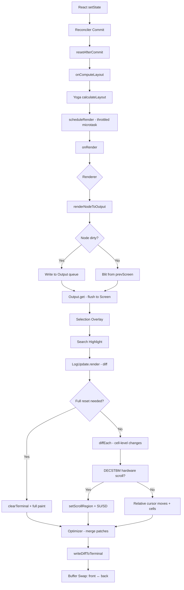
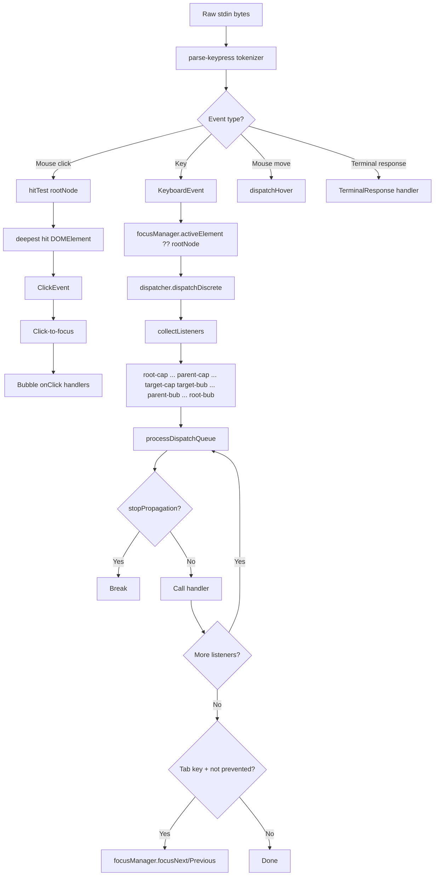
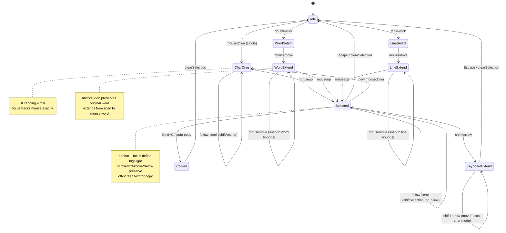
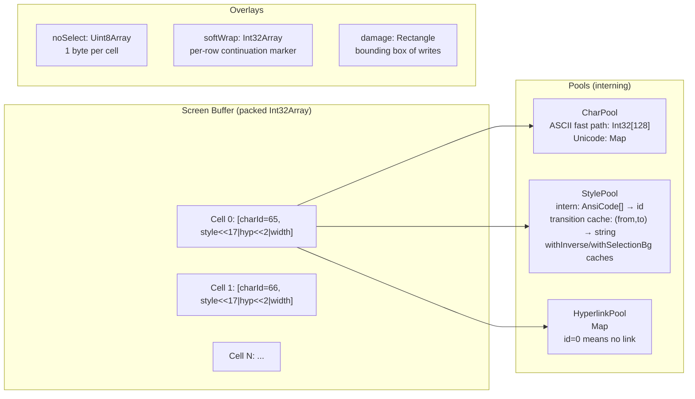

# Terminal UI Framework (Ink) - Comprehensive Research Document

This document provides an exhaustive technical analysis of Claude Code's terminal UI framework. The system is a heavily modified fork of [Ink](https://github.com/vadimdemedes/ink) -- a React-based terminal renderer -- extended with a full-featured screen buffer, differential updates, hardware scroll, text selection, mouse hit-testing, and a DOM-like event system. The framework turns a Unix terminal into a GPU-less display server where React components paint into a virtual framebuffer and a diff engine emits the minimum ANSI sequences to update the physical screen.

---

## 1. Ink Engine

### 1.1 Core Class and Initialization

The engine lives in a single class, `Ink`, instantiated once per stdout stream. It owns the React reconciler container, the DOM root, the frame buffers, object pools, and the rendering pipeline.

```typescript
// ink.tsx - core state
export default class Ink {
  private readonly log: LogUpdate;
  private readonly terminal: Terminal;
  private scheduleRender: (() => void) & { cancel?: () => void };
  private isUnmounted = false;
  private isPaused = false;
  private readonly container: FiberRoot;
  private rootNode: dom.DOMElement;
  readonly focusManager: FocusManager;
  private renderer: Renderer;
  private readonly stylePool: StylePool;
  private charPool: CharPool;
  private hyperlinkPool: HyperlinkPool;
  private frontFrame: Frame;
  private backFrame: Frame;
  // ...
}
```

**Constructor sequence:**

1. Patch console.log/error to redirect to debug log (prevents alt-screen corruption)
2. Create `Terminal` handle wrapping stdout/stderr
3. Read terminal dimensions from `stdout.columns`/`stdout.rows` (fallback 80x24)
4. Instantiate shared pools: `StylePool`, `CharPool`, `HyperlinkPool`
5. Allocate front and back frame buffers via `emptyFrame()`
6. Create `LogUpdate` diffing engine
7. Create `scheduleRender` as a throttled microtask (leading + trailing edge):
   ```typescript
   const deferredRender = (): void => queueMicrotask(this.onRender);
   this.scheduleRender = throttle(deferredRender, FRAME_INTERVAL_MS, {
     leading: true, trailing: true
   });
   ```
8. Register `signal-exit` handler for cleanup on process exit
9. Attach `resize` and `SIGCONT` listeners on TTY stdout
10. Create root DOM node (`ink-root`) with Yoga layout node
11. Create `FocusManager` attached to root node
12. Create renderer function via `createRenderer()`
13. Wire `onRender` and `onComputeLayout` callbacks to root node
14. Create React reconciler container in `ConcurrentRoot` mode

### 1.2 Frame Loop and Render Lifecycle

The render lifecycle has distinct phases triggered by React commits:

```
React setState -> Reconciler commit -> resetAfterCommit ->
  onComputeLayout (Yoga) -> onRender (throttled) -> onRender() body
```

**onComputeLayout** runs during React's commit phase (before layout effects):

```typescript
this.rootNode.onComputeLayout = () => {
  if (this.isUnmounted) return;
  if (this.rootNode.yogaNode) {
    const t0 = performance.now();
    this.rootNode.yogaNode.setWidth(this.terminalColumns);
    this.rootNode.yogaNode.calculateLayout(this.terminalColumns);
    const ms = performance.now() - t0;
    recordYogaMs(ms);
  }
};
```

**onRender** is the main frame function. Its phases, in order:

1. **Guard**: skip if unmounted or paused; cancel pending drain timer
2. **Flush interaction time**: coalesce per-keypress time updates to once-per-frame
3. **Render**: call `this.renderer()` which runs `renderNodeToOutput()` producing a `Frame`
4. **Follow-scroll compensation**: translate selection endpoints to track content
5. **Selection overlay**: apply inverted styles to selected cells
6. **Search highlight**: apply inverse on all matches; yellow+bold on current match
7. **Full-damage backstop**: if layout shifted, selection active, or `prevFrameContaminated`, expand damage to full screen
8. **Diff**: call `this.log.render(prevFrame, nextFrame)` producing a `Diff[]` patch list
9. **Buffer swap**: `backFrame = frontFrame; frontFrame = frame`
10. **Pool reset**: every 5 minutes, replace CharPool/HyperlinkPool with fresh instances
11. **Optimize**: merge adjacent stdout patches
12. **Cursor positioning**: emit CSI H for alt-screen; compute relative moves for native cursor declaration
13. **Write**: call `writeDiffToTerminal()` to flush patches to stdout
14. **Drain scheduling**: if `scrollDrainPending`, schedule next frame at quarter interval
15. **Telemetry**: fire `onFrame` callback with phase timings

### 1.3 Terminal Mode Management

The engine manages two distinct modes:

**Main Screen** (default): Content scrolls naturally. The cursor tracks the bottom of content. Frame height can exceed viewport height, pushing rows into scrollback. Log-update uses relative cursor moves since absolute positioning cannot reach scrollback rows.

**Alt Screen** (fullscreen): Entered via `<AlternateScreen>` component which writes `ENTER_ALT_SCREEN` (DEC private mode 1049h). Content is viewport-locked. Every frame starts with `CSI H` (cursor home) so all moves are absolute. Hardware scroll via DECSTBM is available.

```typescript
setAltScreenActive(active: boolean, mouseTracking = false): void {
  if (this.altScreenActive === active) return;
  this.altScreenActive = active;
  this.altScreenMouseTracking = active && mouseTracking;
  if (active) {
    this.resetFramesForAltScreen();
  } else {
    this.repaint();
  }
}
```

**Suspend/Resume** (`SIGCONT`): On resume from shell suspension, the engine re-enters alt screen if active, re-enables mouse tracking, and forces a full repaint. Frame buffers are reset to blank so the diff sees every cell as changed.

**Resize handling** (synchronous, NOT debounced): Updates dimensions, re-enables mouse tracking, resets frame buffers with `prevFrameContaminated = true`, defers screen erase into the next atomic BSU/ESU block, and re-renders the React tree.

### 1.4 Double-Buffered Frames

The engine uses double-buffering:

- `frontFrame`: the screen buffer representing what is currently visible on the terminal
- `backFrame`: the previously-visible frame, reused as the next render's write target

Each `Frame` contains:
- `screen: Screen` -- the cell buffer
- `viewport: { width, height }` -- terminal dimensions
- `cursor: { x, y, visible }` -- logical cursor position

After each render, the frames swap:
```typescript
this.backFrame = this.frontFrame;
this.frontFrame = frame;
```

---

## 2. React Reconciler

### 2.1 Host Config Implementation

The reconciler is created via `createReconciler<>()` with these type parameters:

```typescript
const reconciler = createReconciler<
  ElementNames,    // 'ink-root' | 'ink-box' | 'ink-text' | 'ink-virtual-text' | 'ink-link' | 'ink-progress' | 'ink-raw-ansi'
  Props,           // Record<string, unknown>
  DOMElement,      // Container
  DOMElement,      // Instance
  TextNode,        // TextInstance
  DOMElement,      // SuspenseInstance
  unknown,         // HydratableInstance
  unknown,         // PublicInstance
  DOMElement,      // HostContext
  HostContext,      // { isInsideText: boolean }
  null,            // UpdatePayload (not used in React 19)
  NodeJS.Timeout,  // TimeoutHandle
  -1,              // NoTimeout
  null             // TransitionStatus
>({...})
```

Key host config methods:

**Instance creation:**
```typescript
createInstance(originalType, newProps, _root, hostContext, internalHandle) {
  // ink-text inside text context becomes ink-virtual-text
  const type = originalType === 'ink-text' && hostContext.isInsideText
    ? 'ink-virtual-text' : originalType;
  const node = createNode(type);
  for (const [key, value] of Object.entries(newProps)) {
    applyProp(node, key, value);
  }
  return node;
}
```

**Text enforcement:**
```typescript
createTextInstance(text, _root, hostContext) {
  if (!hostContext.isInsideText) {
    throw new Error(`Text string "${text}" must be rendered inside <Text>`);
  }
  return createTextNode(text);
}
```

**Prop diffing (React 19 approach -- no updatePayload):**
```typescript
commitUpdate(node, _type, oldProps, newProps) {
  const props = diff(oldProps, newProps);   // shallow key-level diff
  const style = diff(oldProps.style, newProps.style);
  if (props) {
    for (const [key, value] of Object.entries(props)) {
      if (key === 'style') { setStyle(node, value); continue; }
      if (key === 'textStyles') { setTextStyles(node, value); continue; }
      if (EVENT_HANDLER_PROPS.has(key)) { setEventHandler(node, key, value); continue; }
      setAttribute(node, key, value);
    }
  }
  if (style && node.yogaNode) {
    applyStyles(node.yogaNode, style, newProps.style);
  }
}
```

### 2.2 Commit and Layout Flow

The reconciler's `resetAfterCommit` is the critical coordination point:

```typescript
resetAfterCommit(rootNode) {
  _lastCommitMs = _commitStart > 0 ? performance.now() - _commitStart : 0;
  // 1. Compute Yoga layout (during React commit, before layout effects)
  if (typeof rootNode.onComputeLayout === 'function') {
    rootNode.onComputeLayout();
  }
  // 2. In test mode, fire immediate render
  if (process.env.NODE_ENV === 'test') {
    rootNode.onImmediateRender?.();
    return;
  }
  // 3. In production, schedule throttled render
  rootNode.onRender?.();
}
```

### 2.3 Event Priority Integration

The `Dispatcher` instance feeds priority information to the reconciler:

```typescript
getCurrentUpdatePriority: () => dispatcher.currentUpdatePriority,
setCurrentUpdatePriority(newPriority) { dispatcher.currentUpdatePriority = newPriority; },
resolveUpdatePriority(): number { return dispatcher.resolveEventPriority(); },
resolveEventType(): string | null { return dispatcher.currentEvent?.type ?? null; },
resolveEventTimeStamp(): number { return dispatcher.currentEvent?.timeStamp ?? -1.1; },
```

The `dispatcher.discreteUpdates` is wired to `reconciler.discreteUpdates.bind(reconciler)` after construction, breaking the import cycle.

---

## 3. DOM Implementation

### 3.1 Node Types

```typescript
export type ElementNames =
  | 'ink-root'         // Document root (owns FocusManager)
  | 'ink-box'          // Flex container (like <div>)
  | 'ink-text'         // Text container (gets Yoga measure function)
  | 'ink-virtual-text' // Nested text (no own Yoga node)
  | 'ink-link'         // Hyperlink wrapper (no own Yoga node)
  | 'ink-progress'     // Progress indicator (no own Yoga node)
  | 'ink-raw-ansi'     // Pre-rendered ANSI content

export type DOMElement = {
  nodeName: ElementNames;
  attributes: Record<string, DOMNodeAttribute>;
  childNodes: DOMNode[];
  textStyles?: TextStyles;
  parentNode: DOMElement | undefined;
  yogaNode?: LayoutNode;
  style: Styles;
  dirty: boolean;
  isHidden?: boolean;
  _eventHandlers?: Record<string, unknown>;
  // Scroll state
  scrollTop?: number;
  pendingScrollDelta?: number;
  scrollClampMin?: number;
  scrollClampMax?: number;
  scrollHeight?: number;
  scrollViewportHeight?: number;
  scrollViewportTop?: number;
  stickyScroll?: boolean;
  scrollAnchor?: { el: DOMElement; offset: number };
  // Focus
  focusManager?: FocusManager;
  // Debug
  debugOwnerChain?: string[];
  // Render hooks
  onComputeLayout?: () => void;
  onRender?: () => void;
  onImmediateRender?: () => void;
}

export type TextNode = {
  nodeName: '#text';
  nodeValue: string;
  parentNode: DOMElement | undefined;
  yogaNode?: LayoutNode;  // always undefined
  style: Styles;
}
```

### 3.2 Tree Operations

**Node creation** selectively attaches Yoga nodes. Virtual text, links, and progress nodes share their parent's Yoga node:

```typescript
export const createNode = (nodeName: ElementNames): DOMElement => {
  const needsYogaNode =
    nodeName !== 'ink-virtual-text' &&
    nodeName !== 'ink-link' &&
    nodeName !== 'ink-progress';
  const node: DOMElement = {
    nodeName, style: {}, attributes: {}, childNodes: [],
    parentNode: undefined,
    yogaNode: needsYogaNode ? createLayoutNode() : undefined,
    dirty: false,
  };
  if (nodeName === 'ink-text') {
    node.yogaNode?.setMeasureFunc(measureTextNode.bind(null, node));
  } else if (nodeName === 'ink-raw-ansi') {
    node.yogaNode?.setMeasureFunc(measureRawAnsiNode.bind(null, node));
  }
  return node;
};
```

**Dirty propagation** walks up from the mutated node to root, marking Yoga dirty on text leaf nodes:

```typescript
export const markDirty = (node?: DOMNode): void => {
  let current: DOMNode | undefined = node;
  let markedYoga = false;
  while (current) {
    if (current.nodeName !== '#text') {
      (current as DOMElement).dirty = true;
      if (!markedYoga && (current.nodeName === 'ink-text' ||
          current.nodeName === 'ink-raw-ansi') && current.yogaNode) {
        current.yogaNode.markDirty();
        markedYoga = true;
      }
    }
    current = current.parentNode;
  }
};
```

### 3.3 Attribute Updates with Dirty Suppression

Style and attribute setters perform value comparison to avoid unnecessary dirty marks:

```typescript
export const setAttribute = (node, key, value) => {
  if (key === 'children') return;        // React handles children via DOM ops
  if (node.attributes[key] === value) return;  // Skip if unchanged
  node.attributes[key] = value;
  markDirty(node);
};

export const setStyle = (node, style) => {
  if (stylesEqual(node.style, style)) return;  // Shallow equality check
  node.style = style;
  markDirty(node);
};
```

Event handlers are stored in `_eventHandlers` separately from attributes so handler identity changes (common with React re-renders) do not mark dirty and defeat the blit optimization.

---

## 4. Rendering Pipeline

### 4.1 Full Pipeline Overview

```
React Tree
    |
    v
[Reconciler Commit] -- resetAfterCommit
    |
    v
[Yoga Layout]  -- calculateLayout(terminalColumns)
    |
    v
[Renderer]     -- renderNodeToOutput() -> Frame { screen, viewport, cursor }
    |
    v
[Selection/Highlight Overlay] -- mutate screen buffer in-place
    |
    v
[Diff Engine]  -- LogUpdate.render(prevFrame, nextFrame) -> Diff[]
    |
    v
[Optimizer]    -- merge adjacent stdout patches
    |
    v
[Terminal Write] -- writeDiffToTerminal()
```

### 4.2 renderNodeToOutput (Tree to Screen Buffer)

This is the core rendering function that walks the DOM tree and writes to the Output queue. For each node:

1. **Display check**: Skip `display: none` nodes, clearing their old position
2. **Position calculation**: Accumulate Yoga offsets (`offsetX + computedLeft`, `offsetY + computedTop`)
3. **Blit optimization**: If node is clean (not dirty), position unchanged, and prevScreen available, copy cells from previous frame:
   ```typescript
   if (!node.dirty && !skipSelfBlit && cached &&
       cached.x === x && cached.y === y &&
       cached.width === width && cached.height === height && prevScreen) {
     output.blit(prevScreen, fx, fy, fw, fh);
     return;
   }
   ```
4. **Clear stale content**: If position changed or node dirty, clear old rect
5. **Scroll handling**: For `overflow: scroll` nodes, compute scrollTop, drain pendingScrollDelta (adaptive for xterm.js, proportional for native terminals), apply scrollAnchor, compute DECSTBM hints
6. **Text rendering**: Squash text nodes to styled segments, wrap text, apply styles, write to output
7. **Border rendering**: Draw box characters with colored borders
8. **Child recursion**: Traverse children with accumulated offsets

**Scroll drain algorithms:**

```typescript
// xterm.js adaptive drain
function drainAdaptive(node, pending, innerHeight): number {
  // <=5 pending: drain ALL (slow click = instant)
  // 6-11: step 2 (catch-up)
  // >=12: step 3 (fast flick)
  // >30: snap excess beyond animation window
}

// Native proportional drain
function drainProportional(node, pending, innerHeight): number {
  // step = max(4, floor(abs*3/4)), capped at innerHeight-1
  // Log4 convergence: big bursts catch up, tail decelerates
}
```

### 4.3 Output Class (Operation Queue)

The `Output` class collects rendering operations and applies them to a Screen buffer:

```typescript
export type Operation =
  | WriteOperation   // Write ANSI text at (x, y)
  | ClipOperation    // Push clip rectangle
  | UnclipOperation  // Pop clip rectangle
  | BlitOperation    // Copy cells from another screen
  | ClearOperation   // Zero cells in a rectangle
  | NoSelectOperation // Mark cells as non-selectable
  | ShiftOperation   // Shift rows (for hardware scroll)
```

The `get()` method processes operations in two passes:
1. **Clear pass**: Expand damage to cover clear regions; collect absolute-positioned clears
2. **Main pass**: Process write/blit/clip/shift operations with nested clip intersection

**Clip intersection** prevents nested overflow:hidden boxes from writing outside their ancestor's clip:
```typescript
function intersectClip(parent: Clip | undefined, child: Clip): Clip {
  if (!parent) return child;
  return {
    x1: maxDefined(parent.x1, child.x1),
    x2: minDefined(parent.x2, child.x2),
    y1: maxDefined(parent.y1, child.y1),
    y2: minDefined(parent.y2, child.y2),
  };
}
```

### 4.4 Screen Buffer

The Screen uses packed `Int32Array` for zero-GC cell storage:

```typescript
export type Screen = Size & {
  cells: Int32Array;      // 2 Int32s per cell: [charId, packed(styleId|hyperlinkId|width)]
  cells64: BigInt64Array; // Same buffer as BigInt64 view for bulk fills
  charPool: CharPool;
  hyperlinkPool: HyperlinkPool;
  emptyStyleId: number;
  damage: Rectangle | undefined;
  noSelect: Uint8Array;   // Per-cell selection exclusion
  softWrap: Int32Array;   // Per-row soft-wrap continuation marker
}
```

Cell packing layout (word1):
```
Bits [31:17] = styleId (15 bits, max 32767 styles)
Bits [16:2]  = hyperlinkId (15 bits)
Bits [1:0]   = width (2 bits: Narrow=0, Wide=1, SpacerTail=2, SpacerHead=3)
```

---

## 5. Layout Engine

### 5.1 Yoga Integration via Adapter

The layout engine is abstracted behind a `LayoutNode` interface:

```typescript
export type LayoutNode = {
  // Tree management
  insertChild(child: LayoutNode, index: number): void;
  removeChild(child: LayoutNode): void;
  getChildCount(): number;
  getParent(): LayoutNode | null;

  // Layout computation
  calculateLayout(width?: number, height?: number): void;
  setMeasureFunc(fn: LayoutMeasureFunc): void;
  markDirty(): void;

  // Post-layout reading
  getComputedLeft(): number;
  getComputedTop(): number;
  getComputedWidth(): number;
  getComputedHeight(): number;
  getComputedBorder(edge: LayoutEdge): number;
  getComputedPadding(edge: LayoutEdge): number;

  // Style setters (50+ methods)
  setWidth(value: number): void;
  setFlexDirection(dir: LayoutFlexDirection): void;
  setDisplay(display: LayoutDisplay): void;
  setOverflow(overflow: LayoutOverflow): void;
  // ... and many more
};
```

The factory `createLayoutNode()` delegates to `createYogaLayoutNode()` which creates a WASM-backed Yoga node.

### 5.2 Measure Callbacks

Text nodes register a measure function that Yoga calls during layout:

```typescript
const measureTextNode = function(node, width, widthMode) {
  const rawText = node.nodeName === '#text' ? node.nodeValue : squashTextNodes(node);
  const text = expandTabs(rawText);
  const dimensions = measureText(text, width);

  if (dimensions.width <= width) return dimensions;
  if (dimensions.width >= 1 && width > 0 && width < 1) return dimensions;

  // For pre-wrapped content in Undefined mode, use natural width
  if (text.includes('\n') && widthMode === LayoutMeasureMode.Undefined) {
    return measureText(text, Math.max(width, dimensions.width));
  }

  // Wrap and re-measure
  const textWrap = node.style?.textWrap ?? 'wrap';
  const wrappedText = wrapText(text, width, textWrap);
  return measureText(wrappedText, width);
};
```

Raw ANSI nodes bypass measurement entirely -- they report their known dimensions:
```typescript
const measureRawAnsiNode = function(node) {
  return {
    width: node.attributes['rawWidth'] as number,
    height: node.attributes['rawHeight'] as number,
  };
};
```

### 5.3 Style Application

The `applyStyles()` function maps CSS-like Ink styles to Yoga setters:

```typescript
export default function applyStyles(
  node: LayoutNode,
  style: Styles,
  fullStyle?: Styles,
): void {
  applyPositionStyles(node, style);
  applyMarginStyles(node, style);
  applyPaddingStyles(node, style);
  applyFlexStyles(node, style);
  applyDimensionStyles(node, style);
  applyDisplayStyles(node, style);
  applyBorderStyles(node, style);
  applyOverflowStyles(node, style);
  applyGapStyles(node, style);
}
```

Percentage values are supported for position and dimension:
```typescript
function applyPositionEdge(node, edge, v) {
  if (typeof v === 'string') {
    node.setPositionPercent(edge, Number.parseInt(v, 10));
  } else if (typeof v === 'number') {
    node.setPosition(edge, v);
  } else {
    node.setPosition(edge, Number.NaN);  // unset
  }
}
```

---

## 6. Differential Updates

### 6.1 LogUpdate Diff Engine

The `LogUpdate.render()` method compares two frames and produces a minimal patch list:

```typescript
render(prev: Frame, next: Frame, altScreen = false, decstbmSafe = true): Diff
```

**Full-reset triggers** (cause visible flicker):
- Viewport resize (width changed or height decreased)
- Shrinking from above-viewport to at-or-below-viewport
- Changes to rows in scrollback (unreachable by cursor)

**DECSTBM hardware scroll** (alt-screen only, when `decstbmSafe`):
```typescript
if (altScreen && next.scrollHint && decstbmSafe) {
  const { top, bottom, delta } = next.scrollHint;
  // Shift prev.screen in memory to match terminal's hardware scroll
  shiftRows(prev.screen, top, bottom, delta);
  scrollPatch = [{
    type: 'stdout',
    content: setScrollRegion(top + 1, bottom + 1) +
      (delta > 0 ? csiScrollUp(delta) : csiScrollDown(-delta)) +
      RESET_SCROLL_REGION + CURSOR_HOME,
  }];
}
```

**Cell-level diff** via `diffEach()`:
```typescript
diffEach(prev.screen, next.screen, (x, y, removed, added) => {
  // Skip spacer cells (SpacerTail/SpacerHead)
  // Skip empty cells that don't overwrite existing content
  // Full-reset if change is in unreachable scrollback
  moveCursorTo(screen, x, y);
  if (added) {
    // Transition hyperlink and style, write cell
    transitionHyperlink(screen.diff, currentHyperlink, added.hyperlink);
    const styleStr = stylePool.transition(currentStyleId, added.styleId);
    writeCellWithStyleStr(screen, added, styleStr);
  } else if (removed) {
    // Clear with space
  }
});
```

### 6.2 Style Transition Cache

The `StylePool.transition()` method avoids re-computing ANSI diffs:
```typescript
transition(fromId: number, toId: number): string {
  if (fromId === toId) return '';
  const key = fromId * 0x100000 + toId;
  let str = this.transitionCache.get(key);
  if (str === undefined) {
    str = ansiCodesToString(diffAnsiCodes(this.get(fromId), this.get(toId)));
    this.transitionCache.set(key, str);
  }
  return str;
}
```

### 6.3 VirtualScreen Cursor Tracking

The diff engine tracks a virtual cursor position to compute relative moves:

```typescript
class VirtualScreen {
  cursor: Point;
  diff: Diff = [];
  readonly viewportWidth: number;

  txn(fn: (prev: Point) => [patches: Diff, next: Delta]): void {
    const [patches, next] = fn(this.cursor);
    for (const patch of patches) this.diff.push(patch);
    this.cursor.x += next.dx;
    this.cursor.y += next.dy;
  }
}
```

### 6.4 Wide Character Width Compensation

For emoji where terminal wcwidth may disagree with Unicode:

```typescript
function writeCellWithStyleStr(screen, cell, styleStr): boolean {
  const needsCompensation = cellWidth === 2 && needsWidthCompensation(cell.char);
  if (needsCompensation && px + 1 < vw) {
    // Write space at x+1 (covers gap on old terminals)
    diff.push({ type: 'cursorTo', col: px + 2 });
    diff.push({ type: 'stdout', content: ' ' });
    diff.push({ type: 'cursorTo', col: px + 1 });
  }
  diff.push({ type: 'stdout', content: cell.char });
  if (needsCompensation) {
    diff.push({ type: 'cursorTo', col: px + cellWidth + 1 });
  }
  return true;
}
```

---

## 7. Event System

### 7.1 Event Dispatcher

The `Dispatcher` class implements DOM-like capture/bubble event dispatch:

```typescript
export class Dispatcher {
  currentEvent: TerminalEvent | null = null;
  currentUpdatePriority: number = DefaultEventPriority;
  discreteUpdates: DiscreteUpdates | null = null;

  dispatch(target: EventTarget, event: TerminalEvent): boolean {
    const previousEvent = this.currentEvent;
    this.currentEvent = event;
    try {
      event._setTarget(target);
      const listeners = collectListeners(target, event);
      processDispatchQueue(listeners, event);
      return !event.defaultPrevented;
    } finally {
      this.currentEvent = previousEvent;
    }
  }

  dispatchDiscrete(target, event) { /* wraps in reconciler.discreteUpdates */ }
  dispatchContinuous(target, event) { /* sets ContinuousEventPriority */ }
}
```

### 7.2 Capture/Bubble Collection

Listeners are collected in DOM order following react-dom's two-phase pattern:

```typescript
function collectListeners(target, event): DispatchListener[] {
  const listeners: DispatchListener[] = [];
  let node = target;
  while (node) {
    const isTarget = node === target;
    const captureHandler = getHandler(node, event.type, true);
    const bubbleHandler = getHandler(node, event.type, false);

    if (captureHandler) {
      listeners.unshift({  // Capture: prepend (root-first)
        node, handler: captureHandler,
        phase: isTarget ? 'at_target' : 'capturing',
      });
    }
    if (bubbleHandler && (event.bubbles || isTarget)) {
      listeners.push({    // Bubble: append (target-first)
        node, handler: bubbleHandler,
        phase: isTarget ? 'at_target' : 'bubbling',
      });
    }
    node = node.parentNode;
  }
  return listeners;
}
```

Result order: `[root-cap, ..., parent-cap, target-cap, target-bub, parent-bub, ..., root-bub]`

### 7.3 Event Priority Mapping

```typescript
function getEventPriority(eventType: string): number {
  switch (eventType) {
    case 'keydown': case 'keyup': case 'click':
    case 'focus': case 'blur': case 'paste':
      return DiscreteEventPriority;      // Sync, immediate
    case 'resize': case 'scroll': case 'mousemove':
      return ContinuousEventPriority;    // Batched
    default:
      return DefaultEventPriority;
  }
}
```

### 7.4 TerminalEvent Base Class

```typescript
export class TerminalEvent extends Event {
  readonly type: string;
  readonly timeStamp: number;
  readonly bubbles: boolean;
  readonly cancelable: boolean;

  stopPropagation(): void;
  stopImmediatePropagation(): void;
  preventDefault(): void;

  // Internal dispatch hooks
  _setTarget(target: EventTarget): void;
  _setCurrentTarget(target: EventTarget | null): void;
  _setEventPhase(phase: EventPhase): void;
  _prepareForTarget(_target: EventTarget): void;  // Per-node setup hook
}
```

### 7.5 KeyboardEvent

```typescript
export class KeyboardEvent extends TerminalEvent {
  readonly key: string;    // 'a', 'return', 'escape', 'f1', etc.
  readonly ctrl: boolean;
  readonly shift: boolean;
  readonly meta: boolean;
  readonly superKey: boolean;
  readonly fn: boolean;

  constructor(parsedKey: ParsedKey) {
    super('keydown', { bubbles: true, cancelable: true });
    this.key = keyFromParsed(parsedKey);
    // ...
  }
}
```

The `key` property follows browser conventions: single printable char for printable keys (`'a'`, `'3'`, `' '`), multi-char name for special keys (`'down'`, `'return'`). The idiomatic printable-char check is `e.key.length === 1`.

### 7.6 ClickEvent and Hit Testing

```typescript
export class ClickEvent extends Event {
  readonly col: number;         // Screen column
  readonly row: number;         // Screen row
  localCol: number;             // Relative to handler's Box
  localRow: number;             // Relative to handler's Box
  readonly cellIsBlank: boolean; // True if clicked on empty space
}
```

Hit testing uses nodeCache (populated by renderNodeToOutput):

```typescript
export function hitTest(node: DOMElement, col: number, row: number): DOMElement | null {
  const rect = nodeCache.get(node);
  if (!rect) return null;
  if (col < rect.x || col >= rect.x + rect.width ||
      row < rect.y || row >= rect.y + rect.height) return null;
  // Later siblings paint on top; reversed traversal returns topmost hit
  for (let i = node.childNodes.length - 1; i >= 0; i--) {
    const child = node.childNodes[i]!;
    if (child.nodeName === '#text') continue;
    const hit = hitTest(child, col, row);
    if (hit) return hit;
  }
  return node;
}
```

**Dispatch** bubbles from hit node upward, recomputing local coordinates per handler:
```typescript
export function dispatchClick(root, col, row, cellIsBlank = false): boolean {
  let target = hitTest(root, col, row) ?? undefined;
  // Click-to-focus: find closest focusable ancestor
  const event = new ClickEvent(col, row, cellIsBlank);
  while (target) {
    const handler = target._eventHandlers?.onClick;
    if (handler) {
      const rect = nodeCache.get(target);
      if (rect) {
        event.localCol = col - rect.x;
        event.localRow = row - rect.y;
      }
      handler(event);
      if (event.didStopImmediatePropagation()) return true;
    }
    target = target.parentNode;
  }
}
```

### 7.7 Hover Dispatch (mouseenter/mouseleave)

```typescript
export function dispatchHover(root, col, row, hovered: Set<DOMElement>): void {
  const next = new Set<DOMElement>();
  let node = hitTest(root, col, row) ?? undefined;
  while (node) {
    if (node._eventHandlers?.onMouseEnter || node._eventHandlers?.onMouseLeave)
      next.add(node);
    node = node.parentNode;
  }
  // Fire leave on exited nodes, enter on entered nodes
  for (const old of hovered) {
    if (!next.has(old)) { hovered.delete(old); old._eventHandlers?.onMouseLeave?.(); }
  }
  for (const n of next) {
    if (!hovered.has(n)) { hovered.add(n); n._eventHandlers?.onMouseEnter?.(); }
  }
}
```

### 7.8 Keyboard Parsing

The parser uses a streaming tokenizer that handles:
- CSI sequences (arrow keys, function keys, modifiers)
- CSI u (Kitty keyboard protocol): `ESC [ codepoint [; modifier] u`
- modifyOtherKeys: `ESC [ 27 ; modifier ; keycode ~`
- SGR mouse events: `ESC [ < button ; col ; row M/m`
- Terminal responses: DECRPM, DA1, DA2, XTVERSION, cursor position, OSC
- Bracketed paste: `ESC [200~` ... `ESC [201~`

```typescript
export type ParsedKey = {
  kind: 'key';
  name: string;
  fn: boolean;
  ctrl: boolean;
  meta: boolean;
  shift: boolean;
  option: boolean;
  super: boolean;
  sequence: string | undefined;
  raw: string | undefined;
  isPasted?: boolean;
}

export type TerminalResponse =
  | { type: 'decrpm'; mode: number; status: number }
  | { type: 'da1'; params: number[] }
  | { type: 'da2'; params: number[] }
  | { type: 'kittyKeyboard'; flags: number }
  | { type: 'cursorPosition'; row: number; col: number }
  | { type: 'osc'; code: number; data: string }
  | { type: 'xtversion'; name: string }
```

---

## 8. Selection System

### 8.1 State Machine

```typescript
export type SelectionState = {
  anchor: Point | null;       // Where drag started
  focus: Point | null;        // Current drag position
  isDragging: boolean;        // Between mousedown and mouseup
  anchorSpan: { lo: Point; hi: Point; kind: 'word' | 'line' } | null;
  scrolledOffAbove: string[]; // Text from rows scrolled out above
  scrolledOffBelow: string[]; // Text from rows scrolled out below
  scrolledOffAboveSW: boolean[]; // Soft-wrap bits for above
  scrolledOffBelowSW: boolean[]; // Soft-wrap bits for below
  virtualAnchorRow?: number;  // Pre-clamp row for round-trip
  virtualFocusRow?: number;   // Pre-clamp row for round-trip
  lastPressHadAlt: boolean;
}
```

### 8.2 Selection Modes

**Char mode** (single click + drag):
```typescript
export function startSelection(s, col, row): void {
  s.anchor = { col, row };
  s.focus = null;  // Set on first drag motion
  s.isDragging = true;
  s.anchorSpan = null;
}
```

**Word mode** (double-click): Uses character class classification matching iTerm2 defaults:
```typescript
const WORD_CHAR = /[\p{L}\p{N}_/.\-+~\\]/u;
function charClass(c: string): 0 | 1 | 2 {
  if (c === ' ' || c === '') return 0;  // whitespace
  if (WORD_CHAR.test(c)) return 1;      // word chars
  return 2;                              // punctuation
}
```

Word bounds scan left and right from the click, handling wide characters (SpacerTail cells).

**Line mode** (triple-click): Selects full row from col 0 to width-1.

**Extension during drag**: In word/line mode, the anchor span stays selected; the selection grows to the word/line at the current mouse position:

```typescript
export function extendSelection(s, screen, col, row): void {
  if (span.kind === 'word') {
    const b = wordBoundsAt(screen, col, row);
    // Extend from anchor span to mouse word bounds
  } else {
    // Extend from anchor span to mouse line
  }
}
```

### 8.3 Scroll Compensation

During follow-scroll (sticky content appending), the selection must track the content:

```typescript
// ink.tsx onRender
if (follow && s.anchor) {
  if (s.isDragging) {
    captureScrolledRows(s, frontFrame.screen, viewportTop, viewportTop + delta - 1, 'above');
    shiftAnchor(s, -delta, viewportTop, viewportBottom);
  } else {
    captureScrolledRows(s, frontFrame.screen, viewportTop, viewportTop + delta - 1, 'above');
    shiftSelectionForFollow(s, -delta, viewportTop, viewportBottom);
  }
}
```

The `shiftSelection` function handles keyboard-scroll (PgUp/PgDn) with virtual row tracking:

```typescript
export function shiftSelection(s, dRow, minRow, maxRow, width): void {
  // Track virtual (pre-clamp) rows for round-trip correctness
  const vAnchor = (s.virtualAnchorRow ?? s.anchor.row) + dRow;
  const vFocus = (s.virtualFocusRow ?? s.focus.row) + dRow;
  // Clear if both endpoints overshoot same edge
  if ((vAnchor < minRow && vFocus < minRow) ||
      (vAnchor > maxRow && vFocus > maxRow)) {
    clearSelection(s); return;
  }
  // Pop accumulators when debt shrinks (reverse scroll)
  // Clamp and update
}
```

### 8.4 Selection Overlay

Applied to the screen buffer after rendering, before diffing:

```typescript
export function applySelectionOverlay(screen, selection, stylePool): void {
  // Normalize anchor/focus to start/end
  // For each row in selection range:
  //   For each cell in column range:
  //     Skip noSelect cells
  //     setCellStyleId(screen, col, row, stylePool.withSelectionBg(cell.styleId))
}
```

### 8.5 Plain-Text URL Detection

When mouse tracking intercepts Cmd+Click, Ink replicates the terminal's URL detection:

```typescript
export function findPlainTextUrlAt(screen, col, row): string | undefined {
  // Expand left/right to ASCII URL-char boundaries
  // Find last scheme anchor (https?://|file://) at or before click
  // Strip trailing sentence punctuation (balanced parens)
  return url;
}
```

---

## 9. Style System

### 9.1 Style Types

```typescript
export type Color = RGBColor | HexColor | Ansi256Color | AnsiColor;
// Where:
//   RGBColor = `rgb(${number},${number},${number})`
//   HexColor = `#${string}`
//   Ansi256Color = `ansi256(${number})`
//   AnsiColor = 'ansi:black' | 'ansi:red' | ... | 'ansi:whiteBright'

export type TextStyles = {
  readonly color?: Color;
  readonly backgroundColor?: Color;
  readonly dim?: boolean;
  readonly bold?: boolean;
  readonly italic?: boolean;
  readonly underline?: boolean;
  readonly strikethrough?: boolean;
  readonly inverse?: boolean;
}

export type Styles = {
  // Text wrapping
  readonly textWrap?: 'wrap' | 'wrap-trim' | 'end' | 'middle' | 'truncate-end' | 'truncate' | 'truncate-middle' | 'truncate-start';
  // Position
  readonly position?: 'absolute' | 'relative';
  readonly top/bottom/left/right?: number | `${number}%`;
  // Box model
  readonly margin/marginX/marginY/marginTop/.../marginRight?: number;
  readonly padding/paddingX/.../paddingRight?: number;
  // Flex
  readonly flexGrow/flexShrink/flexDirection/flexBasis/flexWrap?: ...;
  readonly alignItems/alignSelf/justifyContent?: ...;
  // Dimensions
  readonly width/height/minWidth/minHeight/maxWidth/maxHeight?: number | string;
  // Display
  readonly display?: 'flex' | 'none';
  // Border
  readonly borderStyle?: BorderStyle;
  readonly borderColor/borderTopColor/.../borderRightColor?: Color;
  // Overflow
  readonly overflow/overflowX/overflowY?: 'visible' | 'hidden' | 'scroll';
  // Background
  readonly backgroundColor?: Color;
  readonly opaque?: boolean;
  // Selection
  readonly noSelect?: boolean | 'from-left-edge';
  // Gap
  readonly gap/columnGap/rowGap?: number;
}
```

### 9.2 Colorize System

Color application with terminal-aware adjustments:

```typescript
// At module load:
boostChalkLevelForXtermJs();  // VS Code containers: level 2 -> 3
clampChalkLevelForTmux();     // tmux: level 3 -> 2 (unless CLAUDE_CODE_TMUX_TRUECOLOR)

export const colorize = (str, color, type: 'foreground' | 'background') => {
  if (color.startsWith('ansi:'))    // Named ANSI colors via chalk
  if (color.startsWith('#'))         // Hex via chalk.hex()
  if (color.startsWith('ansi256'))   // 256-color via chalk.ansi256()
  if (color.startsWith('rgb'))       // Truecolor via chalk.rgb()
};
```

**Text style application** (chalk wrapper):
```typescript
export function applyTextStyles(text: string, styles: TextStyles): string {
  // Apply in reverse nesting order (innermost first):
  // inverse -> strikethrough -> underline -> italic -> bold -> dim -> color -> backgroundColor
  if (styles.inverse) result = chalk.inverse(result);
  if (styles.bold) result = chalk.bold(result);
  if (styles.color) result = colorize(result, styles.color, 'foreground');
  if (styles.backgroundColor) result = colorize(result, styles.backgroundColor, 'background');
  return result;
}
```

### 9.3 StylePool

The StylePool interns ANSI style arrays and provides cached transitions:

```typescript
export class StylePool {
  private ids = new Map<string, number>();
  private styles: AnsiCode[][] = [];
  private transitionCache = new Map<number, string>();

  intern(styles: AnsiCode[]): number {
    // Bit 0 encodes visible-on-space (bg, inverse, underline)
    // rawId << 1 | visibleBit
  }

  transition(fromId, toId): string {
    // Cached ANSI diff string
  }

  withInverse(baseId): number { /* base + SGR 7, cached */ }
  withCurrentMatch(baseId): number { /* yellow+bold+underline+inverse, cached */ }
  withSelectionBg(baseId): number { /* replace bg, keep fg, cached */ }
}
```

The bit-0 encoding enables the renderer to skip invisible spaces with a single bitmask check:
```
// If bit 0 is 0 (no visible space effect) AND char is space -> skip
```

---

## 10. Component Library

### 10.1 Box Component

`<Box>` maps to `<ink-box>` and is the fundamental layout primitive, analogous to `<div style="display: flex">`:

```typescript
export type Props = Except<Styles, 'textWrap'> & {
  ref?: Ref<DOMElement>;
  tabIndex?: number;
  autoFocus?: boolean;
  onClick?: (event: ClickEvent) => void;
  onFocus?: (event: FocusEvent) => void;
  onFocusCapture?: (event: FocusEvent) => void;
  onBlur?: (event: FocusEvent) => void;
  onBlurCapture?: (event: FocusEvent) => void;
  onKeyDown?: (event: KeyboardEvent) => void;
  onKeyDownCapture?: (event: KeyboardEvent) => void;
  onMouseEnter?: () => void;
  onMouseLeave?: () => void;
};
```

Defaults: `flexWrap: "nowrap"`, `flexDirection: "row"`, `flexGrow: 0`, `flexShrink: 1`.

The component is compiled with React Compiler (`_c` memoization slots), splitting the props destructure from the JSX render to maximize cache hits.

### 10.2 Text Component

`<Text>` maps to `<ink-text>` and is the only component allowed to contain string content:

```typescript
export type Props = BaseProps & WeightProps;
// Where BaseProps includes color, backgroundColor, italic, underline, strikethrough, inverse, wrap
// And WeightProps enforces mutual exclusion of bold and dim
```

The component creates pre-memoized style objects per wrap mode:
```typescript
const memoizedStylesForWrap: Record<NonNullable<Styles['textWrap']>, Styles> = {
  wrap: { flexGrow: 0, flexShrink: 1, flexDirection: 'row', textWrap: 'wrap' },
  'wrap-trim': { ... },
  // ...
};
```

### 10.3 ScrollBox Component

`<ScrollBox>` wraps `<Box overflow="scroll">` with an imperative scroll API:

```typescript
export type ScrollBoxHandle = {
  scrollTo: (y: number) => void;
  scrollBy: (dy: number) => void;
  scrollToElement: (el: DOMElement, offset?: number) => void;
  scrollToBottom: () => void;
  getScrollTop: () => number;
  getPendingDelta: () => number;
  getScrollHeight: () => number;
  getFreshScrollHeight: () => number;
  getViewportHeight: () => number;
  getViewportTop: () => number;
  isSticky: () => boolean;
  subscribe: (listener: () => void) => () => void;
  setClampBounds: (min?: number, max?: number) => void;
};
```

**Key architectural decision**: `scrollTo`/`scrollBy` bypass React entirely. They mutate `scrollTop` on the DOM node, call `markDirty()`, and schedule a render via microtask. This avoids reconciler overhead per wheel event.

```typescript
scrollBy(dy: number) {
  const el = domRef.current;
  el.stickyScroll = false;
  el.scrollAnchor = undefined;
  el.pendingScrollDelta = (el.pendingScrollDelta ?? 0) + Math.floor(dy);
  scrollMutated(el);  // markDirty -> microtask -> scheduleRenderFrom
}
```

### 10.4 Button Component

`<Button>` provides keyboard-interactive focus-ring boxes with click handlers, using tabIndex, autoFocus, and onKeyDown for Enter/Space activation.

---

## 11. Performance Optimizations

### 11.1 CharPool (String Interning)

```typescript
export class CharPool {
  private strings: string[] = [' ', ''];  // Index 0=space, 1=empty
  private stringMap = new Map<string, number>();
  private ascii: Int32Array = new Int32Array(128).fill(-1);  // Fast path

  intern(char: string): number {
    if (char.length === 1) {
      const code = char.charCodeAt(0);
      if (code < 128) {
        const cached = this.ascii[code]!;
        if (cached !== -1) return cached;
        // ... intern
      }
    }
    // ... Map lookup
  }
}
```

The ASCII fast path uses a direct array lookup (O(1)) instead of Map.get, critical for the hot per-cell loop.

### 11.2 StylePool Transition Cache

Style transitions between any two style IDs are computed once and cached forever:
```typescript
transition(fromId, toId): string {
  const key = fromId * 0x100000 + toId;  // Pack into single number
  let str = this.transitionCache.get(key);
  if (str === undefined) {
    str = ansiCodesToString(diffAnsiCodes(this.get(fromId), this.get(toId)));
    this.transitionCache.set(key, str);
  }
  return str;
}
```

### 11.3 Node Cache (Blit Optimization)

The `nodeCache` stores the last-rendered rect for each DOM node. Clean nodes with unchanged position are blitted from the previous frame's screen buffer instead of re-rendered:

```typescript
if (!node.dirty && cached &&
    cached.x === x && cached.y === y &&
    cached.width === width && cached.height === height && prevScreen) {
  output.blit(prevScreen, fx, fy, fw, fh);
  return;  // Skip entire subtree
}
```

This is the single most important optimization: in steady-state frames (spinner tick, clock update), only the dirty node's cells are re-rendered; all other nodes are bulk-copied via `TypedArray.set()`.

### 11.4 Packed Cell Arrays

Using `Int32Array` instead of object arrays eliminates 24,000+ objects per 200x120 screen:

```typescript
// 2 Int32s per cell in contiguous memory
cells: Int32Array;      // [charId0, packed0, charId1, packed1, ...]
cells64: BigInt64Array;  // Same buffer, 64-bit view for bulk fill

// Bulk clear: zero the entire buffer in one call
resetScreen(screen): void {
  screen.cells64.fill(EMPTY_CELL_VALUE);  // 0n
}
```

### 11.5 Damage Tracking

The screen tracks a bounding rectangle of cells that were written (not blitted). The diff engine only iterates cells within this damage region:

```typescript
screen.damage = screen.damage ? unionRect(screen.damage, rect) : rect;
```

### 11.6 Output charCache

Line-level caching in the Output class avoids re-tokenizing and re-clustering unchanged lines:

```typescript
function writeLineToScreen(screen, line, x, y, screenWidth, stylePool, charCache) {
  let characters = charCache.get(line);
  if (!characters) {
    characters = reorderBidi(
      styledCharsWithGraphemeClustering(
        styledCharsFromTokens(tokenize(line)), stylePool));
    charCache.set(line, characters);
  }
  // ... write characters to screen
}
```

The cache persists across frames; evicted when size exceeds 16384 entries.

### 11.7 Width Calculation

Terminal width calculation uses Bun.stringWidth when available (native, single call) or a JavaScript fallback with multiple fast paths:

```typescript
export const stringWidth = bunStringWidth
  ? str => bunStringWidth(str, { ambiguousIsNarrow: true })
  : stringWidthJavaScript;

function stringWidthJavaScript(str: string): number {
  // Fast path 1: pure ASCII (no ANSI, no wide chars)
  // Fast path 2: simple Unicode (no emoji/variation selectors)
  // Slow path: grapheme segmentation with emoji detection
}
```

### 11.8 Pool Reset

Pools grow unboundedly during long sessions. Every 5 minutes, CharPool and HyperlinkPool are replaced with fresh instances. The front frame's screen is migrated to the new pools:

```typescript
resetPools(): void {
  this.charPool = new CharPool();
  this.hyperlinkPool = new HyperlinkPool();
  migrateScreenPools(this.frontFrame.screen, this.charPool, this.hyperlinkPool);
  this.backFrame.screen.charPool = this.charPool;
  this.backFrame.screen.hyperlinkPool = this.hyperlinkPool;
}
```

### 11.9 Frame Scheduling

- Normal renders: throttled at `FRAME_INTERVAL_MS` (leading + trailing)
- Scroll drain frames: `FRAME_INTERVAL_MS >> 2` (quarter interval, ~250fps practical ceiling)
- The `scheduleRender` is a microtask wrapped in lodash throttle, ensuring layout effects have committed before render
- Drain timer and throttled render coordinate: entering onRender cancels pending drain timer

---

## 12. Focus Management

The `FocusManager` provides DOM-like focus with a stack for history:

```typescript
export class FocusManager {
  activeElement: DOMElement | null = null;
  private focusStack: DOMElement[] = [];  // Max 32 entries

  focus(node): void {
    // Push previous to stack (deduplicated), dispatch blur/focus events
  }

  handleNodeRemoved(node, root): void {
    // Clean stack, dispatch blur, restore from stack
  }

  focusNext(root) / focusPrevious(root): void {
    // Collect tabbable nodes (tabIndex >= 0), cycle through
  }
}
```

Tab cycling is the default action for Tab key -- only fires if no handler called `preventDefault()`, mirroring browser behavior.

---

## 13. Mermaid Diagrams

### 13.1 Rendering Pipeline



### 13.2 Event Dispatch Flow



### 13.3 Selection State Machine



### 13.4 Screen Buffer Architecture



---

## 14. Key Files Reference

| File | Lines | Purpose |
|------|-------|---------|
| `src/ink/ink.tsx` | ~1722 | Main Ink engine class |
| `src/ink/reconciler.ts` | ~512 | React reconciler host config |
| `src/ink/dom.ts` | ~485 | Terminal DOM nodes and tree ops |
| `src/ink/render-node-to-output.ts` | ~900+ | DOM tree to screen buffer |
| `src/ink/output.ts` | ~798 | Operation queue and screen writing |
| `src/ink/log-update.ts` | ~774 | Differential terminal updates |
| `src/ink/screen.ts` | ~700+ | Packed cell buffer, pools |
| `src/ink/render-to-screen.ts` | ~232 | Isolated render for search |
| `src/ink/selection.ts` | ~700+ | Text selection state machine |
| `src/ink/styles.ts` | ~650+ | Style types and Yoga mapping |
| `src/ink/parse-keypress.ts` | ~700+ | Keyboard and mouse parsing |
| `src/ink/events/dispatcher.ts` | ~233 | Capture/bubble event dispatch |
| `src/ink/events/keyboard-event.ts` | ~52 | KeyboardEvent class |
| `src/ink/events/click-event.ts` | ~39 | ClickEvent class |
| `src/ink/events/terminal-event.ts` | ~108 | Base TerminalEvent class |
| `src/ink/hit-test.ts` | ~131 | Mouse targeting |
| `src/ink/focus.ts` | ~182 | Focus management |
| `src/ink/colorize.ts` | ~232 | ANSI colorization |
| `src/ink/stringWidth.ts` | ~223 | Terminal width calculation |
| `src/ink/layout/node.ts` | ~153 | Layout node interface |
| `src/ink/layout/engine.ts` | ~7 | Layout factory |
| `src/ink/components/Box.tsx` | ~220+ | Flex container component |
| `src/ink/components/Text.tsx` | ~250+ | Text rendering component |
| `src/ink/components/ScrollBox.tsx` | ~220+ | Scrollable container |
| `src/ink/components/Button.tsx` | ~200+ | Interactive button |
