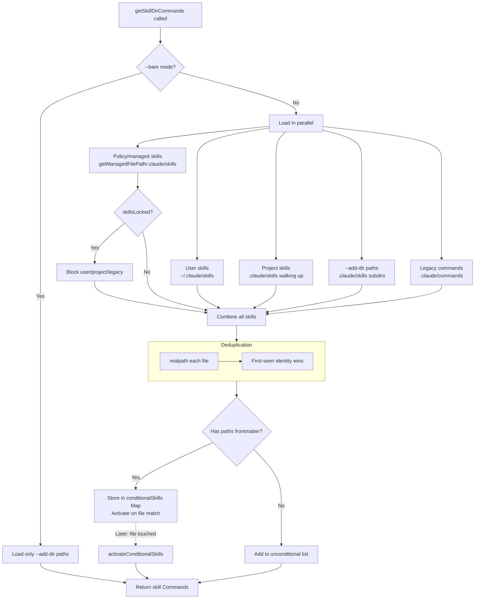
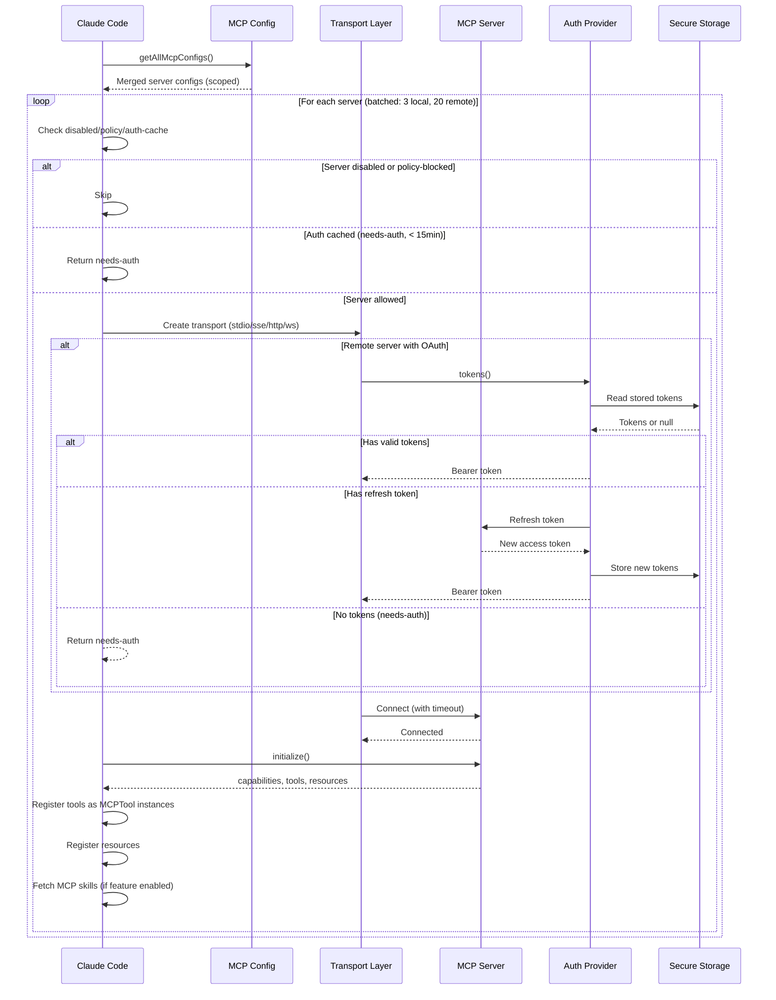
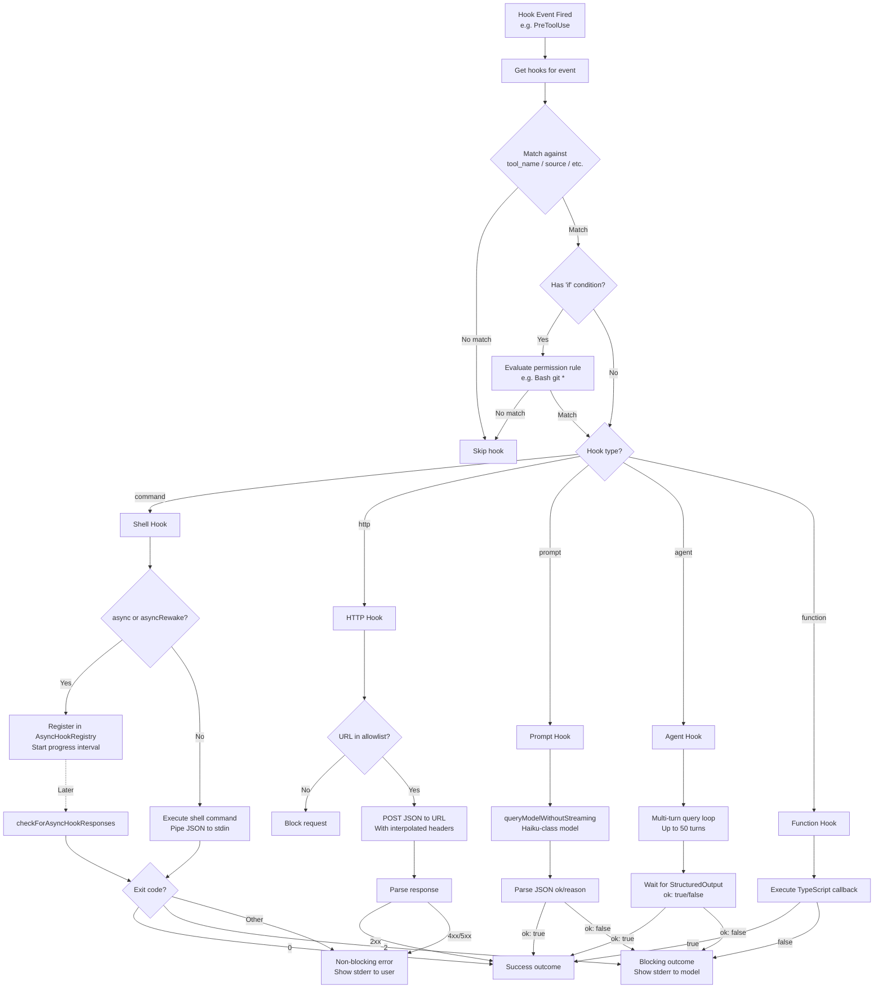
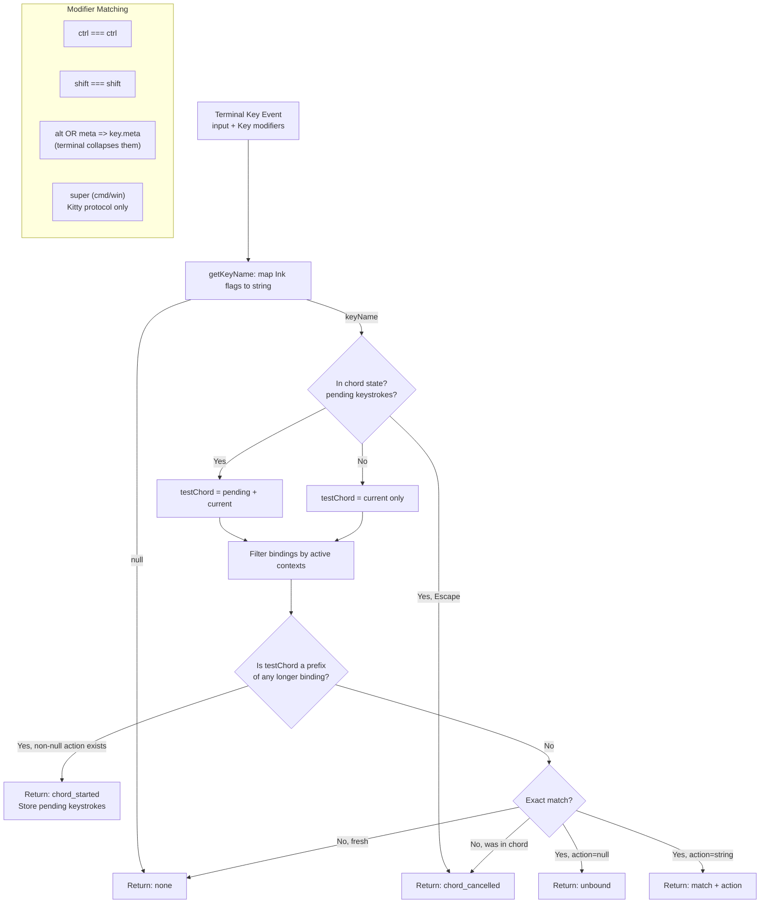

# Extension System Research Document
## Skills, Plugins, MCP, Hooks, and Keybindings

> Research compiled from primary source files in the Claude Code codebase.
> Covers the full extensibility surface: skill authoring and discovery, plugin lifecycle,
> MCP protocol integration, hook event processing, and keybinding customization.

---

## Table of Contents

1. [Skills System](#1-skills-system)
2. [Skill Execution](#2-skill-execution)
3. [Plugin System](#3-plugin-system)
4. [Plugin Integration](#4-plugin-integration)
5. [MCP Protocol](#5-mcp-protocol)
6. [MCP Authentication](#6-mcp-authentication)
7. [MCP Tools](#7-mcp-tools)
8. [Hook System](#8-hook-system)
9. [Hook Execution](#9-hook-execution)
10. [Hook Configuration](#10-hook-configuration)
11. [Keybinding System](#11-keybinding-system)
12. [Mermaid Diagrams](#12-mermaid-diagrams)

---

## 1. Skills System

### 1.1 File Format and Directory Structure

Skills are Markdown files with YAML frontmatter. The canonical format is a **directory-based skill**:

```
.claude/skills/
  my-skill/
    SKILL.md          # Required entry point
    helper-script.sh  # Optional supporting files
    config.json       # Optional reference files
```

The file `SKILL.md` (case-insensitive match via `/^skill\.md$/i`) is the entry point. The skill takes its name from the parent directory (e.g., `my-skill/SKILL.md` becomes the `/my-skill` command).

**Legacy format**: Single `.md` files under `.claude/commands/` are also supported, where the filename (minus `.md`) becomes the command name. Directory-based SKILL.md takes precedence if both formats exist in the same directory.

**Namespacing**: Nested directories create namespaced skills using `:` as delimiter. A skill at `.claude/skills/deploy/staging/SKILL.md` becomes `deploy:staging`.

```typescript
// From loadSkillsDir.ts
function buildNamespace(targetDir: string, baseDir: string): string {
  const relativePath = targetDir.slice(normalizedBaseDir.length + 1)
  return relativePath ? relativePath.split(pathSep).join(':') : ''
}
```

### 1.2 Frontmatter Schema

The `parseSkillFrontmatterFields()` function (loadSkillsDir.ts:185-265) extracts these fields:

| Field | Type | Default | Description |
|-------|------|---------|-------------|
| `name` | `string` | directory name | Display name override |
| `description` | `string` | extracted from first paragraph | Human-readable description |
| `when_to_use` | `string` | undefined | Guidance for the model on when to invoke |
| `allowed-tools` | `string\|string[]` | `[]` | Tools the skill is permitted to use |
| `argument-hint` | `string` | undefined | Hint shown for expected arguments |
| `arguments` | `string\|string[]` | `[]` | Named argument placeholders for `$1`, `$2`, etc. |
| `model` | `string\|'inherit'` | undefined | Model override (e.g., `claude-sonnet-4-6`) |
| `user-invocable` | `boolean` | `true` | Whether users can invoke via `/` prefix |
| `disable-model-invocation` | `boolean` | `false` | Whether the model can invoke this skill proactively |
| `context` | `'fork'\|'inline'` | undefined | Execution mode |
| `agent` | `string` | undefined | Agent type for forked execution |
| `effort` | `EffortValue` | undefined | Effort level (valid: `EFFORT_LEVELS` or integer) |
| `shell` | `FrontmatterShell` | undefined | Shell interpreter for `!` commands |
| `hooks` | `HooksSettings` | undefined | Skill-scoped hooks (validated via `HooksSchema`) |
| `paths` | `string\|string[]` | undefined | Glob patterns for conditional activation |
| `version` | `string` | undefined | Skill version string |

The frontmatter is parsed by `parseFrontmatter()` from `frontmatterParser.ts` and validated field-by-field. The `hooks` field goes through `HooksSchema().safeParse()` for Zod validation.

### 1.3 Skill Discovery Pipeline

Discovery is orchestrated by `getSkillDirCommands()` (loadSkillsDir.ts:638-803), which is **memoized** on `cwd`. It loads skills from five sources in parallel:

```typescript
const [
  managedSkills,        // Enterprise/policy skills
  userSkills,           // ~/.claude/skills/
  projectSkillsNested,  // .claude/skills/ walking up to home
  additionalSkillsNested, // --add-dir paths
  legacyCommands,       // .claude/commands/ (deprecated)
] = await Promise.all([...])
```

**Source priority** (first wins during deduplication):
1. **Policy/managed** (`policySettings`) -- from `getManagedFilePath()/.claude/skills/`
2. **User** (`userSettings`) -- from `~/.claude/skills/`
3. **Project** (`projectSettings`) -- from `.claude/skills/` walking up directories to home
4. **Additional** (`projectSettings`) -- from `--add-dir` specified paths
5. **Legacy commands** -- from `.claude/commands/` directories

**Bare mode** (`--bare`): Skips all auto-discovery; only loads `--add-dir` paths and bundled skills.

**Policy locks** (`isRestrictedToPluginOnly('skills')`): When active, user/project/legacy skills are blocked; only managed and plugin skills load.

#### Deduplication

After loading, skills are deduplicated by **resolved filesystem path** (symlink-aware via `realpath()`):

```typescript
async function getFileIdentity(filePath: string): Promise<string | null> {
  try {
    return await realpath(filePath)
  } catch {
    return null
  }
}
```

The first-seen identity wins. This prevents the same skill file from loading twice through different symlink paths or overlapping parent directories.

#### Conditional Skills (Path-Filtered)

Skills with a `paths` frontmatter field are stored separately and only activated when the model touches files matching those glob patterns:

```typescript
const conditionalSkills = new Map<string, Command>()
const activatedConditionalSkillNames = new Set<string>()
```

The `ignore` library evaluates path patterns. The `**` (match-all) pattern is treated as "no filter" (unconditional). Once activated, a skill stays active for the session (survives cache clears).

#### Dynamic Skill Discovery

When the model reads/writes files in subdirectories, `discoverSkillDirsForPaths()` walks up from the file path to `cwd`, checking for `.claude/skills/` directories. Discovered directories that are not gitignored are loaded and merged into the active skill set:

```typescript
export async function discoverSkillDirsForPaths(
  filePaths: string[],
  cwd: string,
): Promise<string[]>
```

### 1.4 Token Budgeting

Skill metadata (not full content) is estimated for token budget purposes:

```typescript
export function estimateSkillFrontmatterTokens(skill: Command): number {
  const frontmatterText = [skill.name, skill.description, skill.whenToUse]
    .filter(Boolean)
    .join(' ')
  return roughTokenCountEstimation(frontmatterText)
}
```

Full skill content is loaded **lazily** -- only when the skill is invoked via `getPromptForCommand()`. This keeps the system prompt small when many skills are registered but few are used.

### 1.5 The `Command` Type

All skills resolve to a `Command` object, which is the unified internal representation:

```typescript
export function createSkillCommand({
  skillName, displayName, description, hasUserSpecifiedDescription,
  markdownContent, allowedTools, argumentHint, argumentNames,
  whenToUse, version, model, disableModelInvocation, userInvocable,
  source, baseDir, loadedFrom, hooks, executionContext, agent,
  paths, effort, shell,
}): Command {
  return {
    type: 'prompt',
    name: skillName,
    description,
    hasUserSpecifiedDescription,
    allowedTools,
    // ... full field mapping ...
    async getPromptForCommand(args, toolUseContext) {
      let finalContent = baseDir
        ? `Base directory for this skill: ${baseDir}\n\n${markdownContent}`
        : markdownContent
      finalContent = substituteArguments(finalContent, args, true, argumentNames)
      finalContent = finalContent.replace(/\$\{CLAUDE_SKILL_DIR\}/g, skillDir)
      finalContent = finalContent.replace(/\$\{CLAUDE_SESSION_ID\}/g, getSessionId())
      // Security: MCP skills never execute inline shell
      if (loadedFrom !== 'mcp') {
        finalContent = await executeShellCommandsInPrompt(finalContent, ...)
      }
      return [{ type: 'text', text: finalContent }]
    },
  }
}
```

Key features of `getPromptForCommand`:
- Prepends the skill's base directory for file-based skills
- Substitutes `$1`, `$2`, etc. with user arguments
- Replaces `${CLAUDE_SKILL_DIR}` with the skill's directory path
- Replaces `${CLAUDE_SESSION_ID}` with the current session ID
- Executes `!`-prefixed shell commands embedded in the Markdown (except for MCP-sourced skills, for security)

### 1.6 Bundled Skills

Bundled skills are compiled into the CLI binary and registered programmatically at startup via `registerBundledSkill()` (bundledSkills.ts):

```typescript
export type BundledSkillDefinition = {
  name: string
  description: string
  aliases?: string[]
  whenToUse?: string
  argumentHint?: string
  allowedTools?: string[]
  model?: string
  disableModelInvocation?: boolean
  userInvocable?: boolean
  isEnabled?: () => boolean
  hooks?: HooksSettings
  context?: 'inline' | 'fork'
  agent?: string
  files?: Record<string, string>  // Reference files extracted to disk on demand
  getPromptForCommand: (args: string, context: ToolUseContext) => Promise<ContentBlockParam[]>
}
```

**Reference file extraction**: Bundled skills with a `files` field extract their reference files lazily on first invocation. This uses a **per-process nonce** directory under `getBundledSkillsRoot()`, with `O_NOFOLLOW | O_EXCL` write flags and `0o700`/`0o600` permissions as defense-in-depth against symlink attacks:

```typescript
async function safeWriteFile(p: string, content: string): Promise<void> {
  const fh = await open(p, SAFE_WRITE_FLAGS, 0o600)
  try {
    await fh.writeFile(content, 'utf8')
  } finally {
    await fh.close()
  }
}
```

The extraction promise is **memoized per process** so concurrent callers await the same extraction rather than racing.

### 1.7 MCP Skill Builders Bridge

The `mcpSkillBuilders.ts` file solves a **circular dependency** between the MCP client and the skill loading system:

```typescript
export type MCPSkillBuilders = {
  createSkillCommand: typeof createSkillCommand
  parseSkillFrontmatterFields: typeof parseSkillFrontmatterFields
}

let builders: MCPSkillBuilders | null = null

export function registerMCPSkillBuilders(b: MCPSkillBuilders): void {
  builders = b
}

export function getMCPSkillBuilders(): MCPSkillBuilders {
  if (!builders) {
    throw new Error(
      'MCP skill builders not registered - loadSkillsDir.ts has not been evaluated yet',
    )
  }
  return builders
}
```

Registration happens at `loadSkillsDir.ts` module init (line 65: `registerMCPSkillBuilders`), which executes eagerly at startup via the static import chain from `commands.ts`.

### 1.8 LoadedFrom Type

The `LoadedFrom` discriminant tracks where a skill originated:

```typescript
export type LoadedFrom =
  | 'commands_DEPRECATED'  // Legacy .claude/commands/ directory
  | 'skills'               // .claude/skills/ directory
  | 'plugin'               // Marketplace/external plugin
  | 'managed'              // Enterprise managed path
  | 'bundled'              // Compiled into the CLI binary
  | 'mcp'                  // From an MCP server's prompts
```

This discriminant controls security behavior (MCP skills cannot execute shell commands) and analytics (skill_loaded_from field in telemetry).

---

## 2. Skill Execution

### 2.1 SkillTool Architecture

The `SkillTool` (SkillTool.ts) is the model-facing tool that dispatches skill invocations. It is registered with the tool name `Skill` (from `SKILL_TOOL_NAME` constant).

```typescript
export const inputSchema = lazySchema(() =>
  z.object({
    skill: z.string().describe('The skill name. E.g., "commit", "review-pr", or "pdf"'),
    args: z.string().optional().describe('Optional arguments for the skill'),
  }),
)
```

**Output is a discriminated union** between inline and forked results:

```typescript
const inlineOutputSchema = z.object({
  success: z.boolean(),
  commandName: z.string(),
  allowedTools: z.array(z.string()).optional(),
  model: z.string().optional(),
  status: z.literal('inline').optional(),
})

const forkedOutputSchema = z.object({
  success: z.boolean(),
  commandName: z.string(),
  status: z.literal('forked'),
  agentId: z.string(),
  result: z.string(),
})
```

### 2.2 Validation Flow

`validateInput()` performs these checks:

1. Trims the skill name, strips leading `/` if present
2. For experimental remote skills: checks if `_canonical_<slug>` was discovered in this session
3. Looks up the command in `getAllCommands()` (local + MCP skills)
4. Rejects skills not found with appropriate error messages
5. Checks `isEnabled()` gate for feature-flagged skills

```typescript
async function getAllCommands(context: ToolUseContext): Promise<Command[]> {
  const mcpSkills = context
    .getAppState()
    .mcp.commands.filter(cmd => cmd.type === 'prompt' && cmd.loadedFrom === 'mcp')
  if (mcpSkills.length === 0) return getCommands(getProjectRoot())
  const localCommands = await getCommands(getProjectRoot())
  return uniqBy([...localCommands, ...mcpSkills], 'name')
}
```

### 2.3 Inline Execution

The default execution mode. The skill prompt is injected directly into the current conversation context:

1. `getPromptForCommand(args, context)` generates the prompt content
2. The content is returned as `ContentBlockParam[]` in the tool result
3. The model processes the expanded prompt in the same agent turn
4. Allowed tools from the skill override the session's tool permissions

### 2.4 Forked Execution

When a skill has `context: 'fork'`, it runs in an isolated sub-agent:

```typescript
async function executeForkedSkill(
  command: Command & { type: 'prompt' },
  commandName: string,
  args: string | undefined,
  context: ToolUseContext,
  canUseTool: CanUseToolFn,
  parentMessage: AssistantMessage,
  onProgress?: ToolCallProgress<Progress>,
): Promise<ToolResult<Output>>
```

Key mechanics:
1. Creates a unique `agentId` via `createAgentId()`
2. Calls `prepareForkedCommandContext()` to set up isolated state
3. Merges skill's `effort` into the agent definition
4. Calls `runAgent()` which creates a full multi-turn query loop
5. Reports progress for tool uses back to the parent via `onProgress`
6. Extracts result text from agent messages via `extractResultText()`
7. Cleans up with `clearInvokedSkillsForAgent(agentId)` in finally block

Analytics tracking includes:
- `command_name` (redacted for third-party skills)
- `_PROTO_skill_name` (unredacted, PII-tagged column)
- `execution_context` ('fork')
- `invocation_trigger` ('nested-skill' or 'claude-proactive')
- `query_depth` (nesting level)
- Plugin metadata if skill comes from a plugin

---

## 3. Plugin System

### 3.1 Plugin Definition Types

A plugin is defined by `LoadedPlugin` (types/plugin.ts):

```typescript
export type LoadedPlugin = {
  name: string
  manifest: PluginManifest
  path: string
  source: string               // e.g., "slack@anthropic"
  repository: string
  enabled?: boolean
  isBuiltin?: boolean
  sha?: string                 // Git commit SHA for version pinning
  commandsPath?: string
  commandsPaths?: string[]
  agentsPath?: string
  agentsPaths?: string[]
  skillsPath?: string
  skillsPaths?: string[]
  outputStylesPath?: string
  outputStylesPaths?: string[]
  hooksConfig?: HooksSettings
  mcpServers?: Record<string, McpServerConfig>
  lspServers?: Record<string, LspServerConfig>
  settings?: Record<string, unknown>
}
```

**Plugin components** are enumerated:
```typescript
export type PluginComponent =
  | 'commands' | 'agents' | 'skills' | 'hooks' | 'output-styles'
```

### 3.2 Built-in Plugin Definition

Built-in plugins ship with the CLI binary and have a special definition type:

```typescript
export type BuiltinPluginDefinition = {
  name: string
  description: string
  version?: string
  skills?: BundledSkillDefinition[]
  hooks?: HooksSettings
  mcpServers?: Record<string, McpServerConfig>
  isAvailable?: () => boolean
  defaultEnabled?: boolean
}
```

### 3.3 Plugin ID Format

Plugin identifiers follow the pattern `{name}@{marketplace}`:
- Built-in plugins: `{name}@builtin`
- Marketplace plugins: `{name}@{marketplace_name}`

```typescript
export const BUILTIN_MARKETPLACE_NAME = 'builtin'

export function isBuiltinPluginId(pluginId: string): boolean {
  return pluginId.endsWith(`@${BUILTIN_MARKETPLACE_NAME}`)
}
```

### 3.4 Built-in Plugin Registry

The registry in `builtinPlugins.ts` manages built-in plugins with enable/disable persistence:

```typescript
const BUILTIN_PLUGINS: Map<string, BuiltinPluginDefinition> = new Map()

export function registerBuiltinPlugin(definition: BuiltinPluginDefinition): void {
  BUILTIN_PLUGINS.set(definition.name, definition)
}
```

**Enable/disable logic** follows a three-tier preference cascade:
```typescript
const userSetting = settings?.enabledPlugins?.[pluginId]
const isEnabled =
  userSetting !== undefined
    ? userSetting === true                    // 1. User preference (explicit)
    : (definition.defaultEnabled ?? true)     // 2. Plugin default, then true
```

### 3.5 Plugin Lifecycle

1. **Registration**: `initBuiltinPlugins()` called during CLI startup (currently scaffolding only)
2. **Availability check**: `isAvailable()` evaluated -- unavailable plugins are hidden entirely
3. **Enable/disable**: Persisted to `settings.enabledPlugins[pluginId]`
4. **Skill extraction**: `getBuiltinPluginSkillCommands()` converts `BundledSkillDefinition[]` to `Command[]`
5. **Cleanup**: `clearBuiltinPlugins()` for testing

### 3.6 Skill-to-Command Conversion

Built-in plugin skills use `source: 'bundled'` (not `'builtin'`) intentionally:

```typescript
function skillDefinitionToCommand(definition: BundledSkillDefinition): Command {
  return {
    // ...
    // 'bundled' not 'builtin' -- 'builtin' in Command.source means hardcoded
    // slash commands (/help, /clear). Using 'bundled' keeps these skills in
    // the Skill tool's listing, analytics name logging, and prompt-truncation
    // exemption.
    source: 'bundled',
    loadedFrom: 'bundled',
    // ...
  }
}
```

### 3.7 Plugin Error Types

Plugin errors are a discriminated union for type-safe error handling:

```typescript
export type PluginError =
  | { type: 'path-not-found'; source: string; plugin?: string; path: string }
  | { type: 'generic-error'; source: string; plugin?: string; message: string }
  | { type: 'plugin-not-found'; source: string; plugin?: string }
  // ... 10 more planned types
```

---

## 4. Plugin Integration

### 4.1 Skills Extraction

Enabled built-in plugins contribute skills via `getBuiltinPluginSkillCommands()`:

```typescript
export function getBuiltinPluginSkillCommands(): Command[] {
  const { enabled } = getBuiltinPlugins()
  const commands: Command[] = []
  for (const plugin of enabled) {
    const definition = BUILTIN_PLUGINS.get(plugin.name)
    if (!definition?.skills) continue
    for (const skill of definition.skills) {
      commands.push(skillDefinitionToCommand(skill))
    }
  }
  return commands
}
```

External/marketplace plugins contribute skills via their `skillsPath` and `skillsPaths` fields, which point to directories containing SKILL.md files.

### 4.2 Hooks Wiring

Plugins provide hooks via the `hooksConfig` field on `LoadedPlugin`. These are merged into the hook execution pipeline alongside settings-based hooks and session hooks. Plugin hooks are identified by `source: 'pluginHook'` in the `IndividualHookConfig` type.

### 4.3 MCP Server Registration

Plugins can provide MCP servers via `mcpServers` on their manifest. Plugin-provided servers are namespaced as `plugin:{pluginName}:{serverName}` to avoid key collisions with manually configured servers.

**Deduplication** happens content-based via signature matching:

```typescript
export function getMcpServerSignature(config: McpServerConfig): string | null {
  const cmd = getServerCommandArray(config)
  if (cmd) return `stdio:${jsonStringify(cmd)}`
  const url = getServerUrl(config)
  if (url) return `url:${unwrapCcrProxyUrl(url)}`
  return null
}
```

`dedupPluginMcpServers()` drops plugin servers whose signature matches a manually-configured server (manual wins) or an earlier-loaded plugin server (first-loaded wins).

---

## 5. MCP Protocol

### 5.1 Client Architecture

The MCP client (`services/mcp/client.ts`, ~3300 lines) manages connections to external MCP servers. It imports the official `@modelcontextprotocol/sdk` client library.

**Key imports from the MCP SDK**:
- `Client` -- the protocol client
- `SSEClientTransport` -- Server-Sent Events transport
- `StdioClientTransport` -- stdio transport (spawns subprocess)
- `StreamableHTTPClientTransport` -- HTTP Streamable transport
- Various result schemas: `CallToolResultSchema`, `ListToolsResultSchema`, `ListPromptsResultSchema`, `ListResourcesResultSchema`

**Error hierarchy**:
```typescript
export class McpAuthError extends Error {
  serverName: string
}

class McpSessionExpiredError extends Error {} // Session expired, retry with fresh client

export class McpToolCallError_I_VERIFIED_THIS_IS_NOT_CODE_OR_FILEPATHS
  extends TelemetrySafeError_I_VERIFIED_THIS_IS_NOT_CODE_OR_FILEPATHS {
  readonly mcpMeta?: { _meta?: Record<string, unknown> }
}
```

### 5.2 Transport Layers

The system supports seven transport types, defined in `types.ts`:

```typescript
export type Transport = 'stdio' | 'sse' | 'sse-ide' | 'http' | 'ws' | 'sdk'
```

Plus internal types: `ws-ide`, `claudeai-proxy`.

**Transport config schemas** (all Zod-validated):

| Transport | Config Type | Key Fields |
|-----------|------------|------------|
| `stdio` | `McpStdioServerConfig` | `command`, `args[]`, `env?` |
| `sse` | `McpSSEServerConfig` | `url`, `headers?`, `oauth?` |
| `sse-ide` | `McpSSEIDEServerConfig` | `url`, `ideName` |
| `ws-ide` | `McpWebSocketIDEServerConfig` | `url`, `ideName`, `authToken?` |
| `http` | `McpHTTPServerConfig` | `url`, `headers?`, `oauth?` |
| `ws` | `McpWebSocketServerConfig` | `url`, `headers?` |
| `sdk` | `McpSdkServerConfig` | `name` |
| `claudeai-proxy` | `McpClaudeAIProxyServerConfig` | `url`, `id` |

### 5.3 Connection Lifecycle

`connectToServer()` is **memoized** (via lodash `memoize`) on a cache key derived from `name + JSON.stringify(config)`:

```typescript
export function getServerCacheKey(
  name: string,
  serverRef: ScopedMcpServerConfig,
): string {
  return `${name}-${jsonStringify(serverRef)}`
}
```

**Connection batching**: Local (stdio/sdk) servers connect in batches of 3 (`getMcpServerConnectionBatchSize()`). Remote servers connect in batches of 20 (`getRemoteMcpServerConnectionBatchSize()`).

The connection flow per transport type:

1. **SSE**: Creates `ClaudeAuthProvider`, wraps fetch with timeout and step-up detection, initializes `SSEClientTransport` with separate `eventSourceInit` fetch (no timeout for long-lived SSE stream)
2. **HTTP** (Streamable): Same auth/fetch pattern, uses `StreamableHTTPClientTransport`, includes session ingress token when available and no OAuth tokens exist
3. **WebSocket**: Creates `ws.WebSocket` client (Bun-native or Node `ws` library), wraps in `WebSocketTransport`
4. **stdio**: Creates `StdioClientTransport` with `subprocessEnv()` merged env, pipes stderr
5. **In-process**: Chrome MCP server and Computer Use server run in-process via `createLinkedTransportPair()`
6. **claude.ai proxy**: Routes through Anthropic's MCP proxy with OAuth bearer token

**Client initialization** (after transport):
```typescript
const client = new Client(
  {
    name: 'claude-code',
    title: 'Claude Code',
    version: MACRO.VERSION ?? 'unknown',
    description: "Anthropic's agentic coding tool",
    websiteUrl: PRODUCT_URL,
  },
  {
    capabilities: {
      roots: {},
      elicitation: {},
    },
  },
)
```

**Timeout defaults**:
- Connection timeout: 30s (`MCP_TIMEOUT` env var overrides)
- Per-request timeout: 60s (`MCP_REQUEST_TIMEOUT_MS`)
- Tool call timeout: ~27.8 hours (`DEFAULT_MCP_TOOL_TIMEOUT_MS = 100_000_000`)
- Auth request timeout: 30s (`AUTH_REQUEST_TIMEOUT_MS`)

### 5.4 Config Sources and Scope

MCP server configs come from multiple sources, each tagged with a `ConfigScope`:

```typescript
export type ConfigScope =
  | 'local'       // .mcp.json in project
  | 'user'        // User-level settings
  | 'project'     // Project settings
  | 'dynamic'     // Programmatic (SDK)
  | 'enterprise'  // Managed/enterprise config
  | 'claudeai'    // Claude.ai connectors
  | 'managed'     // Managed MCP file
```

Configuration merging happens in `getAllMcpConfigs()` (config.ts), which:
1. Loads managed/enterprise MCP config from `getEnterpriseMcpFilePath()`
2. Loads user/project/local configs from `settings.json` and `.mcp.json`
3. Loads claude.ai connectors via `fetchClaudeAIMcpConfigsIfEligible()`
4. Loads plugin MCP servers via `getPluginMcpServers()`
5. Applies environment variable expansion via `expandEnvVars()`
6. Filters by allowlist/denylist policy
7. Deduplicates plugin and claude.ai servers against manual configs

### 5.5 Policy Enforcement

Two policy mechanisms control MCP server access:

**Allowlist** (`allowedMcpServers`):
- Supports name-based, command-based, and URL-based matching
- When `allowManagedMcpServersOnly` is set, only managed settings control the allowlist
- Empty array blocks all servers; `undefined` means no restrictions

**Denylist** (`deniedMcpServers`):
- Always merges from all sources (users can always deny for themselves)
- Takes absolute precedence over allowlist
- Supports the same three matching modes

```typescript
function isMcpServerAllowedByPolicy(
  serverName: string,
  config?: McpServerConfig,
): boolean {
  if (isMcpServerDenied(serverName, config)) return false
  // ... allowlist logic
}
```

**SDK-type servers are exempt** from policy filtering -- they are transport placeholders managed by the SDK.

### 5.6 Session Expired Error Detection

```typescript
export function isMcpSessionExpiredError(error: Error): boolean {
  const httpStatus = 'code' in error ? (error as Error & { code?: number }).code : undefined
  if (httpStatus !== 404) return false
  return (
    error.message.includes('"code":-32001') ||
    error.message.includes('"code": -32001')
  )
}
```

This detects MCP spec 404 + JSON-RPC -32001, avoiding false positives from generic web server 404s.

---

## 6. MCP Authentication

### 6.1 OAuth Flow Architecture

The `auth.ts` file (~1800 lines) implements the full MCP OAuth flow with these components:

**ClaudeAuthProvider** implements the SDK's `OAuthClientProvider` interface with:
- Token storage in OS secure storage (macOS Keychain, etc.)
- PKCE (Proof Key for Code Exchange) flow
- Dynamic client registration (DCR)
- Cross-App Access (XAA) token exchange
- Step-up scope handling (403 → re-auth with additional scopes)

**OAuth discovery** follows RFC 9728 then RFC 8414:
```typescript
async function fetchAuthServerMetadata(
  serverName: string,
  serverUrl: string,
  configuredMetadataUrl: string | undefined,
  fetchFn?: FetchLike,
  resourceMetadataUrl?: URL,
): Promise<...>
```

1. If `configuredMetadataUrl` is set: fetch directly (must be HTTPS)
2. RFC 9728: probe `/.well-known/oauth-protected-resource`, read `authorization_servers[0]`, then RFC 8414
3. Fallback: RFC 8414 directly against the MCP server URL (path-aware, for legacy servers)

### 6.2 Token Storage

Tokens are stored per-server in secure storage with a composite key:

```typescript
export function getServerKey(
  serverName: string,
  serverConfig: McpSSEServerConfig | McpHTTPServerConfig,
): string {
  const configJson = jsonStringify({
    type: serverConfig.type,
    url: serverConfig.url,
    headers: serverConfig.headers || {},
  })
  const hash = createHash('sha256').update(configJson).digest('hex').substring(0, 16)
  return `${serverName}|${hash}`
}
```

This ensures credentials don't leak between servers with the same name but different configurations.

### 6.3 Token Refresh

Token refresh handles several edge cases:

- **Transient errors** (500, 503, 429): Retries with exponential backoff
- **Invalid grant**: Invalidates all credentials, marks server as `needs-auth`
- **Non-standard error codes**: Slack returns `invalid_refresh_token`/`expired_refresh_token` instead of RFC 6749's `invalid_grant`. These are normalized:

```typescript
const NONSTANDARD_INVALID_GRANT_ALIASES = new Set([
  'invalid_refresh_token',
  'expired_refresh_token',
  'token_expired',
])
```

- **OAuth error in 200 responses**: Some servers (notably Slack) return HTTP 200 with error body. The `normalizeOAuthErrorBody()` wrapper detects this and rewrites to HTTP 400.

### 6.4 Token Revocation

`revokeServerTokens()` implements RFC 7009 revocation:
1. Revokes refresh token first (prevents new access tokens)
2. Then revokes access token (may already be invalidated)
3. Supports both `client_secret_basic` and `client_secret_post` auth methods
4. Falls back to Bearer auth for non-compliant servers

### 6.5 Step-Up Authentication

When an MCP server returns 403 (Forbidden), step-up detection triggers:
- Parses the `scope` from the error response
- Preserves the new scope in token storage (`stepUpScope`)
- Marks the server as `needs-auth` with the expanded scope
- Re-authentication uses the cached scope instead of re-probing

### 6.6 Cross-App Access (XAA)

XAA enables token exchange between identity providers and MCP servers:
- Configured per-server via `oauth.xaa: true` in `.mcp.json`
- IdP settings (`issuer`, `clientId`, `callbackPort`) are global in `settings.xaaIdp`
- Uses OIDC discovery to find the IdP's authorization endpoint
- Exchanges the IdP's id_token for MCP server access tokens

### 6.7 Auth Cache

A 15-minute TTL cache prevents redundant auth probes:

```typescript
const MCP_AUTH_CACHE_TTL_MS = 15 * 60 * 1000

async function isMcpAuthCached(serverId: string): Promise<boolean> {
  const cache = await getMcpAuthCache()
  const entry = cache[serverId]
  if (!entry) return false
  return Date.now() - entry.timestamp < MCP_AUTH_CACHE_TTL_MS
}
```

Cache writes are serialized through a promise chain to prevent concurrent read-modify-write races when multiple servers return 401 in the same batch.

---

## 7. MCP Tools

### 7.1 Tool Name Convention

MCP tools follow a strict naming convention with double-underscore delimiters:

```
mcp__<normalized_server_name>__<normalized_tool_name>
```

```typescript
export function buildMcpToolName(serverName: string, toolName: string): string {
  return `${getMcpPrefix(serverName)}${normalizeNameForMCP(toolName)}`
}

// Normalization: replace invalid chars with underscores
export function normalizeNameForMCP(name: string): string {
  let normalized = name.replace(/[^a-zA-Z0-9_-]/g, '_')
  if (name.startsWith(CLAUDEAI_SERVER_PREFIX)) {
    normalized = normalized.replace(/_+/g, '_').replace(/^_|_$/g, '')
  }
  return normalized
}
```

Parsing is the inverse:
```typescript
export function mcpInfoFromString(toolString: string): {
  serverName: string
  toolName: string | undefined
} | null {
  const parts = toolString.split('__')
  const [mcpPart, serverName, ...toolNameParts] = parts
  if (mcpPart !== 'mcp' || !serverName) return null
  const toolName = toolNameParts.length > 0 ? toolNameParts.join('__') : undefined
  return { serverName, toolName }
}
```

**Known limitation**: Server names containing `__` will parse incorrectly.

### 7.2 MCPTool Wrapper

`MCPTool.ts` defines a **template tool** that gets cloned and customized per MCP server tool:

```typescript
export const MCPTool = buildTool({
  isMcp: true,
  isOpenWorld() { return false },
  name: 'mcp',                    // Overridden in mcpClient.ts
  maxResultSizeChars: 100_000,
  async description() { return DESCRIPTION },  // Overridden
  async prompt() { return PROMPT },            // Overridden
  get inputSchema() { return inputSchema() },  // z.object({}).passthrough()
  get outputSchema() { return outputSchema() }, // z.string()
  async call() { return { data: '' } },        // Overridden
  async checkPermissions() {
    return { behavior: 'passthrough', message: 'MCPTool requires permission.' }
  },
})
```

The `inputSchema` uses `z.object({}).passthrough()` -- it accepts any JSON object since MCP tools define their own schemas. The actual per-tool schema is enforced at the MCP protocol level.

### 7.3 Dynamic Tool Registration

When a connected MCP server advertises tools via `tools/list`, the client creates Tool instances by cloning MCPTool and overriding:
- `name` -- set to `mcp__<server>__<tool>`
- `description` -- from MCP tool's description (capped at `MAX_MCP_DESCRIPTION_LENGTH = 2048`)
- `call()` -- routes to `callTool()` on the MCP Client
- `userFacingName()` -- formatted as `<server> - <tool> (MCP)`

**Tool filtering**: IDE MCP tools are restricted to a whitelist:
```typescript
const ALLOWED_IDE_TOOLS = ['mcp__ide__executeCode', 'mcp__ide__getDiagnostics']
function isIncludedMcpTool(tool: Tool): boolean {
  return !tool.name.startsWith('mcp__ide__') || ALLOWED_IDE_TOOLS.includes(tool.name)
}
```

### 7.4 Deferred Tool Loading

The `ToolSearch` tool in the system prompt allows deferred loading of tools:
- Not all MCP tools are listed in the initial system prompt
- The model can use `ToolSearch` to find and load tool schemas on demand
- Once fetched, a tool's schema appears in a `<functions>` block and becomes callable

### 7.5 Tool Call Flow

1. Model emits a `tool_use` block with the MCP tool name and arguments
2. The tool's `call()` method (overridden during registration) invokes `callTool()` on the MCP Client
3. Timeout: `getMcpToolTimeoutMs()` (default ~27.8 hours, override via `MCP_TOOL_TIMEOUT`)
4. Result handling:
   - Text content: returned as string
   - Image content: resized/downsampled via `maybeResizeAndDownsampleImageBuffer()`
   - Binary blobs: persisted to disk, reference returned
   - Large results: truncated via `truncateMcpContentIfNeeded()`
5. Error results (`isError: true`): throw `McpToolCallError`
6. Auth errors (401): throw `McpAuthError`, update client status to `needs-auth`

### 7.6 Resource Tools

Two resource-related tools are created per connected server:

- **ListMcpResourcesTool**: Lists available resources from the server
- **ReadMcpResourceTool**: Reads a specific resource by URI

---

## 8. Hook System

### 8.1 Event Types

The hook system supports **27 event types** (from `hookEvents.ts`):

| Event | Trigger | Matcher Field | Exit Code Semantics |
|-------|---------|---------------|---------------------|
| `PreToolUse` | Before tool execution | `tool_name` | 0=silent, 2=block+stderr to model, other=stderr to user |
| `PostToolUse` | After tool execution | `tool_name` | 0=transcript, 2=stderr to model, other=stderr to user |
| `PostToolUseFailure` | After tool fails | `tool_name` | 0=transcript, 2=stderr to model |
| `PermissionDenied` | Auto mode classifier denies | `tool_name` | 0=transcript, retry possible |
| `PermissionRequest` | Permission dialog shown | `tool_name` | 0=use hook decision |
| `Notification` | Notification sent | `notification_type` | 0=silent |
| `UserPromptSubmit` | User submits prompt | (none) | 0=stdout to Claude, 2=block+erase |
| `SessionStart` | New session started | `source` | 0=stdout to Claude |
| `SessionEnd` | Session ending | `reason` | 0=success |
| `Stop` | Before Claude concludes | (none) | 0=silent, 2=stderr to model+continue |
| `StopFailure` | API error ends turn | `error` | Fire-and-forget |
| `SubagentStart` | Subagent started | `agent_type` | 0=stdout to subagent |
| `SubagentStop` | Before subagent concludes | `agent_type` | 0=silent, 2=continue |
| `PreCompact` | Before compaction | `trigger` | 0=custom instructions, 2=block |
| `PostCompact` | After compaction | `trigger` | 0=stdout to user |
| `Setup` | Repo setup hooks | `trigger` | 0=stdout to Claude |
| `TeammateIdle` | Teammate about to idle | (none) | 2=prevent idle |
| `TaskCreated` | Task being created | (none) | 2=prevent creation |
| `TaskCompleted` | Task completion | (none) | 2=prevent completion |
| `Elicitation` | MCP elicitation request | `mcp_server_name` | 0=use response, 2=deny |
| `ElicitationResult` | User responds to elicitation | `mcp_server_name` | 0=use response, 2=block |
| `ConfigChange` | Config file changes | `source` | 2=block change |
| `InstructionsLoaded` | CLAUDE.md/rule loaded | `load_reason` | Observability only |
| `WorktreeCreate` | Create worktree | (none) | stdout=path |
| `WorktreeRemove` | Remove worktree | (none) | 0=success |
| `CwdChanged` | Directory changed | (none) | `CLAUDE_ENV_FILE` available |
| `FileChanged` | Watched file changes | filename pattern | `CLAUDE_ENV_FILE` available |

### 8.2 Exit Code Protocol

The exit code from a hook command determines how its output is handled:

- **Exit 0**: Success. Behavior varies by event (see table above)
- **Exit 2**: Blocking error. Generally shows stderr to model and blocks the operation
- **Other exit codes**: Non-blocking error. Shows stderr to user only but continues

This is a critical protocol: exit code 2 is the mechanism for hooks to **veto** operations (block tool calls, prevent compaction, deny permissions, etc.).

### 8.3 Hook Event Broadcasting

Hook execution events are broadcast through a separate event system (`hookEvents.ts`):

```typescript
export type HookExecutionEvent =
  | HookStartedEvent
  | HookProgressEvent
  | HookResponseEvent

export type HookStartedEvent = {
  type: 'started'
  hookId: string
  hookName: string
  hookEvent: string
}

export type HookProgressEvent = {
  type: 'progress'
  hookId: string
  hookName: string
  hookEvent: string
  stdout: string
  stderr: string
  output: string
}

export type HookResponseEvent = {
  type: 'response'
  hookId: string
  hookName: string
  hookEvent: string
  output: string
  stdout: string
  stderr: string
  exitCode?: number
  outcome: 'success' | 'error' | 'cancelled'
}
```

**Selective emission**: Only `SessionStart` and `Setup` events are always emitted. Other events require `setAllHookEventsEnabled(true)` (set when SDK `includeHookEvents` option is active or in `CLAUDE_CODE_REMOTE` mode).

**Buffering**: Up to 100 events are buffered before a handler is registered, then flushed on registration.

---

## 9. Hook Execution

### 9.1 Hook Types

Four execution strategies, defined as a discriminated union in `schemas/hooks.ts`:

#### Command Hook (Shell)
```typescript
const BashCommandHookSchema = z.object({
  type: z.literal('command'),
  command: z.string(),
  if: IfConditionSchema().optional(),
  shell: z.enum(SHELL_TYPES).optional(),  // 'bash' or 'powershell'
  timeout: z.number().positive().optional(),
  statusMessage: z.string().optional(),
  once: z.boolean().optional(),
  async: z.boolean().optional(),
  asyncRewake: z.boolean().optional(),
})
```

Features:
- `if` condition: Permission rule syntax (e.g., `Bash(git *)`) to filter before spawning
- `shell`: Choose between bash (default, uses `$SHELL`) and powershell (`pwsh`)
- `once`: Self-removing after first execution
- `async`: Non-blocking background execution
- `asyncRewake`: Background execution that wakes the model on exit code 2

#### HTTP Hook
```typescript
const HttpHookSchema = z.object({
  type: z.literal('http'),
  url: z.string().url(),
  if: IfConditionSchema().optional(),
  timeout: z.number().positive().optional(),
  headers: z.record(z.string(), z.string()).optional(),
  allowedEnvVars: z.array(z.string()).optional(),
  statusMessage: z.string().optional(),
})
```

#### Prompt Hook (LLM)
```typescript
const PromptHookSchema = z.object({
  type: z.literal('prompt'),
  prompt: z.string(),
  if: IfConditionSchema().optional(),
  timeout: z.number().positive().optional(),
  model: z.string().optional(),
  statusMessage: z.string().optional(),
  once: z.boolean().optional(),
})
```

#### Agent Hook (Multi-turn LLM)
```typescript
const AgentHookSchema = z.object({
  type: z.literal('agent'),
  prompt: z.string(),
  if: IfConditionSchema().optional(),
  timeout: z.number().positive().optional(),
  model: z.string().optional(),
  statusMessage: z.string().optional(),
})
```

### 9.2 Shell Hook Execution

Shell hooks are the most common type. The hook's JSON input is piped to the command's stdin. The `command` field is executed as a shell command with the appropriate shell interpreter.

Environment variables available to hook commands:
- `CLAUDE_ENV_FILE`: Path to write bash exports (for `CwdChanged`/`FileChanged` events)
- Standard process environment plus any skill-specific env

### 9.3 HTTP Hook Execution (`execHttpHook.ts`)

```typescript
export async function execHttpHook(
  hook: HttpHook,
  _hookEvent: HookEvent,
  jsonInput: string,
  signal?: AbortSignal,
): Promise<{ ok: boolean; statusCode?: number; body: string; error?: string; aborted?: boolean }>
```

Security features:
1. **URL allowlist**: `allowedHttpHookUrls` in settings restricts which URLs HTTP hooks can target
2. **Env var interpolation**: Header values support `$VAR_NAME` / `${VAR_NAME}`, but only for variables in `allowedEnvVars`. Others replaced with empty strings.
3. **Header injection prevention**: `sanitizeHeaderValue()` strips CR/LF/NUL bytes
4. **SSRF guard**: Validates resolved IPs, blocks private/link-local ranges (allows loopback)
5. **Sandbox proxy**: When sandboxing is enabled, routes through sandbox network proxy
6. **Env var proxy**: Respects `HTTP_PROXY`/`HTTPS_PROXY` environment variables

Default timeout: 10 minutes (`DEFAULT_HTTP_HOOK_TIMEOUT_MS`).

### 9.4 Prompt Hook Execution (`execPromptHook.ts`)

Prompt hooks use a single-turn LLM call to evaluate conditions:

```typescript
export async function execPromptHook(
  hook: PromptHook,
  hookName: string,
  hookEvent: HookEvent,
  jsonInput: string,
  signal: AbortSignal,
  toolUseContext: ToolUseContext,
  messages?: Message[],
  toolUseID?: string,
): Promise<HookResult>
```

1. Replaces `$ARGUMENTS` in the prompt with JSON input
2. Queries model with `queryModelWithoutStreaming()` using:
   - System prompt: "evaluate a hook...return JSON {ok: true} or {ok: false, reason: ...}"
   - Model: `hook.model ?? getSmallFastModel()` (defaults to Haiku-class)
   - `outputFormat: { type: 'json_schema', schema: ... }` for structured output
   - Thinking disabled, non-interactive session
3. Parses response as JSON, validates against `hookResponseSchema()`
4. Returns `blocking` if `ok: false` with the reason

Default timeout: 30 seconds.

### 9.5 Agent Hook Execution (`execAgentHook.ts`)

Agent hooks use a **multi-turn** LLM query loop, enabling the hook to use tools:

```typescript
export async function execAgentHook(
  hook: AgentHook,
  hookName: string,
  hookEvent: HookEvent,
  jsonInput: string,
  signal: AbortSignal,
  toolUseContext: ToolUseContext,
  toolUseID: string | undefined,
  _messages: Message[],
  agentName?: string,
): Promise<HookResult>
```

Key mechanics:
1. Creates a unique `hookAgentId` for the hook agent
2. Sets up isolated `ToolUseContext` with:
   - All tools except `ALL_AGENT_DISALLOWED_TOOLS` (prevents spawning subagents)
   - `StructuredOutputTool` added for result reporting
   - Permission to read the transcript file
   - `dontAsk` mode (no interactive permission prompts)
3. Registers `registerStructuredOutputEnforcement()` as a session-level Stop hook
4. Runs up to `MAX_AGENT_TURNS = 50` turns via `query()`
5. Waits for `{ ok: boolean, reason?: string }` via StructuredOutput attachment
6. Aborts on timeout or max turns reached

Default timeout: 60 seconds.

### 9.6 Async Hook Coordination (`AsyncHookRegistry.ts`)

Async hooks run in background and report results later:

```typescript
export type PendingAsyncHook = {
  processId: string
  hookId: string
  hookName: string
  hookEvent: HookEvent | 'StatusLine' | 'FileSuggestion'
  toolName?: string
  pluginId?: string
  startTime: number
  timeout: number
  command: string
  responseAttachmentSent: boolean
  shellCommand?: ShellCommand
  stopProgressInterval: () => void
}
```

**Registration**: `registerPendingAsyncHook()` stores the hook with its `ShellCommand` reference and starts a progress interval that periodically emits `HookProgressEvent`.

**Polling**: `checkForAsyncHookResponses()` iterates all pending hooks:
1. Checks if shell command completed
2. Reads stdout for JSON response lines (first `{` line without `"async"` key)
3. Marks hook as delivered, emits final `HookResponseEvent`
4. If a `SessionStart` hook completes, invalidates session env cache

**Cleanup**: `finalizePendingAsyncHooks()` at session end kills running hooks and finalizes completed ones.

### 9.7 Post-Sampling Hooks

An internal-only hook type not exposed in settings, registered programmatically:

```typescript
export type PostSamplingHook = (context: REPLHookContext) => Promise<void> | void

export type REPLHookContext = {
  messages: Message[]
  systemPrompt: SystemPrompt
  userContext: { [k: string]: string }
  systemContext: { [k: string]: string }
  toolUseContext: ToolUseContext
  querySource?: QuerySource
}
```

Registered via `registerPostSamplingHook()`, executed via `executePostSamplingHooks()`. Errors are logged but don't fail the main flow.

### 9.8 Session Hooks

Session hooks are temporary, in-memory hooks scoped to a session or agent:

```typescript
export type SessionHooksState = Map<string, SessionStore>

export type SessionStore = {
  hooks: {
    [event in HookEvent]?: SessionHookMatcher[]
  }
}
```

**Two subtypes**:

1. **Command/Prompt hooks**: Added via `addSessionHook()`, persist as `HookCommand` objects
2. **Function hooks**: Added via `addFunctionHook()`, execute TypeScript callbacks in-memory

```typescript
export type FunctionHook = {
  type: 'function'
  id?: string
  timeout?: number
  callback: FunctionHookCallback
  errorMessage: string
  statusMessage?: string
}

export type FunctionHookCallback = (
  messages: Message[],
  signal?: AbortSignal,
) => boolean | Promise<boolean>
```

**Performance optimization**: `SessionHooksState` is a `Map` (not `Record`) so mutations are O(1) and don't trigger store listener notifications. This matters under high-concurrency workflows where parallel agents fire N `addFunctionHook` calls in one tick.

---

## 10. Hook Configuration

### 10.1 Settings-Based Definition

Hooks are configured in `settings.json` under the `hooks` key:

```json
{
  "hooks": {
    "PreToolUse": [
      {
        "matcher": "Write",
        "hooks": [
          {
            "type": "command",
            "command": "echo 'About to write a file'"
          }
        ]
      }
    ]
  }
}
```

The `HooksSchema` validates this structure:
```typescript
export const HooksSchema = lazySchema(() =>
  z.record(z.enum(HOOK_EVENTS), z.array(HookMatcherSchema()))
)
```

A `HookMatcher` pairs a matcher pattern with one or more hook commands:
```typescript
export type HookMatcher = {
  matcher?: string
  hooks: HookCommand[]
}
```

### 10.2 Matching Rules

The matcher field is matched against the event's `matcherMetadata.fieldToMatch`:

- For `PreToolUse`/`PostToolUse`: matches against `tool_name`
- For `SessionStart`: matches against `source` (startup, resume, clear, compact)
- For `Notification`: matches against `notification_type`
- For `ConfigChange`: matches against `source` (user_settings, project_settings, etc.)

An empty or absent matcher matches all events of that type.

### 10.3 Hook Sources

Hooks come from multiple sources, tracked by `HookSource`:

```typescript
export type HookSource =
  | EditableSettingSource   // user, project, local settings
  | 'policySettings'       // Enterprise managed
  | 'pluginHook'           // From installed plugins
  | 'sessionHook'          // Temporary in-memory hooks
  | 'builtinHook'          // Internal built-in hooks
```

The `getAllHooks()` function merges hooks from settings files. When `allowManagedHooksOnly` is set, user/project/local hooks are suppressed.

Registered hooks (from plugins and internal callbacks) are handled separately in `groupHooksByEventAndMatcher()`:

```typescript
const registeredHooks = getRegisteredHooks()
if (registeredHooks) {
  for (const [event, matchers] of Object.entries(registeredHooks)) {
    // ... merge into grouped hooks
  }
}
```

### 10.4 The `if` Condition

Hook commands can have an `if` field using permission rule syntax:

```json
{
  "type": "command",
  "command": "run-lint.sh",
  "if": "Bash(git *)"
}
```

This filters hook execution **before spawning** -- the hook only runs if the tool call matches the pattern. This avoids the overhead of spawning a process for non-matching commands.

The `if` condition is part of hook **identity**: same command with different `if` conditions are distinct hooks:

```typescript
const sameIf = (x: { if?: string }, y: { if?: string }) =>
  (x.if ?? '') === (y.if ?? '')
```

### 10.5 Hook Aggregation by Event

`groupHooksByEventAndMatcher()` produces a nested structure:

```typescript
Record<HookEvent, Record<string, IndividualHookConfig[]>>
```

Where the outer key is the event name and the inner key is the matcher string (empty string for no-matcher hooks). Matchers are sorted by `sortMatchersByPriority()`.

---

## 11. Keybinding System

### 11.1 Binding Format

Keybindings are defined as blocks with a context and a map of key patterns to actions:

```typescript
export type KeybindingBlock = {
  context: KeybindingContextName
  bindings: Record<string, string | null>
}
```

**Context names** (18 total):
```typescript
const KEYBINDING_CONTEXTS = [
  'Global', 'Chat', 'Autocomplete', 'Confirmation', 'Help',
  'Transcript', 'HistorySearch', 'Task', 'ThemePicker',
  'Settings', 'Tabs', 'Attachments', 'Footer', 'MessageSelector',
  'DiffDialog', 'ModelPicker', 'Select', 'Plugin',
]
```

**Action identifiers** (~80 total), following the pattern `category:action`:
```typescript
const KEYBINDING_ACTIONS = [
  'app:interrupt', 'app:exit', 'app:toggleTodos', 'app:toggleTranscript',
  'chat:cancel', 'chat:cycleMode', 'chat:submit', 'chat:undo',
  'autocomplete:accept', 'autocomplete:dismiss',
  'confirm:yes', 'confirm:no',
  // ... many more
]
```

Plus `command:*` patterns for slash command bindings (e.g., `command:help`).

Setting an action to `null` **unbinds** the key.

### 11.2 Keystroke Parsing

```typescript
export function parseKeystroke(input: string): ParsedKeystroke {
  const parts = input.split('+')
  const keystroke: ParsedKeystroke = {
    key: '', ctrl: false, alt: false, shift: false, meta: false, super: false,
  }
  // ... parse modifiers and key
}
```

**Modifier aliases**:
| Config syntax | Internal modifier |
|--------------|-------------------|
| `ctrl`, `control` | `ctrl` |
| `alt`, `opt`, `option` | `alt` |
| `shift` | `shift` |
| `meta` | `meta` |
| `cmd`, `command`, `super`, `win` | `super` |

**Key aliases**: `esc`->`escape`, `return`->`enter`, `space`->`' '`, arrow symbols (`↑↓←→`) to names.

### 11.3 Chord Support

Multi-keystroke chords use space-separated keystroke strings:

```typescript
export function parseChord(input: string): Chord {
  if (input === ' ') return [parseKeystroke('space')]  // Special case
  return input.trim().split(/\s+/).map(parseKeystroke)
}
```

Example: `"ctrl+x ctrl+k"` is a chord of two keystrokes.

**Chord resolution** (`resolveKeyWithChordState()`):

1. If currently in a chord (has `pending` keystrokes):
   - Escape cancels the chord
   - Build test chord = `[...pending, currentKeystroke]`
2. Check if test chord is a **prefix** of any longer binding:
   - Uses `chordPrefixMatches()` with per-keystroke equality
   - If yes (and the longer binding isn't null-unbound): enter `chord_started` state
3. Check for **exact** match:
   - If found: return the action (or `unbound` if null)
4. No match: cancel chord or return `none`

**Null-unbinding shadow**: A later `null` override for a chord shadows the default it unbinds, preventing the chord prefix from entering chord-wait state.

### 11.4 Matching Against Terminal Input

The `matchesKeystroke()` function (match.ts) maps Ink's `Key` object to `ParsedKeystroke`:

```typescript
export function getKeyName(input: string, key: Key): string | null {
  if (key.escape) return 'escape'
  if (key.return) return 'enter'
  if (key.tab) return 'tab'
  // ... other special keys
  if (input.length === 1) return input.toLowerCase()
  return null
}
```

**Modifier matching quirks**:
- `alt` and `meta` are collapsed (terminal limitation): `key.meta` matches both `alt` and `meta` in config
- `super` (cmd/win) is distinct, only arrives via kitty keyboard protocol
- Escape key quirk: Ink sets `key.meta=true` for escape; this is explicitly ignored

### 11.5 Default Bindings

`defaultBindings.ts` defines ~150 default bindings across all contexts. Platform-specific:

```typescript
const IMAGE_PASTE_KEY = getPlatform() === 'windows' ? 'alt+v' : 'ctrl+v'
const MODE_CYCLE_KEY = SUPPORTS_TERMINAL_VT_MODE ? 'shift+tab' : 'meta+m'
```

Notable bindings:
- `ctrl+c` / `ctrl+d`: Reserved, cannot be rebound (double-press handling)
- `ctrl+x ctrl+k`: Chord binding to kill agents
- `ctrl+x ctrl+e`: Open external editor (readline convention)
- Feature-gated bindings: `QUICK_SEARCH`, `TERMINAL_PANEL`, `VOICE_MODE`, `MESSAGE_ACTIONS`

### 11.6 Hot Reload

`loadUserBindings.ts` implements file watching with hot-reload:

```typescript
export async function initializeKeybindingWatcher(): Promise<void> {
  watcher = chokidar.watch(userPath, {
    persistent: true,
    ignoreInitial: true,
    awaitWriteFinish: {
      stabilityThreshold: FILE_STABILITY_THRESHOLD_MS,  // 500ms
      pollInterval: FILE_STABILITY_POLL_INTERVAL_MS,     // 200ms
    },
    ignorePermissionErrors: true,
    usePolling: false,
    atomic: true,
  })
  watcher.on('add', handleChange)
  watcher.on('change', handleChange)
  watcher.on('unlink', handleDelete)
}
```

**Load path**: `~/.claude/keybindings.json`

**File format**: Object wrapper with optional `$schema` and `$docs` metadata:
```json
{
  "$schema": "...",
  "bindings": [
    { "context": "Chat", "bindings": { "ctrl+s": "chat:stash" } }
  ]
}
```

**Merge strategy**: User bindings append to defaults (last definition wins):
```typescript
const mergedBindings = [...defaultBindings, ...userParsed]
```

**Feature gate**: Currently gated to Anthropic employees via `tengu_keybinding_customization_release` GrowthBook flag.

### 11.7 Validation

Five validation types:

```typescript
export type KeybindingWarningType =
  | 'parse_error'      // Syntax errors in key patterns
  | 'duplicate'        // Same key in same context
  | 'reserved'         // Reserved shortcuts (ctrl+c, ctrl+d)
  | 'invalid_context'  // Unknown context name
  | 'invalid_action'   // Unknown action identifier
```

**Duplicate detection in raw JSON**: Since `JSON.parse` silently uses the last value for duplicate keys, `checkDuplicateKeysInJson()` scans the raw JSON string:

```typescript
export function checkDuplicateKeysInJson(jsonString: string): KeybindingWarning[]
```

**Command binding validation**: `command:*` bindings must be in the `Chat` context.

**Voice binding validation**: `voice:pushToTalk` warns if bound to bare letters (prints during warmup).

### 11.8 Zod Schema

```typescript
export const KeybindingsSchema = lazySchema(() =>
  z.object({
    $schema: z.string().optional(),
    $docs: z.string().optional(),
    bindings: z.array(KeybindingBlockSchema()),
  })
)
```

Actions support three formats:
1. Known action identifiers from `KEYBINDING_ACTIONS`
2. `command:*` pattern for slash commands
3. `null` to unbind

---

## 12. Mermaid Diagrams

### 12.1 Skill Discovery Pipeline



### 12.2 MCP Connection Lifecycle



### 12.3 Hook Execution Flow



### 12.4 Keybinding Resolution Flow



---

## Appendix: Key File Paths

| Component | Primary File | Lines |
|-----------|-------------|-------|
| Skill Loading | `src/skills/loadSkillsDir.ts` | ~900 |
| Bundled Skills | `src/skills/bundledSkills.ts` | 220 |
| MCP Skill Bridge | `src/skills/mcpSkillBuilders.ts` | 45 |
| Built-in Plugins | `src/plugins/builtinPlugins.ts` | 160 |
| Plugin Init | `src/plugins/bundled/index.ts` | 23 |
| Plugin Types | `src/types/plugin.ts` | ~150 |
| MCP Client | `src/services/mcp/client.ts` | ~3300 |
| MCP Config | `src/services/mcp/config.ts` | ~800 |
| MCP Auth | `src/services/mcp/auth.ts` | ~1800 |
| MCP Types | `src/services/mcp/types.ts` | ~200 |
| MCP Normalization | `src/services/mcp/normalization.ts` | 24 |
| MCP String Utils | `src/services/mcp/mcpStringUtils.ts` | 107 |
| SkillTool | `src/tools/SkillTool/SkillTool.ts` | ~500 |
| MCPTool | `src/tools/MCPTool/MCPTool.ts` | 78 |
| Hook Config Manager | `src/utils/hooks/hooksConfigManager.ts` | 400 |
| Hook Events | `src/utils/hooks/hookEvents.ts` | 193 |
| Hook Event Types | `src/utils/hooks/hookEvents.ts` | (in above) |
| Agent Hook | `src/utils/hooks/execAgentHook.ts` | 340 |
| HTTP Hook | `src/utils/hooks/execHttpHook.ts` | 243 |
| Prompt Hook | `src/utils/hooks/execPromptHook.ts` | 212 |
| Post-Sampling Hooks | `src/utils/hooks/postSamplingHooks.ts` | 71 |
| Session Hooks | `src/utils/hooks/sessionHooks.ts` | 448 |
| Async Hook Registry | `src/utils/hooks/AsyncHookRegistry.ts` | 310 |
| Hook Schemas | `src/schemas/hooks.ts` | ~120+ |
| Hook Settings | `src/utils/hooks/hooksSettings.ts` | ~100+ |
| Default Bindings | `src/keybindings/defaultBindings.ts` | 341 |
| Parser | `src/keybindings/parser.ts` | 204 |
| Match | `src/keybindings/match.ts` | 121 |
| Resolver | `src/keybindings/resolver.ts` | 245 |
| Schema | `src/keybindings/schema.ts` | 237 |
| Validate | `src/keybindings/validate.ts` | 499 |
| Load User Bindings | `src/keybindings/loadUserBindings.ts` | 473 |
