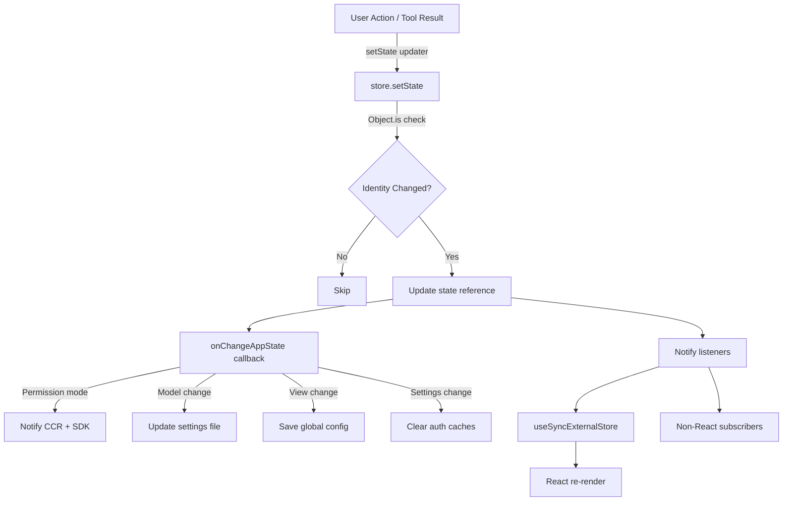
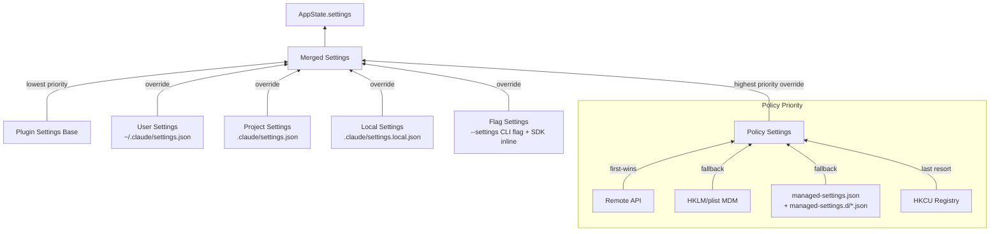
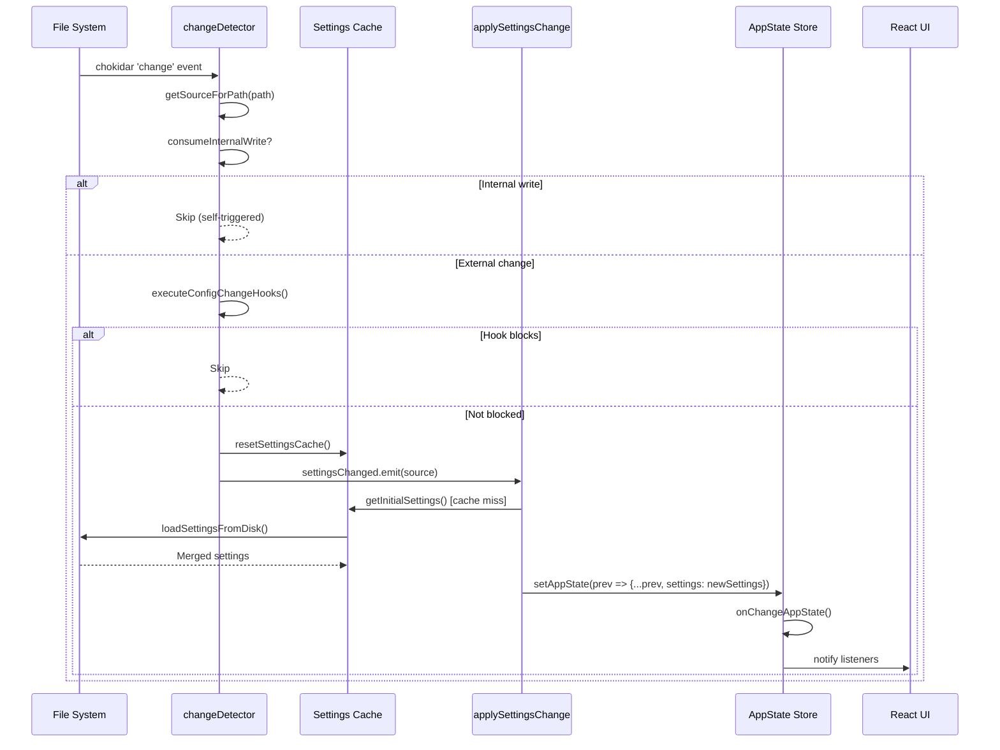
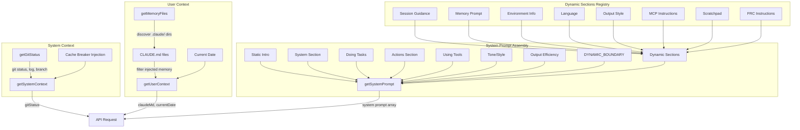
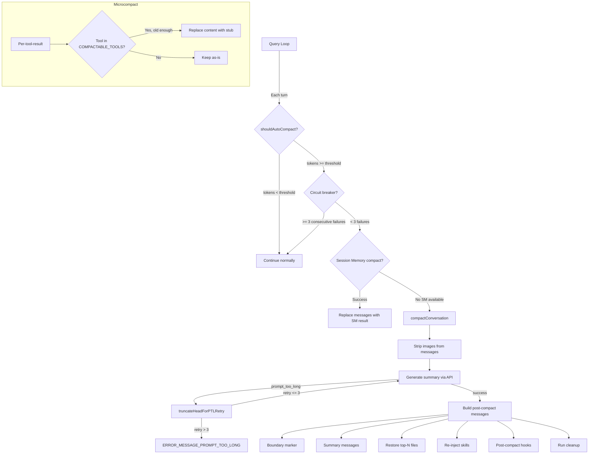
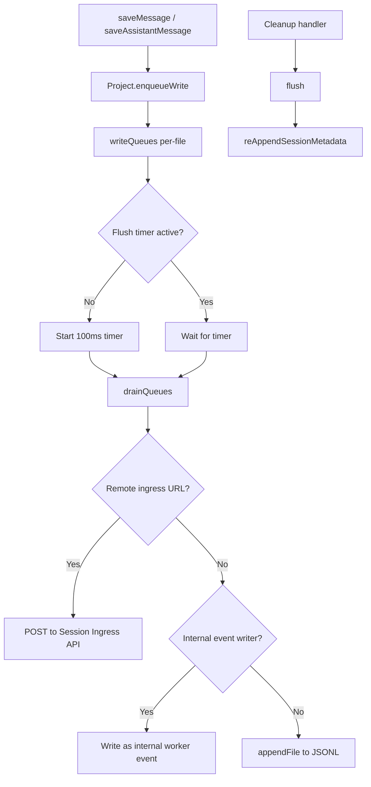

# Chapter 7 Research: State Management and Configuration

## Source Files Analyzed

| File | Lines | Purpose |
|------|-------|---------|
| `src/state/store.ts` | 35 | Generic reactive store implementation |
| `src/state/AppStateStore.ts` | 569 | AppState type definition + default factory |
| `src/state/AppState.tsx` | 199 | React provider, hooks, context |
| `src/state/onChangeAppState.ts` | 172 | State-change side effects |
| `src/state/selectors.ts` | 77 | Computed state selectors |
| `src/state/teammateViewHelpers.ts` | 142 | View transition helpers |
| `src/utils/settings/settings.ts` | ~900 | Multi-source settings loader |
| `src/utils/settings/types.ts` | ~1000 | SettingsJson Zod schema |
| `src/utils/settings/constants.ts` | 203 | Source hierarchy + display names |
| `src/utils/settings/changeDetector.ts` | 489 | File watcher + MDM poll |
| `src/utils/settings/applySettingsChange.ts` | 93 | Diff application to AppState |
| `src/utils/settings/validation.ts` | 266 | Zod validation + permission filtering |
| `src/utils/sessionStorage.ts` | 5105 | Transcript JSONL persistence |
| `src/context.ts` | 190 | Git status + CLAUDE.md context injection |
| `src/context/*.tsx` | 11 files | React contexts (notifications, voice, etc.) |
| `src/constants/prompts.ts` | ~700 | System prompt assembly |
| `src/history.ts` | 464 | Prompt history JSONL |
| `src/services/compact/compact.ts` | ~600 | Conversation compaction service |
| `src/services/compact/autoCompact.ts` | 352 | Token-threshold auto-compact |
| `src/services/compact/microCompact.ts` | ~300 | Per-tool-result micro-compaction |

---

## 1. Store Implementation

### 1.1 The `createStore<T>()` Function

**File: `src/state/store.ts`**

Claude Code uses a minimal, framework-agnostic reactive store. The entire implementation is 35 lines:

```typescript
type Listener = () => void
type OnChange<T> = (args: { newState: T; oldState: T }) => void

export type Store<T> = {
  getState: () => T
  setState: (updater: (prev: T) => T) => void
  subscribe: (listener: Listener) => () => void
}

export function createStore<T>(
  initialState: T,
  onChange?: OnChange<T>,
): Store<T> {
  let state = initialState
  const listeners = new Set<Listener>()

  return {
    getState: () => state,

    setState: (updater: (prev: T) => T) => {
      const prev = state
      const next = updater(prev)
      if (Object.is(next, prev)) return   // identity check
      state = next
      onChange?.({ newState: next, oldState: prev })
      for (const listener of listeners) listener()
    },

    subscribe: (listener: Listener) => {
      listeners.add(listener)
      return () => listeners.delete(listener)
    },
  }
}
```

### 1.2 Key Design Decisions

1. **Immutability by Convention**: `setState` receives an updater function `(prev: T) => T`. Callers must return a new object (spreading `prev`). The store skips notification via `Object.is(next, prev)` identity check when the same reference is returned.

2. **Synchronous Dispatch**: All listeners fire synchronously in a single microtask. No batching, no scheduling. This is intentional for a terminal UI where render cycles are cheap.

3. **onChange Callback**: A dedicated `onChange` hook fires before listeners, giving the system a place to execute global side effects (permission mode sync, config persistence) that must happen regardless of which React component triggered the change.

4. **Set-Based Listeners**: Using `Set<Listener>` prevents duplicate subscriptions and provides O(1) unsubscribe (the returned cleanup function calls `listeners.delete`).

5. **No Middleware**: Unlike Redux, there is no middleware pipeline. Side effects are handled by `onChangeAppState` and by the React hooks layer.

---

## 2. AppState Structure

### 2.1 Type Definition

**File: `src/state/AppStateStore.ts`**

The `AppState` type is a union of two parts:

```typescript
export type AppState = DeepImmutable<{
  // ... all primitive/object fields wrapped in DeepImmutable ...
}> & {
  // ... fields excluded from DeepImmutable (contain functions, Maps, Sets) ...
}
```

`DeepImmutable` recursively marks every property as `readonly`. Fields excluded from `DeepImmutable` contain function types, `Map`, or `Set` that cannot be deep-frozen.

### 2.2 Complete Field Inventory by Domain

#### Settings Domain
| Field | Type | Default | Description |
|-------|------|---------|-------------|
| `settings` | `SettingsJson` | `getInitialSettings()` | Merged settings from all sources |
| `verbose` | `boolean` | `false` | Debug verbosity toggle |
| `mainLoopModel` | `ModelSetting` (string or null) | `null` | Model alias/name override |
| `mainLoopModelForSession` | `ModelSetting` | `null` | Session-scoped model override |

#### UI Domain
| Field | Type | Default | Description |
|-------|------|---------|-------------|
| `statusLineText` | `string \| undefined` | `undefined` | Custom status line content |
| `expandedView` | `'none' \| 'tasks' \| 'teammates'` | `'none'` | Expanded panel state |
| `isBriefOnly` | `boolean` | `false` | Brief view mode |
| `showTeammateMessagePreview` | `boolean` (optional) | `false` | Teammate message preview toggle |
| `selectedIPAgentIndex` | `number` | `-1` | In-process agent selection index |
| `coordinatorTaskIndex` | `number` | `-1` | Coordinator panel selection |
| `viewSelectionMode` | `'none' \| 'selecting-agent' \| 'viewing-agent'` | `'none'` | Agent view mode |
| `footerSelection` | `FooterItem \| null` | `null` | Focused footer pill |
| `spinnerTip` | `string` (optional) | `undefined` | Spinner tip text |
| `activeOverlays` | `ReadonlySet<string>` | `new Set()` | Active overlay IDs for Escape coordination |

`FooterItem` is: `'tasks' | 'tmux' | 'bagel' | 'teams' | 'bridge' | 'companion'`

#### Permission Domain
| Field | Type | Default | Description |
|-------|------|---------|-------------|
| `toolPermissionContext` | `ToolPermissionContext` | `getEmptyToolPermissionContext()` with mode from teammate check | Permission rules, mode, bypass state |
| `denialTracking` | `DenialTrackingState` (optional) | `undefined` | Classifier mode denial limits |

#### Agent/Identity Domain
| Field | Type | Default | Description |
|-------|------|---------|-------------|
| `agent` | `string \| undefined` | `undefined` | Agent name from --agent flag |
| `kairosEnabled` | `boolean` | `false` | Assistant mode fully enabled flag |
| `standaloneAgentContext` | `{name, color?}` (optional) | `undefined` | Non-swarm agent identity |

#### Remote/Bridge Domain
| Field | Type | Default | Description |
|-------|------|---------|-------------|
| `remoteSessionUrl` | `string \| undefined` | `undefined` | Remote session URL |
| `remoteConnectionStatus` | `'connecting' \| 'connected' \| 'reconnecting' \| 'disconnected'` | `'connecting'` | WS connection state |
| `remoteBackgroundTaskCount` | `number` | `0` | Remote daemon task count |
| `replBridgeEnabled` | `boolean` | `false` | Always-on bridge desired state |
| `replBridgeExplicit` | `boolean` | `false` | Activated via /remote-control |
| `replBridgeOutboundOnly` | `boolean` | `false` | Forward-only mode |
| `replBridgeConnected` | `boolean` | `false` | Environment registered + session created |
| `replBridgeSessionActive` | `boolean` | `false` | Ingress WebSocket open |
| `replBridgeReconnecting` | `boolean` | `false` | Poll loop in error backoff |
| `replBridgeConnectUrl` | `string \| undefined` | `undefined` | Connect URL for Ready state |
| `replBridgeSessionUrl` | `string \| undefined` | `undefined` | Session URL on claude.ai |
| `replBridgeEnvironmentId` | `string \| undefined` | `undefined` | Debug ID |
| `replBridgeSessionId` | `string \| undefined` | `undefined` | Debug ID |
| `replBridgeError` | `string \| undefined` | `undefined` | Connection error message |
| `replBridgeInitialName` | `string \| undefined` | `undefined` | Session name from /remote-control |
| `showRemoteCallout` | `boolean` | `false` | First-time remote dialog pending |
| `replBridgePermissionCallbacks` | `BridgePermissionCallbacks` (optional) | `undefined` | Bidirectional permission callbacks |
| `channelPermissionCallbacks` | `ChannelPermissionCallbacks` (optional) | `undefined` | Channel permission callbacks |

#### Task Domain
| Field | Type | Default | Description |
|-------|------|---------|-------------|
| `tasks` | `{ [taskId: string]: TaskState }` | `{}` | All tasks (excluded from DeepImmutable) |
| `agentNameRegistry` | `Map<string, AgentId>` | `new Map()` | Name-to-ID mapping for SendMessage routing |
| `foregroundedTaskId` | `string` (optional) | `undefined` | Task shown in main view |
| `viewingAgentTaskId` | `string` (optional) | `undefined` | Teammate transcript being viewed |

#### MCP Domain
| Field | Type | Default | Description |
|-------|------|---------|-------------|
| `mcp.clients` | `MCPServerConnection[]` | `[]` | Connected MCP server instances |
| `mcp.tools` | `Tool[]` | `[]` | MCP-provided tools |
| `mcp.commands` | `Command[]` | `[]` | MCP-provided commands |
| `mcp.resources` | `Record<string, ServerResource[]>` | `{}` | MCP resources |
| `mcp.pluginReconnectKey` | `number` | `0` | Incremented by /reload-plugins |

#### Plugin Domain
| Field | Type | Default | Description |
|-------|------|---------|-------------|
| `plugins.enabled` | `LoadedPlugin[]` | `[]` | Active plugins |
| `plugins.disabled` | `LoadedPlugin[]` | `[]` | Disabled plugins |
| `plugins.commands` | `Command[]` | `[]` | Plugin-provided commands |
| `plugins.errors` | `PluginError[]` | `[]` | Loading/init errors |
| `plugins.installationStatus.marketplaces` | `Array<{name, status, error?}>` | `[]` | Marketplace install status |
| `plugins.installationStatus.plugins` | `Array<{id, name, status, error?}>` | `[]` | Plugin install status |
| `plugins.needsRefresh` | `boolean` | `false` | Stale-state flag |

#### Conversation Domain
| Field | Type | Default | Description |
|-------|------|---------|-------------|
| `thinkingEnabled` | `boolean \| undefined` | `shouldEnableThinkingByDefault()` | Extended thinking toggle |
| `promptSuggestionEnabled` | `boolean` | `shouldEnablePromptSuggestion()` | Prompt suggestion feature |
| `promptSuggestion` | `{text, promptId, shownAt, acceptedAt, generationRequestId}` | All null/zero | Current prompt suggestion |
| `speculation` | `SpeculationState` | `{ status: 'idle' }` | Speculative execution state |
| `speculationSessionTimeSavedMs` | `number` | `0` | Cumulative time saved |
| `initialMessage` | `{message, clearContext?, mode?, allowedPrompts?} \| null` | `null` | Initial message from CLI |

#### Notification Domain
| Field | Type | Default | Description |
|-------|------|---------|-------------|
| `notifications.current` | `Notification \| null` | `null` | Currently displayed notification |
| `notifications.queue` | `Notification[]` | `[]` | Pending notifications |
| `elicitation.queue` | `ElicitationRequestEvent[]` | `[]` | MCP elicitation requests |

#### Companion/Buddy Domain
| Field | Type | Default | Description |
|-------|------|---------|-------------|
| `companionReaction` | `string` (optional) | `undefined` | Latest companion reaction |
| `companionPetAt` | `number` (optional) | `undefined` | Timestamp of last /buddy pet |

#### Team/Swarm Domain
| Field | Type | Default | Description |
|-------|------|---------|-------------|
| `teamContext` | `{teamName, teamFilePath, leadAgentId, selfAgentId?, ...teammates}` (optional) | `undefined` | Swarm team context |
| `inbox.messages` | `Array<{id, from, text, timestamp, status, color?, summary?}>` | `[]` | Team inbox messages |
| `workerSandboxPermissions.queue` | `Array<{requestId, workerId, workerName, ...}>` | `[]` | Worker permission requests |
| `workerSandboxPermissions.selectedIndex` | `number` | `0` | Selected permission index |
| `pendingWorkerRequest` | `{toolName, toolUseId, description} \| null` | `null` | Worker-side pending request |
| `pendingSandboxRequest` | `{requestId, host} \| null` | `null` | Worker-side sandbox request |

#### File/Attribution Domain
| Field | Type | Default | Description |
|-------|------|---------|-------------|
| `agentDefinitions` | `AgentDefinitionsResult` | `{ activeAgents: [], allAgents: [] }` | Loaded agent definitions |
| `fileHistory` | `FileHistoryState` | `{snapshots: [], trackedFiles: new Set(), snapshotSequence: 0}` | File change tracking |
| `attribution` | `AttributionState` | `createEmptyAttributionState()` | Commit attribution state |
| `todos` | `{ [agentId: string]: TodoList }` | `{}` | Per-agent todo lists |

#### Tungsten (tmux) Domain
| Field | Type | Default | Description |
|-------|------|---------|-------------|
| `tungstenActiveSession` | `{sessionName, socketName, target}` (optional) | `undefined` | Active tmux session |
| `tungstenLastCapturedTime` | `number` (optional) | `undefined` | Last frame capture timestamp |
| `tungstenLastCommand` | `{command, timestamp}` (optional) | `undefined` | Last tmux command |
| `tungstenPanelVisible` | `boolean` (optional) | `undefined` | Sticky panel visibility |
| `tungstenPanelAutoHidden` | `boolean` (optional) | `undefined` | Transient auto-hide |

#### WebBrowser (bagel) Domain
| Field | Type | Default | Description |
|-------|------|---------|-------------|
| `bagelActive` | `boolean` (optional) | `undefined` | WebBrowser pill visible |
| `bagelUrl` | `string` (optional) | `undefined` | Current page URL |
| `bagelPanelVisible` | `boolean` (optional) | `undefined` | Panel visibility toggle |

#### Computer Use (Chicago) Domain
| Field | Type | Default | Description |
|-------|------|---------|-------------|
| `computerUseMcpState` | Complex nested object (optional) | `undefined` | CU session state: allowedApps, grantFlags, lastScreenshotDims, hiddenDuringTurn, selectedDisplayId, displayPinnedByModel, displayResolvedForApps |

#### REPL Domain
| Field | Type | Default | Description |
|-------|------|---------|-------------|
| `replContext` | `{vmContext, registeredTools, console}` (optional) | `undefined` | REPL tool VM context |

#### Ultraplan Domain
| Field | Type | Default | Description |
|-------|------|---------|-------------|
| `ultraplanLaunching` | `boolean` (optional) | `undefined` | Prevents duplicate launches |
| `ultraplanSessionUrl` | `string` (optional) | `undefined` | Active CCR session URL |
| `ultraplanPendingChoice` | `{plan, sessionId, taskId}` (optional) | `undefined` | Approved plan awaiting user choice |
| `ultraplanLaunchPending` | `{blurb}` (optional) | `undefined` | Pre-launch permission dialog |
| `isUltraplanMode` | `boolean` (optional) | `undefined` | Remote-harness ultraplan mode |

#### Miscellaneous Domain
| Field | Type | Default | Description |
|-------|------|---------|-------------|
| `sessionHooks` | `SessionHooksState` (Map) | `new Map()` | Session-scoped hook state |
| `skillImprovement.suggestion` | `{skillName, updates} \| null` | `null` | Skill improvement suggestion |
| `authVersion` | `number` | `0` | Incremented on login/logout |
| `pendingPlanVerification` | `{plan, verificationStarted, verificationCompleted}` (optional) | `undefined` | Plan verification state |
| `fastMode` | `boolean` (optional) | `false` | Fast mode toggle |
| `advisorModel` | `string` (optional) | `undefined` | Server-side advisor model |
| `effortValue` | `EffortValue` (optional) | `undefined` | Effort level setting |
| `remoteAgentTaskSuggestions` | `{summary, task}[]` | `[]` | Remote agent suggestions |

### 2.3 Speculation Types

```typescript
export type CompletionBoundary =
  | { type: 'complete'; completedAt: number; outputTokens: number }
  | { type: 'bash'; command: string; completedAt: number }
  | { type: 'edit'; toolName: string; filePath: string; completedAt: number }
  | { type: 'denied_tool'; toolName: string; detail: string; completedAt: number }

export type SpeculationResult = {
  messages: Message[]
  boundary: CompletionBoundary | null
  timeSavedMs: number
}

export type SpeculationState =
  | { status: 'idle' }
  | {
      status: 'active'
      id: string
      abort: () => void
      startTime: number
      messagesRef: { current: Message[] }
      writtenPathsRef: { current: Set<string> }
      boundary: CompletionBoundary | null
      suggestionLength: number
      toolUseCount: number
      isPipelined: boolean
      contextRef: { current: REPLHookContext }
      pipelinedSuggestion?: { text: string; promptId: ...; generationRequestId: ... } | null
    }
```

### 2.4 Default State Factory

`getDefaultAppState()` constructs the initial state. Notable initialization logic:

- **Permission mode**: Checks if the process is a teammate with `plan_mode_required` -- if so, starts in `'plan'` mode instead of `'default'`.
- **Settings**: Loaded from `getInitialSettings()` (multi-source merge, see Section 5).
- **Thinking**: `shouldEnableThinkingByDefault()` consults model capabilities.
- **Prompt suggestions**: `shouldEnablePromptSuggestion()` checks feature flags.

---

## 3. AppState Provider

### 3.1 React Context

**File: `src/state/AppState.tsx`**

```typescript
export const AppStoreContext = React.createContext<AppStateStore | null>(null)
const HasAppStateContext = React.createContext<boolean>(false)
```

Two contexts are used:
1. `AppStoreContext` - holds the actual store reference
2. `HasAppStateContext` - a boolean guard to prevent nesting

### 3.2 AppStateProvider Component

The provider is compiled by React Compiler (note `_c` from `react/compiler-runtime`). Key behaviors:

1. **Store Creation**: `useState(() => createStore(initialState ?? getDefaultAppState(), onChangeAppState))` -- the store is created once and never recreated.

2. **Nesting Guard**: Throws `"AppStateProvider can not be nested within another AppStateProvider"` if a parent provider is detected.

3. **Bypass Permissions Check**: On mount, checks if bypass permissions mode was disabled by remote settings that loaded before mount -- updates the store synchronously.

4. **Settings Hot Reload**: `useSettingsChange(onSettingsChange)` subscribes to the `changeDetector` signal. When any settings file changes, `applySettingsChange(source, store.setState)` is called.

5. **Nested Providers**: Wraps children in `<MailboxProvider>` and `<VoiceProvider>` (VoiceProvider is DCE'd in external builds).

### 3.3 Hooks API

```typescript
// Subscribe to a slice of state (re-renders only when selected value changes)
export function useAppState<T>(selector: (s: AppState) => T): T

// Get the setState updater without subscribing to state
export function useSetAppState(): (updater: (prev: AppState) => AppState) => void

// Get the full store (for passing to non-React code)
export function useAppStateStore(): AppStateStore

// Safe version that returns undefined outside provider
export function useAppStateMaybeOutsideOfProvider<T>(
  selector: (s: AppState) => T
): T | undefined
```

**`useAppState` Implementation**: Uses `useSyncExternalStore(store.subscribe, get, get)` where `get` calls `selector(store.getState())`. The selector return value is compared via `Object.is` -- only re-renders when the identity changes.

**Important usage rule**: Do NOT return new objects from the selector. Use existing sub-object references:
```typescript
const { text, promptId } = useAppState(s => s.promptSuggestion) // good
const data = useAppState(s => ({ a: s.verbose, b: s.model }))   // bad - new object every time
```

---

## 4. State Change Effects

### 4.1 onChangeAppState

**File: `src/state/onChangeAppState.ts`**

This function fires on every state transition (via the `onChange` parameter to `createStore`). It acts as a centralized side-effect handler:

#### Permission Mode Sync
```
prevMode !== newMode?
  -> toExternalPermissionMode() to filter internal modes (bubble, ungated auto)
  -> notifySessionMetadataChanged({ permission_mode, is_ultraplan_mode })
  -> notifyPermissionModeChanged(newMode)
```
This is the **single choke point** for CCR/SDK mode synchronization. Previously 8+ mutation paths existed with only 2 notifying CCR.

#### Model Change Persistence
```
mainLoopModel changed to null?
  -> updateSettingsForSource('userSettings', { model: undefined })
  -> setMainLoopModelOverride(null)

mainLoopModel changed to non-null?
  -> updateSettingsForSource('userSettings', { model: newValue })
  -> setMainLoopModelOverride(newValue)
```

#### expandedView Persistence
```
expandedView changed?
  -> saveGlobalConfig({ showExpandedTodos, showSpinnerTree })
```

#### verbose Persistence
```
verbose changed?
  -> saveGlobalConfig({ verbose })
```

#### Settings Change (auth cache clearing)
```
settings object identity changed?
  -> clearApiKeyHelperCache()
  -> clearAwsCredentialsCache()
  -> clearGcpCredentialsCache()
  -> if env changed: applyConfigEnvironmentVariables()
```

### 4.2 externalMetadataToAppState

Inverse of the permission mode push -- restores permission mode and ultraplan mode from external metadata (used for worker restart in remote sessions):

```typescript
export function externalMetadataToAppState(
  metadata: SessionExternalMetadata,
): (prev: AppState) => AppState
```

---

## 5. Settings System

### 5.1 Setting Sources and Merge Hierarchy

**File: `src/utils/settings/constants.ts`**

```typescript
export const SETTING_SOURCES = [
  'userSettings',      // ~/.claude/settings.json (global)
  'projectSettings',   // .claude/settings.json (shared per-directory)
  'localSettings',     // .claude/settings.local.json (gitignored)
  'flagSettings',      // --settings CLI flag
  'policySettings',    // Managed settings (enterprise)
] as const
```

Merge order is **lowest-to-highest priority**: user -> project -> local -> flag -> policy.

Additionally, **plugin settings** form an even lower base layer, merged before all file-based sources.

#### Policy Settings Sub-Hierarchy

Policy settings have their own internal priority (first-source-wins):
1. **Remote** (API-fetched managed settings) -- highest
2. **HKLM/plist** (admin-only MDM registry/plist)
3. **managed-settings.json + managed-settings.d/*.json** (file-based, admin-owned)
4. **HKCU** (user-writable registry) -- lowest

#### Editable vs. Read-Only Sources

```typescript
export type EditableSettingSource = Exclude<
  SettingSource,
  'policySettings' | 'flagSettings'
>
// = 'userSettings' | 'projectSettings' | 'localSettings'
```

#### Source Filtering

`--setting-sources` CLI flag can restrict which sources are loaded. Policy and flag settings are always included:
```typescript
export function getEnabledSettingSources(): SettingSource[] {
  const allowed = getAllowedSettingSources()
  const result = new Set<SettingSource>(allowed)
  result.add('policySettings')
  result.add('flagSettings')
  return Array.from(result)
}
```

### 5.2 Settings File Paths

| Source | Path |
|--------|------|
| `userSettings` | `~/.claude/settings.json` (or `cowork_settings.json` in cowork mode) |
| `projectSettings` | `<cwd>/.claude/settings.json` |
| `localSettings` | `<cwd>/.claude/settings.local.json` |
| `flagSettings` | Path from `--settings` CLI flag |
| `policySettings` | Platform-dependent managed path |

### 5.3 Settings Loading Pipeline

**File: `src/utils/settings/settings.ts`**

The `loadSettingsFromDisk()` function implements the complete merge:

```
1. Start with plugin settings as lowest-priority base
2. For each enabled source in SETTING_SOURCES order:
   a. For policySettings: try remote > HKLM > file > HKCU (first-wins)
   b. For file-based: parseSettingsFile(path) -> zod validate -> merge
   c. For flagSettings: also merge getFlagSettingsInline() (SDK)
3. Arrays: concatenated and deduplicated (settingsMergeCustomizer)
4. Objects: deep-merged via lodash mergeWith
5. Errors: deduplicated by file:path:message key
```

#### Caching Strategy

Three cache levels:
1. **Per-file parse cache**: `getCachedParsedFile(path)` -- caches parsed+validated JSON per path
2. **Per-source cache**: `getCachedSettingsForSource(source)` -- caches the resolved settings for each source
3. **Session cache**: `getSessionSettingsCache()` -- caches the final merged result

All caches are invalidated by `resetSettingsCache()` which is called by `changeDetector.fanOut()`.

#### Merge Customizer

```typescript
export function settingsMergeCustomizer(objValue, srcValue): unknown {
  if (Array.isArray(objValue) && Array.isArray(srcValue)) {
    return mergeArrays(objValue, srcValue) // concatenate + deduplicate
  }
  return undefined // default lodash deep merge
}
```

For `updateSettingsForSource` (writes), the customizer differs:
- `undefined` values = deletion (key is removed)
- Arrays = replacement (not concatenation)

### 5.4 Public API

```typescript
// Get merged settings (cached)
export function getInitialSettings(): SettingsJson

// Get merged settings + validation errors
export function getSettingsWithErrors(): SettingsWithErrors

// Get per-source breakdown
export function getSettingsWithSources(): SettingsWithSources

// Update a specific source (writes to disk)
export function updateSettingsForSource(
  source: EditableSettingSource,
  settings: SettingsJson
): { error: Error | null }
```

---

## 6. SettingsJson Schema

### 6.1 Schema Overview

**File: `src/utils/settings/types.ts`**

The schema is defined using Zod v4 with lazy evaluation (`lazySchema()`). All fields are optional. The outer object uses `.passthrough()` to preserve unknown fields during validation.

### 6.2 Key Fields by Category

#### Authentication
| Field | Type | Description |
|-------|------|-------------|
| `apiKeyHelper` | `string?` | Path to script that outputs auth values |
| `awsCredentialExport` | `string?` | Path to AWS credential export script |
| `awsAuthRefresh` | `string?` | Path to AWS auth refresh script |
| `gcpAuthRefresh` | `string?` | GCP auth refresh command |
| `xaaIdp` | `{issuer, clientId, callbackPort?}?` | XAA IdP connection (gated) |

#### Model Configuration
| Field | Type | Description |
|-------|------|-------------|
| `model` | `string?` | Override default model |
| `availableModels` | `string[]?` | Enterprise model allowlist |
| `modelOverrides` | `Record<string, string>?` | Model ID mapping (e.g., for Bedrock ARNs) |

#### Permissions
| Field | Type | Description |
|-------|------|-------------|
| `permissions.allow` | `PermissionRule[]?` | Allowed operations |
| `permissions.deny` | `PermissionRule[]?` | Denied operations |
| `permissions.ask` | `PermissionRule[]?` | Always-prompt operations |
| `permissions.defaultMode` | `PermissionMode?` | Default permission mode |
| `permissions.disableBypassPermissionsMode` | `'disable'?` | Disable bypass mode |
| `permissions.disableAutoMode` | `'disable'?` | Disable auto mode (gated) |
| `permissions.additionalDirectories` | `string[]?` | Extra directories in scope |

#### Hooks
| Field | Type | Description |
|-------|------|-------------|
| `hooks` | `HooksSettings?` | Custom commands for tool events |
| `disableAllHooks` | `boolean?` | Disable all hooks and statusLine |
| `allowManagedHooksOnly` | `boolean?` | Only run managed hooks |
| `allowedHttpHookUrls` | `string[]?` | URL pattern allowlist for HTTP hooks |
| `httpHookAllowedEnvVars` | `string[]?` | Env var allowlist for HTTP hook headers |

#### MCP Configuration
| Field | Type | Description |
|-------|------|-------------|
| `enableAllProjectMcpServers` | `boolean?` | Auto-approve all project MCP servers |
| `enabledMcpjsonServers` | `string[]?` | Approved MCP servers from .mcp.json |
| `disabledMcpjsonServers` | `string[]?` | Rejected MCP servers |
| `allowedMcpServers` | `AllowedMcpServerEntry[]?` | Enterprise MCP allowlist |
| `deniedMcpServers` | `DeniedMcpServerEntry[]?` | Enterprise MCP denylist |
| `allowManagedMcpServersOnly` | `boolean?` | Only read MCP allowlist from managed settings |

`AllowedMcpServerEntrySchema` requires exactly one of: `serverName` (regex-validated), `serverCommand` (array), or `serverUrl` (wildcard pattern).

#### Plugin System
| Field | Type | Description |
|-------|------|-------------|
| `enabledPlugins` | `Record<string, boolean \| string[] \| undefined>?` | Plugin activation map |
| `extraKnownMarketplaces` | `Record<string, ExtraKnownMarketplace>?` | Additional marketplace sources |
| `strictKnownMarketplaces` | `MarketplaceSource[]?` | Enterprise marketplace allowlist |
| `blockedMarketplaces` | `MarketplaceSource[]?` | Enterprise marketplace blocklist |
| `strictPluginOnlyCustomization` | `boolean \| CustomizationSurface[]?` | Force plugins-only customization |
| `pluginConfigs` | `Record<string, {mcpServers?, options?}>?` | Per-plugin configuration |

`CUSTOMIZATION_SURFACES = ['skills', 'agents', 'hooks', 'mcp']`

#### Display / UX
| Field | Type | Description |
|-------|------|-------------|
| `outputStyle` | `string?` | Assistant response style |
| `language` | `string?` | Preferred language for responses |
| `syntaxHighlightingDisabled` | `boolean?` | Disable syntax highlighting |
| `spinnerTipsEnabled` | `boolean?` | Show spinner tips |
| `spinnerVerbs` | `{mode: 'append'\|'replace', verbs: string[]}?` | Custom spinner verbs |
| `spinnerTipsOverride` | `{excludeDefault?, tips: string[]}?` | Custom spinner tips |
| `prefersReducedMotion` | `boolean?` | Reduce animations |
| `showThinkingSummaries` | `boolean?` | Show thinking summaries |
| `terminalTitleFromRename` | `boolean?` | /rename updates terminal title |
| `defaultView` | `'chat' \| 'transcript'?` | Default transcript view (gated) |

#### AI Behavior
| Field | Type | Description |
|-------|------|-------------|
| `alwaysThinkingEnabled` | `boolean?` | Force thinking on/off |
| `effortLevel` | `'low' \| 'medium' \| 'high' \| 'max'?` | Model effort level |
| `advisorModel` | `string?` | Server-side advisor tool model |
| `fastMode` | `boolean?` | Fast mode toggle |
| `fastModePerSessionOptIn` | `boolean?` | Fast mode doesn't persist |
| `promptSuggestionEnabled` | `boolean?` | Enable prompt suggestions |
| `agent` | `string?` | Named agent for main thread |

#### Environment & Sandbox
| Field | Type | Description |
|-------|------|-------------|
| `env` | `Record<string, string>?` | Environment variables |
| `sandbox` | `SandboxSettings?` | Sandbox configuration |
| `defaultShell` | `'bash' \| 'powershell'?` | Default shell |
| `respectGitignore` | `boolean?` | File picker respects .gitignore |

#### Session Management
| Field | Type | Description |
|-------|------|-------------|
| `cleanupPeriodDays` | `number?` | Transcript retention period |
| `plansDirectory` | `string?` | Custom plans directory |
| `remote.defaultEnvironmentId` | `string?` | Remote session default env |

#### Enterprise
| Field | Type | Description |
|-------|------|-------------|
| `forceLoginMethod` | `'claudeai' \| 'console'?` | Force login method |
| `forceLoginOrgUUID` | `string?` | Organization UUID for OAuth |
| `otelHeadersHelper` | `string?` | OTEL headers script path |
| `allowManagedPermissionRulesOnly` | `boolean?` | Only respect managed permissions |
| `companyAnnouncements` | `string[]?` | Startup announcements |
| `feedbackSurveyRate` | `number (0-1)?` | Survey probability |

#### Attribution
| Field | Type | Description |
|-------|------|-------------|
| `attribution.commit` | `string?` | Git commit attribution text |
| `attribution.pr` | `string?` | PR attribution text |
| `includeCoAuthoredBy` | `boolean?` | Deprecated: use attribution |
| `includeGitInstructions` | `boolean?` | Include git workflow instructions |

#### Memory
| Field | Type | Description |
|-------|------|-------------|
| `autoMemoryEnabled` | `boolean?` | Enable auto-memory |
| `autoMemoryDirectory` | `string?` | Custom memory directory |
| `autoDreamEnabled` | `boolean?` | Enable background memory consolidation |

#### Channels
| Field | Type | Description |
|-------|------|-------------|
| `channelsEnabled` | `boolean?` | Enable channel notifications |
| `allowedChannelPlugins` | `{marketplace, plugin}[]?` | Channel plugin allowlist |

---

## 7. Settings Hot Reload

### 7.1 File Watching

**File: `src/utils/settings/changeDetector.ts`**

The `settingsChangeDetector` module manages a `chokidar` watcher that monitors all settings file directories:

```
initialization:
  1. Collect all potential settings file paths
  2. Deduplicate to parent directories
  3. Check which directories have at least one existing file
  4. Also include managed-settings.d/ drop-in directory
  5. Start chokidar watcher with:
     - depth: 0 (immediate children only)
     - awaitWriteFinish: { stabilityThreshold: 1000ms, pollInterval: 500ms }
     - ignored: filter to only known settings files + drop-in .json files
  6. Start MDM settings poll (30-minute interval)
```

### 7.2 Change Detection Flow

```
File change detected
  -> handleChange(path)
     -> getSourceForPath(path) -> SettingSource
     -> consumeInternalWrite(path, 5000ms)  // skip if we wrote it
     -> executeConfigChangeHooks(source, path)
     -> if not blocked: fanOut(source)

fanOut(source):
  1. resetSettingsCache()  // centralized cache invalidation
  2. settingsChanged.emit(source)  // notify all subscribers
```

### 7.3 Internal Write Suppression

When Claude Code writes a settings file (via `updateSettingsForSource`), it calls `markInternalWrite(path)`. The change detector checks `consumeInternalWrite(path, INTERNAL_WRITE_WINDOW_MS)` within a 5-second window to skip self-triggered changes.

### 7.4 Deletion Grace Period

Files deleted during an auto-update or another session starting up use a grace period:

```
File deleted -> handleDelete(path)
  -> Set timeout for DELETION_GRACE_MS (1500ms + 200ms buffer)
  -> If 'add' or 'change' fires within grace: cancel deletion, treat as change
  -> If grace expires: process as real deletion
```

### 7.5 MDM Polling

Registry/plist changes cannot be watched via filesystem events, so MDM settings are polled every 30 minutes:

```
startMdmPoll():
  1. Take initial snapshot: jsonStringify({ mdm, hkcu })
  2. Every 30 minutes:
     a. Refresh MDM settings (re-read registry/plist)
     b. Compare to last snapshot
     c. If changed: update cache, fanOut('policySettings')
```

### 7.6 Application to AppState

**File: `src/utils/settings/applySettingsChange.ts`**

```typescript
export function applySettingsChange(
  source: SettingSource,
  setAppState: (f: (prev: AppState) => AppState) => void,
): void {
  const newSettings = getInitialSettings()
  const updatedRules = loadAllPermissionRulesFromDisk()
  updateHooksConfigSnapshot()

  setAppState(prev => ({
    ...prev,
    settings: newSettings,
    toolPermissionContext: syncPermissionRulesFromDisk(
      prev.toolPermissionContext, updatedRules
    ),
    // + bypass permissions check
    // + plan auto mode transition
    // + effort level sync
  }))
}
```

---

## 8. Session Storage

### 8.1 Storage Model

**File: `src/utils/sessionStorage.ts`**

Sessions are stored as JSONL (JSON Lines) files in a project-specific directory:

```
~/.claude/projects/<sanitized-cwd>/<session-id>.jsonl
```

Each line is an `Entry` -- a discriminated union of entry types.

### 8.2 Transcript Types

```typescript
type Transcript = (
  | UserMessage
  | AssistantMessage
  | AttachmentMessage
  | SystemMessage
)[]
```

The `isTranscriptMessage()` guard is the single source of truth for what constitutes a transcript message. Progress messages are explicitly excluded (ephemeral UI state).

### 8.3 Project Class

The `Project` singleton manages write queues with debounced flushing:

```typescript
class Project {
  sessionFile: string | null = null
  private pendingEntries: Entry[] = []
  private writeQueues = new Map<string, Array<{entry, resolve}>>()
  private FLUSH_INTERVAL_MS = 100
  private MAX_CHUNK_BYTES = 100 * 1024 * 1024  // 100MB max chunk
}
```

Key behaviors:
- **Lazy materialization**: Session file is not created until the first user/assistant message.
- **Buffered writes**: Entries are queued and flushed periodically (100ms) or on cleanup.
- **Remote ingress**: When `remoteIngressUrl` is set, writes also go to CCR Session Ingress API.
- **Internal event writer**: CCR v2 uses an internal event writer instead of Session Ingress.

### 8.4 Subagent Transcripts

Subagent transcripts are stored in a subdirectory:
```
~/.claude/projects/<cwd>/<session-id>/subagents/agent-<agent-id>.jsonl
```

Metadata sidecar files (`.meta.json`) store agent type, worktree path, and description for resume.

### 8.5 Session Metadata

Lite metadata (firstPrompt, gitBranch, customTitle, tag) is extracted from the head and tail of the JSONL file without reading the entire file:
```typescript
async function readLiteMetadata(path, fileSize, readBuf): Promise<LiteMetadata>
```

The `enrichLogs()` function progressively enriches lite session listings for the `/resume` picker.

### 8.6 Session File Size Limits

- `MAX_TRANSCRIPT_READ_BYTES = 50MB` -- bail-out threshold for full reads
- `MAX_TOMBSTONE_REWRITE_BYTES = 50MB` -- prevents OOM in tombstone rewrite
- `SKIP_PRECOMPACT_THRESHOLD` -- from sessionStoragePortable.ts

---

## 9. Context System

### 9.1 System Context

**File: `src/context.ts`**

The system context is memoized per session:

```typescript
export const getSystemContext = memoize(async (): Promise<{[k: string]: string}> => {
  const gitStatus = /* skip if CCR or git instructions disabled */ await getGitStatus()
  const injection = /* ant-only cache breaker */ getSystemPromptInjection()
  return {
    ...(gitStatus && { gitStatus }),
    ...(injection && { cacheBreaker: `[CACHE_BREAKER: ${injection}]` }),
  }
})
```

### 9.2 Git Status

`getGitStatus()` gathers (all in parallel):
1. Current branch
2. Default branch (for PR base)
3. `git status --short` (truncated to 2000 chars)
4. `git log --oneline -n 5`
5. `git config user.name`

Output format:
```
This is the git status at the start of the conversation...
Current branch: <branch>
Main branch: <main>
Git user: <name>
Status: <short-status>
Recent commits: <log>
```

### 9.3 User Context

```typescript
export const getUserContext = memoize(async (): Promise<{[k: string]: string}> => {
  const claudeMd = shouldDisableClaudeMd ? null
    : getClaudeMds(filterInjectedMemoryFiles(await getMemoryFiles()))
  setCachedClaudeMdContent(claudeMd || null)  // for auto-mode classifier
  return {
    ...(claudeMd && { claudeMd }),
    currentDate: `Today's date is ${getLocalISODate()}.`,
  }
})
```

CLAUDE.md discovery is disabled by:
- `CLAUDE_CODE_DISABLE_CLAUDE_MDS` env var
- `--bare` mode (unless `--add-dir` is explicitly used)

### 9.4 React Contexts

The `src/context/` directory contains specialized React contexts:

| Context | Purpose |
|---------|---------|
| `notifications.tsx` | Notification queue with priority (low/medium/high/immediate), timeout, folding |
| `mailbox.tsx` | Message passing between components |
| `modalContext.tsx` | Modal dialog state management |
| `overlayContext.tsx` | Overlay panel state (select dialogs) |
| `promptOverlayContext.tsx` | Prompt-specific overlay management |
| `QueuedMessageContext.tsx` | Queued message handling |
| `stats.tsx` | Token usage statistics tracking |
| `voice.tsx` | Voice mode context (ant-only, DCE'd for external) |
| `fpsMetrics.tsx` | Frame rate metrics collection |

---

## 10. System Prompt Assembly

### 10.1 Architecture

**File: `src/constants/prompts.ts`**

`getSystemPrompt()` returns a `string[]` where each element is a section. The prompt is split into two zones:

1. **Static Content** (before `SYSTEM_PROMPT_DYNAMIC_BOUNDARY`): Cacheable across organizations. Includes: intro, system rules, task instructions, action guidelines, tool usage, tone/style, output efficiency.

2. **Dynamic Content** (after boundary): Session-specific. Uses a registry of `systemPromptSection()` entries that are resolved asynchronously.

### 10.2 Static Sections

```
[1] getSimpleIntroSection(outputStyle)
    "You are an interactive agent that helps users..."
    + CYBER_RISK_INSTRUCTION

[2] getSimpleSystemSection()
    # System
    - Output formatting (markdown, monospace)
    - Permission mode awareness
    - system-reminder tags
    - Prompt injection detection
    - Hooks section
    - Automatic compression notice

[3] getSimpleDoingTasksSection()
    # Doing tasks
    - Software engineering context
    - Code style principles (no gold-plating, no speculative abstractions)
    - Comment writing policy
    - Security awareness
    - User help (/help, feedback)

[4] getActionsSection()
    # Executing actions with care
    - Reversibility assessment
    - Blast radius consideration
    - Destructive operation checklist
    - Authorization scope

[5] getUsingYourToolsSection(enabledTools)
    # Using your tools
    - Dedicated tool preference (Read > cat, Edit > sed, etc.)
    - TodoWrite/TaskCreate usage
    - Parallel tool call guidance

[6] getSimpleToneAndStyleSection()
    # Tone and style
    - No emojis unless asked
    - file_path:line_number format
    - GitHub owner/repo#123 format
    - No colon before tool calls

[7] getOutputEfficiencySection()
    - Ant: detailed communication guidelines (flowing prose, inverted pyramid)
    - External: concise output rules

[8] SYSTEM_PROMPT_DYNAMIC_BOUNDARY
```

### 10.3 Dynamic Sections

```
[D1] getSessionSpecificGuidanceSection()
    - AskUserQuestion guidance
    - ! command suggestion
    - Agent tool section (fork vs. delegate)
    - Explore agent guidance
    - Skill tool usage
    - DiscoverSkills guidance
    - Verification agent contract

[D2] loadMemoryPrompt() - Auto-memory content

[D3] getAntModelOverrideSection() - Ant-only model suffix

[D4] computeSimpleEnvInfo(model, dirs) - Environment details

[D5] getLanguageSection() - Language preference

[D6] getOutputStyleSection() - Custom output style

[D7] getMcpInstructionsSection() - Connected MCP server instructions

[D8] getScratchpadInstructions() - Scratchpad directory guidance

[D9] getFunctionResultClearingSection() - FRC instructions

[D10] SUMMARIZE_TOOL_RESULTS_SECTION - Tool result summarization

[D11] numeric_length_anchors (ant-only) - "<=25 words between tool calls"

[D12] token_budget (gated) - Token budget tracking

[D13] brief (gated) - Brief mode section
```

### 10.4 Proactive Mode

When proactive mode is active, the entire prompt is replaced with a minimal:
```
"You are an autonomous agent. Use the available tools to do useful work."
+ CYBER_RISK_INSTRUCTION
+ system reminders
+ memory prompt
+ env info
+ MCP instructions
+ scratchpad
+ FRC
+ summarize tool results
+ proactive section
```

---

## 11. Compaction System

### 11.1 Auto-Compact

**File: `src/services/compact/autoCompact.ts`**

#### Thresholds

```typescript
AUTOCOMPACT_BUFFER_TOKENS = 13_000
WARNING_THRESHOLD_BUFFER_TOKENS = 20_000
ERROR_THRESHOLD_BUFFER_TOKENS = 20_000
MANUAL_COMPACT_BUFFER_TOKENS = 3_000
MAX_CONSECUTIVE_AUTOCOMPACT_FAILURES = 3
MAX_OUTPUT_TOKENS_FOR_SUMMARY = 20_000
```

#### Token Warning Calculation

```typescript
effectiveContextWindow = contextWindow - reservedTokensForSummary
autoCompactThreshold = effectiveContextWindow - AUTOCOMPACT_BUFFER_TOKENS
warningThreshold = threshold - 20_000
errorThreshold = threshold - 20_000
blockingLimit = effectiveContextWindow - 3_000
```

#### Auto-Compact Decision

`shouldAutoCompact()` checks:
1. Not a recursion guard (session_memory, compact, marble_origami)
2. Auto-compact enabled (not DISABLE_COMPACT, not DISABLE_AUTO_COMPACT, config flag)
3. Not in reactive-only mode (gated)
4. Not in context-collapse mode (gated)
5. Token count exceeds threshold

#### Circuit Breaker

After 3 consecutive auto-compact failures, the system stops retrying for the session. This prevents wasting API calls on sessions where context is irrecoverably over the limit.

### 11.2 Compact Service

**File: `src/services/compact/compact.ts`**

#### CompactionResult Type

```typescript
export interface CompactionResult {
  boundaryMarker: SystemMessage
  summaryMessages: UserMessage[]
  attachments: AttachmentMessage[]
  hookResults: HookResultMessage[]
  messagesToKeep?: Message[]
  userDisplayMessage?: string
  preCompactTokenCount?: number
  postCompactTokenCount?: number
  truePostCompactTokenCount?: number
  compactionUsage?: ReturnType<typeof getTokenUsage>
}
```

#### Post-Compact Restoration

```typescript
POST_COMPACT_MAX_FILES_TO_RESTORE = 5
POST_COMPACT_TOKEN_BUDGET = 50_000
POST_COMPACT_MAX_TOKENS_PER_FILE = 5_000
POST_COMPACT_MAX_TOKENS_PER_SKILL = 5_000
POST_COMPACT_SKILLS_TOKEN_BUDGET = 25_000
MAX_COMPACT_STREAMING_RETRIES = 2
```

#### Prompt-Too-Long Retry

When the compact API call itself hits prompt-too-long:
```typescript
truncateHeadForPTLRetry(messages, ptlResponse):
  1. Group messages by API round
  2. Calculate drop count from token gap or 20% fallback
  3. Drop oldest groups (keep at least one)
  4. Prepend synthetic user marker if needed
  5. Max 3 retries (MAX_PTL_RETRIES)
```

#### Image Stripping

`stripImagesFromMessages()` replaces all image/document blocks with `[image]`/`[document]` text markers before sending to the compaction model. This prevents the compaction call itself from hitting prompt limits in image-heavy sessions.

### 11.3 Microcompact

**File: `src/services/compact/microCompact.ts`**

Microcompact operates at the per-tool-result level, clearing old content from large tool results:

#### Compactable Tools
```typescript
const COMPACTABLE_TOOLS = new Set([
  FILE_READ_TOOL_NAME,
  ...SHELL_TOOL_NAMES,   // Bash, PowerShell
  GREP_TOOL_NAME,
  GLOB_TOOL_NAME,
  WEB_SEARCH_TOOL_NAME,
  WEB_FETCH_TOOL_NAME,
  FILE_EDIT_TOOL_NAME,
  FILE_WRITE_TOOL_NAME,
])
```

#### Cached Microcompact (ant-only)

A cached variant uses `cache_edits` blocks to incrementally clear old content without breaking API prompt cache:

```typescript
export function consumePendingCacheEdits(): CacheEditsBlock | null
export function getPinnedCacheEdits(): PinnedCacheEdits[]
export function pinCacheEdits(userMessageIndex, block): void
export function markToolsSentToAPIState(): void
export function resetMicrocompactState(): void
```

#### Token Estimation

```typescript
function estimateMessageTokens(messages: Message[]): number
  // Counts tokens across text, tool_result, image (~2000 per image),
  // thinking, redacted_thinking, tool_use blocks
  // Pads estimate by 4/3 for conservatism
```

---

## 12. History Management

### 12.1 Storage Format

**File: `src/history.ts`**

Prompt history is stored in a global JSONL file: `~/.claude/history.jsonl`

```typescript
type LogEntry = {
  display: string                           // Display text
  pastedContents: Record<number, StoredPastedContent>  // Paste references
  timestamp: number                         // Unix timestamp
  project: string                           // Project root path
  sessionId?: string                        // Session ID
}
```

### 12.2 Reading History

History is read in reverse order (newest first) using `readLinesReverse()`:

1. **Pending entries first**: In-memory entries not yet flushed to disk
2. **File entries**: Read from `~/.claude/history.jsonl`
3. **Skipped timestamps**: Entries removed by `removeLastFromHistory()` are filtered

```typescript
export async function* getHistory(): AsyncGenerator<HistoryEntry>
  // Current session entries first, then other sessions
  // Scoped to current project (getProjectRoot())
  // Limited to MAX_HISTORY_ITEMS (100)
```

### 12.3 Writing History

```
addToHistory(command)
  -> addToPromptHistory(entry)
     -> For large pasted text (>1024 chars): hash + store in paste store
     -> For small text: store inline
     -> Push to pendingEntries
     -> flushPromptHistory(0)  // async, debounced, with file lock
```

### 12.4 Paste Content Management

Pasted content uses a two-tier storage:
- **Inline**: Content <= 1024 chars stored directly in the history entry
- **External**: Content > 1024 chars hashed and stored in a paste store, referenced by hash

References in prompt text use patterns like `[Pasted text #1 +10 lines]` or `[Image #2]`.

### 12.5 Undo Support

`removeLastFromHistory()` implements undo for auto-restore-on-interrupt (Esc rewind). Uses a fast path (pop from pending buffer) with a slow path fallback (skip-set for already-flushed entries).

---

## 13. Mermaid Diagrams

### 13.1 State Flow



### 13.2 Settings Merge Hierarchy



### 13.3 Settings Hot Reload Pipeline



### 13.4 Context Injection Pipeline



### 13.5 Compaction Flow



### 13.6 Session Storage Write Pipeline



---

## 14. Key Architectural Patterns

### 14.1 Single Source of Truth

AppState is the canonical state for the entire application. Non-React code accesses it via `store.getState()`, React code via `useAppState(selector)`. There is no separate "backend state" or "service state" -- everything flows through the store.

### 14.2 Immutability Enforcement

`DeepImmutable<T>` wraps most of AppState, making all nested properties `readonly` at the type level. Fields containing functions, Maps, or Sets are excluded from this wrapper and managed manually.

### 14.3 Settings Layering

The five-source settings system with plugin base layer implements a clean override chain that allows enterprise policy to always win, while users and projects can customize everything else. The custom merge function ensures arrays concatenate (permission rules accumulate) while objects deep-merge.

### 14.4 Cache Invalidation

The settings cache uses a centralized invalidation model: `fanOut()` in the change detector resets the cache once, then notifies all subscribers. Previously each subscriber reset the cache independently, causing N disk reloads for N subscribers.

### 14.5 Graceful Degradation

Settings validation filters invalid permission rules individually rather than rejecting the entire file. Invalid fields are preserved in the JSON for the user to fix. The `filterInvalidPermissionRules()` preprocessor runs before Zod validation.

### 14.6 Side Effect Centralization

`onChangeAppState` is the single choke point for state-change side effects. This replaces scattered notification code across 8+ mutation paths and ensures CCR/SDK synchronization always happens.
