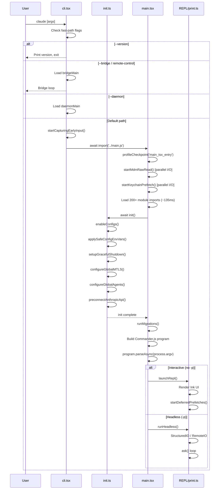
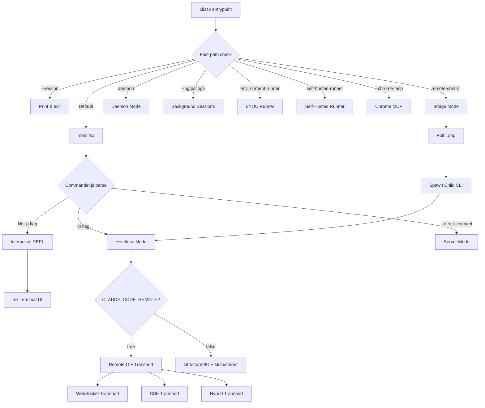
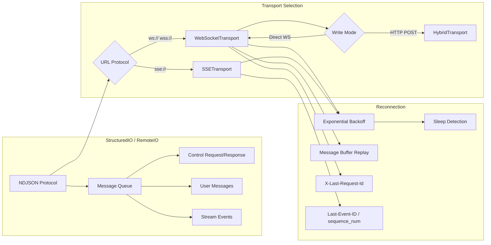
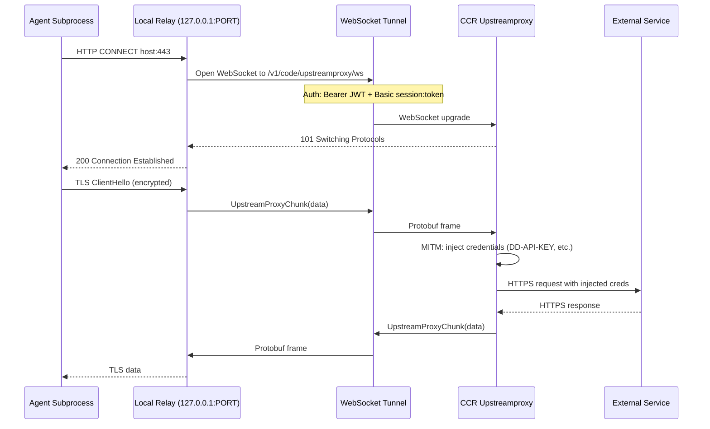

# Research Document: CLI, Bridge, and Infrastructure Layer

> Source: Claude Code codebase at `/Users/garyhuang/Documents/Gary/childcare-source/src/`
> Generated for chapters covering the bootstrap sequence, multi-mode dispatch, transport architecture, bridge system, upstream proxy, command system, migration framework, authentication, and server mode.

---

## 1. Bootstrap Sequence

The full startup chain is: `cli.tsx` -> `init.ts` -> `main.tsx`. Each layer is responsible for progressively loading more of the system, with aggressive lazy-loading to minimize cold-start time.

### 1.1 cli.tsx -- The Entrypoint

**File:** `src/entrypoints/cli.tsx` (302 lines)

This is the outermost entrypoint. Its design principle is **fast-path dispatch**: before loading the full CLI, it checks for special flags and subcommands that can exit early with minimal module evaluation.

```typescript
import { feature } from 'bun:bundle';

// Top-level side-effects (before any function call):
// 1. Disable corepack auto-pinning
process.env.COREPACK_ENABLE_AUTO_PIN = '0';

// 2. Set max heap for CCR containers (16GB machines)
if (process.env.CLAUDE_CODE_REMOTE === 'true') {
  process.env.NODE_OPTIONS = existing
    ? `${existing} --max-old-space-size=8192`
    : '--max-old-space-size=8192';
}

// 3. Ablation baseline: feature-gated DCE block
if (feature('ABLATION_BASELINE') && process.env.CLAUDE_CODE_ABLATION_BASELINE) {
  for (const k of [
    'CLAUDE_CODE_SIMPLE',
    'CLAUDE_CODE_DISABLE_THINKING',
    'DISABLE_INTERLEAVED_THINKING',
    'DISABLE_COMPACT',
    'DISABLE_AUTO_COMPACT',
    'CLAUDE_CODE_DISABLE_AUTO_MEMORY',
    'CLAUDE_CODE_DISABLE_BACKGROUND_TASKS',
  ]) {
    process.env[k] ??= '1';
  }
}
```

The `main()` function implements a priority-ordered fast-path dispatch table:

| Priority | Condition | Action | Modules Loaded |
|----------|-----------|--------|----------------|
| 1 | `--version` / `-v` | Print `MACRO.VERSION` and exit | Zero |
| 2 | `--dump-system-prompt` | Render system prompt, exit | config, model, prompts |
| 3 | `--claude-in-chrome-mcp` | Run Chrome MCP server | claudeInChrome/mcpServer |
| 4 | `--chrome-native-host` | Run Chrome native host | claudeInChrome/chromeNativeHost |
| 5 | `--computer-use-mcp` (CHICAGO_MCP) | Run computer-use MCP server | computerUse/mcpServer |
| 6 | `--daemon-worker` (DAEMON) | Run daemon worker | daemon/workerRegistry |
| 7 | `remote-control` / `rc` / `bridge` (BRIDGE_MODE) | Bridge main | bridge/bridgeMain |
| 8 | `daemon` (DAEMON) | Daemon supervisor | daemon/main |
| 9 | `ps` / `logs` / `attach` / `kill` / `--bg` (BG_SESSIONS) | Background session mgmt | cli/bg |
| 10 | `new` / `list` / `reply` (TEMPLATES) | Template jobs | cli/handlers/templateJobs |
| 11 | `environment-runner` (BYOC_ENVIRONMENT_RUNNER) | BYOC runner | environment-runner/main |
| 12 | `self-hosted-runner` (SELF_HOSTED_RUNNER) | Self-hosted runner | self-hosted-runner/main |
| 13 | `--tmux` + `--worktree` | Tmux worktree exec | utils/worktree |
| 14 | `--update` / `--upgrade` | Redirect to `update` subcommand | (rewrite argv) |
| 15 | `--bare` | Set SIMPLE env early | (env var) |
| DEFAULT | None of the above | Load full CLI via `main.tsx` | Everything |

The default path:

```typescript
// No special flags detected, load and run the full CLI
const { startCapturingEarlyInput } = await import('../utils/earlyInput.js');
startCapturingEarlyInput();
profileCheckpoint('cli_before_main_import');
const { main: cliMain } = await import('../main.js');
profileCheckpoint('cli_after_main_import');
await cliMain();
profileCheckpoint('cli_after_main_complete');
```

Key design decisions:
- All imports are **dynamic** (`await import(...)`) to avoid loading unnecessary modules
- The `feature()` function from `bun:bundle` enables **build-time dead code elimination (DCE)** -- feature-gated blocks are completely removed from the external build
- `startCapturingEarlyInput()` begins buffering stdin keystrokes before the full CLI loads, so nothing typed during startup is lost
- `profileCheckpoint()` from `startupProfiler` instruments every phase for performance monitoring

### 1.2 init.ts -- The Initialization Sequence

**File:** `src/entrypoints/init.ts` (341 lines)

`init()` is **memoized** -- it runs exactly once, regardless of how many times it's called. It performs all environment setup that must happen before the REPL renders.

```typescript
export const init = memoize(async (): Promise<void> => {
  // Phase 1: Configuration
  enableConfigs();                        // Parse and validate configs
  applySafeConfigEnvironmentVariables();  // Only safe env vars pre-trust
  applyExtraCACertsFromConfig();          // Must precede any TLS (Bun caches TLS at boot)

  // Phase 2: Shutdown & Cleanup
  setupGracefulShutdown();

  // Phase 3: Analytics (fire-and-forget)
  void Promise.all([
    import('../services/analytics/firstPartyEventLogger.js'),
    import('../services/analytics/growthbook.js'),
  ]).then(([fp, gb]) => {
    fp.initialize1PEventLogging();
    gb.onGrowthBookRefresh(() => {
      void fp.reinitialize1PEventLoggingIfConfigChanged();
    });
  });

  // Phase 4: Auth & Remote Settings
  void populateOAuthAccountInfoIfNeeded();
  void initJetBrainsDetection();
  void detectCurrentRepository();
  if (isEligibleForRemoteManagedSettings()) {
    initializeRemoteManagedSettingsLoadingPromise();
  }
  if (isPolicyLimitsEligible()) {
    initializePolicyLimitsLoadingPromise();
  }

  // Phase 5: Network
  configureGlobalMTLS();
  configureGlobalAgents();    // Proxy setup
  preconnectAnthropicApi();   // TCP+TLS handshake overlap (~100-200ms)

  // Phase 6: CCR Upstream Proxy (conditional)
  if (isEnvTruthy(process.env.CLAUDE_CODE_REMOTE)) {
    const { initUpstreamProxy, getUpstreamProxyEnv } = await import(
      '../upstreamproxy/upstreamproxy.js'
    );
    const { registerUpstreamProxyEnvFn } = await import(
      '../utils/subprocessEnv.js'
    );
    registerUpstreamProxyEnvFn(getUpstreamProxyEnv);
    await initUpstreamProxy();
  }

  // Phase 7: Platform-specific
  setShellIfWindows();
  registerCleanup(shutdownLspServerManager);

  // Phase 8: Scratchpad
  if (isScratchpadEnabled()) {
    await ensureScratchpadDir();
  }
});
```

**Post-trust telemetry initialization:**

```typescript
export function initializeTelemetryAfterTrust(): void {
  if (isEligibleForRemoteManagedSettings()) {
    void waitForRemoteManagedSettingsToLoad()
      .then(async () => {
        applyConfigEnvironmentVariables();  // Full env vars after trust
        await doInitializeTelemetry();
      });
  } else {
    void doInitializeTelemetry();
  }
}
```

Telemetry is **lazy-loaded**: `~400KB of OpenTelemetry + protobuf` modules are deferred until `doInitializeTelemetry()` runs. gRPC exporters (~700KB via `@grpc/grpc-js`) are further lazy-loaded within `instrumentation.ts`.

### 1.3 main.tsx -- The Full CLI

**File:** `src/main.tsx` (4,683 lines)

This is the heart of the CLI. It begins with **performance-critical side-effects** that must execute before regular imports:

```typescript
// Side-effect #1: startup profiler mark
profileCheckpoint('main_tsx_entry');

// Side-effect #2: Start MDM subprocess reads in parallel with imports (~135ms)
startMdmRawRead();

// Side-effect #3: Prefetch macOS keychain reads (~65ms saving)
startKeychainPrefetch();
```

These three statements overlap I/O with the ~135ms of import evaluation that follows. The file imports 200+ modules.

**Key exported function:**

```typescript
export async function main(): Promise<CommanderCommand> {
  // ... builds Commander.js program with all subcommands and options
  // ... executes program.parseAsync(process.argv)
}
```

**Migration system invocation:**

```typescript
const CURRENT_MIGRATION_VERSION = 11;
function runMigrations(): void {
  if (getGlobalConfig().migrationVersion !== CURRENT_MIGRATION_VERSION) {
    migrateAutoUpdatesToSettings();
    migrateBypassPermissionsAcceptedToSettings();
    migrateEnableAllProjectMcpServersToSettings();
    resetProToOpusDefault();
    migrateSonnet1mToSonnet45();
    migrateLegacyOpusToCurrent();
    migrateSonnet45ToSonnet46();
    migrateOpusToOpus1m();
    migrateReplBridgeEnabledToRemoteControlAtStartup();
    // ... conditional migrations
    saveGlobalConfig(prev => ({
      ...prev,
      migrationVersion: CURRENT_MIGRATION_VERSION,
    }));
  }
}
```

**Deferred prefetches** are started after first render to avoid contending with the critical startup path:

```typescript
export function startDeferredPrefetches(): void {
  if (isEnvTruthy(process.env.CLAUDE_CODE_EXIT_AFTER_FIRST_RENDER) || isBareMode()) {
    return;  // Skip for benchmarks and scripted -p calls
  }
  // ... initUser, getUserContext, tips, countFiles, modelCapabilities, etc.
}
```

---

## 2. Multi-Mode Dispatch

Claude Code operates in several distinct modes, each with different I/O and execution characteristics.

### 2.1 Mode Detection

Modes are determined by CLI flags and environment variables, dispatched through `cli.tsx`'s fast-path table and `main.tsx`'s Commander.js action handlers:

| Mode | Entry | I/O | Use Case |
|------|-------|-----|----------|
| **REPL** (interactive) | `claude` (no flags) | Terminal Ink UI | Developer workstation |
| **SDK / Headless** | `claude -p "prompt"` | stdin/stdout NDJSON | Agent SDK, CI/CD |
| **Server** | `claude --direct-connect-server-url` | WebSocket | Direct-connect server |
| **Remote / CCR** | `CLAUDE_CODE_REMOTE=true` | WebSocket/SSE transport | Cloud-hosted session |
| **Bridge** | `claude remote-control` | Polling + child spawning | Remote Control host |
| **Daemon** | `claude daemon` | IPC + worker spawning | Long-running supervisor |
| **Background** | `claude --bg` / `claude ps` | Detached session registry | Non-blocking tasks |
| **Chrome MCP** | `--claude-in-chrome-mcp` | stdio MCP | Browser integration |
| **BYOC Runner** | `claude environment-runner` | REST API polling | Bring-your-own-compute |
| **Self-Hosted Runner** | `claude self-hosted-runner` | REST API polling | Self-hosted infra |

### 2.2 Interactive (REPL) Mode

The REPL mode launches through `launchRepl()` which renders the full Ink-based terminal UI. It uses `React` for rendering and manages the message loop through the `AppState` store.

### 2.3 SDK / Headless Mode (`-p`)

The headless mode is activated by the `-p` / `--print` flag. It uses `StructuredIO` for NDJSON protocol communication:

```typescript
// From print.ts
export async function runHeadless(
  inputPrompt: string | AsyncIterable<string>,
  getAppState: () => AppState,
  setAppState: (f: (prev: AppState) => AppState) => void,
  commands: Command[],
  tools: Tools,
  sdkMcpConfigs: Record<string, McpSdkServerConfig>,
  agents: AgentDefinition[],
  options: { /* 30+ configuration options */ },
): Promise<void> { /* ... */ }
```

### 2.4 Remote / CCR Mode

When `CLAUDE_CODE_REMOTE=true`, the CLI operates inside a container (Cloud Code Runner). It uses `RemoteIO` instead of `StructuredIO`:

```typescript
// From remoteIO.ts
export class RemoteIO extends StructuredIO {
  private transport: Transport;  // WebSocket, SSE, or Hybrid
  private inputStream: PassThrough;
  private ccrClient: CCRClient | null = null;

  constructor(streamUrl: string, initialPrompt?: AsyncIterable<string>) {
    const inputStream = new PassThrough({ encoding: 'utf8' });
    super(inputStream, replayUserMessages);
    this.transport = getTransportForUrl(this.url, headers, getSessionId(), refreshHeaders);
  }
}
```

---

## 3. Feature Gates and Dead Code Elimination (DCE)

### 3.1 The `feature()` Function

```typescript
import { feature } from 'bun:bundle';
```

The `feature()` function is a **build-time macro** provided by the Bun bundler. At compile time, it evaluates to `true` or `false` based on feature flag configuration. The Bun bundler then eliminates dead branches:

```typescript
// In the source:
if (feature('BRIDGE_MODE') && args[0] === 'remote-control') {
  const { bridgeMain } = await import('../bridge/bridgeMain.js');
  await bridgeMain(args.slice(1));
  return;
}

// In the external build (when BRIDGE_MODE=false):
// This entire block is removed -- zero bytes in the output
```

### 3.2 Feature Flags in the Codebase

The codebase uses numerous feature flags for DCE:

| Flag | Purpose |
|------|---------|
| `BRIDGE_MODE` | Remote Control / bridge system |
| `DAEMON` | Long-running daemon supervisor |
| `BG_SESSIONS` | Background session management (ps/logs/attach/kill) |
| `TEMPLATES` | Template job system (new/list/reply) |
| `BYOC_ENVIRONMENT_RUNNER` | Bring-your-own-compute runner |
| `SELF_HOSTED_RUNNER` | Self-hosted runner infrastructure |
| `ABLATION_BASELINE` | Harness-science L0 ablation |
| `DUMP_SYSTEM_PROMPT` | Ant-only prompt extraction |
| `CHICAGO_MCP` | Computer-use MCP server |
| `COORDINATOR_MODE` | Coordinator mode |
| `KAIROS` | Assistant mode |
| `PROACTIVE` | Proactive mode |
| `TRANSCRIPT_CLASSIFIER` | Auto permission mode |
| `BASH_CLASSIFIER` | Bash command classifier |
| `HISTORY_SNIP` | History snipping |
| `WORKFLOW_SCRIPTS` | Workflow system |
| `CCR_REMOTE_SETUP` | Cloud remote setup |
| `MCP_SKILLS` | MCP-based skills |
| `FORK_SUBAGENT` | Fork subagent |
| `VOICE_MODE` | Voice input mode |
| `TEAMMEM` | Team memory |
| `CCR_AUTO_CONNECT` | Auto-connect to CCR |
| `EXPERIMENTAL_SKILL_SEARCH` | Skill search index |
| `KAIROS_GITHUB_WEBHOOKS` | GitHub webhook subscriptions |
| `ULTRAPLAN` | Ultra plan mode |
| `TORCH` | Torch mode |
| `UDS_INBOX` | Unix domain socket inbox |
| `BUDDY` | Buddy system |
| `KAIROS_BRIEF` | Brief mode |
| `EXTRACT_MEMORIES` | Memory extraction |
| `AGENT_TRIGGERS` | Cron-triggered agents |

### 3.3 Conditional Require Pattern

For modules that can't use dynamic `import()`, the codebase uses a conditional `require()` pattern:

```typescript
const coordinatorModeModule = feature('COORDINATOR_MODE')
  ? require('./coordinator/coordinatorMode.js') as typeof import('./coordinator/coordinatorMode.js')
  : null;
```

This ensures the bundler can tree-shake the entire module when the feature is disabled.

---

## 4. CLI Main Loop (print.ts)

**File:** `src/cli/print.ts` (5,594 lines)

This is the orchestration file for the headless/SDK execution path. It is the largest single file in the CLI layer.

### 4.1 Key Exports

```typescript
export async function runHeadless(
  inputPrompt: string | AsyncIterable<string>,
  getAppState: () => AppState,
  setAppState: (f: (prev: AppState) => AppState) => void,
  commands: Command[],
  tools: Tools,
  sdkMcpConfigs: Record<string, McpSdkServerConfig>,
  agents: AgentDefinition[],
  options: { /* ... */ },
): Promise<void>

export function joinPromptValues(values: PromptValue[]): PromptValue
export function canBatchWith(head: QueuedCommand, next: QueuedCommand | undefined): boolean
```

### 4.2 Message Processing Architecture

The file uses a **message queue manager** with priority-based dequeuing:

```typescript
import {
  dequeue, dequeueAllMatching, enqueue, hasCommandsInQueue,
  peek, subscribeToCommandQueue, getCommandsByMaxPriority,
} from 'src/utils/messageQueueManager.js';
```

Messages flow through a queue where commands can be batched:

```typescript
export function canBatchWith(head: QueuedCommand, next: QueuedCommand | undefined): boolean {
  return (
    next !== undefined &&
    next.mode === 'prompt' &&
    next.workload === head.workload &&
    next.isMeta === head.isMeta
  );
}
```

### 4.3 Duplicate Message Prevention

The print loop tracks received message UUIDs to prevent duplicates (critical for reconnection scenarios):

```typescript
const MAX_RECEIVED_UUIDS = 10_000;
const receivedMessageUuids = new Set<UUID>();
const receivedMessageUuidsOrder: UUID[] = [];

function trackReceivedMessageUuid(uuid: UUID): boolean {
  if (receivedMessageUuids.has(uuid)) return false;  // duplicate
  receivedMessageUuids.add(uuid);
  receivedMessageUuidsOrder.push(uuid);
  // Evict oldest entries when at capacity
  if (receivedMessageUuidsOrder.length > MAX_RECEIVED_UUIDS) {
    const toEvict = receivedMessageUuidsOrder.splice(0, /*...*/);
    for (const old of toEvict) receivedMessageUuids.delete(old);
  }
  return true;  // new UUID
}
```

### 4.4 Integration Points

print.ts integrates with:
- `ask()` from `QueryEngine.js` -- the core LLM query function
- `StructuredIO` / `RemoteIO` -- I/O protocol layer
- `sessionStorage` -- persistence
- `fileHistory` -- file rewind capability
- `hookEvents` -- hook execution
- `commandLifecycle` -- command lifecycle notifications
- `sessionState` -- session state broadcasting
- GrowthBook -- feature flags at runtime
- Coordinator mode, proactive mode, cron scheduler (all feature-gated)

---

## 5. Structured I/O Protocol

**File:** `src/cli/structuredIO.ts` (860 lines)

### 5.1 Protocol Design

The `StructuredIO` class implements the NDJSON (newline-delimited JSON) protocol for SDK communication. Every message is a single JSON object terminated by `\n`.

### 5.2 Message Types (Inbound -- stdin)

```typescript
type StdinMessage =
  | SDKUserMessage        // { type: 'user', message: { role: 'user', content: ... } }
  | SDKControlRequest     // { type: 'control_request', request_id, request: { subtype: ... } }
  | SDKControlResponse    // { type: 'control_response', response: { request_id, ... } }
  | { type: 'keep_alive' }
  | { type: 'update_environment_variables', variables: Record<string, string> }
  | { type: 'assistant' }
  | { type: 'system' }
```

### 5.3 Control Request/Response Protocol

The permission system uses a request-response protocol over NDJSON:

```typescript
// Outbound: CLI asks SDK host for permission
{ type: 'control_request', request_id: 'uuid', request: {
    subtype: 'can_use_tool',
    tool_name: 'Bash',
    input: { command: 'rm -rf /tmp/test' },
    tool_use_id: 'uuid',
    permission_suggestions: [...],
  }
}

// Inbound: SDK host responds
{ type: 'control_response', response: {
    subtype: 'success',
    request_id: 'uuid',
    response: { behavior: 'allow', updatedInput: {...} }
  }
}

// Cancellation (if hook or bridge resolves first)
{ type: 'control_cancel_request', request_id: 'uuid' }
```

### 5.4 The StructuredIO Class

```typescript
export class StructuredIO {
  readonly structuredInput: AsyncGenerator<StdinMessage | SDKMessage>;
  readonly outbound = new Stream<StdoutMessage>();

  // Core methods:
  constructor(input: AsyncIterable<string>, replayUserMessages?: boolean);
  async write(message: StdoutMessage): Promise<void>;
  prependUserMessage(content: string): void;
  getPendingPermissionRequests(): SDKControlRequest[];
  injectControlResponse(response: SDKControlResponse): void;
  createCanUseTool(onPermissionPrompt?): CanUseToolFn;
  createHookCallback(callbackId: string, timeout?: number): HookCallback;
  async handleElicitation(serverName, message, schema?, signal?, mode?, url?): Promise<ElicitResult>;
  createSandboxAskCallback(): (hostPattern) => Promise<boolean>;
  async sendMcpMessage(serverName, message): Promise<JSONRPCMessage>;
}
```

### 5.5 Permission Racing

The permission system races hooks against the SDK host:

```typescript
createCanUseTool(onPermissionPrompt?): CanUseToolFn {
  return async (tool, input, toolUseContext, assistantMessage, toolUseID) => {
    const mainResult = await hasPermissionsToUseTool(/*...*/);
    if (mainResult.behavior === 'allow' || mainResult.behavior === 'deny') {
      return mainResult;
    }

    // Race: hook vs SDK prompt
    const hookPromise = executePermissionRequestHooksForSDK(/*...*/)
      .then(decision => ({ source: 'hook', decision }));
    const sdkPromise = this.sendRequest<PermissionToolOutput>(/*...*/)
      .then(result => ({ source: 'sdk', result }));

    const winner = await Promise.race([hookPromise, sdkPromise]);

    if (winner.source === 'hook' && winner.decision) {
      sdkPromise.catch(() => {});  // suppress AbortError
      hookAbortController.abort();
      return winner.decision;
    }
    // ... SDK wins or hook passes through
  };
}
```

### 5.6 Duplicate Response Protection

```typescript
// Tracks tool_use IDs that have been resolved through the normal permission
// flow. When a duplicate control_response arrives (e.g. WebSocket reconnect),
// the orphan handler ignores it.
private readonly resolvedToolUseIds = new Set<string>();
private readonly MAX_RESOLVED_TOOL_USE_IDS = 1000;
```

---

## 6. Transport Architecture

### 6.1 Transport Interface

All transports implement a common interface:

```typescript
// src/cli/transports/Transport.ts
interface Transport {
  connect(): Promise<void>;
  write(message: StdoutMessage): Promise<void>;
  close(): void;
  setOnData(callback: (data: string) => void): void;
  setOnClose(callback: (closeCode?: number) => void): void;
  setOnConnect(callback: () => void): void;
}
```

### 6.2 WebSocket Transport

**File:** `src/cli/transports/WebSocketTransport.ts`

The WebSocket transport supports both Bun's native WebSocket and the `ws` npm package:

```typescript
export class WebSocketTransport implements Transport {
  // State machine
  private state: 'idle' | 'connected' | 'reconnecting' | 'closing' | 'closed' = 'idle';

  // Reconnection configuration
  private static DEFAULT_BASE_RECONNECT_DELAY = 1000;
  private static DEFAULT_MAX_RECONNECT_DELAY = 30000;
  private static DEFAULT_RECONNECT_GIVE_UP_MS = 600_000;  // 10 minutes
  private static DEFAULT_PING_INTERVAL = 10000;
  private static DEFAULT_KEEPALIVE_INTERVAL = 300_000;     // 5 minutes

  // Sleep detection: if gap between reconnects > 60s, reset budget
  private static SLEEP_DETECTION_THRESHOLD_MS = 60_000;

  // Permanent close codes (no retry)
  private static PERMANENT_CLOSE_CODES = new Set([1002, 4001, 4003]);

  // Message buffering for replay on reconnection
  private messageBuffer: CircularBuffer<StdoutMessage>;
}
```

**Runtime detection:**

```typescript
if (typeof Bun !== 'undefined') {
  // Bun's native WebSocket with proxy/TLS options
  const ws = new globalThis.WebSocket(this.url.href, {
    headers,
    proxy: getWebSocketProxyUrl(this.url.href),
    tls: getWebSocketTLSOptions() || undefined,
  });
} else {
  // Node.js: use ws package
  const { default: WS } = await import('ws');
  const ws = new WS(this.url.href, {
    headers,
    agent: getWebSocketProxyAgent(this.url.href),
    ...getWebSocketTLSOptions(),
  });
}
```

**Reconnection with resume:**

```typescript
// On reconnect, send last-sent message ID for server-side replay
if (this.lastSentId) {
  headers['X-Last-Request-Id'] = this.lastSentId;
}
```

### 6.3 SSE Transport

**File:** `src/cli/transports/SSETransport.ts`

Server-Sent Events for read path, HTTP POST for write path. Used by CCR v2.

```typescript
export class SSETransport implements Transport {
  // SSE reads via GET with Last-Event-ID for resumption
  // Writes via HTTP POST with retry logic
  private state: 'idle' | 'connected' | 'reconnecting' | 'closing' | 'closed' = 'idle';
  private lastSequenceNum = 0;
  private seenSequenceNums = new Set<number>();

  // Reconnection budget
  private static RECONNECT_BASE_DELAY_MS = 1000;
  private static RECONNECT_MAX_DELAY_MS = 30_000;
  private static RECONNECT_GIVE_UP_MS = 600_000;     // 10 minutes
  private static LIVENESS_TIMEOUT_MS = 45_000;        // 45s (server sends keepalive every 15s)

  // POST retry: 10 attempts, 500ms-8000ms backoff
  private static POST_MAX_RETRIES = 10;
  private static POST_BASE_DELAY_MS = 500;
  private static POST_MAX_DELAY_MS = 8000;
}
```

**SSE frame parsing:**

```typescript
export function parseSSEFrames(buffer: string): { frames: SSEFrame[], remaining: string } {
  // SSE frames delimited by \n\n
  // Fields: event, id, data (multiple data: lines concatenated with \n)
  // Comments (starting with :) reset liveness timer
}

export type StreamClientEvent = {
  event_id: string;
  sequence_num: number;
  event_type: string;
  source: string;
  payload: Record<string, unknown>;
  created_at: string;
};
```

### 6.4 Hybrid Transport

**File:** `src/cli/transports/HybridTransport.ts`

WebSocket for reads (low latency), HTTP POST for writes (reliable delivery). Extends `WebSocketTransport`:

```typescript
export class HybridTransport extends WebSocketTransport {
  private uploader: SerialBatchEventUploader<StdoutMessage>;
  private streamEventBuffer: StdoutMessage[] = [];  // 100ms batch window

  // Write flow:
  // write(stream_event) -> buffer (100ms) -> uploader.enqueue() -> serial POST
  // write(other)        -> flush buffer -> uploader.enqueue() -> serial POST

  override async write(message: StdoutMessage): Promise<void> {
    if (message.type === 'stream_event') {
      this.streamEventBuffer.push(message);
      if (!this.streamEventTimer) {
        this.streamEventTimer = setTimeout(
          () => this.flushStreamEvents(), BATCH_FLUSH_INTERVAL_MS);
      }
      return;
    }
    await this.uploader.enqueue([...this.takeStreamEvents(), message]);
    return this.uploader.flush();
  }
}
```

**Why serialize writes?** Bridge mode fires writes via `void transport.write()` (fire-and-forget). Without serialization, concurrent POSTs to the same Firestore document cause collision storms.

### 6.5 RemoteIO (Transport Consumer)

**File:** `src/cli/remoteIO.ts`

```typescript
export class RemoteIO extends StructuredIO {
  constructor(streamUrl: string, initialPrompt?, replayUserMessages?) {
    const inputStream = new PassThrough({ encoding: 'utf8' });
    super(inputStream, replayUserMessages);
    this.transport = getTransportForUrl(this.url, headers, getSessionId(), refreshHeaders);
    this.transport.setOnData((data: string) => {
      this.inputStream.write(data);
    });
  }
}
```

The transport is selected by URL protocol:
- `ws://` / `wss://` -> `WebSocketTransport` or `HybridTransport`
- `sse://` path -> `SSETransport`

---

## 7. Bridge System (Remote Control / CCR)

### 7.1 Architecture Overview

The bridge system enables **Remote Control**: users can control their local Claude Code session from claude.ai's web interface or mobile app. The bridge process runs on the user's machine, polls the API for work, spawns child CLI processes, and relays I/O.

### 7.2 Bridge Entry Point

From `cli.tsx`:

```typescript
if (feature('BRIDGE_MODE') && (args[0] === 'remote-control' || args[0] === 'rc')) {
  // Auth check -> GrowthBook gate -> Policy check -> bridgeMain()
  const { bridgeMain } = await import('../bridge/bridgeMain.js');
  await bridgeMain(args.slice(1));
  return;
}
```

### 7.3 Bridge Types

**File:** `src/bridge/types.ts`

```typescript
export type SpawnMode = 'single-session' | 'worktree' | 'same-dir';
export type BridgeWorkerType = 'claude_code' | 'claude_code_assistant';

export type BridgeConfig = {
  dir: string;
  machineName: string;
  branch: string;
  gitRepoUrl: string | null;
  maxSessions: number;
  spawnMode: SpawnMode;
  bridgeId: string;           // Client-generated UUID
  workerType: string;
  environmentId: string;
  reuseEnvironmentId?: string;  // Backend-issued ID for reconnect
  apiBaseUrl: string;
  sessionIngressUrl: string;
  sessionTimeoutMs?: number;    // Default: 24 hours
};

export type WorkResponse = {
  id: string;
  type: 'work';
  environment_id: string;
  state: string;
  data: WorkData;
  secret: string;   // base64url-encoded WorkSecret JSON
  created_at: string;
};

export type WorkSecret = {
  version: number;
  session_ingress_token: string;
  api_base_url: string;
  sources: Array<{ type: string; git_info?: {...} }>;
  auth: Array<{ type: string; token: string }>;
  claude_code_args?: Record<string, string> | null;
  mcp_config?: unknown | null;
  environment_variables?: Record<string, string> | null;
  use_code_sessions?: boolean;  // CCR v2 selector
};

export type SessionHandle = {
  sessionId: string;
  done: Promise<SessionDoneStatus>;
  kill(): void;
  forceKill(): void;
  activities: SessionActivity[];
  currentActivity: SessionActivity | null;
  accessToken: string;
  lastStderr: string[];
  writeStdin(data: string): void;
  updateAccessToken(token: string): void;
};
```

### 7.4 Bridge Main Loop

**File:** `src/bridge/bridgeMain.ts`

```typescript
export async function runBridgeLoop(
  config: BridgeConfig,
  environmentId: string,
  environmentSecret: string,
  api: BridgeApiClient,
  spawner: SessionSpawner,
  logger: BridgeLogger,
  signal: AbortSignal,
  backoffConfig: BackoffConfig = DEFAULT_BACKOFF,
  initialSessionId?: string,
  getAccessToken?: () => string | undefined | Promise<string | undefined>,
): Promise<void> {
  // State tracking
  const activeSessions = new Map<string, SessionHandle>();
  const sessionStartTimes = new Map<string, number>();
  const sessionWorkIds = new Map<string, string>();
  const sessionCompatIds = new Map<string, string>();
  const sessionIngressTokens = new Map<string, string>();
  const completedWorkIds = new Set<string>();
  const sessionWorktrees = new Map<string, { worktreePath, worktreeBranch?, gitRoot? }>();
  const timedOutSessions = new Set<string>();
  const capacityWake = createCapacityWake(loopSignal);

  // Main poll loop with exponential backoff
  // ... polls api.pollForWork(), spawns sessions, manages lifecycle
}
```

### 7.5 Backoff Configuration

```typescript
export type BackoffConfig = {
  connInitialMs: number;     // 2,000ms
  connCapMs: number;         // 120,000ms (2 minutes)
  connGiveUpMs: number;      // 600,000ms (10 minutes)
  generalInitialMs: number;  // 500ms
  generalCapMs: number;      // 30,000ms
  generalGiveUpMs: number;   // 600,000ms (10 minutes)
  shutdownGraceMs?: number;  // 30s (SIGTERM -> SIGKILL)
  stopWorkBaseDelayMs?: number;  // 1s (1s/2s/4s backoff)
};
```

### 7.6 Poll Interval Configuration

**File:** `src/bridge/pollConfig.ts`

Poll intervals are controlled via **GrowthBook** feature flags, allowing ops to tune fleet-wide:

```typescript
export function getPollIntervalConfig(): PollIntervalConfig {
  const raw = getFeatureValue_CACHED_WITH_REFRESH<unknown>(
    'tengu_bridge_poll_interval_config',
    DEFAULT_POLL_CONFIG,
    5 * 60 * 1000,  // 5-minute refresh
  );
  const parsed = pollIntervalConfigSchema().safeParse(raw);
  return parsed.success ? parsed.data : DEFAULT_POLL_CONFIG;
}
```

The schema enforces safety constraints:

```typescript
z.object({
  poll_interval_ms_not_at_capacity: z.number().int().min(100),
  poll_interval_ms_at_capacity: z.number().int()
    .refine(v => v === 0 || v >= 100),  // 0 = disabled, >=100 = fat-finger floor
  non_exclusive_heartbeat_interval_ms: z.number().int().min(0).default(0),
  multisession_poll_interval_ms_not_at_capacity: z.number().int().min(100).default(5000),
  multisession_poll_interval_ms_partial_capacity: z.number().int().min(100).default(2000),
  multisession_poll_interval_ms_at_capacity: z.number().int()
    .refine(v => v === 0 || v >= 100).default(10000),
  reclaim_older_than_ms: z.number().int().min(1).default(5000),
  session_keepalive_interval_v2_ms: z.number().int().min(0).default(120_000),
})
.refine(cfg =>
  // At least one liveness mechanism must be enabled
  cfg.non_exclusive_heartbeat_interval_ms > 0 ||
  cfg.poll_interval_ms_at_capacity > 0
)
```

### 7.7 Bridge API Client

**File:** `src/bridge/bridgeApi.ts`

```typescript
export function createBridgeApiClient(deps: BridgeApiDeps): BridgeApiClient {
  // Methods:
  //   registerBridgeEnvironment(config) -> { environment_id, environment_secret }
  //   pollForWork(environmentId, secret, signal?) -> WorkResponse | null
  //   acknowledgeWork(environmentId, workId, token)
  //   stopWork(environmentId, workId, force)
  //   deregisterEnvironment(environmentId)
  //   sendPermissionResponseEvent(sessionId, event, token)
  //   archiveSession(sessionId)
  //   reconnectSession(environmentId, sessionId)
  //   heartbeatWork(environmentId, workId, token) -> { lease_extended, state }
}

// ID validation against path traversal
export function validateBridgeId(id: string, label: string): string {
  const SAFE_ID_PATTERN = /^[a-zA-Z0-9_-]+$/;
  if (!id || !SAFE_ID_PATTERN.test(id)) {
    throw new Error(`Invalid ${label}: contains unsafe characters`);
  }
  return id;
}

// Fatal errors (no retry)
export class BridgeFatalError extends Error {
  readonly status: number;
  readonly errorType: string | undefined;
}
```

**OAuth retry on 401:**

```typescript
async function withOAuthRetry<T>(
  fn: (accessToken: string) => Promise<{ status: number; data: T }>,
  context: string,
): Promise<{ status: number; data: T }> {
  const response = await fn(resolveAuth());
  if (response.status !== 401) return response;
  if (!deps.onAuth401) return response;
  const refreshed = await deps.onAuth401(accessToken);
  if (refreshed) {
    const retryResponse = await fn(resolveAuth());
    if (retryResponse.status !== 401) return retryResponse;
  }
  return response;
}
```

### 7.8 Session Runner (Child Process Spawning)

**File:** `src/bridge/sessionRunner.ts`

```typescript
export function createSessionSpawner(deps: SessionSpawnerDeps): SessionSpawner {
  return {
    spawn(opts: SessionSpawnOpts, dir: string): SessionHandle {
      // Spawns child: `process.execPath [...scriptArgs] --sdk-url <url> --input-format stream-json ...`
      // Monitors stdout for SDK messages
      // Tracks activities: tool_start, text, result, error
    }
  };
}

// Tool-to-verb mapping for status display
const TOOL_VERBS: Record<string, string> = {
  Read: 'Reading', Write: 'Writing', Edit: 'Editing',
  Bash: 'Running', Glob: 'Searching', Grep: 'Searching',
  WebFetch: 'Fetching', WebSearch: 'Searching', Task: 'Running task',
};
```

### 7.9 Heartbeat and Token Refresh

The bridge maintains session liveness through two mechanisms:

1. **Heartbeat** - periodic calls to `api.heartbeatWork()` extending the work lease
2. **Token refresh** - proactive JWT refresh 5 minutes before expiry

```typescript
async function heartbeatActiveWorkItems(): Promise<'ok' | 'auth_failed' | 'fatal' | 'failed'> {
  for (const [sessionId] of activeSessions) {
    try {
      await api.heartbeatWork(environmentId, workId, ingressToken);
    } catch (err) {
      if (err.status === 401 || err.status === 403) {
        // JWT expired -> trigger server-side re-dispatch
        await api.reconnectSession(environmentId, sessionId);
      }
    }
  }
}
```

---

## 8. Upstream Proxy System

### 8.1 Purpose and Design

**File:** `src/upstreamproxy/upstreamproxy.ts`

The upstream proxy runs inside **CCR session containers** to enable organization-configured HTTP proxies with credential injection. It follows a strict **fail-open** design: any error disables the proxy rather than breaking the session.

### 8.2 Initialization Sequence

```
1. Read session token from /run/ccr/session_token
2. Set prctl(PR_SET_DUMPABLE, 0) -- block same-UID ptrace of heap
3. Download upstreamproxy CA cert, concatenate with system CA bundle
4. Start local CONNECT->WebSocket relay (relay.ts)
5. Unlink token file (token stays heap-only)
6. Expose HTTPS_PROXY / SSL_CERT_FILE env vars for subprocesses
```

### 8.3 Environment Variables

```typescript
export function getUpstreamProxyEnv(): Record<string, string> {
  if (!state.enabled) return {};
  const proxyUrl = `http://127.0.0.1:${state.port}`;
  return {
    HTTPS_PROXY: proxyUrl,
    https_proxy: proxyUrl,
    NO_PROXY: NO_PROXY_LIST,
    no_proxy: NO_PROXY_LIST,
    SSL_CERT_FILE: state.caBundlePath,
    NODE_EXTRA_CA_CERTS: state.caBundlePath,
    REQUESTS_CA_BUNDLE: state.caBundlePath,
    CURL_CA_BUNDLE: state.caBundlePath,
  };
}
```

### 8.4 NO_PROXY List

The proxy explicitly excludes:

```typescript
const NO_PROXY_LIST = [
  'localhost', '127.0.0.1', '::1',
  '169.254.0.0/16', '10.0.0.0/8', '172.16.0.0/12', '192.168.0.0/16',
  'anthropic.com', '.anthropic.com', '*.anthropic.com',  // API direct
  'github.com', 'api.github.com', '*.github.com', '*.githubusercontent.com',
  'registry.npmjs.org', 'pypi.org', 'files.pythonhosted.org',
  'index.crates.io', 'proxy.golang.org',
].join(',');
```

### 8.5 CONNECT-over-WebSocket Relay

**File:** `src/upstreamproxy/relay.ts`

The relay accepts HTTP CONNECT from local tools (curl, gh, kubectl) and tunnels bytes over WebSocket to the CCR upstreamproxy endpoint.

**Why WebSocket?** CCR ingress uses GKE L7 with path-prefix routing, which doesn't support raw CONNECT. The existing session-ingress tunnel pattern already uses WebSocket.

**Protocol:** Bytes are wrapped in `UpstreamProxyChunk` protobuf messages (hand-encoded for performance):

```typescript
// message UpstreamProxyChunk { bytes data = 1; }
export function encodeChunk(data: Uint8Array): Uint8Array {
  // Wire: tag=0x0a (field 1, wire type 2), varint length, data bytes
  const varint: number[] = [];
  let n = data.length;
  while (n > 0x7f) { varint.push((n & 0x7f) | 0x80); n >>>= 7; }
  varint.push(n);
  const out = new Uint8Array(1 + varint.length + data.length);
  out[0] = 0x0a;
  out.set(varint, 1);
  out.set(data, 1 + varint.length);
  return out;
}
```

**Runtime selection:** The relay uses `Bun.listen` when running under Bun, `net.createServer` otherwise (CCR containers run Node.js):

```typescript
export async function startUpstreamProxyRelay(opts): Promise<UpstreamProxyRelay> {
  const relay = typeof Bun !== 'undefined'
    ? startBunRelay(opts.wsUrl, authHeader, wsAuthHeader)
    : await startNodeRelay(opts.wsUrl, authHeader, wsAuthHeader);
  return relay;
}
```

### 8.6 Security Measures

1. **prctl(PR_SET_DUMPABLE, 0)** -- prevents other processes from reading the token from heap memory
2. **Token file unlinking** -- token file deleted after relay is confirmed up (stays heap-only)
3. **Auth header separation** -- WS upgrade uses Bearer JWT; tunneled CONNECT uses Basic auth with session ID + token
4. **Fail-open** -- any init error logs a warning and continues without proxy

---

## 9. Command System

### 9.1 Command Type Definition

**File:** `src/commands.ts` (754 lines), types from `src/types/command.ts`

Commands come in three types:

```typescript
type Command =
  | PromptCommand    // Expands to text sent to the model (skills)
  | LocalCommand     // Runs locally, returns text result
  | LocalJSXCommand  // Runs locally, renders Ink UI
```

### 9.2 Command Registration

Commands are registered through three mechanisms:

**Static built-in commands** (always available):

```typescript
const COMMANDS = memoize((): Command[] => [
  addDir, advisor, agents, branch, btw, chrome, clear, color,
  compact, config, copy, desktop, context, cost, diff, doctor,
  effort, exit, fast, files, help, ide, init, keybindings,
  // ... 60+ commands
]);
```

**Feature-gated commands** (DCE'd from external builds):

```typescript
const bridge = feature('BRIDGE_MODE')
  ? require('./commands/bridge/index.js').default : null;
const voiceCommand = feature('VOICE_MODE')
  ? require('./commands/voice/index.js').default : null;
```

**Dynamic commands** (loaded from disk/plugins):

```typescript
const loadAllCommands = memoize(async (cwd: string): Promise<Command[]> => {
  const [
    { skillDirCommands, pluginSkills, bundledSkills, builtinPluginSkills },
    pluginCommands,
    workflowCommands,
  ] = await Promise.all([
    getSkills(cwd),
    getPluginCommands(),
    getWorkflowCommands ? getWorkflowCommands(cwd) : Promise.resolve([]),
  ]);
  return [
    ...bundledSkills, ...builtinPluginSkills, ...skillDirCommands,
    ...workflowCommands, ...pluginCommands, ...pluginSkills, ...COMMANDS(),
  ];
});
```

### 9.3 Availability Filtering

Commands are filtered by authentication context:

```typescript
export function meetsAvailabilityRequirement(cmd: Command): boolean {
  if (!cmd.availability) return true;
  for (const a of cmd.availability) {
    switch (a) {
      case 'claude-ai':
        if (isClaudeAISubscriber()) return true;
        break;
      case 'console':
        if (!isClaudeAISubscriber() && !isUsing3PServices() && isFirstPartyAnthropicBaseUrl())
          return true;
        break;
    }
  }
  return false;
}
```

### 9.4 Remote Mode Command Filtering

Two command sets for bridge/remote safety:

```typescript
// Commands safe in --remote mode (TUI-only, no local execution)
export const REMOTE_SAFE_COMMANDS: Set<Command> = new Set([
  session, exit, clear, help, theme, color, vim, cost, usage, copy, btw, feedback, plan, /*...*/
]);

// Commands safe to execute over bridge (text output, no terminal-only effects)
export const BRIDGE_SAFE_COMMANDS: Set<Command> = new Set([
  compact, clear, cost, summary, releaseNotes, files,
]);

export function isBridgeSafeCommand(cmd: Command): boolean {
  if (cmd.type === 'local-jsx') return false;  // Ink UI -- always blocked
  if (cmd.type === 'prompt') return true;       // Skills -- always safe
  return BRIDGE_SAFE_COMMANDS.has(cmd);          // Local commands -- explicit allowlist
}
```

### 9.5 Internal-Only Commands

```typescript
export const INTERNAL_ONLY_COMMANDS = [
  backfillSessions, breakCache, bughunter, commit, commitPushPr,
  ctx_viz, goodClaude, issue, initVerifiers, mockLimits, bridgeKick,
  version, teleport, antTrace, perfIssue, env, oauthRefresh, debugToolCall,
  // ... gated by process.env.USER_TYPE === 'ant'
];
```

---

## 10. Migration Framework

### 10.1 Pattern

Migrations run synchronously at startup, gated by a version counter:

```typescript
const CURRENT_MIGRATION_VERSION = 11;

function runMigrations(): void {
  if (getGlobalConfig().migrationVersion !== CURRENT_MIGRATION_VERSION) {
    // Run all migrations
    migrateAutoUpdatesToSettings();
    migrateBypassPermissionsAcceptedToSettings();
    // ... 9 more migrations
    saveGlobalConfig(prev => ({
      ...prev,
      migrationVersion: CURRENT_MIGRATION_VERSION,
    }));
  }
}
```

### 10.2 Migration Examples

**Model string migration (`migrateSonnet45ToSonnet46.ts`):**

```typescript
export function migrateSonnet45ToSonnet46(): void {
  if (getAPIProvider() !== 'firstParty') return;
  if (!isProSubscriber() && !isMaxSubscriber() && !isTeamPremiumSubscriber()) return;

  const model = getSettingsForSource('userSettings')?.model;
  if (model !== 'claude-sonnet-4-5-20250929' && model !== 'claude-sonnet-4-5-20250929[1m]' /*...*/) {
    return;
  }

  const has1m = model.endsWith('[1m]');
  updateSettingsForSource('userSettings', {
    model: has1m ? 'sonnet[1m]' : 'sonnet',
  });

  if (config.numStartups > 1) {
    saveGlobalConfig(current => ({
      ...current,
      sonnet45To46MigrationTimestamp: Date.now(),
    }));
  }
  logEvent('tengu_sonnet45_to_46_migration', { from_model: model, has_1m: has1m });
}
```

**Config migration (`migrateAutoUpdatesToSettings.ts`):**

```typescript
export function migrateAutoUpdatesToSettings(): void {
  const globalConfig = getGlobalConfig();
  if (globalConfig.autoUpdates !== false || globalConfig.autoUpdatesProtectedForNative === true) {
    return;
  }

  const userSettings = getSettingsForSource('userSettings') || {};
  updateSettingsForSource('userSettings', {
    ...userSettings,
    env: { ...userSettings.env, DISABLE_AUTOUPDATER: '1' },
  });
  process.env.DISABLE_AUTOUPDATER = '1';

  saveGlobalConfig(current => {
    const { autoUpdates: _, autoUpdatesProtectedForNative: __, ...rest } = current;
    return rest;
  });
}
```

**Merged model alias migration (`migrateOpusToOpus1m.ts`):**

```typescript
export function migrateOpusToOpus1m(): void {
  if (!isOpus1mMergeEnabled()) return;
  const model = getSettingsForSource('userSettings')?.model;
  if (model !== 'opus') return;
  const migrated = 'opus[1m]';
  const modelToSet = parseUserSpecifiedModel(migrated) ===
    parseUserSpecifiedModel(getDefaultMainLoopModelSetting())
    ? undefined : migrated;
  updateSettingsForSource('userSettings', { model: modelToSet });
}
```

### 10.3 All Migration Files

| File | Purpose |
|------|---------|
| `migrateAutoUpdatesToSettings.ts` | Move autoUpdates flag to settings.json env var |
| `migrateBypassPermissionsAcceptedToSettings.ts` | Migrate bypass permissions flag |
| `migrateEnableAllProjectMcpServersToSettings.ts` | Migrate MCP server enablement |
| `migrateFennecToOpus.ts` | Ant-only: fennec -> opus string |
| `migrateLegacyOpusToCurrent.ts` | Legacy opus model strings |
| `migrateOpusToOpus1m.ts` | opus -> opus[1m] for Max/Team Premium |
| `migrateReplBridgeEnabledToRemoteControlAtStartup.ts` | Bridge config rename |
| `migrateSonnet1mToSonnet45.ts` | sonnet[1m] -> explicit sonnet 4.5 |
| `migrateSonnet45ToSonnet46.ts` | sonnet 4.5 -> sonnet alias (4.6) |
| `resetAutoModeOptInForDefaultOffer.ts` | Reset auto mode opt-in (TRANSCRIPT_CLASSIFIER) |
| `resetProToOpusDefault.ts` | Reset Pro default to Opus |

### 10.4 Async Migration

One migration runs asynchronously (fire-and-forget):

```typescript
// Changelog migration - non-blocking
migrateChangelogFromConfig().catch(() => {
  // Silently ignore - will retry on next startup
});
```

---

## 11. Authentication

### 11.1 Auth Token Source Resolution

**File:** `src/utils/auth.ts`

The auth system resolves tokens through a priority chain:

```typescript
export function getAuthTokenSource() {
  // Priority order:
  // 1. --bare mode: only apiKeyHelper from --settings
  if (isBareMode()) { /* apiKeyHelper or none */ }

  // 2. ANTHROPIC_AUTH_TOKEN env var (skip if managed OAuth context)
  if (process.env.ANTHROPIC_AUTH_TOKEN && !isManagedOAuthContext()) {
    return { source: 'ANTHROPIC_AUTH_TOKEN', hasToken: true };
  }

  // 3. CLAUDE_CODE_OAUTH_TOKEN env var
  if (process.env.CLAUDE_CODE_OAUTH_TOKEN) {
    return { source: 'CLAUDE_CODE_OAUTH_TOKEN', hasToken: true };
  }

  // 4. OAuth token from file descriptor (or CCR disk fallback)
  const oauthTokenFromFd = getOAuthTokenFromFileDescriptor();
  if (oauthTokenFromFd) { /* FD or CCR_OAUTH_TOKEN_FILE */ }

  // 5. apiKeyHelper from settings (skip if managed OAuth context)
  const apiKeyHelper = getConfiguredApiKeyHelper();
  if (apiKeyHelper && !isManagedOAuthContext()) {
    return { source: 'apiKeyHelper', hasToken: true };
  }

  // 6. Claude.ai OAuth tokens (from keychain/config)
  const oauthTokens = getClaudeAIOAuthTokens();
  if (shouldUseClaudeAIAuth(oauthTokens?.scopes) && oauthTokens?.accessToken) {
    return { source: 'claude.ai', hasToken: true };
  }

  return { source: 'none', hasToken: false };
}
```

### 11.2 Managed OAuth Context

CCR and Claude Desktop spawn the CLI with OAuth and must not fall back to user's terminal API key config:

```typescript
function isManagedOAuthContext(): boolean {
  return (
    isEnvTruthy(process.env.CLAUDE_CODE_REMOTE) ||
    process.env.CLAUDE_CODE_ENTRYPOINT === 'claude-desktop'
  );
}
```

### 11.3 Auth Disabling Logic

```typescript
export function isAnthropicAuthEnabled(): boolean {
  if (isBareMode()) return false;
  if (process.env.ANTHROPIC_UNIX_SOCKET) {
    return !!process.env.CLAUDE_CODE_OAUTH_TOKEN;  // SSH tunnel mode
  }
  const is3P = isEnvTruthy(process.env.CLAUDE_CODE_USE_BEDROCK) ||
               isEnvTruthy(process.env.CLAUDE_CODE_USE_VERTEX) ||
               isEnvTruthy(process.env.CLAUDE_CODE_USE_FOUNDRY);
  // Disable if 3P, external API key, or external auth token
  return !(is3P || (hasExternalAuthToken && !isManagedOAuthContext()) ||
           (hasExternalApiKey && !isManagedOAuthContext()));
}
```

### 11.4 API Key Sources

```typescript
export type ApiKeySource = 'ANTHROPIC_API_KEY' | 'apiKeyHelper' | '/login managed key' | 'none';

export function getAnthropicApiKeyWithSource(opts?): { key: string | null; source: ApiKeySource } {
  if (isBareMode()) {
    // Only env var or apiKeyHelper from --settings
  }
  // Priority: ANTHROPIC_API_KEY env -> apiKeyHelper -> keychain -> config file
}
```

### 11.5 Keychain Prefetch

At startup, `main.tsx` fires parallel keychain reads to avoid sequential ~65ms macOS reads:

```typescript
import { startKeychainPrefetch } from './utils/secureStorage/keychainPrefetch.js';
startKeychainPrefetch();  // Fires OAuth + legacy API key reads in parallel
```

---

## 12. Server Mode (Direct Connect)

### 12.1 Server Types

**File:** `src/server/types.ts`

```typescript
export type ServerConfig = {
  port: number;
  host: string;
  authToken: string;
  unix?: string;
  idleTimeoutMs?: number;
  maxSessions?: number;
  workspace?: string;
};

export type SessionState = 'starting' | 'running' | 'detached' | 'stopping' | 'stopped';

export type SessionInfo = {
  id: string;
  status: SessionState;
  createdAt: number;
  workDir: string;
  process: ChildProcess | null;
  sessionKey?: string;
};

export type SessionIndex = Record<string, SessionIndexEntry>;
```

### 12.2 Direct Connect Session Creation

**File:** `src/server/createDirectConnectSession.ts`

```typescript
export async function createDirectConnectSession({
  serverUrl, authToken, cwd, dangerouslySkipPermissions,
}): Promise<{ config: DirectConnectConfig; workDir?: string }> {
  const resp = await fetch(`${serverUrl}/sessions`, {
    method: 'POST',
    headers: { 'content-type': 'application/json', authorization: `Bearer ${authToken}` },
    body: jsonStringify({ cwd, dangerously_skip_permissions }),
  });
  const result = connectResponseSchema().safeParse(await resp.json());
  return {
    config: { serverUrl, sessionId: data.session_id, wsUrl: data.ws_url, authToken },
    workDir: data.work_dir,
  };
}
```

### 12.3 Direct Connect Session Manager

**File:** `src/server/directConnectManager.ts`

```typescript
export class DirectConnectSessionManager {
  private ws: WebSocket | null = null;

  connect(): void {
    this.ws = new WebSocket(this.config.wsUrl, { headers });
    // Routes: control_request -> onPermissionRequest callback
    //         other messages -> onMessage callback (assistant, result, etc.)
    //         Filters out: control_response, keep_alive, control_cancel_request,
    //                      streamlined_text, streamlined_tool_use_summary
  }

  sendMessage(content: RemoteMessageContent): boolean;      // SDKUserMessage format
  respondToPermissionRequest(requestId, result): void;       // SDKControlResponse format
  sendInterrupt(): void;                                      // control_request { subtype: 'interrupt' }
}
```

---

## 13. Product Constants

**File:** `src/constants/product.ts`

```typescript
export const PRODUCT_URL = 'https://claude.com/claude-code';
export const CLAUDE_AI_BASE_URL = 'https://claude.ai';
export const CLAUDE_AI_STAGING_BASE_URL = 'https://claude-ai.staging.ant.dev';
export const CLAUDE_AI_LOCAL_BASE_URL = 'http://localhost:4000';

export function getClaudeAiBaseUrl(sessionId?, ingressUrl?): string {
  if (isRemoteSessionLocal(sessionId, ingressUrl)) return CLAUDE_AI_LOCAL_BASE_URL;
  if (isRemoteSessionStaging(sessionId, ingressUrl)) return CLAUDE_AI_STAGING_BASE_URL;
  return CLAUDE_AI_BASE_URL;
}

export function getRemoteSessionUrl(sessionId: string, ingressUrl?: string): string {
  const compatId = toCompatSessionId(sessionId);  // cse_* -> session_*
  const baseUrl = getClaudeAiBaseUrl(compatId, ingressUrl);
  return `${baseUrl}/code/${compatId}`;
}
```

---

## 14. Session Storage

**File:** `src/utils/sessionStorage.ts`

### 14.1 Transcript Format

Sessions are stored as JSONL files with typed entries:

```typescript
export function isTranscriptMessage(entry: Entry): entry is TranscriptMessage {
  return entry.type === 'user' || entry.type === 'assistant' ||
         entry.type === 'attachment' || entry.type === 'system';
}

// Progress messages are NOT transcript messages -- ephemeral UI state only
export function isChainParticipant(m: Pick<Message, 'type'>): boolean {
  return m.type !== 'progress';
}
```

### 14.2 Ephemeral Tool Progress

```typescript
const EPHEMERAL_PROGRESS_TYPES = new Set([
  'bash_progress', 'powershell_progress', 'mcp_progress',
  ...(feature('PROACTIVE') || feature('KAIROS') ? ['sleep_progress'] : []),
]);
```

### 14.3 Projects Directory

```typescript
export function getProjectsDir(): string {
  return join(getClaudeConfigHomeDir(), 'projects');
}
```

---

## 15. Global Configuration

**File:** `src/utils/config.ts`

### 15.1 Config Types

```typescript
export type ProjectConfig = {
  allowedTools: string[];
  mcpContextUris: string[];
  mcpServers?: Record<string, McpServerConfig>;
  hasTrustDialogAccepted?: boolean;
  projectOnboardingSeenCount: number;
  enabledMcpjsonServers?: string[];
  disabledMcpjsonServers?: string[];
  remoteControlSpawnMode?: 'same-dir' | 'worktree';
  // ... performance metrics, onboarding state
};

export type ReleaseChannel = 'stable' | 'latest';

export interface HistoryEntry {
  display: string;
  pastedContents: Record<number, PastedContent>;
}
```

### 15.2 Config Features

- **File watching** with `watchFile`/`unwatchFile` for live config changes
- **Re-entrancy guard** preventing recursive `getConfig -> logEvent -> getGlobalConfig` loops
- **Lockfile** support via `utils/lockfile.js` for concurrent access safety
- **MDM (Mobile Device Management)** integration via `startMdmRawRead()`

---

## 16. Mermaid Diagrams

### 16.1 Startup Sequence



### 16.2 Multi-Mode Dispatch



### 16.3 Bridge Architecture

```mermaid
graph TB
    subgraph "User's Machine"
        A[claude remote-control] --> B[bridgeMain.ts]
        B --> C[Bridge API Client]
        B --> D[Session Spawner]
        B --> E[Bridge UI/Logger]
        B --> F[Token Refresh Scheduler]
        B --> G[Capacity Wake]

        D --> H[Child CLI Process 1]
        D --> I[Child CLI Process 2]
        D --> J[Child CLI Process N]

        H --> K[RemoteIO + Transport]
        I --> K
        J --> K
    end

    subgraph "Cloud (Anthropic API)"
        L[/v1/environments/bridge]
        M[/v1/environments/{id}/work]
        N[/v1/environments/{id}/work/{id}/ack]
        O[/v1/environments/{id}/work/{id}/heartbeat]
        P[Session Ingress WebSocket/SSE]
        Q[Claude AI Frontend]
    end

    C -->|Register| L
    C -->|Poll| M
    C -->|Acknowledge| N
    C -->|Heartbeat| O
    K -->|Events| P
    P <-->|Messages| Q
    Q -->|User input| P
```

### 16.4 Transport Layer Architecture



### 16.5 Upstream Proxy Architecture



---

## 17. Key Files Reference

| File | Lines | Purpose |
|------|-------|---------|
| `src/entrypoints/cli.tsx` | 302 | CLI entrypoint, fast-path dispatch |
| `src/entrypoints/init.ts` | 341 | Memoized initialization sequence |
| `src/main.tsx` | 4,683 | Full CLI, Commander.js, migrations |
| `src/cli/print.ts` | 5,594 | Headless/SDK execution orchestrator |
| `src/cli/structuredIO.ts` | 860 | NDJSON protocol, permission racing |
| `src/cli/remoteIO.ts` | ~200 | Remote I/O extending StructuredIO |
| `src/cli/transports/WebSocketTransport.ts` | ~500 | WebSocket with reconnection |
| `src/cli/transports/SSETransport.ts` | ~400 | SSE read + HTTP POST write |
| `src/cli/transports/HybridTransport.ts` | ~250 | WS read + serialized POST write |
| `src/bridge/bridgeMain.ts` | ~800 | Bridge orchestrator, poll loop |
| `src/bridge/bridgeApi.ts` | ~200 | Bridge REST API client |
| `src/bridge/sessionRunner.ts` | ~200 | Child process spawner |
| `src/bridge/types.ts` | ~200 | Bridge type definitions |
| `src/bridge/pollConfig.ts` | 111 | GrowthBook-driven poll intervals |
| `src/upstreamproxy/upstreamproxy.ts` | 200 | Container proxy wiring |
| `src/upstreamproxy/relay.ts` | ~350 | CONNECT-over-WebSocket relay |
| `src/commands.ts` | 754 | Command registry, filtering |
| `src/utils/auth.ts` | ~1800 | OAuth, API keys, token sources |
| `src/utils/config.ts` | ~800 | Global/project configuration |
| `src/utils/sessionStorage.ts` | ~1200 | JSONL transcript persistence |
| `src/constants/product.ts` | 77 | URLs, environment detection |
| `src/server/types.ts` | 58 | Server config/session types |
| `src/server/createDirectConnectSession.ts` | 89 | Direct-connect session factory |
| `src/server/directConnectManager.ts` | ~200 | WebSocket session manager |
| `src/migrations/*.ts` | 11 files | Model string + config migrations |
