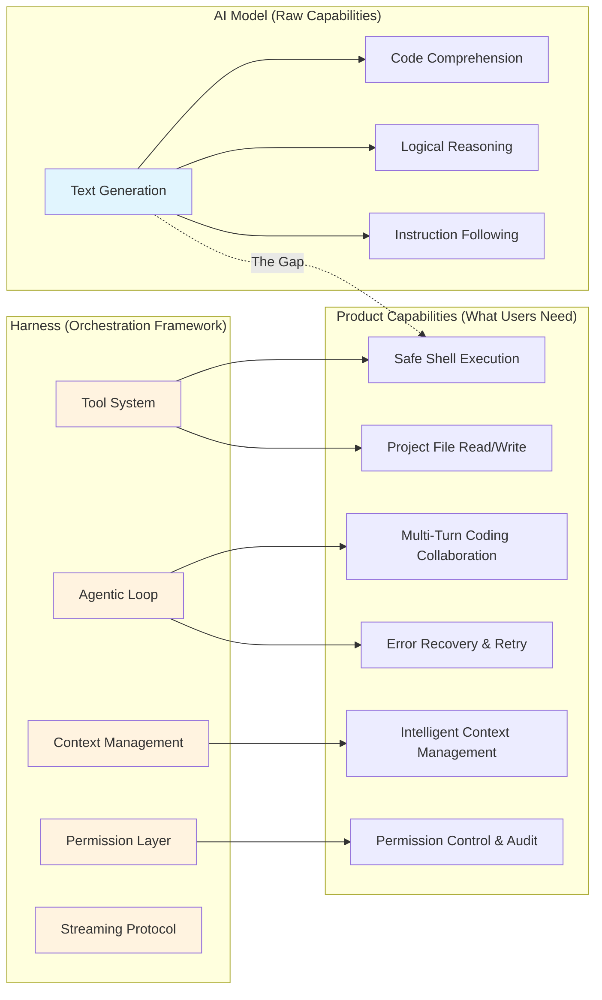
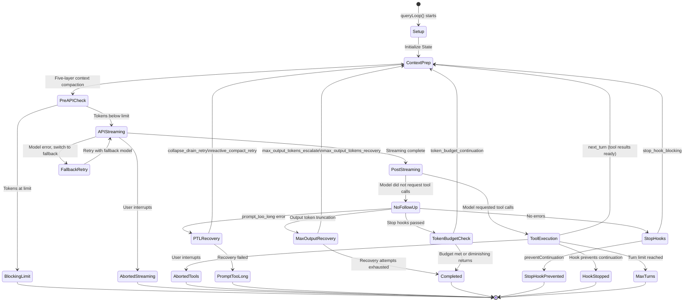
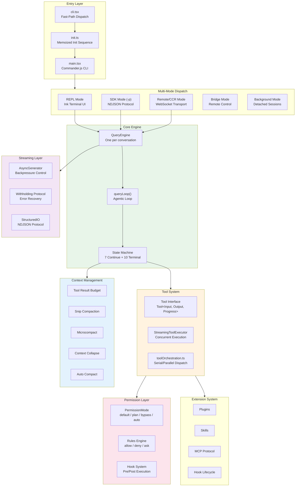

# Chapter 1: What Is an AI Harness?

> **Chapter Summary**
>
> There is a vast gap between what a large language model *can do* in isolation and what it takes to deliver a reliable AI-powered product. A model that generates correct code snippets is not the same as a coding assistant that safely reads files, executes commands, manages multi-turn conversations, and recovers gracefully from errors. The missing piece is not better model weights -- it is an entire engineering framework. This chapter defines the **Harness** as a first-class architectural concept, uses Claude Code -- a production system spanning 513,522 lines of TypeScript across 1,884 source files -- as the canonical case study, lays out the five core responsibilities of a Harness, and provides a roadmap for the rest of the book.

---

## 1.1 The Gap Between Raw Capability and Product Capability

Between 2024 and 2025, the capability frontier of large language models expanded at a dizzying pace. Models can generate compilable code, produce reasonable system architectures, and execute multi-step reasoning chains. Yet when we attempt to translate these "raw capabilities" into shippable developer tools, a series of engineering problems surface immediately:

- **Bounded context**: Context windows have grown to 100K-1M tokens, but a mid-size project's codebase exceeds that easily. Who decides what enters the window?
- **No external agency**: The model itself cannot read or write files, execute shell commands, or call APIs. Who provides these capabilities and enforces their safety boundaries?
- **Single-turn vs. multi-turn**: Coding tasks are inherently multi-step -- read code, understand context, write a patch, run tests, fix errors. Who maintains this loop?
- **Inevitable failures**: Network disconnections, API rate limits, context overflow, tool execution errors. Who implements recovery strategies?
- **Safety**: When an AI gains the ability to execute `rm -rf /`, who guards the perimeter?

Every one of these questions points to the same engineering entity: the **Harness**.

### Raw Capability vs. Product Capability



This gap cannot be closed with "better prompts." It requires a complete software system -- a **Harness**.

---

## 1.2 Defining the Harness

**A Harness is the orchestration framework that transforms an AI model's raw capabilities into a usable product.** It sits between the model API and the end user, assuming every engineering responsibility the model itself cannot fulfill.

The term "Harness" is chosen deliberately over "Framework" or "Agent Runtime." Its etymological meaning is the rigging that directs a horse's raw power of locomotion into controlled, directional force. An AI model possesses raw capabilities of reasoning and generation; the Harness channels them into safe, controllable, reliable product behavior.

The analogy is precise when examined through Claude Code's source. In the `cli.tsx` entry file, the engineering team uses the internal term "Harness-science" to describe their systematic study of the framework itself:

```typescript
// Harness-science L0 ablation baseline. Inlined here (not init.ts) because
// BashTool/AgentTool/PowerShellTool capture DISABLE_BACKGROUND_TASKS into
// module-level consts at import time — init() runs too late. feature() gate
// DCEs this entire block from external builds.
if (feature('ABLATION_BASELINE') && process.env.CLAUDE_CODE_ABLATION_BASELINE) {
  for (const k of [
    'CLAUDE_CODE_SIMPLE',
    'CLAUDE_CODE_DISABLE_THINKING',
    'DISABLE_INTERLEAVED_THINKING',
    'DISABLE_COMPACT',
    'DISABLE_AUTO_COMPACT',
    'CLAUDE_CODE_DISABLE_AUTO_MEMORY',
    'CLAUDE_CODE_DISABLE_BACKGROUND_TASKS',
  ]) {
    process.env[k] ??= '1';
  }
}
```

This code reveals something important: Anthropic's team systematically disables individual Harness layers (Thinking, Compact, Auto Memory, Background Tasks) to quantify the value contribution of each. This is the engineering philosophy of the Harness -- every layer is an independently verified value module.

### What a Harness Is Not

Before proceeding, it is worth defining boundaries:

- **A Harness is not a model.** It does not reason or generate text. It is the runtime container for the model.
- **A Harness is not prompt engineering.** The system prompt is one input to the Harness, but the Harness is far more than that.
- **A Harness is not a simple API wrapper.** A `fetch` call plus JSON parsing does not constitute a Harness. A Harness manages the complete interaction lifecycle.

---

## 1.3 Claude Code: A Canonical Harness Case Study

This book uses Claude Code as its anatomical subject for three reasons.

**First, sufficient scale.** 513,522 lines of TypeScript across 1,884 source files, spanning a CLI engine, tool system, permission framework, streaming protocol, terminal renderer, and extension system. This is not a demo; it is a production system validated by millions of developer interactions.

**Second, sufficient depth.** Claude Code's architecture addresses virtually every core problem a Harness must solve:
- An AsyncGenerator-based streaming Agentic Loop
- A tool execution engine with concurrency control
- A context management system with multi-granularity compaction
- A layered permission control framework
- A polymorphic dispatch system supporting 10 distinct runtime modes

**Third, sufficient engineering precision.** From build-time dead code elimination to memoized initialization sequences, from three-tier AbortController hierarchies to the withholding protocol for recoverable errors, the codebase is dense with advanced systems design decisions.

### Lifecycle of a Request

To understand the Harness's value, the most direct approach is to trace a single user request from input to completion. When you type `"fix this bug"` in your terminal and press Enter, the following is what Claude Code's Harness does:

1. **Input processing**: `processUserInput()` checks for slash commands and parses the input format.
2. **System prompt assembly**: `fetchSystemPromptParts()` collects base prompts, memory prompts, and custom prompts. `asSystemPrompt()` assembles them.
3. **Message management**: The user message is pushed onto the `mutableMessages` array and recorded to the transcript.
4. **Enter the query loop**: `QueryEngine.submitMessage()` delegates to the `query()` function.

Inside the query loop, each iteration executes the following phases:

5. **Context preparation**: Apply tool result budget, snip compaction, microcompact, context collapse, auto-compact -- five compaction layers ensure the context never overflows.
6. **API call**: Stream the request to the Claude API, handling fallback model switching on failure.
7. **Tool execution**: Parse `tool_use` blocks from the model response, verify through the permission system, execute tools concurrently or serially.
8. **Result injection**: Inject tool results into conversation history and return to step 5.

This loop runs until the model considers the task complete, the user interrupts, or a budget/turn limit fires.

---

## 1.4 The Five Core Responsibilities of a Harness

Source code analysis of Claude Code yields five core responsibilities that every non-trivial Harness must address.

### 1.4.1 Tool Orchestration

The model needs the ability to interact with the external world -- reading files, executing commands, searching code. The Harness provides this through a Tool System.

In Claude Code, each tool defines its complete interface through the `Tool` type:

```typescript
export type Tool<
  Input extends AnyObject = AnyObject,
  Output = unknown,
  P extends ToolProgressData = ToolProgressData,
> = {
  readonly name: string
  readonly inputSchema: Input
  call(
    args: z.infer<Input>,
    context: ToolUseContext,
    canUseTool: CanUseToolFn,
    parentMessage: AssistantMessage,
    onProgress?: ToolCallProgress<P>,
  ): Promise<ToolResult<Output>>
  isEnabled(): boolean
  isReadOnly(input: z.infer<Input>): boolean
  isConcurrencySafe(input: z.infer<Input>): boolean
  isDestructive?(input: z.infer<Input>): boolean
  maxResultSizeChars: number
  // ... 20+ additional methods
}
```

Note `isConcurrencySafe` and `isReadOnly`. These are not decorative metadata. The tool execution engine (`StreamingToolExecutor` and `runTools`) relies on these methods to determine execution strategy:

```typescript
// From toolOrchestration.ts
export async function* runTools(
  toolUseMessages: ToolUseBlock[],
  assistantMessages: AssistantMessage[],
  canUseTool: CanUseToolFn,
  toolUseContext: ToolUseContext,
): AsyncGenerator<MessageUpdate, void> {
  let currentContext = toolUseContext
  for (const { isConcurrencySafe, blocks } of partitionToolCalls(
    toolUseMessages, currentContext,
  )) {
    if (isConcurrencySafe) {
      // Execute read-only tools concurrently
      for await (const update of runToolsConcurrently(blocks, ...)) {
        yield { message: update.message, newContext: currentContext }
      }
    } else {
      // Execute side-effecting tools serially
      for await (const update of runToolsSerially(blocks, ...)) {
        if (update.newContext) currentContext = update.newContext
        yield { message: update.message, newContext: currentContext }
      }
    }
  }
}
```

This code illustrates the core value of the Harness: **the model only needs to say "I want to call Grep to search for a pattern." The Harness decides whether to execute concurrently or serially, how to propagate errors, and how to share context between tools.**

### 1.4.2 Permission Control

When AI gains the ability to execute commands, safety becomes the first priority. Claude Code implements a multi-layered permission system:

```typescript
export type ToolPermissionContext = DeepImmutable<{
  mode: PermissionMode            // 'default' | 'plan' | 'bypass' | 'auto'
  alwaysAllowRules: ToolPermissionRulesBySource
  alwaysDenyRules: ToolPermissionRulesBySource
  alwaysAskRules: ToolPermissionRulesBySource
  isBypassPermissionsModeAvailable: boolean
  shouldAvoidPermissionPrompts?: boolean
  awaitAutomatedChecksBeforeDialog?: boolean
  // ...
}>
```

Permission checks happen before every tool invocation. In SDK mode, the permission system even supports **permission racing**: hooks and the SDK host evaluate permission requests concurrently, and the first response wins. This is a deliberate engineering tradeoff -- sacrificing a small amount of determinism for a significant reduction in latency.

### 1.4.3 Context Management

Conversation history grows continuously and eventually exceeds the model's context window. Claude Code implements a five-layer compaction pipeline:

| Layer | Mechanism | Trigger | Strategy |
|-------|-----------|---------|----------|
| 1 | Tool Result Budget | Every iteration | Truncate oversized tool results |
| 2 | Snip Compaction | History too long | Remove intermediate turns |
| 3 | Microcompact | Every iteration | Compress redundant message formats |
| 4 | Context Collapse | Context overflow | Fold completed tool calls |
| 5 | Auto Compact | Tokens near limit | Call model to summarize history |

These five layers execute in sequence on every iteration of the query loop, forming a graduated compaction pipeline. When regular compaction is insufficient to handle a `prompt_too_long` error, **Reactive Compact** serves as the final recovery mechanism.

### 1.4.4 Multi-Turn Conversation Engine

The core loop of the Harness -- the Agentic Loop -- is a state machine managing multi-turn interaction between the model and tools. In Claude Code, this loop is implemented by the `queryLoop()` function:

```typescript
async function* queryLoop(
  params: QueryParams,
  consumedCommandUuids: string[],
): AsyncGenerator<
  StreamEvent | RequestStartEvent | Message | TombstoneMessage | ToolUseSummaryMessage,
  Terminal
>
```

Loop state is managed through an explicit `State` struct:

```typescript
type State = {
  messages: Message[]
  toolUseContext: ToolUseContext
  autoCompactTracking: AutoCompactTrackingState | undefined
  maxOutputTokensRecoveryCount: number
  hasAttemptedReactiveCompact: boolean
  maxOutputTokensOverride: number | undefined
  pendingToolUseSummary: Promise<ToolUseSummaryMessage | null> | undefined
  stopHookActive: boolean | undefined
  turnCount: number
  transition: Continue | undefined
}
```

A critical design decision: **every state transition creates a new State object** (quasi-immutable transitions) rather than mutating the existing one. The `transition` field records *why* the previous iteration continued -- making debugging and logging unambiguous.

The loop has 7 continuation reasons and 10 termination reasons, forming a complete state transition graph:



### 1.4.5 Streaming Interaction

Modern AI products must support streaming output -- users cannot wait 30 seconds for the first character. Claude Code's Harness implements streaming at every layer using AsyncGenerators:

```typescript
// QueryEngine's submitMessage is an AsyncGenerator
async *submitMessage(
  prompt: string | ContentBlockParam[],
  options?: { uuid?: string; isMeta?: boolean },
): AsyncGenerator<SDKMessage, void, unknown>

// query() is also an AsyncGenerator
export async function* query(
  params: QueryParams,
): AsyncGenerator<
  StreamEvent | RequestStartEvent | Message | TombstoneMessage | ToolUseSummaryMessage,
  Terminal
>
```

The use of generators is not merely about streaming. It provides a critical engineering advantage: **backpressure control**. Consumers regulate consumption rate without explicit buffer management.

Equally notable is the **Withholding Protocol**: when a recoverable error occurs, the Harness withholds the error message from the consumer, attempts recovery first, and only forwards the error if recovery fails. This ensures SDK consumers do not prematurely terminate a session due to a transient error.

---

## 1.5 Book Structure and Reading Guide

This book dissects every layer of the Harness from the outside in, macro to micro, using Claude Code's source as the primary text.

### Book Architecture

| Part | Topic | Chapters | Core Questions |
|------|-------|----------|----------------|
| **Part I** | Global View | Ch.1-3 | What is a Harness? What is the architecture? How does the system boot? |
| **Part II** | Core Engine | Ch.4-7 | How does QueryEngine work? How does the Agentic Loop run? How is streaming implemented? How is context managed? |
| **Part III** | Tool System | Ch.8-11 | How is the tool interface designed? How are Bash/Read/Write implemented? How does the execution engine dispatch? How are permissions enforced? |
| **Part IV** | Agent Orchestration | Ch.12-15 | How is a single Agent defined? How are multiple Agents coordinated? How are tasks routed? How does distributed execution work? |
| **Part V** | Terminal Rendering | Ch.16-18 | How does the custom React renderer work? How is Yoga layout integrated? How is the event system designed? |
| **Part VI** | Extension System | Ch.19-22 | Plugins, Skills, MCP, Hooks -- how are the four extension mechanisms designed and implemented? |
| **Part VII** | Infrastructure | Ch.23-25 | How do configuration, session management, and analytics/telemetry support the framework? |
| **Part VIII** | Design Patterns | Ch.26-28 | What reusable Harness design patterns can be extracted from Claude Code? How do you build your own? |

### Reading Recommendations

- **Architects / Tech Leads**: Start from Part I, focus on Part II (Core Engine) and Part VIII (Design Patterns).
- **Systems Engineers**: Parts II and III are the core -- particularly the Agentic Loop and Tool Execution chapters.
- **Security Engineers**: Go directly to Part III Chapter 11 (Permission System) and Part VI Chapter 22 (Hook System).
- **Frontend / Full-Stack Engineers**: Part V on the terminal renderer demonstrates React engineering in a non-standard environment.
- **Developers building their own AI agent systems**: Part VIII is your action plan.

---

## 1.6 Full Architecture Overview

The following diagram presents Claude Code as a complete Harness. Subsequent chapters will drill into each module layer by layer.



---

## 1.7 Summary

This chapter establishes a core insight: **productizing an AI model is not a prompt engineering problem -- it is a systems engineering problem.** The Harness is the framework that solves it. Its core responsibilities are tool orchestration, permission control, context management, the multi-turn conversation engine, and streaming interaction.

Claude Code is one of the most complex publicly analyzable Harness implementations available today. Its 513,522 lines of code are not over-engineering -- each line answers a specific engineering question about how to build a reliable bridge between a model's raw capabilities and a user's product expectations.

Starting with the next chapter, we go inside that bridge.
