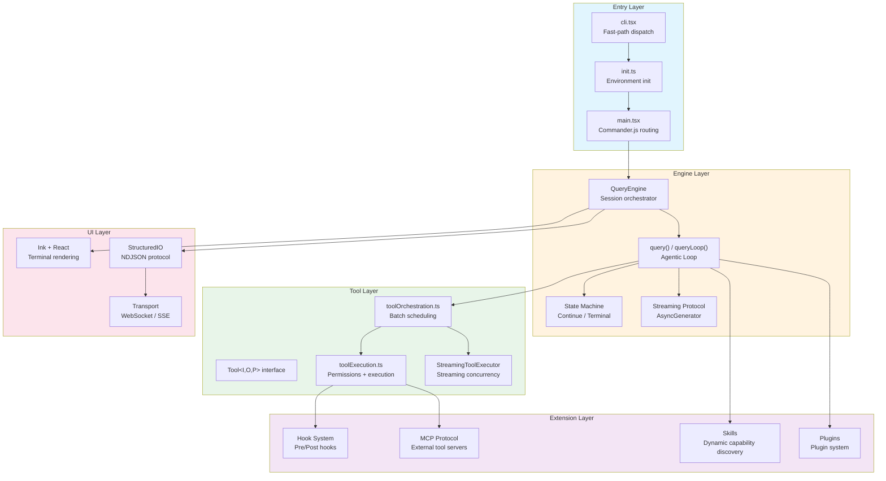
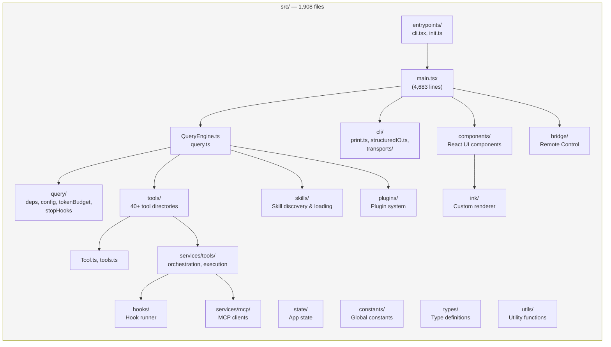

# Chapter 2: Architecture Bird's Eye View

> 513,522 lines of TypeScript. 1,908 files. What does the internal structure of a production-grade AI agent orchestration framework actually look like?

This chapter provides a macroscopic view of Claude Code's complete architecture. We will dissect the five-layer architecture, trace the core data flow, examine key design decisions, map the directory structure, and survey the technology stack. By the end, you should hold a spatial model of the entire system in your mind -- one that every subsequent chapter will expand upon.

---

## 2.1 Five-Layer Architecture

Claude Code's codebase follows a clean layered design. From the outside in, we can identify five distinct layers: **Entry Layer**, **Engine Layer**, **Tool Layer**, **UI Layer**, and **Extension Layer**.



### Entry Layer

The Entry Layer's core responsibility is **fast-path dispatch**. `cli.tsx` is the outermost entrypoint. It evaluates a priority-ordered dispatch table against CLI arguments, routing requests to the appropriate subsystem -- most paths never need to load the full CLI module graph.

Key design points:

- **All imports are dynamic** (`await import(...)`) to avoid loading unnecessary modules
- The `feature()` function from `bun:bundle` enables **build-time dead code elimination (DCE)** -- disabled feature flags cause their guarded code blocks to be physically removed from the compiled output, resulting in zero bytes
- `startCapturingEarlyInput()` begins buffering stdin keystrokes before the full CLI loads, so nothing typed during startup is lost
- `init.ts` is `memoize`d to run exactly once, overlapping network preconnection (`preconnectAnthropicApi()`) with module loading, saving approximately 100-200ms

The Entry Layer supports 10+ execution modes:

| Mode | Entry | I/O | Typical Use Case |
|------|-------|-----|------------------|
| **REPL** (interactive) | `claude` | Ink terminal UI | Developer workstation |
| **SDK / Headless** | `claude -p "prompt"` | stdin/stdout NDJSON | Agent SDK, CI/CD |
| **Remote / CCR** | `CLAUDE_CODE_REMOTE=true` | WebSocket/SSE | Cloud-hosted sessions |
| **Bridge** | `claude remote-control` | HTTP polling + child spawning | Remote Control host |
| **Background** | `claude --bg` | Detached session registry | Non-blocking tasks |
| **Server** | `--direct-connect-server-url` | WebSocket | Direct-connect server |

### Engine Layer

The Engine Layer is the heart of the system. `QueryEngine` is the session-level orchestrator -- **one instance per conversation**. Its internal `queryLoop()` implements the Agentic Loop: a `while(true)` loop that drives the core cycle of "API call -> tool execution -> context management -> next turn."

Two key abstractions define the Engine Layer:

1. **AsyncGenerator streaming protocol** -- Both `submitMessage()` and `query()` are `AsyncGenerator` functions. They push messages via `yield`, providing native support for streaming and backpressure.
2. **Explicit state machine** -- Each loop iteration is driven by a `State` struct. All transitions are tagged with `Continue` (reason for continuing) or `Terminal` (reason for stopping) discriminated union types.

### Tool Layer

The Tool Layer defines the boundary between the AI and the external world. Every tool -- built-in, MCP-provided, or dynamically loaded -- must implement the same `Tool<Input, Output, Progress>` interface. This interface comprises 40+ methods covering identity, schema definition, core execution, permission checking, behavioral declarations, result handling, and UI rendering.

Tool execution is coordinated by `toolOrchestration.ts`, which employs a **partitioned concurrency model**:

- Consecutive concurrency-safe tools (e.g., Read, Glob, Grep) are merged into a single batch and executed in parallel
- Non-concurrency-safe tools (e.g., Edit, Write) execute exclusively, preserving order
- The default concurrency limit is 10

### UI Layer

The UI Layer provides two fundamentally different rendering paths:

1. **Interactive mode** -- A terminal UI built on React + Ink + Yoga, supporting Flexbox layout, differential updates, and keyboard events
2. **Headless mode** -- An NDJSON protocol implemented via `StructuredIO`, supporting SDK integration, permission request/response flows, and control messages

The transport abstraction supports three communication protocols: WebSocket (low-latency bidirectional), SSE (low-latency read via GET + reliable write via HTTP POST), and Hybrid (WebSocket for reads + HTTP POST for writes).

### Extension Layer

The Extension Layer provides four mechanisms for extending the system's capabilities:

1. **Hook System** -- Pre/Post hooks that can intercept, modify, or prevent tool execution
2. **MCP Protocol** -- Model Context Protocol for connecting external tool servers
3. **Skills** -- Dynamic capability discovery and loading, extending agent abilities on demand
4. **Plugins** -- A plugin system serving as the third-party extension surface

---

## 2.2 Core Data Flow

With the five-layer architecture established, let us trace a complete user request through the system.

```mermaid
sequenceDiagram
    participant User
    participant Entry as Entry Layer
    participant Engine as QueryEngine
    participant Loop as queryLoop()
    participant API as Claude API
    participant Tools as Tool Executor
    participant UI as UI Layer

    User->>Entry: Input text/command
    Entry->>Engine: submitMessage(prompt)

    Note over Engine: 1. Destructure config
    Note over Engine: 2. Assemble System Prompt
    Note over Engine: 3. Process user input<br/>(slash commands)
    Note over Engine: 4. Load Skills & Plugins

    Engine->>Loop: yield* query(params)

    loop Agentic Loop
        Note over Loop: Phase 1: Context management<br/>Snip / Microcompact /<br/>Context Collapse / Autocompact

        Loop->>API: callModel(messages, tools, system)
        API-->>Loop: stream events (AsyncGenerator)
        Loop-->>UI: yield stream_event / assistant

        alt No tool calls
            Note over Loop: Stop Hooks check
            Note over Loop: Token Budget check
            Loop-->>Engine: return Terminal{completed}
        else Tool calls present
            Loop->>Tools: runTools() / StreamingToolExecutor
            Note over Tools: 1. Partition: concurrent vs serial
            Note over Tools: 2. Permission check (Hooks + canUseTool)
            Note over Tools: 3. Execute tool.call()
            Note over Tools: 4. Result budget enforcement
            Tools-->>Loop: yield MessageUpdate
            Loop-->>UI: yield progress / tool_result
            Note over Loop: continue with next_turn
        end
    end

    Engine-->>UI: yield result{success/error}
    UI-->>User: Render final result
```

### Phase 1: System Prompt Assembly

Each `submitMessage()` call triggers a fresh assembly of the system prompt. This is not simple string concatenation -- it is a multi-source, priority-ordered prompt assembly pipeline:

1. **Base system prompt** -- Defines the agent's core behavior and constraints
2. **User context** -- Environmental information: OS, working directory, git status, etc.
3. **Memory prompt** -- Project and user memory loaded from the CLAUDE.md file chain
4. **Appended prompt** -- Additional instructions injected by SDK callers
5. **Tool descriptions** -- Output from each available tool's `prompt()` method

This design ensures **prompt cache stability** -- built-in tools are sorted by name to form a stable prefix, while MCP tools are appended as a separate partition. When the tool set changes, the prefix remains unchanged, maximizing cache hit rates.

### Phase 2: Streaming API Call

`queryLoop()` issues a streaming request to the Claude API via `callModel()`. The response arrives as an `AsyncGenerator`, delivering events one at a time. During streaming, the engine simultaneously performs:

- **Tool use block backfill** -- When a `tool_use` block's input is complete, it is immediately handed to `StreamingToolExecutor` to begin execution
- **Error withholding** -- 413 (Prompt Too Long) and Max Output Tokens errors are not immediately exposed to consumers; recovery is attempted first
- **Fallback model switching** -- If the primary model fails, the engine transparently switches to a fallback model and retries

### Phase 3: Tool Execution

Tool execution follows a strict six-phase pipeline:

```
Input Validation -> Input Preparation -> Pre-Tool Hooks -> Permission Resolution -> Tool Execution -> Post-Tool Hooks
```

**Permission Resolution** is the most complex phase in this pipeline. It must coordinate decisions from three sources:

1. Static permission rules (allow/deny/ask rule sets)
2. Hook-returned permission results
3. Interactive authorization from the SDK host

In SDK mode, hook and SDK host permission checks are raced via `Promise.race` -- whichever returns first wins, and the other is cancelled.

### Phase 4: Context Management

As multi-turn conversations progress, context length grows continuously. The engine maintains a multi-tier compaction strategy, ordered by increasing aggressiveness:

1. **Microcompact** -- Compresses old tool results, reducing redundant detail
2. **Snip Compaction** -- Cuts intermediate segments from history, preserving head and tail
3. **Context Collapse** -- Folds large content blocks into summaries
4. **Autocompact** -- Automatically triggers full compaction, emitting a compact boundary
5. **Reactive Compact** -- Emergency recovery from 413 errors

### Phase 5: State Transitions

Each loop iteration ends with either a `Continue` or `Terminal` tag. These are not ad-hoc break/continue statements -- every transition point is explicitly labeled with its reason:

| Continue Reason | Trigger Condition |
|---|---|
| `next_turn` | Tool results ready, API needs to process them |
| `collapse_drain_retry` | 413 error, retrying after context collapse drain |
| `reactive_compact_retry` | 413/media error, retrying after emergency compaction |
| `max_output_tokens_escalate` | Output truncated, retrying at 64k token limit |
| `token_budget_continuation` | Token budget below 90%, injecting continuation nudge |

| Terminal Reason | Trigger Condition |
|---|---|
| `completed` | Model finished with no tool calls and no hooks blocking |
| `aborted_streaming` | AbortController fired during streaming |
| `prompt_too_long` | 413 error with no recovery available |
| `max_turns` | Turn count exceeded limit |
| `stop_hook_prevented` | Stop hook explicitly prevented continuation |

---

## 2.3 Key Design Decisions

### Decision 1: Generator-Based Streaming

Claude Code uses `AsyncGenerator` for virtually every scenario requiring streaming:

```typescript
// QueryEngine.submitMessage -- session entry point
async *submitMessage(prompt): AsyncGenerator<SDKMessage>

// query() -- Agentic Loop
async function* query(params): AsyncGenerator<StreamEvent | Message, Terminal>

// runTools() -- tool execution
async function* runTools(blocks): AsyncGenerator<MessageUpdate>
```

**Why generators over EventEmitter or Observable?**

1. **Backpressure is built in** -- When the consumer does not call `next()`, the producer automatically pauses. There is no risk of memory overflow from unconsumed events.
2. **`yield*` enables transparent protocol forwarding** -- `query()`'s output passes directly through `submitMessage()` to the SDK consumer via `yield*`, requiring no manual forwarding logic.
3. **`return` values carry termination semantics** -- The generator's `return` type is `Terminal`, explicitly marking why the loop ended.
4. **Cancellation composes with AbortController** -- Generators integrate with `AbortController`; calling `.return()` provides clean exit semantics.

This choice profoundly shapes the entire codebase. You will see the same generator pattern in the Tool Executor, Hook Runner, Compact Pipeline, and throughout.

### Decision 2: Plugin Architecture and the Tool System

The tool system's core design principle is **fail-closed defaults**:

```typescript
const TOOL_DEFAULTS = {
  isConcurrencySafe: () => false,  // Assume unsafe -> serial execution
  isReadOnly: () => false,          // Assume writes -> requires permission
  isDestructive: () => false,
  checkPermissions: (input) => Promise.resolve({ behavior: 'allow', updatedInput: input }),
}
```

A tool that forgets to declare `isConcurrencySafe` is treated as serial-only -- this prevents tools with side effects from being accidentally run in parallel. A tool that forgets to declare `isReadOnly` is treated as a write operation -- this ensures the permission system never misses a check.

The `buildTool()` factory function merges the author's concise definition (`ToolDef`) with these safe defaults to produce a complete `Tool` object. TypeScript's mapped types ensure that compile-time types match the runtime spread order.

### Decision 3: Feature Gates + Dead Code Elimination

Claude Code uses Bun's `feature()` macro for build-time feature gating:

```typescript
import { feature } from 'bun:bundle';

if (feature('BRIDGE_MODE') && args[0] === 'remote-control') {
  const { bridgeMain } = await import('../bridge/bridgeMain.js');
  await bridgeMain(args.slice(1));
  return;
}
// When BRIDGE_MODE=false, this entire block is removed at compile time
```

The codebase contains 30+ feature flags, spanning everything from the Bridge system to Voice mode. This mechanism delivers three key advantages:

1. **Bundle size control** -- External release builds contain no internal experimental code, with zero runtime overhead
2. **Security boundary** -- Unreleased feature code paths are physically removed at compile time and cannot be activated via environment variables
3. **Progressive rollout** -- Feature flags can be gradually enabled per user cohort via GrowthBook

Beyond `feature()`, runtime gating uses additional mechanisms: `process.env.USER_TYPE` (distinguishing internal/external users), `isEnvTruthy()` (environment variable checks), and GrowthBook remote configuration.

---

## 2.4 Codebase Structure Guide



### Directory Reference

```
src/
├── entrypoints/             # Entry Layer
│   ├── cli.tsx              # Outermost entrypoint, fast-path dispatch table (302 lines)
│   └── init.ts              # Environment initialization, memoized, runs once (341 lines)
│
├── main.tsx                 # Full Commander.js routing (4,683 lines)
│                            # 200+ module imports, side-effect optimizations for startup
│
├── QueryEngine.ts           # Session orchestrator, one instance per conversation
├── query.ts                 # Agentic Loop's while(true) implementation
├── query/                   # Loop helper modules
│   ├── deps.ts              # Dependency injection: callModel, autocompact, uuid
│   ├── config.ts            # Immutable query config snapshot
│   ├── tokenBudget.ts       # Token budget tracking and continuation decisions
│   └── stopHooks.ts         # Stop hook execution logic
│
├── Tool.ts                  # Tool<I,O,P> interface definition (single file, core contract)
├── tools.ts                 # Tool registry: getAllBaseTools(), getTools()
├── tools/                   # 40+ tool implementations
│   ├── BashTool/            # Shell command execution
│   ├── FileReadTool/        # File reading
│   ├── FileEditTool/        # File editing (exact string replacement)
│   ├── FileWriteTool/       # File writing
│   ├── GlobTool/            # File name pattern matching
│   ├── GrepTool/            # Content search (ripgrep-based)
│   ├── AgentTool/           # Subagent spawning
│   ├── WebFetchTool/        # HTTP requests
│   ├── SkillTool/           # Skill invocation
│   ├── ToolSearchTool/      # Deferred tool search
│   └── ...                  # NotebookEdit, TodoWrite, WebSearch, etc.
│
├── services/
│   └── tools/
│       ├── toolOrchestration.ts   # Batch partitioning and concurrent scheduling
│       ├── toolExecution.ts       # Permission checking + single tool execution (~600 lines)
│       └── StreamingToolExecutor.ts # Streaming concurrent executor
│
├── cli/                     # CLI layer
│   ├── print.ts             # Headless/SDK execution path (5,594 lines, largest file)
│   ├── structuredIO.ts      # NDJSON protocol implementation (860 lines)
│   ├── remoteIO.ts          # Remote/CCR transport layer
│   └── transports/          # Transport protocol implementations
│       ├── Transport.ts     # Transport interface
│       ├── WebSocketTransport.ts   # WebSocket (with reconnection)
│       ├── SSETransport.ts         # Server-Sent Events
│       └── HybridTransport.ts      # WebSocket reads + HTTP POST writes
│
├── components/              # React components (Ink rendering)
├── ink/                     # Custom Ink renderer
├── screens/                 # Page-level components
│
├── hooks/                   # Hook runner and event system
├── skills/                  # Skill discovery, loading, search
├── plugins/                 # Plugin system
├── bridge/                  # Remote Control bridge system
├── coordinator/             # Multi-agent coordination mode
├── tasks/                   # Task management system
│
├── state/                   # Application state management
├── constants/               # Global constants (toolLimits, etc.)
├── types/                   # TypeScript type definitions
├── utils/                   # General utility functions
├── migrations/              # Configuration migration system (current version 11)
├── schemas/                 # Zod schema definitions
├── context/                 # Context management and compaction
└── upstreamproxy/           # CCR upstream proxy
```

### Notable Numbers

| File | Lines | Role |
|------|-------|------|
| `cli/print.ts` | 5,594 | Headless/SDK orchestration, largest single file |
| `main.tsx` | 4,683 | Commander.js routing and full startup |
| `services/tools/toolExecution.ts` | ~600 | Tool execution core pipeline |
| `cli/structuredIO.ts` | 860 | NDJSON protocol and permission racing |
| `entrypoints/cli.tsx` | 302 | Fast-path dispatch (thinnest entrypoint) |
| `entrypoints/init.ts` | 341 | Memoized initialization sequence |

---

## 2.5 Technology Stack

### Runtime and Language

**TypeScript + Bun** forms the project's foundation. Choosing Bun over Node.js enables several critical capabilities:

- **`bun:bundle`'s `feature()` macro** -- Build-time dead code elimination, the cornerstone of the feature gate system
- **Native WebSocket** -- Bun's built-in WebSocket support avoids the overhead of the `ws` npm package (Node.js environments still fall back to `ws` via conditional import)
- **Faster cold start** -- For a CLI tool, startup performance is essential

```typescript
// Runtime detection and compatibility
if (typeof Bun !== 'undefined') {
  // Bun's native WebSocket with proxy and TLS options
  const ws = new globalThis.WebSocket(url, { headers, proxy, tls });
} else {
  // Node.js fallback to ws package
  const { default: WS } = await import('ws');
  const ws = new WS(url, { headers, agent, ...tlsOptions });
}
```

### Terminal UI

**React + Ink + Yoga** compose the terminal UI rendering stack:

- **React** -- Component-based UI with declarative state management
- **Ink** -- Renders React components to the terminal (TTY), supporting Flexbox layout
- **Yoga** -- Facebook's cross-platform layout engine, providing Flexbox calculation for Ink

This combination allows the terminal UI to leverage components, state, hooks, and the broader React ecosystem, just like a web application. Claude Code also maintains a custom rendering layer in `ink/` to handle differential updates and terminal-specific behavior.

### Schema Validation

**Zod** is the sole schema validation library, used for:

- Tool input validation (`Tool.inputSchema` is a Zod schema)
- Configuration validation
- API response validation
- Feature flag configuration validation

### CLI Framework

**Commander.js** handles command-line argument parsing and subcommand routing. `main.tsx` uses Commander to define the complete command tree, including `--version`, `--print`, `update`, `daemon`, and dozens of other subcommands.

### Build and Bundling

| Tool | Purpose |
|------|---------|
| **Bun bundler** | Bundling, DCE, feature flag expansion |
| **TypeScript** | Type checking (but `tsc` is not used for compilation) |
| **Zod** | Runtime schema validation |
| **Commander.js** | CLI argument parsing |

### Observability

- **OpenTelemetry** -- Distributed tracing, lazy-loaded (~400KB protobuf + ~700KB gRPC)
- **GrowthBook** -- Feature flag remote configuration and A/B testing
- **Custom startup profiler** -- `profileCheckpoint()` tracks timing for every startup phase

### Dependency Injection

The Engine Layer uses **explicit DI** rather than a framework:

```typescript
export type QueryDeps = {
  callModel: typeof queryModelWithStreaming
  microcompact: typeof microcompactMessages
  autocompact: typeof autoCompactIfNeeded
  uuid: () => string
}
```

Test code passes mock implementations directly, with no need for `spyOn` or module patching. The `typeof fn` type signatures ensure that mocks automatically stay in sync with their real implementations.

---

## 2.6 Chapter Summary

Claude Code's architecture can be summarized in a single sentence: **a streaming Agentic Loop built on AsyncGenerator, running within a five-layer TypeScript codebase, trimmed at build time via feature gates, and extended at runtime through four mechanisms -- Plugins, Hooks, MCP, and Skills.**

Key takeaways:

1. **Clean layering** -- Entry, Engine, Tool, UI, and Extension layers have clear responsibilities with top-down dependency flow.
2. **Generators throughout the stack** -- From `submitMessage()` to `runTools()`, AsyncGenerator is the single streaming primitive.
3. **Safe defaults** -- The tool system is fail-closed; omitted declarations default to the most conservative assumption.
4. **Compile-time trimming** -- `feature()` + DCE ensures external builds contain no experimental code.
5. **Multi-mode adaptation** -- The same Engine adapts to REPL, SDK, and Remote scenarios through different I/O layers.

Starting with the next chapter, we will dive into each layer's implementation details. Chapter 3 will begin by dissecting the bootstrap sequence -- from the first line of `cli.tsx` to the REPL rendering its first frame, everything that happens along the way.
