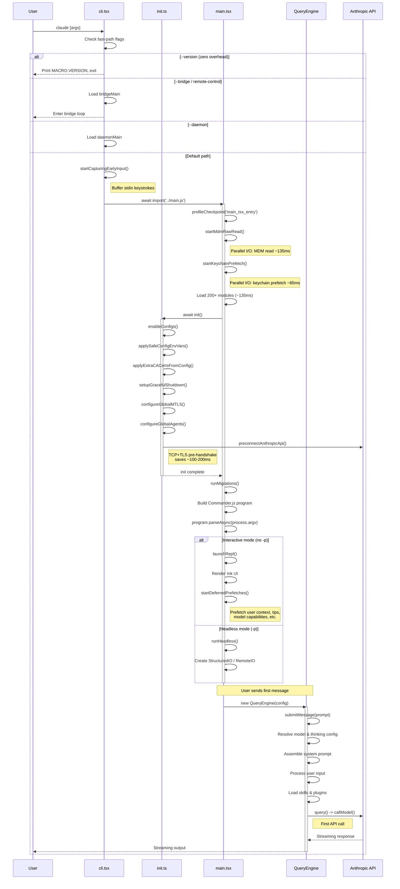

# Chapter 3: Bootstrap & Lifecycle

> From the moment a user types `claude` to the instant the first API call leaves the process, Claude Code traverses a carefully orchestrated startup chain. Each layer balances two competing demands: respond to the user as fast as possible, while completing every initialization task a distributed system requires. This chapter dissects that chain layer by layer, analyzing the performance optimization strategies and engineering tradeoffs at each stage.

## 3.1 The Startup Chain at a Glance

When a user types `claude` and presses Enter, the system passes through three files in sequence:

```
cli.tsx  -->  init.ts  -->  main.tsx  -->  QueryEngine
```

The governing design principle is **progressive loading**: each layer imports only what the current stage requires, deferring heavyweight dependencies to the latest possible moment. This is not ad-hoc lazy loading -- it is a precisely measured, layered strategy where every phase boundary is instrumented with `profileCheckpoint()` calls, ensuring that any startup time regression is detected immediately.

Let us follow this chain, layer by layer.

## 3.2 cli.tsx -- Fast-Path Dispatch

**File:** `src/entrypoints/cli.tsx` (302 lines)

`cli.tsx` is the outermost entry point of the entire system. Its core design idea can be captured in two words: **fast-path dispatch**. Before loading the full CLI, it checks for special flags and subcommands that can execute and exit immediately, avoiding the loading of any unnecessary modules.

### 3.2.1 Top-Level Side Effects

Three blocks of side-effect code execute before any function call at the top of the file:

```typescript
import { feature } from 'bun:bundle';

// 1. Disable corepack auto-pinning
process.env.COREPACK_ENABLE_AUTO_PIN = '0';

// 2. Set max heap for CCR containers (16GB machines)
if (process.env.CLAUDE_CODE_REMOTE === 'true') {
  process.env.NODE_OPTIONS = existing
    ? `${existing} --max-old-space-size=8192`
    : '--max-old-space-size=8192';
}

// 3. Ablation baseline: feature-gated DCE block
if (feature('ABLATION_BASELINE') && process.env.CLAUDE_CODE_ABLATION_BASELINE) {
  for (const k of [
    'CLAUDE_CODE_SIMPLE',
    'CLAUDE_CODE_DISABLE_THINKING',
    'DISABLE_INTERLEAVED_THINKING',
    // ... more environment variables
  ]) {
    process.env[k] ??= '1';
  }
}
```

The `feature()` function comes from `bun:bundle` and acts as a **compile-time macro**. When the Bun bundler builds the production artifact, it replaces `feature('X')` with `true` or `false` based on feature flag configuration, then eliminates dead branches through dead code elimination (DCE). This means that in the externally published build, code blocks guarded by disabled features occupy **exactly zero bytes** in the output.

### 3.2.2 The Fast-Path Dispatch Table

The `main()` function implements a priority-ordered dispatch table. This table is the key to understanding Claude Code's startup behavior:

| Priority | Condition | Action | Modules Loaded |
|----------|-----------|--------|----------------|
| 1 | `--version` / `-v` | Print `MACRO.VERSION` and exit | Zero |
| 2 | `--dump-system-prompt` | Render system prompt, exit | config, model, prompts |
| 3 | `--claude-in-chrome-mcp` | Run Chrome MCP server | claudeInChrome/mcpServer |
| 4 | `--chrome-native-host` | Run Chrome native host | claudeInChrome/chromeNativeHost |
| 5 | `--computer-use-mcp` | Run computer-use MCP server | computerUse/mcpServer |
| 6 | `--daemon-worker` | Run daemon worker | daemon/workerRegistry |
| 7 | `remote-control` / `rc` / `bridge` | Bridge mode main loop | bridge/bridgeMain |
| 8 | `daemon` | Daemon supervisor | daemon/main |
| 9 | `ps` / `logs` / `attach` / `kill` / `--bg` | Background session mgmt | cli/bg |
| 10 | `new` / `list` / `reply` | Template jobs | cli/handlers/templateJobs |
| 11 | `environment-runner` | BYOC runner | environment-runner/main |
| 12 | `self-hosted-runner` | Self-hosted runner | self-hosted-runner/main |
| 13 | `--tmux` + `--worktree` | Tmux worktree execution | utils/worktree |
| 14 | `--update` / `--upgrade` | Rewrite to `update` subcommand | (argv rewrite) |
| 15 | `--bare` | Set SIMPLE env early | (env var) |
| **DEFAULT** | None of the above | Load full CLI | Everything |

This table reveals a critical design decision: **`--version` costs zero**. It imports no modules, initializes no subsystems -- the version string `MACRO.VERSION` is inlined as a string constant at compile time. This makes `claude --version` a near-instantaneous operation, which matters particularly in CI/CD environments where version checks may execute on every build.

### 3.2.3 The Default Path -- Entering the Full CLI

When no fast path matches, execution enters the default path:

```typescript
// No special flags detected, load and run the full CLI
const { startCapturingEarlyInput } = await import('../utils/earlyInput.js');
startCapturingEarlyInput();
profileCheckpoint('cli_before_main_import');
const { main: cliMain } = await import('../main.js');
profileCheckpoint('cli_after_main_import');
await cliMain();
profileCheckpoint('cli_after_main_complete');
```

Three design points deserve attention here:

1. **All imports are dynamic** (`await import(...)`), preventing unnecessary modules from loading on fast paths.
2. **`startCapturingEarlyInput()`** begins buffering stdin keystrokes before the full CLI loads. Anything the user types during startup is captured and replayed once the REPL is ready -- no keystrokes are lost.
3. **`profileCheckpoint()`** from the `startupProfiler` module instruments every phase boundary for performance monitoring.

## 3.3 init.ts -- The Initialization Sequence

**File:** `src/entrypoints/init.ts` (341 lines)

`init()` is the first function called after `cli.tsx` enters `main.tsx`. It is wrapped with `memoize`, guaranteeing it **runs exactly once regardless of how many times it is called**. Its responsibility is to complete all environment setup that must be in place before the REPL renders.

```typescript
export const init = memoize(async (): Promise<void> => {
  // Phase 1: Configuration
  enableConfigs();
  applySafeConfigEnvironmentVariables();
  applyExtraCACertsFromConfig();  // Must precede any TLS (Bun caches TLS at boot)

  // Phase 2: Shutdown & Cleanup
  setupGracefulShutdown();

  // Phase 3: Analytics (fire-and-forget)
  void Promise.all([
    import('../services/analytics/firstPartyEventLogger.js'),
    import('../services/analytics/growthbook.js'),
  ]).then(([fp, gb]) => {
    fp.initialize1PEventLogging();
    gb.onGrowthBookRefresh(() => {
      void fp.reinitialize1PEventLoggingIfConfigChanged();
    });
  });

  // Phase 4: Auth & Remote Settings
  void populateOAuthAccountInfoIfNeeded();
  void initJetBrainsDetection();
  void detectCurrentRepository();
  if (isEligibleForRemoteManagedSettings()) {
    initializeRemoteManagedSettingsLoadingPromise();
  }
  if (isPolicyLimitsEligible()) {
    initializePolicyLimitsLoadingPromise();
  }

  // Phase 5: Network
  configureGlobalMTLS();
  configureGlobalAgents();    // Proxy setup
  preconnectAnthropicApi();   // TCP+TLS handshake overlap (~100-200ms)

  // Phase 6: CCR Upstream Proxy (conditional)
  if (isEnvTruthy(process.env.CLAUDE_CODE_REMOTE)) {
    const { initUpstreamProxy, getUpstreamProxyEnv } = await import(
      '../upstreamproxy/upstreamproxy.js'
    );
    const { registerUpstreamProxyEnvFn } = await import(
      '../utils/subprocessEnv.js'
    );
    registerUpstreamProxyEnvFn(getUpstreamProxyEnv);
    await initUpstreamProxy();
  }

  // Phase 7: Platform-specific
  setShellIfWindows();
  registerCleanup(shutdownLspServerManager);

  // Phase 8: Scratchpad
  if (isScratchpadEnabled()) {
    await ensureScratchpadDir();
  }
});
```

### 3.3.1 The Orchestration Logic of Eight Phases

The ordering of these eight phases is not arbitrary. Strict dependency relationships govern their sequence:

**Phase 1 (Configuration)** must run first because every subsequent phase depends on configuration values. Pay particular attention to `applyExtraCACertsFromConfig()` -- it must execute before any TLS connection is established, because the Bun runtime caches the certificate chain on the first TLS handshake, and subsequent changes have no effect.

**Phase 2 (Shutdown)** registers immediately after configuration, ensuring that even if subsequent phases crash, cleanup logic is already in place.

**Phase 3 (Analytics)** uses `void` expressions to launch Promises without awaiting their results -- this is the fire-and-forget pattern. Analytics initialization latency must not block user interaction.

**Phase 4 (Auth)** likewise uses fire-and-forget. OAuth info population, JetBrains detection, and repository detection all proceed in the background concurrently.

**Phase 5 (Network)** contains the most critical performance optimization. `preconnectAnthropicApi()` begins the TCP + TLS handshake while the full CLI is still loading. This preconnection runs in parallel with subsequent module loading, saving approximately 100-200ms of network latency.

**Phase 6 (CCR Proxy)** executes only in the remote container environment. Note the use of `await` here -- upstream proxy initialization is blocking because all subsequent network requests must route through it.

**Phase 7 & 8** handle platform compatibility and optional features.

### 3.3.2 Post-Trust Telemetry Initialization

Telemetry is not initialized inside `init()` -- it is deferred until after trust has been established:

```typescript
export function initializeTelemetryAfterTrust(): void {
  if (isEligibleForRemoteManagedSettings()) {
    void waitForRemoteManagedSettingsToLoad()
      .then(async () => {
        applyConfigEnvironmentVariables();  // Full env vars only after trust
        await doInitializeTelemetry();
      });
  } else {
    void doInitializeTelemetry();
  }
}
```

This design distinguishes between "safe" and "full" environment variables. Before the user confirms trust in the project configuration, only a safe subset is applied. This constitutes a security boundary: malicious project configurations must not affect system behavior before user consent.

## 3.4 main.tsx -- The Heart of the Full CLI

**File:** `src/main.tsx` (4,683 lines)

`main.tsx` is the central file of the entire CLI. It begins with three **performance-critical side-effect** statements that must execute before regular imports:

```typescript
// Side-effect #1: startup profiler mark
profileCheckpoint('main_tsx_entry');

// Side-effect #2: Start MDM subprocess reads in parallel with imports (~135ms)
startMdmRawRead();

// Side-effect #3: Prefetch macOS keychain reads (~65ms saving)
startKeychainPrefetch();
```

The purpose of these three statements is to **overlap I/O with module loading**. `main.tsx` proceeds to import 200+ modules, taking approximately 135ms. During that time, MDM configuration reads and macOS keychain prefetches are already running in the background, effectively hiding their latency behind module load time.

### 3.4.1 The Migration System

`main.tsx` contains a versioned migration system:

```typescript
const CURRENT_MIGRATION_VERSION = 11;
function runMigrations(): void {
  if (getGlobalConfig().migrationVersion !== CURRENT_MIGRATION_VERSION) {
    migrateAutoUpdatesToSettings();
    migrateBypassPermissionsAcceptedToSettings();
    migrateEnableAllProjectMcpServersToSettings();
    resetProToOpusDefault();
    migrateSonnet1mToSonnet45();
    migrateLegacyOpusToCurrent();
    migrateSonnet45ToSonnet46();
    migrateOpusToOpus1m();
    migrateReplBridgeEnabledToRemoteControlAtStartup();
    // ... conditional migrations
    saveGlobalConfig(prev => ({
      ...prev,
      migrationVersion: CURRENT_MIGRATION_VERSION,
    }));
  }
}
```

The migration pattern is worth noting: it uses a single monotonically increasing version number `CURRENT_MIGRATION_VERSION` as a guard condition, and all migration functions are **idempotent** -- even if a migration ran in a previous version, re-executing it produces no side effects. This simplifies the logic for version-skip upgrades.

### 3.4.2 Commander.js Program Construction

The core responsibility of `main()` is to build the Commander.js CLI program and execute argument parsing:

```typescript
export async function main(): Promise<CommanderCommand> {
  // ... builds Commander.js program with all subcommands and options
  // ... executes program.parseAsync(process.argv)
}
```

The parse result determines whether the system enters interactive mode or headless mode:

- **Interactive mode** (no `-p` flag): calls `launchRepl()`, rendering the Ink terminal UI
- **Headless mode** (`-p` flag): calls `runHeadless()`, communicating via the NDJSON protocol

### 3.4.3 Deferred Prefetches

After the first render completes, the system launches a series of deferred prefetch operations:

```typescript
export function startDeferredPrefetches(): void {
  if (isEnvTruthy(process.env.CLAUDE_CODE_EXIT_AFTER_FIRST_RENDER) || isBareMode()) {
    return;  // Skip for benchmarks and scripted -p calls
  }
  // ... initUser, getUserContext, tips, countFiles, modelCapabilities, etc.
}
```

The key design decision: prefetches are deferred until after first render, preventing them from competing with the critical startup path for CPU and I/O resources. Benchmark mode and scripted calls skip these prefetches entirely, ensuring measurement purity.

## 3.5 QueryEngine Initialization -- From CLI to API Call

The final link in the startup chain is the creation of a `QueryEngine` and the first `submitMessage()` call. This is the bridge from "CLI startup" to "first API call."

### 3.5.1 The QueryEngine Configuration Surface

```typescript
export type QueryEngineConfig = {
  cwd: string
  tools: Tools
  commands: Command[]
  mcpClients: MCPServerConnection[]
  agents: AgentDefinition[]
  canUseTool: CanUseToolFn
  getAppState: () => AppState
  setAppState: (f: (prev: AppState) => AppState) => void
  initialMessages?: Message[]
  readFileCache: FileStateCache
  customSystemPrompt?: string
  userSpecifiedModel?: string
  maxTurns?: number
  maxBudgetUsd?: number
  // ... additional fields
}
```

**Design principle: one QueryEngine per conversation.** Each `submitMessage()` call starts a new turn within the same conversation. State -- messages, file cache, usage -- persists across turns.

### 3.5.2 The 22 Steps of submitMessage

`submitMessage()` is an `AsyncGenerator` that executes the following steps in strict order, ultimately handing control to the core query loop:

1. Destructure config
2. Clear turn-scoped state
3. Set working directory
4. Wrap permission-checking hook (track permission denials)
5. Resolve model
6. Resolve thinking config
7. Fetch system prompt parts
8. Build user context
9. Load memory prompt
10. Assemble system prompt
11. Register structured output enforcement
12. Build `ProcessUserInputContext`
13. Handle orphaned permission
14. Process user input (slash commands, etc.)
15. Push messages
16. Persist transcript
17. Load skills and plugins in parallel
18. Yield system init message
19. Handle non-query results
20. Snapshot file history
21. **Enter query loop** -- `for await (const message of query({...}))`
22. Determine final result after loop completion

Step 21 is the moment the user's first message reaches the Anthropic API. From the entry point in `cli.tsx` to here, the system has completed configuration loading, network preconnection, authentication checks, model resolution, and system prompt assembly -- all within a few hundred milliseconds that the user barely perceives.

### 3.5.3 The ask() Convenience Wrapper

For one-shot query scenarios, the `ask()` function provides a more concise interface:

```typescript
export async function* ask({...params}): AsyncGenerator<SDKMessage, void, unknown>
```

It creates a `QueryEngine`, delegates to `submitMessage()`, and writes the file state cache back in the `finally` block. This is the typical entry point for headless mode and SDK calls.

## 3.6 Fast-Path Optimization: Zero-Overhead --version

Let us quantify the value of fast-path dispatch concretely, using `--version` as the example.

**Full path cost:**
- Module loading (200+ modules): ~135ms
- `init()` execution: ~50-100ms (including network preconnection)
- Commander.js parsing: ~20ms
- **Total: ~200-300ms**

**Fast-path cost:**
- Check `process.argv` for `--version`: ~0.01ms
- Print inlined constant `MACRO.VERSION`: ~0.01ms
- **Total: <1ms**

This is a difference of over 200x. In a CI environment where 100 parallel jobs each perform a version check, the fast path saves a cumulative 20-30 seconds.

The reason `--version` achieves zero overhead is that `MACRO.VERSION` is a **compile-time constant** -- it requires no `package.json` read, no filesystem access, no module imports. This is a direct manifestation of the Bun bundler's macro substitution capability.

## 3.7 Lazy Loading Strategy: On-Demand Heavyweight Modules

Claude Code's startup optimization goes beyond fast paths. For the default path that must load fully, the system employs a carefully designed lazy loading strategy to minimize cold-start time.

### 3.7.1 OpenTelemetry -- ~1.1MB of Deferred Loading

Telemetry is the heaviest deferred-loading target:

- **OpenTelemetry + protobuf modules**: ~400KB, deferred until `doInitializeTelemetry()` runs
- **gRPC exporters** (`@grpc/grpc-js`): ~700KB, further lazy-loaded inside `instrumentation.ts`

Approximately 1.1MB of module code is excluded from the critical startup path. Because telemetry initialization is itself deferred until after trust establishment, the loading latency of these modules is completely absorbed by user interaction time during first use.

### 3.7.2 MCP Clients -- Connect on Demand

MCP (Model Context Protocol) clients are not initialized at startup. They establish connections only when first referenced by a tool call. This means that if a user's conversation never involves MCP tools, the cost of the entire MCP subsystem is zero.

### 3.7.3 Feature Gates and DCE in Concert

The feature gate system (the `feature()` macro) works in concert with Bun's DCE mechanism to achieve another form of "lazy loading" -- or more precisely, **never loading**:

```typescript
// In the source:
if (feature('BRIDGE_MODE') && args[0] === 'remote-control') {
  const { bridgeMain } = await import('../bridge/bridgeMain.js');
  await bridgeMain(args.slice(1));
  return;
}

// In the external build (when BRIDGE_MODE=false):
// This entire block is removed -- zero bytes in the output
```

The codebase uses over 30 feature flags for DCE (including `BRIDGE_MODE`, `DAEMON`, `BG_SESSIONS`, `TEMPLATES`, `COORDINATOR_MODE`, `VOICE_MODE`, and more). In the externally facing build, code controlled by these flags is completely eliminated, significantly reducing bundle size and indirectly improving startup speed (less code to parse and evaluate).

### 3.7.4 The Conditional Require Pattern

For scenarios where dynamic `import()` cannot be used, the codebase employs a conditional `require()` pattern:

```typescript
const coordinatorModeModule = feature('COORDINATOR_MODE')
  ? require('./coordinator/coordinatorMode.js') as typeof import('./coordinator/coordinatorMode.js')
  : null;
```

This ensures the bundler can tree-shake the entire module when the feature is disabled.

## 3.8 Graceful Exit and Resource Cleanup

A production-grade CLI tool cannot concern itself only with startup -- it must also shut down cleanly. Claude Code's shutdown system is registered in Phase 2 of `init()`:

```typescript
setupGracefulShutdown();
```

### 3.8.1 The Cleanup Registry

The system maintains a cleanup callback registry through the `registerCleanup()` function. Different subsystems register their cleanup logic during initialization:

```typescript
registerCleanup(shutdownLspServerManager);  // LSP server manager
```

When the process receives a termination signal, registered cleanup callbacks execute in **reverse registration order** -- this is the classic LIFO (Last In, First Out) strategy, ensuring that resources created later are released first, since they may depend on resources created earlier.

### 3.8.2 Agent-Level Cleanup

In multi-agent scenarios, each spawned agent carries its own `AbortController` and `unregisterCleanup` callback:

```typescript
{
  agentType: string
  abortController?: AbortController
  unregisterCleanup?: () => void
  // ...
}
```

When an agent completes normally or is cancelled, its cleanup function is called to deregister itself. If the parent process receives a termination signal, all outstanding agents' `AbortController` instances are aborted, triggering cascading cleanup.

### 3.8.3 Bridge Mode Shutdown Grace Period

In Bridge mode, shutdown has an explicit grace period:

```typescript
{
  shutdownGraceMs?: number;  // 30s (SIGTERM -> SIGKILL)
}
```

After receiving SIGTERM, the system has 30 seconds to complete in-flight work, flush buffers, and close network connections. If the timeout expires, the process is forcefully terminated. This grace period ensures that most normal operations complete cleanly while preventing zombie processes.

### 3.8.4 QueryEngine's Interruption Protocol

`QueryEngine` provides the `interrupt()` method for user-initiated interruption:

```typescript
interrupt(): void  // Aborts the AbortController
```

The interruption signal propagates through `AbortController` to every phase of the query loop. During streaming, it triggers the `aborted_streaming` terminal condition; during tool execution, it triggers `aborted_tools`. Regardless of which phase is interrupted, the system generates synthetic `tool_result` messages to fill gaps, ensuring conversation history consistency -- this prevents the API from rejecting subsequent requests due to orphaned `tool_use` blocks.

## 3.9 Startup Sequence Diagram

The following Mermaid sequence diagram shows the complete path from command-line input to the first API call:



## 3.10 Performance Timeline

Consolidating the above analysis into a timeline reveals the parallelism between stages:

```
T=0ms   cli.tsx entry
        |
T=1ms   Fast-path check (--version returns here, total <1ms)
        |
T=2ms   startCapturingEarlyInput()
        |
T=3ms   Begin loading main.tsx
        |
        |  +--> startMdmRawRead()       [background I/O, ~135ms]
        |  +--> startKeychainPrefetch()  [background I/O, ~65ms]
        |  +--> Module loading           [~135ms]
        |
T=138ms Enter init()
        |  +--> enableConfigs()
        |  +--> setupGracefulShutdown()
        |  +--> Analytics init           [fire-and-forget]
        |  +--> OAuth / repo detect      [fire-and-forget]
        |  +--> preconnectAnthropicApi() [background: TCP+TLS, ~100-200ms]
        |
T=180ms init() complete, runMigrations()
        |
T=200ms Commander.js parsing
        |
T=220ms launchRepl() / runHeadless()
        |
T=250ms startDeferredPrefetches()       [background: user context, tips, etc.]
        |
        [Awaiting user input...]
        |
T=???   QueryEngine.submitMessage()
        |
T=???+50ms First API call (preconnect complete, no TCP+TLS wait)
```

The critical observation: because `preconnectAnthropicApi()` starts the TCP + TLS handshake during `init()`, when the user finally sends their first message, the network connection has very likely already been established. This reduces first-API-call latency from "module loading + network handshake" to just "module loading" -- the handshake latency is completely hidden.

## 3.11 Design Takeaways

Claude Code's startup chain reveals several design principles worth adopting in other projects:

**Principle 1: Fast paths are first-class citizens.** Do not route all requests through the same code path. Identify high-frequency, low-cost operations (like `--version`) and provide zero-overhead bypass channels for them.

**Principle 2: Overlap I/O with computation.** Module loading is CPU-intensive; network handshakes and file reads are I/O-intensive. By starting I/O operations before module loading begins, these two categories of work execute in parallel.

**Principle 3: Trust is a boundary.** Before the user confirms trust, execute only a safe minimal subset of operations. Full environment variable injection, telemetry initialization, and similar tasks are deferred until after trust is established.

**Principle 4: Compile-time decisions beat runtime decisions.** The feature gate + DCE mechanism moves the "does this feature exist" question from runtime to compile time, eliminating runtime branching overhead and module loading cost.

**Principle 5: Cleanup registration should mirror initialization.** Every initialization operation should immediately register its corresponding cleanup logic, rather than handling cleanup in a single batch at the end. This ensures that even if intermediate steps fail, already-initialized resources are properly released.

These principles extend well beyond CLI tools. Any server-side application that needs fast startup, any long-running process that requires graceful shutdown, and any frontend application that needs to load heavyweight dependencies on demand can benefit from these patterns.
