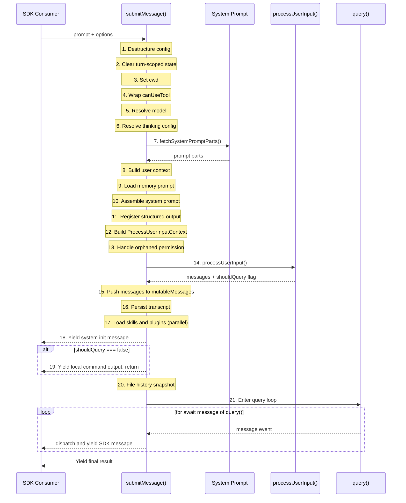
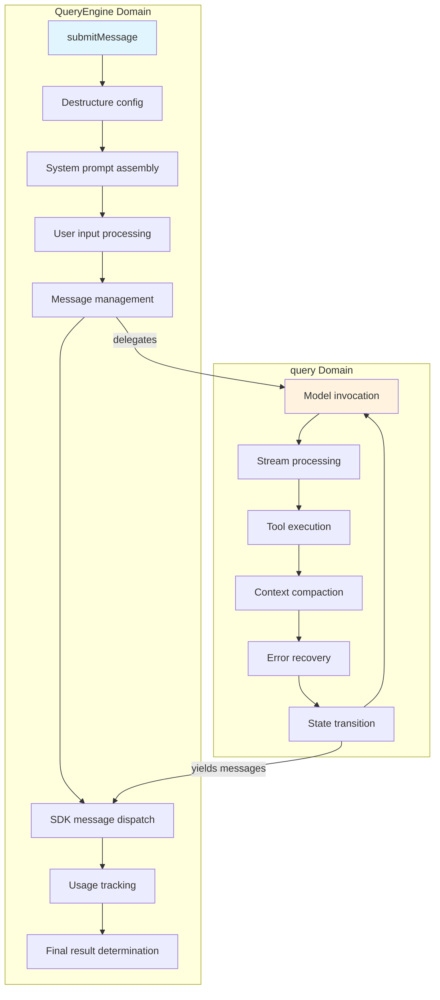

# Chapter 4: QueryEngine -- The Command Center

> **Source files**: `src/QueryEngine.ts`, `src/query.ts`, `src/query/deps.ts`, `src/query/config.ts`

In previous chapters, we traced Claude Code's startup sequence and CLI parsing layer. Now we turn to the true center of gravity: `QueryEngine`. If Claude Code were a commercial aircraft, the CLI is the boarding gate, the Tool system is the engine nacelle, and `QueryEngine` is the Flight Management Computer in the cockpit. It does not execute every low-level operation itself, but it orchestrates everything, coordinates everything, and controls everything.

This chapter provides a complete dissection of `QueryEngine`'s design philosophy, its configuration surface, the 21 sequential steps inside its core method `submitMessage()`, and the carefully scoped dependency injection layer. For engineers building AI agent frameworks, this is an architectural blueprint you can implement against directly.

---

## 4.1 QueryEngine's Role: The Public API Boundary

`QueryEngine` is the sole formal entry point that Claude Code exposes to external consumers. Whether the caller is an interactive CLI session, an SDK integration, or a Desktop embedding, every conversation request ultimately funnels into `QueryEngine.submitMessage()`.

This design carries a well-known name in software architecture: the **Facade pattern**. `QueryEngine` wraps dozens of internal subsystems -- system prompt loading, context injection, permission checking, model invocation, tool execution, context compaction, budget tracking -- behind a single, clean async generator interface.

```mermaid
classDiagram
    class QueryEngine {
        -config: QueryEngineConfig
        -mutableMessages: Message[]
        -abortController: AbortController
        -permissionDenials: SDKPermissionDenial[]
        -totalUsage: NonNullableUsage
        -hasHandledOrphanedPermission: boolean
        -readFileState: FileStateCache
        -discoveredSkillNames: Set~string~
        -loadedNestedMemoryPaths: Set~string~
        +submitMessage(prompt, options) AsyncGenerator~SDKMessage~
        +interrupt() void
        +getMessages() readonly Message[]
        +getReadFileState() FileStateCache
        +getSessionId() string
        +setModel(model) void
    }

    class QueryEngineConfig {
        +cwd: string
        +tools: Tools
        +commands: Command[]
        +mcpClients: MCPServerConnection[]
        +agents: AgentDefinition[]
        +canUseTool: CanUseToolFn
        +getAppState: () => AppState
        +setAppState: (f) => void
        +initialMessages?: Message[]
        +readFileCache: FileStateCache
        ...additional fields
    }

    class QueryDeps {
        +callModel: typeof queryModelWithStreaming
        +microcompact: typeof microcompactMessages
        +autocompact: typeof autoCompactIfNeeded
        +uuid: () => string
    }

    QueryEngine --> QueryEngineConfig : holds
    QueryEngine ..> QueryDeps : used indirectly
    QueryEngine ..> "query()" : delegates to
```

The key design constraint: **one QueryEngine instance per conversation**. Each `submitMessage()` call represents a new turn within that conversation, while conversation state -- message history, file cache, token usage -- persists across turns.

---

## 4.2 QueryEngineConfig: The Complete Surface

`QueryEngineConfig` is the type passed to the `QueryEngine` constructor. Understanding every field is essential to understanding the system's full capability boundary.

```typescript
export type QueryEngineConfig = {
  // === Core Runtime ===
  cwd: string                          // Working directory for file operations
  tools: Tools                         // Complete tool registry
  commands: Command[]                  // Available slash commands
  mcpClients: MCPServerConnection[]    // MCP protocol server connections
  agents: AgentDefinition[]            // Available agent definitions

  // === Permissions & State ===
  canUseTool: CanUseToolFn             // Permission checking hook
  getAppState: () => AppState          // Global application state getter
  setAppState: (f: (prev: AppState) => AppState) => void  // State updater

  // === Messages & Cache ===
  initialMessages?: Message[]          // Initial messages (for session restoration)
  readFileCache: FileStateCache        // File read state cache

  // === System Prompt ===
  customSystemPrompt?: string          // Replaces the default system prompt entirely
  appendSystemPrompt?: string          // Appended to the default system prompt

  // === Model Configuration ===
  userSpecifiedModel?: string          // User-specified model override
  fallbackModel?: string               // Fallback model on primary failure
  thinkingConfig?: ThinkingConfig      // Thinking/reasoning mode configuration

  // === Limits & Budget ===
  maxTurns?: number                    // Maximum number of turns
  maxBudgetUsd?: number                // Maximum USD spending cap
  taskBudget?: { total: number }       // API-level task_budget parameter

  // === Output Control ===
  jsonSchema?: Record<string, unknown> // JSON Schema for structured output
  verbose?: boolean                    // Verbose logging mode
  replayUserMessages?: boolean         // Whether to replay user messages
  includePartialMessages?: boolean     // Whether to yield partial messages to SDK

  // === Lifecycle Hooks ===
  handleElicitation?: ToolUseContext['handleElicitation']  // Elicitation handler
  setSDKStatus?: (status: SDKStatus) => void  // SDK status callback
  abortController?: AbortController    // Abort controller for cancellation

  // === Advanced Features ===
  orphanedPermission?: OrphanedPermission  // Orphaned permission handling
  snipReplay?: (                       // History snip replay function
    yieldedSystemMsg: Message,
    store: Message[],
  ) => { messages: Message[]; executed: boolean } | undefined
}
```

### Deep Dive on Key Fields

**`canUseTool`** -- This is not a simple boolean check but a full permission decision function. Inside `submitMessage()`, it is wrapped in a decorator that records `SDKPermissionDenial` events. Whenever a tool request is denied, the wrapper logs the denial event, which is ultimately reported through the SDK status channel.

**`taskBudget`** -- This is entirely distinct from the auto-continue `TOKEN_BUDGET` feature. `taskBudget` is an API-level concept: `total` represents the budget for the entire agentic turn, and `remaining` is recomputed on each loop iteration from cumulative API usage.

**`snipReplay`** -- The design of this field illustrates Claude Code's extreme commitment to feature flag isolation. It is injected by the `ask()` wrapper function only when the `HISTORY_SNIP` feature flag is active. This keeps `QueryEngine` itself free of any strings guarded by feature gates, meaning the class remains fully instantiable and testable even when `feature()` returns false under test.

**`readFileCache`** -- The file state cache is shared across the `QueryEngine` lifetime. This enables cross-turn file read operations to detect whether files have been modified, avoiding unnecessary redundant reads.

---

## 4.3 Internal Class Structure

```typescript
export class QueryEngine {
  private config: QueryEngineConfig
  private mutableMessages: Message[]
  private abortController: AbortController
  private permissionDenials: SDKPermissionDenial[]
  private totalUsage: NonNullableUsage
  private hasHandledOrphanedPermission = false
  private readFileState: FileStateCache
  private discoveredSkillNames = new Set<string>()
  private loadedNestedMemoryPaths = new Set<string>()
}
```

The constructor is deliberately minimal:

```typescript
constructor(config: QueryEngineConfig) {
  this.config = config
  this.mutableMessages = config.initialMessages ?? []
  this.abortController = config.abortController ?? createAbortController()
  this.permissionDenials = []
  this.readFileState = config.readFileCache
  this.totalUsage = EMPTY_USAGE
}
```

Note that `mutableMessages` is the single mutable message store. It accumulates over the entire `QueryEngine` lifetime -- each `submitMessage()` call appends to it. This array is the single source of truth for conversation history.

---

## 4.4 submitMessage(): The 21-Step Execution Flow

`submitMessage()` is the core method of `QueryEngine` and the execution hub of all of Claude Code. It is an **AsyncGenerator** that yields `SDKMessage` events incrementally, enabling streaming delivery.

```typescript
async *submitMessage(
  prompt: string | ContentBlockParam[],
  options?: { uuid?: string; isMeta?: boolean },
): AsyncGenerator<SDKMessage, void, unknown>
```

Here is the complete 21-step execution sequence:



### Step-by-Step Walkthrough

**Steps 1-3: Environment initialization.** Destructure all configuration from `this.config`. Clear the previous turn's `discoveredSkillNames` (skill discovery is per-turn). Set the current working directory via `setCwd(cwd)`.

**Step 4: Permission wrapping.** Wrap `canUseTool` in a decorator that adds `SDKPermissionDenial` event tracking around the original permission checking logic. This is a textbook application of the decorator pattern.

**Steps 5-6: Model and thinking resolution.** The user-specified model takes priority; otherwise the default main loop model is used. The thinking configuration can be user-provided, adaptive-default, or completely disabled.

**Steps 7-10: System prompt assembly.** This is a precision multi-source aggregation process. First, `fetchSystemPromptParts()` retrieves the base prompt fragments. These are then merged with user context, coordinator context, memory prompt, and append prompt. Finally, `asSystemPrompt()` assembles them into the complete system prompt.

**Step 11: Structured output registration.** When `jsonSchema` is configured, the system registers a synthetic output tool that forces the model to produce JSON conforming to the specified schema.

**Steps 12-14: User input processing.** Build the processing context, handle any orphaned permission (at most once per engine lifetime), then run `processUserInput()` to handle slash commands. This function returns processed messages and a `shouldQuery` flag -- if the user's input is a purely local command (such as `/help`), no API call is needed.

**Steps 15-17: State persistence and parallel loading.** Messages are pushed into `mutableMessages`. The transcript is persisted (blocking in cowork mode, fire-and-forget in bare mode). Simultaneously, slash command tool skills and all plugin caches are loaded in parallel.

**Steps 18-19: Non-query branch.** Yield the system initialization message. If `shouldQuery` is false, yield the local command output and return, skipping the API call entirely.

**Steps 20-21: Enter the query loop.** For requests that require an API call, take a file history snapshot first (if persistent sessions are enabled), then enter the `query()` loop -- the true agentic core.

### Message Dispatch Mechanism

Inside the `query()` loop, `submitMessage()` switch-dispatches each message by type:

| Message Type | Action |
|-------------|--------|
| `tombstone` | Skip (control signal for removing messages from UI) |
| `assistant` | Push to mutableMessages, normalize, yield, track stop_reason |
| `progress` | Push to mutableMessages, record transcript inline, normalize, yield |
| `user` | Push to mutableMessages, normalize, yield, increment turnCount |
| `stream_event` | Track usage (message_start/delta/stop), optionally yield |
| `attachment` | Push to mutableMessages, handle structured_output/max_turns_reached/queued_command |
| `system` | Handle snip boundary replay, compact boundary, api_error |
| `tool_use_summary` | Yield directly to SDK |

### Final Result Determination

After the query loop completes, `submitMessage()` checks whether the last assistant/user message was successful via `isResultSuccessful()`, then yields a result message with one of these subtypes:

- `success` -- normal completion
- `error_during_execution` -- error occurred during execution
- `error_max_turns` -- exceeded maximum turn count
- `error_max_budget_usd` -- exceeded budget cap
- `error_max_structured_output_retries` -- exceeded structured output retry limit (default: 5 attempts)

---

## 4.5 Dependency Injection: The QueryDeps Design

In `src/query/deps.ts`, Claude Code defines a carefully scoped dependency injection interface:

```typescript
export type QueryDeps = {
  callModel: typeof queryModelWithStreaming
  microcompact: typeof microcompactMessages
  autocompact: typeof autoCompactIfNeeded
  uuid: () => string
}
```

Four fields. Deceptively simple. But every design choice here is deliberate.

### Why Dependency Injection?

The source code comments state the rationale directly: "Passing a `deps` override into QueryParams lets tests inject fakes directly instead of `spyOn`-per-module -- the most common mocks (callModel, autocompact) are each spied in 6-8 test files today with module-import-and-spy boilerplate."

Before `QueryDeps`, 6-8 test files each needed module-level `spyOn` calls against `callModel` and `autocompact`, resulting in mountains of boilerplate and fragile test coupling. With `QueryDeps`, tests simply pass `{ deps: { callModel: mockFn, ... } }` and they are done.

### The typeof Technique

```typescript
callModel: typeof queryModelWithStreaming
```

Using `typeof fn` instead of manually declaring function signatures is a small choice with far-reaching consequences. It guarantees that the dependency interface stays **automatically synchronized** with the real implementation. When `queryModelWithStreaming`'s parameters or return type change, `QueryDeps` reflects those changes automatically, and the compiler reports errors at every consumption site.

### Production Defaults

```typescript
export function productionDeps(): QueryDeps {
  return {
    callModel: queryModelWithStreaming,
    microcompact: microcompactMessages,
    autocompact: autoCompactIfNeeded,
    uuid: randomUUID,
  }
}
```

Usage inside `queryLoop`:

```typescript
const deps = params.deps ?? productionDeps()
```

This pattern deserves attention from every agent framework designer: **dependency injection should not force all callers to provide dependencies**. Production code uses the defaults. Test code injects substitutes. The `??` operator makes `deps` optional in `QueryParams`.

### Intentionally Narrow Scope

`QueryDeps` contains only 4 dependencies, while `queryLoop` actually depends on dozens of external modules. Why not inject everything?

This is a pragmatic engineering decision. The source comments are explicit: "Scope is intentionally narrow (4 deps) to prove the pattern." These 4 dependencies are the most commonly mocked ones (callModel, microcompact, autocompact) plus one determinism requirement (uuid). Injecting all dependencies would be over-engineering; injecting only the most painful ones delivers the maximum testing improvement with minimum disruption.

---

## 4.6 The Boundary Between QueryEngine and query()

Understanding the division of labor between `QueryEngine` and `query()` is essential to understanding the overall architecture:



| Responsibility | QueryEngine | query() |
|---------------|-------------|---------|
| System prompt | Assembles | Receives and uses |
| Message history | Persistent storage | Read-only view + local mutations |
| Permission checking | Wraps and injects | Passes through to tools |
| Model invocation | Not involved | Core responsibility |
| Tool execution | Not involved | Core responsibility |
| Context compaction | Not involved | Core responsibility |
| Usage tracking | Aggregate level | Not involved |
| SDK protocol | Final yield | Intermediate yield |
| Error recovery | Budget/retry limits | 413/truncation/abort |

The boundary follows a clear principle: **QueryEngine manages conversation-level concerns; query() manages intra-turn concerns**.

---

## 4.7 The ask() Convenience Wrapper

Above `QueryEngine` sits an `ask()` function that serves as a one-shot convenience wrapper:

```typescript
export async function* ask({...params}): AsyncGenerator<SDKMessage, void, unknown>
```

Its responsibilities are straightforward:
1. Create a `QueryEngine` (conditionally injecting the `snipReplay` callback when the `HISTORY_SNIP` feature flag is active)
2. Delegate to `engine.submitMessage(prompt, { uuid, isMeta })`
3. In the `finally` block, write the file state cache back: `setReadFileCache(engine.getReadFileState())`

The purpose of `ask()` is to **reduce the cognitive overhead of single-shot calls**. Most SDK consumers do not need to manage the `QueryEngine` lifecycle -- they just want to send a message and get results.

---

## 4.8 The Engineering Value of the Facade Pattern

Looking back at the full `QueryEngine` design, we can identify the characteristic values that the Facade pattern delivers in large systems:

**1. Complexity encapsulation.** `submitMessage()` internally orchestrates at least 21 steps involving prompt assembly, permissions, input processing, persistence, skill loading, and more. Yet it exposes only a single AsyncGenerator interface.

**2. Protocol standardization.** Regardless of what happens internally, SDK consumers see a uniform stream of `SDKMessage` events. Message types, formats, and ordering are all standardized inside `submitMessage()`'s switch dispatch.

**3. Change isolation.** When internal subsystems (such as the compaction strategy) undergo refactoring, as long as `submitMessage()`'s output protocol remains stable, all external consumers are unaffected.

**4. Test friendliness.** `QueryEngine` itself can be tested by injecting a mock config to exercise its orchestration logic. `query()` can be tested independently via `QueryDeps`. Neither interferes with the other.

---

## 4.9 Lessons for Agent Framework Designers

If you are building your own AI agent framework, several core principles can be distilled from `QueryEngine`'s design:

**Configuration as capability boundary.** The 26 fields of `QueryEngineConfig` define everything `QueryEngine` can do. Any new capability must be expressed through a config field. This makes the capability boundary explicit and auditable.

**AsyncGenerator is the natural agent interface.** An agent is fundamentally a long-running computation that produces intermediate results. AsyncGenerator matches this semantic perfectly: it supports streaming output, on-demand consumption by the caller, and graceful interruption via `.return()`.

**Layered separation of concerns.** Do not attempt to handle everything in a single class. `QueryEngine` manages conversations. `query()` manages turns. `StreamingToolExecutor` manages tool concurrency. Each layer concerns itself only with its own level of abstraction.

**Progressive dependency injection.** There is no need to build a full DI container from the start. Begin with the most painful dependencies, use a simple `Deps` type with a default factory function, and expand only when the need grows. Claude Code's 4-field `QueryDeps` proves that minimal injection can deliver substantial testing improvements.

**Feature flag isolation boundaries.** The `snipReplay` injection pattern demonstrates that feature-gated code should not leak into core classes. By injecting behavior through callbacks, the core class remains fully testable even when the feature is disabled.

---

## Chapter Summary

`QueryEngine` is Claude Code's command center, but it is not a god class. Its power comes from precise responsibility partitioning and a clear delegation chain:

- **Externally**: it provides `submitMessage()` as the single entry point, outputting a standardized `SDKMessage` stream
- **Internally**: it orchestrates prompt assembly, permissions, input processing, persistence, and more across 21 sequential steps
- **Downward**: it delegates the actual agentic loop to `query()`, achieving testability through `QueryDeps`
- **Upward**: it offers `ask()` as a convenience wrapper for single-shot callers

In the next chapter, we will descend into the interior of `query()` -- the `while(true)` loop that drives model invocation, tool execution, and error recovery through a complete state machine.
