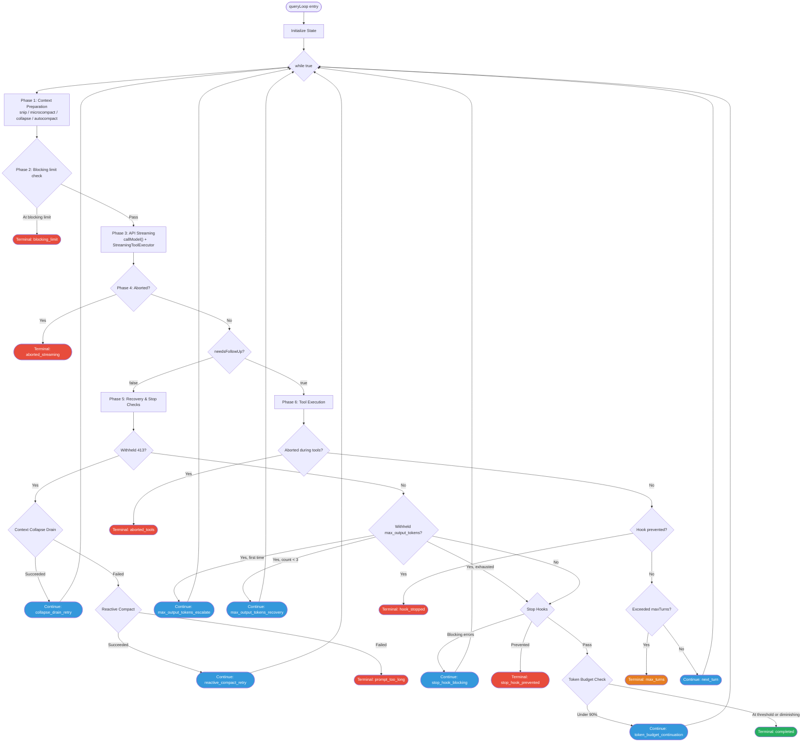
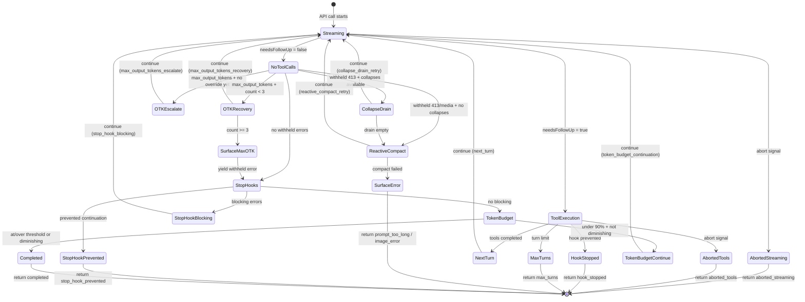

# Chapter 5: The Agentic Loop — Heart of the Engine

> **This is the most important chapter in the entire book.** If QueryEngine is the cockpit of the aircraft, the Agentic Loop is the engine itself. Understanding every phase of this loop, every state transition path, is the foundation for understanding the entire Claude Code runtime.

## 5.1 The query() Function Signature and Generator Protocol

The entry point to the Agentic Loop is the `query()` function. Its signature reveals a fundamental design decision -- **using AsyncGenerator as the communication protocol between an AI agent and the outside world**:

```typescript
export async function* query(
  params: QueryParams,
): AsyncGenerator<
  | StreamEvent        // Raw API stream events
  | RequestStartEvent  // { type: 'stream_request_start' }
  | Message            // Assistant / User / System / Progress / Attachment
  | TombstoneMessage   // Marks a message for removal
  | ToolUseSummaryMessage,  // Haiku-generated tool call summary
  Terminal             // Return value: why the loop terminated
>
```

This signature encodes three layers of meaning:

1. **`async function*`** -- The function is an AsyncGenerator. Calling it does not execute the body immediately; it returns an iterator. Consumers pull events via `for await...of` or manual `.next()` calls. This provides natural **backpressure** -- when the consumer cannot keep up, the producer pauses automatically.

2. **Yield union type** -- The loop produces five distinct event types during execution. The consumer (`QueryEngine.submitMessage`) dispatches each event through a `switch(message.type)` statement for type-specific handling.

3. **Return type `Terminal`** -- The generator's return value is not `void` but a discriminated union tag that precisely describes why the loop terminated. This allows callers to respond differently to different exit paths.

`query()` itself is a thin wrapper. Its entire job is delegation:

```typescript
export async function* query(params: QueryParams): AsyncGenerator<...> {
  const consumedCommandUuids: string[] = []
  const terminal = yield* queryLoop(params, consumedCommandUuids)
  // After normal completion, notify command lifecycle
  for (const uuid of consumedCommandUuids) {
    notifyCommandConsumed(uuid)
  }
  return terminal
}
```

The `yield*` delegation to `queryLoop()` means **all events pass directly to the caller** without intermediate buffering. This is generator composition at its best.

### The QueryParams Type

```typescript
export type QueryParams = {
  messages: Message[]
  systemPrompt: SystemPrompt
  userContext: { [k: string]: string }
  systemContext: { [k: string]: string }
  canUseTool: CanUseToolFn
  toolUseContext: ToolUseContext
  fallbackModel?: string
  querySource: QuerySource
  maxOutputTokensOverride?: number
  maxTurns?: number
  skipCacheWrite?: boolean
  taskBudget?: { total: number }
  deps?: QueryDeps
}
```

Note the `deps` field -- this is the dependency injection entry point. Production uses `productionDeps()`; tests inject mock functions. The `QueryDeps` type uses `typeof realFunction` to ensure mock signatures always stay in sync with real implementations.

## 5.2 The State Type: The Loop's Mutable State

The Agentic Loop is a `while(true)` loop, but it does not maintain state through scattered variables. All mutable state is aggregated into a single `State` struct:

```typescript
type State = {
  messages: Message[]
  toolUseContext: ToolUseContext
  autoCompactTracking: AutoCompactTrackingState | undefined
  maxOutputTokensRecoveryCount: number
  hasAttemptedReactiveCompact: boolean
  maxOutputTokensOverride: number | undefined
  pendingToolUseSummary: Promise<ToolUseSummaryMessage | null> | undefined
  stopHookActive: boolean | undefined
  turnCount: number
  transition: Continue | undefined
}
```

Each field has a precise responsibility:

| Field | Responsibility |
|-------|---------------|
| `messages` | Current conversation history; may be modified by compaction each iteration |
| `toolUseContext` | Runtime context passed to tool execution |
| `autoCompactTracking` | Auto-compaction tracking state (turn counters, consecutive failures) |
| `maxOutputTokensRecoveryCount` | Number of max_output_tokens recovery attempts (capped at 3) |
| `hasAttemptedReactiveCompact` | Whether reactive compact has been attempted (prevents infinite loops) |
| `maxOutputTokensOverride` | Output token limit override (used for escalation) |
| `pendingToolUseSummary` | Previous turn's tool summary Promise (deferred yield to next iteration) |
| `stopHookActive` | Whether a stop hook is currently active |
| `turnCount` | Current turn counter |
| `transition` | Tag recording why the previous `continue` was taken |

**The key design principle: quasi-immutable state transitions.** State is **never mutated in place** between iterations. Every `continue` site assembles a fresh `State` object:

```typescript
state = {
  ...currentState,
  messages: newMessages,
  turnCount: state.turnCount + 1,
  transition: { reason: 'next_turn' },
}
continue
```

This makes the loop behave like a pure functional reducer: `(state, event, config) => state`. The `transition` field serves as the reducer's action tag.

## 5.3 Terminal and Continue Transition Types

Every iteration of the loop ends in exactly one of two outcomes: **terminate** (Terminal) or **continue** (Continue). These two sets of tag types define the complete state space of the loop:

```typescript
// Terminal -- returned when the loop exits
type Terminal =
  | { reason: 'blocking_limit' }
  | { reason: 'image_error' }
  | { reason: 'model_error'; error: unknown }
  | { reason: 'aborted_streaming' }
  | { reason: 'aborted_tools' }
  | { reason: 'prompt_too_long' }
  | { reason: 'completed' }
  | { reason: 'stop_hook_prevented' }
  | { reason: 'hook_stopped' }
  | { reason: 'max_turns'; turnCount: number }

// Continue -- recorded when the loop proceeds to the next iteration
type Continue =
  | { reason: 'next_turn' }
  | { reason: 'collapse_drain_retry' }
  | { reason: 'reactive_compact_retry' }
  | { reason: 'max_output_tokens_escalate' }
  | { reason: 'max_output_tokens_recovery'; attempt: number }
  | { reason: 'stop_hook_blocking' }
  | { reason: 'token_budget_continuation' }
```

**10 terminal sites** represent every possible exit path from the loop. **7 continue sites** represent every reason the loop might return to the top. This is a closed state space -- no implicit exit paths, no accidental `break` statements.

Making these tags explicit delivers substantial engineering value:
- **Traceability**: every termination or continuation is precisely recorded in logs and telemetry
- **Testability**: tests can assert the exact exit reason under specific conditions
- **Maintainability**: adding a new exit path requires adding a new tag -- it cannot be overlooked

## 5.4 The Single Iteration: A 6-Phase Structure

Each loop iteration follows a strict 6-phase structure. This is not arbitrary code organization -- each phase's position has hard dependency constraints.

### Phase 1: Setup and Context Preparation

```
Destructure state -> Skill discovery prefetch -> yield stream_request_start
-> Query tracking init -> Get messages after compact boundary
-> applyToolResultBudget -> snipCompactIfNeeded
-> microcompact -> applyCollapsesIfNeeded -> autocompact
-> Update toolUseContext.messages
```

The core task of this phase is **context management**. Five compaction layers execute in strict order:

1. **Snip** -- Gated by `HISTORY_SNIP` feature flag; truncates the full message array
2. **Microcompact** -- Removes redundant tool output details
3. **Context Collapse** -- Gated by `CONTEXT_COLLAPSE`; folds earlier conversation into summaries
4. **Autocompact** -- AI-driven context compression when token usage exceeds threshold
5. **Tool Result Budget** -- Limits per-tool-result token consumption

The ordering matters. Snip executes before microcompact because the tokens it frees must be reflected in subsequent threshold calculations. Autocompact executes last because it needs to see the cumulative effect of all other compaction layers.

### Phase 2: Pre-API Checks

```
Create StreamingToolExecutor -> Resolve runtime model
-> Create dumpPromptsFetch -> Blocking limit check
```

The critical step is the **blocking limit check**. If the current token count has reached the context window's blocking limit and no recovery mechanism is enabled (neither reactive compact nor context collapse), the loop terminates immediately:

```typescript
if (isAtBlockingLimit) {
  yield createAssistantAPIErrorMessage({
    content: PROMPT_TOO_LONG_ERROR_MESSAGE,
    error: 'invalid_request',
  })
  return { reason: 'blocking_limit' }
}
```

This check is skipped when: compaction just executed (usage data is stale), the current query is itself a compaction query (would deadlock), reactive compact is enabled (errors should flow to recovery).

### Phase 3: API Streaming

This is where the loop interacts with the Claude API. It contains a nested retry loop for model fallback:

```typescript
while (attemptWithFallback) {
  attemptWithFallback = false
  try {
    for await (const message of deps.callModel({...})) {
      // Handle streaming fallback (tombstone old messages, reset)
      // Backfill tool_use inputs
      // Withhold recoverable errors (413, max_output_tokens, media)
      // Yield non-withheld messages
      // Track assistant messages and tool_use blocks
      // Feed tool_use blocks to StreamingToolExecutor
      // Yield completed streaming tool results
    }
  } catch (FallbackTriggeredError) {
    currentModel = fallbackModel
    attemptWithFallback = true
    continue
  }
}
```

The **Withholding Protocol** is the most elegant design in this phase. When the API returns a recoverable error (such as 413 prompt_too_long or max_output_tokens), the error message is **not** yielded to the consumer. It is stored locally, awaiting recovery attempts in subsequent phases. Only when recovery fails is the withheld message released. This prevents SDK consumers from prematurely terminating the session due to intermediate errors.

### Phase 4: Post-Streaming

```
Execute post-sampling hooks -> Handle abort (if aborted during streaming)
-> Yield previous turn's pending tool use summary
```

If an abort signal was received during streaming, this phase handles cleanup: it collects synthetic tool_results from the `StreamingToolExecutor` (preventing orphaned tool_use blocks), then returns `{ reason: 'aborted_streaming' }`.

### Phase 5: No-Follow-Up Branch

When the model finishes output with no tool calls (`needsFollowUp === false`), execution enters this phase. It contains the most complex recovery logic in the entire loop.

**Recovery priority chain (highest to lowest):**

1. **Prompt-too-long recovery**:
   - Try context collapse drain (`recoverFromOverflow`) first
   - Try reactive compact (`tryReactiveCompact`) next
   - If both fail, yield the withheld error and return `{ reason: 'prompt_too_long' }`

2. **Media size error recovery**: Reactive compact to strip oversized media

3. **Max output tokens recovery** (detailed in Section 5.6):
   - Escalation: retry with a 64k token limit (once per turn)
   - Multi-turn recovery: inject a "resume" meta-message (up to 3 times)
   - If exhausted, yield the withheld error

4. **Stop hooks**: Execute `handleStopHooks()`, which may block or prevent continuation

5. **Token budget check**: If under 90% of budget utilization, continue with nudge message

6. Return `{ reason: 'completed' }`

### Phase 6: Tool Execution

When the model issued tool calls (`needsFollowUp === true`), execution enters this phase.

```typescript
const toolUpdates = streamingToolExecutor
  ? streamingToolExecutor.getRemainingResults()
  : runTools(toolUseBlocks, assistantMessages, canUseTool, toolUseContext)

for await (const update of toolUpdates) {
  // Yield tool results and progress messages
  // Track hook prevention flags
  // Apply context modifiers
}
```

After tool execution completes, the phase also:
- Collects attachment messages (file changes, queued commands)
- Consumes memory prefetch results
- Consumes skill discovery prefetch
- Drains consumed commands from the queue
- Refreshes the tool list (MCP servers may have connected mid-query)
- Checks the maxTurns limit

Finally, it assembles the next State and continues:

```typescript
state = {
  messages: [...messagesForQuery, ...assistantMessages, ...toolResults],
  toolUseContext: updatedContext,
  turnCount: state.turnCount + 1,
  transition: { reason: 'next_turn' },
  // ... other fields
}
continue
```

## 5.5 Termination Condition Evaluation: 7 Continue Sites, 10 Terminal Sites

### Continue Sites Overview

| Transition Reason | Trigger | Key State Changes |
|---|---|---|
| `next_turn` | Tool results ready, need to call API again | messages appended with tool results, turnCount++ |
| `collapse_drain_retry` | 413 error, context collapses available | messages replaced with drained version |
| `reactive_compact_retry` | 413/media error, reactive compact succeeded | messages replaced with compacted version, hasAttemptedReactiveCompact = true |
| `max_output_tokens_escalate` | Output hit 8k cap, first escalation | maxOutputTokensOverride = ESCALATED_MAX_TOKENS |
| `max_output_tokens_recovery` | Output hit limit, inject resume message | messages appended with recovery message, count++ |
| `stop_hook_blocking` | Stop hook returned blocking errors | messages appended with error messages, stopHookActive = true |
| `token_budget_continuation` | Token usage under 90% | messages appended with nudge message |

### Terminal Sites Overview

| Reason | Trigger |
|--------|---------|
| `blocking_limit` | Token count at blocking limit, auto-compact disabled |
| `image_error` | ImageSizeError or ImageResizeError thrown |
| `model_error` | Unhandled error from callModel |
| `aborted_streaming` | AbortController fired during streaming |
| `aborted_tools` | AbortController fired during tool execution |
| `prompt_too_long` | Withheld 413 with no viable recovery |
| `completed` | Model finished (no tool calls), no hooks blocked |
| `stop_hook_prevented` | Stop hook explicitly prevented continuation |
| `hook_stopped` | Tool-level hook stopped continuation |
| `max_turns` | Turn count exceeded maxTurns |

## 5.6 The Error Recovery State Machine

The most intricate subsystem within the Agentic Loop is error recovery. This is not simple try/catch -- it is a full state machine with explicit transitions and termination conditions.

### maxOutputTokens Recovery

When model output hits the `max_output_tokens` limit, two recovery strategies execute in priority order:

**Strategy 1: Escalation**
- Condition: Current limit is the 8k default and no escalation has been performed
- Action: Set `maxOutputTokensOverride` to `ESCALATED_MAX_TOKENS` (64k)
- Transition: `{ reason: 'max_output_tokens_escalate' }`
- Executes at most once

**Strategy 2: Multi-turn Recovery**
- Condition: `maxOutputTokensRecoveryCount < MAX_OUTPUT_TOKENS_RECOVERY_LIMIT` (3)
- Action: Inject a "resume from where you left off" meta-message
- Transition: `{ reason: 'max_output_tokens_recovery', attempt: count }`
- Executes up to 3 times

If both strategies are exhausted, the withheld error message is yielded to the consumer, and the loop proceeds to the stop hooks phase.

### Reactive Compact Recovery

When the API returns a 413 (prompt too long) or a media size error, the recovery chain is:

1. **Context Collapse Drain**: Attempt to free space by collapsing additional context. If sufficient tokens are freed, continue with `collapse_drain_retry`.
2. **Reactive Compact**: If draining is insufficient, invoke AI-driven emergency compaction. On success, continue with `reactive_compact_retry`.
3. **Surface Error**: If both fail, yield the error and terminate with `prompt_too_long`.

**Critical safeguard**: The `hasAttemptedReactiveCompact` flag prevents infinite loops. This flag is preserved across `stop_hook_blocking` transitions to prevent the following death spiral: compact -> still too long -> error -> stop hook blocking -> compact -> ...

## 5.7 Loop Flowcharts

### Main Loop Flowchart



### Error Recovery State Machine



## 5.8 Walking Through a Complete Iteration

Let us trace a concrete scenario through a complete single iteration. Suppose the user asks Claude Code to "read README.md and fix the typos in it."

**Current state**: `turnCount: 2`, the previous iteration invoked the `ReadFile` tool and the file contents are now in the message history. This is the second iteration.

**Phase 1**: Destructure state, extracting `messages`, `turnCount: 2`, `transition: { reason: 'next_turn' }`. Run the context compaction pipeline -- the message count is low, so all compaction layers are no-ops.

**Phase 2**: Check token usage -- well below the blocking limit. Create a fresh `StreamingToolExecutor`.

**Phase 3**: Call `deps.callModel()`. The API streams back an assistant message. The model outputs a `tool_use` block invoking `EditFile` to fix the typos. `StreamingToolExecutor.addTool()` enqueues the block as soon as it arrives. EditFile is not concurrency-safe (it modifies files), so it is marked as non-concurrent.

**Phase 4**: Streaming completes normally with no abort. `needsFollowUp = true` (a tool call exists). The pending tool use summary from the previous turn is yielded.

**Phase 5**: Skipped (execution flows to Phase 6).

**Phase 6**: `streamingToolExecutor.getRemainingResults()` waits for the EditFile tool to complete. The tool succeeds, returning a tool_result message with the edit outcome. The maxTurns check passes -- current turnCount of 2 is below the default. The next State is assembled:

```typescript
state = {
  messages: [...messages, assistantMessage, toolResultMessage],
  turnCount: 3,
  transition: { reason: 'next_turn' },
  maxOutputTokensRecoveryCount: 0,
  hasAttemptedReactiveCompact: false,
  // ...
}
continue
```

The loop returns to Phase 1. In the third iteration, the model sees the successful tool result, generates a summary assistant message with no tool calls, enters Phase 5, passes through stop hooks and token budget checks, and returns `{ reason: 'completed' }`.

## 5.9 Design Insights

### AsyncGenerator as Primitive Abstraction

The entire engine is built on **nested AsyncGenerators**. This provides four critical capabilities:

1. **Streaming**: Events flow to consumers as they are produced
2. **Backpressure**: Consumers pull at their own pace
3. **Cancellation**: `generator.return()` closes the entire chain
4. **Composability**: `yield*` delegates seamlessly between generators

This is a deliberate alternative to callback-based or event-emitter-based architectures. Generators make control flow explicit and linear -- there are no hidden callback queues, no event ordering surprises. The cost is that you must think in terms of pull-based iteration rather than push-based events, but for an agent loop where each step depends on the previous step's output, pull semantics are the natural fit.

### Quasi-Immutable State and the Reducer Pattern

The design of never mutating State in place between iterations makes the loop behave like a reducer: `(state, event, config) => state`. Source comments explicitly note that this design makes future extraction of a pure `step()` function tractable.

This is not accidental. A pure step function would enable:
- Deterministic replay of loop execution from logged states
- Property-based testing with arbitrary state inputs
- Formal verification of termination conditions

The current implementation is not yet a pure reducer -- side effects (API calls, tool execution, yielding events) are interleaved with state transitions. But the structural groundwork is in place.

### The Withhold-Then-Recover Pattern

For recoverable API errors, the loop employs a "withhold first, recover later" pattern. This is a carefully considered design -- it defers the **decision point** for error handling from the moment the error occurs to after all recovery strategies have been exhausted. This prevents SDK consumers from seeing intermediate errors that would cause premature session termination.

The pattern has three invariants:
1. Withheld messages are stored in a local array accessible to recovery code
2. Every withheld message is either recovered (loop continues) or surfaced (loop returns)
3. No withheld message can be silently dropped

### The Three-Level AbortController Hierarchy

```
Query AbortController (top -- query-level)
  -> SiblingAbortController (middle -- Bash error cascading)
    -> Per-tool AbortController (bottom -- individual tool cancellation)
```

Only Bash tool errors cascade to cancel sibling tools. Errors from other tools (ReadFile, WebFetch, etc.) are independent. This reflects a critical domain insight: Bash commands often have implicit dependency chains (if `mkdir` fails, subsequent commands are pointless), while read operations are independent.

The cascade rule is implemented in `StreamingToolExecutor.executeTool()`:

```typescript
if (tool.block.name === BASH_TOOL_NAME) {
  this.hasErrored = true
  this.erroredToolDescription = this.getToolDescription(tool)
  this.siblingAbortController.abort('sibling_error')
}
```

Abort propagation also flows upward: if a per-tool controller aborts for a reason other than `'sibling_error'`, and the parent is not already aborted, the abort propagates to the query-level controller. This handles permission dialog rejections and similar user-initiated interruptions.

### Ordered Concurrent Execution

The StreamingToolExecutor solves a subtle problem: it must execute tools concurrently for performance while preserving submission order for correctness. The solution uses a status-tracking queue:

- Concurrent-safe tools run in parallel with each other
- Non-concurrent tools execute alone (exclusive access)
- Results are **yielded in submission order**, not completion order
- Progress messages bypass ordering and are yielded immediately

The ordering guarantee is maintained by `getCompletedResults()`, which iterates the tool queue from front to back. If it encounters an executing (incomplete) non-concurrent tool, it breaks -- no results behind that tool can be yielded yet, even if they are already complete.

---

> **Chapter Summary**: The Agentic Loop is the heart of Claude Code. It uses `while(true)` plus AsyncGenerator to build a 6-phase iteration structure, with 10 Terminal and 7 Continue tags precisely controlling state transitions, and a quasi-immutable State type implementing near-reducer behavior. The withhold-then-recover pattern and three-level AbortController hierarchy demonstrate the depth of error handling required in production AI agent systems. Understanding this loop is understanding the core mechanism that enables an AI agent to "keep acting until the task is complete."
