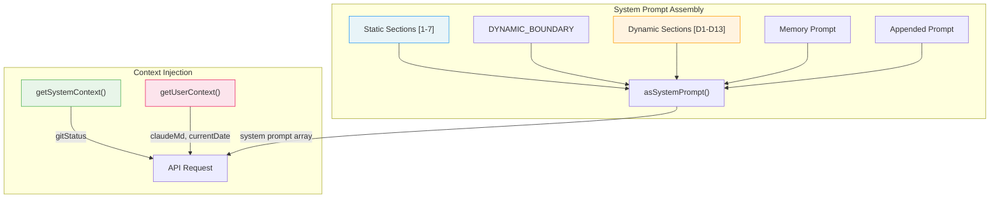
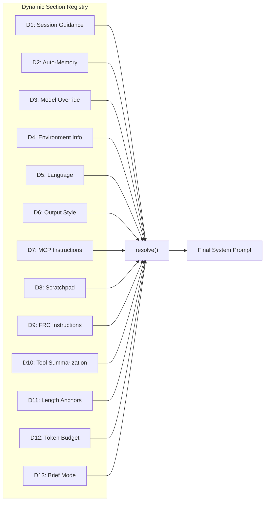
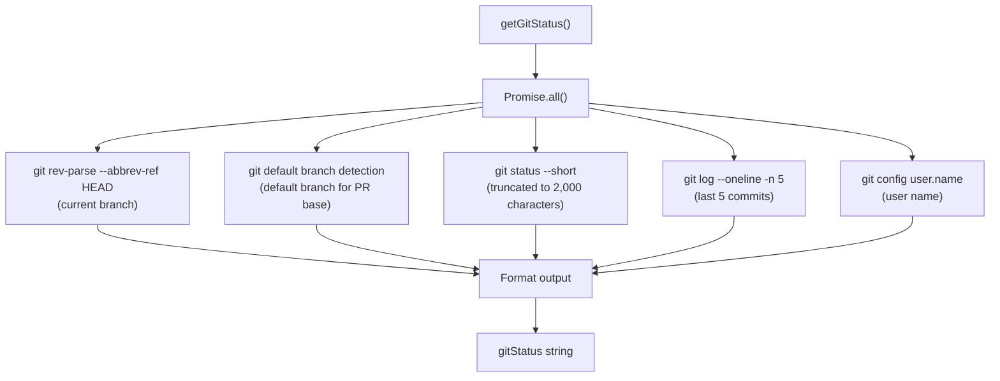
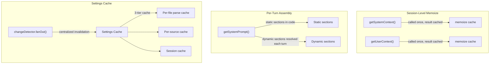
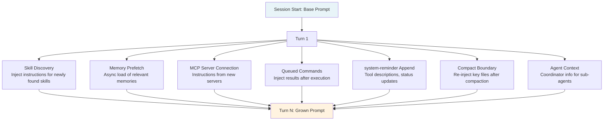
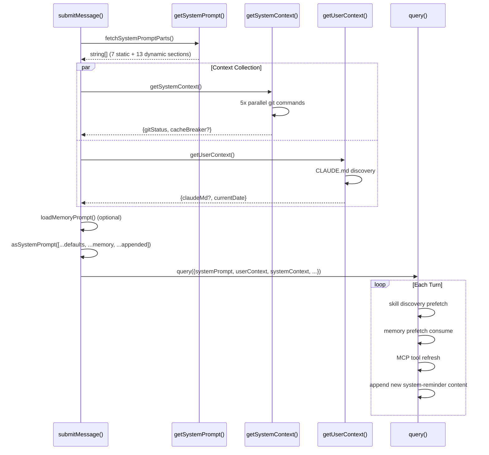

# Chapter 6: System Prompt and Context Assembly

> **Source files**: `src/constants/prompts.ts` (~700 lines), `src/context.ts` (190 lines), `src/QueryEngine.ts`
>
> Every API request sent to a large language model is fundamentally governed not by the user message, but by the system prompt. In Claude Code, the system prompt is not a static string constant. It is a **runtime assembly pipeline** that, at the start of every conversation, collects environment state, user configuration, and session metadata to produce an instruction set comprising 20+ distinct sections. This chapter disassembles every stage of that pipeline.

---

## 6.1 Layered Architecture Overview

Claude Code divides the context delivered to the API into three independent channels, each occupying a different position in the request payload:

| Channel | API Field | Lifecycle | Typical Content |
|---------|-----------|-----------|-----------------|
| **System Prompt** | `system` | Static sections persist across session; dynamic sections may vary per turn | Behavioral rules, tool usage guidelines, output style |
| **User Context** | `system` (injected as `system-reminder`) | Memoized once at session start | CLAUDE.md content, current date |
| **System Context** | `system` (injected as `system-reminder`) | Memoized once at session start | Git status, cache breaker |

These three channels converge inside `submitMessage()`, where the `asSystemPrompt()` function merges them into a final `SystemPrompt` object passed to `query()` for entry into the agentic loop.



The key design decision: **system prompt and context are assembled independently.** The system prompt is returned by `getSystemPrompt()` as a `string[]` where each element is a section. User and system contexts are returned by their respective `getXxxContext()` functions as `{[k: string]: string}` dictionaries. This separation allows caching strategies to operate at section granularity.

---

## 6.2 Static Sections: The 7 Immutable Behavioral Foundations

The `getSystemPrompt()` function (file: `src/constants/prompts.ts`) returns an array whose first seven elements form the **Static Zone**. These remain consistent across all sessions within the same organization and are eligible for Anthropic API prompt cache hits:

### [1] `getSimpleIntroSection(outputStyle)`

The opening preamble that establishes Claude Code's core identity:

```
"You are an interactive agent that helps users..."
```

Appended with `CYBER_RISK_INSTRUCTION` -- a mandatory directive on secure coding practices. If the user has configured an `outputStyle`, a style prefix is injected here.

### [2] `getSimpleSystemSection()`

System-level rules covering:
- **Output formatting**: Markdown rendering, monospace font conventions
- **Permission mode awareness**: Informs the model of the current `default`/`plan`/`auto` mode
- **`system-reminder` tags**: Explains that `<system-reminder>` blocks are trusted system injections
- **Prompt injection detection**: Guides the model to identify and refuse malicious instructions embedded in user input
- **Hooks section**: Notifies the model that users can configure pre/post execution hooks
- **Automatic compaction notice**: Explains that long conversations will be auto-summarized

### [3] `getSimpleDoingTasksSection()`

Task execution principles:
- Software engineering context setting
- Code style guidelines (**no gold-plating, no speculative abstractions**)
- Commenting policy (explain *why*, not *what*)
- Security awareness (never hardcode secrets)

### [4] `getActionsSection()`

Operational safety guidelines:
- **Reversibility assessment**: Evaluate whether an action can be undone before executing
- **Blast radius consideration**: Assess the scope of impact for any change
- **Destructive operation checklist**: `git reset --hard`, `rm -rf`, etc. require explicit confirmation
- **Authorization scope**: Never exceed the permissions granted by the user

### [5] `getUsingYourToolsSection(enabledTools)`

Tool usage guide that dynamically receives the list of currently enabled tools:
- **Dedicated tool preference**: `Read > cat`, `Edit > sed`, `Grep > grep`
- **TodoWrite/TaskCreate**: When to use task management tools
- **Parallel tool calls**: Guidance on when the model can invoke multiple tools in a single response

### [6] `getSimpleToneAndStyleSection()`

Tone and formatting norms:
- No emojis unless the user explicitly requests them
- File paths in `file_path:line_number` format
- GitHub references in `owner/repo#123` format
- No colon before tool invocations

### [7] `getOutputEfficiencySection()`

Output efficiency controls that branch on user type:
- **Internal users (Ant)**: Detailed communication guidelines, flowing prose, inverted pyramid structure
- **External users**: Concise output rules, avoidance of verbosity

### [8] `SYSTEM_PROMPT_DYNAMIC_BOUNDARY`

A special marker that separates the static zone from the dynamic zone. This boundary carries significance at the API level -- it signals the prompt cache mechanism: **everything before the boundary can be cached across requests; everything after may differ per request.**

---

## 6.3 Dynamic Sections: 13+ Session-Specific Segments

Content after `SYSTEM_PROMPT_DYNAMIC_BOUNDARY` is managed through a **Dynamic Section Registry**. Each section is registered via `systemPromptSection()` and resolved asynchronously at runtime:



### [D1] `getSessionSpecificGuidanceSection()`

The most complex dynamic section, containing multiple sub-modules:

- **AskUserQuestion guidance**: When to ask the user a question and how to structure it
- **`!` command hints**: Informs the model that users can prefix shell commands with `!`
- **Agent tool section**: Injects fork/delegate decision guidance based on current agent configuration
- **Explore agent guidance**: Behavioral constraints for search and exploration agents
- **Skill tool usage**: How to discover and invoke skills
- **DiscoverSkills guidance**: Trigger conditions for skill discovery
- **Verification agent contract**: Input/output specifications for verification agents

### [D2] `loadMemoryPrompt()`

Loads auto-memory content. Claude Code's memory system allows the model to persist important information to `~/.claude/memory/` during conversations. This section injects existing memories into the system prompt, enabling the model to "remember" previously learned preferences and context in new sessions.

### [D3] `getAntModelOverrideSection()`

Active only for Anthropic internal users; injects model suffix information.

### [D4] `computeSimpleEnvInfo(model, dirs)`

Environment information including:
- Current working directory
- Operating system and platform
- Active model name
- Shell type

### [D5] `getLanguageSection()`

If the user has configured a `language` field in settings, injects a language preference directive.

### [D6] `getOutputStyleSection()`

If `outputStyle` is configured, injects a custom output style directive.

### [D7] `getMcpInstructionsSection()`

Usage instructions from connected MCP servers. Each MCP server can declare its own `instructions` field; this section aggregates instructions from all active MCP servers.

### [D8] `getScratchpadInstructions()`

Guidance for the scratchpad directory -- the model can create temporary files in `.claude/scratchpad/`.

### [D9] `getFunctionResultClearingSection()`

FRC (Function Result Clearing) instructions -- guides the model on how to handle cleared old tool results.

### [D10] `SUMMARIZE_TOOL_RESULTS_SECTION`

Tool result summarization instructions -- tells the model how to generate summaries when tool output is excessively long.

### [D11] Length Anchors (internal users only)

Numeric length anchors such as `"<=25 words between tool calls"`, used for precise control of text length between tool invocations.

### [D12] Token Budget (feature-gated)

When the `TOKEN_BUDGET` feature flag is active, injects token budget tracking instructions.

### [D13] Brief Mode (feature-gated)

When brief mode is enabled, injects minimal-output instructions.

---

## 6.4 Context Injection: Git Status and Memory Files

Context injection operates as a separate pipeline from system prompt assembly. It gathers real-time environment state and injects it into the API request as `system-reminder` blocks.

### 6.4.1 System Context: 5 Parallel Git Commands

The `getSystemContext()` function (file: `src/context.ts`) is wrapped with `memoize`, executing exactly once per session:

```typescript
export const getSystemContext = memoize(async () => {
  const gitStatus = await getGitStatus()
  const injection = getSystemPromptInjection()
  return {
    ...(gitStatus && { gitStatus }),
    ...(injection && { cacheBreaker: `[CACHE_BREAKER: ${injection}]` }),
  }
})
```

The core of `getGitStatus()` is **five Git commands executed in parallel**:



The formatted output:

```
This is the git status at the start of the conversation...
Current branch: feature/new-ui
Main branch: main
Git user: Gary Huang
Status:
 M src/app.ts
?? src/new-file.ts
Recent commits:
a1b2c3d Fix login validation
e4f5g6h Add user settings page
...
```

Skip conditions -- Git status collection is bypassed when:
- Running in a CCR (Cloud Code Runner) environment
- The user has disabled `includeGitInstructions` in settings

### 6.4.2 User Context: CLAUDE.md Discovery and Injection

`getUserContext()` is also memoized, executing once per session:

```typescript
export const getUserContext = memoize(async () => {
  const claudeMd = shouldDisableClaudeMd ? null
    : getClaudeMds(filterInjectedMemoryFiles(await getMemoryFiles()))
  setCachedClaudeMdContent(claudeMd || null)
  return {
    ...(claudeMd && { claudeMd }),
    currentDate: `Today's date is ${getLocalISODate()}.`,
  }
})
```

The CLAUDE.md file discovery chain:

```
getMemoryFiles()
  -> Scan ~/.claude/CLAUDE.md          (global)
  -> Scan <cwd>/.claude/CLAUDE.md      (project-level)
  -> Scan <cwd>/CLAUDE.md              (project root)
  -> Scan <parent-dirs>/CLAUDE.md      (walk up directory tree)
  -> filterInjectedMemoryFiles()        (remove files already injected via other paths)
  -> getClaudeMds()                     (merge all content)
```

Disable conditions:
- `CLAUDE_CODE_DISABLE_CLAUDE_MDS` environment variable is set
- Running in `--bare` mode (unless `--add-dir` is explicitly used)

### 6.4.3 User Context vs. System Context

| Property | User Context | System Context |
|----------|-------------|----------------|
| **Content** | CLAUDE.md files, current date | Git status, cache breaker |
| **Source** | File system scanning | Git commands |
| **Visibility** | Fully user-controlled via CLAUDE.md | Automatically collected; users do not directly edit |
| **Purpose** | Project conventions, personal preferences | Environment context, repository state |
| **API position** | `system-reminder` injection | `system-reminder` injection |

---

## 6.5 Caching Strategy: Memoization Boundaries

All three context functions use `memoize` decorators, but their cache granularity and lifecycle differ significantly:



### Why is context collected only once?

Git status and CLAUDE.md are collected once at session start, not refreshed on every turn. This is a deliberate design decision with three motivations:

1. **Performance**: Even with five parallel Git commands, the collection takes tens of milliseconds. Per-turn execution would add noticeable latency to every API call.
2. **Consistency**: Git status changes during the session as the model makes edits. Refreshing per turn would cause the model to observe its own changes, creating a feedback loop that distorts its understanding of the original codebase state.
3. **Cache friendliness**: Fixed context content yields higher prompt cache hit rates at the API layer, reducing both cost and latency.

### The settings cache exception

Settings employ a three-tier cache but support hot reloading. When a filesystem change triggers the `changeDetector`, the `fanOut()` function centrally invalidates all cache tiers, then notifies subscribers to reload. This contrasts sharply with the "collect once, never refresh" strategy used for contexts.

---

## 6.6 Dynamic Prompts: Memory Mechanics and Agent Definitions

### 6.6.1 The Memory System

Claude Code's memory system enables the model to persist knowledge across sessions. Memory enters the system prompt through two pathways:

**Pathway 1: CLAUDE.md (User Context)**

User-maintained project memory files. Content flows directly into `getUserContext()`'s `claudeMd` field and is injected as a `system-reminder`. This is the user's explicit control channel over model behavior.

**Pathway 2: Auto-Memory (Dynamic Section D2)**

Memory fragments that the model saves automatically during conversations via `loadMemoryPrompt()`, stored in `~/.claude/memory/` or a user-configured `autoMemoryDirectory`. These memories are loaded into the system prompt's dynamic section in subsequent sessions.

Nested memory loading: `QueryEngine` maintains a `loadedNestedMemoryPaths` set that tracks loaded memory file paths, preventing circular references and duplicate loading.

### 6.6.2 Agent Definition Injection

When the user specifies an agent via the `--agent` flag or the `agent` field in settings, the agent's prompt overrides or appends to the system prompt. This happens in steps 8-10 of `submitMessage()`:

```
Step  7: fetchSystemPromptParts()  -> fetch default system prompt
Step  8: merge base user context + coordinator context
Step  9: loadMemoryPrompt()        -> optional, custom prompt + memory path
Step 10: asSystemPrompt([...defaults, ...memory, ...appended])
```

When a `customSystemPrompt` exists (from `QueryEngineConfig`), it completely replaces the default system prompt, but memory and appended sections are preserved. This guarantees that even with a custom agent, the memory system and user-appended instructions remain active.

---

## 6.7 How the System Prompt Grows With Conversation

The system prompt is not determined once at session start and then frozen. Multiple mechanisms cause it to evolve dynamically during a conversation:

### Seven Growth Pathways



**1. Skill Discovery**

At the start of each iteration, `queryLoop` launches a non-blocking skill discovery prefetch. When new skills are found (tracked in `discoveredSkillNames`), their instructions are appended to the system prompt.

**2. Memory Prefetch**

`startRelevantMemoryPrefetch()` is initiated during `queryLoop` initialization using the `using` keyword for automatic disposal. When the prefetch settles and results are available, memory content is appended.

**3. Dynamic MCP Server Connections**

MCP servers may connect mid-session. During Phase 6, step 10 of `queryLoop`, the tool list is refreshed and newly connected MCP server `instructions` are merged into the system prompt.

**4. Queued Commands**

Command execution results are injected into subsequent turns via `attachment` messages of subtype `queued_command`.

**5. system-reminder Appends**

Tool descriptions and status updates are continuously appended through `system-reminder` tags. This includes deferred tool schema loading results, permission mode change notifications, and more.

**6. Post-Compact Reconstruction**

When automatic compaction fires, the system prompt does not shrink. Instead, `POST_COMPACT_MAX_FILES_TO_RESTORE` (default 5) recently read files are re-injected to ensure the model does not "forget" critical context due to compaction.

**7. Coordinator Context**

In multi-agent scenarios, coordinator information (team member lists, task assignments, communication protocols) is appended to the base user context.

### Proactive Mode: Complete Replacement

A notable exception deserves special mention. When proactive mode activates, the entire prompt structure is replaced with a minimal variant:

```
"You are an autonomous agent. Use the available tools to do useful work."
+ CYBER_RISK_INSTRUCTION
+ system reminders
+ memory prompt
+ env info
+ MCP instructions
+ scratchpad
+ FRC
+ summarize tool results
+ proactive section
```

This reflects an important architectural principle: **the prompt structure is not monolithic -- it is a template that can be entirely swapped based on the runtime mode.**

---

## 6.8 The Complete Prompt Assembly Pipeline

Connecting all the pieces, a full prompt assembly sequence proceeds as follows:



---

## 6.9 Architectural Takeaways

### Takeaway 1: Prompt as Configuration

Claude Code manages the system prompt as a **runtime configuration system** -- with static defaults, dynamic overrides, hierarchical merging, and caching strategies. This mirrors configuration management in traditional software. If you are building your own AI agent framework, treat the prompt not as a string constant but as a lifecycle-managed configuration object.

### Takeaway 2: Cache-Aware Partitioning

The static/dynamic partition is not arbitrary -- it directly maps to Anthropic's API prompt caching mechanism. Static sections can be reused across multiple API calls, saving on token billing and latency. When designing large system prompts, **place immutable content first**.

### Takeaway 3: Orthogonal Separation of Context and Prompt

Separating "what the model should do" (system prompt) from "what the model needs to know" (context) into independent channels allows both to evolve independently. Changes to CLAUDE.md require no modifications to prompt logic; Git status collection needs no awareness of prompt section structure.

### Takeaway 4: Memoization Boundary Selection

System context and user context use session-level memoization, while the system prompt's dynamic sections are re-resolved each turn. This boundary reflects a core trade-off: **environment state is relatively stable within a session, but behavioral instructions must adapt dynamically as the conversation progresses.**

---

## Summary

This chapter has revealed the complete mechanism of system prompt and context assembly in Claude Code:

- **Three-channel architecture**: System Prompt, User Context, and System Context are assembled independently and converge in the API request
- **Static + dynamic partitioning**: 7 static sections provide a cache-friendly behavioral foundation; 13+ dynamic sections provide session-level customization
- **5-way parallel Git collection**: System Context efficiently gathers environment state through 5 concurrent Git commands
- **CLAUDE.md hierarchical discovery**: Multi-level memory file scanning from global to project scope
- **Memoization strategy**: Context functions use session-level memoization; Settings use a hot-reloadable three-tier cache
- **Continuous growth**: The prompt grows during conversation through 7 pathways including skill discovery, memory prefetch, and MCP connections

In the next chapter, we turn to State Management, examining how `createStore<T>()` -- a reactive store implemented in just 35 lines -- underpins the entire application's state flow.
