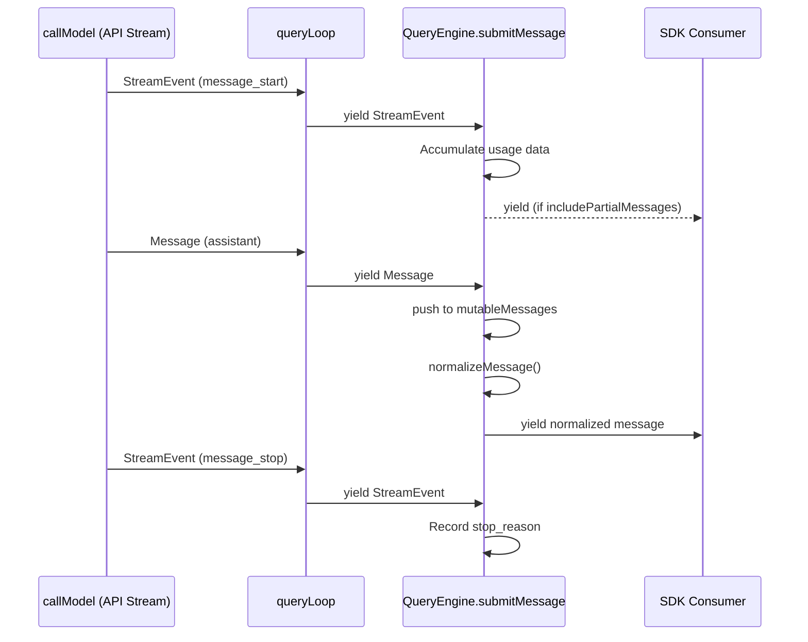
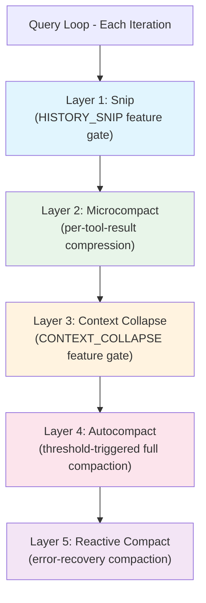
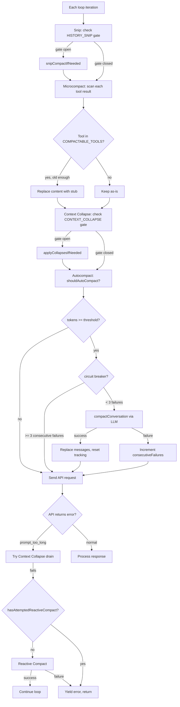
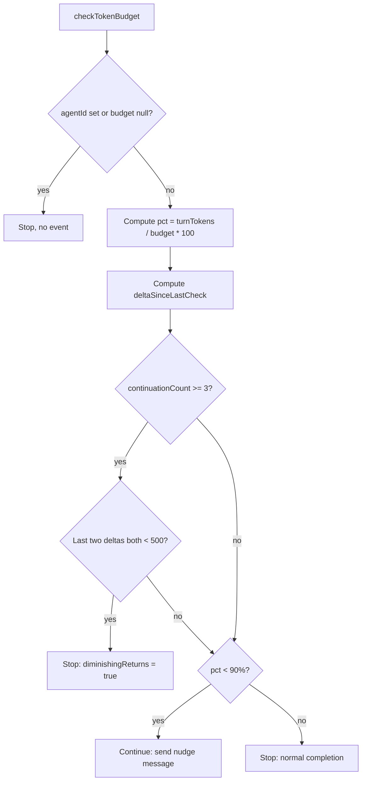
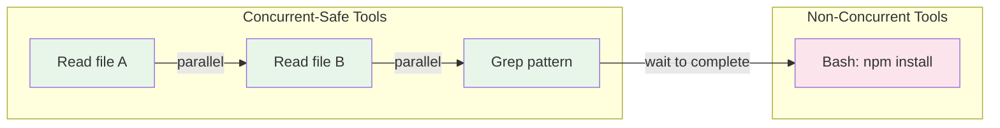
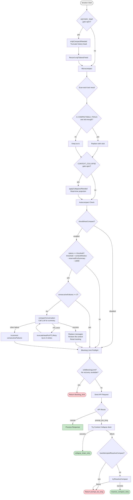

# Chapter 7: Streaming and Context Compaction

> How do you sustain an infinite conversation within a finite context window? Every LLM-powered agent system must answer this question head-on. Claude Code's answer is a five-layer compaction architecture, coupled with an AsyncGenerator-driven streaming protocol and a precise token budget management system. This chapter dissects each mechanism layer by layer.

---

## 7.1 The AsyncGenerator-Based Streaming Protocol

The entire Claude Code engine is built on **nested AsyncGenerators**. From the lowest-level API call to the outermost SDK consumer, every layer is an AsyncGenerator, with events flowing outward through the chain.

### 7.1.1 The Core Generator Chain

```
callModel()  ->  queryLoop()  ->  query()  ->  submitMessage()  ->  SDK Consumer
  (API stream)    (main loop)     (thin wrap)   (QueryEngine)       (external)
```

`queryLoop` is the heart of the chain. Its signature makes the design explicit:

```typescript
async function* queryLoop(
  params: QueryParams,
  consumedCommandUuids: string[],
): AsyncGenerator<
  | StreamEvent
  | RequestStartEvent
  | Message
  | TombstoneMessage
  | ToolUseSummaryMessage,
  Terminal
>
```

The return type `Terminal` is a discriminated union recording why the loop exited:

```typescript
type Terminal =
  | { reason: 'blocking_limit' }
  | { reason: 'model_error'; error: unknown }
  | { reason: 'aborted_streaming' }
  | { reason: 'aborted_tools' }
  | { reason: 'prompt_too_long' }
  | { reason: 'completed' }
  | { reason: 'stop_hook_prevented' }
  | { reason: 'max_turns'; turnCount: number }
  // ... additional reasons
```

### 7.1.2 Why AsyncGenerators?

The choice of AsyncGenerators over EventEmitter or Observable rests on four properties:

1. **Streaming**: Events flow to consumers as they are produced, with no need to wait for the full response.
2. **Backpressure**: Consumers pull at their own pace. A slow consumer does not cause memory buildup.
3. **Cancellation**: Calling `generator.return()` closes the entire chain cleanly.
4. **Composability**: `yield*` delegates seamlessly between generators.

### 7.1.3 Streaming Event Routing



Inside `submitMessage`, a switch statement dispatches each message type:

| Type | Handling |
|------|----------|
| `assistant` | Push to mutableMessages, normalize, yield |
| `progress` | Push to mutableMessages, record transcript inline |
| `user` | Push to mutableMessages, increment turnCount |
| `stream_event` | Track usage, conditionally yield |
| `attachment` | Handle structured_output / max_turns_reached |
| `system` | Handle snip boundary / compact boundary / api_error |
| `tombstone` | Skip (control signal for UI message removal) |
| `stream_request_start` | Suppressed (not exposed to SDK) |

### 7.1.4 The Withhold-Then-Recover Pattern

For recoverable API errors, Claude Code employs a **withhold-then-recover** strategy:

1. **During streaming**: The error message is withheld (not yielded to SDK).
2. **After streaming**: Recovery is attempted (context collapse drain, reactive compact, token escalation).
3. **If recovery succeeds**: The loop continues with new state.
4. **If recovery fails**: The withheld error message is released and the loop returns.

This prevents SDK consumers (such as the Desktop client) from prematurely terminating the session on intermediate errors.

---

## 7.2 The StreamEvent Type System

The union of types yielded by `queryLoop` is a carefully structured hierarchy:

```typescript
AsyncGenerator<
  | StreamEvent        // Raw API stream events (message_start, content_block_delta, etc.)
  | RequestStartEvent  // { type: 'stream_request_start' } -- request boundary marker
  | Message            // Assistant, User, System, Progress, Attachment messages
  | TombstoneMessage   // { type: 'tombstone', message: AssistantMessage }
  | ToolUseSummaryMessage  // Haiku-generated summary of tool use batch
  ,
  Terminal             // Return value: reason the loop ended
>
```

### 7.2.1 Three-Layer Message Processing

```
queryLoop yields -> submitMessage switch-dispatch -> SDK consumer
```

Every message passes through three processing stages before reaching the SDK consumer:
- **Transcript recording** (assistant, user, compact_boundary)
- **Push to mutableMessages** (assistant, progress, user, attachment, system)
- **Normalization** via `normalizeMessage()` for a uniform format
- **Usage accumulation** from stream_event message_start/delta/stop token counts
- **Selective filtering** (stream_request_start not exposed; most system subtypes not exposed)

### 7.2.2 The Loop State Machine

Inside queryLoop, a quasi-immutable state machine drives iteration:

```typescript
type State = {
  messages: Message[]
  toolUseContext: ToolUseContext
  autoCompactTracking: AutoCompactTrackingState | undefined
  maxOutputTokensRecoveryCount: number
  hasAttemptedReactiveCompact: boolean
  maxOutputTokensOverride: number | undefined
  pendingToolUseSummary: Promise<ToolUseSummaryMessage | null> | undefined
  stopHookActive: boolean | undefined
  turnCount: number
  transition: Continue | undefined
}
```

At every `continue` site, a new `State` object is assembled rather than mutating the existing one. The `transition` field records the reason the loop continued, making state transitions traceable:

```typescript
type Continue =
  | { reason: 'next_turn' }
  | { reason: 'collapse_drain_retry'; committed: number }
  | { reason: 'reactive_compact_retry' }
  | { reason: 'max_output_tokens_escalate' }
  | { reason: 'token_budget_continuation' }
  // ...
```

---

## 7.3 The Five-Layer Compaction Architecture

The compaction system is one of Claude Code's core innovations. It maintains infinite-length conversations within a finite context window through five distinct strategy layers, executed in strict order during each loop iteration:



### 7.3.1 Layer 1: Snip Compaction

**When**: First in the pipeline, before Microcompact.
**Feature gate**: `HISTORY_SNIP`
**Operates on**: The full message array.

Snip is the lightest compaction layer. It truncates the head of the message history, freeing token space with zero API calls.

```typescript
// queryLoop Phase 1:
if (feature('HISTORY_SNIP')) {
  const snipResult = snipModule!.snipCompactIfNeeded(messagesForQuery)
  messagesForQuery = snipResult.messages
  snipTokensFreed = snipResult.tokensFreed
  if (snipResult.boundaryMessage) {
    yield snipResult.boundaryMessage
  }
}
```

A critical detail: `snipTokensFreed` is plumbed through to the Autocompact layer. The reason is that `tokenCountWithEstimation` derives its estimate from the usage field of the most recent assistant message -- and since Snip does not modify that message, the raw estimate cannot reflect the tokens Snip freed. Without this plumbing, Autocompact would over-trigger.

In `QueryEngine.submitMessage`, snip boundaries are handled through the injected `snipReplay` callback:

```typescript
snipReplay: (yielded: Message, store: Message[]) => {
  if (!snipProjection!.isSnipBoundaryMessage(yielded)) return undefined
  return snipModule!.snipCompactIfNeeded(store, { force: true })
}
```

When replay executes, `mutableMessages` is replaced wholesale:

```typescript
if (snipResult.executed) {
  this.mutableMessages.length = 0
  this.mutableMessages.push(...snipResult.messages)
}
```

### 7.3.2 Layer 2: Microcompact

**When**: After Snip, before Context Collapse.
**Operates on**: Individual tool results.

Microcompact is fine-grained compression. Rather than processing the entire conversation, it clears old content from individual tool call results.

```typescript
const microcompactResult = await deps.microcompact(
  messagesForQuery,
  toolUseContext,
  querySource,
)
messagesForQuery = microcompactResult.messages
```

Only results from specific tools are eligible:

```typescript
const COMPACTABLE_TOOLS = new Set([
  FILE_READ_TOOL_NAME,
  ...SHELL_TOOL_NAMES,   // Bash, PowerShell
  GREP_TOOL_NAME,
  GLOB_TOOL_NAME,
  WEB_SEARCH_TOOL_NAME,
  WEB_FETCH_TOOL_NAME,
  FILE_EDIT_TOOL_NAME,
  FILE_WRITE_TOOL_NAME,
])
```

For Anthropic internal users, a **Cached Microcompact** variant uses `cache_edits` blocks to incrementally clear old content without breaking the API's prompt cache:

```typescript
export function consumePendingCacheEdits(): CacheEditsBlock | null
export function getPinnedCacheEdits(): PinnedCacheEdits[]
export function pinCacheEdits(userMessageIndex, block): void
```

Token estimation is deliberately conservative: it counts tokens across text, images (approximately 2000 tokens per image), thinking blocks, and tool_use blocks, then multiplies by 4/3 as a safety margin.

### 7.3.3 Layer 3: Context Collapse

**When**: After Microcompact, before Autocompact.
**Feature gate**: `CONTEXT_COLLAPSE`
**Key property**: Read-time projection -- does not modify source data.

```typescript
if (feature('CONTEXT_COLLAPSE') && contextCollapse) {
  const collapseResult = await contextCollapse.applyCollapsesIfNeeded(
    messagesForQuery,
    toolUseContext,
    querySource,
  )
  messagesForQuery = collapseResult.messages
}
```

Context Collapse follows a fundamentally different philosophy from the other layers. It is a **read-time projection** over the conversation history:

> "Nothing is yielded -- the collapsed view is a read-time projection over the REPL's full history. Summary messages live in the collapse store, not the REPL array. This is what makes collapses persist across turns: `projectView()` replays the commit log on every entry."

This design allows collapses to persist across turns -- `projectView()` replays the collapse history on every loop entry without destroying the underlying data.

Context Collapse also provides an error-recovery path via `recoverFromOverflow`, used for prompt-too-long recovery before Reactive Compact kicks in.

### 7.3.4 Layer 4: Autocompact

**When**: After Context Collapse, before the API call.
**Trigger**: Token count exceeds threshold.
**Mechanism**: Calls the LLM to generate a conversation summary, replacing original messages.

```typescript
const { compactionResult, consecutiveFailures } = await deps.autocompact(
  messagesForQuery,
  toolUseContext,
  {
    systemPrompt, userContext, systemContext,
    toolUseContext, forkContextMessages: messagesForQuery,
  },
  querySource,
  tracking,
  snipTokensFreed,
)
```

#### Threshold Calculation

```typescript
AUTOCOMPACT_BUFFER_TOKENS = 13_000
WARNING_THRESHOLD_BUFFER_TOKENS = 20_000
MANUAL_COMPACT_BUFFER_TOKENS = 3_000
MAX_OUTPUT_TOKENS_FOR_SUMMARY = 20_000

effectiveContextWindow = contextWindow - reservedTokensForSummary
autoCompactThreshold = effectiveContextWindow - AUTOCOMPACT_BUFFER_TOKENS
warningThreshold = threshold - 20_000
blockingLimit = effectiveContextWindow - 3_000
```

#### Trigger Decision

`shouldAutoCompact()` evaluates in order:

1. Not a recursive invocation (excludes session_memory, compact, marble_origami query sources)
2. Auto-compact is enabled (not DISABLE_COMPACT, not DISABLE_AUTO_COMPACT, config flag on)
3. Not in reactive-only mode (gated)
4. Not in context-collapse mode (gated)
5. Token count exceeds threshold

#### Circuit Breaker

After 3 consecutive autocompact failures, the system stops retrying for the session. This prevents wasting API calls on sessions where context is irrecoverably over the limit.

```typescript
MAX_CONSECUTIVE_AUTOCOMPACT_FAILURES = 3
```

#### CompactionResult Structure

```typescript
export interface CompactionResult {
  boundaryMarker: SystemMessage        // Compact boundary marker
  summaryMessages: UserMessage[]       // Summary messages
  attachments: AttachmentMessage[]     // Attachments
  hookResults: HookResultMessage[]     // Hook results
  messagesToKeep?: Message[]           // Preserved messages
  preCompactTokenCount?: number
  postCompactTokenCount?: number
  truePostCompactTokenCount?: number
}
```

#### Post-Compact Restoration

After compaction, critical context is restored within strict budgets:

```typescript
POST_COMPACT_MAX_FILES_TO_RESTORE = 5
POST_COMPACT_TOKEN_BUDGET = 50_000
POST_COMPACT_MAX_TOKENS_PER_FILE = 5_000
POST_COMPACT_MAX_TOKENS_PER_SKILL = 5_000
POST_COMPACT_SKILLS_TOKEN_BUDGET = 25_000
```

When the compact API call itself hits prompt-too-long, `truncateHeadForPTLRetry` performs progressive truncation:

1. Group messages by API round.
2. Calculate drop count from token gap, or fall back to 20%.
3. Drop the oldest groups (keep at least one).
4. Prepend a synthetic user marker if needed.
5. Retry up to 3 times.

For image-heavy sessions, `stripImagesFromMessages()` replaces all image and document blocks with `[image]` and `[document]` text markers before sending to the compaction model.

### 7.3.5 Layer 5: Reactive Compact (Error Recovery)

**When**: Only after prompt-too-long or media-size errors.
**Feature gate**: `REACTIVE_COMPACT`
**Nature**: The last line of defense.

```typescript
const compacted = await reactiveCompact.tryReactiveCompact({
  hasAttempted: hasAttemptedReactiveCompact,
  querySource,
  aborted: toolUseContext.abortController.signal.aborted,
  messages: messagesForQuery,
  cacheSafeParams: {
    systemPrompt, userContext, systemContext,
    toolUseContext, forkContextMessages: messagesForQuery,
  },
})
```

The critical safety mechanism is the `hasAttemptedReactiveCompact` flag. Once reactive compact has been attempted, this flag is set to `true` in the next State, preventing infinite loops. Importantly, the flag is preserved across stop-hook blocking transitions. Without this, a death spiral could form: compact -> still too long -> error -> stop hook blocking -> compact -> ...

---

## 7.4 Compaction Triggering Conditions and Strategies

### 7.4.1 Full Trigger Pipeline



### 7.4.2 Strategy Selection Logic

The five layers follow a **progressive compaction** principle:

| Layer | Cost | Information Loss | Trigger Frequency | Blocking |
|-------|------|-----------------|-------------------|----------|
| Snip | Zero API calls | High (direct truncation) | Every iteration | No |
| Microcompact | Zero API calls | Low (only old tool results) | Every iteration | No |
| Context Collapse | Zero API calls | Medium (fold into summaries) | Every iteration | No |
| Autocompact | One LLM call | Medium (LLM-generated summary) | Threshold exceeded | Yes |
| Reactive Compact | One LLM call | Medium-High | Error recovery only | Yes |

The first three layers are "free" -- they require no additional API calls. The system always attempts low-cost strategies first and only triggers LLM compaction when unavoidable.

---

## 7.5 Token Budget Management

### 7.5.1 BudgetTracker

The token budget system (gated behind the `TOKEN_BUDGET` feature flag) tracks an agent's token consumption within a single turn:

```typescript
export type BudgetTracker = {
  continuationCount: number       // Number of continuations so far
  lastDeltaTokens: number         // Token delta at last check
  lastGlobalTurnTokens: number    // Global turn tokens at last check
  startedAt: number               // Start timestamp
}
```

### 7.5.2 TokenBudgetDecision

```typescript
type ContinueDecision = {
  action: 'continue'
  nudgeMessage: string          // Nudge message to inject
  continuationCount: number
  pct: number                   // Budget utilization percentage
  turnTokens: number
  budget: number
}

type StopDecision = {
  action: 'stop'
  completionEvent: {
    continuationCount: number
    pct: number
    turnTokens: number
    budget: number
    diminishingReturns: boolean   // Whether stopped due to diminishing returns
    durationMs: number
  } | null
}

export type TokenBudgetDecision = ContinueDecision | StopDecision
```

### 7.5.3 Decision Logic

```typescript
export function checkTokenBudget(
  tracker: BudgetTracker,
  agentId: string | undefined,
  budget: number | null,
  globalTurnTokens: number,
): TokenBudgetDecision
```

Core constants:

```typescript
COMPLETION_THRESHOLD = 0.9    // 90% of budget
DIMINISHING_THRESHOLD = 500   // Token delta threshold
```

Decision flow:



The diminishing returns detection is an elegant design: if the model has continued 3 or more times and the last two token deltas are both below 500, the model is effectively idling. Continuing would waste budget without meaningful progress.

### 7.5.4 Budget and Compaction Interaction

In queryLoop, the token budget check happens in Phase 5 (the no-follow-up branch):

```typescript
// Simplified logic
if (budgetTracker) {
  const decision = checkTokenBudget(
    budgetTracker,
    agentId,
    budget,
    globalTurnTokens,
  )
  if (decision.action === 'continue') {
    // Inject nudge message, continue loop
    // transition = { reason: 'token_budget_continuation' }
  } else {
    // Stop
  }
}
```

Note that `taskBudget` (the API's task_budget) and `TOKEN_BUDGET` (the auto-continue feature) are distinct concepts:
- `taskBudget` is the budget ceiling for the entire agentic turn; `remaining` is decremented per iteration based on cumulative API usage.
- `TOKEN_BUDGET` controls whether the agent should automatically continue working until the budget is exhausted.

---

## 7.6 StreamingToolExecutor: Concurrent Tool Execution with Streaming

StreamingToolExecutor solves a subtle problem: how to begin executing fully-received tool calls while the API is still streaming subsequent content.

### 7.6.1 Core Types

```typescript
type ToolStatus = 'queued' | 'executing' | 'completed' | 'yielded'

type TrackedTool = {
  id: string
  block: ToolUseBlock
  assistantMessage: AssistantMessage
  status: ToolStatus
  isConcurrencySafe: boolean
  promise?: Promise<void>
  results?: Message[]
  pendingProgress: Message[]
  contextModifiers?: Array<(context: ToolUseContext) => ToolUseContext>
}
```

### 7.6.2 The Three-Rule Concurrency Model



Three rules govern concurrency:

1. **Concurrent-safe tools** may execute in parallel with other concurrent-safe tools.
2. **Non-concurrent tools** must execute alone with exclusive access.
3. **Results are yielded in submission order**, not completion order.

```typescript
private canExecuteTool(isConcurrencySafe: boolean): boolean {
  const executingTools = this.tools.filter(t => t.status === 'executing')
  return (
    executingTools.length === 0 ||
    (isConcurrencySafe && executingTools.every(t => t.isConcurrencySafe))
  )
}
```

### 7.6.3 Three-Level AbortController Hierarchy

```
Query AbortController (parent -- query-level)
  -> siblingAbortController (child -- fires on Bash error to kill siblings)
    -> toolAbortController (grandchild -- per-tool)
```

**Error cascade rule**: Only Bash tool errors cancel siblings. Bash commands often form implicit dependency chains (mkdir fails -> subsequent commands are pointless). Read, WebFetch, and similar tools are independent -- one failure should not cancel the rest.

```typescript
if (tool.block.name === BASH_TOOL_NAME) {
  this.hasErrored = true
  this.erroredToolDescription = this.getToolDescription(tool)
  this.siblingAbortController.abort('sibling_error')
}
```

### 7.6.4 Two Result Consumption Modes

**`getCompletedResults()` (synchronous Generator)** -- called during streaming to drain ready results:
- Yields pending progress messages immediately, regardless of tool status.
- Yields completed tool results in order.
- Breaks at executing non-concurrent tools to preserve ordering.

**`getRemainingResults()` (async Generator)** -- called after streaming to drain everything:
- Processes queue, yields completed results.
- Waits for executing tools or progress via `Promise.race`.
- Uses a progress-available signal pattern: a stored `resolve` callback that executing tools invoke when they have progress.

---

## 7.7 Compaction Decision Flowchart

The following diagram shows the complete compaction decision pipeline, from the start of a loop iteration through to the API request:



### 7.7.1 Why Ordering Matters

The execution order of the five layers is not arbitrary:

1. **Snip before Microcompact**: Snip reduces the total message count, giving Microcompact fewer tool results to scan.
2. **Microcompact before Context Collapse**: Clear per-tool noise first, then perform holistic folding.
3. **Context Collapse before Autocompact**: Collapse is free (no API calls). If collapse alone suffices, the expensive Autocompact is never triggered.
4. **Autocompact before the API call**: Ensures the prompt sent to the API fits within the context window.
5. **Reactive Compact only after errors**: As the last resort, it activates only when all preventive measures have failed.

### 7.7.2 Blocking Limit Preflight Skip Conditions

The preflight check is skipped when:
- Compaction just executed (usage numbers are stale).
- The current query source is compact or session_memory (would deadlock).
- Reactive compact is enabled and auto-compact is on (let the error flow to the recovery path).
- Context Collapse owns recovery (same rationale).

---

## 7.8 Summary

Claude Code's streaming and compaction systems demonstrate precision engineering at every level.

**The AsyncGenerator chain** unifies the entire engine under a single abstraction. From the API stream to the SDK consumer, every layer is a generator, gaining streaming, backpressure, and cancellation by construction.

**The five-layer compaction architecture** follows a progressive principle: three free layers (Snip, Microcompact, Context Collapse) reclaim space first; two layers requiring API calls (Autocompact, Reactive Compact) fire only when necessary. Strict execution ordering ensures each layer sees the results of its predecessors.

**The token budget system** goes beyond simple threshold checking. Its diminishing returns detector identifies when an agent has continued multiple times but is producing negligible output per continuation, enabling proactive shutdown before budget is wasted.

**StreamingToolExecutor** achieves true concurrency while preserving result ordering. Concurrent-safe tools run in parallel, non-concurrent tools block the queue, and a three-level AbortController hierarchy provides precise cancellation semantics -- with Bash errors cascading to siblings while independent tools fail in isolation.

Together, these mechanisms answer the question posed at the outset: sustaining an infinite conversation within a finite context window is not a problem that a single algorithm can solve. It requires an entire coordinated system.
