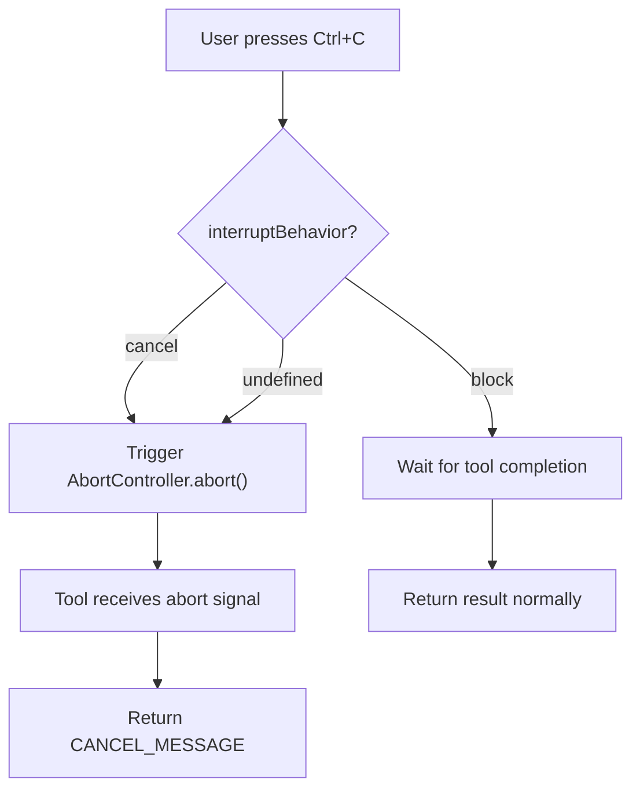
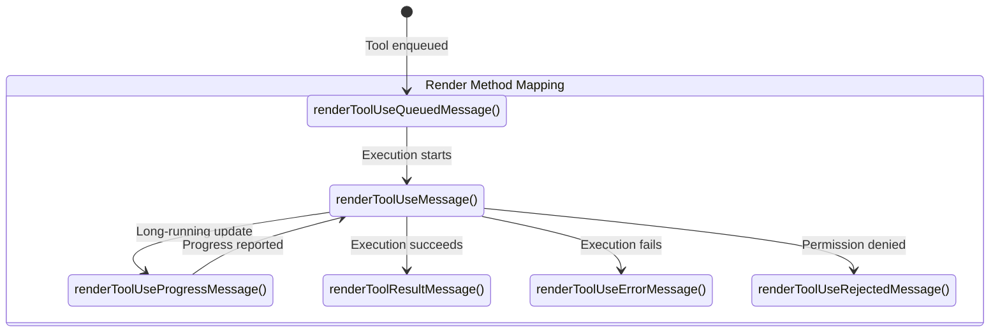
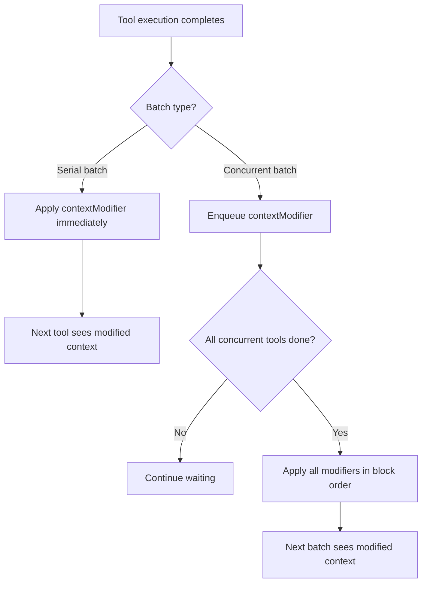
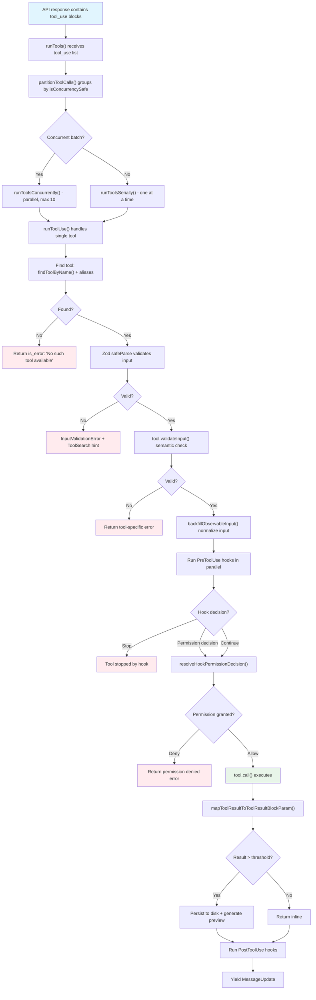

# Chapter 8: Tool Interface -- The Foundation of All Capabilities

> Across Claude Code's 513,522 lines of TypeScript, virtually every externally observable behavior -- reading files, executing commands, searching code, editing files -- ultimately resolves to a single Tool invocation. Tools are not merely the means by which the agent interacts with the outside world; they are the system's type contract, permission boundary, and concurrency scheduling unit. This chapter provides a complete dissection of the `Tool<Input, Output, Progress>` generic interface: every field, every method, every behavioral declaration. From the `buildTool()` factory's fail-closed defaults to the `ToolUseContext` "god object" that threads through every tool execution, to the `ToolResult<T>` contextModifier feedback mechanism.

---

## 8.1 The `Tool<Input, Output, Progress>` Generic Interface: Complete Anatomy

Every tool -- whether a built-in BashTool, a dynamically loaded MCP external tool, or a lazily discovered deferred tool -- must conform to a single generic interface. Defined in `src/Tool.ts`, it is the type contract of the entire tool system.

### 8.1.1 Complete Type Definition

```typescript
export type Tool<
  Input extends AnyObject = AnyObject,
  Output = unknown,
  P extends ToolProgressData = ToolProgressData,
> = {
  // --- Identity ---
  readonly name: string
  aliases?: string[]                    // Backwards compatibility for renamed tools
  searchHint?: string                   // 3-10 word phrase for ToolSearch keyword matching

  // --- Schema ---
  readonly inputSchema: Input           // Zod schema for input validation
  readonly inputJSONSchema?: ToolInputJSONSchema  // MCP tools: raw JSON Schema
  outputSchema?: z.ZodType<unknown>     // Optional output schema

  // --- Core execution ---
  call(
    args: z.infer<Input>,
    context: ToolUseContext,
    canUseTool: CanUseToolFn,
    parentMessage: AssistantMessage,
    onProgress?: ToolCallProgress<P>,
  ): Promise<ToolResult<Output>>

  // --- Permission & Validation ---
  validateInput?(input: z.infer<Input>, context: ToolUseContext): Promise<ValidationResult>
  checkPermissions(input: z.infer<Input>, context: ToolUseContext): Promise<PermissionResult>
  preparePermissionMatcher?(input: z.infer<Input>): Promise<(pattern: string) => boolean>

  // --- Behavioral declarations ---
  isEnabled(): boolean
  isConcurrencySafe(input: z.infer<Input>): boolean
  isReadOnly(input: z.infer<Input>): boolean
  isDestructive?(input: z.infer<Input>): boolean
  interruptBehavior?(): 'cancel' | 'block'
  isSearchOrReadCommand?(input: z.infer<Input>):
    { isSearch: boolean; isRead: boolean; isList?: boolean }
  isOpenWorld?(input: z.infer<Input>): boolean
  requiresUserInteraction?(): boolean
  inputsEquivalent?(a: z.infer<Input>, b: z.infer<Input>): boolean

  // --- Descriptors / Prompts ---
  description(input: z.infer<Input>, options: { ... }): Promise<string>
  prompt(options: {
    getToolPermissionContext: () => Promise<ToolPermissionContext>
    tools: Tools
    agents: AgentDefinition[]
    allowedAgentTypes?: string[]
  }): Promise<string>
  userFacingName(input: Partial<z.infer<Input>> | undefined): string
  userFacingNameBackgroundColor?(input: ...): keyof Theme | undefined
  getToolUseSummary?(input: ...): string | null
  getActivityDescription?(input: ...): string | null
  toAutoClassifierInput(input: z.infer<Input>): unknown

  // --- Result handling ---
  maxResultSizeChars: number
  mapToolResultToToolResultBlockParam(
    content: Output, toolUseID: string
  ): ToolResultBlockParam
  backfillObservableInput?(input: Record<string, unknown>): void
  getPath?(input: z.infer<Input>): string

  // --- Rendering ---
  renderToolUseMessage(input: Partial<z.infer<Input>>, options: { ... }): React.ReactNode
  renderToolResultMessage?( ... ): React.ReactNode
  renderToolUseProgressMessage?( ... ): React.ReactNode
  renderToolUseQueuedMessage?(): React.ReactNode
  renderToolUseRejectedMessage?( ... ): React.ReactNode
  renderToolUseErrorMessage?( ... ): React.ReactNode
  renderGroupedToolUse?( ... ): React.ReactNode | null
  renderToolUseTag?(input: ...): React.ReactNode
  isResultTruncated?(output: Output): boolean
  extractSearchText?(out: Output): string
  isTransparentWrapper?(): boolean

  // --- Deferred / Lazy loading ---
  readonly shouldDefer?: boolean
  readonly alwaysLoad?: boolean

  // --- MCP/LSP flags ---
  isMcp?: boolean
  isLsp?: boolean
  mcpInfo?: { serverName: string; toolName: string }

  // --- Strict mode ---
  readonly strict?: boolean
}
```

### 8.1.2 The Three Generic Parameters

The three generic parameters of `Tool<Input, Output, P>` each serve a distinct purpose:

| Parameter | Constraint | Purpose |
|-----------|-----------|---------|
| `Input extends AnyObject` | Must be a Zod object type | Defines the tool's input schema; `z.infer<Input>` derives the runtime type |
| `Output = unknown` | Unconstrained | The data type of the tool's execution result, wrapped by `ToolResult<Output>` |
| `P extends ToolProgressData` | Progress data union type | The progress type reported during long-running execution (e.g., `BashProgress`) |

This design makes every tool's input validation, output serialization, and progress reporting end-to-end type-safe. Type mismatches are caught at compile time.

---

## 8.2 Core Methods: From Execution to Validation

### 8.2.1 `call()` -- The Execution Entry Point

```typescript
call(
  args: z.infer<Input>,
  context: ToolUseContext,
  canUseTool: CanUseToolFn,
  parentMessage: AssistantMessage,
  onProgress?: ToolCallProgress<P>,
): Promise<ToolResult<Output>>
```

`call()` is the tool's core execution method. It accepts five parameters:

1. **args**: Input data validated through the Zod schema.
2. **context**: The `ToolUseContext`, providing global state, file cache, abort signal, and more (see Section 8.7).
3. **canUseTool**: A permission callback for nested tool calls within the tool's execution.
4. **parentMessage**: The assistant message that triggered this invocation, used for context correlation.
5. **onProgress**: An optional progress callback. Long-running tools (e.g., BashTool) use it to stream execution progress.

The return type `Promise<ToolResult<Output>>` carries not only the tool's execution result but also optional context modifiers and new messages (see Section 8.8).

### 8.2.2 `description()` and `prompt()`

```typescript
description(input: z.infer<Input>, options: { ... }): Promise<string>
prompt(options: { ... }): Promise<string>
```

These two methods serve different consumers:

- **`description()`** is a user-facing short summary, typically displayed in the UI's tool-use label. It receives the tool input, enabling dynamic generation (e.g., BashTool displaying a command summary).
- **`prompt()`** is instruction text injected into the system prompt, telling the model how to correctly use this tool. It does not receive specific input; instead, it receives global configuration (permission context, available tools, agent definitions).

### 8.2.3 `checkPermissions()` and `validateInput()`

```typescript
checkPermissions(input: z.infer<Input>, context: ToolUseContext): Promise<PermissionResult>
validateInput?(input: z.infer<Input>, context: ToolUseContext): Promise<ValidationResult>
```

Validation and permission checking execute in strict order within the execution pipeline:

1. **Zod schema validation** (framework level) -- structural validation
2. **`validateInput()`** (tool level) -- semantic validation, e.g., FileEditTool checking whether the file exists and `old_string` is unique
3. **Pre-hook execution** -- external hooks may issue permission decisions
4. **`checkPermissions()`** (tool level) -- final permission adjudication

`ValidationResult` is a clean discriminated union:

```typescript
type ValidationResult =
  | { result: true }
  | { result: false; message: string; errorCode: number }
```

---

## 8.3 Metadata Declarations: Static Description of Behavioral Semantics

The most insightful design within the Tool interface is a set of **behavioral declaration methods**. These methods execute no business logic; instead, they declare the tool's behavioral characteristics to the scheduler, which uses them to make concurrency, interruption, and permission decisions.

### 8.3.1 `isConcurrencySafe(input)` -- Concurrency Safety Declaration

```typescript
isConcurrencySafe(input: z.infer<Input>): boolean
```

This is the primary input for concurrency scheduling. When the model requests multiple tool calls in a single turn, `partitionToolCalls()` in `toolOrchestration.ts` uses this declaration to partition tools into concurrent and serial batches:

| Tool | isConcurrencySafe | Rationale |
|------|------------------|-----------|
| FileReadTool | `true` | Pure read, no side effects |
| GlobTool | `true` | Pure search |
| GrepTool | `true` | Pure search |
| WebFetchTool | `true` | Network read |
| BashTool | `this.isReadOnly(input)` | Only read-only commands run concurrently |
| FileEditTool | `false` (default) | Writes files; must be serial |

**Key design decision**: The `buildTool()` default is `false`. A tool that forgets to declare concurrency safety is conservatively treated as unsafe and will never be accidentally executed in parallel.

### 8.3.2 `isReadOnly(input)` -- Read-Only Declaration

```typescript
isReadOnly(input: z.infer<Input>): boolean
```

Marks whether a tool invocation produces side effects. Read-only tools receive more lenient treatment in the permission system. For BashTool, this declaration is implemented by the `checkReadOnlyConstraints()` function, which parses the shell command and checks whether it consists solely of read-type commands (e.g., `cat`, `ls`, `git status`).

### 8.3.3 `isDestructive(input)` -- Destructive Operation Declaration

```typescript
isDestructive?(input: z.infer<Input>): boolean
```

A stronger semantic marker than `isReadOnly`. Destructive operations (e.g., `rm -rf`, `git push --force`) receive additional scrutiny in the permission system. This method is optional; `buildTool()` defaults it to `false`.

### 8.3.4 `interruptBehavior()` -- Interruption Strategy

```typescript
interruptBehavior?(): 'cancel' | 'block'
```

When the user presses Ctrl+C during tool execution:
- **`'cancel'`**: Immediately cancel tool execution (the default behavior).
- **`'block'`**: Block the interrupt and wait for the tool to complete (used for operations that cannot be safely interrupted).



---

## 8.4 UI Rendering Protocol

The Tool interface defines a complete UI rendering protocol with a dedicated rendering method for each lifecycle phase. This allows the CLI's React/Ink rendering layer to provide customized display for every tool.

### 8.4.1 Rendering Methods Overview



### 8.4.2 Rendering Method Responsibilities

| Method | Required/Optional | Trigger | Typical Use |
|--------|------------------|---------|-------------|
| `renderToolUseMessage` | **Required** | When tool invocation begins | Display tool name, input parameter summary |
| `renderToolResultMessage` | Optional | After successful execution | Display result (e.g., file content, search results) |
| `renderToolUseProgressMessage` | Optional | During long-running execution | Display progress (e.g., BashTool output stream) |
| `renderToolUseQueuedMessage` | Optional | When tool is waiting in a concurrent queue | Display waiting state |
| `renderToolUseRejectedMessage` | Optional | When permission is denied | Display rejection reason |
| `renderToolUseErrorMessage` | Optional | When execution errors | Display error information |
| `renderGroupedToolUse` | Optional | When multiple same-type tools are grouped | Merge multiple Grep calls into a single result panel |
| `renderToolUseTag` | Optional | During tool tag rendering | Customize tag appearance (e.g., background color) |

### 8.4.3 `renderGroupedToolUse` -- Grouped Rendering

```typescript
renderGroupedToolUse?( ... ): React.ReactNode | null
```

This is an advanced rendering optimization. When the model issues multiple tool calls of the same type in a single turn (e.g., five Grep searches), `renderGroupedToolUse` can merge them into a single compact UI component rather than displaying each individually. Returning `null` forfeits grouping and falls back to individual rendering.

---

## 8.5 The `buildTool()` Factory Pattern and Fail-Closed Safe Defaults

### 8.5.1 Design Motivation

`buildTool()` is the sole factory function for creating `Tool` instances (defined in `src/Tool.ts`). It solves a critical problem: the Tool interface has dozens of fields, yet most tools need to customize only a handful. `buildTool()` provides safe defaults for commonly stubbed methods, keeping tool definitions concise while ensuring the resulting Tool objects are always complete.

### 8.5.2 Defaultable Fields and Their Values

```typescript
type DefaultableToolKeys =
  | 'isEnabled'
  | 'isConcurrencySafe'
  | 'isReadOnly'
  | 'isDestructive'
  | 'checkPermissions'
  | 'toAutoClassifierInput'
  | 'userFacingName'
```

Complete defaults table:

| Field | Default Value | Safety Strategy |
|-------|---------------|----------------|
| `isEnabled` | `() => true` | Tools are enabled by default |
| `isConcurrencySafe` | `() => false` | **Fail-closed**: assumes concurrency-unsafe, prevents accidental parallelism |
| `isReadOnly` | `() => false` | **Fail-closed**: assumes write operations, does not skip write permission checks |
| `isDestructive` | `() => false` | Soft default; tools explicitly opt in |
| `checkPermissions` | `(input) => Promise.resolve({ behavior: 'allow', updatedInput: input })` | Defers to the general permission system |
| `toAutoClassifierInput` | `() => ''` | Skips classifier |
| `userFacingName` | `() => def.name` | Derived from tool name |

### 8.5.3 Implementation: Spread Order Determines Priority

```typescript
export function buildTool<D extends AnyToolDef>(def: D): BuiltTool<D> {
  return {
    ...TOOL_DEFAULTS,            // 1. Safe defaults as the base layer
    userFacingName: () => def.name,  // 2. Dynamic name default
    ...def,                      // 3. Author's definition overrides everything
  } as BuiltTool<D>
}
```

JavaScript's object spread semantics guarantee that later-spread properties override earlier ones. Any field the tool author provides overrides the default, while omitted fields receive the safe default.

### 8.5.4 Type-Level Guarantees

```typescript
type BuiltTool<D> = Omit<D, DefaultableToolKeys> & {
  [K in DefaultableToolKeys]-?: K extends keyof D
    ? undefined extends D[K] ? ToolDefaults[K] : D[K]
    : ToolDefaults[K]
}
```

The `-?` modifier removes optionality: all `DefaultableToolKeys` in `BuiltTool` become required fields. The TypeScript compiler guarantees that `buildTool()`'s return value is always a complete Tool at the type level -- callers never need undefined checks.

---

## 8.6 Zod Schema Validation Integration

### 8.6.1 The Two-Tier Input Validation Architecture

Tool input validation operates across two tiers:

**Tier 1: Zod schema structural validation**

```typescript
const parsedInput = tool.inputSchema.safeParse(toolUse.input)
if (!parsedInput.success) {
  // Generate InputValidationError
  // For deferred tools, append ToolSearch hint
}
```

In the `checkPermissionsAndCallTool()` pipeline, Zod validation is the first gate. It validates types, required fields, and basic constraints.

**Tier 2: Tool-specific semantic validation**

```typescript
if (tool.validateInput) {
  const validation = await tool.validateInput(parsedInput.data, context)
  if (!validation.result) {
    // Return tool-specific error message
  }
}
```

After passing Zod validation, a tool may optionally perform semantic validation. For example, FileEditTool's `validateInput` performs 11 checks:

1. Team memory secret detection
2. `old_string === new_string` rejection
3. Deny rule matching for file path
4. UNC path security check (Windows NTLM credential leak prevention)
5. File size limit (1 GiB)
6. File existence check (new file creation via empty `old_string`)
7. Notebook file detection (redirect to NotebookEditTool)
8. Read-before-write enforcement (`readFileState` cache)
9. File modification timestamp check
10. String-to-replace existence and uniqueness
11. Settings file validation

### 8.6.2 Semantic Type Coercers

Models sometimes emit numbers or booleans as strings. Claude Code handles this with semantic coercers:

```typescript
semanticNumber(z.number().optional())   // "123" -> 123
semanticBoolean(z.boolean().optional()) // "true" -> true
```

These wrapper functions are used extensively in BashTool's `timeout`, `run_in_background`, and `dangerouslyDisableSandbox` fields.

### 8.6.3 Deferred Schemas and the ToolSearch Protocol

When the tool count exceeds a threshold, Claude Code switches to "deferred tools" mode. Deferred tools send only their name to the API (`defer_loading: true`), and the model must call `ToolSearch` to load the full schema before use:

```typescript
export function isDeferredTool(tool: Tool): boolean {
  if (tool.alwaysLoad === true) return false    // Explicit opt-out
  if (tool.isMcp === true) return true           // MCP tools always deferred
  if (tool.name === TOOL_SEARCH_TOOL_NAME) return false  // Cannot defer itself
  return tool.shouldDefer === true
}
```

When the model attempts to call a deferred tool without loading its schema, the system appends a hint to the Zod validation error:

```
This tool's schema was not sent to the API...
Load the tool first: call ToolSearch with query "select:ToolName"
```

---

## 8.7 ToolUseContext -- The God Object Bridging Tools and Global State

### 8.7.1 Why ToolUseContext Exists

Every tool invocation needs access to a wide range of external state: abort signals, file caches, permission configuration, MCP clients, UI callbacks. Rather than having `call()` accept dozens of parameters, all runtime context is encapsulated into a single object -- this is `ToolUseContext`.

### 8.7.2 Key Fields Explained

```typescript
export type ToolUseContext = {
  // --- Core options ---
  options: {
    tools: Tools                        // Currently available tool list
    mainLoopModel: string               // Current model (e.g., "claude-sonnet-4-20250514")
    mcpClients: MCPServerConnection[]   // Connected MCP servers
    isNonInteractiveSession: boolean    // Non-interactive session (CI/CD)
    debug: boolean                      // Debug mode flag
    verbose: boolean                    // Verbose output flag
    maxBudgetUsd?: number               // Budget ceiling
    refreshTools?: () => Tools          // Dynamic tool list refresh
  }

  // --- State management ---
  abortController: AbortController      // Global abort signal
  readFileState: FileStateCache          // File read cache; basis for read-before-write
  getAppState(): AppState                // Get global app state (immutable snapshot)
  setAppState(f: (prev: AppState) => AppState): void  // Functional state updater

  // --- UI interaction ---
  setToolJSX?: SetToolJSXFn             // Inject tool JSX into the UI
  addNotification?: (notif: Notification) => void  // Send notification
  sendOSNotification?: (opts: { ... }) => void     // OS-level notification
  handleElicitation?: ( ... ) => Promise<ElicitResult>  // Request user input

  // --- Messages & tracking ---
  messages: Message[]                    // Full message history of current conversation
  setInProgressToolUseIDs: (f: (prev: Set<string>) => Set<string>) => void
  setResponseLength: (f: (prev: number) => number) => void
  updateFileHistoryState: ( ... ) => void  // File history tracking (undo support)
  updateAttributionState: ( ... ) => void  // Attribution state tracking

  // --- Agent & Skill ---
  agentId?: AgentId                      // Current agent ID (sub-agent scenarios)
  agentType?: string                     // Agent type
  nestedMemoryAttachmentTriggers?: Set<string>  // Nested memory triggers
  dynamicSkillDirTriggers?: Set<string>         // Dynamic skill directory triggers

  // --- Limits & quotas ---
  fileReadingLimits?: { maxTokens?: number; maxSizeBytes?: number }
  globLimits?: { maxResults?: number }
  contentReplacementState?: ContentReplacementState  // Result budget management

  // --- Permission cache ---
  toolDecisions?: Map<string, {
    source: string
    decision: 'accept' | 'reject'
    timestamp: number
  }>
}
```

### 8.7.3 Immutable-by-Convention and Functional Updaters

`ToolUseContext` is immutable by convention. State modifications flow through functional updaters:

```typescript
// Do not mutate directly:
// context.appState.something = newValue  // Wrong!

// Use functional updaters:
context.setAppState(prev => ({
  ...prev,
  something: newValue,
}))
```

This pattern ensures:
1. **Concurrency safety**: Multiple tools can safely "read" the same context because they see snapshots.
2. **Traceability**: State changes propagate through the `contextModifier` chain, aiding debugging.
3. **Composability**: Serial tools can see the state modifications of the preceding tool.

### 8.7.4 `readFileState` -- The Foundation of Read-Before-Write

`readFileState: FileStateCache` is the mechanism by which Claude Code enforces its "read before write" policy. FileEditTool's `validateInput` checks whether the target file is already cached in `readFileState`:

- If not cached, the edit is rejected and the model is prompted to read the file first.
- If cached, the file's modification timestamp is also compared to detect external modifications.

This prevents the model from blindly overwriting files without understanding their current contents.

---

## 8.8 `ToolResult<T>` Return Type and the contextModifier Pattern

### 8.8.1 Type Definition

```typescript
export type ToolResult<T> = {
  data: T
  newMessages?: (UserMessage | AssistantMessage | AttachmentMessage | SystemMessage)[]
  contextModifier?: (context: ToolUseContext) => ToolUseContext
  mcpMeta?: {
    _meta?: Record<string, unknown>
    structuredContent?: Record<string, unknown>
  }
}
```

### 8.8.2 Three Return Channels

`ToolResult<T>` is not merely a data container; it is the tool execution's three-channel return mechanism:

**Channel 1: `data`** -- The tool's core execution result, typed by the generic `T`. For example, BashTool returns `{ stdout, stderr, interrupted, ... }`, GlobTool returns `{ filenames, numFiles, truncated, ... }`.

**Channel 2: `newMessages`** -- A tool can inject new messages into the conversation history. This supports scenarios where tool execution triggers a system prompt update or needs to feed additional context to the model.

**Channel 3: `contextModifier`** -- The most elegant design element. A tool can return a pure function that modifies the `ToolUseContext` for subsequent tool executions.

### 8.8.3 Concurrency Semantics of contextModifier

The timing of `contextModifier` application depends on the tool's batch membership:



This is a critical design trade-off:

- **Serial batches**: `contextModifier` propagates immediately between tools, allowing one tool's side effects to influence the next tool's execution environment.
- **Concurrent batches**: `contextModifier` calls are queued and applied in block order only after all concurrent tools complete, ensuring concurrent tools see a consistent context snapshot.

### 8.8.4 Result Budgeting and Large Result Persistence

Tool results are not unbounded. Each tool declares `maxResultSizeChars`:

| Tool | maxResultSizeChars | Rationale |
|------|-------------------|-----------|
| BashTool | 30,000 | Moderate output |
| FileReadTool | **Infinity** | Self-bounds via token limits; persistence would cause a circular Read loop |
| FileEditTool | 100,000 | Diffs can be large |
| GlobTool | 100,000 | Many file paths |
| GrepTool | 20,000 | Bounded by head_limit default of 250 |
| WebFetchTool | 100,000 | Web pages can be large |

Results exceeding their threshold are persisted to disk, with only a preview retained in the API payload:

```
<persisted-output>
Output too large (42.3 KB). Full output saved to: /path/to/file.txt

Preview (first 2.0 KB):
[first 2000 bytes of content]
...
</persisted-output>
```

---

## 8.9 The Complete Tool Lifecycle

Connecting all the components above, the complete lifecycle of a single tool invocation unfolds as follows:



---

## 8.10 Design Philosophy Summary

Claude Code's Tool interface design embodies several core philosophical commitments:

**Fail-Closed by Default.** The `buildTool()` factory always selects the safer option. Forgot to declare concurrency safety? Serial execution. Forgot to declare read-only? Treated as a write operation. This eliminates an entire class of concurrency and permission bugs.

**Declarative Behavioral Description.** Tools do not decide how they are scheduled through `if` branches. Instead, they declare their behavioral characteristics through `isConcurrencySafe`, `isReadOnly`, `isDestructive`, and other methods. The scheduler retains final decision authority. This separation of concerns keeps individual tools simple and the scheduling logic centralized.

**Unidirectional Context Flow.** `ToolUseContext` flows from the scheduler to the tool. Tools feed state changes back to the scheduler through `contextModifier`. There is no global mutable state, no implicit sharing. This makes the system's data flow explicit and traceable.

**Rendering-Logic Separation.** The Tool interface cleanly separates business logic (`call`) from UI rendering (the `renderToolUseMessage` family). The same tool can run in a CLI, a web UI, or a headless mode -- only the rendering implementation changes.

**Progressive Complexity.** Through the `buildTool()` factory, optional methods (the `?` modifier), and safe defaults, a minimal tool definition requires only four fields: `name`, `inputSchema`, `call`, and `renderToolUseMessage`. A full production-grade tool can exercise precise control over every behavioral declaration in the interface. This gradient from simple to sophisticated enables the tool system to scale from quick prototypes to the 30+ tools running concurrently in production -- the foundational requirement of an engineering-grade AI agent system.
