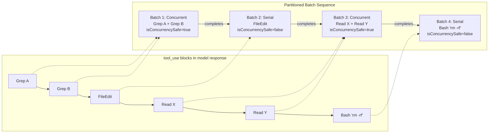
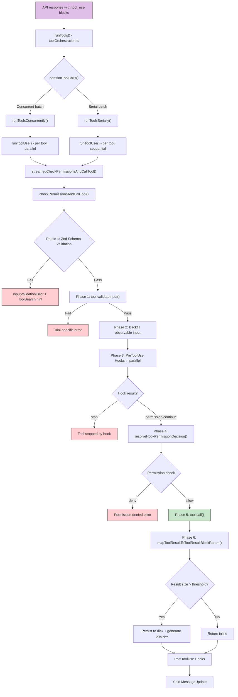
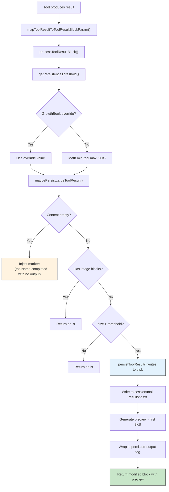

# Chapter 9: Tool Execution Engine

> When Claude's response contains five tool_use blocks -- two Greps, one FileEdit, two Reads -- how should they execute? Which can run in parallel? Which must run serially? If one tool returns 200KB of output, how does the context window absorb it? The answers live inside Claude Code's Tool Execution Engine: a precise pipeline built across two files, `toolOrchestration.ts` and `toolExecution.ts`. This chapter begins with the concurrency partitioning strategy, then walks through the full 20-step execution pipeline, the streaming concurrent executor, the result budgeting system, and the error recovery machinery.

---

## 9.1 Tool Orchestration: The Concurrency Partitioning Strategy in `toolOrchestration.ts`

### 9.1.1 The Problem

A single API response may contain multiple `tool_use` blocks. Naive serial execution wastes time. Naive concurrent execution invites race conditions -- two FileEdits modifying the same file simultaneously produce unpredictable results. Claude Code needs a strategy that maximizes concurrency while guaranteeing safety.

The solution is a **concurrency partitioning algorithm**.

### 9.1.2 The Partitioning Algorithm

`partitionToolCalls()` is the core of the orchestration layer. It takes a sequence of `ToolUseBlock` values and, based on each tool's `isConcurrencySafe()` declaration, partitions them into an ordered sequence of batches:

```typescript
function partitionToolCalls(
  toolUseMessages: ToolUseBlock[],
  toolUseContext: ToolUseContext,
): Batch[] {
  return toolUseMessages.reduce((acc: Batch[], toolUse) => {
    const tool = findToolByName(toolUseContext.options.tools, toolUse.name)
    const parsedInput = tool?.inputSchema.safeParse(toolUse.input)
    const isConcurrencySafe = parsedInput?.success
      ? tool?.isConcurrencySafe(parsedInput.data) ?? false
      : false
    if (isConcurrencySafe && acc[acc.length - 1]?.isConcurrencySafe) {
      acc[acc.length - 1]!.blocks.push(toolUse)  // Merge into current batch
    } else {
      acc.push({ isConcurrencySafe, blocks: [toolUse] })  // Start new batch
    }
    return acc
  }, [])
}
```

The algorithm is compact, but its design decisions deserve attention:

1. **Consecutive merging**: Adjacent concurrency-safe tools are merged into a single batch. The moment a non-safe tool appears, the batch is cut and a new serial batch begins.
2. **Fail-closed default**: When `isConcurrencySafe()` throws (e.g., shell-quote parse failure), the result defaults to `false`. When a tool omits this method entirely, `buildTool()` supplies a default of `false`.
3. **Input-dependent safety**: Note that `isConcurrencySafe` receives `parsedInput.data` as its argument. BashTool's concurrency safety depends on command content -- only read-only commands (like `cat`, `ls`, `git status`) are marked safe.

### 9.1.3 Partitioning Visualized

Consider a model response containing six tool_use blocks:



Batches execute strictly in order. Within a batch, concurrent batches use `all()` for parallel execution, and serial batches use `for...of` for sequential execution.

### 9.1.4 Concurrency Safety Declarations by Tool

The following table summarizes the core tool safety declarations:

| Tool | `isConcurrencySafe` | `isReadOnly` | Rationale |
|------|---------------------|-------------|-----------|
| BashTool | `this.isReadOnly(input)` | via `checkReadOnlyConstraints` | Only read-only commands run concurrently |
| FileReadTool | `true` | `true` | Pure read operation |
| FileEditTool | `false` (default) | `false` (default) | Writes files, potential conflicts |
| FileWriteTool | `false` (default) | `false` (default) | Writes files |
| GlobTool | `true` | `true` | Pure search |
| GrepTool | `true` | `true` | Pure search |
| WebFetchTool | `true` | `true` | Network read-only |
| AgentTool | `false` (default) | `false` (default) | Subagents have side effects |

The `buildTool()` defaults are **fail-closed**: a tool that forgets to declare `isConcurrencySafe` is treated as serial-only; a tool that forgets `isReadOnly` is treated as a write. This prevents accidental concurrent writes.

---

## 9.2 The 20-Step Execution Pipeline

`checkPermissionsAndCallTool()` is the heart of the execution engine -- a roughly 600-line function in `toolExecution.ts`. Every tool invocation traverses the full pipeline.

### 9.2.1 Pipeline Overview



### 9.2.2 Phase 1: Input Validation (Steps 1-2)

**Step 1 -- Zod schema validation**: The model-provided JSON input is validated via `inputSchema.safeParse()`. If validation fails and the tool is a deferred tool (its schema was never sent to the model), the system appends a ToolSearch guidance hint to the error:

```typescript
export function buildSchemaNotSentHint(tool, messages, tools): string | null {
  if (!isDeferredTool(tool)) return null
  const discovered = extractDiscoveredToolNames(messages)
  if (discovered.has(tool.name)) return null
  return `This tool's schema was not sent to the API...
    Load the tool first: call ${TOOL_SEARCH_TOOL_NAME} with query "select:${tool.name}"`
}
```

**Step 2 -- Tool-specific validation**: Calls `tool.validateInput()`. FileEditTool, for example, performs 11 checks at this stage: secret detection, old_string === new_string rejection, file existence, read-before-write enforcement, string uniqueness, and more.

### 9.2.3 Phase 2: Input Preparation (Steps 3-5)

**Step 3 -- Speculative Bash classifier launch**: For BashTool, the classifier check starts before hooks run, overlapping the classifier's network roundtrip with hook execution to reduce latency:

```typescript
if (tool.name === BASH_TOOL_NAME) {
  startSpeculativeClassifierCheck(
    command, toolPermissionContext, signal, isNonInteractiveSession
  )
}
```

**Step 4 -- Defensive cleanup**: Strips `_simulatedSedEdit` from the model's input. This field is internal-only; stripping it is a defense-in-depth measure.

**Step 5 -- Observable input backfill**: Creates a shallow clone of the input and backfills derived fields (such as absolute paths) on the clone for use by hooks and permission checks. The original input is preserved for `tool.call()` and result recording, maintaining transcript stability.

### 9.2.4 Phase 3: Pre-Tool Hooks (Step 6)

**Step 6**: All `PreToolUse` hooks execute in parallel. A hook can return four kinds of results:

- **hookPermissionResult**: Override the permission decision (allow/deny)
- **hookUpdatedInput**: Modify the tool's input
- **preventContinuation**: Allow execution but block subsequent model loop iterations
- **stop**: Terminate tool execution immediately

Hook progress flows through the same progress pipeline. Hooks exceeding 500ms (`HOOK_TIMING_DISPLAY_THRESHOLD_MS`) have their timing displayed inline in the UI.

### 9.2.5 Phase 4: Permission Resolution (Steps 7-10)

**Step 7**: Open an OTel tool span for execution tracing.

**Step 8**: `resolveHookPermissionDecision()` merges the hook permission result with the `canUseTool` interactive check. Hook results take priority over interactive checks.

**Step 9**: Log a `tool_decision` OTel event.

**Step 10**: If permission is denied, generate an error message and fire `PermissionDenied` hooks.

### 9.2.6 Phase 5: Tool Execution (Steps 11-14)

**Step 11 -- Input reconciliation**: If hooks did not modify `file_path`, restore the model's original path.

**Step 12**: Start session activity tracking.

**Step 13 -- Core call**: Execute `tool.call(args, context, canUseTool, parentMessage, onProgress)`. The `onProgress` callback allows the tool to push progress updates during execution.

**Step 14**: Record execution duration.

### 9.2.7 Phase 6: Post-Execution (Steps 15-20)

**Step 15**: Call `mapToolResultToToolResultBlockParam()` to convert tool output into the API format.

**Step 16**: Process large results through disk persistence (detailed in Section 9.5).

**Step 17**: Attach accept feedback and content blocks from the permission decision.

**Step 18**: Run `PostToolUse` hooks. For MCP tools, hooks may modify the output content.

**Step 19**: Inject `newMessages` from the tool result into the message stream.

**Step 20**: Handle the `shouldPreventContinuation` flag set by pre-hooks.

---

## 9.3 `StreamingToolExecutor`: Streaming Concurrent Execution

### 9.3.1 Bridging Async to Streaming

`checkPermissionsAndCallTool()` is an async function returning `Promise<MessageUpdateLazy[]>`, but the orchestration layer needs `AsyncIterable<MessageUpdateLazy>` for streaming UI updates. `streamedCheckPermissionsAndCallTool()` provides the bridge:

```typescript
function streamedCheckPermissionsAndCallTool(
  ...
): AsyncIterable<MessageUpdateLazy> {
  const stream = new Stream<MessageUpdateLazy>()
  checkPermissionsAndCallTool(
    ...,
    progress => {
      stream.enqueue({
        message: createProgressMessage({ ... })
      })
    },
  )
    .then(results => {
      for (const r of results) stream.enqueue(r)
    })
    .catch(error => { stream.error(error) })
    .finally(() => { stream.done() })
  return stream
}
```

`Stream` is a custom async iterable -- essentially a channel with enqueue/done/error methods. It decouples the producer (tool execution) from the consumer (UI rendering) asynchronously.

### 9.3.2 The Top-Level Entry: `runTools()`

`runTools()` is the engine's top-level entry point. It is an AsyncGenerator that yields `MessageUpdate` events in batch order:

```typescript
export async function* runTools(
  toolUseMessages: ToolUseBlock[],
  assistantMessages: AssistantMessage[],
  canUseTool: CanUseToolFn,
  toolUseContext: ToolUseContext,
): AsyncGenerator<MessageUpdate, void> {
  let currentContext = toolUseContext
  for (const { isConcurrencySafe, blocks } of partitionToolCalls(...)) {
    if (isConcurrencySafe) {
      for await (const update of runToolsConcurrently(...)) { ... }
      // Apply queued context modifiers in block order
    } else {
      for await (const update of runToolsSerially(...)) { ... }
    }
  }
}
```

### 9.3.3 The Concurrent Execution Path

```typescript
async function* runToolsConcurrently(...) {
  yield* all(
    toolUseMessages.map(async function* (toolUse) { ... }),
    getMaxToolUseConcurrency(),  // Default: 10
  )
}
```

`all()` is a helper from `utils/generators.ts` that runs multiple AsyncGenerators concurrently up to a specified limit, interleaving their outputs into a single stream. The concurrency limit is configurable via the `CLAUDE_CODE_MAX_TOOL_USE_CONCURRENCY` environment variable, defaulting to 10.

### 9.3.4 The Serial Path and Context Modifiers

```typescript
async function* runToolsSerially(...) {
  let currentContext = toolUseContext
  for (const toolUse of toolUseMessages) {
    for await (const update of runToolUse(...)) {
      if (update.contextModifier) {
        currentContext = update.contextModifier.modifyContext(currentContext)
      }
      yield { message: update.message, newContext: currentContext }
    }
  }
}
```

**The critical difference**: In the serial path, context modifiers are applied immediately after each tool completes. In the concurrent path, modifiers are queued and applied in original block order after the entire batch finishes.

This design guarantees that one tool's side effects are immediately visible to subsequent serial tools, while concurrent tools remain isolated from each other's mutations.

---

## 9.4 The Concurrency Model in Depth

### 9.4.1 Context Modifier Queuing Semantics

The `ToolResult<T>` type includes an optional `contextModifier` field:

```typescript
export type ToolResult<T> = {
  data: T
  newMessages?: Message[]
  contextModifier?: (context: ToolUseContext) => ToolUseContext
}
```

Context modifiers are the sole mechanism by which tool execution feeds state changes back into the execution environment. Typical use cases include:

- FileEditTool updating the `readFileState` cache
- Hooks modifying the `toolDecisions` map
- MCP tools updating `mcpClients` status

Within a concurrent batch, if two tools modify the same context field simultaneously, the earlier-finishing tool's modification would be overwritten by the later one. Queuing and applying in block order after completion ensures determinism.

### 9.4.2 BashTool's Dynamic Concurrency

BashTool is the only built-in tool whose `isConcurrencySafe` depends on input content. Its implementation chain is:

```
isConcurrencySafe(input)
  -> isReadOnly(input)
    -> checkReadOnlyConstraints(command)
```

`checkReadOnlyConstraints` uses shell-quote to parse the command and compares it against predefined command classification sets:

```typescript
BASH_SEARCH_COMMANDS = ['find', 'grep', 'rg', 'ag', 'ack', 'locate', ...]
BASH_READ_COMMANDS   = ['cat', 'head', 'tail', 'less', 'more', 'wc', ...]
BASH_LIST_COMMANDS   = ['ls', 'tree', 'du']
```

Only commands that fully match entries in these sets are marked read-only. A compound command like `ls -la && rm file` is marked non-read-only because of the `rm`, placing it in a serial batch.

### 9.4.3 Concurrency Limit and Backpressure

The concurrency limit defaults to 10 and is configurable via environment variable:

```typescript
function getMaxToolUseConcurrency(): number {
  return parseInt(
    process.env.CLAUDE_CODE_MAX_TOOL_USE_CONCURRENCY || '', 10
  ) || 10
}
```

The `all()` helper implements semaphore semantics: when the number of active generators reaches the limit, new generators wait until a running generator yields or completes. This provides natural backpressure.

---

## 9.5 The Result Budgeting System

### 9.5.1 The Problem

An LLM's context window is finite. If a `grep` command returns 500KB of matches, sending the full result into the prompt would exhaust the token budget rapidly. Claude Code's result budgeting system addresses this through layered thresholds and disk persistence.

### 9.5.2 Constants Table

| Constant | Value | Purpose |
|----------|-------|---------|
| `DEFAULT_MAX_RESULT_SIZE_CHARS` | 50,000 | Global default persistence threshold |
| `MAX_TOOL_RESULT_TOKENS` | 100,000 | Per-result token cap |
| `BYTES_PER_TOKEN` | 4 | Token-to-byte conversion factor |
| `MAX_TOOL_RESULT_BYTES` | 400,000 | Per-result byte cap |
| `MAX_TOOL_RESULTS_PER_MESSAGE_CHARS` | 200,000 | Per-message aggregate result cap |
| `TOOL_SUMMARY_MAX_LENGTH` | 50 | Maximum tool summary length |

### 9.5.3 Per-Tool `maxResultSizeChars` Settings

| Tool | `maxResultSizeChars` | Rationale |
|------|---------------------|-----------|
| BashTool | 30,000 | Moderate output volume |
| FileReadTool | **Infinity** | Self-bounds via maxTokens; persisting would create a circular Read loop |
| FileEditTool | 100,000 | Diffs can be large |
| GlobTool | 100,000 | Many file paths |
| GrepTool | 20,000 | Bounded by head_limit default of 250 |
| WebFetchTool | 100,000 | Web pages can be large |

Note that FileReadTool is set to `Infinity`. This is deliberate: if a read result were persisted to disk, the model would call Read again to access the persisted file, creating an infinite loop. FileReadTool instead self-limits at the source via `maxTokens`.

### 9.5.4 Persistence Threshold Resolution

```typescript
export function getPersistenceThreshold(
  toolName: string,
  declaredMaxResultSizeChars: number,
): number {
  // Infinity = hard opt-out (FileReadTool)
  if (!Number.isFinite(declaredMaxResultSizeChars))
    return declaredMaxResultSizeChars
  // GrowthBook override wins when present
  const override = overrides?.[toolName]
  if (typeof override === 'number' && override > 0)
    return override
  // Clamp to global default
  return Math.min(declaredMaxResultSizeChars, DEFAULT_MAX_RESULT_SIZE_CHARS)
}
```

Three priority tiers: Infinity opt-out > GrowthBook remote override > `min(tool declaration, global default)`.

### 9.5.5 The Disk Persistence Flow



### 9.5.6 Persisted Result Format

When a result is written to disk, the model sees:

```xml
<persisted-output>
Output too large (42.3 KB). Full output saved to: /path/to/session/tool-results/abc123.txt

Preview (first 2.0 KB):
[first 2000 bytes of content]
...
</persisted-output>
```

Files are stored at `{projectDir}/{sessionId}/tool-results/{toolUseId}.{txt|json}`.

### 9.5.7 Empty Result Handling

An empty `tool_result` at the tail of a prompt causes models to emit stop sequences. This is a subtle bug. The fix is to inject a marker for every empty result:

```typescript
if (isToolResultContentEmpty(content)) {
  return {
    ...toolResultBlock,
    content: `(${toolName} completed with no output)`
  }
}
```

### 9.5.8 Aggregate Budget and Content Replacement State

The per-message aggregate result cap is 200,000 characters (`MAX_TOOL_RESULTS_PER_MESSAGE_CHARS`). The system tracks budget usage through `ContentReplacementState`:

```typescript
export type ContentReplacementState = {
  seenIds: Set<string>              // Results that passed the budget check
  replacements: Map<string, string> // Persisted results -> preview strings
}
```

This state has two important properties:

1. **Never reset**: Once a `tool_use_id`'s fate is decided (inline or persisted), the decision is frozen. Stale UUID keys are inert.
2. **Cloned for subagents**: When a subagent is forked, the state is cloned. This ensures that cache-sharing forks make identical decisions, maintaining prompt cache stability.

---

## 9.6 Progress Reporting

### 9.6.1 The Type Hierarchy

```typescript
export type ToolProgress<P extends ToolProgressData> = {
  toolUseID: string
  data: P
}

export type ToolCallProgress<P extends ToolProgressData = ToolProgressData> = (
  progress: ToolProgress<P>,
) => void
```

`ToolProgressData` is a discriminated union containing tool-specific progress variants:

| Type | Key Fields | Typical Use |
|------|-----------|-------------|
| `BashProgress` | output, fullOutput, elapsedTimeSeconds, totalLines, totalBytes | Long-running commands |
| `MCPProgress` | MCP execution progress | MCP tool calls |
| `AgentToolProgress` | Subagent state | Nested agent execution |
| `WebSearchProgress` | Search progress | Web searches |
| `TaskOutputProgress` | Task output stream | Background tasks |
| `SkillToolProgress` | Skill progress | Skill execution |

### 9.6.2 The Progress Flow Path

```
tool.call(onProgress)
  -> streamedCheckPermissionsAndCallTool(onToolProgress)
    -> stream.enqueue(createProgressMessage(...))
      -> runToolsConcurrently/runToolsSerially yields MessageUpdate
        -> UI renders via renderToolUseProgressMessage()
```

BashTool is the primary consumer of progress reporting. It uses a generator pattern to continuously yield progress updates:

```typescript
do {
  generatorResult = await commandGenerator.next();
  if (!generatorResult.done && onProgress) {
    onProgress({
      toolUseID: `bash-progress-${progressCounter++}`,
      data: {
        type: 'bash_progress',
        output: progress.output,
        fullOutput: progress.fullOutput,
        elapsedTimeSeconds: progress.elapsedTimeSeconds,
        totalLines: progress.totalLines,
        totalBytes: progress.totalBytes,
      },
    });
  }
} while (!generatorResult.done);
```

Progress updates are only displayed after the tool has been executing for 2 seconds (`PROGRESS_THRESHOLD_MS = 2000`).

### 9.6.3 Hook Progress and Timing

Pre/Post hooks also emit progress through the same pipeline:

```typescript
for await (const result of runPreToolUseHooks(...)) {
  switch (result.type) {
    case 'message':
      if (result.message.message.type === 'progress') {
        onToolProgress(result.message.message)
      }
      break
  }
}
```

Hook execution time is tracked. When a hook exceeds 500ms (`HOOK_TIMING_DISPLAY_THRESHOLD_MS`), its timing information is displayed inline in the UI.

---

## 9.7 Error Classification and Recovery

### 9.7.1 Error Classification Table

Different pipeline phases produce different error types:

| Phase | Error Type | Result Handling |
|-------|-----------|----------------|
| Tool lookup | Tool not found | `is_error: true`, "No such tool available" |
| Abort signal | AbortError | Returns `CANCEL_MESSAGE` tool_result |
| Zod validation | InputValidationError | `is_error: true`, formatted Zod error |
| Tool validation | ValidationResult.false | `is_error: true`, tool-specific message |
| Permission denied | deny behavior | `is_error: true`, denial message |
| Tool execution | Any Error | `is_error: true`, formatted error message |
| MCP auth | McpAuthError | Updates MCP client status to 'needs-auth' |

### 9.7.2 Recovery Strategy

All errors are converted into `is_error: true` tool_result messages sent back to the model. This design has a critical implication: **the model can recover from errors**. When the model receives an `is_error: true` result, it can:

1. Correct its input parameters and retry
2. Switch to a different tool
3. Report the error to the user and ask for help

MCP authentication errors are the sole exception: they not only return an error message but also update the MCP client's state to `needs-auth`, triggering a re-authentication flow at the UI level.

### 9.7.3 Abort Signal Propagation

`ToolUseContext` carries an `AbortController` whose `signal` threads through the entire pipeline. The system checks `signal.aborted` at multiple checkpoints:

- After tool lookup (post step 1)
- Before hook execution (pre step 6)
- After permission check (post step 10)
- Inside `tool.call()` (tool checks internally)

On abort, the system returns `CANCEL_MESSAGE` rather than an error, signaling to the model that this was a user-initiated cancellation, not an execution failure.

### 9.7.4 Graceful Degradation for Deferred Tools

When the model calls a deferred tool without first loading its schema, Zod validation necessarily fails. But instead of a bare error, the system appends a guidance hint:

```
This tool's schema was not sent to the API.
Load the tool first: call ToolSearch with query "select:ToolName"
```

This design enables model self-repair: in the next loop iteration, the model calls ToolSearch to load the schema, then retries the target tool.

---

## 9.8 Architectural Summary

The Tool Execution Engine embodies several core design principles:

1. **Fail-closed safety**: Defaults assume tools are unsafe, write-capable, and non-concurrent. Safe behavior must be explicitly declared.
2. **Streaming-first**: The entire orchestration layer is built on AsyncGenerators, enabling streaming UI updates and natural backpressure.
3. **Deterministic concurrency**: The partitioning algorithm front-loads concurrency decisions before execution begins. Context modifier queuing semantics ensure determinism within concurrent batches.
4. **Layered budgeting**: The result budgeting system controls context window usage through four layers -- per-tool thresholds, global defaults, remote overrides, and aggregate caps -- preserving sufficient information while preventing context overflow.
5. **Recoverable errors**: All errors are converted into structured tool_result messages returned to the model, giving it the ability to self-repair.

These design choices allow Claude Code to safely execute dozens of concurrent tool calls within a single interaction, while maintaining conversational coherence within a finite context window.
