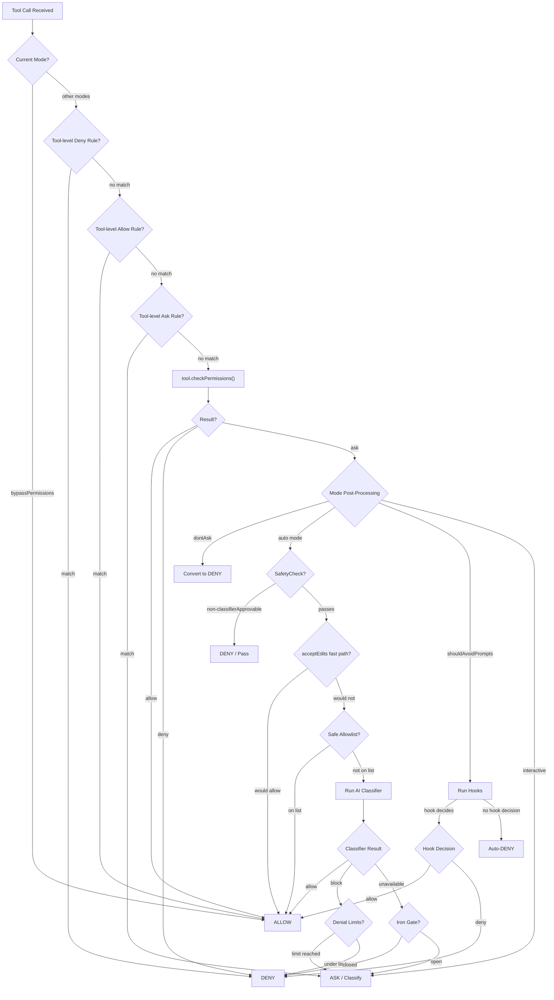
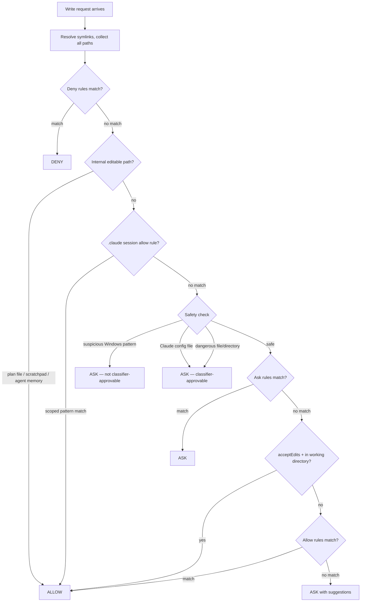
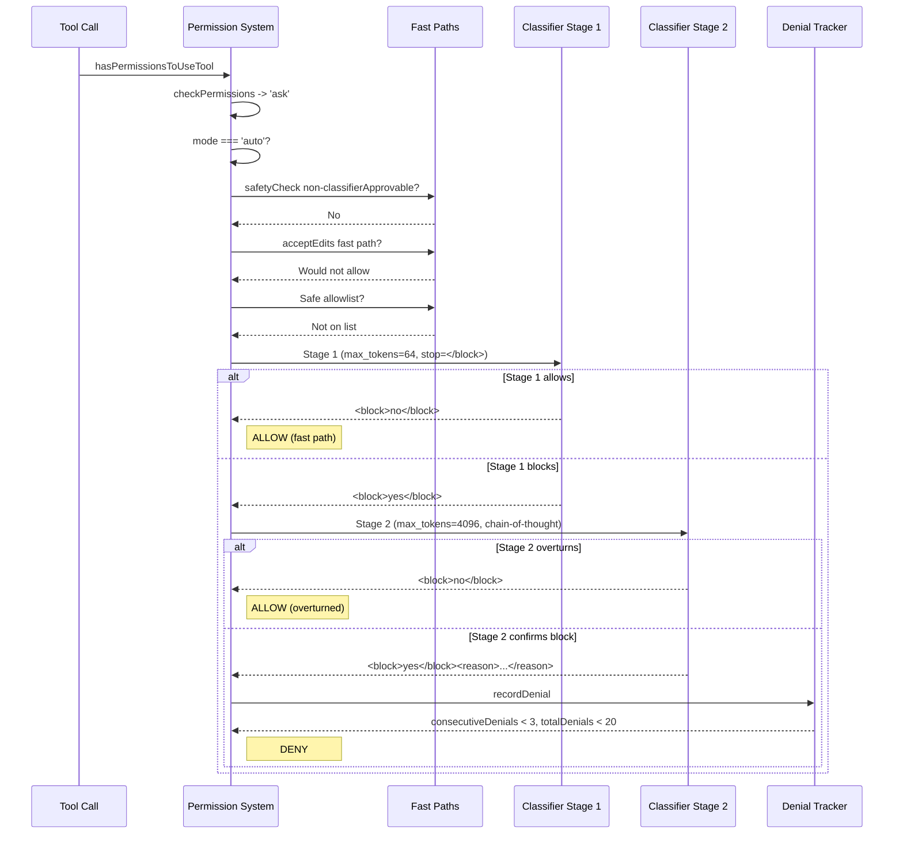

# Chapter 10: Permission System — Multi-Layered Security

> In an AI agent system that can read and write files, execute arbitrary shell commands, and call external APIs, permission control is not an optional feature but a core architectural constraint. Claude Code's Permission System is composed of seven rule sources, six permission modes, a complete decision tree, an AI classifier pipeline, and OS-level sandboxing. This chapter dissects every layer of this multi-layered security architecture in full detail.

---

## 10.1 Permission Mode Enumeration

Every permission decision in Claude Code begins with the current **permission mode**. The mode determines the system's default posture toward each tool call: allow it outright, deny it automatically, delegate to an AI classifier, or prompt the user.

### 10.1.1 External Modes

Five modes are exposed to users, defined in `src/types/permissions.ts`:

```typescript
export const EXTERNAL_PERMISSION_MODES = [
  'acceptEdits',
  'bypassPermissions',
  'default',
  'dontAsk',
  'plan',
] as const
```

### 10.1.2 Internal Modes

Two additional modes exist internally and are not surfaced to regular users:

```typescript
export type InternalPermissionMode = ExternalPermissionMode | 'auto' | 'bubble'
```

### 10.1.3 Mode Behavior Matrix

| Mode | Behavior | File Edits in CWD | Bash Commands | Classifier Used |
|------|----------|-------------------|---------------|-----------------|
| `default` | Prompt for every write/execute | Ask | Ask | No |
| `acceptEdits` | Auto-allow file edits within working directory | Allow (in CWD) | Ask | No |
| `bypassPermissions` | Skip all permission checks | Allow | Allow | No |
| `dontAsk` | Never prompt; deny anything that would need asking | Deny | Deny | No |
| `plan` | Read-only planning mode; may activate auto classifier | Varies | Varies | Conditional |
| `auto` | AI classifier decides allow/deny without user prompts | Classifier | Classifier | Yes |
| `bubble` | Internal-only mode | N/A | N/A | No |

### 10.1.4 Mode Initialization Priority

The `initialPermissionModeFromCLI` function in `permissionSetup.ts` resolves the active mode in this priority order:

1. `--dangerously-skip-permissions` CLI flag -> `bypassPermissions`
2. `--permission-mode` CLI flag -> parsed mode
3. `settings.permissions.defaultMode` -> settings mode
4. Fallback -> `default`

Critical guards:
- `bypassPermissions` can be disabled by the Statsig gate `tengu_disable_bypass_permissions_mode` or by setting `permissions.disableBypassPermissionsMode: 'disable'`
- `auto` mode is blocked when its circuit breaker is active (`tengu_auto_mode_config.enabled === 'disabled'`)
- In CCR (Claude Code Remote), only `acceptEdits`, `plan`, and `default` are allowed from settings

### 10.1.5 Mode Transitions

The `transitionPermissionMode` function centralizes all state transitions:

```
default <-> acceptEdits : direct switch
default <-> auto        : strips/restores dangerous permissions
default <-> plan        : saves prePlanMode, handles plan attachments
auto    <-> plan        : auto remains active within plan mode
```

The critical operation on entering `auto` mode:
- `setAutoModeActive(true)` is called
- `stripDangerousPermissionsForAutoMode` removes rules that would bypass the classifier (e.g., `Bash(*)`, `Bash(python:*)`)
- Stripped rules are saved to `strippedDangerousRules` for restoration on exit

This is an essential security invariant: if a user previously configured a `Bash(*)` always-allow rule, the system **proactively strips** it upon entering auto mode, ensuring the classifier cannot be bypassed.

---

## 10.2 Rule System: Sources and Priority

### 10.2.1 Rule Type Definitions

Each permission rule is composed of three parts:

```typescript
export type PermissionRule = {
  source: PermissionRuleSource       // which layer it comes from
  ruleBehavior: PermissionBehavior   // 'allow' | 'deny' | 'ask'
  ruleValue: PermissionRuleValue     // tool name + matching content
}
```

Where `PermissionRuleValue` specifies the target tool and match pattern:

```typescript
export type PermissionRuleValue = {
  toolName: string      // e.g., "Bash", "Edit", "mcp__server1__tool1"
  ruleContent?: string  // e.g., "npm test:*", "/.env", "domain:example.com"
}
```

### 10.2.2 Eight Rule Sources

Rule sources are listed from highest to lowest priority:

```typescript
export type PermissionRuleSource =
  | 'policySettings'    // Organization-level policies (highest priority)
  | 'flagSettings'      // Feature flags / remote configuration
  | 'localSettings'     // .claude/settings.local.json
  | 'projectSettings'   // .claude/settings.json
  | 'userSettings'      // ~/.claude/settings.json
  | 'cliArg'            // --allowed-tools, --disallowed-tools
  | 'command'           // Slash commands
  | 'session'           // Session-scoped transient rules (lowest priority)
```



```mermaid
graph TB
    subgraph "Rule Source Priority Stack (Highest to Lowest)"
        P["1. policySettings — Organization policies<br/>Delivered via MDM/policy configuration<br/>Cannot be overridden by users"]
        FL["2. flagSettings — Feature Flags<br/>Remote Statsig configuration<br/>Dynamically delivered at runtime"]
        L["3. localSettings — .claude/settings.local.json<br/>Local private configuration<br/>Not committed to Git"]
        PR["4. projectSettings — .claude/settings.json<br/>Project-level configuration<br/>Shared by team, committed to Git"]
        U["5. userSettings — ~/.claude/settings.json<br/>User global configuration<br/>Applies across projects"]
        C["6. cliArg — CLI arguments<br/>--allowed-tools, --disallowed-tools<br/>Single invocation scope"]
        CMD["7. command — Slash Commands<br/>Injected via /command<br/>Active during run"]
        S["8. session — Session-scoped rules<br/>User grants during session<br/>Discarded when session ends"]
    end

    P --> FL --> L --> PR --> U --> C --> CMD --> S

    subgraph "Behavior Priority"
        D["deny > ask > allow"]
        M["Within same behavior: first match wins"]
    end
```

### 10.2.3 Rule Matching Mechanics

Rule matching operates at two levels:

**Tool-level matching** (`toolMatchesRule`):
- Direct match: rule `Bash` matches tool `Bash`
- MCP server-level: rule `mcp__server1` matches `mcp__server1__tool1`
- MCP wildcard: rule `mcp__server1__*` matches all tools from server1

**Content-level matching** (in `filesystem.ts`, `matchingRuleForInput`):
- Uses the `ignore` library (gitignore-style glob matching)
- Pattern prefix determines the resolution root:
  - `//path` -> absolute from filesystem root
  - `~/path` -> relative to home directory
  - `/path` -> relative to the settings file directory
  - `path` -> no root (matches anywhere)

### 10.2.4 Dangerous Rule Detection

`dangerousPatterns.ts` defines patterns that would bypass the auto-mode classifier:

```typescript
export const DANGEROUS_BASH_PATTERNS: readonly string[] = [
  // Interpreters
  'python', 'python3', 'python2', 'node', 'deno', 'tsx', 'ruby', 'perl', 'php', 'lua',
  // Package runners
  'npx', 'bunx', 'npm run', 'yarn run', 'pnpm run', 'bun run',
  // Shells
  'bash', 'sh', 'zsh', 'fish',
  // Execution primitives
  'eval', 'exec', 'env', 'xargs', 'sudo',
  // Remote
  'ssh',
]
```

Detection logic (`isDangerousBashPermission`):
- Tool-level allow with no content (e.g., `Bash`, `Bash(*)`, `Bash()`) -> dangerous
- Interpreter prefix patterns (e.g., `python:*`, `python*`, `python *`) -> dangerous
- Dash-wildcard patterns (e.g., `python -c*`) -> dangerous

---

## 10.3 Decision Flow: The Complete Decision Tree

### 10.3.1 Entry Point

`hasPermissionsToUseTool` is the unified entry point for all permission checks. It receives a tool instance, input parameters, and a permission context, and returns one of three decisions: allow, ask, or deny.

### 10.3.2 Inner Decision Logic (`hasPermissionsToUseToolInner`)

```
1. mode === 'bypassPermissions' ?  -> allow (with sandbox override check)
2. Tool-level allow rule matches?  -> allow
3. Tool-level deny rule matches?   -> deny
4. Tool-level ask rule matches?    -> ask
5. tool.checkPermissions(input, context) -> tool-specific logic
```

### 10.3.3 Outer Post-Processing

The inner result undergoes mode-specific post-processing:



### 10.3.4 Decision Type System

```typescript
export type PermissionDecision<Input> =
  | { behavior: 'allow'; updatedInput?; decisionReason? }
  | { behavior: 'ask'; message; suggestions?; pendingClassifierCheck? }
  | { behavior: 'deny'; message; decisionReason }
```

Every decision carries a `decisionReason` for auditing and debugging:

```typescript
export type PermissionDecisionReason =
  | { type: 'rule'; rule: PermissionRule }
  | { type: 'mode'; mode: PermissionMode }
  | { type: 'classifier'; classifier: string; reason: string }
  | { type: 'hook'; hookName: string }
  | { type: 'sandboxOverride'; reason: string }
  | { type: 'safetyCheck'; reason: string; classifierApprovable: boolean }
  | { type: 'workingDir'; reason: string }
  | { type: 'subcommandResults'; reasons: Map<string, PermissionResult> }
  // ... additional types
```

---

## 10.4 Bash Command Security Analysis

The Bash tool is the highest-risk surface in Claude Code's security model. A single `Bash` call can execute arbitrary shell commands, so the system applies multiple defense layers.

### 10.4.1 Command Parsing: Injection Resistance

The `splitCommandWithOperators` function in `commands.ts` is the foundation of bash security analysis.

**Random-salt placeholder generation**:

```typescript
function generatePlaceholders() {
  const salt = randomBytes(8).toString('hex')
  return {
    SINGLE_QUOTE: `__SINGLE_QUOTE_${salt}__`,
    DOUBLE_QUOTE: `__DOUBLE_QUOTE_${salt}__`,
    NEW_LINE: `__NEW_LINE_${salt}__`,
    // ...
  }
}
```

Why random salts? If placeholders were fixed strings (e.g., `__SINGLE_QUOTE__`), an attacker could craft a command containing that literal value, causing incorrect substitution during placeholder restoration. A random salt makes placeholders unpredictable, eliminating this injection class entirely.

**Line continuation security**:

```typescript
// SECURITY: Only join when odd number of backslashes before newline.
// Even: backslashes pair up, newline is command separator.
// Odd: last backslash escapes newline (line continuation).
const commandWithContinuationsJoined = processedCommand.replace(
  /\\+\n/g,
  match => {
    const backslashCount = match.length - 1
    if (backslashCount % 2 === 1) {
      return '\\'.repeat(backslashCount - 1)
    }
    return match
  },
)
```

### 10.4.2 Redirection Detection

The `isStaticRedirectTarget` function rejects all dynamic content in redirect targets:

| Rejected Pattern | Example | Risk |
|-----------------|---------|------|
| Shell variables | `$HOME`, `${VAR}` | Unpredictable runtime path |
| Command substitution | `` `pwd` `` | Arbitrary command execution |
| Glob patterns | `*`, `?`, `[` | Non-deterministic target |
| Brace expansion | `{1,2}` | Multi-target expansion |
| Tilde expansion | `~` | User directory resolution |
| Process substitution | `>(cmd)`, `<(cmd)` | Implicit command execution |
| History expansion | `!!`, `!-1` | Replay of previous commands |
| Empty strings | `""` | Resolves to CWD |
| Comment-prefixed targets | `#file` | Parser confusion |

### 10.4.3 Read-Only Command Validation

`readOnlyCommandValidation.ts` defines exhaustive safe-flag maps for 20+ git subcommands and external commands:

```typescript
export type FlagArgType =
  | 'none'    // No argument (--color)
  | 'number'  // Integer argument (--context=3)
  | 'string'  // Any string argument
  | 'char'    // Single character (delimiter)
  | '{}'      // Literal "{}" only
  | 'EOF'     // Literal "EOF" only
```

**The parser differential vulnerability**:

This is one of the most subtle attack surfaces in bash security. Consider the following command:

```
git diff -S -- --output=/tmp/pwned
```

If the validator types `-S` as `'none'` (takes no argument), it processes the command as follows:
1. See `-S`, consume 1 token, continue
2. Hit `--`, stop checking (everything after is positional)
3. `--output=/tmp/pwned` is not examined -> passes validation

But git treats `-S` as requiring an argument:
1. `-S` consumes the next token `--` as the pickaxe search string
2. `--output=/tmp/pwned` is parsed as a long option -> **arbitrary file write**

The fix: correct the flag type for `-S`, `-G`, and `-O` from `'none'` to `'string'`.

### 10.4.4 Dangerous Subcommand Detection

```typescript
// git reflog safety check
additionalCommandIsDangerousCallback: (_rawCommand, args) => {
  const DANGEROUS_SUBCOMMANDS = new Set(['expire', 'delete', 'exists'])
  for (const token of args) {
    if (!token || token.startsWith('-')) continue
    if (DANGEROUS_SUBCOMMANDS.has(token)) return true
    return false  // first non-flag token is not dangerous
  }
  return false
}
```

For `git remote`, only bare `git remote` and `git remote -v/--verbose` are safe. Any positional arguments (which could be subcommands like `add`, `remove`, `set-url`) are blocked.

---

## 10.5 Filesystem Permissions

### 10.5.1 Path Validation Pipeline

`validatePath` in `pathValidation.ts` is the unified entry point for file path security:

```
validatePath(path, cwd, context, operationType)
  |
  +-- expandTilde (~ -> $HOME; ~user BLOCKED)
  +-- Block UNC paths (containsVulnerableUncPath)
  +-- Block tilde variants (~root, ~+, ~-, ~N) -> TOCTOU risk
  +-- Block shell expansion syntax ($, %, =cmd) -> TOCTOU risk
  +-- Block glob patterns in write operations
  +-- For read globs: validateGlobPattern (check base directory)
  +-- Resolve path (absolute + symlink resolution)
  +-- isPathAllowed(resolvedPath, context, operationType)
```

### 10.5.2 Write Permission Flow



### 10.5.3 Dangerous Files and Directories

```typescript
export const DANGEROUS_FILES = [
  '.gitconfig', '.gitmodules',
  '.bashrc', '.bash_profile', '.zshrc', '.zprofile', '.profile',
  '.ripgreprc', '.mcp.json', '.claude.json',
]

export const DANGEROUS_DIRECTORIES = [
  '.git', '.vscode', '.idea', '.claude',
]
```

Exception: `.claude/worktrees/` is explicitly excluded from the `.claude` directory check, since it is a structural path used by git worktrees.

### 10.5.4 Windows Path Attack Surface

`hasSuspiciousWindowsPathPattern` detects the following attack patterns:

| Pattern | Example | Risk |
|---------|---------|------|
| NTFS Alternate Data Streams | `file.txt::$DATA` | Hidden data access |
| 8.3 short names | `SETTIN~1.JSON` | Bypass string matching |
| Long path prefixes | `\\?\C:\...` | Bypass path validation |
| Trailing dots/spaces | `.git.`, `.claude ` | Windows strips during resolution |
| DOS device names | `.git.CON` | Special device access |
| UNC paths | `\\server\share` | Network credential leak (NTLM) |

A critical design decision: these checks run on **all platforms**, not just Windows, because NTFS filesystems can be mounted on Linux/macOS via ntfs-3g.

### 10.5.5 Case-Insensitive Security

```typescript
export function normalizeCaseForComparison(path: string): string {
  return path.toLowerCase()
}
```

Applied consistently across all path comparisons. Without this, an attacker could bypass checks on case-insensitive filesystems (macOS, Windows) using paths like `.cLauDe/Settings.locaL.json`.

### 10.5.6 Temp Directory Handling

```typescript
export const getClaudeTempDir = memoize(function getClaudeTempDir(): string {
  const baseTmpDir = process.env.CLAUDE_CODE_TMPDIR || '/tmp'
  const resolvedBaseTmpDir = fs.realpathSync(baseTmpDir)  // Resolve symlinks
  return join(resolvedBaseTmpDir, `claude-${uid}`) + sep
})
```

Three layers of defense:
1. **Per-user directories** (`claude-{uid}`): prevent multi-user permission conflicts
2. **Symlink resolution**: on macOS, `/tmp` is a symlink to `/private/tmp`. Without resolution, the permission check path would not match.
3. **Per-process random nonce**: the bundled skills root uses a random nonce to defend against symlink pre-creation attacks

---

## 10.6 Classifier System

### 10.6.1 Auto-Mode (Yolo) Classifier Architecture

The core of auto mode is a **two-stage XML classifier** that uses an AI model to judge whether a tool call is safe, without user interaction.

| Mode | Stage 1 (Fast) | Stage 2 (Thinking) | Description |
|------|----------------|---------------------|-------------|
| `both` (default) | Yes (max_tokens=64) | Only if Stage 1 blocks | Fast path: pass allows, block escalates |
| `fast` | Yes (max_tokens=256) | No | Stage 1 verdict is final |
| `thinking` | No | Yes (max_tokens=4096) | Skip fast stage entirely |



### 10.6.2 Transcript Building Security

The classifier's transcript construction has a critical security design:

```typescript
export function buildTranscriptEntries(messages: Message[]): TranscriptEntry[]
```

- **Included**: user text messages and assistant `tool_use` blocks
- **Excluded**: assistant text content

Why exclude assistant text? Because assistant text is model-generated and could theoretically be manipulated by prompt injection to influence the classifier's judgment. By retaining only user instructions and actual tool calls, the classifier makes decisions based on ground truth.

### 10.6.3 Safe Tool Allowlist

The following tools skip classifier evaluation entirely:

```typescript
const SAFE_YOLO_ALLOWLISTED_TOOLS = new Set([
  FILE_READ_TOOL_NAME,           // Read-only file operations
  GREP_TOOL_NAME,                // Search
  GLOB_TOOL_NAME,                // File finding
  LSP_TOOL_NAME,                 // Language server
  TODO_WRITE_TOOL_NAME,          // Task management
  ASK_USER_QUESTION_TOOL_NAME,   // User interaction
  SLEEP_TOOL_NAME,               // Delay
  // ... additional read-only/metadata tools
])
```

Write and edit tools are **not** on this list. They use the `acceptEdits` fast-path check to avoid unnecessary classifier calls without compromising security.

### 10.6.4 Fail-Closed vs. Fail-Open Behavior

| Scenario | Iron Gate Closed (default) | Iron Gate Open |
|----------|--------------------------|----------------|
| Classifier API error | Deny + retry guidance | Fall back to normal prompting |
| Transcript too long | Abort (headless) / fall back to prompting | Fall back to normal prompting |

### 10.6.5 Denial Tracking

```typescript
export const DENIAL_LIMITS = {
  maxConsecutive: 3,
  maxTotal: 20,
}
```

When consecutive denials reach 3 or total denials reach 20, the system falls back to interactive prompting. This prevents auto mode from entering infinite denial loops while giving the user an opportunity to review and intervene.

---

## 10.7 Sandbox Architecture

### 10.7.1 OS-Level Isolation

The sandbox system (`sandbox-adapter.ts`) provides operating-system-level process isolation for bash commands:

- **macOS**: uses `sandbox-exec`
- **Linux**: uses `bubblewrap`
- **WSL2+**: uses `bubblewrap` (WSL1 is not supported)

### 10.7.2 Sandbox Configuration Structure

```typescript
export function convertToSandboxRuntimeConfig(settings): SandboxRuntimeConfig {
  return {
    network: {
      allowedDomains,       // Extracted from WebFetch allow rules
      deniedDomains,        // Extracted from WebFetch deny rules
      allowUnixSockets,
      allowLocalBinding,
    },
    filesystem: {
      denyRead,             // Read deny rules + sandbox.filesystem.denyRead
      allowRead,            // sandbox.filesystem.allowRead
      allowWrite,           // Edit allow rules + sandbox.filesystem.allowWrite
      denyWrite,            // Settings paths + sandbox.filesystem.denyWrite
    },
    ignoreViolations,
    enableWeakerNestedSandbox,
  }
}
```

### 10.7.3 Filesystem Restrictions

**Always writable**:
- Current working directory
- Claude temp directory (`getClaudeTempDir()`)
- Git worktree main repository path
- Additional directories from `--add-dir` and settings

**Always denied for writes**:
- All settings.json files across every setting source
- Managed settings drop-in directory
- `.claude/skills/` directories

### 10.7.4 Bare Git Repository Protection

```typescript
const bareGitRepoFiles = ['HEAD', 'objects', 'refs', 'hooks', 'config']
```

This is an elegant defense against a subtle attack: Git's `is_git_directory()` function treats any directory containing `HEAD + objects/ + refs/` as a bare repository. If an attacker can plant these files in the working directory, Claude's unsandboxed git operations could potentially **escape the sandbox**.

Defense strategy:
- If these files already exist: deny-write (read-only bind mount)
- If they do not exist: scrub them after each command (`scrubBareGitRepoFiles`)

### 10.7.5 Excluded Commands

Commands configured via `sandbox.excludedCommands` bypass the sandbox. When a command is excluded, the permission decision records `{ type: 'sandboxOverride' }`, ensuring auditability.

---

## 10.8 Security Invariants and Design Principles

Claude Code's Permission System rests on 13 core security invariants:

| # | Invariant | Implementation Location |
|---|-----------|------------------------|
| 1 | **Deny rules always take precedence over allow rules** | Deny checked first in every permission flow |
| 2 | **Safety checks run before allow rules for writes** | `checkWritePermissionForTool` flow |
| 3 | **Symlinks resolved on both path and working directory** | `fs.realpathSync` in `pathValidation.ts` |
| 4 | **Case normalization on all path comparisons** | `normalizeCaseForComparison` |
| 5 | **Random salt in command parsing placeholders** | `randomBytes(8)` in `generatePlaceholders` |
| 6 | **Odd/even backslash counting for line continuations** | `splitCommandWithOperators` |
| 7 | **Flag argument types must be exact** | Type definitions in `readOnlyCommandValidation.ts` |
| 8 | **Classifier fails closed by default** | `tengu_iron_gate_closed` gate |
| 9 | **Dangerous rules stripped on auto-mode entry** | `stripDangerousPermissionsForAutoMode` |
| 10 | **Per-user temp directories with UID** | `getClaudeTempDir` |
| 11 | **Per-process random nonce for bundled skills root** | `getBundledSkillsRoot` |
| 12 | **Bare git repo file scrubbing** | `scrubBareGitRepoFiles` |
| 13 | **Settings files always denied for sandbox writes** | `convertToSandboxRuntimeConfig` |

### Design Principles

**Defense in Depth.** Each layer is independently effective. Path validation does not depend on the sandbox; the rule engine does not depend on the classifier; the sandbox does not depend on the rule engine. Even if one layer is bypassed, the remaining layers continue to provide protection.

**Fail-Closed.** When in doubt, deny. The classifier defaults to deny when unavailable; unknown flags are treated as dangerous; unmatched rules fall back to ask.

**Least Privilege.** Auto mode does not trust broad pre-existing rules; `acceptEdits` only permits edits within the working directory; the sandbox exposes only the minimum necessary filesystem and network paths.

**Auditability.** Every permission decision carries a `decisionReason` that records which rule, classifier, or hook made the decision. This serves debugging during development and provides a complete decision chain for post-hoc security audits.

---

## 10.9 Chapter Summary

Claude Code's Permission System is not a simple allow/deny gateway. It is an architecture where multiple orthogonal security layers work in concert:

1. **Modes** set the default posture -- how the system approaches each tool call
2. **Rules** provide fine-grained control -- an eight-layer source priority stack
3. **The decision tree** orchestrates all judgments -- the complete path from tool call to allow/deny
4. **Bash security** analyzes commands deeply -- placeholder injection defense, parser differential prevention, redirection detection
5. **Filesystem security** guards file access -- path validation, glob matching, dangerous file/directory detection
6. **The classifier** enables autonomous safety -- two-stage AI evaluation with denial tracking and fail-closed semantics
7. **The sandbox** provides the last line of defense -- OS-level isolation with bare git repository protection

The design philosophy of this system is straightforward: **no single point of trust**. Each layer assumes the other layers may be bypassed and independently maintains its own security invariants. This defense-in-depth architecture ensures that even as the AI agent is granted powerful capabilities, the security boundary remains controllable and auditable.
