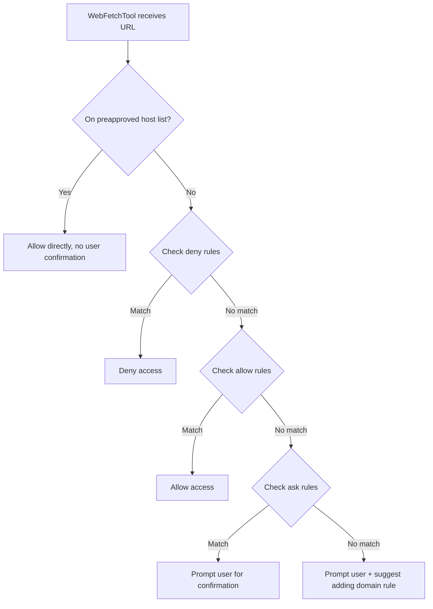
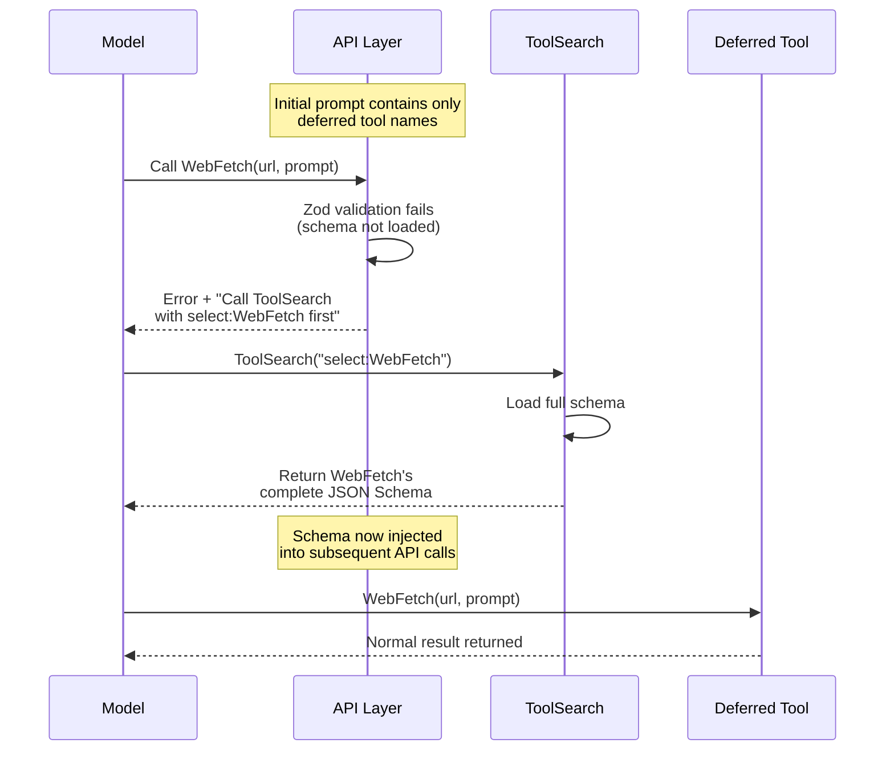
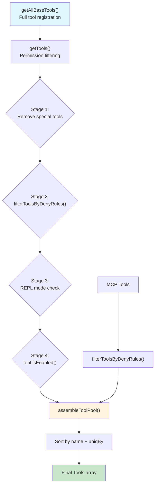
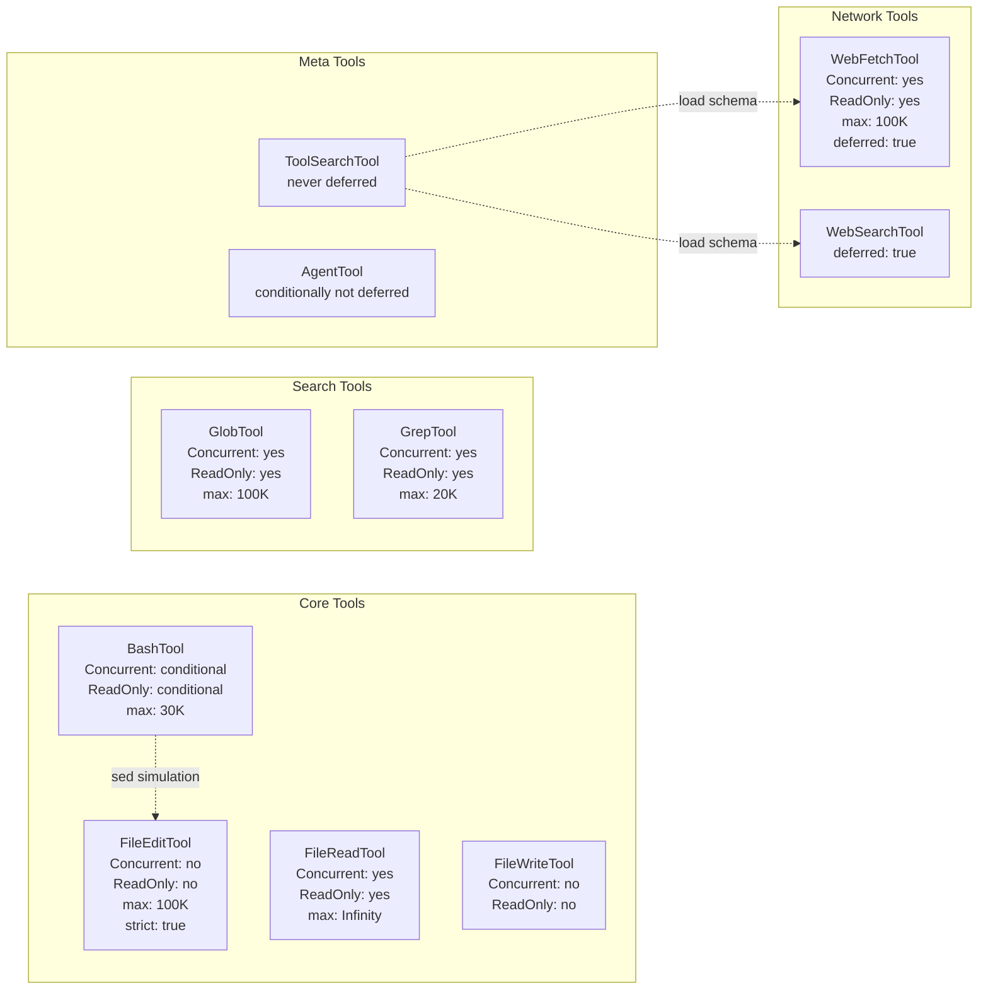

# Chapter 11: Built-in Tools Deep Dive

> Every capability Claude Code offers -- executing commands, reading files, editing code, searching a codebase, fetching web pages -- is encapsulated as a Tool. These tools are not thin wrappers around function calls. Each carries safety declarations, concurrency properties, a permission model, and output budgets, forming a complete execution unit. This chapter dissects the seven core built-in tools, revealing the design decisions that let them maximize efficiency without sacrificing safety.

---

## 11.1 BashTool: The Command Execution Engine

BashTool is the most complex single tool in Claude Code and the only one that requires **runtime behavioral analysis** to determine its safety properties. It is far more than "run a command in a shell."

### 11.1.1 Input Schema and Hidden Fields

```typescript
z.strictObject({
  command: z.string(),
  timeout: semanticNumber(z.number().optional()),
  description: z.string().optional(),
  run_in_background: semanticBoolean(z.boolean().optional()),
  dangerouslyDisableSandbox: semanticBoolean(z.boolean().optional()),
  _simulatedSedEdit: z.object({
    filePath: z.string(),
    newContent: z.string(),
  }).optional(),
})
```

Two design choices stand out:

1. **`semanticNumber` / `semanticBoolean`**: Models sometimes emit numeric values as strings (`"123"` instead of `123`). These coercers perform automatic type conversion at the Zod validation layer, absorbing the model's type uncertainty before it reaches tool logic.

2. **`_simulatedSedEdit`**: A purely internal field, never included in the JSON Schema sent to the model. During permission preview, sed commands are pre-compiled into structured file change descriptions. If the model's input contains this field, it is forcibly stripped -- a textbook defense-in-depth measure.

### 11.1.2 Command Classification Sets

BashTool classifies every possible command into five sets. These sets drive concurrency decisions and UI behavior:

```typescript
BASH_SEARCH_COMMANDS = ['find', 'grep', 'rg', 'ag', 'ack', 'locate',
                        'which', 'whereis']
BASH_READ_COMMANDS   = ['cat', 'head', 'tail', 'less', 'more', 'wc',
                        'stat', 'file', 'strings', 'jq', 'awk',
                        'cut', 'sort', 'uniq', 'tr']
BASH_LIST_COMMANDS   = ['ls', 'tree', 'du']
BASH_SILENT_COMMANDS = ['mv', 'cp', 'rm', 'mkdir', 'rmdir', 'chmod',
                        'chown', 'chgrp', 'touch', 'ln', 'cd',
                        'export', 'unset', 'wait']
BASH_SEMANTIC_NEUTRAL_COMMANDS = ['echo', 'printf', 'true', 'false', ':']
```

These classifications are not decorative. They directly determine three critical behaviors:

- **Concurrency safety**: `isConcurrencySafe(input)` delegates to `isReadOnly(input)`, which calls `checkReadOnlyConstraints()`. Only search, read, and list commands are deemed concurrency-safe.
- **UI tagging**: `isSearchOrReadCommand()` returns a `{ isSearch, isRead, isList }` triple that controls icons and activity descriptions in the interface.
- **Permission classification**: Silent commands (those with side effects but no output) receive special permission handling.

### 11.1.3 Conservative Concurrency Judgment

BashTool's concurrency safety judgment is the most sophisticated in the entire tool system. It uses the shell-quote library to parse the command, extracts all pipeline segments and subcommands, and checks each one. The governing principle is **fail-closed**:

```
git status                    -> concurrent (read-only)
cat file.txt | grep pattern   -> concurrent (both ends read-only)
npm install                   -> serial (write operation)
echo "hello" > file.txt       -> serial (redirect write)
unknown_command               -> serial (unknown treated conservatively)
```

When shell-quote parsing fails (e.g., unbalanced quotes), the result defaults to `false` -- serial execution is always preferred over risking a concurrent write.

### 11.1.4 Background Tasks and Blocking Budget

BashTool implements a complete background task mechanism, anchored by a key constant:

```typescript
ASSISTANT_BLOCKING_BUDGET_MS = 15_000  // 15-second blocking budget
```

When the model sets `run_in_background: true`, or when command execution exceeds the blocking budget, the task transitions to background mode. Background tasks receive a `taskId`, and the model can query their status through subsequent Bash commands.

### 11.1.5 Sandbox Integration

`shouldUseSandbox()` determines whether a command should execute in a sandboxed environment. The sandbox, managed by `SandboxManager`, provides filesystem-level isolation. The `dangerouslyDisableSandbox` parameter allows explicit bypass, but the bypass itself must pass a permission check -- sandboxing the sandbox escape, so to speak.

### 11.1.6 Output Streaming and Progress Reporting

BashTool streams output through an async generator:

```typescript
do {
  generatorResult = await commandGenerator.next();
  if (!generatorResult.done && onProgress) {
    onProgress({
      toolUseID: `bash-progress-${progressCounter++}`,
      data: {
        type: 'bash_progress',
        output: progress.output,
        fullOutput: progress.fullOutput,
        elapsedTimeSeconds: progress.elapsedTimeSeconds,
        totalLines: progress.totalLines,
        totalBytes: progress.totalBytes,
      },
    });
  }
} while (!generatorResult.done);
```

Progress reporting has a 2-second threshold (`PROGRESS_THRESHOLD_MS = 2000`). Short-lived commands produce no progress events, avoiding UI flicker noise.

### 11.1.7 Sed Simulation

When the model attempts a `sed` command to modify a file, BashTool's permission preview phase pre-compiles the sed expression into a `_simulatedSedEdit` structure containing the target file path and expected new content. This enables the permission system to present a clear diff view rather than forcing the user to parse an opaque sed expression.

---

## 11.2 FileReadTool: The Polymorphic Read Engine

FileReadTool's core design goal is to serve as a unified file reading entry point, regardless of whether the target is plain text, an image, a PDF, or a Jupyter notebook.

### 11.2.1 Six Output Types

FileReadTool's output schema is a discriminated union covering six fundamentally different return formats:

```typescript
z.discriminatedUnion('type', [
  z.object({ type: z.literal('text'),
    file: { filePath, content, numLines, startLine, totalLines } }),
  z.object({ type: z.literal('image'),
    file: { base64, type, originalSize, dimensions } }),
  z.object({ type: z.literal('notebook'),
    file: { filePath, cells } }),
  z.object({ type: z.literal('pdf'),
    file: { filePath, base64, originalSize } }),
  z.object({ type: z.literal('parts'),
    file: { filePath, originalSize, count, outputDir } }),
  z.object({ type: z.literal('file_unchanged'),
    file: { filePath } }),
])
```

The `file_unchanged` type deserves special attention. When a file has not been modified since its last read, FileReadTool returns this sentinel instead of retransmitting the content, saving precious context window tokens.

### 11.2.2 The Infinity Persistence Strategy

FileReadTool is the only tool that sets `maxResultSizeChars` to `Infinity`:

| Tool | maxResultSizeChars | Rationale |
|------|-------------------|-----------|
| BashTool | 30,000 | Moderate command output |
| FileReadTool | **Infinity** | Self-bounds via token limits; persistence creates circular reads |
| FileEditTool | 100,000 | Diffs can be large |
| GrepTool | 20,000 | Bounded by head_limit default (250) |
| WebFetchTool | 100,000 | Web pages can be large |

Why Infinity? Because FileReadTool already self-limits through `MaxFileReadTokenExceededError` and `fileReadingLimits`. If it also went through the outer persistence flow (writing large results to disk and returning a preview), the model would call Read again to read the persisted file, creating an infinite loop.

### 11.2.3 Device Path Blocking

FileReadTool explicitly blocks a set of dangerous device paths:

```
/dev/zero, /dev/random, /dev/urandom, /dev/stdin, /dev/null
```

These paths either produce infinite output (`/dev/zero`), block the process (`/dev/stdin`), or drain the system entropy pool (`/dev/random`). Blocking them is a basic defense against denial-of-service scenarios.

### 11.2.4 Token Budget Control

FileReadTool's read volume is governed by two layers of limits:

1. **`fileReadingLimits`**: Passed via `ToolUseContext`, containing `maxTokens` and `maxSizeBytes`
2. **`offset` / `limit` parameters**: Enable precise paginated reads

When a file exceeds the token limit, the tool throws `MaxFileReadTokenExceededError`, guiding the model to use offset/limit parameters for segmented reading.

### 11.2.5 Safety Property Declarations

```typescript
isConcurrencySafe: () => true,   // Pure read, no side effects
isReadOnly: () => true,           // Modifies no state
```

FileReadTool is unconditionally concurrency-safe -- regardless of input parameters, it only ever reads. This stands in stark contrast to BashTool's input-dependent safety analysis.

---

## 11.3 FileEditTool: The Precision String Replacement Engine

FileEditTool adopts an editing model that seems simple but reflects deep deliberation: **exact string match replacement**, rather than line-number or AST-based editing.

### 11.3.1 Input Schema

```typescript
z.strictObject({
  file_path: z.string(),
  old_string: z.string(),
  new_string: z.string(),
  replace_all: z.boolean().optional().default(false),
})
```

Why string matching instead of line numbers? Because in multi-turn conversations, the line numbers the model last observed may be stale (intervening edits shift lines). String matching is **content-addressed** -- as long as the target text exists, the edit succeeds regardless of which line it has moved to.

### 11.3.2 Eleven Validation Checks

FileEditTool's `validateInput()` executes a rigorous sequence of checks, each corresponding to a real-world failure mode:

1. **Team memory secret detection**: Prevents sensitive data from being written to code files
2. **`old_string === new_string` rejection**: No-op edits are meaningless; fail fast
3. **Deny rule path matching**: The permission system can forbid edits to specific paths
4. **UNC path security check**: Blocks `\\server\share` paths on Windows to prevent NTLM credential leaks
5. **File size limit** (1 GiB): Prevents memory exhaustion from processing oversized files
6. **File existence check**: When `old_string` is empty, allows new file creation
7. **Notebook file detection**: `.ipynb` files are redirected to NotebookEditTool
8. **Read-before-write enforcement**: The `readFileState` cache verifies the model read the file before attempting an edit
9. **File modification timestamp check**: Detects edit conflicts (file modified externally after the Read)
10. **String uniqueness validation**: `old_string` must match uniquely in the file (unless `replace_all: true`)
11. **Settings file validation**: Configuration files undergo additional format legality checks

### 11.3.3 Quote Preservation

LLMs frequently substitute straight quotes `'` with smart quotes (curly quotes) or vice versa when generating code. FileEditTool implements `findActualString` and `preserveQuoteStyle` to handle this:

```
Model output:  old_string = "console.log(\u2018hello\u2019)"  (smart quotes)
File content:  console.log('hello')                           (straight quotes)
-> FileEditTool auto-matches and preserves the file's original quote style
```

This seemingly minor feature significantly improves edit success rates.

### 11.3.4 Strict Mode

FileEditTool is one of the few tools that sets `strict: true`. In strict mode, all schema properties are required and Zod validation rejects any undeclared fields. This prevents the model from sending inputs containing hallucinated parameters.

### 11.3.5 LSP Integration

After a successful edit, FileEditTool triggers LSP (Language Server Protocol) diagnostic clearing. This ensures the edited file does not retain stale error markers from the pre-edit state.

---

## 11.4 GlobTool and GrepTool: The Search Twin Engines

These two tools form Claude Code's code search capabilities. They share core design principles but diverge in implementation focus.

### 11.4.1 GlobTool: Filename Search

```typescript
// Input
z.strictObject({
  pattern: z.string(),  // glob pattern, e.g., "**/*.ts"
  path: z.string().optional(),
})

// Output
z.object({
  durationMs: z.number(),
  numFiles: z.number(),
  filenames: z.array(z.string()),
  truncated: z.boolean(),
})
```

Key design decisions in GlobTool:

- **Default result limit of 100**: Controlled via the `globLimits` context parameter, preventing thousands of filenames from flooding the context
- **Path relativization**: Returned paths are relative to cwd rather than absolute, saving tokens
- **Sorted by modification time**: Most recently modified files appear first, matching developer intuition

### 11.4.2 GrepTool: Content Search

GrepTool is a structured wrapper around ripgrep, offering a far richer interface than calling `rg` directly:

```typescript
z.strictObject({
  pattern: z.string(),
  path: z.string().optional(),
  glob: z.string().optional(),
  output_mode: z.enum(['content', 'files_with_matches', 'count']).optional(),
  '-B': z.number().optional(),     // lines before
  '-A': z.number().optional(),     // lines after
  '-C': z.number().optional(),     // symmetric context
  context: z.number().optional(),  // alias for -C
  '-n': z.boolean().optional(),    // line numbers
  '-i': z.boolean().optional(),    // case insensitive
  type: z.string().optional(),     // file type filter
  head_limit: z.number().optional(),
  offset: z.number().optional(),
  multiline: z.boolean().optional(),
})
```

### 11.4.3 VCS Exclusion Strategy

Both tools automatically exclude version control system directories:

```
.git, .svn, .hg, .bzr, .jj, .sl
```

Note that this list extends beyond Git to cover Subversion, Mercurial, Bazaar, Jujutsu, and Sapling. This reflects Claude Code's adaptation to diverse VCS environments. GrepTool additionally excludes files matching plugin cache directory patterns.

### 11.4.4 Shared Safety Properties

Both search tools declare identical safety properties:

```typescript
isConcurrencySafe: () => true,
isReadOnly: () => true,
```

This means the model can issue multiple search operations simultaneously -- searching different patterns across different directories -- and all searches execute in parallel, returning results as a batch.

---

## 11.5 WebFetchTool and WebSearchTool: Network Capabilities

These tools grant Claude Code internet access while enforcing strict permission controls.

### 11.5.1 WebFetchTool: URL Fetching

```typescript
// Input
z.strictObject({
  url: z.string().url(),
  prompt: z.string(),
})

// Properties
shouldDefer: true
isConcurrencySafe: () => true
isReadOnly: () => true
maxResultSizeChars: 100_000
```

WebFetchTool's workflow: fetch the URL content, convert HTML to Markdown, then apply the `prompt` parameter to extract the needed information. The `prompt` parameter is a thoughtful inclusion -- it enables the tool to filter irrelevant content before returning, conserving context window space.

### 11.5.2 Domain-Level Permission Model

WebFetchTool implements a three-tier permission check:



The preapproved host list lets common documentation sites (GitHub, Stack Overflow, and the like) bypass repeated confirmation dialogs. Domain-level permission rules use the `domain:hostname` format -- once a user approves a domain, all URLs under that domain are automatically permitted.

### 11.5.3 Authentication Warning

WebFetchTool's prompt text always includes an authentication warning, reminding the model not to send credentials or tokens in requests. This is a prompt-level safety measure that complements the code-level protections in the permission system.

### 11.5.4 WebSearchTool

WebSearchTool provides web search capabilities. It shares a similar permission model with WebFetchTool but serves a different semantic purpose: searching for information rather than fetching a specific URL's content.

---

## 11.6 ToolSearch and Deferred Loading

When the tool count exceeds a threshold, placing every tool's complete schema in the system prompt severely consumes the context window. The deferred loading mechanism is Claude Code's answer to this problem.

### 11.6.1 Deferred Tool Determination Logic

```typescript
function isDeferredTool(tool: Tool): boolean {
  if (tool.alwaysLoad === true) return false      // MCP explicit opt-out
  if (tool.isMcp === true) return true             // All MCP tools deferred
  if (tool.name === 'ToolSearch') return false      // ToolSearch itself never deferred
  if (tool.name === AGENT_TOOL_NAME &&
      isForkSubagentEnabled()) return false         // Agent not deferred in fork mode
  if (tool.name === BRIEF_TOOL_NAME) return false   // Brief is a communication channel
  return tool.shouldDefer === true                  // Explicit deferral declaration
}
```

Deferred tools send only their name to the API (with a `defer_loading: true` flag), without the full JSON Schema. The model must call ToolSearch to load the schema before it can invoke a deferred tool.

### 11.6.2 Three Search Modes in ToolSearch

```
"select:Read,Edit,Grep"    -> Direct selection by name
"notebook jupyter"          -> Keyword search
"+slack send"               -> Require "slack" in name, rank by remaining terms
```

Direct selection mode is the most precise. Keyword search uses a scoring algorithm that parses CamelCase names and MCP prefixes, matching against the tool's `searchHint`, description, and name fragments.

### 11.6.3 Schema-Not-Loaded Guidance

When the model attempts to call a deferred tool whose schema has not been loaded, Zod validation necessarily fails. The system appends a guidance hint:

```typescript
function buildSchemaNotSentHint(tool, messages, tools): string | null {
  if (!isDeferredTool(tool)) return null
  const discovered = extractDiscoveredToolNames(messages)
  if (discovered.has(tool.name)) return null
  return `This tool's schema was not sent to the API...
    Load the tool first: call ToolSearch with query "select:${tool.name}"`
}
```

This hint is appended to the Zod validation error message, guiding the model toward the correct loading sequence.

### 11.6.4 The searchHint Property

Each tool can declare a `searchHint` property (a 3-10 word phrase) used for ToolSearch keyword matching. This property does not appear in the model-facing schema; it exists solely to serve tool discovery.



---

## 11.7 Tool Registration and Feature Gates

### 11.7.1 getAllBaseTools(): The Master Registry

`getAllBaseTools()` is the sole registration entry point for all tools, located in `src/tools.ts`. It returns an array containing every built-in tool:

```typescript
function getAllBaseTools(): Tools {
  return [
    AgentTool,
    BashTool,
    ...(hasEmbeddedSearchTools() ? [] : [GlobTool, GrepTool]),
    FileReadTool,
    FileEditTool,
    FileWriteTool,
    NotebookEditTool,
    WebFetchTool,
    WebSearchTool,
    // ... 30+ conditional tools ...
    ...(isToolSearchEnabledOptimistic() ? [ToolSearchTool] : []),
  ]
}
```

Note the conditional inclusion of GlobTool and GrepTool -- when embedded search tools are available, they are replaced by an alternative implementation.

### 11.7.2 Five Feature Gate Patterns

| Pattern | Example | Mechanism |
|---------|---------|-----------|
| `feature('FLAG')` | `feature('PROACTIVE')` | Build-time constant folding + dead code elimination |
| `process.env.USER_TYPE` | `=== 'ant'` | Runtime environment variable check |
| `isEnvTruthy()` | `ENABLE_LSP_TOOL` | Truthy environment variable check |
| Utility functions | `isWorktreeModeEnabled()` | Encapsulated complex runtime logic |
| Conditional `require()` | `feature('X') ? require(...) : null` | Lazy loading with DCE support |

**Ant-only tools** (Anthropic internal): `ConfigTool`, `TungstenTool`, `SuggestBackgroundPRTool`, `REPLTool`. These are gated by `USER_TYPE === 'ant'`, ensuring they never appear in public releases.

### 11.7.3 assembleToolPool(): Final Pool Assembly

```typescript
function assembleToolPool(
  permissionContext: ToolPermissionContext,
  mcpTools: Tools,
): Tools {
  const builtInTools = getTools(permissionContext)
  const allowedMcpTools = filterToolsByDenyRules(mcpTools, permissionContext)
  const byName = (a: Tool, b: Tool) => a.name.localeCompare(b.name)
  return uniqBy(
    [...builtInTools].sort(byName).concat(allowedMcpTools.sort(byName)),
    'name',
  )
}
```

This function embeds a subtle but critical optimization: **prompt cache stability**. Built-in tools are sorted by name and form a prefix; MCP tools are sorted by name and form a suffix. This partitioned sorting ensures:

- Adding or removing MCP tools does not alter the built-in tool prefix arrangement
- The API prompt cache can reuse the built-in tools portion across sessions
- `uniqBy('name')` gives built-in tools priority in name collisions

### 11.7.4 The Four-Stage Filtering Pipeline



From `getAllBaseTools()`'s full registration to the final `Tools` array, tools pass through four filtering stages. Each stage is purely functional -- accepting a tool array and producing a filtered subset. This design makes filtering logic independently testable and reasoning-friendly.

---

## 11.8 Tool Catalog Overview

The following diagram presents a panoramic view of all core built-in tools and their key properties:



---

## 11.9 Design Pattern Summary

Surveying the seven core tools, several shared design patterns emerge:

**Fail-closed defaults.** The `buildTool()` factory always chooses the safest option for its defaults. A tool that omits `isConcurrencySafe` is treated as serial-only. A tool that omits `isReadOnly` is treated as a write. This conservative strategy ensures that newly added tools cannot introduce concurrency hazards through missing declarations.

**Content-addressing over position-addressing.** FileEditTool chooses string matching over line numbers. BashTool chooses command classification over whitelisting. These choices point to the same principle: in a multi-turn, asynchronous agent loop, positional information goes stale quickly while content-based identifiers remain stable.

**Self-describing safety properties.** Each tool declares its own safety characteristics through `isConcurrencySafe`, `isReadOnly`, `isDestructive`, and related methods. The orchestration layer does not maintain a centralized safety rule table -- it merely queries each tool's self-declaration. This is a decentralized safety governance model.

**Layered budget control.** From the global `DEFAULT_MAX_RESULT_SIZE_CHARS` (50K) to each tool's `maxResultSizeChars`, to GrowthBook dynamic overrides, result size control is a three-tier system. FileReadTool opts out of this system with `Infinity` because it has its own token-level limits, and the outer persistence path would create a circular read loop.

These design decisions are not isolated technical choices. Together they form a tool system that balances safety and efficiency -- a runtime environment that lets an AI agent operate productively under human oversight.
