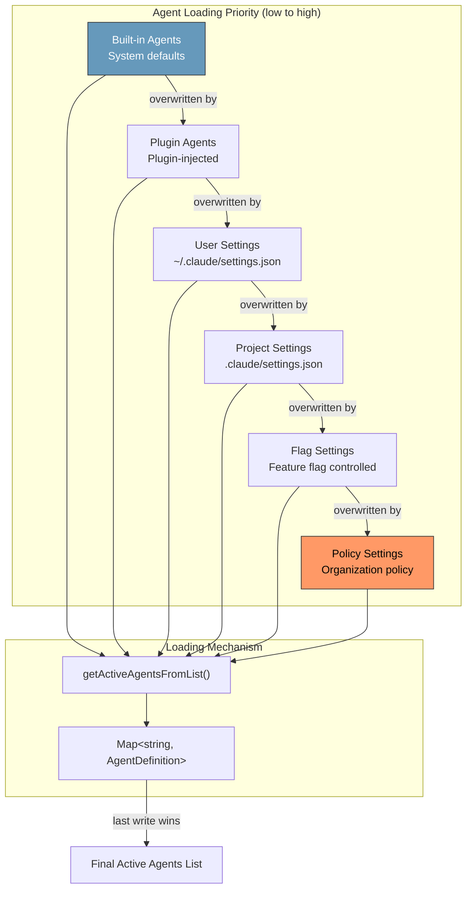
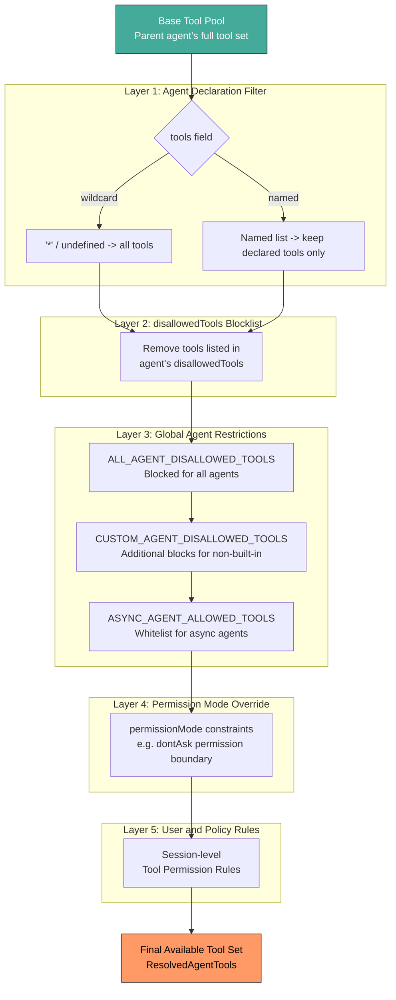

# Chapter 12: Agent Definition and Loading

> In Claude Code's multi-agent architecture, every sub-agent must pass through a rigorous pipeline of definition, loading, validation, and tool filtering before it can be dispatched. This pipeline determines what an agent can do, what it cannot, which model it uses, and how its system prompt is constructed. This chapter provides a complete dissection of the AgentDefinition schema, the three-source loading hierarchy, a deep analysis of all six built-in agents, and the five-layer tool filtering pipeline.

---

## 12.1 The AgentDefinition Schema

### 12.1.1 The Base Type: BaseAgentDefinition

Every agent in the system -- built-in, custom, or plugin -- shares a common base type with over twenty configuration fields. This is the foundational data structure of the entire agent system:

```typescript
export type BaseAgentDefinition = {
  // === Identity and Description ===
  agentType: string                    // Unique identifier, e.g. 'Explore', 'Plan'
  whenToUse: string                    // Description of when this agent should be used

  // === Tool Control ===
  tools?: string[]                     // Available tools list; '*' means all
  disallowedTools?: string[]           // Tool blocklist
  skills?: string[]                    // Loadable skills

  // === MCP Integration ===
  mcpServers?: AgentMcpServerSpec[]    // MCP server connection specs
  requiredMcpServers?: string[]        // MCP servers that must be available

  // === Lifecycle Hooks ===
  hooks?: HooksSettings                // SubagentStart and other hook configs

  // === Appearance and Model ===
  color?: AgentColorName               // Terminal display color
  model?: string                       // Model override ('inherit', 'haiku', 'sonnet', etc.)
  effort?: EffortValue                 // Reasoning effort level

  // === Permissions and Security ===
  permissionMode?: PermissionMode      // Permission mode override

  // === Execution Control ===
  maxTurns?: number                    // Maximum conversation turns
  background?: boolean                 // Whether to run in background
  initialPrompt?: string               // Initial prompt text

  // === File and Path ===
  filename?: string                    // Definition file path
  baseDir?: string                     // Base directory

  // === Context Optimization ===
  omitClaudeMd?: boolean               // Whether to skip CLAUDE.md injection
  criticalSystemReminder_EXPERIMENTAL?: string  // Per-turn mandatory reminder

  // === Memory and Isolation ===
  memory?: AgentMemoryScope            // 'user' | 'project' | 'local'
  isolation?: 'worktree' | 'remote'    // Execution isolation mode

  // === Internal State ===
  pendingSnapshotUpdate?: { snapshotTimestamp: string }
}
```

Each field represents a deliberate design decision. A few deserve special attention:

**`omitClaudeMd`** -- Behind this simple boolean lies a major cost optimization. CLAUDE.md files typically contain hundreds to thousands of tokens of project configuration. For a search-only agent like Explore, this content is entirely wasted. Given that the Explore Agent is invoked over 34 million times per week, skipping even a few hundred tokens per call accumulates to 5-15 Gtok of weekly savings.

**`criticalSystemReminder_EXPERIMENTAL`** -- This field is injected at every turn of the agent's conversation. The Verification Agent uses it to counteract LLM compliance drift -- the tendency of models to skip actual verification steps when given the opportunity.

**`memory`** -- Three scopes (user, project, local) determine where agent memory is persisted. When `isAutoMemoryEnabled()` returns true, the `getSystemPrompt()` closure automatically appends the relevant memory prompt.

### 12.1.2 Three Discriminated Subtypes

The base type branches into three subtypes via a discriminated union on `source`:

```typescript
// Built-in agents: dynamic system prompts that receive ToolUseContext
export type BuiltInAgentDefinition = BaseAgentDefinition & {
  source: 'built-in'
  baseDir: 'built-in'
  callback?: () => void
  getSystemPrompt: (params: {
    toolUseContext: Pick<ToolUseContext, 'options'>
  }) => string
}

// Custom agents from user/project/policy settings
export type CustomAgentDefinition = BaseAgentDefinition & {
  getSystemPrompt: () => string
  source: SettingSource    // 'userSettings' | 'projectSettings' | 'flagSettings' | 'policySettings'
  filename?: string
  baseDir?: string
}

// Plugin agents with plugin metadata
export type PluginAgentDefinition = BaseAgentDefinition & {
  getSystemPrompt: () => string
  source: 'plugin'
  filename?: string
  plugin: string           // Plugin identifier
}

// Union type
export type AgentDefinition =
  | BuiltInAgentDefinition
  | CustomAgentDefinition
  | PluginAgentDefinition
```

The critical difference between subtypes lies in `getSystemPrompt`:

- **Built-in** agents receive `toolUseContext`, enabling runtime-dynamic prompt construction. The Claude Code Guide Agent exploits this to inject current MCP servers, custom skills, and other live configuration into its prompt.
- **Custom** and **Plugin** agents use a parameterless `getSystemPrompt()`. Their prompts are determined at load time, though the closure may incorporate dynamic memory injection.

Type guard functions provide type-safe branching:

```typescript
export function isBuiltInAgent(agent): agent is BuiltInAgentDefinition {
  return agent.source === 'built-in'
}
export function isCustomAgent(agent): agent is CustomAgentDefinition {
  return agent.source !== 'built-in' && agent.source !== 'plugin'
}
export function isPluginAgent(agent): agent is PluginAgentDefinition {
  return agent.source === 'plugin'
}
```

---

## 12.2 Three Agent Sources and the Loading Hierarchy

### 12.2.1 The Priority Chain

Agents load from multiple sources. When names collide, higher-priority definitions overwrite lower-priority ones:

```
built-in < plugin < userSettings < projectSettings < flagSettings < policySettings
```

This chain embodies a clear design principle: **the closer a configuration is to the administrative boundary, the higher its authority**. Organization policy overrides everything. Project settings override user preferences. User preferences override system defaults.



The core loading function uses Map overwrite semantics to implement priority:

```typescript
export function getActiveAgentsFromList(
  allAgents: AgentDefinition[]
): AgentDefinition[] {
  const agentGroups = [
    builtInAgents,
    pluginAgents,
    userAgents,
    projectAgents,
    flagAgents,
    managedAgents,   // policySettings
  ]
  const agentMap = new Map<string, AgentDefinition>()
  for (const agents of agentGroups) {
    for (const agent of agents) {
      agentMap.set(agent.agentType, agent)  // later entries overwrite earlier
    }
  }
  return Array.from(agentMap.values())
}
```

### 12.2.2 Two Formats for Custom Agent Definitions

Custom agents support both JSON and Markdown definition formats.

**JSON Schema format** (validated via Zod):

```typescript
const AgentJsonSchema = z.object({
  description: z.string().min(1),
  tools: z.array(z.string()).optional(),
  disallowedTools: z.array(z.string()).optional(),
  prompt: z.string().min(1),
  model: z.string().trim().min(1).transform(...).optional(),
  effort: z.union([z.enum(EFFORT_LEVELS), z.number().int()]).optional(),
  permissionMode: z.enum(PERMISSION_MODES).optional(),
  mcpServers: z.array(AgentMcpServerSpecSchema()).optional(),
  hooks: HooksSchema().optional(),
  maxTurns: z.number().int().positive().optional(),
  skills: z.array(z.string()).optional(),
  initialPrompt: z.string().optional(),
  memory: z.enum(['user', 'project', 'local']).optional(),
  background: z.boolean().optional(),
  isolation: z.enum(['worktree', 'remote']).optional(),
})
```

**Markdown format** (YAML frontmatter + body):

The `parseAgentFromMarkdown()` function extracts agent definitions from Markdown files:
- Frontmatter `name` maps to `agentType`
- Frontmatter `description` maps to `whenToUse`
- `tools`, `disallowedTools`, `skills` are parsed via `parseAgentToolsFromFrontmatter()`
- The Markdown body becomes the system prompt, wrapped in a `getSystemPrompt()` closure

When agent memory is enabled, the closure dynamically appends memory context at call time:

```typescript
getSystemPrompt: () => {
  if (isAutoMemoryEnabled() && memory) {
    return systemPrompt + '\n\n' + loadAgentMemoryPrompt(agentType, memory)
  }
  return systemPrompt
}
```

### 12.2.3 Loading Result Structure

```typescript
export type AgentDefinitionsResult = {
  activeAgents: AgentDefinition[]    // Agents after priority merge
  allAgents: AgentDefinition[]       // All agents from all sources, pre-merge
  failedFiles?: Array<{              // Files that failed to parse
    path: string
    error: string
  }>
  allowedAgentTypes?: string[]       // Policy-level agent type whitelist
}
```

The `failedFiles` field reflects a fault-tolerant design: a single malformed agent definition file does not prevent other agents from loading.

---

## 12.3 Deep Analysis of Six Built-in Agents

### 12.3.1 Loading Logic and Feature Gates

The `getBuiltInAgents()` function assembles the built-in agent list:

- **Always included**: General Purpose Agent, Statusline Setup Agent
- **Feature-gated** (`tengu_amber_stoat`): Explore Agent, Plan Agent
- **Feature-gated** (`tengu_hive_evidence`): Verification Agent
- **Conditional**: Claude Code Guide Agent -- only included for non-SDK entrypoints
- **Mode switch**: In Coordinator mode, the entire list is replaced by `getCoordinatorAgents()`

### 12.3.2 General Purpose Agent -- The Universal Executor

```
agentType:  'general-purpose'
tools:      ['*']              // Wildcard -- full tool access
model:      (default subagent model)
background: (unspecified)
```

The General Purpose Agent is the default workhorse. Its defining characteristic is `tools: ['*']` -- the wildcard grants access to the parent's entire tool pool after standard filtering. This enables searching, analyzing, editing files, executing commands, and completing arbitrary multi-step tasks.

Its system prompt uses shared modules (`SHARED_PREFIX` and `SHARED_GUIDELINES`) that are reused across multiple built-in agents, ensuring behavioral consistency.

### 12.3.3 Explore Agent -- The Read-Only Search Specialist

```
agentType:      'Explore'
model:          'inherit' (internal) / 'haiku' (external)
disallowedTools: ['Agent', 'ExitPlanMode', 'FileEdit', 'FileWrite', 'NotebookEdit']
omitClaudeMd:   true
```

The Explore Agent is the highest-volume built-in agent, invoked over 34 million times per week. Every aspect of its design reflects cost optimization:

1. **Read-only constraint**: All write operations and recursive agent calls are blocked via `disallowedTools`.
2. **Lightweight model**: External users get Haiku, far cheaper than Sonnet or Opus.
3. **CLAUDE.md omission**: `omitClaudeMd: true` avoids injecting project configuration into the context. At a conservative estimate of 500 tokens saved per invocation, this yields 5-15 Gtok of weekly savings.
4. **Adaptive tool set**: The agent detects whether embedded search tools (bfs/ugrep) are available and dynamically adjusts its prompt guidance accordingly.

### 12.3.4 Plan Agent -- The Architecture Planner

```
agentType:      'Plan'
model:          'inherit'
disallowedTools: (same as Explore)
omitClaudeMd:   true
```

The Plan Agent shares its tool configuration and read-only constraints with the Explore Agent, but serves a different purpose. Its system prompt guides the model to produce structured implementation plans, specifically requiring a "Critical Files for Implementation" section.

The relationship between Plan and Explore is one of shared mechanics, divergent intent -- identical tool capabilities, different prompt directives. This design reduces maintenance overhead while allowing each agent's prompt strategy to evolve independently.

### 12.3.5 Verification Agent -- The Adversarial Tester

```
agentType:      'verification'
color:          'red'
background:     true             // Always runs in background
model:          'inherit'
disallowedTools: ['Agent', 'ExitPlanMode', 'FileEdit', 'FileWrite', 'NotebookEdit']
criticalSystemReminder_EXPERIMENTAL: (injected every turn)
```

The Verification Agent is the most architecturally sophisticated of the six built-in agents. Its design reflects a deep understanding of LLM behavioral weaknesses:

1. **Forced background execution**: `background: true` ensures verification never blocks the main conversation. Verification is inherently time-consuming; there is no reason to make the user wait.

2. **Red color**: The terminal renders this agent in red -- a visual signal that this is a "challenger" role, not an assistant.

3. **Adversarial prompt design**: Approximately 130 lines of prompt text are specifically crafted to counteract common LLM failure modes: skipping verification and immediately approving, producing vague conclusions, failing to actually execute test commands.

4. **Critical System Reminder**: The `criticalSystemReminder_EXPERIMENTAL` field injects a mandatory reminder at every conversation turn, preventing the model from "forgetting" its verification mandate during long interactions.

5. **Limited write access**: While project file modification is blocked, the agent can write to `/tmp` for ephemeral test scripts. This is a targeted exception: verification often requires creating and running throwaway test code.

6. **Structured verdict**: Every verification must end with `VERDICT: PASS`, `VERDICT: FAIL`, or `VERDICT: PARTIAL`. This forces the model to commit to a clear conclusion rather than hedging.

### 12.3.6 Claude Code Guide Agent -- The Documentation Helper

```
agentType:       'claude-code-guide'
model:           'haiku'
permissionMode:  'dontAsk'
tools:           ['Glob', 'Grep', 'Read', 'WebFetch', 'WebSearch']
```

The Claude Code Guide Agent is the most dynamically configured built-in agent. Its `getSystemPrompt()` receives `toolUseContext` and injects live runtime state:

- Currently available custom skills
- Registered custom agents
- Active MCP servers
- Plugin commands
- User settings

It also fetches external documentation maps from `code.claude.com` and `platform.claude.com`, enabling it to direct users to the correct documentation. The `permissionMode: 'dontAsk'` setting ensures documentation lookups never trigger permission prompts, providing a frictionless help experience.

### 12.3.7 Statusline Setup Agent -- The Minimal Toolset

```
agentType:  'statusline-setup'
tools:      ['Read', 'Edit']
model:      'sonnet'
color:      'orange'
```

The Statusline Setup Agent is the smallest built-in agent, equipped with only two tools. Its responsibility is narrowly scoped: convert the user's shell PS1 configuration into Claude Code `statusLine` commands and write the result to `~/.claude/settings.json`.

The choice of Sonnet over Haiku is telling -- while the toolset is minimal, the task requires genuine understanding of shell configuration syntax, which benefits from a more capable model.

---

## 12.4 The omitClaudeMd Optimization: Token Economics at Scale

The `omitClaudeMd` field warrants its own analysis because it exemplifies cost management in a large-scale AI system.

### 12.4.1 The Problem

Every agent invocation injects user context that includes CLAUDE.md contents. For read-only agents like Explore and Plan, the project specifications in CLAUDE.md (coding style, commit conventions, etc.) are entirely irrelevant -- these agents never write code or execute commands.

### 12.4.2 Scale Quantification

Using the Explore Agent as the baseline:

| Metric | Value |
|--------|-------|
| Weekly invocations | 34M+ |
| Typical CLAUDE.md size | 500-2000 tokens |
| Conservative per-call savings | 500 tokens |
| Weekly savings | 17 Gtok (17 billion tokens) |
| Monthly savings | ~68 Gtok |

During `runAgent()` initialization, when `omitClaudeMd: true` is detected, the CLAUDE.md content is stripped from the user context:

```
Agent starts -> check omitClaudeMd -> true -> strip CLAUDE.md from userContext
```

Alongside `omitClaudeMd`, the Explore and Plan agents also have git status information stripped from their system context (controlled by the `tengu_slim_subagent_claudemd` kill switch), further reducing wasted context.

---

## 12.5 The Tool Filtering Pipeline

An agent's available tools are not determined by simple list matching. Instead, they pass through a five-layer filtering pipeline that progressively narrows the tool pool.

### 12.5.1 Pipeline Overview



### 12.5.2 Layer 1: Agent Declaration Filter

The first layer is executed by `resolveAgentTools()`. The `tools` field in the agent definition determines the initial pool:

- **Wildcard (`'*'` or `undefined`)**: Inherits the parent agent's full available tool set. The General Purpose Agent uses this mode.
- **Named list**: Only the declared tool names are retained. The Statusline Setup Agent's `['Read', 'Edit']` exemplifies this mode.

Tool names are matched against `availableToolMap`. Unmatched names are recorded as `invalidTools` for diagnostic purposes.

### 12.5.3 Layer 2: disallowedTools Blocklist

Before wildcard expansion, tools declared in `disallowedTools` are removed. This is the primary safety mechanism for read-only agents like Explore, Plan, and Verification.

A typical blocklist configuration:
```typescript
disallowedTools: ['Agent', 'ExitPlanMode', 'FileEdit', 'FileWrite', 'NotebookEdit']
```

These five tools cover: recursive agent creation, plan mode exit, file editing, file writing, and notebook editing.

### 12.5.4 Layer 3: Global Agent Restrictions

The `filterToolsForAgent()` function imposes three categories of global restrictions:

1. **`ALL_AGENT_DISALLOWED_TOOLS`**: Tools blocked for every agent. These are typically tools reserved for the top-level main loop only.
2. **`CUSTOM_AGENT_DISALLOWED_TOOLS`**: Additional tools blocked for non-built-in agents, preventing custom agents from acquiring elevated privileges.
3. **`ASYNC_AGENT_ALLOWED_TOOLS`**: A whitelist for asynchronous (background) agents. Background agents can only use tools on this list, with an exception for in-process teammates who additionally receive the `Agent` tool and task tools.

Special rules:
- MCP tools (prefixed with `mcp__`) are always permitted, exempt from all restrictions above.
- `ExitPlanMode` is only permitted when the agent is operating in plan mode.

### 12.5.5 Layers 4-5: Permission Mode and User Rules

The fourth and fifth layers handle runtime permissions:

- **Permission Mode**: An agent can specify its own permission level via the `permissionMode` field. The `agentGetAppState` wrapper in `runAgent()` applies this override at runtime -- unless the parent agent is already in `bypassPermissions`, `acceptEdits`, or `auto` mode.
- **Session Tool Permission Rules**: Rules from SDK `cliArg` sources are preserved, while session-level rules are replaced with agent-specific rules for the sub-agent.

### 12.5.6 The Resolution Result

The complete tool resolution result includes diagnostic metadata:

```typescript
export type ResolvedAgentTools = {
  hasWildcard: boolean          // Whether wildcard was used
  validTools: string[]          // Successfully matched tool names
  invalidTools: string[]        // Unmatched tool names (warnings)
  resolvedTools: Tools          // Final available tool instances
  allowedAgentTypes?: string[]  // Whitelist of callable sub-agent types
}
```

---

## 12.6 Dynamic System Prompt Rendering

Agent system prompts are not static text. They are dynamically constructed during the `runAgent()` initialization phase.

### 12.6.1 Built-in Agent Dynamic Prompts

Built-in agents' `getSystemPrompt()` receives `toolUseContext`, enabling prompts to vary based on:

- **Available tools**: The Explore Agent detects whether embedded search tools (bfs/ugrep) are present and adjusts its search guidance accordingly.
- **Runtime configuration**: The Claude Code Guide Agent injects current MCP server, skill, and plugin information.
- **Shared modules**: Multiple agents reuse `SHARED_PREFIX` and `SHARED_GUIDELINES` to ensure behavioral consistency.

### 12.6.2 Custom Agent Prompt Closures

Custom agent system prompts are captured via closures at load time:

```typescript
// Markdown-format agent
getSystemPrompt: () => {
  if (isAutoMemoryEnabled() && memory) {
    return systemPrompt + '\n\n' + loadAgentMemoryPrompt(agentType, memory)
  }
  return systemPrompt
}
```

The closure ensures each call to `getSystemPrompt()` retrieves the latest memory state rather than a stale snapshot from load time.

### 12.6.3 Context Stripping Rules

During context assembly, `runAgent()` performs conditional stripping:

| Condition | Action |
|-----------|--------|
| `omitClaudeMd: true` | Strip CLAUDE.md from userContext |
| Explore / Plan agent | Strip git status from systemContext |
| `tengu_slim_subagent_claudemd` kill switch | Global control over CLAUDE.md stripping |

---

## 12.7 MCP Server Dependencies and Initialization

### 12.7.1 Required MCP Servers

Agents can declare `requiredMcpServers` to specify MCP server dependencies. Matching uses case-insensitive substring comparison:

```typescript
export function hasRequiredMcpServers(
  agent: AgentDefinition,
  availableServers: string[],
): boolean {
  return agent.requiredMcpServers.every(pattern =>
    availableServers.some(server =>
      server.toLowerCase().includes(pattern.toLowerCase()),
    ),
  )
}
```

If a required MCP server is unavailable, the agent does not appear in the available agent list.

### 12.7.2 Agent MCP Server Initialization

`initializeAgentMcpServers()` supports two MCP server spec types:

- **String reference**: Looks up an existing MCP connection by name. The connection is shared and not cleaned up when the agent exits.
- **Inline definition**: `{ [name]: config }` creates a new connection. It is cleaned up when the agent exits.

Policy enforcement: only agents from trusted sources (plugin, built-in, policySettings) can bypass inline MCP server policy restrictions.

---

## 12.8 Chapter Summary

This chapter dissected the "birth certificate" of Claude Code agents -- from the twenty-plus configuration fields in BaseAgentDefinition, through the three-source priority loading chain, to the distinct design philosophy behind each of the six built-in agents.

Key takeaways:

1. **Discriminated Union + Type Guard** is the foundational pattern for handling polymorphic agent definitions. The `source` field determines loading behavior, prompt construction, and runtime capabilities.

2. **The priority override chain** (built-in through policy) follows the principle of "highest administrative authority wins" while preserving the flexibility of user-defined custom agents.

3. **The five-layer tool filtering pipeline** enforces the principle of least privilege: every layer narrows the tool pool, and no layer ever expands it.

4. **Token economics of omitClaudeMd** demonstrates that in a large-scale AI system, a single boolean field can save billions of tokens per week.

5. **The Verification Agent's adversarial design** represents an engineered response to LLM behavioral weaknesses -- not a single-instruction fix, but a multi-layered approach combining a specialized prompt, per-turn reminders, structured verdicts, and background isolation.

The next chapter will dive into the `runAgent()` execution engine, analyzing the complete lifecycle of an agent from initialization to completion.
