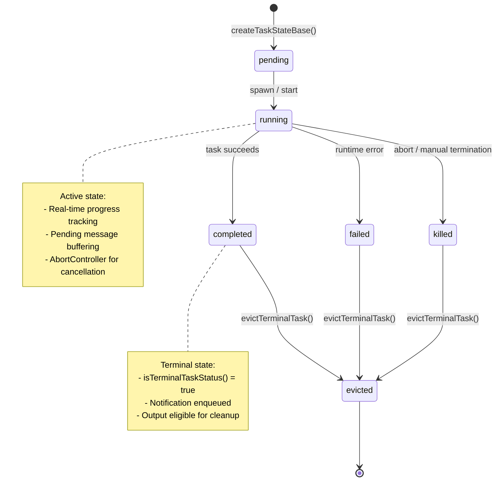
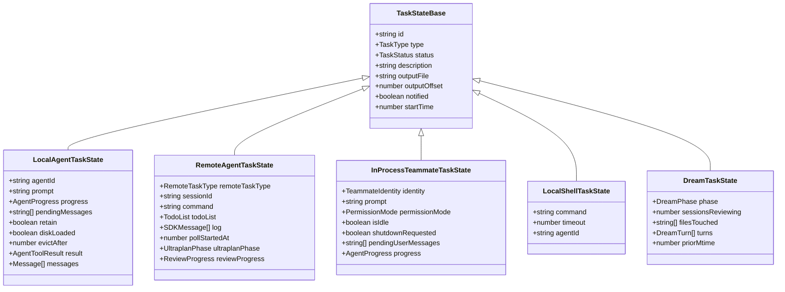

# Chapter 13: Task Management System

Claude Code's task management system is the infrastructure that underpins its multi-agent concurrency model. When a user spawns a background agent, kicks off a shell command, or initiates a cloud-based remote session, the system must uniformly track each task's lifecycle, buffer output streams, and coordinate resource cleanup. This chapter dissects the architecture layer by layer -- from the 7-member TaskType enumeration and its five-state machine, through the disk-based output streaming pattern, to the unique state extensions of each concrete task implementation.

## 13.1 TaskType Enumeration and the TaskStatus State Machine

### Seven Task Types

The system defines all possible task categories through a union type:

```typescript
export type TaskType =
  | 'local_bash'
  | 'local_agent'
  | 'remote_agent'
  | 'in_process_teammate'
  | 'local_workflow'
  | 'monitor_mcp'
  | 'dream'
```

Each type maps to a distinct runtime semantic:

| TaskType | Responsibility | Typical Scenario |
|----------|---------------|-----------------|
| `local_bash` | Background shell command execution | Long-running builds, test suites |
| `local_agent` | Local background agent execution | Async sub-agent investigating a codebase |
| `remote_agent` | Cloud remote session | CCR (Cloud Code Runner) tasks |
| `in_process_teammate` | In-process collaborative agent | Teammate agents in Swarm mode |
| `local_workflow` | Local workflow script execution | Automated workflows (feature-gated) |
| `monitor_mcp` | MCP monitoring task | MCP server monitoring (feature-gated) |
| `dream` | Background memory consolidation | Cross-session knowledge distillation |

### Five-State Machine

All tasks share a unified five-state lifecycle:

```typescript
export type TaskStatus =
  | 'pending'
  | 'running'
  | 'completed'
  | 'failed'
  | 'killed'
```

A terminal-state guard function determines whether a task has reached its end:

```typescript
export function isTerminalTaskStatus(status: TaskStatus): boolean {
  return status === 'completed' || status === 'failed' || status === 'killed'
}
```

The three terminal states (`completed`, `failed`, `killed`) are irreversible once reached. This concise predicate is invoked across the entire task system -- from resource cleanup to notification dispatch to UI state rendering.

### State Transition Diagram



The design philosophy behind this state machine merits attention: it deliberately maintains a minimal five-state structure, while delegating task-specific states (DreamTask's phase, RemoteAgentTask's ultraplanPhase) to each task type's extended state definition. This layered approach lets the core state machine logic handle lifecycle management uniformly across all task types.

## 13.2 TaskStateBase: The Shared Foundation

Every task state type inherits from a common base:

```typescript
export type TaskStateBase = {
  id: string            // Prefixed base-36 random ID
  type: TaskType        // Task type discriminator
  status: TaskStatus    // Current state
  description: string   // Human-readable description
  toolUseId?: string    // Associated tool_use call ID
  startTime: number     // Creation timestamp
  endTime?: number      // Termination timestamp
  totalPausedMs?: number // Cumulative paused duration
  outputFile: string    // Disk output file path
  outputOffset: number  // Last-read byte offset
  notified: boolean     // Whether parent has been notified
}
```

These 12 fields constitute the "minimum common interface" for task management. Several deserve closer analysis.

**The `outputFile` + `outputOffset` pattern.** This is an elegant disk-based stream tracking scheme. Each task writes its output to a dedicated file, and `outputOffset` records the byte position where the parent last stopped reading. When the parent needs to check task progress, it reads incrementally from `outputOffset` rather than re-scanning the entire output. This design lets long-running background tasks (compilation output, agent work logs) report to their parent in a streaming-incremental fashion without imposing memory pressure.

**The `notified` flag.** Ensures each terminal task delivers exactly one notification. After a task completes, `notified` is set to `true` to prevent duplicate completion notifications.

**The `toolUseId` association.** Links a task back to the tool_use call that spawned it, enabling notification messages to route correctly back to the caller.

## 13.3 Task Lifecycle: From Registration to Eviction

A task's complete lifecycle can be summarized in six phases:

```
register --> running --> complete/fail/kill --> notify --> evict
```

**Register.** The task is created and registered in AppState's task list. Its status is `pending`, though most task implementations transition to `running` immediately upon registration.

**Running.** The core execution phase. Each task type behaves differently here -- LocalAgentTask drives `runAgent()`'s async generator loop, RemoteAgentTask polls a remote WebSocket session, InProcessTeammateTask alternates between idle and executing states.

**Complete / Fail / Kill.** Three termination paths:
- `completed`: The task finished normally and produced a usable result.
- `failed`: A runtime error occurred; the task carries an error message.
- `killed`: External interruption via `AbortController.abort()`.

**Notify.** Upon reaching a terminal state, the system pushes an XML-formatted notification message to the parent via `enqueuePendingNotification()`.

**Evict.** The task's output resources are cleaned up. For LocalAgentTask, this involves the `retain` / `evictAfter` mechanism -- if the UI panel is currently displaying the task, `retain = true` blocks immediate cleanup until the panel closes, at which point an `evictAfter` countdown begins.

## 13.4 Task ID Generation: Prefixed Base-36 Identifiers

Each task ID consists of a single-character prefix followed by 8 base-36 random characters:

```typescript
const TASK_ID_PREFIXES: Record<string, string> = {
  local_bash: 'b',
  local_agent: 'a',
  remote_agent: 'r',
  in_process_teammate: 't',
  local_workflow: 'w',
  monitor_mcp: 'm',
  dream: 'd',
}

const TASK_ID_ALPHABET = '0123456789abcdefghijklmnopqrstuvwxyz'

export function generateTaskId(type: TaskType): string {
  const prefix = getTaskIdPrefix(type)
  const bytes = randomBytes(8)
  let id = prefix
  for (let i = 0; i < 8; i++) {
    id += TASK_ID_ALPHABET[bytes[i]! % TASK_ID_ALPHABET.length]
  }
  return id
}
```

Eight base-36 characters yield 36^8 (approximately 2.8 trillion) possible combinations -- collision probability is negligible within a single session's lifetime. The prefix design means task type is immediately visible during debugging: `a3k7xm2p` is a local_agent task, `b9f2q1n8` is a shell task. The use of `crypto.randomBytes()` rather than `Math.random()` ensures cryptographic-grade randomness.

## 13.5 Task Type Hierarchy



Each task type extends the base via TypeScript intersection types (`TaskStateBase &`), adding its own unique state fields. The following sections examine each in detail.

## 13.6 LocalAgentTask: Background Agent Execution

LocalAgentTask is the most complex task implementation, managing the full lifecycle of background agents.

### State Extension

```typescript
export type LocalAgentTaskState = TaskStateBase & {
  type: 'local_agent'
  agentId: string
  prompt: string
  selectedAgent?: AgentDefinition
  agentType: string
  model?: string
  abortController?: AbortController
  unregisterCleanup?: () => void
  error?: string
  result?: AgentToolResult
  progress?: AgentProgress
  retrieved: boolean
  messages?: Message[]
  lastReportedToolCount: number
  lastReportedTokenCount: number
  isBackgrounded: boolean
  pendingMessages: string[]
  retain: boolean
  diskLoaded: boolean
  evictAfter?: number
}
```

### Progress Tracking

The AgentProgress structure provides real-time execution metrics:

```typescript
export type AgentProgress = {
  toolUseCount: number         // Number of tool invocations
  tokenCount: number           // Cumulative token consumption
  lastActivity?: ToolActivity  // Most recent tool activity
  recentActivities?: ToolActivity[]  // Last 5 activities
  summary?: string             // Current work summary
}
```

The `ProgressTracker` updates on each message stream iteration, maintaining a sliding window of at most 5 entries (`recentActivities`). This enables the UI to display what the agent is currently doing -- "Searching `*.ts` files", "Reading `src/config.ts`".

### Message Buffering: pendingMessages

The `pendingMessages` string array implements the ability to send messages to a running agent:

```typescript
export function queuePendingMessage(taskId, msg, setAppState): void
export function drainPendingMessages(taskId, getAppState, setAppState): string[]
```

When a user sends a message to a background agent via the `SendMessage` tool, the message is appended to the `pendingMessages` array. The agent calls `drainPendingMessages()` at each tool-round boundary, injecting all accumulated messages as user messages to continue the conversation. This design avoids forcibly interrupting the agent mid-execution and preserves conversational coherence.

### The retain/evict Lifecycle

When a background agent completes, its state is not immediately removed from memory. The `retain` flag indicates whether the UI panel is currently displaying the task:

- `retain = true`: UI is viewing the task; eviction is blocked.
- `retain = false` with `evictAfter` set: Cleanup triggers when the timestamp is reached.
- `diskLoaded`: Indicates whether the sidechain JSONL has been loaded into memory.

This deferred eviction mechanism prevents the UI flicker that would result from "destroy on completion" while still preventing memory leaks through timed cleanup.

## 13.7 RemoteAgentTask: Cloud Session Management

RemoteAgentTask manages cloud-based CCR (Cloud Code Runner) sessions, supporting multiple remote task subtypes.

### State Extension

```typescript
export type RemoteAgentTaskState = TaskStateBase & {
  type: 'remote_agent'
  remoteTaskType: RemoteTaskType
  remoteTaskMetadata?: RemoteTaskMetadata
  sessionId: string
  command: string
  title: string
  todoList: TodoList
  log: SDKMessage[]
  isLongRunning?: boolean
  pollStartedAt: number
  isRemoteReview?: boolean
  reviewProgress?: {
    stage?: 'finding' | 'verifying' | 'synthesizing'
    bugsFound: number
    bugsVerified: number
    bugsRefuted: number
  }
  isUltraplan?: boolean
  ultraplanPhase?: Exclude<UltraplanPhase, 'running'>
}
```

### Remote Task Subtypes

`RemoteTaskType` further subdivides into five remote operation modes:

```typescript
type RemoteTaskType =
  | 'remote-agent'    // General-purpose remote agent
  | 'ultraplan'       // Multi-phase super planning
  | 'ultrareview'     // Deep code review
  | 'autofix-pr'      // Automated PR fixes
  | 'background-pr'   // Background PR processing
```

### WebSocket Polling and Completion Checkers

The core challenge for remote tasks is that execution happens in the cloud; the local client can only poll for status updates. The `pollStartedAt` field records when polling began, used for timeout detection.

The system uses pluggable completion checkers:

```typescript
export function registerCompletionChecker(
  remoteTaskType: RemoteTaskType,
  checker: RemoteTaskCompletionChecker,
): void
```

On each poll tick, the system invokes the registered `RemoteTaskCompletionChecker` for the task's remote type to determine whether the remote task has finished. This plugin architecture allows different remote task types to define their own completion conditions.

### Ultraplan Phase Tracking

For `ultraplan` tasks, `ultraplanPhase` tracks the multi-phase planning process. This is an enum that excludes `'running'` -- because `'running'` is already covered by the generic `TaskStatus`, `ultraplanPhase` only needs to record plan-specific sub-phases (such as gathering and synthesizing).

### Precondition Checks and Metadata Persistence

Before launching a remote task, the system runs a suite of precondition checks:

```typescript
export async function checkRemoteAgentEligibility():
  Promise<RemoteAgentPreconditionResult>
```

These verify: login status, cloud environment availability, Git repository state, GitHub remote configuration, GitHub App installation, and policy compliance.

Remote task metadata is persisted to a session sidecar file to support session restoration:

```typescript
async function persistRemoteAgentMetadata(meta): Promise<void>
async function removeRemoteAgentMetadata(taskId): Promise<void>
```

## 13.8 InProcessTeammateTask: In-Process Collaboration

InProcessTeammateTask is the most architecturally sophisticated task type in Swarm mode. It runs multiple collaborative agents within a single Node.js process, using AsyncLocalStorage for context isolation.

### Identity System

Each in-process teammate carries a structured identity:

```typescript
export type TeammateIdentity = {
  agentId: string         // "researcher@my-team"
  agentName: string       // "researcher"
  teamName: string
  color?: string
  planModeRequired: boolean
  parentSessionId: string
}
```

The `agentId` adopts an email-style `name@team` format, naturally supporting multi-team scenarios.

### State Extension

```typescript
export type InProcessTeammateTaskState = TaskStateBase & {
  type: 'in_process_teammate'
  identity: TeammateIdentity
  prompt: string
  model?: string
  selectedAgent?: AgentDefinition
  abortController?: AbortController
  currentWorkAbortController?: AbortController
  unregisterCleanup?: () => void
  awaitingPlanApproval: boolean
  permissionMode: PermissionMode
  error?: string
  result?: AgentToolResult
  progress?: AgentProgress
  messages?: Message[]
  inProgressToolUseIDs?: Set<string>
  pendingUserMessages: string[]
  spinnerVerb?: string
  pastTenseVerb?: string
  isIdle: boolean
  shutdownRequested: boolean
  onIdleCallbacks?: Array<() => void>
  lastReportedToolCount: number
  lastReportedTokenCount: number
}
```

Several fields warrant closer examination.

**Dual-layer AbortControllers.** `abortController` governs the teammate's entire lifetime, while `currentWorkAbortController` only aborts the current turn. This design enables fine-grained control: "cancel current work without killing the teammate."

**`isIdle` and `shutdownRequested`.** These two booleans drive the teammate's core collaboration loop. `isIdle = true` indicates the teammate has finished its current task and is waiting for new instructions. `shutdownRequested = true` means the leader wants the teammate to exit, but the exit decision is left to the model (soft shutdown).

**`pendingUserMessages`.** Similar to LocalAgentTask's `pendingMessages`, but drawn from a broader set of sources -- UI panel direct input, mailbox messages, and leader relay messages.

### AsyncLocalStorage Isolation

Multiple teammate agents run in the same Node.js process, sharing a single event loop. AsyncLocalStorage provides per-async-execution-chain private context, ensuring that different teammates' `toolUseContext`, `getAppState`, and other callbacks do not interfere with each other. Each teammate creates an independent `TeammateContext` during spawning, bound to its async execution chain via AsyncLocalStorage.

### Idle State and Mailbox Polling

Teammates enter idle state between turns, polling message sources at 500ms intervals. Polling priority is strictly ordered:

1. In-memory `pendingUserMessages` (from UI panel interaction)
2. Shutdown requests in mailbox (highest priority, prevents starvation)
3. Leader messages (leader represents user intent)
4. First unread peer message (FIFO order)
5. Unclaimed tasks from shared team task list

This priority scheme ensures that leader directives are always processed before peer-to-peer messages.

### Memory Management: Message Capping

In large-scale Swarm scenarios (observed: 292 concurrent agents producing 36.8GB RSS), UI-side message caches must be strictly bounded:

```typescript
export const TEAMMATE_MESSAGES_UI_CAP = 50

export function appendCappedMessage<T>(prev: T[] | undefined, item: T): T[] {
  if (prev === undefined || prev.length === 0) return [item]
  if (prev.length >= TEAMMATE_MESSAGES_UI_CAP) {
    const next = prev.slice(-(TEAMMATE_MESSAGES_UI_CAP - 1))
    next.push(item)
    return next
  }
  return [...prev, item]
}
```

Each teammate retains at most 50 UI messages. When the cap is reached, the oldest message is dropped as each new one arrives. This is a classic sliding-window strategy -- trading historical completeness for memory predictability.

### Shutdown Negotiation

Teammate shutdown is not a simple `abort()` call. It is a negotiation process:

1. The leader sends a shutdown request.
2. The request is written to the teammate's mailbox.
3. The teammate detects the shutdown request during idle polling.
4. The request is injected as a user message into the model context.
5. The model decides whether to exit immediately or finish current work first.

This "soft shutdown" design respects agent autonomy. If the model is in the middle of a critical operation (such as guaranteeing the atomicity of a file write), it can choose to complete that operation before exiting.

## 13.9 LocalShellTask: Background Command Execution

LocalShellTask manages background bash commands with a distinctive stall-detection capability:

```typescript
export type LocalShellSpawnInput = {
  command: string
  description: string
  timeout?: number
  toolUseId?: string
  agentId?: AgentId
  kind?: 'bash' | 'monitor'
}
```

Key features:
- **Stall detection**: Checks output increments every 5 seconds; flags the command as potentially stalled if 45 seconds pass with no new output.
- **Interactive prompt matching**: Detects patterns like `(y/n)`, `Press Enter`, etc., sending a notification when a background task encounters a situation requiring user input.
- **Output tail monitoring**: Implements real-time output stream monitoring via `tailFile()`.

## 13.10 DreamTask: Background Memory Consolidation

DreamTask implements a distinctive "dreaming" mechanism -- consolidating memories from multiple sessions in the background:

```typescript
export type DreamPhase = 'starting' | 'updating'

export type DreamTaskState = TaskStateBase & {
  type: 'dream'
  phase: DreamPhase
  sessionsReviewing: number
  filesTouched: string[]
  turns: DreamTurn[]         // Maximum 30 turns
  abortController?: AbortController
  priorMtime: number         // For lock rollback on kill
}
```

DreamTask's two-phase transition has a clear trigger:
- `'starting'` to `'updating'`: When the first `Edit/Write` tool_use call lands.
- Kill with rollback: `rollbackConsolidationLock()` restores the lock's mtime, ensuring an interrupted consolidation does not leave an inconsistent state.

The `priorMtime` field records the consolidation lock's original modification timestamp before the dream task alters it. If the process is killed, the system rolls back this timestamp to release the lock, allowing the next consolidation to proceed normally. This is a defensive pattern analogous to database transaction rollback.

## 13.11 XML Notification Format

When a task reaches a terminal state, the system informs the parent (typically the Coordinator or the main conversation loop) through an XML-formatted notification message:

```xml
<task-notification>
  <task-id>{taskId}</task-id>
  <tool-use-id>{toolUseId}</tool-use-id>
  <output-file>{outputPath}</output-file>
  <status>{completed|failed|killed}</status>
  <summary>{human-readable summary}</summary>
  <result>{final message content}</result>
  <usage>
    <total_tokens>N</total_tokens>
    <tool_uses>N</tool_uses>
    <duration_ms>N</duration_ms>
  </usage>
  <worktree>
    <worktree-path>{path}</worktree-path>
    <worktree-branch>{branch}</worktree-branch>
  </worktree>
</task-notification>
```

The choice of XML over JSON for the notification format has practical reasoning: XML's structured tags are more reliably parsed by LLMs in conversational context. In Coordinator mode, the system prompt explicitly tells the model "Workers report via `<task-notification>` XML messages," enabling the model to accurately extract task status updates from the conversation stream.

## 13.12 Task Registry and Lookup

All task implementations are managed through a central registry:

```typescript
export function getAllTasks(): Task[] {
  const tasks: Task[] = [
    LocalShellTask,
    LocalAgentTask,
    RemoteAgentTask,
    DreamTask,
  ]
  if (LocalWorkflowTask) tasks.push(LocalWorkflowTask)
  if (MonitorMcpTask) tasks.push(MonitorMcpTask)
  return tasks
}

export function getTaskByType(type: TaskType): Task | undefined {
  return getAllTasks().find(t => t.type === type)
}
```

The four core task types (shell, local agent, remote agent, dream) are always present, while `LocalWorkflowTask` and `MonitorMcpTask` are feature-gated -- registered only when their corresponding feature flags are enabled.

Each registered `Task` object implements a uniform interface:

```typescript
export type Task = {
  name: string
  type: TaskType
  kill(taskId: string, setAppState: SetAppState): Promise<void>
}
```

The `kill` method is mandatory for every task type. Regardless of how different the internal execution logic may be, the system needs a uniform pathway to terminate any running task.

## 13.13 Design Summary

Claude Code's task management system demonstrates several architectural patterns worth studying.

**Unified base type with discriminated extensions.** `TaskStateBase` provides common fields; each task type adds its own via intersection types, with the `type` field serving as the discriminator. This is idiomatic TypeScript for managing polymorphic state.

**Disk-based stream tracking.** The `outputFile` + `outputOffset` pattern persists output to disk, with the parent reading incrementally from the offset. This decouples memory usage from task lifetime.

**Deferred eviction.** The `retain` / `evictAfter` mechanism avoids the UI flicker of "destroy on completion" while preventing memory leaks through timed cleanup.

**Soft shutdown negotiation.** InProcessTeammateTask's shutdown is not a forced abort. Instead, a message is injected into the model context, letting the model decide when to exit. This strikes a balance between agent autonomy and system controllability.

**Prefixed IDs.** A single-character prefix gives task IDs both type information and uniqueness simultaneously -- invaluable during log analysis and debugging.

The system's core design decision -- unifying heterogeneous task types under a five-state machine, handling variation through type extensions, and bridging LLM comprehension through an XML notification format -- embodies a pragmatic approach to managing concurrent workloads in complex agent systems.
