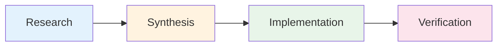
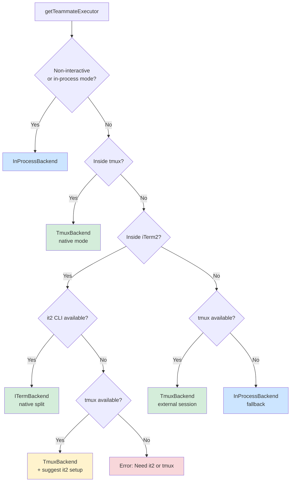
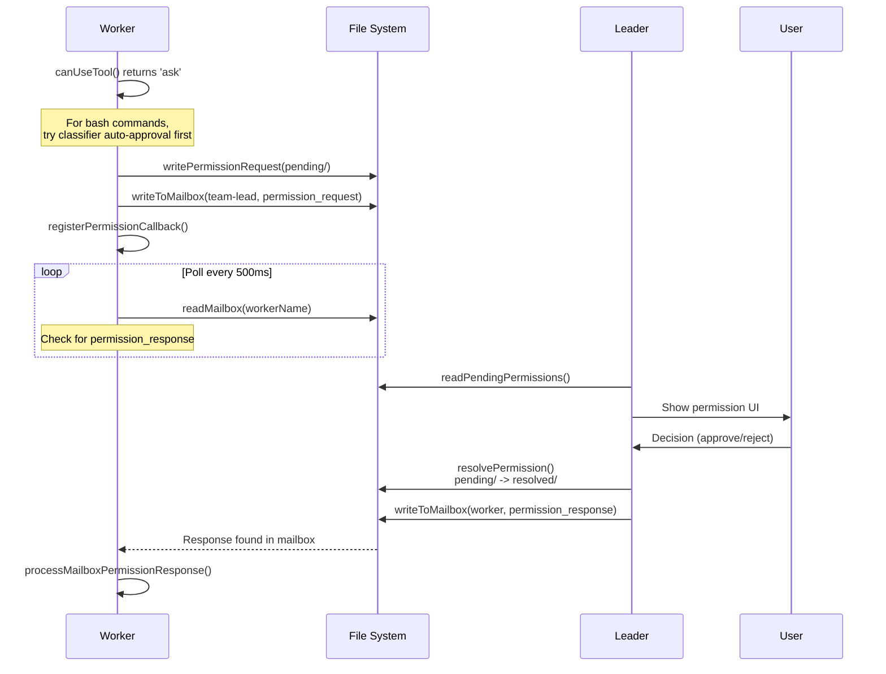
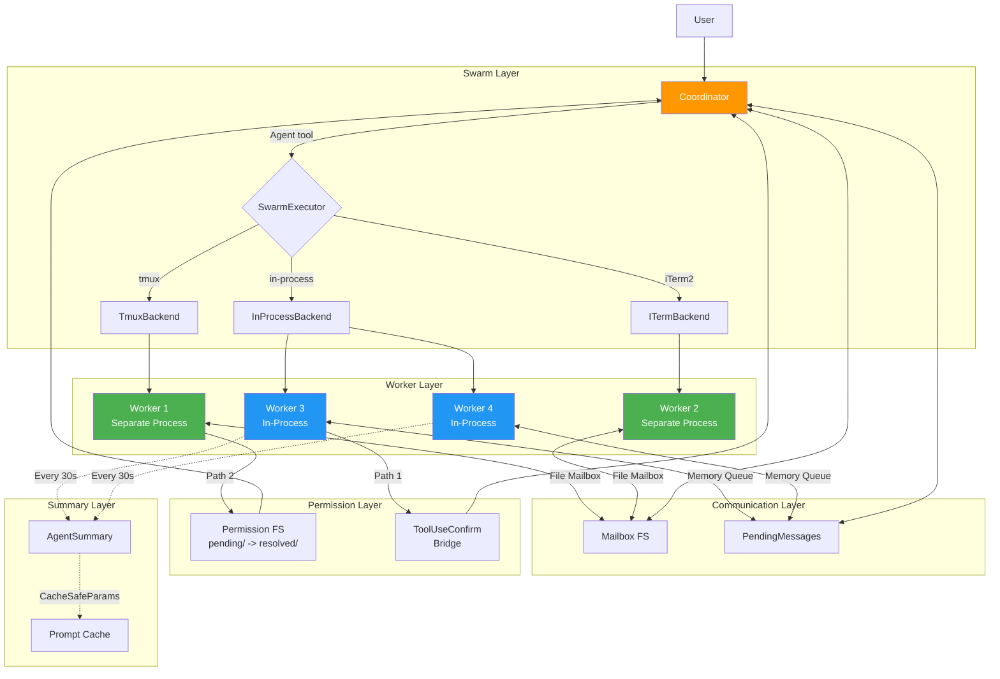

# Chapter 14: Multi-Agent Coordination

## Introduction

In previous chapters, we examined Claude Code's single-agent execution loop -- from prompt construction through tool invocation to message stream processing. But single-agent architecture hits a fundamental efficiency ceiling when facing large-scale engineering tasks: one agent can only read one file, execute one command, or edit one location at a time. When a task involves cross-module investigation, parallel modification of multiple files, and concurrent test execution, the cost of serial processing becomes unacceptable.

Claude Code's multi-agent coordination system is the most complex part of the entire architecture. It resolves a set of inherently contradictory design constraints: agents need to share context without coupling state; they need parallel execution while synchronizing permission decisions; they need distributed operation while presenting a unified session to the user.

This chapter begins with Coordinator Mode's orchestrator/executor duality, then systematically examines the Swarm backend infrastructure, the In-Process Runner's idle loop, Permission Synchronization's dual-path design, Fork Subagent's cache optimization strategy, the Agent Summary periodic summarization service, and the Inter-Agent Communication message routing mechanism.

---

## 14.1 Coordinator Mode: Separating Orchestrator from Executor

### 14.1.1 Mode Detection

Coordinator Mode is the top-level architectural pattern of Claude Code's multi-agent system. It splits the traditional monolithic agent into two roles: the **Coordinator** (orchestrator) and **Workers** (executors).

The detection logic is straightforward:

```typescript
export function isCoordinatorMode(): boolean {
  if (feature('COORDINATOR_MODE')) {
    return isEnvTruthy(process.env.CLAUDE_CODE_COORDINATOR_MODE)
  }
  return false
}
```

When Coordinator Mode activates, the built-in agent registry is entirely replaced -- `getBuiltInAgents()` no longer returns the general-purpose Explore, Plan, and General Purpose agents, but instead returns a coordinator-specific agent set defined by `getCoordinatorAgents()`.

### 14.1.2 Design Philosophy of the ~370-Line System Prompt

The Coordinator receives a system prompt of approximately 370 lines that defines its complete behavioral envelope. The core design principles deserve close examination:

**Role definition**: The Coordinator is a pure orchestrator -- it does not directly read files, execute commands, or edit code. Its sole responsibilities are: (1) decompose tasks, (2) direct Workers, (3) synthesize results, and (4) communicate with the user.

**Available tools** are strictly limited:

| Tool | Purpose |
|------|---------|
| `Agent` | Spawn new Workers |
| `SendMessage` | Send messages to existing Workers |
| `TaskStop` | Terminate running Workers |
| `subscribe_pr_activity` | Subscribe to GitHub PR events |

**Four-phase workflow**:



| Phase | Actor | Purpose |
|-------|-------|---------|
| Research | Workers (parallel) | Investigate codebase, gather information |
| Synthesis | Coordinator | Read findings, craft detailed specifications |
| Implementation | Workers | Make code changes, commit |
| Verification | Workers | Test changes, prove correctness |

### 14.1.3 Anti-Pattern Detection in Prompt Engineering

The most valuable section of this system prompt is its explicit defense against **anti-patterns**:

**"Workers cannot see the Coordinator's conversation"** -- this is the most common cognitive error in multi-agent systems. Every instruction the Coordinator sends to a Worker must be self-contained, with no implicit context dependencies.

**"Never write 'based on your findings'"** -- this anti-pattern appears trivial but reveals a deep issue: when the Coordinator says "based on your findings," it assumes the Worker's context window contains the previous research results. But Workers are independent agent instances -- each conversation starts from scratch.

**Continue vs. Spawn decision matrix** -- the prompt defines explicit criteria: if the new task significantly overlaps with a completed Worker's context (e.g., having the researcher implement fixes based on their own findings), use `SendMessage` to continue the existing Worker; if the task is entirely independent, spawn a new Worker.

### 14.1.4 Worker Tool Context

The context passed to Workers is constructed via `getCoordinatorUserContext()`:

```typescript
export function getCoordinatorUserContext(
  mcpClients: ReadonlyArray<{ name: string }>,
  scratchpadDir?: string,
): { [k: string]: string }
```

This function provides Workers with three categories of information:
1. **Available tools list** -- from `ASYNC_AGENT_ALLOWED_TOOLS`, minus internal tools
2. **MCP server names** -- external services available to Workers
3. **Scratchpad directory** -- a temporary filesystem for cross-Worker knowledge sharing

Internal tools are explicitly filtered out:

```typescript
const INTERNAL_WORKER_TOOLS = new Set([
  TEAM_CREATE_TOOL_NAME,
  TEAM_DELETE_TOOL_NAME,
  SEND_MESSAGE_TOOL_NAME,
  SYNTHETIC_OUTPUT_TOOL_NAME,
])
```

This ensures Workers cannot create teams or send messages on their own -- those capabilities belong exclusively to the Coordinator.

---

## 14.2 Swarm Backend Infrastructure

### 14.2.1 Three Backend Types

The Swarm system is the physical infrastructure layer for Claude Code's multi-agent execution. It provides three backend implementations:

```typescript
export type BackendType = 'tmux' | 'iterm2' | 'in-process'
```

Each backend corresponds to different runtime environments and capability profiles:

| Backend | Isolation Level | Visualization | Use Case |
|---------|----------------|---------------|----------|
| Tmux | Process-level | Independent panes | Linux servers, SSH |
| iTerm2 | Process-level | Native split panes | macOS desktop |
| In-Process | Thread-level | No independent UI | Non-interactive, CI/CD |

### 14.2.2 The TeammateExecutor Unified Interface

Regardless of the underlying backend, the upper layer interacts through a unified `TeammateExecutor` interface:

```typescript
export type TeammateExecutor = {
  readonly type: BackendType
  isAvailable(): Promise<boolean>
  spawn(config: TeammateSpawnConfig): Promise<TeammateSpawnResult>
  sendMessage(agentId: string, message: TeammateMessage): Promise<void>
  terminate(agentId: string, reason?: string): Promise<boolean>
  kill(agentId: string): Promise<boolean>
  isActive(agentId: string): Promise<boolean>
}
```

The interface design reflects clear lifecycle semantics: `spawn` creates, `sendMessage` communicates, `terminate` performs graceful shutdown (sends a shutdown request allowing the agent to clean up), and `kill` forces termination (directly aborts the controller).

### 14.2.3 Backend Detection Cascade



Key rules in the detection logic:
1. **When running inside tmux, always use tmux** -- even when running tmux inside iTerm2, the tmux backend is selected
2. **iTerm2 requires the `it2` CLI** -- without it, falls back to tmux
3. **The ultimate fallback is In-Process** -- guarantees multi-agent operation in any environment

### 14.2.4 Pane Backend Low-Level Operations

The Tmux and iTerm2 backends share a `PaneBackend` interface providing terminal pane-level operation primitives:

```typescript
export type PaneBackend = {
  createTeammatePaneInSwarmView(name, color): Promise<CreatePaneResult>
  sendCommandToPane(paneId, command): Promise<void>
  setPaneBorderColor(paneId, color): Promise<void>
  killPane(paneId): Promise<boolean>
  hidePane(paneId): Promise<boolean>
  showPane(paneId, target): Promise<boolean>
  rebalancePanes(windowTarget, hasLeader): Promise<void>
  // ...
}
```

The Tmux backend uses a serialized lock mechanism (`acquirePaneCreationLock`) to prevent race conditions during parallel spawns, and adds a 200ms delay after pane creation to allow shell initialization.

---

## 14.3 In-Process Runner: The Continuous Prompt Loop

### 14.3.1 Teammate Lifecycle

The In-Process Runner is the lightest-weight multi-agent execution mode -- teammates run as async tasks within the main process, without creating separate processes.

The spawn phase creates:
1. An independent `AbortController` (not linked to the parent -- teammates survive leader query interruption)
2. A `TeammateIdentity` (plain data structure stored in AppState)
3. An `InProcessTeammateTaskState` (initial state: `running`, `isIdle: false`, `shutdownRequested: false`)

```typescript
export type TeammateIdentity = {
  agentId: string      // "researcher@my-team"
  agentName: string    // "researcher"
  teamName: string
  color?: string
  planModeRequired: boolean
  parentSessionId: string
}
```

### 14.3.2 The Core Execution Loop

The heart of `runInProcessTeammate()` is a **continuous prompt loop** -- unlike a standard agent that executes once and exits, an In-Process Teammate enters an idle state after completing a round of work, waiting for the next instruction:

```
1. Build system prompt (default + addendum)
2. Resolve agent definition with teammate-essential tools injected
3. Create canUseTool function with permission bridge
4. Set initial prompt
5. LOOP:
   a. Create turn AbortController
   b. Run runAgent() with prompt, collecting messages
   c. Track progress, update AppState
   d. Mark as idle
   e. Send idle notification to leader
   f. Wait for next prompt, shutdown request, or abort
   g. Process mailbox messages (team-lead priority over peers)
   h. Check task list for unclaimed tasks
   i. If new prompt: inject as user message, continue loop
   j. If shutdown: inject as user message for model decision
   k. If aborted: exit loop
6. Mark task completed/failed, cleanup
```

### 14.3.3 Idle State and Polling

The teammate polls every 500ms while idle:

```typescript
type WaitResult =
  | { type: 'shutdown_request'; request; originalMessage }
  | { type: 'new_message'; message; from; color?; summary? }
  | { type: 'aborted' }
```

The polling priority design is worth careful study:

1. **In-memory `pendingUserMessages`** -- highest priority, from transcript viewing
2. **Shutdown requests** -- prevents shutdown starvation under message flooding
3. **Team-lead messages** -- the leader represents user intent
4. **Peer messages** -- FIFO messages from sibling teammates
5. **Unclaimed tasks** -- claimed from the shared task list

### 14.3.4 Memory Management

Memory management in large-scale Swarm scenarios is a real engineering challenge. The source code documents an extreme case: 292 concurrent agents consuming 36.8GB of memory, with each agent at approximately 20MB RSS after 500+ turns.

The solution is a UI-level message cap:

```typescript
export const TEAMMATE_MESSAGES_UI_CAP = 50

export function appendCappedMessage<T>(prev: T[] | undefined, item: T): T[] {
  if (prev && prev.length >= TEAMMATE_MESSAGES_UI_CAP) {
    const next = prev.slice(-(TEAMMATE_MESSAGES_UI_CAP - 1))
    next.push(item)
    return next
  }
  return [...prev ?? [], item]
}
```

---

## 14.4 Permission Synchronization: Dual-Path Design

### 14.4.1 Problem Statement

Permission synchronization in a multi-agent system presents a unique challenge: Workers need to execute operations that may modify the filesystem, but permission authority belongs to the user. In a distributed execution environment, Workers may run in different processes or even different terminal panes, unable to directly display UI dialogs.

Claude Code addresses this with a dual-path permission synchronization system.

### 14.4.2 Path 1: Leader ToolUseConfirm Bridge (Preferred)

When the Worker runs in the same process as the Leader, the Worker can directly inject permission requests into the Leader's UI queue:

```typescript
function createInProcessCanUseTool(
  identity: TeammateIdentity,
  abortController: AbortController,
): CanUseToolFn
```

The workflow:
1. Worker's `canUseTool()` returns `'ask'`
2. Worker injects the request via `getLeaderToolUseConfirmQueue()`
3. Leader UI displays a ToolUseConfirm dialog with Worker badge (colored by team identity)
4. User makes a decision (allow/reject)
5. Callback returns the result to the Worker
6. Permission updates are written back to the Leader's context (`preserveMode: true`)

### 14.4.3 Path 2: File-Based Mailbox Fallback

When the Worker runs in a separate process (Tmux/iTerm2 backend), the file system serves as the communication medium:



### 14.4.4 File System Layout

```
~/.claude/teams/{teamName}/permissions/
  pending/
    {requestId}.json    # Written by Worker, read by Leader
    .lock               # Directory-level file lock
  resolved/
    {requestId}.json    # Written by Leader, read by Worker
```

The request schema carries complete contextual information:

```typescript
export const SwarmPermissionRequestSchema = z.object({
  id: z.string(),
  workerId: z.string(),
  workerName: z.string(),
  workerColor: z.string().optional(),
  teamName: z.string(),
  toolName: z.string(),
  toolUseId: z.string(),
  description: z.string(),
  input: z.record(z.string(), z.unknown()),
  status: z.enum(['pending', 'approved', 'rejected']),
  resolvedBy: z.enum(['worker', 'leader']).optional(),
  feedback: z.string().optional(),
  updatedInput: z.record(z.string(), z.unknown()).optional(),
  permissionUpdates: z.array(z.unknown()).optional(),
  createdAt: z.number(),
})
```

All write operations use directory-level file locking via `lockfile.lock()` to prevent concurrent writes from corrupting data.

### 14.4.5 Special Handling for Bash Commands

For bash commands, the Worker first attempts classifier-based auto-approval (`awaitClassifierAutoApproval()`) before initiating a full permission request. The classifier is a lightweight safety classification model that can determine whether a command is safe (e.g., `ls`, `cat`, `git status`). The full permission synchronization flow is only engaged when the classifier cannot auto-approve.

---

## 14.5 Fork Subagent: Cache-Optimized Parallel Branching

### 14.5.1 Design Motivation

Fork Subagent is a specialized agent creation mode whose core innovation is **prompt cache sharing** -- by constructing byte-identical API request prefixes, multiple parallel forks share the same prompt cache, significantly reducing token costs.

```typescript
export const FORK_AGENT = {
  agentType: 'fork',
  tools: ['*'],
  maxTurns: 200,
  model: 'inherit',
  permissionMode: 'bubble',
  source: 'built-in',
  getSystemPrompt: () => '',  // unused -- fork inherits parent's rendered bytes
}
```

Note that `getSystemPrompt` returns an empty string -- this is deliberate. The fork path passes the parent's already-rendered system prompt bytes via `override.systemPrompt`. Re-invoking `getSystemPrompt()` could diverge due to GrowthBook cold/warm state differences, busting the prompt cache.

### 14.5.2 buildForkedMessages() -- The Cache Sharing Key

```typescript
export function buildForkedMessages(
  directive: string,
  assistantMessage: AssistantMessage,
): MessageType[]
```

The API request structure for all fork children:

```
[System prompt (parent's rendered bytes)]
[Tool definitions (identical pool)]
[Conversation history (identical)]
[Assistant message (all tool_use blocks)]
[User message: placeholder tool_results... + per-child directive]
```

Placeholder text: `'Fork started -- processing in background'`

Only the final directive text block differs between children, maximizing cache hit rates.

### 14.5.3 Recursive Fork Guard

Fork children retain the Agent tool in their tool pool (to maintain tool definition cache consistency), necessitating an explicit recursive guard:

```typescript
export function isInForkChild(messages: MessageType[]): boolean {
  return messages.some(m => {
    if (m.type !== 'user') return false
    return m.message.content.some(
      block => block.type === 'text' &&
        block.text.includes(`<${FORK_BOILERPLATE_TAG}>`)
    )
  })
}
```

By detecting whether the fork boilerplate tag exists in the conversation history, the system determines if execution is already inside a fork child -- if so, further forking is prohibited.

### 14.5.4 Child Behavioral Constraints

Each fork child receives a directive containing 10 non-negotiable rules:

1. "You are a forked worker process. You are NOT the main agent."
2. "Do NOT spawn sub-agents; execute directly."
3. Do not converse, ask questions, or suggest next steps
4. Use tools directly (Bash, Read, Write)
5. If files are modified, commit and include the hash
6. Do not emit text between tool calls
7. Stay within the directive scope
8. Keep the report under 500 words
9. Response MUST begin with "Scope:"
10. Report structured facts, then stop

The enforced output format:

```
Scope: <assigned scope>
Result: <key findings>
Key files: <relevant paths>
Files changed: <list with commit hash>
Issues: <if any>
```

### 14.5.5 Mutual Exclusion with Coordinator Mode

Fork Subagent and Coordinator Mode are mutually exclusive:

```typescript
export function isForkSubagentEnabled(): boolean {
  if (feature('FORK_SUBAGENT')) {
    if (isCoordinatorMode()) return false  // mutually exclusive
    if (getIsNonInteractiveSession()) return false
    return true
  }
  return false
}
```

This is an architectural design decision -- Coordinator Mode already has its own parallel Worker management mechanism, and introducing forks on top would cause complexity explosion.

---

## 14.6 Agent Summary Service

### 14.6.1 Periodic Summarization Mechanism

When multiple agents run in parallel, the user needs to understand what each agent is doing. The Agent Summary service provides automatic summaries on a 30-second cycle:

```typescript
export function startAgentSummarization(
  taskId: string,
  agentId: AgentId,
  cacheSafeParams: CacheSafeParams,
  setAppState: TaskContext['setAppState'],
): { stop: () => void }
```

Key design decisions:
- **Interval: 30 seconds** (`SUMMARY_INTERVAL_MS = 30_000`)
- **Uses `runForkedAgent()`** to fork the sub-agent's conversation for summarization
- **Tools retained but disabled** -- tool definitions are kept in the request for cache key matching, but all tools are denied via the `canUseTool` callback
- **No `maxOutputTokens` set** -- avoids invalidating the prompt cache
- **Timer resets on completion** -- prevents overlapping summaries

### 14.6.2 Summary Prompt Design

```typescript
function buildSummaryPrompt(previousSummary: string | null): string
```

Requests a 3-5 word present-tense description naming the specific file or function:

- **Good**: "Reading runAgent.ts", "Fixing null check in validate.ts"
- **Bad**: "Analyzed the branch diff" (past tense), "Investigating the issue" (too vague)

When a previous summary exists, an instruction is appended requiring something different.

### 14.6.3 Cache Sharing via CacheSafeParams

The summary service shares the prompt cache with the parent agent through `CacheSafeParams`. This means the prefix portion of the summary request (system prompt + tool definitions + conversation history) is identical to the parent agent's request, with only the summary directive at the end differing -- the same cache optimization strategy used by fork subagents.

### 14.6.4 Execution Flow

1. Timer fires
2. Read current messages via `getAgentTranscript(agentId)`
3. Skip if fewer than 3 messages
4. Filter incomplete tool calls
5. Build fork parameters with current messages
6. Run forked agent with tools denied
7. Extract text from the first assistant message
8. Update task state via `updateAgentSummary()`
9. Schedule the next timer after completion (not before)

---

## 14.7 Inter-Agent Communication: Message Routing

### 14.7.1 The SendMessage Tool

`SendMessage` is the core tool for inter-agent communication:

```typescript
const inputSchema = z.object({
  to: z.string().describe('Recipient: teammate name, "*" for broadcast, ...'),
  summary: z.string().optional().describe('5-10 word summary for UI preview'),
  message: z.union([
    z.string(),
    StructuredMessage(),
  ]),
})
```

The message body can be plain text or a structured message. Structured messages support three protocol types:

```typescript
const StructuredMessage = z.discriminatedUnion('type', [
  z.object({ type: z.literal('shutdown_request'),
             reason: z.string().optional() }),
  z.object({ type: z.literal('shutdown_response'),
             request_id: z.string(),
             approve: semanticBoolean(),
             reason: z.string().optional() }),
  z.object({ type: z.literal('plan_approval_response'),
             request_id: z.string(),
             approve: semanticBoolean(),
             feedback: z.string().optional() }),
])
```

### 14.7.2 Four-Path Message Routing

The `call()` method of `SendMessage` implements four routing paths:

**Path 1: Cross-Session Communication**
- `uds:/path/to.sock` -- connects to a local Claude session via Unix Domain Socket
- `bridge:session_...` -- connects to a remote peer via Anthropic's Remote Control servers

**Path 2: In-Process Subagent**
- Looks up `appState.agentNameRegistry` or converts to `AgentId`
- Running agents: `queuePendingMessage()` for delivery at the next tool round
- Stopped agents: `resumeAgentBackground()` for automatic resumption

**Path 3: Teammate Mailbox**
- Single recipient: `writeToMailbox(recipientName, ...)`
- Broadcast (`*`): iterates all team members (linear cost in team size)

**Path 4: Structured Protocol Messages**
- `shutdown_request` -> `handleShutdownRequest()` -> writes to target's mailbox
- `shutdown_response` (approve) -> `handleShutdownApproval()` -> aborts controller for in-process, or `gracefulShutdown()` for pane-based agents
- `plan_approval_response` -> writes approval/rejection to mailbox with inherited permission mode

### 14.7.3 XML Notification Format

Background agents report completion via XML-structured notifications:

```xml
<task-notification>
  <task-id>{taskId}</task-id>
  <tool-use-id>{toolUseId}</tool-use-id>
  <output-file>{outputPath}</output-file>
  <status>{completed|failed|killed}</status>
  <summary>{human-readable summary}</summary>
  <result>{finalMessage}</result>
  <usage>
    <total_tokens>N</total_tokens>
    <tool_uses>N</tool_uses>
    <duration_ms>N</duration_ms>
  </usage>
</task-notification>
```

These notifications are pushed via `enqueuePendingNotification()` and arrive as user-role messages to the parent/coordinator.

### 14.7.4 Teammate Mailbox Protocol

The file-based mailbox is the low-level transport layer for cross-process agent communication:

```typescript
writeToMailbox(recipientName, message, teamName): Promise<void>
readMailbox(agentName, teamName): Promise<MailboxMessage[]>
markMessageAsReadByIndex(agentName, teamName, index): Promise<void>
```

Supported special message types:
- `createShutdownRequestMessage()` -- shutdown request
- `createShutdownApprovedMessage()` -- shutdown approval (includes paneId/backendType for cleanup)
- `createIdleNotification()` -- idle status notification
- `createPermissionRequestMessage()` -- permission delegation request
- `createPermissionResponseMessage()` -- permission resolution response

---

## 14.8 Architectural Overview: How Components Collaborate



---

## Summary

Claude Code's multi-agent coordination system demonstrates a pragmatic engineering philosophy: rather than pursuing a theoretically perfect distributed system, it finds workable solutions within real-world constraints.

The Coordinator Mode's ~370-line system prompt is not a configuration file but a behavioral specification -- it defines a complete task orchestration protocol through natural language. The Swarm backend's three-tier cascade ensures coverage from Linux servers to macOS desktops to CI environments. The In-Process Runner's idle loop transforms agents from "execute once and exit" into long-running "continuous service" processes. Permission Synchronization's dual-path design gracefully switches between in-process direct bridging and cross-process filesystem communication. Fork Subagent's byte-level prefix consistency is an elegant cost optimization technique. The Agent Summary service's 30-second periodic summarization solves the multi-agent observability problem.

These components collectively form a multi-agent system that works in practice -- it is not perfect, containing engineering compromises such as 500ms polling latency, file lock contention, and memory caps, but it delivers meaningful parallel acceleration for real-world software engineering tasks.

The next chapter examines Claude Code's remote execution and headless modes, exploring how the multi-agent capabilities introduced here extend into the cloud.
