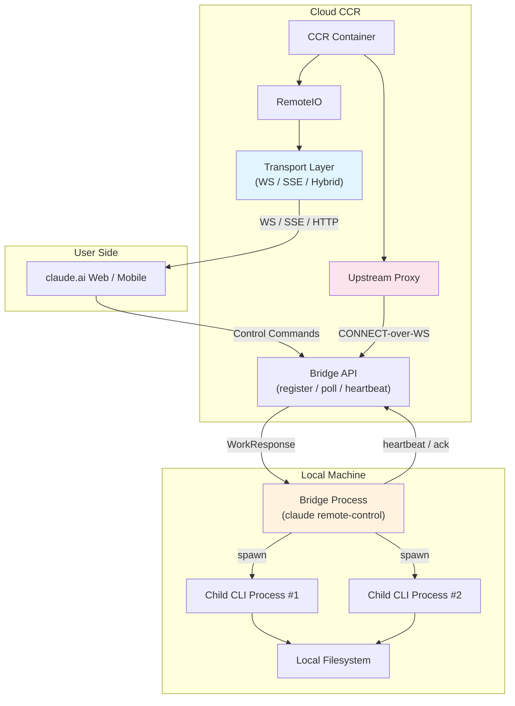
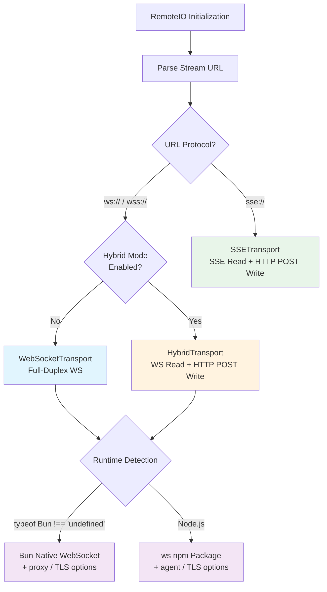

# Chapter 15: Remote and Distributed Execution

> **Chapter Summary**
>
> Claude Code is not confined to the developer's local terminal. Through its Bridge architecture and CCR (Claude Code Remote) container system, it extends seamlessly from a local CLI to cloud-hosted execution. This chapter dissects the remote execution architecture: how the Bridge system polls, dispatches, and manages remote sessions; how three Transport protocols (WebSocket, SSE, Hybrid) deliver reliable communication across different network conditions; how exponential backoff and sleep detection ensure robust reconnection; how the Upstream Proxy enables organization-level traffic forwarding within CCR containers; and how token security measures balance safety with availability through heap memory isolation and fail-open design. Finally, we analyze RemoteAgentTask's session tracking mechanism and GrowthBook-driven poll interval tuning.

---

## 15.1 Architectural Overview: From Local to Cloud

Claude Code's remote execution architecture employs the classic **Bridge pattern**: a local CLI process acts as a bridge, connecting on one side to claude.ai's web or mobile interface and on the other side spawning child processes to manage remote sessions. The core advantage of this design is that users never need to directly expose local filesystem or shell access from the web frontend -- all operations are mediated through the Bridge process.

When the system runs in CCR mode (`CLAUDE_CODE_REMOTE=true`), the entire CLI operates inside a cloud container, using `RemoteIO` in place of the standard `StructuredIO`, and communicating with external clients through the Transport layer.



### Entering Bridge Mode

The Bridge entry point lives in `cli.tsx`'s fast-path dispatch table at priority 7:

```typescript
if (feature('BRIDGE_MODE') && (args[0] === 'remote-control' || args[0] === 'rc')) {
  const { bridgeMain } = await import('../bridge/bridgeMain.js');
  await bridgeMain(args.slice(1));
  return;
}
```

`feature('BRIDGE_MODE')` is a Bun compile-time macro. When the feature is disabled, the entire branch is eliminated from the build output via Dead Code Elimination (DCE), ensuring the external distribution contains zero Bridge-related code.

---

## 15.2 Session Management: Creation, Polling, Heartbeat, Archival

At its core, the Bridge is a stateful polling loop. Let us decompose its lifecycle.

### 15.2.1 Bridge Configuration

```typescript
export type BridgeConfig = {
  dir: string;
  machineName: string;
  branch: string;
  gitRepoUrl: string | null;
  maxSessions: number;
  spawnMode: SpawnMode;         // 'single-session' | 'worktree' | 'same-dir'
  bridgeId: string;             // Client-generated UUID
  workerType: string;           // 'claude_code' | 'claude_code_assistant'
  environmentId: string;
  reuseEnvironmentId?: string;  // Backend-issued ID for reconnection
  apiBaseUrl: string;
  sessionIngressUrl: string;
  sessionTimeoutMs?: number;    // Default: 24 hours
};
```

The `spawnMode` field governs multi-session isolation: `single-session` allows only one concurrent session; `worktree` creates an independent Git worktree per session; `same-dir` runs concurrent sessions in the same directory.

### 15.2.2 The Main Loop

```typescript
export async function runBridgeLoop(
  config: BridgeConfig,
  environmentId: string,
  environmentSecret: string,
  api: BridgeApiClient,
  spawner: SessionSpawner,
  // ...
): Promise<void> {
  const activeSessions = new Map<string, SessionHandle>();
  const completedWorkIds = new Set<string>();

  // Main poll loop with exponential backoff
  while (!signal.aborted) {
    const work = await api.pollForWork(environmentId, secret, signal);
    if (work) {
      const session = spawner.spawn(opts, dir);
      activeSessions.set(session.sessionId, session);
      await api.acknowledgeWork(environmentId, work.id, token);
    }
    await sleep(getPollInterval());
  }
}
```

This simplified pseudocode shows the core flow. The actual implementation maintains several additional state maps:

| State Map | Purpose |
|-----------|---------|
| `activeSessions` | sessionId -> SessionHandle |
| `sessionStartTimes` | sessionId -> start timestamp |
| `sessionWorkIds` | sessionId -> workId |
| `sessionIngressTokens` | sessionId -> ingress token |
| `completedWorkIds` | Set of finished workIds (deduplication) |
| `timedOutSessions` | Set of timed-out sessionIds |

### 15.2.3 Heartbeat and Token Refresh

The Bridge maintains session liveness through two parallel mechanisms:

**Heartbeat**: Periodic calls to `api.heartbeatWork()` extend the work lease.

```typescript
async function heartbeatActiveWorkItems() {
  for (const [sessionId] of activeSessions) {
    try {
      await api.heartbeatWork(environmentId, workId, ingressToken);
    } catch (err) {
      if (err.status === 401 || err.status === 403) {
        // JWT expired -> trigger server-side re-dispatch
        await api.reconnectSession(environmentId, sessionId);
      }
    }
  }
}
```

**Token refresh**: Proactive JWT refresh 5 minutes before expiry. A 401 response triggers an OAuth retry flow:

```typescript
async function withOAuthRetry<T>(
  fn: (accessToken: string) => Promise<{ status: number; data: T }>,
): Promise<{ status: number; data: T }> {
  const response = await fn(resolveAuth());
  if (response.status !== 401) return response;
  const refreshed = await deps.onAuth401(accessToken);
  if (refreshed) return fn(resolveAuth());
  return response;
}
```

### 15.2.4 Session Spawning and Child Process Management

The `SessionSpawner` converts a `WorkResponse` from the Bridge API into an actual CLI child process:

```typescript
export function createSessionSpawner(deps): SessionSpawner {
  return {
    spawn(opts, dir): SessionHandle {
      // Command: process.execPath [...scriptArgs] --sdk-url <url> --input-format stream-json
      // Monitors stdout for SDK messages
      // Tracks activities: tool_start, text, result, error
    }
  };
}
```

Each `WorkResponse` contains a `secret` field (base64url-encoded `WorkSecret` JSON) carrying the session ingress token, authentication credentials, Git source configuration, and MCP configuration. The child process receives the communication endpoint via the `--sdk-url` argument and authentication credentials via environment variables.

### 15.2.5 Complete Bridge API Surface

| Operation | Method | Purpose |
|-----------|--------|---------|
| `registerBridgeEnvironment` | POST | Register a bridge environment, obtain environment_id |
| `pollForWork` | GET | Poll for pending work items |
| `acknowledgeWork` | POST | Acknowledge work receipt |
| `heartbeatWork` | POST | Extend work lease via heartbeat |
| `stopWork` | POST | Stop work (optional force flag) |
| `reconnectSession` | POST | Reconnect a disconnected session |
| `archiveSession` | POST | Archive a completed session |
| `deregisterEnvironment` | DELETE | Deregister the bridge environment |

All ID fields undergo strict path-safety validation:

```typescript
export function validateBridgeId(id: string, label: string): string {
  const SAFE_ID_PATTERN = /^[a-zA-Z0-9_-]+$/;
  if (!id || !SAFE_ID_PATTERN.test(id)) {
    throw new Error(`Invalid ${label}: contains unsafe characters`);
  }
  return id;
}
```

This validation prevents path traversal attacks -- when `environmentId` or `sessionId` values are interpolated into URL paths, special characters such as `../` are rejected.

---

## 15.3 Transport Abstraction: Three Protocols, One Interface

The core abstraction for remote communication is the `Transport` interface. All transport protocols implement this contract:

```typescript
interface Transport {
  connect(): Promise<void>;
  write(message: StdoutMessage): Promise<void>;
  close(): void;
  setOnData(callback: (data: string) => void): void;
  setOnClose(callback: (closeCode?: number) => void): void;
  setOnConnect(callback: () => void): void;
}
```

`RemoteIO` -- the I/O layer for CCR mode -- selects the transport automatically based on URL protocol:

- `ws://` / `wss://` -> `WebSocketTransport` or `HybridTransport`
- `sse://` path -> `SSETransport`



### 15.3.1 WebSocket Transport

`WebSocketTransport` is the most straightforward full-duplex option. It maintains a complete state machine internally:

```
idle -> connected -> reconnecting -> connected -> ... -> closing -> closed
```

Key configuration constants:

| Constant | Value | Purpose |
|----------|-------|---------|
| `DEFAULT_BASE_RECONNECT_DELAY` | 1,000ms | Initial reconnection delay |
| `DEFAULT_MAX_RECONNECT_DELAY` | 30,000ms | Maximum reconnection delay (cap) |
| `DEFAULT_RECONNECT_GIVE_UP_MS` | 600,000ms | Reconnection budget (10 minutes) |
| `DEFAULT_PING_INTERVAL` | 10,000ms | Ping keepalive interval |
| `DEFAULT_KEEPALIVE_INTERVAL` | 300,000ms | Keepalive interval (5 minutes) |
| `SLEEP_DETECTION_THRESHOLD_MS` | 60,000ms | Sleep detection threshold |

**Dual-runtime WebSocket creation**: The transport adapts to the runtime environment automatically. Under Bun, it uses `globalThis.WebSocket` with native `proxy` and `tls` options. Under Node.js, it dynamically imports the `ws` package and configures proxy via the `agent` option. This dual-track design ensures optimal WebSocket support in both CCR containers (Node.js) and developer machines (Bun).

**Message buffering**: The transport maintains a `CircularBuffer<StdoutMessage>` for message replay on reconnection. When reconnecting, the `X-Last-Request-Id` header communicates the last successfully sent message ID, enabling server-side replay.

**Permanent close codes**: The following close codes abort all reconnection attempts:

- `1002` -- Protocol error
- `4001` -- Authentication failure
- `4003` -- Session terminated

### 15.3.2 SSE Transport

The SSE Transport serves CCR v2 with a **split read/write architecture**: SSE for reads and HTTP POST for writes.

- **Read path**: Establishes an SSE stream via GET, leveraging `Last-Event-ID` for resumption after disconnection
- **Write path**: Sends messages via HTTP POST with 10 retries and 500ms-8000ms exponential backoff

```typescript
export class SSETransport implements Transport {
  private lastSequenceNum = 0;
  private seenSequenceNums = new Set<number>();

  // Reconnection budget
  private static RECONNECT_BASE_DELAY_MS = 1000;
  private static RECONNECT_MAX_DELAY_MS = 30_000;
  private static RECONNECT_GIVE_UP_MS = 600_000;
  private static LIVENESS_TIMEOUT_MS = 45_000;  // Server sends keepalive every 15s

  // POST retry configuration
  private static POST_MAX_RETRIES = 10;
  private static POST_BASE_DELAY_MS = 500;
  private static POST_MAX_DELAY_MS = 8000;
}
```

SSE frame parsing is handled by `parseSSEFrames()`, which uses `\n\n` as the frame delimiter. Each event contains `event_id`, `sequence_num`, `event_type`, `source`, and `payload` fields. The `seenSequenceNums` set ensures idempotent processing -- even if the same event is delivered multiple times due to reconnection, it is processed only once.

**Liveness timeout**: If no data is received for 45 seconds (including keepalive comments), the transport declares the connection dead and triggers automatic reconnection. Since the server sends keepalive comments (lines starting with `:`) every 15 seconds, the 45-second threshold provides a 3x tolerance margin.

### 15.3.3 Hybrid Transport

The Hybrid Transport combines the best of both worlds: **WebSocket for reads** (low-latency push) and **HTTP POST for writes** (reliable delivery). It extends `WebSocketTransport`:

```typescript
export class HybridTransport extends WebSocketTransport {
  private uploader: SerialBatchEventUploader<StdoutMessage>;
  private streamEventBuffer: StdoutMessage[] = [];  // 100ms batch window

  override async write(message: StdoutMessage): Promise<void> {
    if (message.type === 'stream_event') {
      this.streamEventBuffer.push(message);
      if (!this.streamEventTimer) {
        this.streamEventTimer = setTimeout(
          () => this.flushStreamEvents(), BATCH_FLUSH_INTERVAL_MS);
      }
      return;
    }
    await this.uploader.enqueue([...this.takeStreamEvents(), message]);
    return this.uploader.flush();
  }
}
```

**Why serialize writes?** Bridge mode fires writes via `void transport.write()` in a fire-and-forget pattern. Without serialization, concurrent POSTs targeting the same Firestore document trigger collision storms. The `SerialBatchEventUploader` ensures strictly sequential write execution while batching high-frequency `stream_event` messages over a 100ms window to reduce network round trips.

### 15.3.4 Transport Comparison

| Property | WebSocket | SSE | Hybrid |
|----------|-----------|-----|--------|
| **Read Latency** | Low (push) | Low (push) | Low (WS push) |
| **Write Reliability** | Moderate | High (HTTP POST + retry) | High (HTTP POST + retry) |
| **Disconnection Recovery** | Message buffer + `X-Last-Request-Id` | `Last-Event-ID` | WS reconnect + HTTP retry |
| **Firewall Traversal** | Requires WS support | HTTP only | Requires WS (read) + HTTP (write) |
| **Write Ordering** | Inherent (single connection) | POSTs may reorder | `SerialBatchEventUploader` serializes |
| **Best For** | Stable networks | Restricted networks / CCR v2 | Bridge mode (high-frequency writes) |

---

## 15.4 Reconnection Strategies: Exponential Backoff and Sleep Detection

Network unreliability is a fundamental reality in distributed systems. Claude Code's Transport layer implements a carefully tuned reconnection strategy.

### 15.4.1 Exponential Backoff

All transports share the same backoff formula:

```
delay = min(base * 2^attempt, cap)
```

For WebSocket Transport:
- **base** = 1,000ms
- **cap** = 30,000ms
- **give-up** = 600,000ms (10 minutes)

This produces the reconnection delay sequence: 1s, 2s, 4s, 8s, 16s, 30s, 30s, 30s, ... until the 10-minute budget is exhausted.

The Bridge main loop uses a separate, more conservative backoff configuration:

```typescript
export type BackoffConfig = {
  connInitialMs: number;     // 2,000ms -- connection-level base
  connCapMs: number;         // 120,000ms (2 minutes) -- connection-level cap
  connGiveUpMs: number;      // 600,000ms (10 minutes) -- connection-level budget
  generalInitialMs: number;  // 500ms -- general operation base
  generalCapMs: number;      // 30,000ms -- general operation cap
  generalGiveUpMs: number;   // 600,000ms (10 minutes) -- general operation budget
  shutdownGraceMs?: number;  // 30s (SIGTERM -> SIGKILL grace period)
  stopWorkBaseDelayMs?: number;  // 1s (1s/2s/4s backoff)
};
```

Note that connection-level backoff (`connInitialMs = 2000, connCapMs = 120_000`) is significantly more conservative than general operation backoff (`generalInitialMs = 500, generalCapMs = 30_000`). This asymmetry reflects the fact that connection failures typically indicate more severe infrastructure problems requiring longer recovery windows.

### 15.4.2 Sleep Detection

Laptop lid closure and system hibernation present a unique challenge for remote sessions. When a user opens their laptop and resumes work, the transport may have accumulated significant backoff delay. Without mitigation, the user would need to wait up to the cap value (30 seconds) before reconnecting -- an unacceptable experience.

The WebSocket Transport's solution is a **sleep detection threshold**:

```typescript
private static SLEEP_DETECTION_THRESHOLD_MS = 60_000;
```

The mechanism works as follows: if the elapsed time between two reconnection attempts exceeds 60 seconds (twice the 30-second cap), the transport concludes that the system went through a sleep cycle. At this point, the reconnection budget (accumulated elapsed time) resets to zero, and the backoff delay restarts from `base` (1 second).

The key insight behind this design: **time that elapses during system sleep should not count against the reconnection budget**. If a user's laptop sleeps for 8 hours, waking up should trigger an immediate reconnection attempt at minimum delay, not a declaration that the 10-minute budget has been exceeded.

---

## 15.5 Upstream Proxy: MITM Proxy Within CCR Containers

### 15.5.1 Design Goals

In enterprise deployment scenarios, organizations may require all outbound HTTP traffic to pass through a designated proxy (for auditing, DLP, or network isolation). The Upstream Proxy inside CCR containers serves exactly this purpose: it starts a local CONNECT proxy within the container and forwards traffic through a WebSocket tunnel to the organization's configured upstream proxy.

### 15.5.2 Initialization Sequence

```
1. Read session token from /run/ccr/session_token
2. Call prctl(PR_SET_DUMPABLE, 0) -- block same-UID ptrace of heap memory
3. Download upstream proxy CA cert, concatenate with system CA bundle
4. Start local CONNECT->WebSocket relay (relay.ts)
5. Unlink token file (token remains heap-only)
6. Expose HTTPS_PROXY / SSL_CERT_FILE environment variables for subprocesses
```

This entire sequence executes during Phase 6 of `init.ts` (CCR Upstream Proxy), triggered only when `CLAUDE_CODE_REMOTE=true`.

### 15.5.3 CONNECT-over-WebSocket Relay

Traditional HTTP CONNECT tunneling requires the proxy server to support raw TCP forwarding. However, CCR's ingress gateway uses a GKE L7 load balancer with path-prefix routing, which does not support raw CONNECT requests. The solution wraps the CONNECT tunnel inside WebSocket frames:

```typescript
// message UpstreamProxyChunk { bytes data = 1; }
export function encodeChunk(data: Uint8Array): Uint8Array {
  // Wire format: tag=0x0a (field 1, wire type 2), varint length, data bytes
  const varint: number[] = [];
  let n = data.length;
  while (n > 0x7f) { varint.push((n & 0x7f) | 0x80); n >>>= 7; }
  varint.push(n);
  const out = new Uint8Array(1 + varint.length + data.length);
  out[0] = 0x0a;
  out.set(varint, 1);
  out.set(data, 1 + varint.length);
  return out;
}
```

Byte streams are encapsulated as `UpstreamProxyChunk` protobuf messages -- hand-encoded rather than using a protobuf library, for maximum serialization performance (avoiding additional dependencies and overhead).

**Runtime adaptation**: The relay server uses `Bun.listen` when running under Bun and `net.createServer` when running under Node.js (the actual CCR container runtime).

### 15.5.4 Environment Variable Injection

When the Upstream Proxy initializes successfully, all child processes (registered via `registerUpstreamProxyEnvFn`) automatically inherit the following environment variables:

```typescript
export function getUpstreamProxyEnv(): Record<string, string> {
  if (!state.enabled) return {};
  const proxyUrl = `http://127.0.0.1:${state.port}`;
  return {
    HTTPS_PROXY: proxyUrl,
    https_proxy: proxyUrl,          // Case-sensitive library compat
    NO_PROXY: NO_PROXY_LIST,
    no_proxy: NO_PROXY_LIST,
    SSL_CERT_FILE: state.caBundlePath,
    NODE_EXTRA_CA_CERTS: state.caBundlePath,
    REQUESTS_CA_BUNDLE: state.caBundlePath,  // Python requests
    CURL_CA_BUNDLE: state.caBundlePath,      // curl
  };
}
```

The `NO_PROXY` list explicitly excludes targets that should not traverse the proxy: `localhost`, RFC 1918 private address ranges, `anthropic.com` (direct API access), `github.com`, and major package registries (npm, PyPI, crates.io, Go proxy).

---

## 15.6 Token Security: Heap Memory Isolation and Fail-Open Design

Token security within CCR containers is a carefully designed defense-in-depth system.

### 15.6.1 Four Security Layers

1. **`prctl(PR_SET_DUMPABLE, 0)`**: On Linux, this prevents other processes running under the same UID from attaching via `ptrace` and reading the current process's heap memory. This blocks malicious tool invocations (for example, shell commands prompted by user input to the model) from stealing tokens via `/proc/[pid]/mem`.

2. **Token file unlinking**: The token is initially read from `/run/ccr/session_token`. Once the Upstream Proxy relay confirms startup, the file is immediately `unlink`ed. From this point forward, the token exists only in the process's heap memory -- no copy remains on the filesystem.

3. **Auth header separation**: The WebSocket upgrade uses Bearer JWT authentication, while tunneled CONNECT requests use Basic auth with session ID and token. The two credential types operate at different layers and never intermix.

4. **Fail-open design**: If any step in the initialization process fails (CA certificate download failure, relay startup failure, etc.), the system logs a warning and continues without the proxy. This choice prioritizes availability: it is better to operate without the proxy than to render the entire session unusable due to a proxy failure.

### 15.6.2 The Fail-Open Trade-off

Fail-open is a deliberately controversial design decision. In security-sensitive enterprise environments, fail-closed behavior (proxy failure blocks all outbound traffic) might be preferred. Claude Code chooses fail-open for the following reasons:

- The Upstream Proxy's primary responsibility is **forwarding traffic to the organization's proxy**, not **blocking traffic**
- When the proxy fails, traffic falls back to direct connections, which are still protected by API-layer authentication and authorization
- In containerized environments, proxy failures are transient (recoverable via restart), while session disruption has an immediate and significant impact on users

---

## 15.7 RemoteAgentTask: Cloud Session Tracking

### 15.7.1 State Model

`RemoteAgentTask` is the client-side (local CLI or web) abstraction for tracking remote sessions:

```typescript
export type RemoteAgentTaskState = TaskStateBase & {
  type: 'remote_agent'
  remoteTaskType: RemoteTaskType  // 'remote-agent' | 'ultraplan' | 'ultrareview' | 'autofix-pr' | 'background-pr'
  sessionId: string
  command: string
  title: string
  todoList: TodoList
  log: SDKMessage[]
  isLongRunning?: boolean
  pollStartedAt: number
  reviewProgress?: {
    stage?: 'finding' | 'verifying' | 'synthesizing'
    bugsFound: number
    bugsVerified: number
    bugsRefuted: number
  }
  isUltraplan?: boolean
  ultraplanPhase?: Exclude<UltraplanPhase, 'running'>
};
```

The polymorphism in `remoteTaskType` is noteworthy: a single `RemoteAgentTask` framework supports five different remote task types. `ultraplan` and `ultrareview` are heavyweight tasks (potentially running for tens of minutes), `autofix-pr` and `background-pr` are background automation tasks, and `remote-agent` is the general-purpose remote agent execution path.

### 15.7.2 Precondition Checks

Before creating a remote session, `checkRemoteAgentEligibility()` performs a series of strict precondition validations:

- User is authenticated
- Cloud environment is available
- Current directory is a Git repository
- A Git remote exists
- The GitHub App is installed
- Organization policies permit remote execution

Any unmet condition returns a clear error message guiding the user toward resolution.

### 15.7.3 Completion Checkers

Remote task completion is determined through a pluggable checker mechanism:

```typescript
export function registerCompletionChecker(
  remoteTaskType: RemoteTaskType,
  checker: RemoteTaskCompletionChecker,
): void
```

Each `remoteTaskType` can register its own completion checker. On every poll tick, the checker examines the remote session's latest state (via `SDKMessage` logs received over WebSocket or SSE) to determine whether the task has completed, requires user interaction, or has errored. This design decouples completion logic from the polling mechanism, allowing new remote task types to integrate seamlessly.

### 15.7.4 Metadata Persistence

Remote session metadata is persisted to a session sidecar file for session restoration:

```typescript
async function persistRemoteAgentMetadata(meta: RemoteAgentMetadata): Promise<void>
async function removeRemoteAgentMetadata(taskId: string): Promise<void>
```

When a user closes and reopens the CLI, tracking of remote sessions can resume from the persisted metadata.

---

## 15.8 GrowthBook-Driven Poll Interval Tuning

The Bridge's poll intervals are not hard-coded -- they are remotely controlled via GrowthBook feature flags, enabling the operations team to adjust fleet-wide behavior without shipping a new release.

### 15.8.1 Poll Configuration Architecture

```typescript
export function getPollIntervalConfig(): PollIntervalConfig {
  const raw = getFeatureValue_CACHED_WITH_REFRESH<unknown>(
    'tengu_bridge_poll_interval_config',
    DEFAULT_POLL_CONFIG,
    5 * 60 * 1000,  // 5-minute cache refresh
  );
  const parsed = pollIntervalConfigSchema().safeParse(raw);
  return parsed.success ? parsed.data : DEFAULT_POLL_CONFIG;
}
```

Configuration is fetched from GrowthBook and cached locally with a 5-minute refresh interval. If parsing fails, the system falls back to the default configuration -- yet another instance of fail-open design.

### 15.8.2 Multi-Dimensional Polling Strategy

The configuration supports fine-grained, multi-dimensional control:

| Parameter | Default | Meaning |
|-----------|---------|---------|
| `poll_interval_ms_not_at_capacity` | Base value | Poll interval when not at capacity |
| `poll_interval_ms_at_capacity` | Higher value | Poll interval at capacity (reduce wasteful requests) |
| `multisession_poll_interval_ms_not_at_capacity` | 5,000ms | Multi-session mode, not at capacity |
| `multisession_poll_interval_ms_partial_capacity` | 2,000ms | Multi-session mode, partial capacity |
| `multisession_poll_interval_ms_at_capacity` | 10,000ms | Multi-session mode, at capacity |
| `non_exclusive_heartbeat_interval_ms` | 0 | Non-exclusive heartbeat interval |
| `session_keepalive_interval_v2_ms` | 120,000ms | v2 session keepalive interval |
| `reclaim_older_than_ms` | 5,000ms | Reclamation age threshold |

### 15.8.3 Safety Constraints

The schema layer enforces safety constraints via Zod:

- All interval values have a floor of 100ms (preventing misconfiguration-induced API bombardment)
- `poll_interval_ms_at_capacity` may be 0 (meaning disabled, relying entirely on heartbeats) but must be >= 100ms if non-zero
- **At least one liveness mechanism** must be enabled: either `non_exclusive_heartbeat_interval_ms > 0` or `poll_interval_ms_at_capacity > 0`, preventing the Bridge from entering a "silent death" state where it neither polls nor heartbeats

```typescript
.refine(cfg =>
  cfg.non_exclusive_heartbeat_interval_ms > 0 ||
  cfg.poll_interval_ms_at_capacity > 0
)
```

This design exemplifies defensive thinking in production systems: even if an operator accidentally sets a particular interval to 0, the system cannot enter a completely unobservable state.

---

## 15.9 Chapter Summary

Claude Code's remote execution architecture demonstrates several classic patterns of production-grade distributed systems:

1. **The Bridge pattern** encapsulates complex remote control logic as local polling plus child process dispatch, avoiding the security risks of directly exposing local systems.

2. **The Transport abstraction** supports three protocols through a unified interface, offering flexible trade-offs between reliability, latency, and firewall traversal. The Hybrid Transport's "WS read + HTTP write" design is particularly elegant -- it captures WebSocket's low-latency push while leveraging HTTP POST's reliable delivery and serialization guarantees.

3. **Sleep detection** in the reconnection strategy (2x cap threshold) is a precision optimization for the laptop use case, excluding system sleep "phantom time" from the reconnection budget.

4. **The Upstream Proxy**'s CONNECT-over-WebSocket design circumvents L7 load balancer limitations, with hand-encoded protobuf pursuing maximum serialization performance.

5. **Token security** achieves defense in depth through the combination of `prctl`, file unlinking, and auth header separation, while the fail-open design makes a pragmatic trade-off between security and availability.

6. **GrowthBook-driven poll tuning** extracts operational knobs from code into remote configuration, enabling fleet-wide behavior adjustments without requiring a release.

These design decisions collectively build a remote execution infrastructure that runs smoothly on a developer's laptop while operating reliably inside enterprise cloud containers.
