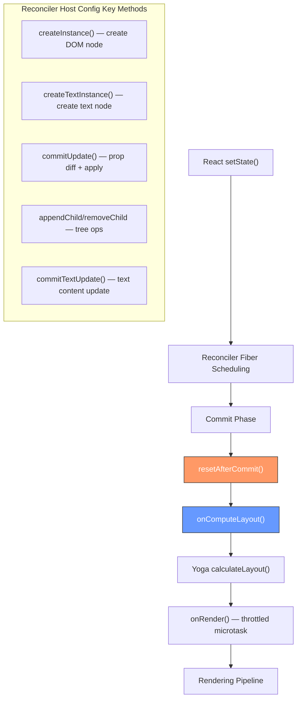
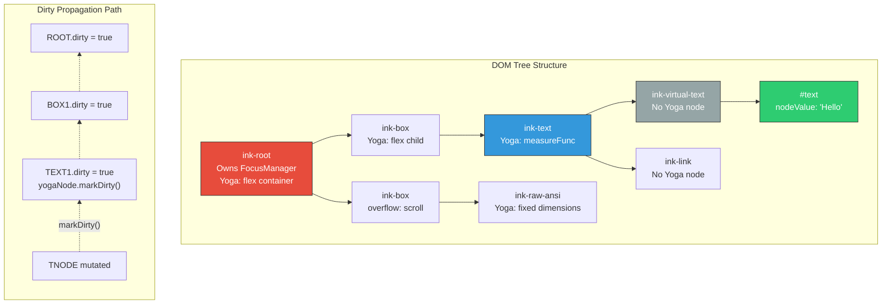

# Chapter 16: Custom Terminal Renderer

> *"Any sufficiently complex CLI application contains an ad hoc, informally-specified, bug-ridden, slow implementation of half of a terminal GUI framework."*
>
> The Claude Code team chose a different path: they forked Ink, then rebuilt it into a full terminal display server.

---

## 16.1 Why a Custom Ink?

Ink is a React-based terminal rendering library that lets developers describe terminal interfaces with JSX. For simple CLI tools, stock Ink works well. But Claude Code is not a simple CLI tool -- it is a fullscreen interactive application with scrollable views, text selection, mouse tracking, search highlighting, and hardware scroll capabilities. Stock Ink's limitations surfaced along multiple dimensions:

**Line-based string rendering.** Stock Ink's output unit is the string line -- each frame regenerates the full output as strings, then compares line-by-line against the previous frame. For a 200x120 terminal, this means allocating and comparing 24,000+ string objects per frame, creating severe GC pressure.

**No cell-level diffing.** When a single character in the middle of a line changes, stock Ink must rewrite the entire line. For Claude Code's streaming token display scenario -- where new characters appear every 50ms -- this means excessive terminal writes and visible flicker.

**No double buffering.** Without front/back frame buffers, flicker-free updates are impossible.

**No advanced alt-screen capabilities.** Hardware scroll (DECSTBM), mouse tracking, Kitty keyboard protocol, synchronized output, and other modern terminal features are entirely absent.

**No selection or search system.** Text selection requires hit testing and overlay rendering on the screen buffer -- which demands that the framework know the exact position and style of every cell.

The Claude Code team's solution was to rebuild Ink into a complete terminal display engine: packed array screen buffers replace strings, cell-level diff replaces line-level comparison, double-buffered frame management, a DOM-like event system, and hardware scroll support. Core code grew from stock Ink's ~2,000 lines to over 10,000 lines across 25+ files.

### The Ink Engine Core Class

At the center of everything sits the `Ink` class -- instantiated once per stdout stream. It owns the reconciler container, DOM root, frame buffers, object pools, and the full rendering pipeline:

```typescript
export default class Ink {
  private readonly terminal: Terminal;
  private readonly container: FiberRoot;
  private rootNode: dom.DOMElement;
  private renderer: Renderer;
  private readonly stylePool: StylePool;
  private charPool: CharPool;
  private hyperlinkPool: HyperlinkPool;
  private frontFrame: Frame;
  private backFrame: Frame;
  private scheduleRender: (() => void) & { cancel?: () => void };
  private isUnmounted = false;
  private isPaused = false;
}
```

The constructor executes 14 initialization steps in strict order:

1. Patch `console.log/error` to redirect to debug log (prevents alt-screen corruption)
2. Create `Terminal` handle wrapping stdout/stderr
3. Read terminal dimensions from `stdout.columns/rows` (fallback 80x24)
4. Instantiate shared pools: `StylePool`, `CharPool`, `HyperlinkPool`
5. Allocate front and back frame buffers via `emptyFrame()`
6. Create `LogUpdate` diffing engine
7. Build throttled render scheduler (microtask + throttle, leading + trailing edge)
8. Register `signal-exit` handler for cleanup on process termination
9. Attach `resize` and `SIGCONT` listeners on TTY stdout
10. Create root DOM node (`ink-root`) with Yoga layout node
11. Create `FocusManager` attached to root node
12. Create renderer function via `createRenderer()`
13. Wire `onRender` and `onComputeLayout` callbacks to root node
14. Create React reconciler container in `ConcurrentRoot` mode

This initialization sequence embodies a core design principle: **total engine control over the terminal.** From intercepting console output to registering process exit callbacks, the engine ensures exclusive ownership of terminal state throughout its lifetime.

---

## 16.2 React Reconciler Host Config

Claude Code's terminal UI runs on a custom React reconciler. This is not `react-dom` -- it uses the host config interface provided by the `react-reconciler` package to connect React's fiber tree to a custom terminal DOM.

### Type Parameters

The reconciler defines the terminal DOM's type system through generic parameters:

```typescript
const reconciler = createReconciler<
  ElementNames,    // 7 element types
  Props,           // Record<string, unknown>
  DOMElement,      // Container and Instance are the same
  DOMElement,      // Instance
  TextNode,        // TextInstance
  DOMElement,      // SuspenseInstance
  unknown,         // HydratableInstance (unused)
  unknown,         // PublicInstance
  DOMElement,      // HostContext
  HostContext,     // { isInsideText: boolean }
  null,            // UpdatePayload (not used in React 19)
  NodeJS.Timeout,  // TimeoutHandle
  -1,              // NoTimeout
  null             // TransitionStatus
>({...})
```

### Key Methods

**createInstance** -- creates DOM nodes. A subtle design decision: when `ink-text` is nested inside another text context, it automatically downgrades to `ink-virtual-text`:

```typescript
createInstance(originalType, newProps, _root, hostContext, internalHandle) {
  const type = originalType === 'ink-text' && hostContext.isInsideText
    ? 'ink-virtual-text' : originalType;
  const node = createNode(type);
  for (const [key, value] of Object.entries(newProps)) {
    applyProp(node, key, value);
  }
  return node;
}
```

**createTextInstance** -- enforces that text strings must live inside `<Text>`:

```typescript
createTextInstance(text, _root, hostContext) {
  if (!hostContext.isInsideText) {
    throw new Error(`Text string "${text}" must be rendered inside <Text>`);
  }
  return createTextNode(text);
}
```

**commitUpdate** -- React 19's prop update approach, which no longer uses updatePayload:

```typescript
commitUpdate(node, _type, oldProps, newProps) {
  const props = diff(oldProps, newProps);
  const style = diff(oldProps.style, newProps.style);
  if (props) {
    for (const [key, value] of Object.entries(props)) {
      if (key === 'style') { setStyle(node, value); continue; }
      if (key === 'textStyles') { setTextStyles(node, value); continue; }
      if (EVENT_HANDLER_PROPS.has(key)) { setEventHandler(node, key, value); continue; }
      setAttribute(node, key, value);
    }
  }
  if (style && node.yogaNode) {
    applyStyles(node.yogaNode, style, newProps.style);
  }
}
```

**resetAfterCommit** -- the critical coordination point connecting React's commit phase to the rendering pipeline:

```typescript
resetAfterCommit(rootNode) {
  // 1. Compute Yoga layout during React commit, before layout effects
  if (typeof rootNode.onComputeLayout === 'function') {
    rootNode.onComputeLayout();
  }
  // 2. Schedule throttled render
  rootNode.onRender?.();
}
```

**Event priority integration** -- the reconciler obtains update priority from the Dispatcher:

```typescript
getCurrentUpdatePriority: () => dispatcher.currentUpdatePriority,
setCurrentUpdatePriority(p) { dispatcher.currentUpdatePriority = p; },
resolveUpdatePriority(): number { return dispatcher.resolveEventPriority(); },
```

Keyboard and click events are tagged with `DiscreteEventPriority` (synchronous, immediate processing), while resize and scroll events use `ContinuousEventPriority` (batched).



---

## 16.3 DOM Implementation

### Node Types

Claude Code's terminal DOM defines 7 element types and 1 text node type. Each type plays a distinct role in layout and rendering:

| Element Type | Purpose | Owns Yoga Node |
|-------------|---------|:-:|
| `ink-root` | Document root, owns FocusManager | Yes |
| `ink-box` | Flex container, analogous to `<div>` | Yes |
| `ink-text` | Text container, owns Yoga measure function | Yes |
| `ink-virtual-text` | Nested text, no independent layout | No |
| `ink-link` | Hyperlink wrapper | No |
| `ink-progress` | Progress indicator | No |
| `ink-raw-ansi` | Pre-rendered ANSI content | Yes |

### DOMElement Structure

```typescript
export type DOMElement = {
  nodeName: ElementNames;
  attributes: Record<string, DOMNodeAttribute>;
  childNodes: DOMNode[];
  parentNode: DOMElement | undefined;
  yogaNode?: LayoutNode;
  style: Styles;
  dirty: boolean;
  // Scroll state
  scrollTop?: number;
  pendingScrollDelta?: number;
  scrollHeight?: number;
  stickyScroll?: boolean;
  // Event handlers
  _eventHandlers?: Record<string, unknown>;
  // Render hooks
  onComputeLayout?: () => void;
  onRender?: () => void;
}
```

### Node Creation and Selective Yoga Attachment

Not all DOM nodes need a Yoga layout node. `ink-virtual-text`, `ink-link`, and `ink-progress` share their parent's layout -- they are purely logical containers:

```typescript
export const createNode = (nodeName: ElementNames): DOMElement => {
  const needsYogaNode =
    nodeName !== 'ink-virtual-text' &&
    nodeName !== 'ink-link' &&
    nodeName !== 'ink-progress';
  const node: DOMElement = {
    nodeName, style: {}, attributes: {}, childNodes: [],
    parentNode: undefined,
    yogaNode: needsYogaNode ? createLayoutNode() : undefined,
    dirty: false,
  };
  if (nodeName === 'ink-text') {
    node.yogaNode?.setMeasureFunc(measureTextNode.bind(null, node));
  }
  return node;
};
```

### Dirty Propagation

When any node is mutated, the dirty flag bubbles upward from the mutation point to the root. Upon reaching the first `ink-text` or `ink-raw-ansi` node, the corresponding Yoga node is also marked dirty to trigger re-measurement:

```typescript
export const markDirty = (node?: DOMNode): void => {
  let current: DOMNode | undefined = node;
  let markedYoga = false;
  while (current) {
    if (current.nodeName !== '#text') {
      (current as DOMElement).dirty = true;
      if (!markedYoga && (current.nodeName === 'ink-text' ||
          current.nodeName === 'ink-raw-ansi') && current.yogaNode) {
        current.yogaNode.markDirty();
        markedYoga = true;
      }
    }
    current = current.parentNode;
  }
};
```

A performance-critical design: **attribute setters skip dirty marking when the value is unchanged.** Event handler identity changes (which React produces on every re-render as new function references) are stored separately in `_eventHandlers` rather than attributes, so they never trigger dirty and never defeat the blit optimization.



---

## 16.4 Rendering Pipeline: From React Tree to Terminal Pixels

This is the most critical part of the framework. A complete render passes through 7 stages, transforming the React component tree into visible pixels on the terminal.

### Stage 1: React Commit

After the reconciler completes its fiber diff, it calls host config methods to apply mutations -- `appendChild`, `removeChild`, `commitUpdate`, `commitTextUpdate`. Each mutation marks affected nodes via `markDirty()`.

### Stage 2: Yoga Layout

Inside `resetAfterCommit`, Yoga layout executes immediately:

```typescript
this.rootNode.onComputeLayout = () => {
  this.rootNode.yogaNode.setWidth(this.terminalColumns);
  this.rootNode.yogaNode.calculateLayout(this.terminalColumns);
};
```

Yoga (compiled to WASM) runs the full Flexbox layout algorithm. The measure functions registered on `ink-text` nodes are called during this phase to compute natural text dimensions.

### Stage 3: DOM Traversal and Screen Buffer Generation

`renderNodeToOutput()` performs a depth-first traversal of the DOM tree, rendering each node into an `Output` operation queue. The critical **blit optimization** applies here -- if a node is not marked dirty and its position is unchanged, cells are copied directly from the previous frame's screen buffer:

```typescript
if (!node.dirty && cached &&
    cached.x === x && cached.y === y &&
    cached.width === width && cached.height === height && prevScreen) {
  output.blit(prevScreen, fx, fy, fw, fh);
  return;  // Skip entire subtree
}
```

This is the single most important optimization in the system. In steady-state frames (spinner ticking, clock updating), only dirty node cells are re-rendered; all other nodes are bulk-copied via `TypedArray.set()`.

### Stage 4: Output Operation Queue and Screen Buffer

`renderNodeToOutput()` does not write directly to the screen buffer. Instead, it collects operations into an `Output` queue. This queue supports 7 operation types:

```typescript
export type Operation =
  | WriteOperation    // Write ANSI text at (x, y)
  | ClipOperation     // Push clip rectangle
  | UnclipOperation   // Pop clip rectangle
  | BlitOperation     // Copy cells from another screen
  | ClearOperation    // Zero cells in a rectangle
  | NoSelectOperation // Mark cells as non-selectable
  | ShiftOperation    // Shift rows (for hardware scroll)
```

The `Output.get()` method processes the operation queue into a final Screen through two passes:

- **Clear pass**: expand damage to cover clear regions; collect absolute-positioned clears
- **Main pass**: process write/blit/clip/shift operations with nested clip rectangle intersection

**Clip intersection** prevents nested `overflow: hidden` containers from writing outside their ancestor's clip boundary:

```typescript
function intersectClip(parent: Clip | undefined, child: Clip): Clip {
  if (!parent) return child;
  return {
    x1: maxDefined(parent.x1, child.x1),
    x2: minDefined(parent.x2, child.x2),
    y1: maxDefined(parent.y1, child.y1),
    y2: minDefined(parent.y2, child.y2),
  };
}
```

The operation queue is then flushed to a packed `Int32Array` screen buffer:

```typescript
export type Screen = {
  cells: Int32Array;      // 2 Int32s per cell: [charId, packed(styleId|hyperlinkId|width)]
  cells64: BigInt64Array; // Same buffer, 64-bit view for bulk fill
  charPool: CharPool;     // String interning
  damage: Rectangle;      // Bounding box of written regions
}
```

Each cell uses 2 Int32 values. Word 1 is the `charId` (interned via CharPool). Word 2 has this bit layout:

```
Bits [31:17] = styleId     (15 bits, up to 32767 styles)
Bits [16:2]  = hyperlinkId (15 bits)
Bits [1:0]   = width       (2 bits: Narrow=0, Wide=1, SpacerTail=2, SpacerHead=3)
```

A 200x120 terminal has 24,000 cells. Using `Int32Array` instead of object arrays eliminates 24,000+ JS object allocations and their associated GC pressure.

### Stage 5: Overlay Application

Selection overlay and search highlighting mutate cell styles in the screen buffer directly, before diffing:

```typescript
// Selection: invert background on selected cells
applySelectionOverlay(screen, selection, stylePool);
// Search: inverse on all matches, yellow+bold on current match
applySearchHighlight(screen, matches, currentMatch, stylePool);
```

### Stage 6: Diff and VirtualScreen Cursor Tracking

`LogUpdate.render()` compares the previous and next frames and produces a minimal patch list. The diff engine tracks a virtual cursor position through the `VirtualScreen` class, computing the shortest relative cursor movement path:

```typescript
class VirtualScreen {
  cursor: Point;
  diff: Diff = [];
  readonly viewportWidth: number;

  txn(fn: (prev: Point) => [patches: Diff, next: Delta]): void {
    const [patches, next] = fn(this.cursor);
    for (const patch of patches) this.diff.push(patch);
    this.cursor.x += next.dx;
    this.cursor.y += next.dy;
  }
}
```

Cell-level diffing core logic:

```typescript
diffEach(prev.screen, next.screen, (x, y, removed, added) => {
  moveCursorTo(screen, x, y);
  if (added) {
    const styleStr = stylePool.transition(currentStyleId, added.styleId);
    writeCellWithStyleStr(screen, added, styleStr);
  } else if (removed) {
    // Clear with space
  }
});
```

`StylePool.transition()` caches the ANSI transition sequence between any two style IDs, avoiding redundant computation:

```typescript
transition(fromId: number, toId: number): string {
  if (fromId === toId) return '';
  const key = fromId * 0x100000 + toId;
  let str = this.transitionCache.get(key);
  if (str === undefined) {
    str = ansiCodesToString(diffAnsiCodes(this.get(fromId), this.get(toId)));
    this.transitionCache.set(key, str);
  }
  return str;
}
```

The diff engine must handle the special case of wide characters (emoji, CJK characters). Terminal wcwidth implementations may disagree with the Unicode standard, causing cursor position drift. The engine solves this through width compensation:

```typescript
function writeCellWithStyleStr(screen, cell, styleStr): boolean {
  const needsCompensation = cellWidth === 2 && needsWidthCompensation(cell.char);
  if (needsCompensation && px + 1 < vw) {
    // Write space at x+1 (covers gap on old terminals)
    diff.push({ type: 'cursorTo', col: px + 2 });
    diff.push({ type: 'stdout', content: ' ' });
    diff.push({ type: 'cursorTo', col: px + 1 });
  }
  diff.push({ type: 'stdout', content: cell.char });
  return true;
}
```

### Stage 7: Terminal Write

The optimizer merges adjacent stdout patches to reduce system call count, then `writeDiffToTerminal()` flushes the final ANSI sequences to stdout. In alt screen mode, absolute positioning (`CSI H`) is used; in main screen mode, relative cursor movements are used since absolute positioning cannot reach scrollback rows.

```mermaid
flowchart LR
    A["React Tree<br/>Fiber Commit"] --> B["Yoga Layout<br/>calculateLayout()"]
    B --> C["DOM Traversal<br/>renderNodeToOutput()"]
    C --> D["Screen Buffer<br/>packed Int32Array"]
    D --> E["Overlays<br/>Selection + Search"]
    E --> F["Diff Engine<br/>cell-level comparison"]
    F --> G["Terminal Write<br/>ANSI sequences"]

    style A fill:#e74c3c,stroke:#333,color:#fff
    style B fill:#e67e22,stroke:#333,color:#fff
    style C fill:#f1c40f,stroke:#333,color:#000
    style D fill:#2ecc71,stroke:#333,color:#fff
    style E fill:#3498db,stroke:#333,color:#fff
    style F fill:#9b59b6,stroke:#333,color:#fff
    style G fill:#1abc9c,stroke:#333,color:#fff
```



---

## 16.5 Frame Management: Double Buffering and Flicker-Free Updates

### Double Buffer Architecture

The engine maintains two Frames:

- **frontFrame**: represents what is currently visible on the terminal
- **backFrame**: the previously-visible frame, reused as the next render's write target

```typescript
export default class Ink {
  private frontFrame: Frame;
  private backFrame: Frame;
  // ...
}
```

Each Frame contains:

```typescript
type Frame = {
  screen: Screen;              // Cell buffer
  viewport: { width, height }; // Terminal dimensions
  cursor: { x, y, visible };   // Logical cursor position
}
```

After rendering completes, the frames swap:

```typescript
this.backFrame = this.frontFrame;
this.frontFrame = frame;
```

### The 15 Phases of onRender

`onRender` is the main frame function that orchestrates all work from screen buffer generation to terminal write. Its internal execution follows a fixed 15-phase sequence:

1. **Guard**: skip if unmounted or paused; cancel pending drain timer
2. **Flush interaction time**: coalesce per-keypress time updates to once-per-frame
3. **Render**: call `this.renderer()`, executing `renderNodeToOutput()` to produce a Frame
4. **Follow-scroll compensation**: translate selection endpoints to track content during sticky scroll
5. **Selection overlay**: apply inverted styles to selected cells
6. **Search highlight**: apply inverse on all matches; yellow+bold on current match
7. **Full-damage backstop**: if layout shifted, selection active, or `prevFrameContaminated`, expand damage to full screen
8. **Diff**: call `this.log.render(prevFrame, nextFrame)` producing a `Diff[]` patch list
9. **Buffer swap**: swap front/back frames
10. **Pool reset**: replace CharPool/HyperlinkPool every 5 minutes
11. **Optimize**: merge adjacent stdout patches
12. **Cursor positioning**: emit `CSI H` for alt-screen; compute relative moves for main screen
13. **Write**: call `writeDiffToTerminal()` to flush patches to stdout
14. **Drain scheduling**: if `scrollDrainPending`, schedule next frame at quarter interval
15. **Telemetry**: fire `onFrame` callback with per-phase timings

### Throttled Scheduling

Renders are not triggered synchronously but scheduled via microtask + throttle:

```typescript
const deferredRender = (): void => queueMicrotask(this.onRender);
this.scheduleRender = throttle(deferredRender, FRAME_INTERVAL_MS, {
  leading: true, trailing: true
});
```

`leading: true` ensures the first change renders immediately (low-latency response); `trailing: true` ensures the last change is never dropped. Scroll drain frames use `FRAME_INTERVAL_MS >> 2` (quarter interval) to achieve smoother scroll animation.

### Full-Damage Fallback

Under certain conditions, differential updates are unsafe, and the engine falls back to a full-screen repaint:

- Terminal dimensions changed
- Content shrank from above-viewport to at-or-below-viewport height
- Layout shifted while a selection is active
- Changes to unreachable rows in scrollback

```typescript
if (layoutShifted || selectionActive || this.prevFrameContaminated) {
  // Expand damage to full screen
}
```

---

## 16.6 Terminal Capability Detection

Claude Code runs on dozens of terminal emulators -- from macOS Terminal.app to VS Code's integrated terminal, from iTerm2 to Kitty, from inside tmux to raw SSH sessions. Each terminal supports a different capability set.

### Detection Mechanisms

The engine probes terminal capabilities through multiple signals:

**TERM_PROGRAM environment variable** -- directly identifies the terminal:
- `vscode` -- VS Code integrated terminal (xterm.js)
- `iTerm.app` -- iTerm2
- `WezTerm` -- WezTerm
- `tmux` -- running inside tmux

**CSI query sequences** -- send escape sequences and parse terminal responses:
- DA1/DA2 (Device Attributes): identify the terminal's VT capability level
- DECRPM (DEC Private Mode Report): query whether specific modes are supported
- XTVERSION: obtain terminal name and version

```typescript
export type TerminalResponse =
  | { type: 'decrpm'; mode: number; status: number }
  | { type: 'da1'; params: number[] }
  | { type: 'da2'; params: number[] }
  | { type: 'kittyKeyboard'; flags: number }
  | { type: 'xtversion'; name: string }
```

### Kitty Keyboard Protocol

Traditional terminal keyboard input uses VT100 sequences, which cannot distinguish `Ctrl+I` from `Tab`, nor report key release events. The Kitty keyboard protocol (CSI u mode) solves these problems:

```
ESC [ codepoint ; modifier u
```

The engine enables this protocol upon detecting support, gaining full modifier key information and precise key identification.

### Hyperlink Support

OSC 8 hyperlinks enable clickable links in the terminal. The engine manages link IDs through `HyperlinkPool` and generates correct OSC 8 escape sequences during the diff phase.

### Keyboard Parsing

Keyboard parsing is a downstream consumer of terminal capability detection. The engine uses a streaming tokenizer to process stdin byte streams, supporting multiple encoding formats:

- **CSI sequences**: arrow keys, function keys, modifier combinations
- **CSI u (Kitty keyboard protocol)**: `ESC [ codepoint [; modifier] u`
- **modifyOtherKeys**: `ESC [ 27 ; modifier ; keycode ~`
- **SGR mouse events**: `ESC [ < button ; col ; row M/m`
- **Terminal responses**: DECRPM, DA1, DA2, XTVERSION, cursor position, OSC
- **Bracketed paste**: `ESC [200~` ... `ESC [201~`

The parsed `key` property follows browser conventions: single printable characters (`'a'`, `'3'`, `' '`) or multi-character special key names (`'down'`, `'return'`). The idiomatic printable-character check is `e.key.length === 1`.

### Synchronized Output

Synchronized output (BSU/ESU) batches all updates between a pair of markers; the terminal renders everything at once upon receiving ESU -- eliminating tearing caused by partial updates becoming visible. This matters especially for large-area updates: without BSU/ESU, the terminal might refresh the display after receiving only half of the ANSI sequences, exposing intermediate state to the user.

### Color Level Adaptation

```typescript
boostChalkLevelForXtermJs();  // VS Code: level 2 -> 3 (enable truecolor)
clampChalkLevelForTmux();     // tmux: level 3 -> 2 (downgrade to 256 color)
```

---

## 16.7 Terminal Modes

### Main Screen vs Alt Screen

The engine manages two fundamentally different display modes:

**Main Screen** (default): Content scrolls naturally. The cursor tracks the bottom of content. Frame height can exceed viewport height, pushing rows into scrollback. The diff engine uses relative cursor moves because absolute positioning cannot reach scrollback rows.

**Alt Screen** (fullscreen): Activated via the `<AlternateScreen>` component (DEC private mode 1049h). Content is locked to the viewport. Every frame starts with `CSI H` (cursor home), so all moves use absolute positioning. DECSTBM hardware scroll is available.

```typescript
setAltScreenActive(active: boolean, mouseTracking = false): void {
  if (this.altScreenActive === active) return;
  this.altScreenActive = active;
  if (active) {
    this.resetFramesForAltScreen();
  } else {
    this.repaint();
  }
}
```

### Hardware Scroll

In alt screen mode, when the engine detects that content needs to scroll as a block, it leverages DECSTBM (Set Top and Bottom Margins) to let the terminal perform hardware scrolling rather than redrawing every cell:

```typescript
if (altScreen && next.scrollHint && decstbmSafe) {
  const { top, bottom, delta } = next.scrollHint;
  shiftRows(prev.screen, top, bottom, delta);
  scrollPatch = [{
    type: 'stdout',
    content: setScrollRegion(top + 1, bottom + 1) +
      (delta > 0 ? csiScrollUp(delta) : csiScrollDown(-delta)) +
      RESET_SCROLL_REGION + CURSOR_HOME,
  }];
}
```

### Raw Mode and Mouse Tracking

Upon entering alt screen, the terminal is set to raw mode: line buffering, echo, and signal handling are disabled (Ctrl+C no longer kills the process directly). Mouse tracking is enabled via SGR mode, and the engine parses `ESC [ < button ; col ; row M/m` sequences to obtain precise mouse coordinates.

### Suspend and Resume

When the user suspends the process via `Ctrl+Z` and later resumes it (`SIGCONT`), the engine performs full state recovery:

1. If previously in alt screen mode, re-enter alt screen
2. Re-enable mouse tracking
3. Reset frame buffers to blank (forces full-screen repaint)
4. Trigger complete repaint

```typescript
// SIGCONT handler
stdout.on('resume', () => {
  if (this.altScreenActive) {
    this.resetFramesForAltScreen();
  }
  this.prevFrameContaminated = true;
  this.scheduleRender();
});
```

### Resize Handling

Terminal resize is processed synchronously (no debouncing), because the first frame after resize must immediately adapt to the new dimensions:

1. Update `terminalColumns` / `terminalRows`
2. Re-enable mouse tracking (some terminals lose tracking state after resize)
3. Reset frame buffers (`prevFrameContaminated = true`)
4. Defer screen erase into the next atomic BSU/ESU block
5. Re-render the React tree

---

## 16.8 Performance Optimization Overview

This architecture's performance design permeates every layer:

| Technique | Scope | Mechanism |
|-----------|-------|-----------|
| Packed `Int32Array` Screen | Memory + GC | Eliminates 24,000+ cell objects |
| CharPool ASCII fast path | CPU | `Int32Array[128]` direct lookup, O(1) |
| StylePool transition cache | CPU | ANSI diff between any two styles computed once |
| Blit optimization | CPU + bandwidth | Unchanged nodes copied from previous frame |
| Damage tracking | CPU | Diff iterates only cells within the written bounding box |
| DECSTBM hardware scroll | Bandwidth | Terminal executes row shifts; engine updates only changed rows |
| Line-level charCache | CPU | Unchanged text lines skip tokenize and grapheme clustering |
| Periodic pool reset | Memory | CharPool/HyperlinkPool replaced every 5 minutes to prevent unbounded growth |

**Width calculation** is an easily overlooked hot path with outsized performance impact. Each character in the terminal occupies a different number of columns -- ASCII characters take 1 column, CJK characters and most emoji take 2, zero-width joiners (ZWJ) and variation selectors take 0. The engine prioritizes Bun's native `stringWidth` (a single C++ call), falling back to a JavaScript implementation with multiple fast paths:

```typescript
export const stringWidth = bunStringWidth
  ? str => bunStringWidth(str, { ambiguousIsNarrow: true })
  : stringWidthJavaScript;

function stringWidthJavaScript(str: string): number {
  // Fast path 1: pure ASCII (no ANSI, no wide chars)
  // Fast path 2: simple Unicode (no emoji/variation selectors)
  // Slow path: grapheme segmentation with emoji detection
}
```

**charCache (line-level caching)** avoids redundant tokenization and grapheme clustering on unchanged text lines:

```typescript
function writeLineToScreen(screen, line, x, y, screenWidth, stylePool, charCache) {
  let characters = charCache.get(line);
  if (!characters) {
    characters = reorderBidi(
      styledCharsWithGraphemeClustering(
        styledCharsFromTokens(tokenize(line)), stylePool));
    charCache.set(line, characters);
  }
  // Write characters to screen cells
}
```

The cache persists across frames; it is evicted when the entry count exceeds 16,384.

The combined effect of these optimizations: in a typical streaming display scenario, only a small number of cells are re-rendered and diffed per frame, keeping terminal write volume at a minimum. Even on a 200-column by 120-row terminal, per-frame processing time stays in the low milliseconds.

---

## 16.9 Summary

Claude Code's terminal renderer demonstrates a carefully layered architecture: the React reconciler manages component lifecycle and state, the custom DOM provides layout and event models, Yoga WASM executes Flexbox layout, a packed array screen buffer stores frame data, a cell-level diff engine produces minimal updates, and terminal capability detection ensures cross-platform compatibility.

This is not merely a "better Ink." It is a complete terminal display server -- no GPU, but double buffering; no pixels, but packed cell arrays; no compositor, but a damage-tracking diff engine. It transforms the Unix terminal from a character stream device into a programmable display surface, allowing React components to run with performance and visual quality approaching native terminal applications.
