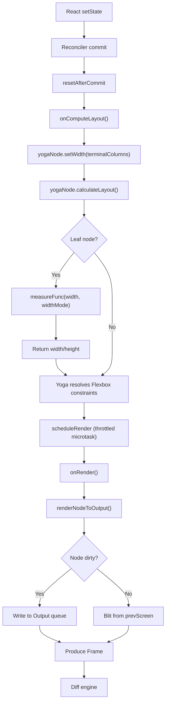
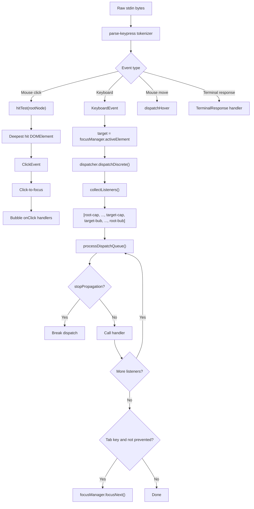
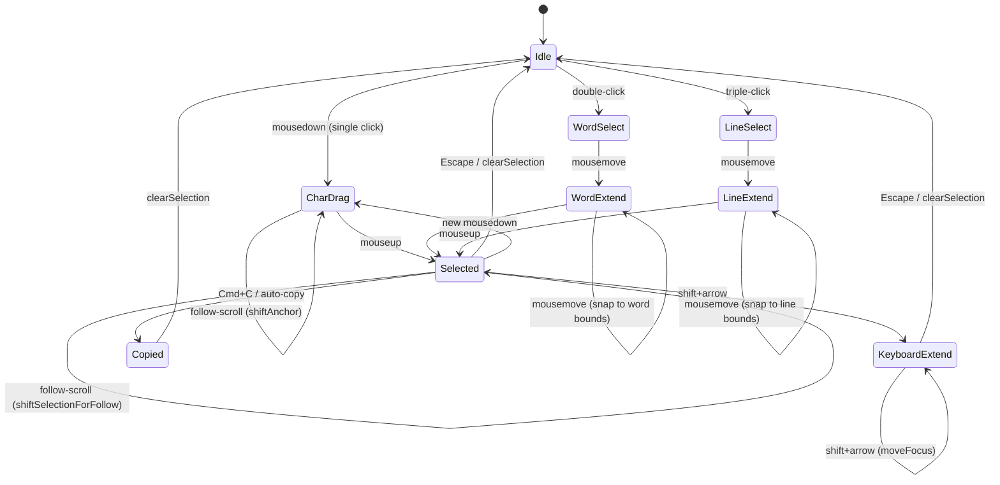

# Chapter 17: Layout Engine and Event System

> A terminal is not a browser, but Claude Code treats it like one -- Yoga computes Flexbox layout, capture/bubble dispatches events, and a state machine manages text selection. This architecture transforms a bare TTY stream into a GPU-less display server.

## 17.1 Yoga Layout Engine Integration

### The Flex Model in Terminals

A browser's layout engine operates on sub-pixel coordinates. A terminal's smallest addressable unit is the character cell. Claude Code bridges this gap by adopting Facebook's Yoga -- a cross-platform Flexbox implementation -- as its layout core. Compiled to WebAssembly and running inside Node.js, Yoga gives every DOM node a precise position computed in character-cell units.

The architectural payoff is substantial: React components declare layout intent using familiar properties like `flexDirection`, `alignItems`, and `justifyContent`, while Yoga resolves these constraints into concrete `(x, y, width, height)` coordinates. There is no custom layout algorithm to maintain -- the same engine that powers React Native's layout also powers Claude Code's terminal UI.

### The 53-Method Adapter Interface

The layout engine is decoupled from the rest of the system through a `LayoutNode` interface. This interface defines 53 methods spanning four categories: tree management, layout computation, result queries, and style setters.

```typescript
export type LayoutNode = {
  // Tree management
  insertChild(child: LayoutNode, index: number): void;
  removeChild(child: LayoutNode): void;
  getChildCount(): number;
  getParent(): LayoutNode | null;

  // Layout computation
  calculateLayout(width?: number, height?: number): void;
  setMeasureFunc(fn: LayoutMeasureFunc): void;
  markDirty(): void;

  // Post-layout result queries
  getComputedLeft(): number;
  getComputedTop(): number;
  getComputedWidth(): number;
  getComputedHeight(): number;
  getComputedBorder(edge: LayoutEdge): number;
  getComputedPadding(edge: LayoutEdge): number;

  // Style setters (50+ methods)
  setWidth(value: number): void;
  setFlexDirection(dir: LayoutFlexDirection): void;
  setDisplay(display: LayoutDisplay): void;
  setOverflow(overflow: LayoutOverflow): void;
  setPositionPercent(edge: LayoutEdge, value: number): void;
  // ... additional style setters
};
```

The `createLayoutNode()` factory delegates to `createYogaLayoutNode()`, which instantiates a WASM-backed Yoga node. This abstraction layer provides a clean substitution point: replacing the layout engine (say, with Taffy or a future Yoga version) requires only a new `LayoutNode` implementation -- no changes to the rendering pipeline or component code.

### Node Types and Yoga Node Allocation

Not every DOM node needs its own Yoga node. The system distinguishes seven node types with precise allocation rules:

```typescript
export const createNode = (nodeName: ElementNames): DOMElement => {
  const needsYogaNode =
    nodeName !== 'ink-virtual-text' &&
    nodeName !== 'ink-link' &&
    nodeName !== 'ink-progress';

  const node: DOMElement = {
    nodeName, style: {}, attributes: {}, childNodes: [],
    parentNode: undefined,
    yogaNode: needsYogaNode ? createLayoutNode() : undefined,
    dirty: false,
  };

  if (nodeName === 'ink-text') {
    node.yogaNode?.setMeasureFunc(measureTextNode.bind(null, node));
  } else if (nodeName === 'ink-raw-ansi') {
    node.yogaNode?.setMeasureFunc(measureRawAnsiNode.bind(null, node));
  }
  return node;
};
```

`ink-virtual-text`, `ink-link`, and `ink-progress` share their parent's Yoga node and do not participate in independent layout computation. `ink-text` and `ink-raw-ansi` register measure callbacks so Yoga can query their intrinsic dimensions during layout.

## 17.2 Layout Computation and Caching

### Measure Callbacks for Text and Raw-ANSI Nodes

When Yoga encounters a leaf node during `calculateLayout()`, it invokes that node's registered measure function to determine its natural size. For text nodes, this involves text measurement and word wrapping:

```typescript
const measureTextNode = function(node, width, widthMode) {
  const rawText = node.nodeName === '#text'
    ? node.nodeValue : squashTextNodes(node);
  const text = expandTabs(rawText);
  const dimensions = measureText(text, width);

  if (dimensions.width <= width) return dimensions;

  // For pre-wrapped content in Undefined mode, use natural width
  if (text.includes('\n') && widthMode === LayoutMeasureMode.Undefined) {
    return measureText(text, Math.max(width, dimensions.width));
  }

  // Text exceeds available width -- wrap and re-measure
  const textWrap = node.style?.textWrap ?? 'wrap';
  const wrappedText = wrapText(text, width, textWrap);
  return measureText(wrappedText, width);
};
```

Raw ANSI nodes bypass this complexity entirely -- their dimensions are known ahead of time:

```typescript
const measureRawAnsiNode = function(node) {
  return {
    width: node.attributes['rawWidth'] as number,
    height: node.attributes['rawHeight'] as number,
  };
};
```

### Dirty Propagation and Layout Invalidation

When a node's content or style changes, the system must signal Yoga to recompute. The `markDirty()` function walks from the changed node toward the root, marking each ancestor as dirty and calling `yogaNode.markDirty()` on the first text or raw-ansi node encountered:

```typescript
export const markDirty = (node?: DOMNode): void => {
  let current: DOMNode | undefined = node;
  let markedYoga = false;
  while (current) {
    if (current.nodeName !== '#text') {
      (current as DOMElement).dirty = true;
      if (!markedYoga && (current.nodeName === 'ink-text' ||
          current.nodeName === 'ink-raw-ansi') && current.yogaNode) {
        current.yogaNode.markDirty();
        markedYoga = true;
      }
    }
    current = current.parentNode;
  }
};
```

Attribute and style setters perform value comparison to suppress unnecessary dirty marks. Event handlers are stored separately in `_eventHandlers` so that handler identity changes -- common during React re-renders -- do not trigger dirty marks and defeat the blit optimization.

### The Layout Computation Pipeline



`onComputeLayout` runs during React's commit phase, before layout effects, ensuring that Yoga's computed positions are available when React lifecycle callbacks execute. The `calculateLayout()` call is synchronous; for a typical terminal UI tree of tens to a few hundred nodes, it completes in sub-millisecond time.

## 17.3 Differential Update System

### LogUpdate Line-by-Line Diffing

A terminal is not a framebuffer device -- it is a character stream. The only way to update the screen is to write ANSI escape sequences that move the cursor and overwrite characters. The `LogUpdate.render()` method compares two frames and produces a minimal patch list:

```typescript
render(prev: Frame, next: Frame, altScreen = false, decstbmSafe = true): Diff
```

The core of the diff engine is `diffEach()`, which compares two Screen buffers cell by cell:

```typescript
diffEach(prev.screen, next.screen, (x, y, removed, added) => {
  // Skip spacer cells (wide-character trailing placeholders)
  // Skip empty cells that don't overwrite existing content
  moveCursorTo(screen, x, y);
  if (added) {
    transitionHyperlink(screen.diff, currentHyperlink, added.hyperlink);
    const styleStr = stylePool.transition(currentStyleId, added.styleId);
    writeCellWithStyleStr(screen, added, styleStr);
  } else if (removed) {
    // Clear with space
  }
});
```

The diff operates within a damage rectangle -- only cells that were actually written to (not blitted) during rendering are candidates for comparison, drastically reducing iteration for steady-state frames.

### Hardware Scroll Optimization (DECSTBM)

In Alt Screen mode, when content shifts vertically as a block, the diff engine exploits the terminal's hardware scroll capability (DECSTBM -- DEC Set Top and Bottom Margins) to avoid repainting the entire screen:

```typescript
if (altScreen && next.scrollHint && decstbmSafe) {
  const { top, bottom, delta } = next.scrollHint;
  // Shift prev.screen rows in memory to match terminal's hardware scroll
  shiftRows(prev.screen, top, bottom, delta);
  scrollPatch = [{
    type: 'stdout',
    content: setScrollRegion(top + 1, bottom + 1) +
      (delta > 0 ? csiScrollUp(delta) : csiScrollDown(-delta)) +
      RESET_SCROLL_REGION + CURSOR_HOME,
  }];
}
```

A hardware scroll command is a few bytes of control sequence that moves an entire region of content. The terminal emulator implements this internally via GPU texture offset or memory memmove -- far more efficient than repainting every cell.

### VirtualScreen Cursor Tracking

The diff engine maintains a virtual cursor to compute relative cursor movements. This is critical for Main Screen mode, where absolute positioning cannot reach rows that have scrolled into the scrollback buffer:

```typescript
class VirtualScreen {
  cursor: Point;
  diff: Diff = [];
  readonly viewportWidth: number;

  txn(fn: (prev: Point) => [patches: Diff, next: Delta]): void {
    const [patches, next] = fn(this.cursor);
    for (const patch of patches) this.diff.push(patch);
    this.cursor.x += next.dx;
    this.cursor.y += next.dy;
  }
}
```

### Style Transition Cache

Style transitions -- the ANSI sequences needed to switch from one style to another -- are computed once and cached permanently:

```typescript
transition(fromId: number, toId: number): string {
  if (fromId === toId) return '';
  const key = fromId * 0x100000 + toId;
  let str = this.transitionCache.get(key);
  if (str === undefined) {
    str = ansiCodesToString(diffAnsiCodes(this.get(fromId), this.get(toId)));
    this.transitionCache.set(key, str);
  }
  return str;
}
```

Packing two style IDs into a single number as the Map key avoids the overhead of string concatenation -- a critical optimization on this hot path.

## 17.4 Event System: Capture and Bubble Phases

### The Dispatcher Engine

At the heart of the event system is the `Dispatcher` class, implementing DOM-standard capture/bubble two-phase event dispatch:

```typescript
export class Dispatcher {
  currentEvent: TerminalEvent | null = null;
  currentUpdatePriority: number = DefaultEventPriority;
  discreteUpdates: DiscreteUpdates | null = null;

  dispatch(target: EventTarget, event: TerminalEvent): boolean {
    const previousEvent = this.currentEvent;
    this.currentEvent = event;
    try {
      event._setTarget(target);
      const listeners = collectListeners(target, event);
      processDispatchQueue(listeners, event);
      return !event.defaultPrevented;
    } finally {
      this.currentEvent = previousEvent;
    }
  }

  dispatchDiscrete(target, event) {
    // Wrapped in reconciler.discreteUpdates
  }
  dispatchContinuous(target, event) {
    // Sets ContinuousEventPriority
  }
}
```

### The Listener Collection Algorithm

Listeners are collected following react-dom's two-phase pattern -- walking from the target node to the root, building capture (prepended) and bubble (appended) lists simultaneously:

```typescript
function collectListeners(target, event): DispatchListener[] {
  const listeners: DispatchListener[] = [];
  let node = target;
  while (node) {
    const isTarget = node === target;
    const captureHandler = getHandler(node, event.type, true);
    const bubbleHandler = getHandler(node, event.type, false);

    if (captureHandler) {
      listeners.unshift({   // Capture: prepend (root fires first)
        node, handler: captureHandler,
        phase: isTarget ? 'at_target' : 'capturing',
      });
    }
    if (bubbleHandler && (event.bubbles || isTarget)) {
      listeners.push({      // Bubble: append (target fires first)
        node, handler: bubbleHandler,
        phase: isTarget ? 'at_target' : 'bubbling',
      });
    }
    node = node.parentNode;
  }
  return listeners;
}
```

The resulting order is: `[root-cap, ..., parent-cap, target-cap, target-bub, parent-bub, ..., root-bub]`. This exactly matches the W3C DOM event flow specification.

### Event Priority Mapping

```typescript
function getEventPriority(eventType: string): number {
  switch (eventType) {
    case 'keydown': case 'keyup': case 'click':
    case 'focus': case 'blur': case 'paste':
      return DiscreteEventPriority;      // Sync, immediate flush
    case 'resize': case 'scroll': case 'mousemove':
      return ContinuousEventPriority;    // Batched
    default:
      return DefaultEventPriority;
  }
}
```

Priority information flows through the `Dispatcher` into the React reconciler, influencing state update scheduling. `DiscreteEventPriority` covers direct user interactions (keystrokes, clicks) that demand synchronous rendering. `ContinuousEventPriority` covers high-frequency inputs (scrolling, mouse movement) that benefit from batching to reduce render count.

### The Event Dispatch Flow



## 17.5 Keyboard Event Parsing

### The Complexity of parse-keypress.ts

The keyboard parser is the single most complex module in the entire UI framework (roughly 23K lines), because it must handle escape sequence formats accumulated across decades of terminal emulator evolution. Implemented as a streaming tokenizer, it processes the following protocols:

**CSI sequences**: Traditional arrow keys, function keys, and modifier combinations. For example, `ESC [ A` for up-arrow, `ESC [ 1 ; 5 A` for Ctrl+up-arrow.

**Kitty keyboard protocol (CSI u)**: A modern terminal extension with the format `ESC [ codepoint [; modifier] u`. It can distinguish key-down from key-up events, supports full modifier key combinations, and resolves ambiguities that traditional CSI sequences cannot express (e.g., Ctrl+i versus Tab).

**modifyOtherKeys**: Format `ESC [ 27 ; modifier ; keycode ~`, an xterm extension.

**SGR mouse events**: `ESC [ < button ; col ; row M/m`, where `M` signals press and `m` signals release.

**Bracketed paste**: Delimited by `ESC [200~` (start) and `ESC [201~` (end). Content between these markers is treated as pasted text rather than key sequences, preventing control characters in pasted content from being misinterpreted as commands.

**Terminal responses**: DECRPM, DA1, DA2, XTVERSION, cursor position reports, OSC sequences, and more.

The parser's output is a unified `ParsedKey` structure:

```typescript
export type ParsedKey = {
  kind: 'key';
  name: string;           // 'a', 'return', 'escape', 'f1', etc.
  fn: boolean;
  ctrl: boolean;
  meta: boolean;
  shift: boolean;
  option: boolean;
  super: boolean;
  sequence: string | undefined;
  raw: string | undefined;
  isPasted?: boolean;
}
```

The `KeyboardEvent` class wraps `ParsedKey` into a standard event object. Its `key` property follows browser conventions: single characters for printable keys (`'a'`, `'3'`), multi-character names for special keys (`'down'`, `'return'`). The idiomatic printable-character check is `e.key.length === 1`.

## 17.6 Mouse Events and Hit Testing

### The Hit Testing Algorithm

Mouse click handling requires mapping screen coordinates to DOM nodes. The `hitTest()` function uses `nodeCache` -- populated during `renderNodeToOutput` with each node's computed position -- for reverse lookup:

```typescript
export function hitTest(
  node: DOMElement, col: number, row: number
): DOMElement | null {
  const rect = nodeCache.get(node);
  if (!rect) return null;
  if (col < rect.x || col >= rect.x + rect.width ||
      row < rect.y || row >= rect.y + rect.height) return null;
  // Later siblings paint on top -- reverse traversal returns topmost hit
  for (let i = node.childNodes.length - 1; i >= 0; i--) {
    const child = node.childNodes[i]!;
    if (child.nodeName === '#text') continue;
    const hit = hitTest(child, col, row);
    if (hit) return hit;
  }
  return node;
}
```

The reverse child traversal is a critical detail -- it ensures that visually topmost elements (later-painted siblings) are hit first, matching browser z-order behavior.

### ClickEvent and Coordinate Translation

```typescript
export class ClickEvent extends Event {
  readonly col: number;         // Screen column
  readonly row: number;         // Screen row
  localCol: number;             // Relative to handler's Box
  localRow: number;             // Relative to handler's Box
  readonly cellIsBlank: boolean; // Whether click landed on empty space
}
```

During dispatch, the event bubbles from the hit node upward. At each node with an `onClick` handler, the system recomputes `localCol` and `localRow` based on that node's position in nodeCache, giving each handler correct local coordinates.

### Hover Dispatch (mouseenter/mouseleave)

Mouse movement events use a non-bubbling model consistent with browser `mouseenter`/`mouseleave` semantics:

```typescript
export function dispatchHover(
  root, col, row, hovered: Set<DOMElement>
): void {
  const next = new Set<DOMElement>();
  let node = hitTest(root, col, row) ?? undefined;
  while (node) {
    if (node._eventHandlers?.onMouseEnter ||
        node._eventHandlers?.onMouseLeave)
      next.add(node);
    node = node.parentNode;
  }
  // Fire leave on exited nodes, enter on entered nodes
  for (const old of hovered) {
    if (!next.has(old)) {
      hovered.delete(old);
      old._eventHandlers?.onMouseLeave?.();
    }
  }
  for (const n of next) {
    if (!hovered.has(n)) {
      hovered.add(n);
      n._eventHandlers?.onMouseEnter?.();
    }
  }
}
```

By maintaining a `hovered` set and computing set differences, the system dispatches events only to nodes where hover state actually changed, avoiding redundant triggers.

## 17.7 Selection System State Machine

### State Definition

The text selection system is a full state machine supporting three selection granularities: character, word, and line.

```typescript
export type SelectionState = {
  anchor: Point | null;       // Where drag started
  focus: Point | null;        // Current drag position
  isDragging: boolean;        // Between mousedown and mouseup
  anchorSpan: {               // Double/triple-click anchor range
    lo: Point; hi: Point; kind: 'word' | 'line'
  } | null;
  scrolledOffAbove: string[]; // Text from rows scrolled above viewport
  scrolledOffBelow: string[]; // Text from rows scrolled below viewport
  scrolledOffAboveSW: boolean[]; // Soft-wrap flags for above rows
  scrolledOffBelowSW: boolean[]; // Soft-wrap flags for below rows
  virtualAnchorRow?: number;  // Pre-clamp row for round-trip
  virtualFocusRow?: number;
  lastPressHadAlt: boolean;
};
```

### State Machine Transitions



### Word-Level Selection and Character Classification

Double-click triggers word selection using character classification rules matching iTerm2 defaults:

```typescript
const WORD_CHAR = /[\p{L}\p{N}_/.\-+~\\]/u;
function charClass(c: string): 0 | 1 | 2 {
  if (c === ' ' || c === '') return 0;  // whitespace
  if (WORD_CHAR.test(c)) return 1;      // word characters
  return 2;                              // punctuation
}
```

The scan extends left and right from the click position, stopping when it encounters a different character class. The scan must also handle wide characters (CJK and emoji) by skipping SpacerTail placeholder cells.

### Scroll Compensation

The most complex aspect of the selection system is scroll compensation. When content shifts upward due to follow-scroll (streaming output appending), the selection must track the content:

```typescript
// In ink.tsx onRender
if (follow && s.anchor) {
  if (s.isDragging) {
    captureScrolledRows(s, frontFrame.screen,
      viewportTop, viewportTop + delta - 1, 'above');
    shiftAnchor(s, -delta, viewportTop, viewportBottom);
  } else {
    captureScrolledRows(s, frontFrame.screen,
      viewportTop, viewportTop + delta - 1, 'above');
    shiftSelectionForFollow(s, -delta, viewportTop, viewportBottom);
  }
}
```

Text content from rows scrolled out of the viewport is preserved in the `scrolledOffAbove`/`scrolledOffBelow` arrays. This ensures Cmd+C produces the complete selected text even when parts of the selection are no longer visible.

The `shiftSelection` function handles keyboard-scroll (PgUp/PgDn) by maintaining virtual row numbers for round-trip correctness -- scrolling down then back up restores the selection to its exact original position.

### Selection Overlay

Selection highlighting is applied to the Screen buffer after rendering but before diffing:

```typescript
export function applySelectionOverlay(screen, selection, stylePool): void {
  // Normalize anchor/focus to start/end
  // For each row in selection range:
  //   For each cell in column range:
  //     Skip noSelect cells
  //     setCellStyleId(screen, col, row,
  //       stylePool.withSelectionBg(cell.styleId))
}
```

### URL Detection

When mouse tracking intercepts Cmd+Click (preventing the terminal from handling URL clicks natively), Ink implements its own URL detection:

```typescript
export function findPlainTextUrlAt(screen, col, row): string | undefined {
  // Expand left/right to ASCII URL-character boundaries
  // Find last scheme anchor (https?:// or file://) at or before click
  // Strip trailing sentence punctuation (balanced parens)
  return url;
}
```

## 17.8 Focus Management

### FocusManager

The `FocusManager` provides DOM-like focus management with a history stack:

```typescript
export class FocusManager {
  activeElement: DOMElement | null = null;
  private focusStack: DOMElement[] = [];  // Max 32 entries

  focus(node): void {
    // Push current to stack (deduplicated), dispatch blur/focus events
  }

  handleNodeRemoved(node, root): void {
    // Clean stack, dispatch blur, restore from stack
  }

  focusNext(root) / focusPrevious(root): void {
    // Collect tabbable nodes (tabIndex >= 0), cycle through
  }
}
```

Tab cycling is the default action for the Tab key -- it fires only when no handler has called `preventDefault()`, mirroring browser behavior. The focus stack is capped at 32 entries, sufficient to cover Claude Code's deepest dialog nesting scenarios.

### Tab/Shift+Tab Navigation

Tab and Shift+Tab map to `focusNext()` and `focusPrevious()` respectively. Both methods collect all nodes with `tabIndex >= 0` via depth-first DOM traversal, then advance or retreat within this ordered list. Reaching the end wraps to the beginning.

### Programmatic Focus

Components can acquire focus on mount via the `autoFocus` prop, or programmatically via a ref: `focusManager.focus(node)`. When a focused node is removed from the tree, `handleNodeRemoved` automatically restores focus from the stack, ensuring focus never lands on a detached node.

## 17.9 Architectural Reflection

The design of Claude Code's layout engine and event system follows a clear thesis: faithfully reconstruct the browser's core abstractions inside a terminal. Yoga provides Flexbox layout. Capture/bubble provides the DOM event flow. Hit testing provides mouse interaction. FocusManager provides tab navigation. All of this operates in an environment that offers only character cells and ANSI escape sequences.

This is not a crude imitation of a browser. Rather, it is a deliberate architectural choice that lets the team leverage the full power of the React ecosystem -- components, declarative UI, hooks -- to build sophisticated terminal interfaces. The differential update system (LogUpdate + DECSTBM + VirtualScreen) ensures this abstraction does not carry unacceptable performance overhead: in steady state, each frame updates only the cells that actually changed.

The selection system's state machine is another example of careful engineering. Three selection modes, scroll compensation, off-screen text preservation -- getting these details right makes text selection in the terminal feel nearly indistinguishable from a native application. This willingness to accept internal complexity in pursuit of correct user-facing behavior pervades the entire UI framework.

The priority mapping between the event system and the React reconciler deserves special attention. By routing discrete events (keystrokes, clicks) through `reconciler.discreteUpdates` and tagging continuous events (scroll, mousemove) with `ContinuousEventPriority`, the system gives React's scheduler the information it needs to make intelligent batching decisions. A keystroke triggers an immediate synchronous flush; a burst of scroll events is batched into a single render. This integration is what makes the terminal UI feel responsive under load -- the same principle that makes react-dom feel responsive in the browser, applied to a fundamentally different rendering target.
