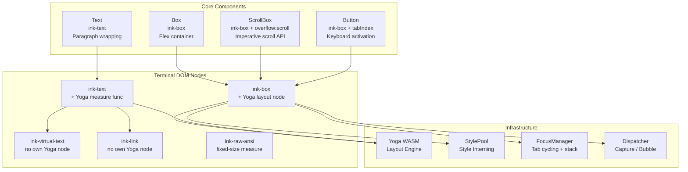
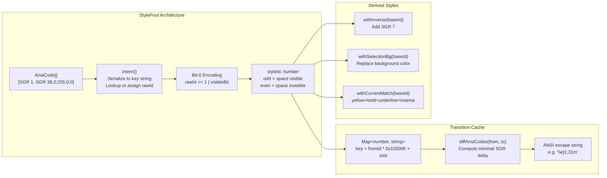

# Chapter 18: Component Architecture and Interaction Patterns

> **Chapter Summary**
>
> Claude Code's terminal UI is not simple character output -- it is a complete component system built atop a React reconciler, with a layout engine, style system, and event model that rival a browser DOM. This chapter dissects the component architecture: how Box, Text, ScrollBox, and Button map to terminal DOM nodes and drive Yoga layout; how StylePool achieves zero-overhead style transitions through bit-0 encoding and a transition cache; how permission dialogs and message rendering components compose into a coherent interaction surface; how the design-system directory defines unified typography, spacing, and color tokens; how a custom hooks library encapsulates terminal-specific interaction patterns for input, animation, selection, and cursor management; and how CharPool's ASCII fast path, nodeCache blit optimization, and packed Int32Array cells keep everything running smoothly within each frame's time budget.

---

## 18.1 Core Component System

Claude Code's component library is built on a heavily customized Ink framework. Much like HTML elements map to render tree nodes in a browser, each React component ultimately maps to a specific node type in the terminal DOM:

```
ink-root          // Document root (owns FocusManager)
  ink-box         // Flex container (like <div>)
    ink-text      // Text container (registers Yoga measure function)
      ink-virtual-text  // Nested text (shares parent's Yoga node)
      ink-link          // Hyperlink wrapper
      ink-progress      // Progress indicator
    ink-raw-ansi  // Pre-rendered ANSI content
```



### 18.1.1 Box: The Flex Container

`<Box>` is the fundamental layout primitive, equivalent to `<div style="display: flex">` in a browser. It maps to an `ink-box` node and exposes the full Styles API alongside a complete set of event handlers:

```typescript
export type Props = Except<Styles, 'textWrap'> & {
  ref?: Ref<DOMElement>;
  tabIndex?: number;
  autoFocus?: boolean;
  // Mouse events
  onClick?: (event: ClickEvent) => void;
  onMouseEnter?: () => void;
  onMouseLeave?: () => void;
  // Focus events (capture + bubble)
  onFocus?: (event: FocusEvent) => void;
  onFocusCapture?: (event: FocusEvent) => void;
  onBlur?: (event: FocusEvent) => void;
  onBlurCapture?: (event: FocusEvent) => void;
  // Keyboard events (capture + bubble)
  onKeyDown?: (event: KeyboardEvent) => void;
  onKeyDownCapture?: (event: KeyboardEvent) => void;
};
```

The defaults follow standard Flexbox conventions: `flexWrap: "nowrap"`, `flexDirection: "row"`, `flexGrow: 0`, `flexShrink: 1`. Children are laid out horizontally without wrapping, and shrink uniformly when space is constrained.

A key engineering decision: Box is compiled with React Compiler (`_c` memoization slots), separating the props destructure from the JSX render to maximize cache hit rates. In a terminal UI where every frame has a strict time budget, this compile-time optimization is essential.

**Event handler dirty-flag isolation** deserves particular attention. Event handlers are stored in a separate `_eventHandlers` dictionary rather than in DOM attributes. This is a deliberate design choice -- React re-renders frequently change handler identity (because closures capture new state), but handler identity changes should not mark the node as dirty, or the blit optimization gets defeated:

```typescript
// Event handler updates do not trigger markDirty
if (EVENT_HANDLER_PROPS.has(key)) {
  setEventHandler(node, key, value);
  continue;  // Bypass the setAttribute -> markDirty path
}
```

### 18.1.2 Text: Paragraph Rendering

`<Text>` is the only component permitted to contain string content. Attempting to place text directly inside a `<Box>` triggers a compile-time error, enforced by the reconciler's `createTextInstance`:

```typescript
createTextInstance(text, _root, hostContext) {
  if (!hostContext.isInsideText) {
    throw new Error(`Text string "${text}" must be rendered inside <Text>`);
  }
  return createTextNode(text);
}
```

Text's props combine text styling with wrapping control:

```typescript
export type Props = BaseProps & WeightProps;
// BaseProps: color, backgroundColor, italic, underline, strikethrough, inverse, wrap
// WeightProps: bold and dim are mutually exclusive (enforced via TypeScript union type)
```

**Pre-cached styles per wrap mode** is a notable optimization. Text pre-creates memoized style objects for each `textWrap` variant:

```typescript
const memoizedStylesForWrap: Record<NonNullable<Styles['textWrap']>, Styles> = {
  wrap:      { flexGrow: 0, flexShrink: 1, flexDirection: 'row', textWrap: 'wrap' },
  'wrap-trim': { ... },
  end:       { ... },
  middle:    { ... },
  'truncate-end': { ... },
  // ...
};
```

This avoids allocating fresh style objects on each render, reduces GC pressure, and lets Yoga layout's `stylesEqual` shallow comparison return quickly.

Text nodes register a measure function with Yoga that handles core paragraph-wrapping logic:

```typescript
const measureTextNode = function(node, width, widthMode) {
  const rawText = squashTextNodes(node);  // Merge all child text nodes
  const text = expandTabs(rawText);
  const dimensions = measureText(text, width);

  // For pre-wrapped content (contains \n), use natural width in Undefined mode
  if (text.includes('\n') && widthMode === LayoutMeasureMode.Undefined) {
    return measureText(text, Math.max(width, dimensions.width));
  }

  // When wrapping is needed, apply the textWrap strategy
  const textWrap = node.style?.textWrap ?? 'wrap';
  const wrappedText = wrapText(text, width, textWrap);
  return measureText(wrappedText, width);
};
```

Supported wrap modes include: `wrap` (standard line breaking), `wrap-trim` (wrap with trailing whitespace trimmed), `end`/`truncate-end` (tail truncation with ellipsis), `middle`/`truncate-middle` (middle truncation), and `truncate-start` (head truncation). ANSI escape sequences are preserved through wrapping and truncation -- critical for maintaining syntax highlighting.

### 18.1.3 ScrollBox: The Scrollable Container

`<ScrollBox>` wraps `<Box overflow="scroll">` and exposes a comprehensive imperative scroll API via `useImperativeHandle`:

```typescript
export type ScrollBoxHandle = {
  scrollTo: (y: number) => void;
  scrollBy: (dy: number) => void;
  scrollToElement: (el: DOMElement, offset?: number) => void;
  scrollToBottom: () => void;
  getScrollTop: () => number;
  getScrollHeight: () => number;
  getViewportHeight: () => number;
  isSticky: () => boolean;
  subscribe: (listener: () => void) => () => void;
  setClampBounds: (min?: number, max?: number) => void;
};
```

**The core architectural decision: bypassing React.** The `scrollTo` and `scrollBy` operations directly mutate `scrollTop` on the DOM node, call `markDirty()`, and schedule a render via microtask -- completely skipping the React reconciler:

```typescript
scrollBy(dy: number) {
  const el = domRef.current;
  el.stickyScroll = false;
  el.scrollAnchor = undefined;
  el.pendingScrollDelta = (el.pendingScrollDelta ?? 0) + Math.floor(dy);
  scrollMutated(el);  // markDirty -> microtask -> scheduleRenderFrom
}
```

The rationale is clear: mouse wheel events can arrive at 120+ times per second. If each wheel event triggered React's full setState -> diff -> commit pipeline, frame rates would degrade noticeably. By operating on the DOM node directly, scroll latency drops from milliseconds to microseconds.

**Smart scroll hints**: ScrollBox displays scroll indicators at the top and bottom of content (e.g., "N more lines above") to orient the user within scrolled content. When the user scrolls to the bottom, a `stickyScroll` flag engages automatically, causing the viewport to follow newly appended content -- essential for LLM streaming output.

**Scroll animation drain algorithms**: Rather than snapping to the target position, ScrollBox uses adaptive drain algorithms for smooth scrolling. Two strategies handle different terminal environments:

- **xterm.js adaptive drain**: Scrolls of 5 lines or fewer complete instantly (click behavior); 6-11 lines step by 2 (catch-up mode); 12+ lines step by 3 (fast flick); 30+ lines snap to within the animation window.
- **Native terminal proportional drain**: Step size is `max(4, floor(abs * 3/4))`. Log-4 convergence makes large bursts catch up quickly while the tail decelerates smoothly.

### 18.1.4 Button: Keyboard Interaction

`<Button>` provides an interactive focus-ring box supporting Tab navigation and Enter/Space activation. Under the hood, it is a Box with `tabIndex`, `autoFocus`, and `onKeyDown` handlers that participates in the FocusManager's focus cycle.

Hover state is implemented via `onMouseEnter`/`onMouseLeave` events for visual feedback; active state detects Enter and Space keys in `onKeyDown`. The focus ring display is driven by FocusManager's `activeElement` state.

---

## 18.2 Style System Architecture

### 18.2.1 Style Type Hierarchy

The style system operates at two levels: **layout styles** (Styles) drive the Yoga engine to compute node position and dimensions, while **text styles** (TextStyles) control the visual presentation of characters.

```typescript
// Text styles: map to ANSI SGR sequences
export type TextStyles = {
  readonly color?: Color;           // Foreground
  readonly backgroundColor?: Color;  // Background
  readonly dim?: boolean;           // SGR 2
  readonly bold?: boolean;          // SGR 1
  readonly italic?: boolean;        // SGR 3
  readonly underline?: boolean;     // SGR 4
  readonly strikethrough?: boolean; // SGR 9
  readonly inverse?: boolean;       // SGR 7
};

// Color types: four representations
export type Color = RGBColor | HexColor | Ansi256Color | AnsiColor;
// RGBColor    = `rgb(${number},${number},${number})`
// HexColor    = `#${string}`
// Ansi256Color = `ansi256(${number})`
// AnsiColor   = 'ansi:black' | 'ansi:red' | ... | 'ansi:whiteBright'
```

Layout styles cover the full CSS Flexbox subset: position, margin, padding, flex properties, dimensions, border, overflow, and gap. Notable is the `noSelect` property -- it marks cells as excluded from text selection, with the `'from-left-edge'` variant allowing exclusion from the left edge, used for decorative content like line numbers.

### 18.2.2 The Colorize System

The color application layer must contend with a real-world complication: terminals vary enormously in their color support. The colorize system performs terminal capability detection and correction at module load time:

```typescript
// Terminal adaptation at module initialization
boostChalkLevelForXtermJs();  // VS Code containers: level 2 -> 3 (enable truecolor)
clampChalkLevelForTmux();     // tmux: level 3 -> 2 (unless CLAUDE_CODE_TMUX_TRUECOLOR set)
```

The reasoning: VS Code's integrated terminal reports support for only 256 colors (chalk level 2) but actually handles 24-bit truecolor perfectly; meanwhile, tmux in its default configuration may truncate SGR sequences even when it claims truecolor support. By correcting the chalk level via environment detection, the UI achieves optimal visual fidelity across all terminals.

Text style application order is carefully designed -- innermost nesting first:

```
inverse -> strikethrough -> underline -> italic -> bold -> dim -> color -> backgroundColor
```

### 18.2.3 StylePool: Interning and Bit Encoding

StylePool is the performance heart of the entire style system. It interns ANSI style arrays into integer IDs, reducing style comparison from O(n) array comparison to O(1) integer comparison:



**Bit-0 encoding** is a particularly elegant optimization. The lowest bit of each styleId encodes whether the style produces a visible effect on a space character (has a background color, inverse, or underline). This lets the renderer skip invisible space cells with a single bitmask check in the hot rendering loop:

```
if ((styleId & 1) === 0 && char === ' ') skip;  // Space with no visible effect -- skip
```

On a 200x50 terminal, 10,000 cells must be processed per frame. A large fraction of those cells are uncolored spaces. Bit-0 encoding lets the renderer bypass them at minimal cost in the innermost loop.

**The transition cache** is equally critical. When the diff engine needs to switch from style A to style B, instead of resetting and re-applying from scratch, it computes the minimal SGR delta between the two:

```typescript
transition(fromId: number, toId: number): string {
  if (fromId === toId) return '';  // Most common case: identical styles
  const key = fromId * 0x100000 + toId;
  let str = this.transitionCache.get(key);
  if (str === undefined) {
    str = ansiCodesToString(diffAnsiCodes(this.get(fromId), this.get(toId)));
    this.transitionCache.set(key, str);
  }
  return str;
}
```

The cache key packs two IDs into a single number (`fromId * 0x100000 + toId`) to avoid string concatenation. Entries are cached permanently since the ID-to-style mapping within a StylePool is immutable.

---

## 18.3 Permission Dialog Components

The permission system is the core interaction surface of Claude Code's security model. Permission dialogs are composed from a tightly collaborating set of components that ensure explicit user authorization before the AI agent executes sensitive operations.

A typical dialog structure includes:

- **Header**: Displays the requested tool name and operation description
- **Detail area**: Shows the command to be executed, file paths, or API call parameters
- **Button group**: Offers Allow, Deny, and Always Allow options
- **Keyboard shortcut hints**: Displays corresponding key bindings (e.g., `y`/`n`/`a`)

These dialogs use Box for layout, Text for explanatory text, and Button for interactive controls. Focus management ensures the dialog captures focus immediately upon display, and keyboard events route correctly to the button components through the capture/bubble mechanism.

---

## 18.4 Message Rendering Components

Claude Code's conversational interface is driven by three core message component types:

**UserTextMessage** renders user input text. It supports multiline text, syntax-highlighted code blocks, and special handling for `@`-referenced file paths.

**AssistantMessage** renders AI assistant responses. This is the most complex message type -- it must handle streaming Markdown rendering, real-time syntax highlighting within code blocks, and inline tool call display. The key challenge in streaming rendering is that the Markdown parser must operate on incomplete input, and each arriving token must not trigger a full re-render of the entire message.

**Tool Result Messages** render tool execution results. Different tools have different result displays -- file reads show code blocks with line numbers, search results show match lists, and command execution shows stdout/stderr output. Tool result components use `ink-raw-ansi` nodes to output pre-formatted ANSI content directly, bypassing text measurement for optimal performance.

---

## 18.5 Design System

Claude Code ships with an internal design-system directory that defines a unified design language:

**Typography system**: Defines text styles for headings, body text, code, and other typographic levels. Each level specifies weight (bold/dim), color, and spacing.

**Spacing scale**: Uses numeric tokens (0-4) representing different spacing levels. In a terminal environment, spacing is measured in characters: horizontal spacing in space characters, vertical spacing in blank lines.

**Color tokens**: Defines semantic color names (e.g., `primary`, `success`, `error`, `warning`, `muted`) that map to concrete ANSI color values. These tokens gracefully degrade to the nearest available color at lower chalk levels.

**Form components**: Higher-level components built on the core primitives, including TextInput, Select, and Confirm dialogs. These components encapsulate focus management, keyboard navigation, and input validation logic.

---

## 18.6 Custom Hooks Library

Claude Code's hooks library encapsulates terminal-specific interaction patterns, enabling upper-level components to use imperative terminal APIs in a declarative fashion.

### use-input

The core input handling hook. It listens for raw bytes on stdin, parses them into structured KeyboardEvents via the parse-keypress tokenizer, and dispatches them to the focused element through the Dispatcher:

```typescript
// Keyboard event parsing pipeline
Raw stdin bytes -> parse-keypress tokenizer -> ParsedKey -> KeyboardEvent
  -> focusManager.activeElement (or rootNode)
  -> dispatcher.dispatchDiscrete
  -> collectListeners (capture + bubble)
  -> processDispatchQueue
```

The parse-keypress parser handles multiple terminal protocols: standard CSI sequences (arrow keys, function keys), the Kitty keyboard protocol (`ESC [ codepoint [; modifier] u`), modifyOtherKeys, SGR mouse events, and bracketed paste.

### use-animation-frame

Provides `requestAnimationFrame`-like capability for the terminal environment. Since terminals lack the browser's frame synchronization mechanism, this hook uses a throttled microtask at `FRAME_INTERVAL_MS` intervals to schedule animation updates. It is primarily used for spinner animations and smooth rendering of streaming text.

### use-selection

Encapsulates the full lifecycle of text selection. It manages a state machine across three selection modes:

- **Character mode** (single click + drag): Anchor fixed at the start point, focus tracks the mouse
- **Word mode** (double-click): Uses character classification matching iTerm2 defaults, with `/[\p{L}\p{N}_/.\-+~\\]/u` defining word characters
- **Line mode** (triple-click): Selects the entire row

Selection state requires compensation during scrolling -- `shiftSelection` tracks virtual row numbers to ensure round-trip correctness.

### use-declared-cursor

Manages declarative cursor positioning. In a terminal UI, cursor position must be precisely set at the end of each frame. This hook lets components declare "I need the cursor here," with the framework resolving conflicts and priorities during the frame commit phase.

### use-terminal-viewport

Provides reactive state for terminal viewport dimensions. It listens for `resize` events on TTY stdout and triggers component re-renders when the terminal window size changes. On viewport size changes, the framework resets frame buffers and sets `prevFrameContaminated = true`, ensuring a full repaint on the next frame.

---

## 18.7 Performance Optimization Techniques

### 18.7.1 CharPool ASCII Fast Path

CharPool is a string interning pool that maps characters to integer IDs for efficient storage in Int32Array cells. ASCII characters (code < 128) use a direct array lookup instead of Map.get:

```typescript
export class CharPool {
  private strings: string[] = [' ', ''];  // Index 0 = space, 1 = empty string
  private ascii: Int32Array = new Int32Array(128).fill(-1);  // ASCII fast path

  intern(char: string): number {
    if (char.length === 1) {
      const code = char.charCodeAt(0);
      if (code < 128) {
        const cached = this.ascii[code]!;
        if (cached !== -1) return cached;
        // First encounter -- allocate an ID
        const id = this.strings.length;
        this.strings.push(char);
        this.ascii[code] = id;
        return id;
      }
    }
    // Unicode characters use the Map path
    return this.stringMap.get(char) ?? this.allocate(char);
  }
}
```

In a terminal UI, the vast majority of cells contain ASCII characters. Direct index access into an `Int32Array` is an order of magnitude faster than `Map.get`'s hash lookup, and this advantage compounds across tens of thousands of cells processed per frame in the hot inner loop.

### 18.7.2 nodeCache Blit Optimization

This is the single most important optimization in the rendering pipeline. The `nodeCache` records the last-rendered rectangle for each DOM node. When a node is not marked dirty and its position has not changed, its entire subtree's rendering is skipped -- replaced by a bulk copy (blit) of cells from the previous frame's screen buffer:

```typescript
if (!node.dirty && cached &&
    cached.x === x && cached.y === y &&
    cached.width === width && cached.height === height && prevScreen) {
  output.blit(prevScreen, fx, fy, fw, fh);
  return;  // Skip entire subtree
}
```

The blit operation uses `TypedArray.set()`, a highly optimized memory copy path in the V8 engine. In steady-state frames (a spinner ticking, a clock updating), only a handful of dirty nodes need re-rendering. The remaining 95%+ of the screen is bulk-copied via blit, keeping frame times in the sub-millisecond range.

### 18.7.3 Packed Int32Array Cells

The conventional approach represents each screen cell as a JavaScript object. For a 200x120 terminal, that means 24,000 objects -- non-trivial GC pressure. Claude Code uses a packed `Int32Array` layout instead:

```typescript
// 2 Int32s per cell: [charId, packed]
// Packed bit layout:
// Bits [31:17] = styleId   (15 bits, max 32767 styles)
// Bits [16:2]  = hyperlinkId (15 bits)
// Bits [1:0]   = width     (2 bits: Narrow=0, Wide=1, SpacerTail=2, SpacerHead=3)

cells: Int32Array;       // Contiguous memory layout
cells64: BigInt64Array;  // Same buffer as 64-bit view

// Screen clear: one call to zero the entire buffer
resetScreen(screen): void {
  screen.cells64.fill(0n);  // BigInt64Array.fill is a single memset
}
```

The `BigInt64Array` view is particularly clever: clearing the screen requires only a single `fill(0n)` call rather than iterating over each cell. This reduces screen-clear time from an O(n) loop to a near-O(1) memset.

### 18.7.4 Damage Tracking

The screen maintains a damage rectangle -- a bounding box of cells that were actually written (not blitted). The diff engine only iterates over cells within this damage region:

```typescript
screen.damage = screen.damage ? unionRect(screen.damage, rect) : rect;
```

In typical scenarios (e.g., only a spinner rotating), the damage region may be just a few characters wide. The entire diff operation compares only these cells rather than scanning the full 10,000-cell screen.

### 18.7.5 Frame Scheduling and Pool Reset

The frame scheduling strategy balances responsiveness with CPU utilization:

- **Normal renders**: Throttled at `FRAME_INTERVAL_MS` (leading + trailing edge), ensuring fast first-frame response and a final steady-state frame
- **Scroll drain frames**: Run at one-quarter interval (approximately 250fps practical ceiling), providing smooth scroll animation
- **Microtask wrapping**: Uses `queueMicrotask` wrapped in lodash throttle, ensuring React layout effects have committed before rendering begins

**Pool reset** addresses memory growth in long sessions. CharPool and HyperlinkPool are replaced with fresh instances every 5 minutes, with the front frame's screen migrated to the new pools:

```typescript
resetPools(): void {
  this.charPool = new CharPool();
  this.hyperlinkPool = new HyperlinkPool();
  migrateScreenPools(this.frontFrame.screen, this.charPool, this.hyperlinkPool);
  this.backFrame.screen.charPool = this.charPool;
  this.backFrame.screen.hyperlinkPool = this.hyperlinkPool;
}
```

### 18.7.6 Output charCache

Line-level caching in the Output class avoids redundant tokenization and grapheme clustering for unchanged lines:

```typescript
function writeLineToScreen(screen, line, x, y, screenWidth, stylePool, charCache) {
  let characters = charCache.get(line);
  if (!characters) {
    characters = reorderBidi(
      styledCharsWithGraphemeClustering(
        styledCharsFromTokens(tokenize(line)), stylePool));
    charCache.set(line, characters);
  }
}
```

The cache persists across frames and is evicted when it exceeds 16,384 entries. This is especially effective for assistant messages containing large code blocks -- code lines remain stable across many frames and need parsing only once.

---

## 18.8 Summary

Claude Code's component architecture demonstrates a core thesis: **a terminal can be programmed as systematically as a browser**. Through four core components (Box, Text, ScrollBox, Button), a two-layer style system (layout + visual), a DOM-like event model, and systematic performance optimization, it transforms a Unix terminal into a GPU-less display server.

Several architectural decisions merit revisiting:

1. **Event handler isolation from dirty flags**: Handler identity changes do not trigger re-rendering, protecting the effectiveness of blit optimization.
2. **ScrollBox bypasses React**: High-frequency scroll operations manipulate DOM nodes directly, avoiding reconciler overhead.
3. **StylePool bit-0 encoding**: A single bitmask check determines whether to skip a space cell, saving thousands of unnecessary style lookups in the hot loop.
4. **Packed Int32Array cells**: Eliminates 24,000+ GC-tracked objects, making frame buffer allocation and clearing approach zero cost.
5. **Damage tracking**: Narrows the diff scan from the full screen to just the region that actually changed.

The combination of these techniques allows Claude Code to complete the full journey from React state change to terminal pixel update within each 16ms frame budget, delivering a fluid interaction experience -- even under the dual pressures of network latency and LLM streaming output.
