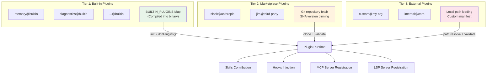
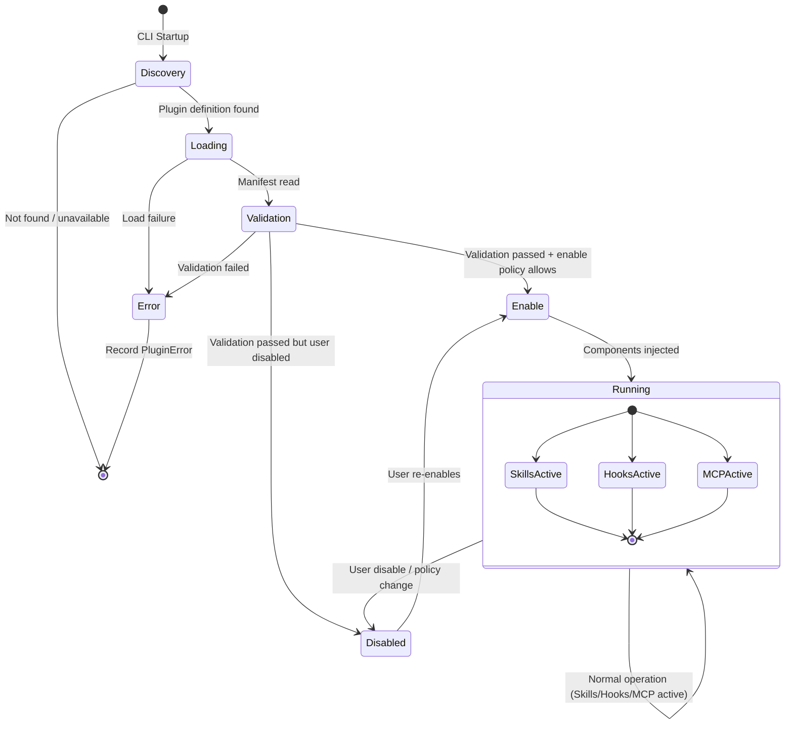
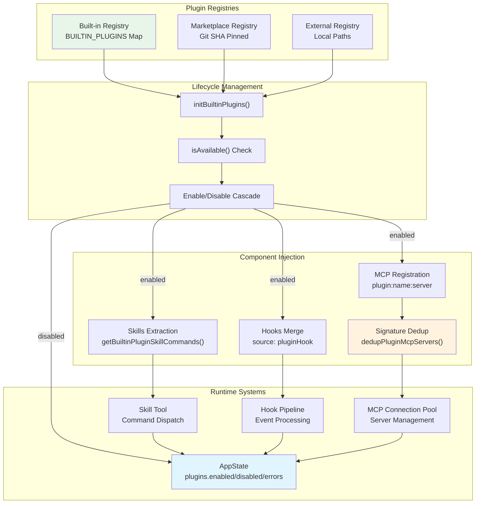

# Chapter 19: Plugin System

> **Chapter Summary**
>
> Claude Code's extensibility extends well beyond user-facing mechanisms like Skills and Hooks. At a higher level of abstraction sits a complete plugin architecture -- a single plugin can contribute Skills, Hooks, MCP servers, LSP servers, and even output styles simultaneously. This chapter dissects the plugin system's core design: the `LoadedPlugin` and `BuiltinPluginDefinition` type definitions; the `{name}@{marketplace}` identifier convention; the three-tier plugin hierarchy of built-in, marketplace, and external plugins; the full lifecycle from discovery through running to disable; plugin state integration with AppState; the three integration pathways of Skills extraction, Hooks injection, and MCP server registration; signature-based MCP deduplication; plugin-only policy enforcement; and the three-tier enable/disable cascade with source tracking.

---

## 19.1 Plugin Definition Format

### 19.1.1 LoadedPlugin: The Runtime Plugin Representation

Internally, every loaded plugin exists as a `LoadedPlugin` type. Defined in `src/types/plugin.ts`, this type is the core data structure of the plugin system:

```typescript
export type LoadedPlugin = {
  name: string
  manifest: PluginManifest
  path: string
  source: string               // e.g., "slack@anthropic"
  repository: string
  enabled?: boolean
  isBuiltin?: boolean
  sha?: string                 // Git commit SHA for version pinning
  commandsPath?: string
  commandsPaths?: string[]
  agentsPath?: string
  agentsPaths?: string[]
  skillsPath?: string
  skillsPaths?: string[]
  outputStylesPath?: string
  outputStylesPaths?: string[]
  hooksConfig?: HooksSettings
  mcpServers?: Record<string, McpServerConfig>
  lspServers?: Record<string, LspServerConfig>
  settings?: Record<string, unknown>
}
```

Several key design decisions are visible in this type.

**Multi-component contribution.** A plugin is not a carrier for a single feature -- it is a component bundle. The `PluginComponent` type explicitly enumerates the component types a plugin may contribute:

```typescript
export type PluginComponent =
  | 'commands' | 'agents' | 'skills' | 'hooks' | 'output-styles'
```

Each component type has corresponding `Path` (single) and `Paths` (multiple) fields, supporting resource loading from the plugin's filesystem directory.

**Version pinning.** The `sha` field stores a Git commit SHA, allowing the system to lock a plugin to a specific version. This is particularly important for marketplace plugins -- it provides both reproducibility and an audit trail.

**Source tracking.** The `source` field uses the `{name}@{marketplace}` format to precisely identify a plugin's origin. This field plays a key role in telemetry, error reporting, and policy enforcement.

### 19.1.2 BuiltinPluginDefinition: Built-in Plugin Definition

Built-in plugins ship compiled into the CLI binary and use a dedicated definition type:

```typescript
export type BuiltinPluginDefinition = {
  name: string
  description: string
  version?: string
  skills?: BundledSkillDefinition[]
  hooks?: HooksSettings
  mcpServers?: Record<string, McpServerConfig>
  isAvailable?: () => boolean
  defaultEnabled?: boolean
}
```

Compared to `LoadedPlugin`, `BuiltinPluginDefinition` is more streamlined. It needs no `path`, `repository`, or other filesystem-related fields because the built-in plugin's code is already compiled into the CLI. It holds `BundledSkillDefinition[]` directly through the `skills` field rather than pointing to disk paths.

The `isAvailable()` callback is an important gating mechanism. When this function returns `false`, the plugin is entirely invisible to the user -- it does not appear in listings, does not participate in Skills collection, and behaves as if it does not exist. This allows dynamic control of plugin availability based on feature flags, runtime environment, or user permissions.

### 19.1.3 Plugin ID Convention

Plugin identifiers follow the `{name}@{marketplace}` pattern:

```typescript
export const BUILTIN_MARKETPLACE_NAME = 'builtin'

export function isBuiltinPluginId(pluginId: string): boolean {
  return pluginId.endsWith(`@${BUILTIN_MARKETPLACE_NAME}`)
}
```

Three typical ID forms:

| Type | Example | Description |
|------|---------|-------------|
| Built-in | `memory@builtin` | Ships with the CLI binary |
| Marketplace | `slack@anthropic` | Installed via official or third-party marketplace |
| External | `custom-tool@my-org` | Organization-built external plugin |

This naming convention serves two practical purposes. First, the `@` suffix enables the system to quickly determine plugin type and apply the appropriate security policies and loading logic. Second, it naturally supports a multi-marketplace ecosystem.

---

## 19.2 Three-Tier Plugin Hierarchy

Claude Code's plugin ecosystem is organized into three tiers, each with a distinct trust level, loading mechanism, and set of security constraints.



### Tier 1: Built-in Plugins

Built-in plugin code is compiled directly into the CLI binary. They register into the global `BUILTIN_PLUGINS` Map via `registerBuiltinPlugin()` at startup:

```typescript
const BUILTIN_PLUGINS: Map<string, BuiltinPluginDefinition> = new Map()

export function registerBuiltinPlugin(definition: BuiltinPluginDefinition): void {
  BUILTIN_PLUGINS.set(definition.name, definition)
}
```

Built-in plugins enjoy several privileges:
- **Zero installation cost**: No network downloads or filesystem operations required
- **Highest trust level**: Direct participation in core CLI workflows
- **Compile-time guarantees**: Type safety enforced by the TypeScript compiler
- **Enabled by default**: Unless the user explicitly disables them, `defaultEnabled ?? true` applies

### Tier 2: Marketplace Plugins

Marketplace plugins are distributed via Git repositories with SHA-pinned versions. Their `source` field follows the `{name}@{marketplace_name}` format (not `@builtin`). During loading, the system:

1. Fetches code at the specified SHA from the repository
2. Validates manifest format and integrity
3. Parses SKILL.md files in `skillsPath`/`skillsPaths` directories
4. Registers `hooksConfig` and `mcpServers`

### Tier 3: External Plugins

External plugins load from local filesystem paths, suitable for internal enterprise tools or experimental extensions under development. They carry the lowest trust level and face the strictest sandboxing constraints.

---

## 19.3 Plugin Lifecycle

The complete plugin lifecycle spans six phases. The state diagram below illustrates the full progression from discovery to disable:



### Phase 1: Discovery

For built-in plugins, discovery occurs when `initBuiltinPlugins()` is called. This function executes early in CLI startup, iterating over registration modules under `src/plugins/bundled/`:

```typescript
// src/plugins/bundled/index.ts
export function initBuiltinPlugins(): void {
  // Register each built-in plugin definition
  registerBuiltinPlugin(memoryPlugin)
  registerBuiltinPlugin(diagnosticsPlugin)
  // ...
}
```

For marketplace and external plugins, discovery involves scanning declared plugin lists in configuration files, resolving the `source` field, and determining repository or path information.

### Phase 2: Loading

The loading phase's core task is reading the plugin's manifest and component paths. For built-in plugins, this is an in-memory operation (already compiled into the binary). For external plugins, the system must:

1. Resolve the directory pointed to by `path`
2. Read and parse the `PluginManifest`
3. Verify the existence of `commandsPath`, `skillsPath`, `agentsPaths`, and other paths
4. Load `hooksConfig` (if present)
5. Parse `mcpServers` and `lspServers` configurations

### Phase 3: Validation

The validation phase ensures the completeness and safety of plugin definitions. Errors are precisely categorized through the `PluginError` union type:

```typescript
export type PluginError =
  | { type: 'path-not-found'; source: string; plugin?: string; path: string }
  | { type: 'generic-error'; source: string; plugin?: string; message: string }
  | { type: 'plugin-not-found'; source: string; plugin?: string }
```

Each error type carries a `source` field for traceability and an optional `plugin` field identifying the specific plugin. This discriminated union design enables upstream code to handle each failure scenario precisely via `switch(error.type)`.

### Phase 4: Enable

The enable decision follows the three-tier cascade logic (detailed in Section 19.8). The core code:

```typescript
const userSetting = settings?.enabledPlugins?.[pluginId]
const isEnabled =
  userSetting !== undefined
    ? userSetting === true                    // 1. User explicit setting (highest priority)
    : (definition.defaultEnabled ?? true)     // 2. Plugin default, falling back to true
```

### Phase 5: Running

Once enabled, the plugin's components are injected into their respective runtime systems:
- Skills are extracted via `getBuiltinPluginSkillCommands()` and injected into the command list
- Hooks are merged into the hook execution pipeline via `hooksConfig`
- MCP servers are registered into the connection pool with namespaced keys

### Phase 6: Disable

Disabling is not destruction. Users can disable a plugin at any time via `settings.enabledPlugins[pluginId] = false`. After disabling, the plugin's Skills no longer appear in command listings, its Hooks no longer fire, and its MCP servers no longer accept connections -- but the plugin definition itself remains in the registry and can be re-enabled at any time.

---

## 19.4 Plugin Integration with AppState

Claude Code manages global state through `AppState`. Plugin state integrates under the `plugins` namespace:

```typescript
// Plugin-related fields in AppState
{
  plugins: {
    enabled: LoadedPlugin[]      // Currently enabled plugins
    disabled: LoadedPlugin[]     // Currently disabled plugins
    errors: PluginError[]        // Plugin loading/validation errors
  }
}
```

This separation serves several purposes:

1. **UI rendering**: The `enabled` and `disabled` lists directly drive the plugin management interface
2. **Error aggregation**: The `errors` array collects all lifecycle errors for user troubleshooting
3. **Reactive updates**: When plugin state changes (enable/disable/error), AppState mutations trigger UI re-renders

The `getBuiltinPlugins()` function is the primary supplier of plugin data to AppState:

```typescript
export function getBuiltinPlugins(): {
  enabled: BuiltinPluginInfo[]
  disabled: BuiltinPluginInfo[]
} {
  const enabled: BuiltinPluginInfo[] = []
  const disabled: BuiltinPluginInfo[] = []
  for (const [name, definition] of BUILTIN_PLUGINS) {
    if (!definition.isAvailable?.() && definition.isAvailable !== undefined) {
      continue  // Unavailable plugins are completely hidden
    }
    const pluginId = `${name}@${BUILTIN_MARKETPLACE_NAME}`
    const info = { name, pluginId, description: definition.description }
    if (isPluginEnabled(pluginId, definition)) {
      enabled.push(info)
    } else {
      disabled.push(info)
    }
  }
  return { enabled, disabled }
}
```

Note the `isAvailable()` check: unavailable plugins do not enter the `disabled` list -- they are filtered out entirely and remain invisible to the user.

---

## 19.5 Skills Extraction: How Plugins Contribute Skills

The mechanism by which plugins contribute Skills varies by plugin type.

### Built-in Plugin Skills Extraction

Built-in plugins convert `BundledSkillDefinition[]` to `Command[]` via `getBuiltinPluginSkillCommands()`:

```typescript
export function getBuiltinPluginSkillCommands(): Command[] {
  const { enabled } = getBuiltinPlugins()
  const commands: Command[] = []
  for (const plugin of enabled) {
    const definition = BUILTIN_PLUGINS.get(plugin.name)
    if (!definition?.skills) continue
    for (const skill of definition.skills) {
      commands.push(skillDefinitionToCommand(skill))
    }
  }
  return commands
}
```

A subtle but important design decision emerges in the conversion -- the `source` field is set to `'bundled'` rather than `'builtin'`:

```typescript
function skillDefinitionToCommand(definition: BundledSkillDefinition): Command {
  return {
    // 'bundled' not 'builtin' -- 'builtin' in Command.source means hardcoded
    // slash commands (/help, /clear). Using 'bundled' keeps these skills in
    // the Skill tool's listing, analytics name logging, and prompt-truncation
    // exemption.
    source: 'bundled',
    loadedFrom: 'bundled',
    // ...
  }
}
```

Why not `'builtin'`? In the `Command` type's semantics, `source: 'builtin'` denotes hardcoded slash commands (like `/help`, `/clear`) that are not dispatched through the Skill Tool, do not log analytics names, and do not participate in prompt truncation exemptions. Plugin-contributed Skills need to retain all of these behaviors.

### External/Marketplace Plugin Skills Extraction

External plugins contribute Skills through their `skillsPath` and `skillsPaths` fields, which point to directories containing SKILL.md files. These directories are scanned during the loading phase, and their SKILL.md files are parsed into `Command` objects via the standard Skill loading pipeline (`loadSkillsDir`), with `loadedFrom` set to `'plugin'`.

---

## 19.6 Hooks Injection: How Plugins Contribute Hooks

Plugins provide Hooks configuration through the `LoadedPlugin.hooksConfig` field. These Hooks are tagged with `source: 'pluginHook'` and merged into the execution pipeline alongside Hooks from user settings (`user`), project settings (`project`), and enterprise policies (`policySettings`).

```typescript
export type HookSource =
  | EditableSettingSource   // user, project, local settings
  | 'policySettings'       // Enterprise managed
  | 'pluginHook'           // From installed plugins
  | 'sessionHook'          // Temporary in-memory hooks
  | 'builtinHook'          // Internal built-in hooks
```

The merge occurs in `groupHooksByEventAndMatcher()`:

```typescript
const registeredHooks = getRegisteredHooks()
if (registeredHooks) {
  for (const [event, matchers] of Object.entries(registeredHooks)) {
    // Merge plugin hooks into the grouped structure
  }
}
```

Plugin Hooks follow the same event matching and filtering rules as user-defined Hooks. The `pluginHook` source tag enables the system to distinguish Hook origins in audit logs and error reports, while also allowing the policy layer to perform independent admission control over plugin Hooks.

For asynchronous Hooks, the `PendingAsyncHook` type also includes a `pluginId` field:

```typescript
export type PendingAsyncHook = {
  processId: string
  hookId: string
  hookEvent: HookEvent | 'StatusLine' | 'FileSuggestion'
  pluginId?: string    // Tracks the originating plugin
  // ...
}
```

---

## 19.7 MCP Server Registration and Signature-Based Deduplication

### Namespaced Registration

Plugins declare MCP servers via their `mcpServers` field. To avoid name collisions with manually configured servers, plugin-provided servers use namespaced keys:

```
plugin:{pluginName}:{serverName}
```

For example, the `slack` plugin's `api` server registers as `plugin:slack:api`. This prefix scheme ensures global uniqueness.

### Signature-Based Deduplication

When multiple sources (manual configuration, multiple plugins) declare configurations pointing to the same actual server, the system deduplicates via signature matching:

```typescript
export function getMcpServerSignature(config: McpServerConfig): string | null {
  const cmd = getServerCommandArray(config)
  if (cmd) return `stdio:${jsonStringify(cmd)}`
  const url = getServerUrl(config)
  if (url) return `url:${unwrapCcrProxyUrl(url)}`
  return null
}
```

The signature algorithm distinguishes by transport type:
- **stdio servers**: Signature is `stdio:` + JSON serialization of the command array
- **URL servers** (SSE/HTTP/WS): Signature is `url:` + the URL after unwrapping CCR proxy

The `dedupPluginMcpServers()` function executes the actual deduplication logic:

1. Iterates over all plugin-declared MCP servers
2. Computes each server's signature
3. Compares against manually configured server signatures -- **manual configuration wins**
4. Compares against already-loaded plugin server signatures -- **first loaded wins**
5. Plugin servers with conflicting signatures are dropped

The design intent of this deduplication strategy is clear: the user's explicit configuration always takes precedence over a plugin's implicit injection. When a user has already configured an MCP server, a plugin should not silently register a duplicate connection.

---

## 19.8 Security and Sandboxing

### Plugin-Only Policy Enforcement

Enterprise environments can activate `isRestrictedToPluginOnly()` mode via policy. Under this mode:

```typescript
// When plugin-only policy is active
if (isRestrictedToPluginOnly('skills')) {
  // User-defined Skills are blocked
  // Project-level Skills are blocked
  // Legacy commands are blocked
  // Only allowed: managed skills + plugin skills
}
```

This provides enterprises with precise control: employees can only use functionality provided by approved plugins, with no ability to load unvetted Skills. The same restrictions apply to Hooks and MCP servers.

### Permission Constraints

Different plugin tiers face different levels of permission constraints:

| Capability | Built-in | Marketplace | External |
|------------|----------|-------------|----------|
| Shell command execution | Restricted (via allowedTools) | Restricted | Restricted |
| Filesystem access | Scoped to Skill-defined paths | Scoped to Skill-defined paths | Scoped to Skill-defined paths |
| MCP server registration | Allowed | Allowed (signature dedup) | Allowed (signature dedup) |
| Hook injection | Allowed | Allowed (source tagged) | Allowed (source tagged) |
| Policy bypass | No | No | No |

A critical constraint: Skills sourced from MCP can never execute inline shell commands. This is explicitly blocked in `createSkillCommand`'s `getPromptForCommand`:

```typescript
// Security: MCP skills never execute inline shell
if (loadedFrom !== 'mcp') {
  finalContent = await executeShellCommandsInPrompt(finalContent, ...)
}
```

### Error Isolation

Plugin errors do not crash the CLI. The `PluginError` union type ensures all errors are captured and categorized. Errors are collected into `AppState.plugins.errors` for user review but do not block other plugins or core functionality from operating normally.

---

## 19.9 The Three-Tier Enable/Disable Cascade

The plugin enable/disable decision is not a simple boolean toggle. It is a three-tier cascade system with clear precedence:

```typescript
const userSetting = settings?.enabledPlugins?.[pluginId]
const isEnabled =
  userSetting !== undefined
    ? userSetting === true                    // Tier 1: User explicit preference
    : (definition.defaultEnabled ?? true)     // Tier 2: Plugin default -> Tier 3: fallback true
```

### Tier 1: User Explicit Setting (Highest Priority)

Users set a plugin's enable/disable state explicitly via `settings.enabledPlugins`. This setting is stored at the user-level configuration file and is not affected by project settings.

When `settings.enabledPlugins['memory@builtin']` exists (whether `true` or `false`), the user's intent is unambiguous -- the system respects the user's choice.

### Tier 2: Plugin Default

If the user has not explicitly set a preference, the system falls back to the `defaultEnabled` field in the plugin definition. Plugin developers can choose whether their plugin is enabled by default:

```typescript
registerBuiltinPlugin({
  name: 'experimental-feature',
  description: 'An experimental capability',
  defaultEnabled: false,  // Off by default, requires user opt-in
  // ...
})
```

### Tier 3: Global Default (Fallback)

If `defaultEnabled` is also undefined, the system adopts `true` as the fallback value. This means most plugins are available by default after registration, reducing the user's configuration burden.

### Source Tracking

The system tracks the source of enable/disable decisions throughout the lifecycle. This is particularly valuable in debugging scenarios -- when a user asks "why isn't this plugin working," the system can clearly indicate whether the user disabled it themselves, whether the plugin definition defaults to disabled, or whether `isAvailable()` returned `false`.

The `isAvailable()` check takes precedence over the enable/disable cascade. An unavailable plugin does not even enter the `disabled` list -- it is removed from visibility entirely:

```typescript
if (!definition.isAvailable?.() && definition.isAvailable !== undefined) {
  continue  // Completely hidden, does not enter enabled or disabled lists
}
```

---

## 19.10 Integration Architecture Overview

The following architecture diagram shows how the plugin system interacts with Claude Code's subsystems:



---

## 19.11 Design Retrospective

Claude Code's plugin system exhibits several architectural decisions worth examining.

**Component bundles over single extension points.** A single plugin can contribute Skills, Hooks, MCP servers, and LSP servers simultaneously. This design reduces configuration fragmentation -- a user installing a "Slack plugin" receives the complete Slack integration rather than needing to separately configure a Slack Skill, a Slack Hook, and a Slack MCP server.

**Trust tier separation.** The three-tier hierarchy of Built-in, Marketplace, and External provides appropriate trust levels for code from different origins. Built-in plugins enjoy the highest trust; External plugins face the strictest scrutiny. This layering echoes the privilege rings (Ring 0/1/2/3) found in operating system architectures.

**User intent takes precedence.** The three-tier enable/disable cascade ensures that the user's explicit choice always overrides system defaults. This embodies the principle of least surprise -- the system will not autonomously enable a feature after the user has explicitly said "no."

**Pragmatic signature deduplication.** MCP server deduplication does not rely on name matching (names may be rewritten by namespace prefixes) but instead operates on actual transport signatures (command-line arguments or URLs). This approach is more robust -- it identifies "is this the same server" rather than "is this the same name."

**Error tolerance.** One of the plugin system's core design principles is that a single plugin's failure must not bring down the entire system. Errors are collected rather than thrown; failed plugins are skipped rather than blocking. This is essential in production environments with multiple third-party plugins.

These design choices collectively construct an extension system that is both flexible and controllable, laying the foundation for Claude Code's ecosystem growth while providing enterprises with the governance mechanisms they require.
