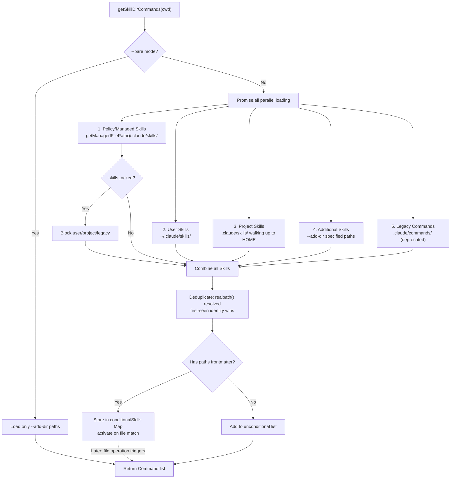
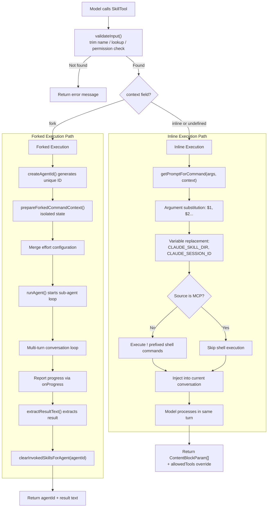

# Chapter 20: Skills Framework

> **Chapter Summary**
>
> The Skills system is the central extensibility pillar of Claude Code. Each Skill is fundamentally a YAML frontmatter plus Markdown prompt body file that passes through discovery, parsing, deduplication, and token budget estimation before being registered as a unified `Command` object. This chapter begins with the 18-field frontmatter schema, traces the five discovery sources (bundled, user, plugin, managed, MCP) and their parallel loading logic, examines the conditional activation mechanism using glob matching, compares the inline and forked execution models in detail, reveals the frontmatter-only token budgeting strategy, and concludes with the security defenses in bundled Skill extraction and the integration path from Skill to slash command.

---

## 20.1 Skill File Format

### Directory Structure

Skills are organized as **directory-based units**. Each Skill occupies its own directory containing a required entry file and optional supporting files:

```
.claude/skills/
  my-skill/
    SKILL.md          # Required entry point (case-insensitive match: /^skill\.md$/i)
    helper-script.sh  # Optional supporting script
    config.json       # Optional configuration
```

A Skill's name derives from its parent directory. For instance, `my-skill/SKILL.md` registers as the `/my-skill` command. Nested directories form namespaces using `:` as the delimiter -- `deploy/staging/SKILL.md` maps to `deploy:staging`.

The namespace construction logic is straightforward:

```typescript
function buildNamespace(targetDir: string, baseDir: string): string {
  const relativePath = targetDir.slice(normalizedBaseDir.length + 1)
  return relativePath ? relativePath.split(pathSep).join(':') : ''
}
```

The system also maintains backward compatibility with the legacy format: single `.md` files under `.claude/commands/`, where the filename (minus `.md`) becomes the command name. When both formats coexist in the same directory, the directory-based `SKILL.md` takes precedence.

### Frontmatter Schema

Each SKILL.md file begins with YAML frontmatter, parsed by `parseSkillFrontmatterFields()`. The complete 18-field schema is as follows:

| Field | Type | Default | Description |
|-------|------|---------|-------------|
| `name` | `string` | directory name | Display name override |
| `description` | `string` | extracted from first paragraph | Human-readable description |
| `when_to_use` | `string` | undefined | Guidance for the model on when to invoke |
| `allowed-tools` | `string\|string[]` | `[]` | Tools the Skill is permitted to use |
| `argument-hint` | `string` | undefined | Hint text for expected arguments |
| `arguments` | `string\|string[]` | `[]` | Named argument placeholders (`$1`, `$2`, etc.) |
| `model` | `string\|'inherit'` | undefined | Model override (e.g., `claude-sonnet-4-6`) |
| `user-invocable` | `boolean` | `true` | Whether users can invoke via `/` prefix |
| `disable-model-invocation` | `boolean` | `false` | Whether the model can invoke proactively |
| `context` | `'fork'\|'inline'` | undefined | Execution mode |
| `agent` | `string` | undefined | Agent type for forked execution |
| `effort` | `EffortValue` | undefined | Effort level (`EFFORT_LEVELS` or integer) |
| `shell` | `FrontmatterShell` | undefined | Shell interpreter for `!` commands |
| `hooks` | `HooksSettings` | undefined | Skill-scoped hooks (Zod-validated) |
| `paths` | `string\|string[]` | undefined | Glob patterns for conditional activation |
| `version` | `string` | undefined | Skill version string |

The frontmatter is parsed by `parseFrontmatter()` for YAML extraction, then validated field-by-field. The `hooks` field undergoes strict Zod schema validation via `HooksSchema().safeParse()`, ensuring type safety for hook configurations.

### Prompt Body

The Markdown content following the YAML frontmatter constitutes the Skill's prompt body. This content supports several dynamic features:

- **Argument substitution**: `$1`, `$2`, and similar placeholders are replaced with user-supplied arguments
- **Environment variables**: `${CLAUDE_SKILL_DIR}` resolves to the Skill's directory path; `${CLAUDE_SESSION_ID}` resolves to the current session ID
- **Inline shell commands**: Lines prefixed with `!` are executed, and their output replaces the line in the final prompt (disabled for MCP-sourced Skills as a security measure)

---

## 20.2 The Five Discovery Sources

Skills are loaded in parallel from five independent sources, each serving a different use case and trust level.



### Source Breakdown

**1. Managed Skills (Enterprise Policy Level)**

Loaded from `getManagedFilePath()/.claude/skills/`, deployed by enterprise administrators. When the `isRestrictedToPluginOnly('skills')` policy is active, the user, project, and legacy sources are entirely blocked -- only managed and plugin Skills load.

**2. User Skills (User Level)**

Located at `~/.claude/skills/`. This is the user's global Skill library, shared across projects. Ideal for general-purpose workflows such as code review templates or commit conventions.

**3. Project Skills (Project Level)**

Starting from `.claude/skills/` in the current working directory, the system walks up the directory tree to the user's HOME directory. This upward traversal supports monorepo scenarios where subprojects inherit parent-level Skills.

**4. Additional Skills (Supplementary Paths)**

Extra directories specified via the `--add-dir` command-line argument. Useful for temporarily importing external Skill collections, such as a shared team Skill repository.

**5. Legacy Commands (Backward Compatibility)**

Single `.md` files under `.claude/commands/` directories. This is the original Claude Code command format, now deprecated but still supported for backward compatibility.

### Loading Priority

The five sources follow a strict priority order during deduplication: Managed > User > Project > Additional > Legacy. When multiple sources produce a Skill with the same name, the first-loaded wins. Origin tracking is handled by the `LoadedFrom` discriminant type:

```typescript
export type LoadedFrom =
  | 'commands_DEPRECATED'  // Legacy .claude/commands/
  | 'skills'               // .claude/skills/
  | 'plugin'               // External plugin
  | 'managed'              // Enterprise managed path
  | 'bundled'              // Compiled into CLI binary
  | 'mcp'                  // From an MCP server's prompts
```

`LoadedFrom` serves purposes beyond deduplication: it controls security behavior (MCP Skills cannot execute shell commands) and powers analytics (the `skill_loaded_from` telemetry field).

### Deduplication Mechanics

After all sources are loaded, the combined Skill set passes through symlink-aware deduplication. Each Skill's filesystem path is resolved via `realpath()`:

```typescript
async function getFileIdentity(filePath: string): Promise<string | null> {
  try {
    return await realpath(filePath)
  } catch {
    return null
  }
}
```

The first-seen identity wins. This prevents the same Skill file from loading twice through different symlink paths or overlapping parent directories. Consider a scenario where `~/.claude/skills/lint` is a symlink pointing to `/shared/team-skills/lint` -- and `/shared/team-skills/` is also specified via `--add-dir`. Without `realpath()`-based deduplication, the lint Skill would appear twice. The identity resolution collapses both references to a single canonical path.

### The --bare Mode Exception

When Claude Code launches with `--bare`, all auto-discovery is skipped. Only `--add-dir` paths and bundled Skills are loaded. This mode exists for embedding scenarios where the host application controls the exact set of available Skills, and ambient discovery from the filesystem would introduce unwanted side effects.

---

## 20.3 Discovery Pipeline in Detail

### Directory Scanning and Gitignore Filtering

Each source directory is scanned by `loadSkillsDir()`. The function recursively traverses the directory structure, looking for `SKILL.md` files (case-insensitive) or legacy `.md` files. The scan respects `.gitignore` rules -- ignored directories are not loaded.

### Frontmatter Parsing

Once an entry file is located, the system reads its contents and separates the YAML frontmatter from the Markdown body. `parseFrontmatter()` handles YAML parsing, while `parseSkillFrontmatterFields()` extracts and validates each field by type. If no explicit `description` field is present, the system auto-extracts description text from the first paragraph of the Markdown body.

### Shell Interpolation

Lines prefixed with `!` in the prompt body are executed at load time. For example:

```markdown
Current Git branch information:
! git branch --show-current
```

The shell command's output replaces the original line, becoming part of the final prompt. This enables Skills to dynamically adapt based on current project state. MCP-sourced Skills skip this step entirely, preventing remote MCP servers from executing arbitrary commands locally.

### Token Counting and Caching

The entire discovery pipeline's result is memoized on `cwd`. Unless the working directory changes, subsequent calls return the cached result directly. Conditional Skills, once activated, retain their active state even when the cache is cleared.

---

## 20.4 Conditional Skills

Conditional Skills are a deferred activation mechanism: Skills that define `paths` field glob patterns are only activated when the model operates on files matching those patterns.

```yaml
---
name: docker-helper
paths:
  - "**/Dockerfile"
  - "**/docker-compose*.yml"
---
```

### Activation Flow

1. When the discovery pipeline encounters a `paths` field, the Skill is stored in a separate `conditionalSkills` Map rather than the active list
2. When the model reads or writes files, the system uses the `ignore` library to evaluate whether file paths match any conditional Skill's glob patterns
3. Successfully matched Skills move from `conditionalSkills` to the `activatedConditionalSkillNames` Set
4. Once activated, a Skill remains active for the entire session

Special rule: the `**` pattern (match everything) is treated as "no filter," equivalent to an unconditional Skill.

### Dynamic Discovery

`discoverSkillDirsForPaths()` implements deeper dynamism. When the model accesses files in subdirectories, the system walks upward from that file path to `cwd`, checking each level for `.claude/skills/` directories. Newly discovered directories that are not gitignored are loaded and merged into the active Skill set.

```typescript
export async function discoverSkillDirsForPaths(
  filePaths: string[],
  cwd: string,
): Promise<string[]>
```

This design is particularly valuable in large monorepos -- subprojects can define their own Skills, which load only when the model actually touches that subproject's code.

### Conditional Skills vs. Dynamic Discovery: A Distinction

These two mechanisms are complementary but distinct. Conditional Skills are **registered at startup** but **gated on file patterns** -- the Skill definition is already parsed and waiting in the `conditionalSkills` Map. Dynamic discovery, by contrast, finds **entirely new Skill directories** that were not known at startup. A conditional Skill answers "should this known Skill activate?"; dynamic discovery answers "are there unknown Skills in this part of the codebase?"

In practice, a project might use conditional Skills for context-sensitive helpers (the Docker Skill only activates when Dockerfiles are touched) while relying on dynamic discovery for subproject-specific Skills that live deep in the directory tree and would not be found by the initial parent-directory walk.

---

## 20.5 SkillTool Execution Model

The `SkillTool` is the model-facing tool interface, registered under the name `Skill`. It accepts two parameters:

```typescript
export const inputSchema = z.object({
  skill: z.string().describe('The skill name'),
  args: z.string().optional().describe('Optional arguments'),
})
```

### Validation Flow

Before executing a Skill, `validateInput()` performs these checks:

1. Trims the Skill name, strips any leading `/` prefix
2. For experimental remote Skills: verifies that `_canonical_<slug>` was discovered in the current session
3. Looks up the command in `getAllCommands()` (merging local and MCP Skills)
4. Returns an appropriate error message for Skills not found
5. Checks the `isEnabled()` feature flag gate

### Inline vs. Forked Execution

Skill execution splits into two modes, determined by the `context` frontmatter field:



#### Inline Execution (Default Mode)

Inline is the default execution mode. The Skill's prompt is injected directly into the current conversation context:

1. `getPromptForCommand()` generates the prompt content, performing argument substitution and shell execution
2. The content is returned as `ContentBlockParam[]` in the tool result
3. The model processes the expanded prompt in the same agent turn
4. The Skill's `allowedTools` override the session's tool permissions

The advantage of this mode is zero overhead -- the Skill's execution is fully integrated into the main conversation flow with no additional agent context required.

#### Forked Execution

When `context: 'fork'` is set, the Skill runs in an isolated sub-agent:

```typescript
async function executeForkedSkill(
  command: Command & { type: 'prompt' },
  commandName: string,
  args: string | undefined,
  context: ToolUseContext,
  canUseTool: CanUseToolFn,
  parentMessage: AssistantMessage,
  onProgress?: ToolCallProgress<Progress>,
): Promise<ToolResult<Output>>
```

The execution proceeds through these steps:

1. `createAgentId()` generates a unique identifier
2. `prepareForkedCommandContext()` establishes isolated execution state
3. The Skill's `effort` configuration merges into the agent definition
4. `runAgent()` creates a full multi-turn query loop; the sub-agent maintains its own conversation history
5. The sub-agent's tool calls report progress to the parent via `onProgress` callbacks
6. Upon completion, `extractResultText()` extracts result text from agent messages
7. The `finally` block calls `clearInvokedSkillsForAgent(agentId)` for resource cleanup

#### Output Types

The two modes return different output schemas:

```typescript
// Inline output
const inlineOutputSchema = z.object({
  success: z.boolean(),
  commandName: z.string(),
  allowedTools: z.array(z.string()).optional(),
  model: z.string().optional(),
  status: z.literal('inline').optional(),
})

// Forked output
const forkedOutputSchema = z.object({
  success: z.boolean(),
  commandName: z.string(),
  status: z.literal('forked'),
  agentId: z.string(),
  result: z.string(),
})
```

Inline mode returns optional `allowedTools` and `model` overrides because these need to influence subsequent main conversation behavior. Forked mode returns an `agentId` and `result` text because the sub-agent has completed execution and the result is self-contained.

#### Choosing Between Modes

The choice between inline and forked execution involves a fundamental tradeoff. Inline execution is lightweight -- no agent creation, no separate conversation history, no cleanup. But it pollutes the main conversation context with the Skill's expanded prompt and intermediate tool calls. For short, focused Skills (e.g., a commit message generator), inline is ideal.

Forked execution provides isolation at the cost of overhead. The sub-agent maintains its own conversation history, so lengthy multi-step workflows (e.g., a comprehensive code review that reads many files) do not bloat the parent context. The parent only sees the final result text. However, forked execution pays the cost of agent creation, multi-turn loop setup, and result extraction. It also cannot directly modify the parent's tool permissions or model selection -- those are properties of the inline return path.

#### Analytics and Telemetry

Both execution paths emit telemetry. Forked execution tracks additional fields:

- `command_name`: redacted for third-party Skills to protect intellectual property
- `_PROTO_skill_name`: unredacted version, stored in a PII-tagged column
- `execution_context`: `'fork'` for forked, absent for inline
- `invocation_trigger`: `'nested-skill'` when invoked by another Skill, `'claude-proactive'` when the model decides autonomously
- `query_depth`: the nesting level, enabling detection of excessively deep Skill chains

---

## 20.6 Token Budget Management

Large projects may register dozens or even hundreds of Skills. Including every Skill's full content in the system prompt would rapidly exhaust the context window. Claude Code addresses this through a **frontmatter-only estimation** strategy.

### Estimation Function

```typescript
export function estimateSkillFrontmatterTokens(skill: Command): number {
  const frontmatterText = [skill.name, skill.description, skill.whenToUse]
    .filter(Boolean)
    .join(' ')
  return roughTokenCountEstimation(frontmatterText)
}
```

Only the `name`, `description`, and `whenToUse` fields participate in token estimation. These fields appear in the system prompt as a Skill catalog, allowing the model to decide when to invoke each Skill.

### Lazy Loading

The Skill's full Markdown body is **not loaded during discovery**. Only when a Skill is actually invoked (via `getPromptForCommand()`) does the system read and expand its complete content. This lazy strategy ensures that registering 100 Skills incurs the token cost of presenting 100 summaries, not 100 full prompts.

### Truncation Strategies

When a Skill's full content exceeds the remaining token budget, the system applies truncation. Bundled Skills are exempt from truncation -- their `source: 'bundled'` identifier bypasses the prompt truncation logic, guaranteeing the integrity of core functionality.

---

## 20.7 Bundled Skill Extraction Security

Bundled Skills are built into the CLI binary and registered at startup via `registerBundledSkill()`.

### BundledSkillDefinition

```typescript
export type BundledSkillDefinition = {
  name: string
  description: string
  aliases?: string[]
  whenToUse?: string
  argumentHint?: string
  allowedTools?: string[]
  model?: string
  disableModelInvocation?: boolean
  userInvocable?: boolean
  isEnabled?: () => boolean
  hooks?: HooksSettings
  context?: 'inline' | 'fork'
  agent?: string
  files?: Record<string, string>
  getPromptForCommand: (args: string, context: ToolUseContext) => Promise<ContentBlockParam[]>
}
```

### Reference File Extraction

Bundled Skills with a `files` field need to extract their reference files to disk. This process faces a security threat: if an attacker pre-places a symlink at the target path, the extraction operation could be redirected to an arbitrary file location. Claude Code defends against this with three layers:

**1. Per-Process Nonce Directory**

Each CLI process uses a unique nonce directory under `getBundledSkillsRoot()`, ensuring extraction paths are unpredictable across processes:

```
/tmp/claude-skills/<nonce>/
  skill-name/
    reference-file.json
```

**2. O_NOFOLLOW | O_EXCL Write Flags**

File writes use `SAFE_WRITE_FLAGS`, which include `O_NOFOLLOW` (refuse to follow symbolic links) and `O_EXCL` (target file must not already exist):

```typescript
async function safeWriteFile(p: string, content: string): Promise<void> {
  const fh = await open(p, SAFE_WRITE_FLAGS, 0o600)
  try {
    await fh.writeFile(content, 'utf8')
  } finally {
    await fh.close()
  }
}
```

**3. Strict Permission Settings**

Directory permissions are set to `0o700` (owner-only access); file permissions are set to `0o600` (owner-only read/write).

### Memoized Extraction

The extraction promise is memoized at the process level. Multiple concurrent callers await the same extraction promise rather than racing to write. This avoids race conditions while ensuring disk I/O happens exactly once.

---

## 20.8 Integration: From Skill to Slash Command

### The Unified Command Model

All Skills -- whether from the filesystem, plugins, MCP, or bundled -- are ultimately converted into a unified `Command` object. This is the integration point between the Skills system and the command system.

```typescript
export function createSkillCommand({
  skillName, displayName, description,
  markdownContent, allowedTools, argumentHint,
  whenToUse, model, source, baseDir, loadedFrom,
  hooks, executionContext, agent, paths, effort, shell,
}): Command {
  return {
    type: 'prompt',
    name: skillName,
    description,
    allowedTools,
    source,
    loadedFrom,
    async getPromptForCommand(args, toolUseContext) {
      // Argument substitution, variable replacement, shell execution
    },
  }
}
```

### User Invocation Path

When `user-invocable: true` (the default), a Skill is exposed to users as a slash command. Users type `/skill-name args` in the CLI to trigger invocation. The system routes the input to the corresponding Command's `getPromptForCommand()`, and the generated prompt is injected into the conversation flow.

### Model Invocation Path

When `disable-model-invocation: false` (the default), the model can proactively invoke Skills through the `SkillTool`. The model sees all available Skills' `name`, `description`, and `when_to_use` information in the system prompt and uses this to decide when to initiate a call.

### The MCP Skill Bridge

Skills provided by MCP servers are bridged into the local Skill system through `mcpSkillBuilders.ts`. This module resolves a circular dependency between the MCP client and the Skill loading system:

```typescript
export type MCPSkillBuilders = {
  createSkillCommand: typeof createSkillCommand
  parseSkillFrontmatterFields: typeof parseSkillFrontmatterFields
}

let builders: MCPSkillBuilders | null = null

export function registerMCPSkillBuilders(b: MCPSkillBuilders): void {
  builders = b
}
```

Registration occurs during `loadSkillsDir.ts` module initialization (triggered eagerly at startup via the static import chain from `commands.ts`), ensuring the bridge is ready before any MCP server connections are established.

### Plugin Skill Conversion

The `BundledSkillDefinition[]` defined in plugins are converted to standard `Command[]` via `getBuiltinPluginSkillCommands()`. The conversion deliberately uses `source: 'bundled'` rather than `source: 'builtin'` -- the latter is reserved for hardcoded slash commands like `/help` and `/clear`. Using `'bundled'` ensures plugin Skills appear in the SkillTool's listing, are properly recorded in analytics, and receive prompt truncation exemption.

---

## 20.9 Design Summary

The Skills framework embodies several core engineering principles:

**Lazy loading, on-demand activation.** From frontmatter-only token estimation, to glob-matched conditional activation, to invoke-time prompt loading -- the system defers costs at every layer until they are truly needed.

**Layered security, defense in depth.** MCP Skills cannot execute shell commands; bundled Skill extraction uses `O_NOFOLLOW | O_EXCL` with per-process nonces; the `LoadedFrom` discriminant drives differentiated security policies -- multiple defensive layers ensure that even if one is breached, overall security holds.

**Unified abstraction, polymorphic execution.** Regardless of origin, all Skills converge to the `Command` object. But at execution time, they diverge into inline and forked paths, each optimized for different scenarios. This pattern of "unified interface, differentiated implementation" is a microcosm of the entire Claude Code architecture.

**Progressive discovery, hierarchical override.** The five discovery sources form a hierarchy from enterprise policy down to project-local. Policy locks can suppress lower-priority sources. Upward directory traversal and file-triggered dynamic discovery further extend this progressive capability expansion model.

These principles combine to create a system where extensibility is both powerful and safe. A single developer can author a Skill in minutes -- write a SKILL.md with frontmatter, drop it in `.claude/skills/`, and invoke it immediately. An enterprise can lock down Skill loading to managed paths only, ensuring compliance. And the model itself can discover and invoke Skills proactively based on the `when_to_use` guidance, turning passive tools into an active capability layer. The Skills framework is, in this sense, the fulcrum that transforms Claude Code from a reactive assistant into a composable agent platform.
