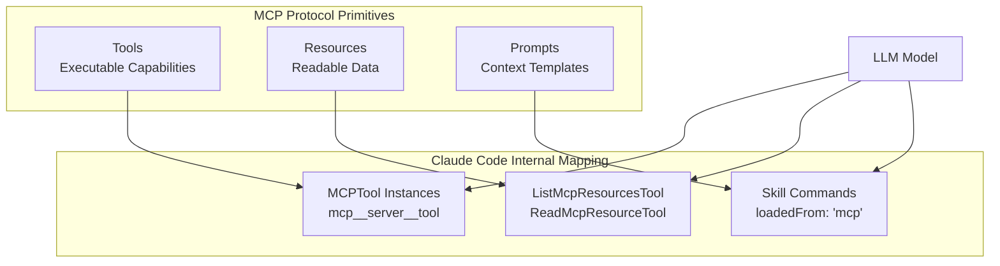
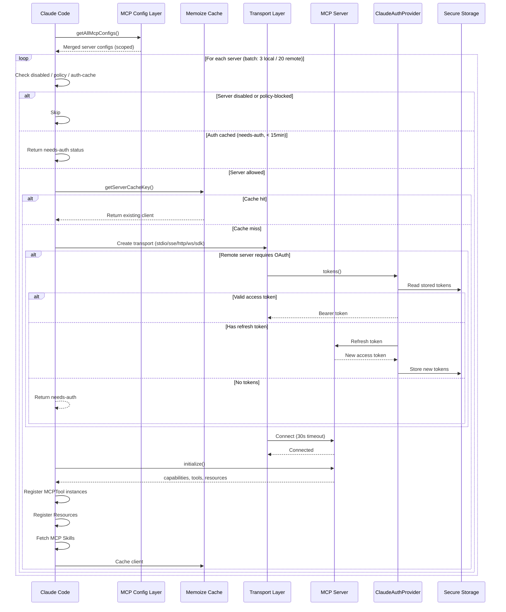
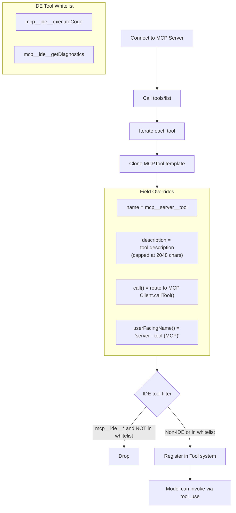
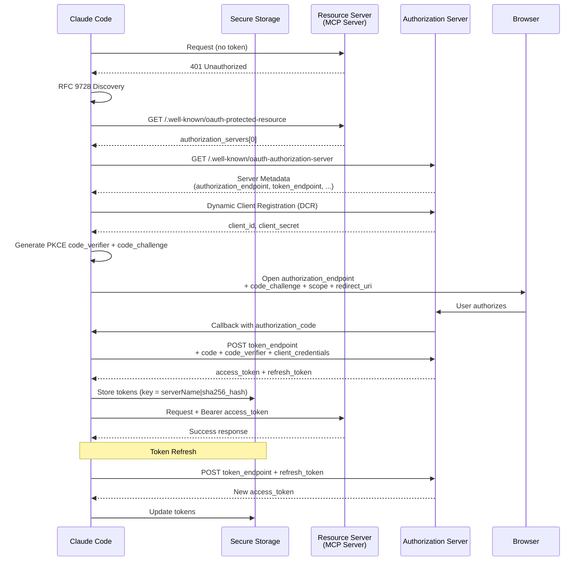

# Chapter 21: MCP Protocol Integration -- The Protocol Layer That Connects Everything

> MCP (Model Context Protocol) is the backbone of Claude Code's extensibility. It is not a simple RPC framework -- it defines three primitives (Tools, Resources, Prompts), supports seven transport layers, implements a full OAuth authentication stack, and balances performance against capability through memoized connection management and deferred loading. This chapter traces the complete architecture from protocol primitives through transport selection, connection lifecycle, dynamic tool registration, authentication flows, resource browsing, policy enforcement, and deferred loading.

---

## 21.1 MCP Protocol Overview: Three Primitives

MCP defines three core primitives, each corresponding to a distinct interaction pattern between Claude Code and external servers:

**Tools** -- executable capabilities. An MCP server exposes its tool set via `tools/list`, where each tool has a name, description, and JSON Schema-defined input parameters. Claude Code registers these as local `MCPTool` instances, allowing the model to invoke them as if they were built-in tools.

**Resources** -- readable data. Analogous to GET endpoints in a REST API, each resource carries a URI identifier. Claude Code exposes these through `ListMcpResourcesTool` for browsing and `ReadMcpResourceTool` for retrieval by URI.

**Prompts** -- injectable context templates. MCP servers can provide pre-defined prompt templates, which Claude Code converts into Skill Commands. The model invokes these through the Skill Tool.

Together, the three primitives cover the full interaction surface: what to do (Tools), what to read (Resources), and how to do it (Prompts).



---

## 21.2 Seven Transport Layers

MCP is not bound to a single wire protocol. Claude Code's client supports seven transport types, defined in `types.ts`:

```typescript
export type Transport = 'stdio' | 'sse' | 'sse-ide' | 'http' | 'ws' | 'sdk'
// Plus internal types: 'ws-ide', 'claudeai-proxy'
```

### Transport Comparison Table

| Transport | Category | Config Type | Key Fields | Typical Use Case |
|-----------|----------|------------|------------|-----------------|
| `stdio` | Local process | `McpStdioServerConfig` | `command`, `args[]`, `env?` | Local toolchains: linters, formatters |
| `sse` | Remote long-poll | `McpSSEServerConfig` | `url`, `headers?`, `oauth?` | Legacy SSE-based remote servers |
| `sse-ide` | IDE bridge | `McpSSEIDEServerConfig` | `url`, `ideName` | VS Code embedded servers |
| `http` | Remote req/res | `McpHTTPServerConfig` | `url`, `headers?`, `oauth?` | Streamable HTTP, modern remote servers |
| `ws` | WebSocket | `McpWebSocketServerConfig` | `url`, `headers?` | Bidirectional real-time servers |
| `ws-ide` | IDE WebSocket | `McpWebSocketIDEServerConfig` | `url`, `ideName`, `authToken?` | IDE bridge over WebSocket |
| `sdk` | In-process | `McpSdkServerConfig` | `name` | Embedded servers (e.g., Chrome MCP) |
| `claudeai-proxy` | Proxy | `McpClaudeAIProxyServerConfig` | `url`, `id` | Routed through Anthropic's MCP proxy |

Each transport has fundamentally different connection mechanics:

- **stdio**: Spawns a subprocess via `StdioClientTransport`, with stderr piped to a separate log collector. Environment variables merge through `subprocessEnv()`.
- **SSE / HTTP**: Creates a `ClaudeAuthProvider` for OAuth, wraps `fetch` with timeout and step-up detection. SSE's EventSource connection has no timeout (long-lived stream), while HTTP per-request timeout is 60 seconds.
- **WebSocket**: Uses `ws.WebSocket` (Node) or Bun-native WebSocket, wrapped in `WebSocketTransport`.
- **In-process (sdk)**: Creates bidirectional transport pairs via `createLinkedTransportPair()`. Both server and client run within the same process.
- **claudeai-proxy**: Carries an OAuth bearer token through Anthropic's MCP proxy layer.

---

## 21.3 Client Architecture: Connection Lifecycle

### 21.3.1 Core Client

The MCP client implementation lives in `services/mcp/client.ts` (~3,300 lines), built on the official `@modelcontextprotocol/sdk` library:

```typescript
const client = new Client(
  {
    name: 'claude-code',
    title: 'Claude Code',
    version: MACRO.VERSION ?? 'unknown',
    description: "Anthropic's agentic coding tool",
    websiteUrl: PRODUCT_URL,
  },
  {
    capabilities: {
      roots: {},
      elicitation: {},
    },
  },
)
```

The client declares two capabilities: `roots` (allows the server to query working directories) and `elicitation` (allows the server to initiate interactive prompts to the user).

### 21.3.2 Memoized Connections

`connectToServer()` is memoized via lodash `memoize`, keyed on the server name plus its serialized config:

```typescript
export function getServerCacheKey(
  name: string,
  serverRef: ScopedMcpServerConfig,
): string {
  return `${name}-${jsonStringify(serverRef)}`
}
```

Repeated connection requests for the same server config hit the cache and return the existing client immediately. This avoids redundant connection establishment during tool discovery, permission checks, and other operations that query server state.

### 21.3.3 Batched Connections

Connections are established in batches rather than fully in parallel:

- **Local servers (stdio/sdk)**: batches of 3 (`getMcpServerConnectionBatchSize()`)
- **Remote servers (sse/http/ws)**: batches of 20 (`getRemoteMcpServerConnectionBatchSize()`)

The smaller batch size for local servers exists because each stdio connection spawns a subprocess -- too many concurrent spawns can exhaust system resources. Remote servers are primarily I/O-latency-bound, so larger batches effectively exploit network parallelism.

### 21.3.4 Connection Lifecycle Diagram



### 21.3.5 Timeout Strategy

The system defines a layered timeout strategy:

| Timeout Type | Default | Environment Variable Override |
|-------------|---------|------------------------------|
| Connection timeout | 30s | `MCP_TIMEOUT` |
| Per-request timeout | 60s | `MCP_REQUEST_TIMEOUT_MS` |
| Tool call timeout | ~27.8 hours | `MCP_TOOL_TIMEOUT` |
| Auth request timeout | 30s | `AUTH_REQUEST_TIMEOUT_MS` |

The tool call timeout (`DEFAULT_MCP_TOOL_TIMEOUT_MS = 100_000_000`) is deliberately extreme because some MCP tools may trigger long-running operations such as deployments or large-scale data processing.

### 21.3.6 Session Expired Detection

When an MCP session expires, the server returns HTTP 404 combined with JSON-RPC error code `-32001`:

```typescript
export function isMcpSessionExpiredError(error: Error): boolean {
  const httpStatus = 'code' in error
    ? (error as Error & { code?: number }).code
    : undefined
  if (httpStatus !== 404) return false
  return (
    error.message.includes('"code":-32001') ||
    error.message.includes('"code": -32001')
  )
}
```

The dual check (HTTP 404 + JSON-RPC -32001) prevents false positives from generic web server 404 responses. Upon detection, the client clears its memoized connection and re-establishes a fresh session.

---

## 21.4 Tool Discovery and Dynamic Registration

### 21.4.1 Naming Convention

MCP tools follow a strict double-underscore naming convention:

```
mcp__<normalized_server_name>__<normalized_tool_name>
```

For example, a `create_issue` tool from a server named `github` registers as `mcp__github__create_issue`.

```typescript
export function buildMcpToolName(serverName: string, toolName: string): string {
  return `${getMcpPrefix(serverName)}${normalizeNameForMCP(toolName)}`
}

// Normalization: replace invalid characters with underscores
export function normalizeNameForMCP(name: string): string {
  let normalized = name.replace(/[^a-zA-Z0-9_-]/g, '_')
  if (name.startsWith(CLAUDEAI_SERVER_PREFIX)) {
    normalized = normalized.replace(/_+/g, '_').replace(/^_|_$/g, '')
  }
  return normalized
}
```

Reverse parsing works on the same `__` delimiter:

```typescript
export function mcpInfoFromString(toolString: string): {
  serverName: string
  toolName: string | undefined
} | null {
  const parts = toolString.split('__')
  const [mcpPart, serverName, ...toolNameParts] = parts
  if (mcpPart !== 'mcp' || !serverName) return null
  const toolName = toolNameParts.length > 0
    ? toolNameParts.join('__')
    : undefined
  return { serverName, toolName }
}
```

**Known limitation**: Server names containing `__` will parse incorrectly -- the parser cannot distinguish `__` within the server name from the structural delimiter.

### 21.4.2 The MCPTool Template

`MCPTool.ts` defines a template tool. Every MCP tool is a clone of this template with key fields overridden:

```typescript
export const MCPTool = buildTool({
  isMcp: true,
  isOpenWorld() { return false },
  name: 'mcp',                     // Overridden at registration
  maxResultSizeChars: 100_000,
  async description() { return DESCRIPTION },   // Overridden
  async prompt() { return PROMPT },             // Overridden
  get inputSchema() { return inputSchema() },   // z.object({}).passthrough()
  get outputSchema() { return outputSchema() }, // z.string()
  async call() { return { data: '' } },         // Overridden
  async checkPermissions() {
    return { behavior: 'passthrough', message: 'MCPTool requires permission.' }
  },
})
```

The `inputSchema` uses `z.object({}).passthrough()` -- it accepts any JSON object because the actual per-tool schema is enforced at the MCP protocol level by the server.

### 21.4.3 Dynamic Registration Flow



When an MCP server responds to `tools/list`, the client performs the following for each tool:

1. **Clone** the MCPTool template.
2. **Set name** to the `mcp__<server>__<tool>` format.
3. **Set description**, capped at `MAX_MCP_DESCRIPTION_LENGTH = 2048` characters.
4. **Override call()** to route through the specific MCP Client's `callTool()` method.
5. **Set userFacingName()** to the human-readable `<server> - <tool> (MCP)` format.
6. **Filter IDE tools**: only whitelisted IDE tools (`mcp__ide__executeCode`, `mcp__ide__getDiagnostics`) are retained.

### 21.4.4 Tool Call Flow

1. The model emits a `tool_use` block specifying the MCP tool name and arguments.
2. The tool's `call()` method (overridden during registration) invokes `callTool()` on the MCP Client.
3. Timeout is controlled by `getMcpToolTimeoutMs()` (default ~27.8 hours).
4. Response handling:
   - **Text content**: returned as a string.
   - **Image content**: resized and downsampled via `maybeResizeAndDownsampleImageBuffer()`.
   - **Binary blobs**: persisted to disk with a reference path returned.
   - **Oversized results**: truncated via `truncateMcpContentIfNeeded()`.
5. Error handling: `isError: true` throws `McpToolCallError`; HTTP 401 throws `McpAuthError` and updates client status to `needs-auth`.

---

## 21.5 OAuth Authentication Flow

### 21.5.1 Architecture Overview

MCP's OAuth implementation is a production-grade authentication stack, implemented in `auth.ts` (~1,800 lines). At its core is `ClaudeAuthProvider`, which implements the SDK's `OAuthClientProvider` interface:

- **PKCE** (Proof Key for Code Exchange) prevents authorization code interception.
- **DCR** (Dynamic Client Registration) for automatic client enrollment.
- **RFC 9728 / RFC 8414** dual discovery mechanism.
- **XAA** (Cross-App Access) token exchange across identity providers.
- **Step-up scope** handling on 403 responses.

### 21.5.2 OAuth Discovery

Discovery follows a standardized probe chain:

```
1. If configuredMetadataUrl is set -> fetch directly (must be HTTPS)
2. RFC 9728: probe /.well-known/oauth-protected-resource
   -> read authorization_servers[0]
   -> fetch server metadata per RFC 8414
3. Fallback: RFC 8414 directly against MCP server URL (path-aware, for legacy)
```

This three-tier probe chain ensures compatibility with diverse OAuth deployments -- from fully standards-compliant protected resource discovery to legacy servers that only expose basic authorization server metadata.

### 21.5.3 Token Storage

Tokens are stored per-server in the OS secure storage (macOS Keychain, etc.). The storage key uses a SHA-256 hash to ensure that identically named servers with different configurations never share credentials:

```typescript
export function getServerKey(
  serverName: string,
  serverConfig: McpSSEServerConfig | McpHTTPServerConfig,
): string {
  const configJson = jsonStringify({
    type: serverConfig.type,
    url: serverConfig.url,
    headers: serverConfig.headers || {},
  })
  const hash = createHash('sha256')
    .update(configJson)
    .digest('hex')
    .substring(0, 16)
  return `${serverName}|${hash}`
}
```

The function serializes `type`, `url`, and `headers`, then takes the first 16 hexadecimal characters of the SHA-256 digest as a suffix. Even if two servers share the same name (e.g., different projects both naming their server `api`), differing URLs or headers produce isolated credential storage.

### 21.5.4 Complete OAuth Flow



### 21.5.5 Token Refresh Error Handling

Token refresh must handle several edge cases:

- **Transient errors (500, 503, 429)**: retry with exponential backoff.
- **Invalid grant**: invalidate all credentials, mark server as `needs-auth`.
- **Non-standard error codes**: Slack returns `invalid_refresh_token` / `expired_refresh_token` instead of RFC 6749's standard `invalid_grant`. These are normalized:

```typescript
const NONSTANDARD_INVALID_GRANT_ALIASES = new Set([
  'invalid_refresh_token',
  'expired_refresh_token',
  'token_expired',
])
```

- **OAuth errors in 200 responses**: Some servers (notably Slack) return HTTP 200 with an error body. The `normalizeOAuthErrorBody()` wrapper detects this and rewrites the status to 400.

### 21.5.6 Step-Up Authentication

When an MCP server returns 403 (Forbidden), step-up detection triggers:

1. Parse the `scope` from the error response.
2. Persist the new scope in token storage as `stepUpScope`.
3. Mark the server as `needs-auth` with the expanded scope.
4. Re-authentication uses the cached scope instead of re-probing.

This allows servers to request permissions incrementally -- for example, an initial connection may only require `read` scope, and when the model attempts a write operation, the server returns 403 requesting `write` scope.

---

## 21.6 Cross-App Access (XAA)

XAA addresses a practical problem: when multiple MCP servers each require authentication, users should not have to complete a full OAuth flow for each server independently.

### 21.6.1 How It Works

- Each server can enable XAA via `oauth.xaa: true` in `.mcp.json`.
- Global IdP (Identity Provider) settings are stored in `settings.xaaIdp`, containing `issuer`, `clientId`, and `callbackPort`.
- OIDC discovery locates the IdP's authorization endpoint.
- The user completes a single authentication with the IdP and receives an `id_token`.
- That `id_token` is exchanged for the target MCP server's access token.

### 21.6.2 Auth Cache

A 15-minute TTL cache prevents redundant authentication probes:

```typescript
const MCP_AUTH_CACHE_TTL_MS = 15 * 60 * 1000

async function isMcpAuthCached(serverId: string): Promise<boolean> {
  const cache = await getMcpAuthCache()
  const entry = cache[serverId]
  if (!entry) return false
  return Date.now() - entry.timestamp < MCP_AUTH_CACHE_TTL_MS
}
```

Cache writes are serialized through a promise chain to prevent concurrent read-modify-write races when multiple servers return 401 in the same batch.

---

## 21.7 Resource Browsing

MCP's Resource primitive is exposed to the model through two dedicated tools:

**ListMcpResourcesTool** -- lists available resources from a given server. Returns resource names, URIs, and descriptions, enabling the model to discover what data is available.

**ReadMcpResourceTool** -- reads a specific resource by URI. Returns resource content, which may be text, JSON, or binary data.

These two tools are automatically created for every successfully connected MCP server, requiring no additional configuration. The model can explore a server's data through a list-then-read pattern.

---

## 21.8 Policy Enforcement

### 21.8.1 Allowlist and Denylist

Two policy mechanisms control MCP server access:

**Allowlist** (`allowedMcpServers`):
- Supports three matching modes: name-based, command-based, and URL-based.
- When `allowManagedMcpServersOnly` is set, only managed settings control the allowlist.
- An empty array `[]` blocks all servers; `undefined` means no restrictions.

**Denylist** (`deniedMcpServers`):
- Always merges from all sources (users can always add denials for themselves).
- **Takes absolute precedence over the allowlist** -- a server present in the denylist is blocked even if it appears in the allowlist.
- Supports the same three matching modes.

```typescript
function isMcpServerAllowedByPolicy(
  serverName: string,
  config?: McpServerConfig,
): boolean {
  if (isMcpServerDenied(serverName, config)) return false
  // ... allowlist logic
}
```

**SDK-type servers are exempt** from policy filtering -- they are transport placeholders managed internally by the SDK.

### 21.8.2 Config Scope Hierarchy

MCP server configurations arrive from multiple sources, each tagged with a `ConfigScope`:

```typescript
export type ConfigScope =
  | 'local'       // .mcp.json in project
  | 'user'        // User-level settings
  | 'project'     // Project settings
  | 'dynamic'     // Programmatic (SDK)
  | 'enterprise'  // Enterprise managed config
  | 'claudeai'    // Claude.ai connectors
  | 'managed'     // Managed MCP file
```

The config merge pipeline (`getAllMcpConfigs()`) executes in this order:

1. Load managed/enterprise configs.
2. Load user/project/local configs.
3. Load claude.ai connectors.
4. Load plugin MCP servers.
5. Expand environment variables (`expandEnvVars()`).
6. Apply allowlist/denylist policy filtering.
7. Deduplicate (plugin and claude.ai servers against manual configs).

Deduplication is signature-based:

```typescript
export function getMcpServerSignature(config: McpServerConfig): string | null {
  const cmd = getServerCommandArray(config)
  if (cmd) return `stdio:${jsonStringify(cmd)}`
  const url = getServerUrl(config)
  if (url) return `url:${unwrapCcrProxyUrl(url)}`
  return null
}
```

Manually configured servers take precedence over plugin-provided servers with the same signature.

---

## 21.9 Deferred Loading: MCP Tools and ToolSearch

### 21.9.1 Why Deferred Loading Matters

A project may connect to a dozen MCP servers, each exposing tens of tools. Including every tool's full JSON Schema in the system prompt would create enormous token overhead. Deferred loading solves this problem.

### 21.9.2 How It Works

1. MCP tools initially appear only as a name list in the system prompt (within a `<system-reminder>` deferred tools section).
2. The model sees tool names but no parameter schemas, so it cannot invoke them directly.
3. When the model determines a tool might be useful, it calls the `ToolSearch` tool.
4. `ToolSearch` accepts a query string and returns complete JSON Schema definitions for matching tools.
5. The returned schemas appear in a `<functions>` block, making the tool callable.

```
Model's perspective:

[Initial state]
<system-reminder>
The following deferred tools are now available via ToolSearch:
mcp__github__create_issue
mcp__github__list_repos
mcp__slack__send_message
</system-reminder>

[Invoke ToolSearch]
ToolSearch({ query: "github issue" })

[After receiving schema]
<functions>
<function>{"name": "mcp__github__create_issue", "parameters": {...}}</function>
</functions>

[Now callable]
mcp__github__create_issue({ title: "Bug report", body: "..." })
```

This design maintains full tool discoverability while minimizing system prompt token consumption. Only tools the model actually needs have their full schemas loaded.

### 21.9.3 Search Matching

`ToolSearch` supports multiple query forms:

- **Exact selection**: `select:Read,Edit,Grep` -- fetch specific tools by name.
- **Keyword search**: `notebook jupyter` -- fuzzy match, returns up to `max_results` results.
- **Name-constrained search**: `+slack send` -- requires "slack" in the name, ranks by remaining terms.

MCP tools provide additional search keywords through the `searchHint` field (a 3-10 word phrase), improving their discoverability.

---

## 21.10 MCP Skills Bridge

MCP server-provided Prompts are not merely text templates -- they are bridged into Claude Code's Skill system.

`mcpSkillBuilders.ts` resolves a circular dependency between the MCP client and the skill loading system:

```typescript
export type MCPSkillBuilders = {
  createSkillCommand: typeof createSkillCommand
  parseSkillFrontmatterFields: typeof parseSkillFrontmatterFields
}
```

MCP-sourced skills carry a critical security restriction: skills with `loadedFrom: 'mcp'` will not execute `!`-prefixed shell commands embedded in their Markdown content. This prevents a malicious MCP server from achieving arbitrary code execution on the user's machine through prompt injection.

---

## 21.11 Error Hierarchy and Fault Tolerance

MCP defines a layered error type hierarchy:

```typescript
class McpAuthError extends Error {
  serverName: string    // Server that triggered the auth error
}

class McpSessionExpiredError extends Error {}  // Session expired, retry

class McpToolCallError extends TelemetrySafeError {
  readonly mcpMeta?: { _meta?: Record<string, unknown> }
}
```

**McpAuthError** -- authentication failed; the user must re-authorize. Triggers a client state transition to `needs-auth`.

**McpSessionExpiredError** -- the server-side session has expired (HTTP 404 + JSON-RPC -32001). The client clears the memoized connection and retries with a fresh client.

**McpToolCallError** -- a tool call failed, but the error message has been sanitized for telemetry safety (no user code or file paths leak into error reports).

This layered design ensures that different failure modes receive appropriate handling: authentication errors guide the user through re-authorization, session expirations trigger automatic reconnection, and tool call errors are safely reported upstream.

---

## 21.12 Summary

MCP integration is the foundation of Claude Code's extensibility. Several key design decisions emerge from this analysis:

**Protocol level**: The three primitives (Tools, Resources, Prompts) cover the full interaction surface, avoiding the trap of hard-coding all needs into a single RPC mechanism.

**Transport level**: Support for seven transport types is not over-engineering but a pragmatic response to real deployment scenarios -- from local CLI tools (stdio) to SSO-protected enterprise services (http + OAuth) to IDE integrations (sse-ide/ws-ide).

**Connection management**: Memoized connections + batched initialization + a 15-minute auth cache form a three-layer caching system that balances first-connection cost against runtime efficiency.

**Security level**: SHA-256-isolated token storage, PKCE authentication flow, dual allowlist/denylist policy, and shell command prohibition for MCP skills -- each layer addresses a specific threat model.

**Performance level**: Deferred loading reduces the system prompt cost of N MCP tools from O(N * schema_size) to O(N * name_length), loading full schemas only on demand.

These decisions collectively produce a protocol integration layer that is open (supporting arbitrary MCP server connections), secure (multi-layered policy and isolation), and efficient (lazy loading and connection reuse).
