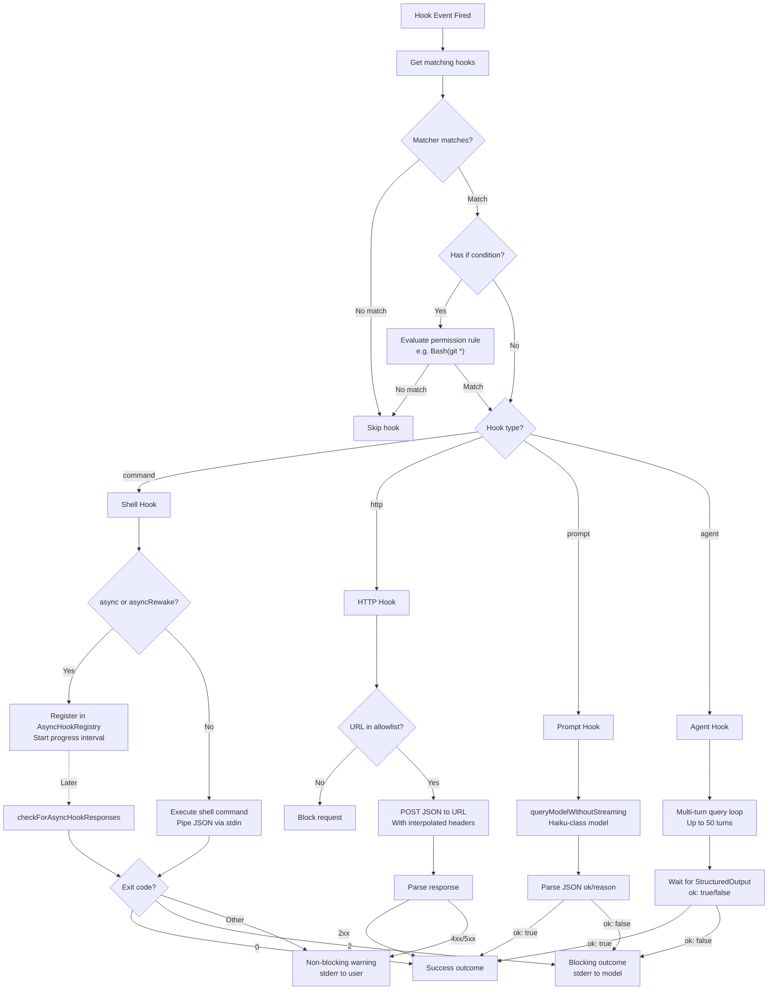
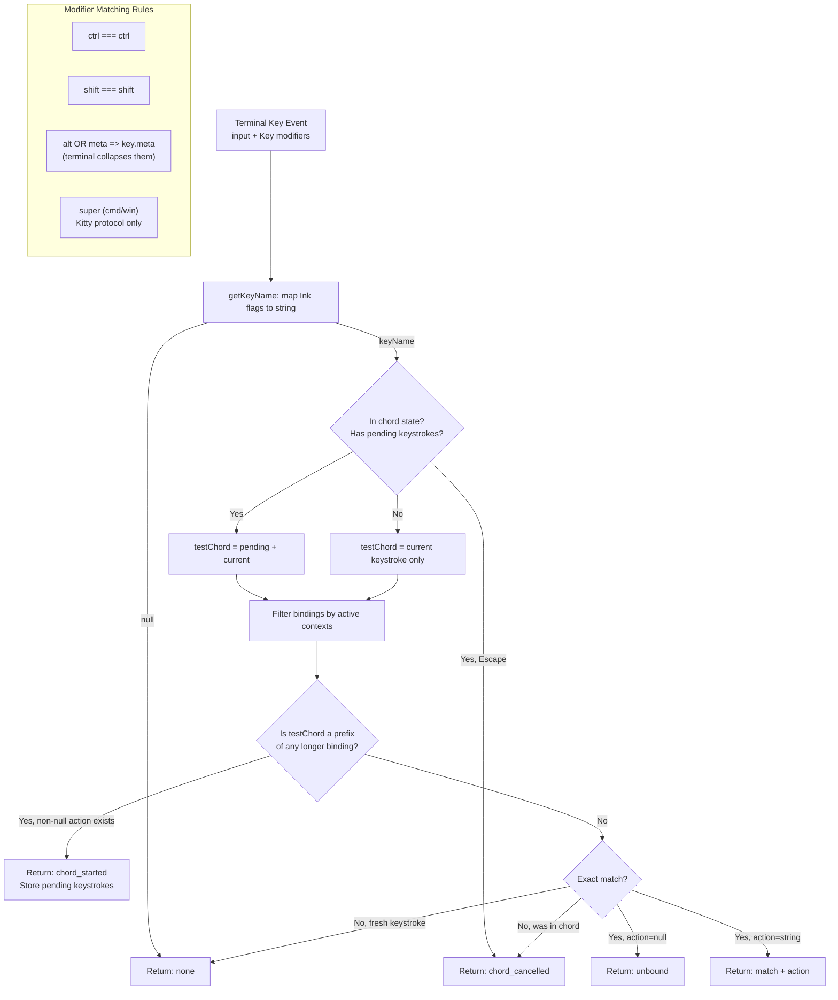

# Chapter 22: Hook System — Event-Driven Behavioral Interception

> Claude Code's Hook System is a comprehensive event-driven interception framework: 27 event types cover every critical juncture from tool calls to session lifecycle, four execution types (command, HTTP, prompt, agent) span the full spectrum from shell scripts to multi-turn LLM reasoning, and an exit code protocol maps hook output precisely to allow/block/warn semantics. This chapter dissects the event model, execution engine, configuration mechanics, and async coordination strategies layer by layer, concluding with a full analysis of the Keybinding System.

---

## 22.1 The Event Model: 27 Event Types

At the core of the Hook System lies its event model. The system defines 27 event types in `hookEvents.ts`, each with a specific trigger condition, matcher field, and exit code semantics. These events fall into five logical categories.

### 22.1.1 Complete Event Type Table

| Event | Trigger | Matcher Field | Exit Code Semantics |
|-------|---------|---------------|---------------------|
| **Tool Lifecycle** | | | |
| `PreToolUse` | Before tool execution | `tool_name` | 0=silent allow, 2=block+stderr to model, other=stderr to user |
| `PostToolUse` | After tool execution | `tool_name` | 0=write to transcript, 2=stderr to model, other=stderr to user |
| `PostToolUseFailure` | After tool fails | `tool_name` | 0=write to transcript, 2=stderr to model |
| **Permission Events** | | | |
| `PermissionDenied` | Auto mode classifier denies | `tool_name` | 0=write to transcript, retry possible |
| `PermissionRequest` | Permission dialog shown | `tool_name` | 0=use hook decision |
| **Session Lifecycle** | | | |
| `SessionStart` | New session starts | `source` | 0=stdout to Claude |
| `SessionEnd` | Session ending | `reason` | 0=success |
| `Stop` | Claude about to finish reply | (none) | 0=silent, 2=stderr to model+continue |
| `StopFailure` | API error ends turn | `error` | Fire-and-forget |
| **Subagent Events** | | | |
| `SubagentStart` | Subagent launched | `agent_type` | 0=stdout to subagent |
| `SubagentStop` | Before subagent concludes | `agent_type` | 0=silent, 2=continue |
| **Compaction Events** | | | |
| `PreCompact` | Before compaction | `trigger` | 0=custom instructions, 2=block |
| `PostCompact` | After compaction | `trigger` | 0=stdout to user |
| **User Interaction** | | | |
| `UserPromptSubmit` | User submits prompt | (none) | 0=stdout to Claude, 2=block+erase |
| `Notification` | Notification sent | `notification_type` | 0=silent |
| **Task Management** | | | |
| `TaskCreated` | Task being created | (none) | 2=prevent creation |
| `TaskCompleted` | Task completion | (none) | 2=prevent completion |
| `TeammateIdle` | Teammate about to idle | (none) | 2=prevent idle |
| **MCP Elicitation** | | | |
| `Elicitation` | MCP elicitation request | `mcp_server_name` | 0=use response, 2=deny |
| `ElicitationResult` | User responds to elicitation | `mcp_server_name` | 0=use response, 2=block |
| **Configuration & Environment** | | | |
| `ConfigChange` | Config file changes | `source` | 2=block change |
| `InstructionsLoaded` | CLAUDE.md/rule loaded | `load_reason` | Observability only |
| `Setup` | Repo setup hooks | `trigger` | 0=stdout to Claude |
| `CwdChanged` | Working directory changed | (none) | `CLAUDE_ENV_FILE` available |
| `FileChanged` | Watched file changed | filename pattern | `CLAUDE_ENV_FILE` available |
| **Worktree Operations** | | | |
| `WorktreeCreate` | Create worktree | (none) | stdout=path |
| `WorktreeRemove` | Remove worktree | (none) | 0=success |

The key to reading this table is understanding that **exit code semantics are not uniform across events**. Exit code 2 means "block tool execution" in `PreToolUse`, "force Claude to continue" in `Stop`, and "prevent configuration change" in `ConfigChange`. The exit code is a protocol, not a simple success/failure binary.

### 22.1.2 Differentiated Matcher Field Semantics

The matcher field matches against different metadata depending on the event:

- **Tool events** (`PreToolUse`, `PostToolUse`, `PostToolUseFailure`, `PermissionDenied`, `PermissionRequest`): match against `tool_name`
- **Session events** (`SessionStart`): match against `source` (values: `startup`, `resume`, `clear`, `compact`)
- **Notification events**: match against `notification_type`
- **Config events**: match against `source` (e.g., `user_settings`, `project_settings`)
- **No-matcher events** (`UserPromptSubmit`, `Stop`, `TeammateIdle`, etc.): all hooks of that event type fire unconditionally

An empty or absent matcher matches **all** triggers for that event type.

---

## 22.2 Core Hook Events in Depth

### 22.2.1 PreToolUse — The Gatekeeper

`PreToolUse` is the most widely used hook event. It fires before every tool invocation and serves as the primary entry point for custom security policies.

**Typical use cases**:
- Block writes to specific directories
- Run security audits before shell command execution
- Maintain audit logs of all tool calls

**Exit code semantics**:
- `0`: Silent allow. If stdout is non-empty, content is written to the transcript
- `2`: Block execution. stderr is sent to the model as the block reason
- Other: Non-blocking warning. stderr is shown to the user; the tool continues executing

### 22.2.2 PostToolUse — Post-Execution Interception

`PostToolUse` fires after a tool executes successfully. It allows post-hoc review, logging, or supplementary processing of execution results.

**Critical distinction**: exit code 2 from `PostToolUse` does not "undo" the already-executed operation (e.g., a file that was already written), but it can inject error information into the model's context, influencing subsequent decisions.

### 22.2.3 Stop — Controlling Claude's Termination Behavior

The `Stop` event fires when Claude is about to conclude its current response. This is a powerful control point:

- Exit code `0`: Allow Claude to stop normally
- Exit code `2`: Inject stderr content into the model context and **force Claude to continue**

This enables a "not satisfied, keep going" pattern. For example, a hook can check whether Claude's output includes required code review checklist items, and if missing, inject a prompt forcing Claude to address them.

### 22.2.4 SessionStart and Setup

`SessionStart` fires during session initialization, and its stdout is injected into Claude's initial context. This is the ideal place to inject session-level configuration, environment information, and project-specific instructions.

`Setup` is used for repository-level initialization, typically firing when a project is first opened.

**Important implementation detail**: `SessionStart` and `Setup` are the only two events that always emit `HookExecutionEvent` instances. Other events require explicit enablement via `setAllHookEventsEnabled(true)`.

### 22.2.5 UserPromptSubmit — Input Interception

`UserPromptSubmit` fires after the user submits a prompt but before it is sent to Claude. Exit code 2 not only blocks the submission but also **erases** the user's input. This enables input filtering, sensitive information detection, and similar safeguards.

---

## 22.3 The Exit Code Protocol

The exit code is the communication protocol between hooks and Claude Code. Three values correspond to three semantics:

```
Exit 0 (success)     -> Allow the operation to proceed
                        stdout handling depends on the specific event

Exit 2 (block)       -> Block/intercept the current operation
                        stderr is sent to the model as the block reason

Other (warn)         -> Non-blocking warning
                        stderr is shown to the user
                        The operation continues
```

Why exit code 2 rather than 1? This is a deliberate design decision. Exit code 1 is far too common in Unix systems -- command failures, argument errors, network timeouts all produce exit code 1. Defining it as "block" would cause rampant false blocking. Exit code 2 conventionally means "misuse" in Unix, making it rare enough to serve as an explicit block signal without accidental triggers.



---

## 22.4 Four Hook Execution Types

### 22.4.1 Command Hook (Shell Execution)

The command hook is the most fundamental and most commonly used type. It executes a shell command as a subprocess.

**Schema definition**:

```typescript
const BashCommandHookSchema = z.object({
  type: z.literal('command'),
  command: z.string(),
  if: IfConditionSchema().optional(),
  shell: z.enum(['bash', 'powershell']).optional(),
  timeout: z.number().positive().optional(),
  statusMessage: z.string().optional(),
  once: z.boolean().optional(),
  async: z.boolean().optional(),
  asyncRewake: z.boolean().optional(),
})
```

**Execution mechanics**:

1. The hook's JSON input is piped to the command via **stdin**
2. The shell interpreter defaults to `$SHELL` (bash) but can be set to `powershell`
3. The `once` flag causes the hook to self-remove after its first execution
4. The `async` flag enables non-blocking background execution
5. `asyncRewake` wakes the model when the background hook completes with exit code 2

**Environment variables**:
- `CLAUDE_ENV_FILE`: Points to a writable file path (for `CwdChanged`/`FileChanged` events) where the hook can write bash export statements to set environment variables

**Configuration example**:

```json
{
  "hooks": {
    "PreToolUse": [
      {
        "matcher": "Bash",
        "hooks": [
          {
            "type": "command",
            "command": "python3 ~/.claude/security-check.py",
            "if": "Bash(rm *)",
            "timeout": 5000,
            "statusMessage": "Running security check..."
          }
        ]
      }
    ]
  }
}
```

### 22.4.2 HTTP Hook

The HTTP hook POSTs the JSON input to a specified URL, enabling integration with external services.

```typescript
const HttpHookSchema = z.object({
  type: z.literal('http'),
  url: z.string().url(),
  if: IfConditionSchema().optional(),
  timeout: z.number().positive().optional(),
  headers: z.record(z.string(), z.string()).optional(),
  allowedEnvVars: z.array(z.string()).optional(),
  statusMessage: z.string().optional(),
})
```

**Security features** (from `execHttpHook.ts`):

1. **URL allowlist**: The `allowedHttpHookUrls` setting restricts which URLs HTTP hooks can reach
2. **Environment variable interpolation**: Header values support `$VAR_NAME` / `${VAR_NAME}` syntax, but only for variables listed in `allowedEnvVars`. All other variable references are replaced with empty strings
3. **Header injection prevention**: `sanitizeHeaderValue()` strips CR/LF/NUL bytes
4. **SSRF guard**: Validates resolved IP addresses, blocking private and link-local ranges (loopback is allowed)
5. **Sandbox proxy**: When sandboxing is enabled, requests route through the sandbox network proxy

Default timeout: 10 minutes.

### 22.4.3 Prompt Hook (Single-Turn LLM)

The prompt hook uses a single LLM call to evaluate a condition. This is the lightweight way to bring AI reasoning into hook decisions.

```typescript
const PromptHookSchema = z.object({
  type: z.literal('prompt'),
  prompt: z.string(),
  if: IfConditionSchema().optional(),
  timeout: z.number().positive().optional(),
  model: z.string().optional(),
  statusMessage: z.string().optional(),
  once: z.boolean().optional(),
})
```

**Execution flow** (from `execPromptHook.ts`):

1. Replaces `$ARGUMENTS` in the prompt with the JSON input
2. Calls `queryModelWithoutStreaming()` with JSON schema-constrained output
3. The system prompt instructs the model to return `{ok: true}` or `{ok: false, reason: "..."}`
4. Defaults to a Haiku-class small/fast model
5. Default timeout: 30 seconds

**Applicable scenarios**: Policy decisions requiring semantic understanding, such as "does this code modification touch security-sensitive API calls?"

### 22.4.4 Agent Hook (Multi-Turn LLM)

The agent hook is the most powerful type. It launches a full multi-turn LLM query loop, and the hook itself can use tools.

```typescript
const AgentHookSchema = z.object({
  type: z.literal('agent'),
  prompt: z.string(),
  if: IfConditionSchema().optional(),
  timeout: z.number().positive().optional(),
  model: z.string().optional(),
  statusMessage: z.string().optional(),
})
```

**Execution mechanics** (from `execAgentHook.ts`):

1. Creates a unique `hookAgentId`
2. Sets up an isolated `ToolUseContext`:
   - All tools available except those in `ALL_AGENT_DISALLOWED_TOOLS` (prevents the hook agent from spawning sub-agents)
   - `StructuredOutputTool` added for result reporting
   - Runs in `dontAsk` mode (no interactive permission prompts)
3. Registers `registerStructuredOutputEnforcement()` as a session-level Stop hook
4. Executes up to `MAX_AGENT_TURNS = 50` turns via `query()`
5. Awaits `{ ok: boolean, reason?: string }` via the StructuredOutput attachment
6. Default timeout: 60 seconds

---

## 22.5 Hook Configuration

### 22.5.1 Settings-Based Definition

Hooks are configured under the `hooks` key in `settings.json`:

```json
{
  "hooks": {
    "PreToolUse": [
      {
        "matcher": "Write",
        "hooks": [
          {
            "type": "command",
            "command": "echo 'About to write a file'"
          }
        ]
      }
    ]
  }
}
```

Schema validation uses Zod:

```typescript
export const HooksSchema = lazySchema(() =>
  z.record(z.enum(HOOK_EVENTS), z.array(HookMatcherSchema()))
)
```

A `HookMatcher` pairs a matcher pattern with one or more hook commands:

```typescript
export type HookMatcher = {
  matcher?: string
  hooks: HookCommand[]
}
```

### 22.5.2 Matcher Rules

The matcher field is evaluated against the event's `matcherMetadata.fieldToMatch`:

- `PreToolUse`/`PostToolUse`: matches the tool name (e.g., `Write`, `Bash`, `Read`)
- `SessionStart`: matches the source (`startup`, `resume`, `clear`, `compact`)
- `Notification`: matches the notification type
- `ConfigChange`: matches the source (`user_settings`, `project_settings`, etc.)

**An empty matcher matches all events.** This is an important default behavior -- if you want to intercept every `PreToolUse` event regardless of tool type, simply omit the matcher.

### 22.5.3 The `if` Condition Filter

Hook commands can carry an `if` field that uses permission rule syntax for fine-grained filtering:

```json
{
  "type": "command",
  "command": "run-lint.sh",
  "if": "Bash(git *)"
}
```

The `if` condition is evaluated **before the hook process is spawned**. This avoids the overhead of starting a process for non-matching commands.

A critical semantic detail: **the `if` condition is part of the hook's identity**. The same command with different `if` conditions constitutes distinct hooks:

```typescript
const sameIf = (x: { if?: string }, y: { if?: string }) =>
  (x.if ?? '') === (y.if ?? '')
```

### 22.5.4 Hook Sources

Hooks originate from multiple sources, tracked by the `HookSource` type:

```typescript
export type HookSource =
  | EditableSettingSource   // user, project, local settings
  | 'policySettings'       // Enterprise managed policies
  | 'pluginHook'           // Installed plugins
  | 'sessionHook'          // Temporary in-memory hooks
  | 'builtinHook'          // Internal built-in hooks
```

The `getAllHooks()` function merges hooks from all settings files. When `allowManagedHooksOnly` is enabled, user/project/local hooks are suppressed, leaving only enterprise policy hooks active.

---

## 22.6 Async Hook Coordination

### 22.6.1 AsyncHookRegistry

Asynchronous hooks are managed by `AsyncHookRegistry.ts`, running in the background and reporting results later:

```typescript
export type PendingAsyncHook = {
  processId: string
  hookId: string
  hookName: string
  hookEvent: HookEvent | 'StatusLine' | 'FileSuggestion'
  toolName?: string
  startTime: number
  timeout: number
  command: string
  responseAttachmentSent: boolean
  shellCommand?: ShellCommand
  stopProgressInterval: () => void
}
```

**Lifecycle**:

1. **Registration**: `registerPendingAsyncHook()` stores the hook with its `ShellCommand` reference and starts a progress interval that periodically emits `HookProgressEvent`
2. **Polling**: `checkForAsyncHookResponses()` iterates all pending hooks, checks whether their shell commands have completed, and reads stdout for JSON response lines
3. **Cleanup**: `finalizePendingAsyncHooks()` kills still-running hooks and finalizes completed ones at session end

**Special handling for SessionStart hooks**: When a `SessionStart`-type async hook completes, the system invalidates the session environment cache, triggering an environment variable reload.

### 22.6.2 Post-Sampling Hooks

Post-sampling hooks are an internal-only hook type not exposed in settings:

```typescript
export type PostSamplingHook = (context: REPLHookContext) => Promise<void> | void

export type REPLHookContext = {
  messages: Message[]
  systemPrompt: SystemPrompt
  userContext: { [k: string]: string }
  systemContext: { [k: string]: string }
  toolUseContext: ToolUseContext
  querySource?: QuerySource
}
```

Registered via `registerPostSamplingHook()` and executed via `executePostSamplingHooks()`. Errors are logged but never fail the main flow.

### 22.6.3 Session Hooks

Session hooks are temporary, in-memory hooks scoped to a specific session or agent:

```typescript
export type SessionHooksState = Map<string, SessionStore>
```

Two subtypes exist:

1. **Command/Prompt hooks**: Added via `addSessionHook()`, persisted as `HookCommand` objects
2. **Function hooks**: Added via `addFunctionHook()`, executing TypeScript callbacks in-memory

```typescript
export type FunctionHook = {
  type: 'function'
  id?: string
  timeout?: number
  callback: FunctionHookCallback
  errorMessage: string
  statusMessage?: string
}
```

**Performance optimization**: `SessionHooksState` uses a `Map` (not a `Record`), making mutations O(1) and avoiding store listener notifications. This matters in high-concurrency workflows where parallel agents fire N `addFunctionHook` calls in a single tick.

---

## 22.7 Hook Integration with Permissions

The interaction between the Hook System and the Permission System is one of the most carefully designed aspects of Claude Code's security architecture.

### 22.7.1 PreToolUse Hooks as Permission Guards

A `PreToolUse` hook that returns exit code 2 blocks tool execution, functioning as a **programmatic permission decision**. Unlike the Permission System's rule-based decisions, hooks can execute arbitrary logic -- calling external APIs, inspecting file contents, running security scans.

### 22.7.2 The PermissionRequest Event

`PermissionRequest` fires when a permission dialog is about to be shown. A hook returning exit code 0 can **make the permission decision on behalf of the user**. This enables fully automated permission management.

### 22.7.3 The PermissionDenied Event

`PermissionDenied` fires when the auto mode classifier rejects a tool call. Hooks can log these denials for auditing purposes, or enable retry when returning exit code 0.

---

## 22.8 The Keybinding System

The Keybinding System is another extensibility surface in Claude Code, providing a fully customizable keyboard shortcut framework.

### 22.8.1 Architecture Overview

The system comprises 18 contexts and approximately 80 actions. Each context represents a UI state or region:

```typescript
const KEYBINDING_CONTEXTS = [
  'Global', 'Chat', 'Autocomplete', 'Confirmation', 'Help',
  'Transcript', 'HistorySearch', 'Task', 'ThemePicker',
  'Settings', 'Tabs', 'Attachments', 'Footer', 'MessageSelector',
  'DiffDialog', 'ModelPicker', 'Select', 'Plugin',
]
```

Action identifiers follow the `category:action` pattern:

```typescript
// Partial examples
'app:interrupt', 'app:exit', 'app:toggleTodos', 'app:toggleTranscript',
'chat:cancel', 'chat:cycleMode', 'chat:submit', 'chat:undo',
'autocomplete:accept', 'autocomplete:dismiss',
'confirm:yes', 'confirm:no',
```

Additionally, `command:*` patterns are supported for binding slash commands (e.g., `command:help`).

Setting an action to `null` **unbinds** the key.

### 22.8.2 Keystroke Parsing

`parseKeystroke()` parses string-format key descriptions into structured objects.

**Modifier aliases**:

| Config Syntax | Internal Modifier |
|--------------|-------------------|
| `ctrl`, `control` | `ctrl` |
| `alt`, `opt`, `option` | `alt` |
| `shift` | `shift` |
| `meta` | `meta` |
| `cmd`, `command`, `super`, `win` | `super` |

**Key aliases**: `esc` -> `escape`, `return` -> `enter`, `space` -> `' '`, arrow symbols to names.

### 22.8.3 Chord Support

Multi-keystroke chords use space-separated keystroke strings:

```typescript
export function parseChord(input: string): Chord {
  if (input === ' ') return [parseKeystroke('space')]
  return input.trim().split(/\s+/).map(parseKeystroke)
}
```

Example: `"ctrl+x ctrl+k"` is a chord of two keystrokes.

**Chord resolution** (via `resolveKeyWithChordState()`):

1. If currently in a chord state (has `pending` keystrokes):
   - Escape cancels the chord
   - Build test chord = `[...pending, currentKeystroke]`
2. Check if test chord is a **prefix** of any longer binding:
   - If yes (and the longer binding is not null-unbound): enter `chord_started` state
3. Check for **exact** match:
   - If found: return the action (or `unbound` if null)
4. No match: cancel chord or return `none`



### 22.8.4 Hot Reload

`loadUserBindings.ts` implements file watching with hot-reload via chokidar:

```typescript
watcher = chokidar.watch(userPath, {
  persistent: true,
  ignoreInitial: true,
  awaitWriteFinish: {
    stabilityThreshold: 500,  // ms
    pollInterval: 200,         // ms
  },
  ignorePermissionErrors: true,
  usePolling: false,
  atomic: true,
})
```

**Configuration file path**: `~/.claude/keybindings.json`

**File format**:

```json
{
  "$schema": "...",
  "bindings": [
    { "context": "Chat", "bindings": { "ctrl+s": "chat:stash" } }
  ]
}
```

**Merge strategy**: User bindings are appended after defaults; the last definition wins:

```typescript
const mergedBindings = [...defaultBindings, ...userParsed]
```

### 22.8.5 Validation Framework

Five validation types ensure configuration correctness:

```typescript
export type KeybindingWarningType =
  | 'parse_error'      // Syntax errors in key patterns
  | 'duplicate'        // Same key in same context
  | 'reserved'         // Reserved shortcuts (ctrl+c, ctrl+d)
  | 'invalid_context'  // Unknown context name
  | 'invalid_action'   // Unknown action identifier
```

**Duplicate key detection in raw JSON**: Because `JSON.parse` silently uses the last value for duplicate keys, `checkDuplicateKeysInJson()` scans the raw JSON string directly to detect duplicates.

---

## 22.9 Practical Examples

### 22.9.1 Building a Custom Security Hook

Scenario: Prevent Claude from deleting any file under the `src/` directory.

```json
{
  "hooks": {
    "PreToolUse": [
      {
        "matcher": "Bash",
        "hooks": [
          {
            "type": "command",
            "command": "bash -c 'input=$(cat); cmd=$(echo \"$input\" | jq -r .command); if echo \"$cmd\" | grep -qE \"rm\\s+.*src/\"; then echo \"Blocked: cannot delete files in src/\" >&2; exit 2; fi; exit 0'",
            "if": "Bash(rm *)",
            "statusMessage": "Checking for protected file deletion..."
          }
        ]
      }
    ]
  }
}
```

How it works:
1. `matcher: "Bash"` restricts the hook to Bash tool calls only
2. `if: "Bash(rm *)"` further filters so only commands containing `rm` trigger the hook
3. The hook reads the JSON input from stdin and extracts the command field
4. It checks whether the command matches the `rm ... src/` pattern
5. On match, it outputs to stderr and exits with code 2 to block execution

### 22.9.2 Building a Notification Hook

Scenario: Send a notification via HTTP webhook when Claude finishes a task.

```json
{
  "hooks": {
    "Stop": [
      {
        "hooks": [
          {
            "type": "http",
            "url": "https://hooks.slack.com/services/T.../B.../xxx",
            "headers": {
              "Content-Type": "application/json",
              "Authorization": "Bearer $SLACK_TOKEN"
            },
            "allowedEnvVars": ["SLACK_TOKEN"],
            "timeout": 5000,
            "statusMessage": "Sending completion notification..."
          }
        ]
      }
    ]
  }
}
```

Key considerations:
- The HTTP hook's `allowedEnvVars` field ensures only explicitly declared environment variables are interpolated, preventing accidental leakage
- The Slack webhook URL must be registered in the `allowedHttpHookUrls` setting
- The absent matcher means this fires every time Claude stops

### 22.9.3 Using a Prompt Hook for Semantic Review

Scenario: Have an LLM judge whether a shell command about to be executed poses a security risk.

```json
{
  "hooks": {
    "PreToolUse": [
      {
        "matcher": "Bash",
        "hooks": [
          {
            "type": "prompt",
            "prompt": "Evaluate whether this shell command is safe to execute in a development environment. The command details are: $ARGUMENTS. Consider: does it modify system files? Does it access network resources unexpectedly? Does it delete data without backup?",
            "model": "claude-haiku-4-5-20250501",
            "timeout": 15000,
            "statusMessage": "AI security review..."
          }
        ]
      }
    ]
  }
}
```

When the prompt hook returns `{ok: false, reason: "..."}`, the tool call is automatically blocked. No scripting required.

---

## 22.10 Architectural Summary

The Hook System's design embodies several core principles:

**Event-driven, non-invasive.** Twenty-seven events cover Claude Code's complete lifecycle, but hooks do not modify core flows. They express intent through the exit code protocol, and the framework decides how to respond.

**Progressive complexity.** From simple shell commands to multi-turn LLM agents, the four execution types span the full spectrum from scripted to intelligent. Developers choose the appropriate level of complexity for their needs.

**Security-first.** HTTP hooks have URL allowlists, SSRF guards, and environment variable isolation. Agent hooks have tool restrictions and run in `dontAsk` mode. The design philosophy is "secure by default."

**Async-friendly.** The `AsyncHookRegistry` and `asyncRewake` mechanism ensure that long-running operations do not block the main flow, while retaining the ability to influence subsequent decisions upon completion.

The deep integration of this system with the Permission System and Tool System makes Claude Code a genuinely customizable, auditable, and extensible AI agent platform.
