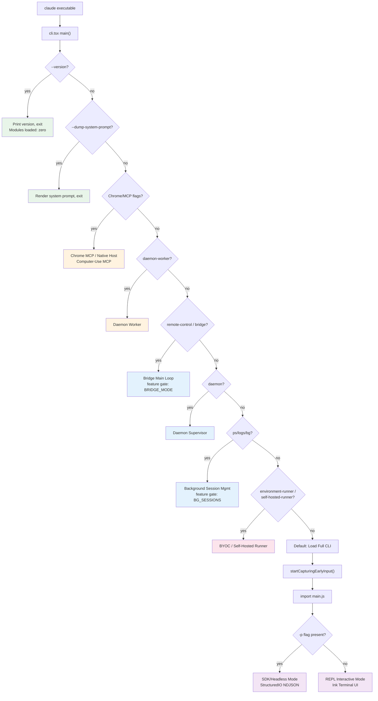
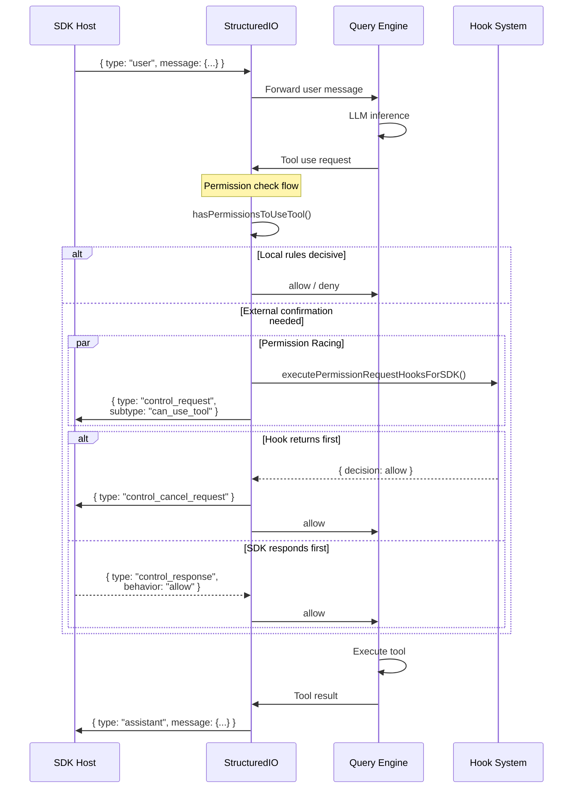

# Chapter 23: CLI Architecture and Multi-Mode Entry

> How does a 302-line entry file decompose a 513K-line TypeScript codebase into 10 independent runtime modes? Claude Code's `cli.tsx` implements a priority-driven fast-path dispatch mechanism: before loading any core module, it routes requests through successive checks of CLI flags and environment variables to execution paths ranging from zero-overhead `--version` to the full REPL. Combined with the Bun bundler's `feature()` compile-time macro enabling dead code elimination across 30+ feature gates, and a 5,594-line `print.ts` orchestration layer managing message queues and the NDJSON structured I/O protocol, the entire architecture sustains deployment from developer workstations to cloud containers under minimal cold-start overhead.

---

## 23.1 Entry Point Dispatch: 10 Runtime Modes

Claude Code is not a single interactive terminal tool. It is a polymorphic binary: the same `claude` executable enters entirely different runtime modes based on combinations of CLI arguments and environment variables. The core constraint driving this design is that **each mode should only load the modules it needs**.

### 23.1.1 Mode Overview

| Mode | Entry | I/O Mechanism | Use Case |
|------|-------|---------------|----------|
| **REPL** (interactive) | `claude` (no special flags) | Terminal Ink UI | Developer workstation |
| **SDK / Headless** | `claude -p "prompt"` | stdin/stdout NDJSON | Agent SDK, CI/CD |
| **Server** | `claude --direct-connect-server-url` | WebSocket | Direct-connect server |
| **Remote / CCR** | `CLAUDE_CODE_REMOTE=true` | WebSocket/SSE transport | Cloud-hosted session |
| **Bridge** | `claude remote-control` | Polling + child spawning | Remote Control host |
| **Daemon** | `claude daemon` | IPC + worker spawning | Long-running supervisor |
| **Background** | `claude --bg` / `claude ps` | Detached session registry | Non-blocking tasks |
| **Chrome MCP** | `--claude-in-chrome-mcp` | stdio MCP protocol | Browser integration |
| **BYOC Runner** | `claude environment-runner` | REST API polling | Bring-your-own-compute |
| **Self-Hosted Runner** | `claude self-hosted-runner` | REST API polling | Self-hosted infrastructure |

The dispatch logic for all 10 modes is concentrated in `src/entrypoints/cli.tsx`, a file of just 302 lines.

### 23.1.2 Fast-Path Dispatch Table

The `main()` function implements a priority-ordered dispatch table. Earlier entries load fewer modules and execute faster:

| Priority | Condition | Action | Modules Loaded |
|----------|-----------|--------|----------------|
| 1 | `--version` / `-v` | Print `MACRO.VERSION` and exit | Zero |
| 2 | `--dump-system-prompt` | Render system prompt and exit | config, model, prompts |
| 3 | `--claude-in-chrome-mcp` | Run Chrome MCP server | claudeInChrome/mcpServer |
| 4 | `--chrome-native-host` | Run Chrome native host | claudeInChrome/chromeNativeHost |
| 5 | `--computer-use-mcp` | Run computer-use MCP server | computerUse/mcpServer |
| 6 | `--daemon-worker` | Run daemon worker | daemon/workerRegistry |
| 7 | `remote-control` / `rc` / `bridge` | Bridge main loop | bridge/bridgeMain |
| 8 | `daemon` | Daemon supervisor | daemon/main |
| 9 | `ps` / `logs` / `attach` / `kill` / `--bg` | Background session management | cli/bg |
| 10 | `new` / `list` / `reply` | Template jobs | cli/handlers/templateJobs |
| 11 | `environment-runner` | BYOC runner | environment-runner/main |
| 12 | `self-hosted-runner` | Self-hosted runner | self-hosted-runner/main |
| 13 | `--tmux` + `--worktree` | Tmux worktree execution | utils/worktree |
| 14 | `--update` / `--upgrade` | Rewrite argv to `update` subcommand | (argv rewrite) |
| 15 | `--bare` | Set SIMPLE env variable early | (env var) |
| DEFAULT | None of the above | Load full CLI | Everything |

The critical design decision in this table: **all imports are dynamic**. No top-level `import` statement triggers module evaluation before dispatch:

```typescript
// Priority 7: Bridge mode — bridgeMain loaded only when matched
if (feature('BRIDGE_MODE') && (args[0] === 'remote-control' || args[0] === 'rc')) {
  const { bridgeMain } = await import('../bridge/bridgeMain.js');
  await bridgeMain(args.slice(1));
  return;
}
```

When no fast-path matches, execution falls through to the default path:

```typescript
const { startCapturingEarlyInput } = await import('../utils/earlyInput.js');
startCapturingEarlyInput();  // Start buffering stdin keystrokes
const { main: cliMain } = await import('../main.js');
await cliMain();
```

`startCapturingEarlyInput()` is a critical detail: during the roughly 135ms it takes to load the full CLI's 200+ modules, the user may already be typing. This function begins buffering stdin before module loading starts, ensuring no keystrokes are lost.

### 23.1.3 Multi-Mode Dispatch Flow



### 23.1.4 Environment Preprocessing

Before the dispatch table executes, top-level code in `cli.tsx` performs three critical side-effects:

```typescript
// 1. Disable corepack auto-pinning
process.env.COREPACK_ENABLE_AUTO_PIN = '0';

// 2. Set V8 heap limit for CCR containers (16GB machines capped to 8GB)
if (process.env.CLAUDE_CODE_REMOTE === 'true') {
  process.env.NODE_OPTIONS = existing
    ? `${existing} --max-old-space-size=8192`
    : '--max-old-space-size=8192';
}

// 3. Ablation baseline: feature-gated experiment group config
if (feature('ABLATION_BASELINE') && process.env.CLAUDE_CODE_ABLATION_BASELINE) {
  for (const k of [
    'CLAUDE_CODE_SIMPLE', 'CLAUDE_CODE_DISABLE_THINKING',
    'DISABLE_INTERLEAVED_THINKING', 'DISABLE_COMPACT',
    'DISABLE_AUTO_COMPACT', 'CLAUDE_CODE_DISABLE_AUTO_MEMORY',
    'CLAUDE_CODE_DISABLE_BACKGROUND_TASKS',
  ]) {
    process.env[k] ??= '1';
  }
}
```

The third side-effect is particularly noteworthy: `ABLATION_BASELINE` is a feature gate that is entirely removed in external builds. Its purpose is to provide a "disable all advanced features" baseline configuration for A/B testing.

---

## 23.2 Feature Gates and Dead Code Elimination

### 23.2.1 How the `feature()` Macro Works

```typescript
import { feature } from 'bun:bundle';
```

`feature()` is a compile-time macro provided by the Bun bundler. At build time, it is replaced with a `true` or `false` literal based on the feature flag configuration file. Bun's tree-shaker then eliminates unreachable branches:

```typescript
// Source code
if (feature('BRIDGE_MODE') && args[0] === 'remote-control') {
  const { bridgeMain } = await import('../bridge/bridgeMain.js');
  await bridgeMain(args.slice(1));
  return;
}

// Build output when BRIDGE_MODE=false:
// Entire if-block removed — zero bytes in output
```

This differs fundamentally from runtime feature flags (such as GrowthBook): `feature()` produces **build-time decisions**, and unreachable code along with its transitive dependencies is entirely absent from the artifact.

### 23.2.2 The 30+ Feature Flags

| Flag | Purpose | Scope |
|------|---------|-------|
| `BRIDGE_MODE` | Remote Control / bridge system | Entry dispatch + command filtering |
| `DAEMON` | Long-running daemon supervisor | Entry dispatch |
| `BG_SESSIONS` | Background session management | Entry dispatch |
| `TEMPLATES` | Template job system | Entry dispatch |
| `BYOC_ENVIRONMENT_RUNNER` | BYOC runner | Entry dispatch |
| `SELF_HOSTED_RUNNER` | Self-hosted runner | Entry dispatch |
| `ABLATION_BASELINE` | Experiment L0 ablation | Environment preprocessing |
| `DUMP_SYSTEM_PROMPT` | Internal prompt extraction | Entry dispatch |
| `CHICAGO_MCP` | Computer-use MCP server | Entry dispatch |
| `COORDINATOR_MODE` | Coordinator mode | Main loop |
| `KAIROS` | Assistant mode | Session management |
| `PROACTIVE` | Proactive mode | Session management |
| `TRANSCRIPT_CLASSIFIER` | Auto permission mode | Permission system |
| `BASH_CLASSIFIER` | Bash command classifier | Tool execution |
| `VOICE_MODE` | Voice input mode | Command registration |
| `WORKFLOW_SCRIPTS` | Workflow system | Command registration |
| `MCP_SKILLS` | MCP-based skills | Extension system |
| `FORK_SUBAGENT` | Fork subagent | Agent system |
| `TEAMMEM` | Team memory | Memory system |
| `HISTORY_SNIP` | History snipping | Context management |
| `CCR_REMOTE_SETUP` | Cloud remote setup | CCR initialization |
| `CCR_AUTO_CONNECT` | Auto-connect to CCR | Connection management |
| `ULTRAPLAN` | Ultra plan mode | Planning system |
| `TORCH` | Torch mode | Execution mode |
| `UDS_INBOX` | Unix domain socket inbox | Communication |
| `BUDDY` | Buddy system | Collaboration mode |
| `EXTRACT_MEMORIES` | Memory extraction | Memory system |
| `AGENT_TRIGGERS` | Cron-triggered agents | Scheduling system |
| `EXPERIMENTAL_SKILL_SEARCH` | Skill search index | Search system |
| `KAIROS_GITHUB_WEBHOOKS` | GitHub webhook subscriptions | Event system |

### 23.2.3 The Conditional-Require Pattern

For scenarios where dynamic `import()` cannot be used -- such as modules whose types must be synchronously referenced -- the codebase employs a conditional `require()` pattern:

```typescript
const coordinatorModeModule = feature('COORDINATOR_MODE')
  ? require('./coordinator/coordinatorMode.js') as typeof import('./coordinator/coordinatorMode.js')
  : null;
```

When `COORDINATOR_MODE=false`, the bundler removes the entire `require()` call and all transitive dependencies of the target module from the artifact. The `coordinatorModeModule` reference is guarded by null checks at every consumption site:

```typescript
if (coordinatorModeModule) {
  coordinatorModeModule.enableCoordinator(config);
}
```

This pattern is used extensively throughout the codebase and serves as the bridge between the feature gate system and TypeScript type safety.

---

## 23.3 CLI Main Loop: The print.ts Orchestration Layer

### 23.3.1 File Context

`src/cli/print.ts` is the core orchestration file for the headless/SDK execution path, spanning 5,594 lines. It is the single largest file in the CLI layer, and this size reflects the breadth of its responsibility: it manages not just message input/output but also coordinates permissions, hooks, session state, coordinator mode, cron scheduling, and other cross-cutting concerns.

The primary export:

```typescript
export async function runHeadless(
  inputPrompt: string | AsyncIterable<string>,
  getAppState: () => AppState,
  setAppState: (f: (prev: AppState) => AppState) => void,
  commands: Command[],
  tools: Tools,
  sdkMcpConfigs: Record<string, McpSdkServerConfig>,
  agents: AgentDefinition[],
  options: { /* 30+ configuration options */ },
): Promise<void>
```

### 23.3.2 Message Queue Management

`print.ts` manages command flow through a priority-based message queue:

```typescript
import {
  dequeue, dequeueAllMatching, enqueue, hasCommandsInQueue,
  peek, subscribeToCommandQueue, getCommandsByMaxPriority,
} from 'src/utils/messageQueueManager.js';
```

The queue supports command batching -- consecutive commands of the same type can be merged into a single LLM request:

```typescript
export function canBatchWith(
  head: QueuedCommand,
  next: QueuedCommand | undefined,
): boolean {
  return (
    next !== undefined &&
    next.mode === 'prompt' &&
    next.workload === head.workload &&
    next.isMeta === head.isMeta
  );
}
```

The batching conditions are precise: only when the next command is also in prompt mode, has the same workload type, and shares the same meta property will commands be merged. This ensures requests of different natures are never accidentally combined.

### 23.3.3 Duplicate Message Prevention

In WebSocket reconnection scenarios, the server may retransmit messages that have already been processed. `print.ts` prevents duplicate handling through UUID tracking:

```typescript
const MAX_RECEIVED_UUIDS = 10_000;
const receivedMessageUuids = new Set<UUID>();
const receivedMessageUuidsOrder: UUID[] = [];

function trackReceivedMessageUuid(uuid: UUID): boolean {
  if (receivedMessageUuids.has(uuid)) return false;  // duplicate
  receivedMessageUuids.add(uuid);
  receivedMessageUuidsOrder.push(uuid);
  // Evict oldest entries when at capacity
  if (receivedMessageUuidsOrder.length > MAX_RECEIVED_UUIDS) {
    const toEvict = receivedMessageUuidsOrder.splice(0, /* ... */);
    for (const old of toEvict) receivedMessageUuids.delete(old);
  }
  return true;  // new UUID
}
```

The 10,000 capacity limit with FIFO eviction under LRU semantics provides a bounded-memory deduplication strategy.

### 23.3.4 Integration Points

`print.ts` is one of the most heavily-connected modules in the system:

- **`ask()`** from `QueryEngine.js` -- the core LLM query function
- **`StructuredIO` / `RemoteIO`** -- I/O protocol layer
- **`sessionStorage`** -- session persistence
- **`fileHistory`** -- file rewind capability
- **`hookEvents`** -- hook execution triggers
- **`commandLifecycle`** -- command lifecycle notifications
- **`sessionState`** -- session state broadcasting
- **GrowthBook** -- runtime feature flags
- **Coordinator mode, Proactive mode, Cron scheduler** -- all feature-gated integrations

---

## 23.4 Structured I/O Protocol

### 23.4.1 Protocol Overview

`src/cli/structuredIO.ts` (860 lines) implements the NDJSON (Newline-Delimited JSON) protocol for programmatic communication in SDK/headless mode. Each message is a standalone JSON object terminated by `\n`.

### 23.4.2 Message Type System

**Inbound messages (stdin):**

```typescript
type StdinMessage =
  | SDKUserMessage        // { type: 'user', message: { role: 'user', content: ... } }
  | SDKControlRequest     // { type: 'control_request', request_id, request: { subtype } }
  | SDKControlResponse    // { type: 'control_response', response: { request_id, ... } }
  | { type: 'keep_alive' }
  | { type: 'update_environment_variables', variables: Record<string, string> }
  | { type: 'assistant' }
  | { type: 'system' }
```

**Control request/response protocol:**

The permission system uses a structured request-response protocol:

```typescript
// Outbound: CLI asks SDK host for permission
{
  type: 'control_request',
  request_id: 'uuid-1',
  request: {
    subtype: 'can_use_tool',
    tool_name: 'Bash',
    input: { command: 'rm -rf /tmp/test' },
    tool_use_id: 'uuid-2',
    permission_suggestions: [...]
  }
}

// Inbound: SDK host responds
{
  type: 'control_response',
  response: {
    subtype: 'success',
    request_id: 'uuid-1',
    response: { behavior: 'allow', updatedInput: {...} }
  }
}

// Cancellation (when hook or bridge resolves first)
{ type: 'control_cancel_request', request_id: 'uuid-1' }
```

### 23.4.3 The StructuredIO Class Interface

```typescript
export class StructuredIO {
  readonly structuredInput: AsyncGenerator<StdinMessage | SDKMessage>;
  readonly outbound = new Stream<StdoutMessage>();

  constructor(input: AsyncIterable<string>, replayUserMessages?: boolean);
  async write(message: StdoutMessage): Promise<void>;
  prependUserMessage(content: string): void;
  getPendingPermissionRequests(): SDKControlRequest[];
  injectControlResponse(response: SDKControlResponse): void;
  createCanUseTool(onPermissionPrompt?): CanUseToolFn;
  createHookCallback(callbackId: string, timeout?: number): HookCallback;
  async handleElicitation(...): Promise<ElicitResult>;
  createSandboxAskCallback(): (hostPattern) => Promise<boolean>;
  async sendMcpMessage(serverName, message): Promise<JSONRPCMessage>;
}
```

### 23.4.4 Permission Racing

Permission decisions involve a race between multiple sources -- this is the most sophisticated element of the entire Structured I/O protocol:

```typescript
createCanUseTool(onPermissionPrompt?): CanUseToolFn {
  return async (tool, input, toolUseContext, assistantMessage, toolUseID) => {
    // Step 1: Check local permission rules
    const mainResult = await hasPermissionsToUseTool(/*...*/);
    if (mainResult.behavior === 'allow' || mainResult.behavior === 'deny') {
      return mainResult;  // Local rules decisive, no external confirmation needed
    }

    // Step 2: Race hook against SDK host
    const hookPromise = executePermissionRequestHooksForSDK(/*...*/)
      .then(decision => ({ source: 'hook', decision }));
    const sdkPromise = this.sendRequest<PermissionToolOutput>(/*...*/)
      .then(result => ({ source: 'sdk', result }));

    const winner = await Promise.race([hookPromise, sdkPromise]);

    if (winner.source === 'hook' && winner.decision) {
      sdkPromise.catch(() => {});  // suppress AbortError
      hookAbortController.abort();
      return winner.decision;
    }
    // ... SDK wins or hook passes through
  };
}
```

The implication of this racing pattern is that hooks can "pre-empt" permission decisions before the SDK host responds. This is critical for CI/CD scenarios that require fast automated approvals.

### 23.4.5 Complete Structured I/O Flow



### 23.4.6 Duplicate Response Protection

`StructuredIO` tracks resolved `tool_use_id` values to prevent duplicate responses during WebSocket reconnection:

```typescript
private readonly resolvedToolUseIds = new Set<string>();
private readonly MAX_RESOLVED_TOOL_USE_IDS = 1000;
```

When a `control_response` arrives and its corresponding `tool_use_id` is already in `resolvedToolUseIds`, the orphan handler ignores it. Combined with `print.ts`'s message UUID deduplication, the system provides idempotency guarantees at two distinct layers.

---

## 23.5 Command System

### 23.5.1 Command Types

The command system is defined in `src/commands.ts` (754 lines) and supports three command types:

```typescript
type Command =
  | PromptCommand    // Expands to text sent to the model (e.g., skills)
  | LocalCommand     // Runs locally, returns text result
  | LocalJSXCommand  // Runs locally, renders Ink UI
```

### 23.5.2 Three-Tier Registration

**Static built-in commands** -- 60+ commands that are always available:

```typescript
const COMMANDS = memoize((): Command[] => [
  addDir, advisor, agents, branch, btw, chrome, clear, color,
  compact, config, copy, desktop, context, cost, diff, doctor,
  effort, exit, fast, files, help, ide, init, keybindings,
  // ... 60+ commands
]);
```

**Feature-gated commands** -- DCE'd from external builds:

```typescript
const bridge = feature('BRIDGE_MODE')
  ? require('./commands/bridge/index.js').default : null;
const voiceCommand = feature('VOICE_MODE')
  ? require('./commands/voice/index.js').default : null;
```

**Dynamic commands** -- loaded from disk and the plugin system:

```typescript
const loadAllCommands = memoize(async (cwd: string): Promise<Command[]> => {
  const [
    { skillDirCommands, pluginSkills, bundledSkills, builtinPluginSkills },
    pluginCommands,
    workflowCommands,
  ] = await Promise.all([
    getSkills(cwd),
    getPluginCommands(),
    getWorkflowCommands ? getWorkflowCommands(cwd) : Promise.resolve([]),
  ]);
  return [
    ...bundledSkills, ...builtinPluginSkills, ...skillDirCommands,
    ...workflowCommands, ...pluginCommands, ...pluginSkills, ...COMMANDS(),
  ];
});
```

Note the loading order: bundled skills take highest priority, built-in commands lowest. This allows skills to override same-named built-in commands.

### 23.5.3 Availability Filtering

Commands are filtered by authentication context:

```typescript
export function meetsAvailabilityRequirement(cmd: Command): boolean {
  if (!cmd.availability) return true;
  for (const a of cmd.availability) {
    switch (a) {
      case 'claude-ai':
        if (isClaudeAISubscriber()) return true;
        break;
      case 'console':
        if (!isClaudeAISubscriber() && !isUsing3PServices()
            && isFirstPartyAnthropicBaseUrl()) return true;
        break;
    }
  }
  return false;
}
```

### 23.5.4 Remote and Bridge Safety Filtering

In remote and bridge modes, the command set is strictly constrained:

```typescript
// Commands safe in --remote mode (TUI-only, no local execution)
export const REMOTE_SAFE_COMMANDS: Set<Command> = new Set([
  session, exit, clear, help, theme, color, vim, cost, usage, copy, btw, ...
]);

// Commands safe for bridge execution (text output, no terminal-specific effects)
export const BRIDGE_SAFE_COMMANDS: Set<Command> = new Set([
  compact, clear, cost, summary, releaseNotes, files,
]);

export function isBridgeSafeCommand(cmd: Command): boolean {
  if (cmd.type === 'local-jsx') return false;   // Ink UI — always blocked
  if (cmd.type === 'prompt') return true;        // Skills — always safe
  return BRIDGE_SAFE_COMMANDS.has(cmd);           // Local commands — explicit allowlist
}
```

The logic is clean: `local-jsx` commands depend on terminal rendering and cannot function in the bridge's text-only channel; `prompt` commands only generate text to send to the model and are inherently safe; `local` commands require individual review before allowlisting.

### 23.5.5 Internal-Only Commands

A subset of commands is restricted to Anthropic internal users:

```typescript
export const INTERNAL_ONLY_COMMANDS = [
  backfillSessions, breakCache, bughunter, commit, commitPushPr,
  ctx_viz, goodClaude, issue, initVerifiers, mockLimits, bridgeKick,
  version, teleport, antTrace, perfIssue, env, oauthRefresh, debugToolCall,
  // ... gated by process.env.USER_TYPE === 'ant'
];
```

---

## 23.6 Fast-Path Optimizations

### 23.6.1 Zero-Overhead Paths

The first two entries in the dispatch table represent the ultimate cold-start optimization:

**`--version`**: Loads zero modules, directly reads the build-time inlined `MACRO.VERSION` constant, and exits. The execution time of this path is essentially equal to the Node.js/Bun runtime startup time.

**`--dump-system-prompt`**: Loads only the config, model, and prompts module trees. Compared to the full CLI's 200+ modules, this path saves over 90% of module evaluation overhead.

### 23.6.2 Initialization Parallelism

When entering the default full-CLI path, `main.tsx` uses three top-level side-effects to overlap I/O with module imports:

```typescript
profileCheckpoint('main_tsx_entry');
startMdmRawRead();         // Parallel MDM subprocess read (~135ms)
startKeychainPrefetch();   // Prefetch macOS keychain (~65ms)
```

These I/O operations execute concurrently with the subsequent 200+ module imports (approximately 135ms). This means that by the time module loading completes, MDM data and keychain tokens are likely already available.

### 23.6.3 The Memoized init() Strategy

The `init()` function in `src/entrypoints/init.ts` is memoized -- it executes exactly once regardless of how many times it is called. This allows multiple entry paths to safely call `init()` without risk of repeated initialization:

```typescript
export const init = memoize(async (): Promise<void> => {
  enableConfigs();
  applySafeConfigEnvironmentVariables();
  applyExtraCACertsFromConfig();  // Must precede any TLS (Bun caches TLS at boot)
  setupGracefulShutdown();
  // ... 8 initialization phases
});
```

The eight phases execute in strict order: configuration, shutdown handling, analytics, authentication, networking, CCR proxy, platform-specific, and scratchpad. Notably, `applyExtraCACertsFromConfig()` must run before any TLS connection because Bun caches TLS configuration at boot time.

### 23.6.4 Deferred Prefetches

After the first render completes, the system launches non-critical prefetches:

```typescript
export function startDeferredPrefetches(): void {
  if (isEnvTruthy(process.env.CLAUDE_CODE_EXIT_AFTER_FIRST_RENDER)
      || isBareMode()) {
    return;  // Skip for benchmarks and scripted -p calls
  }
  // initUser, getUserContext, tips, countFiles, modelCapabilities, ...
}
```

The `CLAUDE_CODE_EXIT_AFTER_FIRST_RENDER` flag reveals this function's sensitivity to startup performance measurement: prefetches are entirely skipped in benchmark mode to ensure measurement data remains uncontaminated.

---

## 23.7 Architectural Insights

### 23.7.1 The Cost and Benefit of Layered Isolation

The design choice to serve 10 runtime modes from a single binary is not without cost. The dispatch table in `cli.tsx` must grow linearly with each new mode, and the volume of feature gates (30+) increases build matrix complexity. But the benefits are substantial:

- **Single installation**: Users need only `npm install -g @anthropic/claude-code` and all modes work out of the box.
- **Shared infrastructure**: Cross-cutting concerns like authentication, configuration, and telemetry need be implemented only once.
- **Precise trimming**: External user builds contain zero bytes of internal-only feature code.

### 23.7.2 Structured I/O as Universal Interface

The choice of NDJSON is deliberate. It is lighter than gRPC (no schema compilation required), better suited for streaming than REST (each message is self-contained), and more appropriate for a fixed protocol than GraphQL (message types are predefined). The fact that `StructuredIO` serves both SDK mode and Remote mode (`RemoteIO` inherits from `StructuredIO`) demonstrates that this abstraction has withstood the test of real-world usage.

### 23.7.3 The Philosophy of Permission Racing

The permission racing mechanism -- hooks competing against the SDK host -- reflects a design philosophy: **permission decisions should complete as fast as possible**. In CI/CD pipelines, a hook can render a decision based on local rules within milliseconds, without waiting for the network round-trip to a remote SDK host. Meanwhile, the cancellation mechanism (`control_cancel_request`) ensures the winning decision does not conflict with a late-arriving response.

This design is unusual in distributed systems: most systems designate a single authoritative permission source. Claude Code's racing pattern is essentially an optimistic concurrency strategy, trading a modest increase in implementation complexity for low-latency permission decisions.

### 23.7.4 The 5,594-Line print.ts

The sheer size of `print.ts` is worth examining. It is not inherently indivisible -- the message queue, duplicate detection, permission coordination, and session management are logically orthogonal concerns. But in practice, these concerns share substantial state (`AppState`, queues, UUID sets), and decomposition would introduce significant inter-module communication overhead. This is a classic "modularity ideals vs. runtime efficiency" tradeoff, and the Claude Code team chose the latter.
