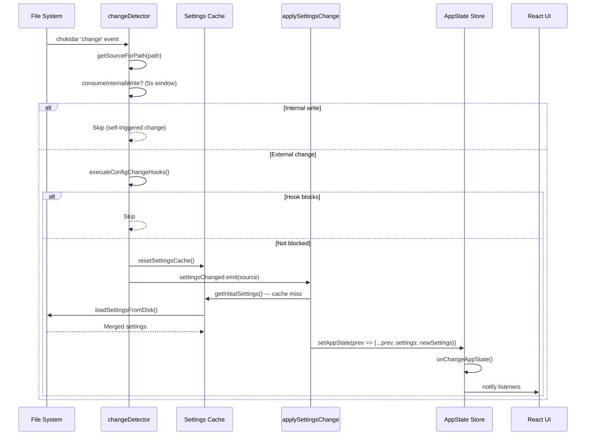

# Chapter 24: Configuration System — Multi-Source Merge, Hot Reload, and Migration

> Claude Code's configuration system is far more than a simple "read a JSON file" operation. It is a five-layer priority merge engine supporting the full spectrum of configuration sources from personal user preferences to enterprise MDM policies; a chokidar-based hot reload pipeline achieving precise change detection through a 1-second stability threshold, 5-second internal write suppression, and 1.5-second deletion grace period; a version-gated migration framework ensuring smooth cross-version upgrades through 11 idempotent migration files; and a keybinding system spanning 18 contexts with roughly 80 actions, supporting chord sequences and live hot reload. This chapter dissects every mechanism in this configuration infrastructure, layer by layer.

---

## 24.1 Settings Source Hierarchy

### 24.1.1 The Five-Layer Priority Model

Claude Code's configuration merge follows a strict priority hierarchy. **Priority from lowest to highest:**

| Priority | Source | File Path | Editable | Purpose |
|----------|--------|-----------|----------|---------|
| 0 (lowest) | Plugin Settings | Plugin-provided defaults | No | Base configuration layer injected by plugins |
| 1 | User Settings | `~/.claude/settings.json` | Yes | Global user preferences |
| 2 | Project Settings | `<cwd>/.claude/settings.json` | Yes | Shared project-level config (committed to git) |
| 3 | Local Settings | `<cwd>/.claude/settings.local.json` | Yes | Local project overrides (gitignored) |
| 4 | Flag Settings | `--settings` CLI flag + SDK inline | No | Runtime parameter overrides |
| 5 (highest) | Policy Settings | Platform-dependent managed path | No | Enterprise policy enforcement |

The design philosophy behind this hierarchy: **personal preferences form the baseline, project configuration is the collaboration layer, local overrides are the developer's escape hatch, and enterprise policy holds the final, non-overridable authority.**

The code defining this hierarchy is concise:

```typescript
export const SETTING_SOURCES = [
  'userSettings',      // ~/.claude/settings.json
  'projectSettings',   // .claude/settings.json
  'localSettings',     // .claude/settings.local.json
  'flagSettings',      // --settings CLI flag
  'policySettings',    // Managed settings (enterprise)
] as const
```

Only three sources are editable:

```typescript
export type EditableSettingSource = Exclude<
  SettingSource,
  'policySettings' | 'flagSettings'
>
// = 'userSettings' | 'projectSettings' | 'localSettings'
```

### 24.1.2 The Policy Settings Sub-Hierarchy

Policy Settings carry their own four-level internal priority, following **first-wins** semantics -- the first source that provides a value wins:

1. **Remote** (API-fetched managed settings) -- highest priority
2. **HKLM/plist** (Windows registry HKLM or macOS plist, admin-only)
3. **managed-settings.json + managed-settings.d/*.json** (filesystem, admin-owned)
4. **HKCU** (Windows registry HKCU, user-writable) -- lowest priority

The elegance of this sub-hierarchy lies in its operational flexibility: Remote policies allow IT teams to push configuration changes via API in real time, without waiting for MDM tool deployment cycles; the HKLM/HKCU separation lets administrators set baseline policies while granting users limited adjustment room; and the `managed-settings.d/` drop-in directory pattern lets multiple MDM configuration files coexist without conflict.

### 24.1.3 Source Filtering

The `--setting-sources` CLI flag can restrict which sources are loaded. However, Policy and Flag sources are always included:

```typescript
export function getEnabledSettingSources(): SettingSource[] {
  const allowed = getAllowedSettingSources()
  const result = new Set<SettingSource>(allowed)
  result.add('policySettings')   // Policy cannot be disabled
  result.add('flagSettings')     // Runtime flags cannot be disabled
  return Array.from(result)
}
```

```mermaid
graph BT
    A[Plugin Settings Base] -->|lowest priority| B[Merged Settings]
    C["User Settings<br/>~/.claude/settings.json"] -->|override| B
    D["Project Settings<br/>.claude/settings.json"] -->|override| B
    E["Local Settings<br/>.claude/settings.local.json"] -->|override| B
    F["Flag Settings<br/>--settings CLI flag + SDK inline"] -->|override| B
    G[Policy Settings] -->|highest priority override| B

    subgraph Policy Sub-Hierarchy — first-wins
        G1[Remote API] -->|first-wins| G
        G2["HKLM/plist (MDM)"] -->|fallback| G
        G3["managed-settings.json<br/>+ managed-settings.d/*.json"] -->|fallback| G
        G4[HKCU Registry] -->|last resort| G
    end

    B --> H[AppState.settings]
```

---

## 24.2 SettingsJson Schema: A Complete Field Catalog Across 15+ Categories

### 24.2.1 Schema Design

The SettingsJson schema is defined using Zod v4 with lazy evaluation (`lazySchema()`). All fields are optional. The outer object uses `.passthrough()` to preserve unknown fields during validation -- meaning an older version of Claude Code will not discard new configuration keys it does not recognize after an upgrade.

### 24.2.2 Fields by Category

The following lists key fields across 15+ logical categories.

**Authentication**

| Field | Type | Purpose |
|-------|------|---------|
| `apiKeyHelper` | `string?` | Path to external script that outputs auth credentials |
| `awsCredentialExport` | `string?` | AWS credential export script path |
| `gcpAuthRefresh` | `string?` | GCP auth refresh command |
| `xaaIdp` | `{issuer, clientId, callbackPort?}?` | XAA identity provider configuration |

**Model Configuration**

| Field | Type | Purpose |
|-------|------|---------|
| `model` | `string?` | Override default model |
| `availableModels` | `string[]?` | Enterprise model allowlist |
| `modelOverrides` | `Record<string, string>?` | Model ID mapping (e.g., Bedrock ARNs) |

**Permissions**

| Field | Type | Purpose |
|-------|------|---------|
| `permissions.allow` | `PermissionRule[]?` | Allowed operation rules |
| `permissions.deny` | `PermissionRule[]?` | Denied operation rules |
| `permissions.ask` | `PermissionRule[]?` | Always-prompt operations |
| `permissions.defaultMode` | `PermissionMode?` | Default permission mode |
| `permissions.disableBypassPermissionsMode` | `'disable'?` | Disable bypass mode |
| `permissions.additionalDirectories` | `string[]?` | Extra directories in scope |

**Hooks**

| Field | Type | Purpose |
|-------|------|---------|
| `hooks` | `HooksSettings?` | Custom event hooks |
| `disableAllHooks` | `boolean?` | Globally disable hooks |
| `allowManagedHooksOnly` | `boolean?` | Only run managed hooks |
| `allowedHttpHookUrls` | `string[]?` | HTTP hook URL allowlist |

**MCP Configuration**

| Field | Type | Purpose |
|-------|------|---------|
| `enableAllProjectMcpServers` | `boolean?` | Auto-approve all project MCP servers |
| `allowedMcpServers` | `AllowedMcpServerEntry[]?` | Enterprise MCP allowlist |
| `deniedMcpServers` | `DeniedMcpServerEntry[]?` | Enterprise MCP denylist |
| `allowManagedMcpServersOnly` | `boolean?` | Only read MCP allowlist from managed settings |

**Plugin System**

| Field | Type | Purpose |
|-------|------|---------|
| `enabledPlugins` | `Record<string, boolean \| string[]>?` | Plugin activation map |
| `strictKnownMarketplaces` | `MarketplaceSource[]?` | Enterprise marketplace allowlist |
| `strictPluginOnlyCustomization` | `boolean \| CustomizationSurface[]?` | Force plugins-only customization |

**Display / UX**

| Field | Type | Purpose |
|-------|------|---------|
| `outputStyle` | `string?` | Assistant response style |
| `language` | `string?` | Preferred response language |
| `syntaxHighlightingDisabled` | `boolean?` | Disable syntax highlighting |
| `spinnerVerbs` | `{mode, verbs}?` | Custom spinner verbs |
| `prefersReducedMotion` | `boolean?` | Reduce animations |

**AI Behavior**

| Field | Type | Purpose |
|-------|------|---------|
| `alwaysThinkingEnabled` | `boolean?` | Force thinking on/off |
| `effortLevel` | `'low' \| 'medium' \| 'high' \| 'max'?` | Model effort level |
| `fastMode` | `boolean?` | Fast mode toggle |
| `promptSuggestionEnabled` | `boolean?` | Enable prompt suggestions |

**Environment and Sandbox**

| Field | Type | Purpose |
|-------|------|---------|
| `env` | `Record<string, string>?` | Injected environment variables |
| `sandbox` | `SandboxSettings?` | Sandbox configuration |
| `defaultShell` | `'bash' \| 'powershell'?` | Default shell |

**Session Management**

| Field | Type | Purpose |
|-------|------|---------|
| `cleanupPeriodDays` | `number?` | Transcript retention period |
| `plansDirectory` | `string?` | Custom plans directory |

**Enterprise**

| Field | Type | Purpose |
|-------|------|---------|
| `forceLoginMethod` | `'claudeai' \| 'console'?` | Force login method |
| `otelHeadersHelper` | `string?` | OTEL headers script path |
| `allowManagedPermissionRulesOnly` | `boolean?` | Only respect managed permission rules |
| `companyAnnouncements` | `string[]?` | Startup announcements |

**Attribution**

| Field | Type | Purpose |
|-------|------|---------|
| `attribution.commit` | `string?` | Git commit attribution text |
| `attribution.pr` | `string?` | PR attribution text |

**Memory**

| Field | Type | Purpose |
|-------|------|---------|
| `autoMemoryEnabled` | `boolean?` | Enable auto-memory |
| `autoMemoryDirectory` | `string?` | Custom memory directory |
| `autoDreamEnabled` | `boolean?` | Enable background memory consolidation |

**Channels**

| Field | Type | Purpose |
|-------|------|---------|
| `channelsEnabled` | `boolean?` | Enable channel notifications |
| `allowedChannelPlugins` | `{marketplace, plugin}[]?` | Channel plugin allowlist |

---

## 24.3 The Multi-Source Merge Engine

### 24.3.1 The Merge Pipeline

`loadSettingsFromDisk()` implements the complete merge flow:

```
1. Start with Plugin Settings as the lowest-priority base layer
2. For each enabled source in SETTING_SOURCES order:
   a. policySettings: try remote > HKLM > file > HKCU (first-wins)
   b. File-based sources: parseSettingsFile(path) -> Zod validate -> merge
   c. flagSettings: also merge getFlagSettingsInline() (SDK inline config)
3. Arrays: concatenated + deduplicated (settingsMergeCustomizer)
4. Objects: deep-merged via lodash mergeWith
5. Errors: deduplicated by file:path:message key
```

### 24.3.2 The Custom Merge Customizer

The critical distinction in merge strategy lies in the difference between read-time merging and write-time merging:

```typescript
// Read-time merge: arrays concatenate
export function settingsMergeCustomizer(objValue, srcValue): unknown {
  if (Array.isArray(objValue) && Array.isArray(srcValue)) {
    return mergeArrays(objValue, srcValue) // concatenate + deduplicate
  }
  return undefined // fall back to lodash default deep merge
}

// Write-time merge: arrays replace, undefined = deletion
```

This design decision means that for array fields like `permissions.allow`, permission rules from user, project, and policy layers **accumulate** rather than override -- the correct semantics for layered security policies. But when updating configuration, arrays are **wholly replaced** -- preventing unbounded growth from repeated appends.

### 24.3.3 Three-Level Cache Architecture

To avoid triggering a full file-read-and-merge sequence on every configuration access, the system implements three cache levels:

| Cache Level | Function | Granularity |
|-------------|----------|-------------|
| Level 1 | `getCachedParsedFile(path)` | Per-file parse + validation result |
| Level 2 | `getCachedSettingsForSource(source)` | Per-source resolved settings |
| Level 3 | `getSessionSettingsCache()` | Final merged result |

All three cache levels are invalidated atomically by `resetSettingsCache()`, which is called by `changeDetector.fanOut()` -- guaranteeing cache coherence.

### 24.3.4 Public API

```typescript
// Get merged settings (cached)
export function getInitialSettings(): SettingsJson

// Get merged settings + validation errors
export function getSettingsWithErrors(): SettingsWithErrors

// Get per-source breakdown
export function getSettingsWithSources(): SettingsWithSources

// Update a specific source (writes to disk)
export function updateSettingsForSource(
  source: EditableSettingSource,
  settings: SettingsJson
): { error: Error | null }
```

---

## 24.4 Hot Reload: A Precision Change Detection Pipeline

### 24.4.1 chokidar File Watcher Initialization

`changeDetector.ts` manages the entire hot reload pipeline. The initialization sequence:

```
1. Collect all potential settings file paths
2. Deduplicate to parent directory level
3. Check which directories contain at least one existing file
4. Include managed-settings.d/ drop-in directory
5. Start chokidar watcher with:
   - depth: 0 (immediate children only)
   - awaitWriteFinish: { stabilityThreshold: 1000ms, pollInterval: 500ms }
   - ignored: filter to only known settings files + drop-in .json files
6. Start MDM settings poll (30-minute interval)
```

The 1000ms stability threshold in `awaitWriteFinish` is a deliberate choice -- it ensures that editor auto-save behavior (which typically produces multiple writes within a few hundred milliseconds) does not trigger multiple configuration reloads.

### 24.4.2 The Change Detection Flow



### 24.4.3 Internal Write Suppression

When Claude Code itself writes a settings file via `updateSettingsForSource`, it calls `markInternalWrite(path)` to record the write timestamp. The change detector then calls `consumeInternalWrite(path, INTERNAL_WRITE_WINDOW_MS)` to identify and skip self-triggered changes within a **5-second window**.

The rationale behind the 5-second window:
- **Too short** (e.g., 1 second): On high-latency filesystems (such as network-mounted home directories), the self-triggered event may arrive after the window closes.
- **Too long** (e.g., 30 seconds): Would mask genuine external edits that occur within the window.
- **5 seconds**: Covers the vast majority of I/O latency scenarios while maintaining reasonable responsiveness to external changes.

### 24.4.4 Deletion Grace Period

File deletions trigger a grace period mechanism that prevents editors' "delete-then-recreate" save pattern from being misinterpreted as a real deletion:

```
File deleted -> handleDelete(path)
  -> Set timeout for DELETION_GRACE_MS (1500ms + 200ms buffer = 1700ms)
  -> If 'add' or 'change' fires within grace: cancel deletion, treat as change
  -> If grace expires: process as real deletion
```

This mechanism directly addresses the file-save behavior of Vim and Emacs, which delete the original file before writing a new one. Without the grace period, every editor save would cause the configuration to temporarily reset to a state without that source's contributions.

### 24.4.5 MDM Polling

Registry and plist changes cannot be detected through filesystem events, so MDM settings are polled on a **30-minute cycle**:

```
startMdmPoll():
  1. Take initial snapshot: jsonStringify({ mdm, hkcu })
  2. Every 30 minutes:
     a. Refresh MDM settings (re-read registry/plist)
     b. Compare to last snapshot
     c. If changed: update cache, fanOut('policySettings')
```

The 30-minute polling interval reflects the expected frequency of MDM policy changes -- enterprise policies typically change at most a few times per workday, and 30 minutes strikes a reasonable balance between eventual consistency and system resource consumption.

### 24.4.6 fanOut: Centralized Cache Invalidation

`fanOut(source)` is the convergence point of the hot reload pipeline:

```typescript
fanOut(source):
  1. resetSettingsCache()           // Invalidate all three cache levels
  2. settingsChanged.emit(source)   // Notify all subscribers
```

At the React layer, `AppStateProvider` subscribes to this signal via `useSettingsChange(onSettingsChange)`. When the signal fires, `applySettingsChange(source, store.setState)` is called:

```typescript
export function applySettingsChange(
  source: SettingSource,
  setAppState: (f: (prev: AppState) => AppState) => void,
): void {
  const newSettings = getInitialSettings()
  const updatedRules = loadAllPermissionRulesFromDisk()
  updateHooksConfigSnapshot()

  setAppState(prev => ({
    ...prev,
    settings: newSettings,
    toolPermissionContext: syncPermissionRulesFromDisk(
      prev.toolPermissionContext, updatedRules
    ),
    // + bypass permissions check
    // + plan auto mode transition
    // + effort level sync
  }))
}
```

This function simultaneously updates settings, permission rules, and the hooks snapshot -- ensuring all three remain consistent with each other at all times.

---

## 24.5 Migration System: Version-Gated Idempotent Migrations

### 24.5.1 The Migration Pattern

Migrations run synchronously at startup, gated by a version counter:

```typescript
const CURRENT_MIGRATION_VERSION = 11;

function runMigrations(): void {
  if (getGlobalConfig().migrationVersion !== CURRENT_MIGRATION_VERSION) {
    migrateAutoUpdatesToSettings();
    migrateBypassPermissionsAcceptedToSettings();
    migrateEnableAllProjectMcpServersToSettings();
    resetProToOpusDefault();
    migrateSonnet1mToSonnet45();
    migrateLegacyOpusToCurrent();
    migrateSonnet45ToSonnet46();
    migrateOpusToOpus1m();
    migrateReplBridgeEnabledToRemoteControlAtStartup();
    // ... conditional migrations
    saveGlobalConfig(prev => ({
      ...prev,
      migrationVersion: CURRENT_MIGRATION_VERSION,
    }));
  }
}
```

A key design decision: **all migrations run on every version jump**, not just newly added ones. This works because each migration function contains its own precondition checks, making it naturally idempotent -- if the migration conditions are no longer met (because the user has already adjusted the relevant setting manually), the migration silently skips itself.

### 24.5.2 Migration Examples

**Model String Migration (migrateSonnet45ToSonnet46)**

When Claude Sonnet upgrades from 4.5 to 4.6, user settings containing the old model string need updating:

```typescript
export function migrateSonnet45ToSonnet46(): void {
  if (getAPIProvider() !== 'firstParty') return;
  if (!isProSubscriber() && !isMaxSubscriber()
      && !isTeamPremiumSubscriber()) return;

  const model = getSettingsForSource('userSettings')?.model;
  if (model !== 'claude-sonnet-4-5-20250929'
      && model !== 'claude-sonnet-4-5-20250929[1m]') {
    return;
  }

  const has1m = model.endsWith('[1m]');
  updateSettingsForSource('userSettings', {
    model: has1m ? 'sonnet[1m]' : 'sonnet',
  });

  logEvent('tengu_sonnet45_to_46_migration',
    { from_model: model, has_1m: has1m });
}
```

Note the multi-layered guards: first the API provider is checked, then the subscription level, and finally the actual model string. This ensures only users who genuinely need the migration are affected.

**Config Migration (migrateAutoUpdatesToSettings)**

Migrates a legacy globalConfig flag into the SettingsJson `env` field:

```typescript
export function migrateAutoUpdatesToSettings(): void {
  const globalConfig = getGlobalConfig();
  if (globalConfig.autoUpdates !== false
      || globalConfig.autoUpdatesProtectedForNative === true) {
    return;
  }

  const userSettings = getSettingsForSource('userSettings') || {};
  updateSettingsForSource('userSettings', {
    ...userSettings,
    env: { ...userSettings.env, DISABLE_AUTOUPDATER: '1' },
  });

  saveGlobalConfig(current => {
    const { autoUpdates: _, autoUpdatesProtectedForNative: __, ...rest } = current;
    return rest;
  });
}
```

This migration simultaneously "writes to the new location" and "cleans up the old location" -- a clean data migration paradigm.

### 24.5.3 Complete Migration File Inventory

| File | Purpose |
|------|---------|
| `migrateAutoUpdatesToSettings.ts` | Move autoUpdates flag to settings.json env var |
| `migrateBypassPermissionsAcceptedToSettings.ts` | Migrate bypass permissions flag |
| `migrateEnableAllProjectMcpServersToSettings.ts` | Migrate MCP server enablement config |
| `migrateFennecToOpus.ts` | Internal: fennec -> opus string replacement |
| `migrateLegacyOpusToCurrent.ts` | Legacy opus model strings |
| `migrateOpusToOpus1m.ts` | opus -> opus[1m] for Max/Team Premium users |
| `migrateReplBridgeEnabledToRemoteControlAtStartup.ts` | Bridge config rename |
| `migrateSonnet1mToSonnet45.ts` | sonnet[1m] -> explicit sonnet 4.5 |
| `migrateSonnet45ToSonnet46.ts` | sonnet 4.5 -> sonnet alias (4.6) |
| `resetAutoModeOptInForDefaultOffer.ts` | Reset auto mode opt-in state |
| `resetProToOpusDefault.ts` | Reset Pro default model to Opus |

### 24.5.4 Async Migration

One migration runs asynchronously in a fire-and-forget pattern:

```typescript
migrateChangelogFromConfig().catch(() => {
  // Silently ignore -- will retry on next startup
});
```

This design decision signals that the migration involves non-critical data (changelog), and failure should not block startup.

---

## 24.6 Keybinding System: 18 Contexts, ~80 Actions

### 24.6.1 Binding Structure

Keybindings are defined as blocks, each associating a context with a set of key-to-action mappings:

```typescript
export type KeybindingBlock = {
  context: KeybindingContextName
  bindings: Record<string, string | null>
}
```

Setting an action to `null` **unbinds** the key.

### 24.6.2 The 18 Contexts

```typescript
const KEYBINDING_CONTEXTS = [
  'Global', 'Chat', 'Autocomplete', 'Confirmation', 'Help',
  'Transcript', 'HistorySearch', 'Task', 'ThemePicker',
  'Settings', 'Tabs', 'Attachments', 'Footer', 'MessageSelector',
  'DiffDialog', 'ModelPicker', 'Select', 'Plugin',
]
```

Contexts correspond to different modal states of the UI -- in the `Chat` context Enter submits a message, but in the `Confirmation` context it confirms an operation. The same physical key maps to entirely different actions depending on context.

### 24.6.3 ~80 Actions

Action identifiers follow the `category:action` pattern:

```typescript
const KEYBINDING_ACTIONS = [
  'app:interrupt', 'app:exit', 'app:toggleTodos', 'app:toggleTranscript',
  'chat:cancel', 'chat:cycleMode', 'chat:submit', 'chat:undo',
  'autocomplete:accept', 'autocomplete:dismiss',
  'confirm:yes', 'confirm:no',
  // ... roughly 80 total
]
```

Additionally, `command:*` patterns allow binding keyboard shortcuts to slash commands (e.g., `command:help`).

### 24.6.4 Chord Support

Multi-keystroke sequences (chords) use space-separated keystroke strings:

```typescript
export function parseChord(input: string): Chord {
  if (input === ' ') return [parseKeystroke('space')]  // Special case
  return input.trim().split(/\s+/).map(parseKeystroke)
}
```

Example: `"ctrl+x ctrl+k"` is a two-key chord -- press `ctrl+x`, then press `ctrl+k`.

The chord resolution flow:

1. If currently in a chord state (has `pending` keystrokes):
   - Escape cancels the chord
   - Build test chord = `[...pending, currentKeystroke]`
2. Check if the test chord is a **prefix** of any longer binding:
   - If yes (and the longer binding is not null-unbound): enter `chord_started` state
3. Check for **exact match**:
   - If found: return the corresponding action (or `unbound` if null)
4. No match: cancel chord or return `none`

**Null-unbinding shadow effect**: When a user applies a `null` override to a chord binding, that unbinding "shadows" the default it replaces, preventing the chord prefix from entering a wait state. This is an elegant guard against "dangling chord prefixes."

### 24.6.5 Hot Reload

The keybinding file `~/.claude/keybindings.json` has its own independent chokidar hot reload:

```typescript
export async function initializeKeybindingWatcher(): Promise<void> {
  watcher = chokidar.watch(userPath, {
    persistent: true,
    ignoreInitial: true,
    awaitWriteFinish: {
      stabilityThreshold: 500,   // Shorter threshold than settings
      pollInterval: 200,
    },
    ignorePermissionErrors: true,
    usePolling: false,
    atomic: true,
  })
  watcher.on('add', handleChange)
  watcher.on('change', handleChange)
  watcher.on('unlink', handleDelete)
}
```

Note that the keybinding stability threshold is **500ms**, shorter than the 1000ms used for settings -- because keybinding files are typically smaller and faster to write.

The merge strategy is **append-override**:

```typescript
const mergedBindings = [...defaultBindings, ...userParsed]
```

User-defined bindings are appended after defaults; the last definition wins.

### 24.6.6 Validation System

Five validation types ensure keybinding configuration correctness:

| Type | Meaning |
|------|---------|
| `parse_error` | Syntax errors in key patterns |
| `duplicate` | Same key in the same context |
| `reserved` | Reserved shortcuts (ctrl+c, ctrl+d) |
| `invalid_context` | Unknown context name |
| `invalid_action` | Unknown action identifier |

Particularly noteworthy is the `checkDuplicateKeysInJson()` function -- since `JSON.parse` silently uses the last value for duplicate keys, this function scans the raw JSON string to detect duplicates. This is a validation that goes beyond what standard JSON parsing can provide.

---

## 24.7 MDM Support: Enterprise Device Management Integration

### 24.7.1 Windows Registry

On Windows, Claude Code reads policies from two registry paths:

- **HKLM** (`HKEY_LOCAL_MACHINE`): Requires admin privileges to write; represents organization-level policy.
- **HKCU** (`HKEY_CURRENT_USER`): User-writable; represents user-level overrides.

HKLM takes priority over HKCU, ensuring organizational policies cannot be bypassed by users.

### 24.7.2 macOS plist

On macOS, the corresponding mechanism is plist files, typically deployed by MDM tools such as Jamf or Mosyle.

### 24.7.3 Filesystem Policy

The cross-platform universal approach is the `managed-settings.json` file and the `managed-settings.d/` drop-in directory. The drop-in pattern allows multiple MDM tools to each deploy their own configuration files without creating conflicts.

### 24.7.4 Remote Policy

The highest-priority Remote policy is fetched via API and loaded asynchronously during the `init.ts` phase:

```typescript
if (isEligibleForRemoteManagedSettings()) {
  initializeRemoteManagedSettingsLoadingPromise();
}
```

Remote policy loading is asynchronous but awaited before policy values are needed. This design allows policy loading to proceed in parallel with other initialization steps without blocking startup.

---

## 24.8 Architectural Summary: Design Philosophy of the Configuration System

Claude Code's configuration system embodies a philosophy of **cascading determinism**:

1. **Deterministic merge**: Given the same set of configuration files, the merge result is entirely deterministic. No randomness, no timing dependencies.
2. **Progressive override**: From the most general (plugin defaults) to the most specific (enterprise policy), each layer can override any field from the preceding layers.
3. **Secure defaults**: Policy Settings are always active and cannot be disabled via `--setting-sources`. Enterprise policy is a non-bypassable guardrail.
4. **Resilient hot reload**: The triple protection of a 1-second stability threshold, a 5-second internal write window, and a 1.7-second deletion grace period ensures that hot reload is both timely and free from false triggers.
5. **Idempotent migration**: Each migration function embeds its own precondition checks and can safely run repeatedly. Version gating is merely a performance optimization -- fast-pathing the common case where all migrations have already completed.

The complexity of this system reflects a real engineering constraint: a CLI tool serving both individual developers and enterprise organizations must find the balance between "easy to get started" and "enterprise-controllable." Claude Code's answer is **cascading priority** -- simple use cases need only concern themselves with a single `~/.claude/settings.json` file, while enterprise deployments can enforce security policies through Policy Settings without ever touching user files.
