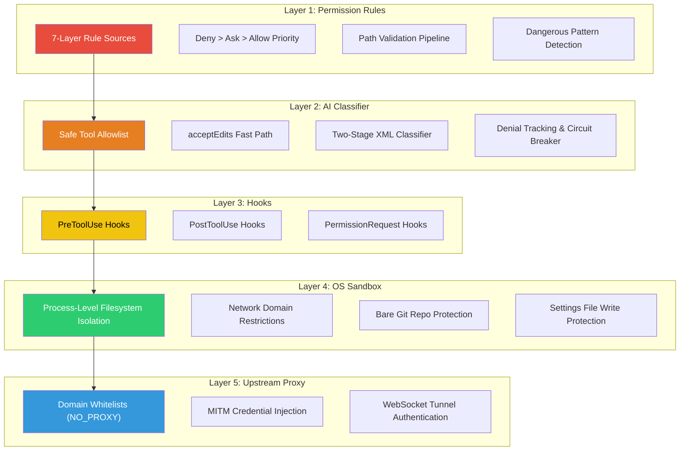
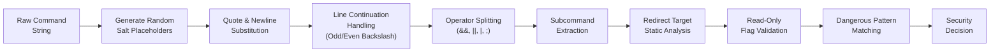
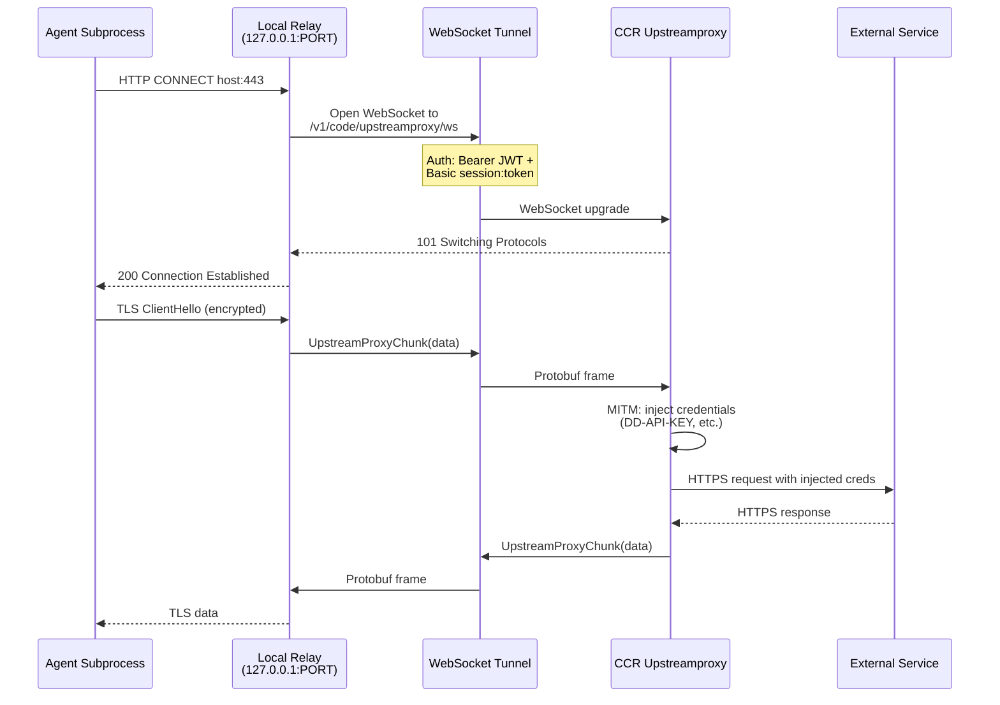
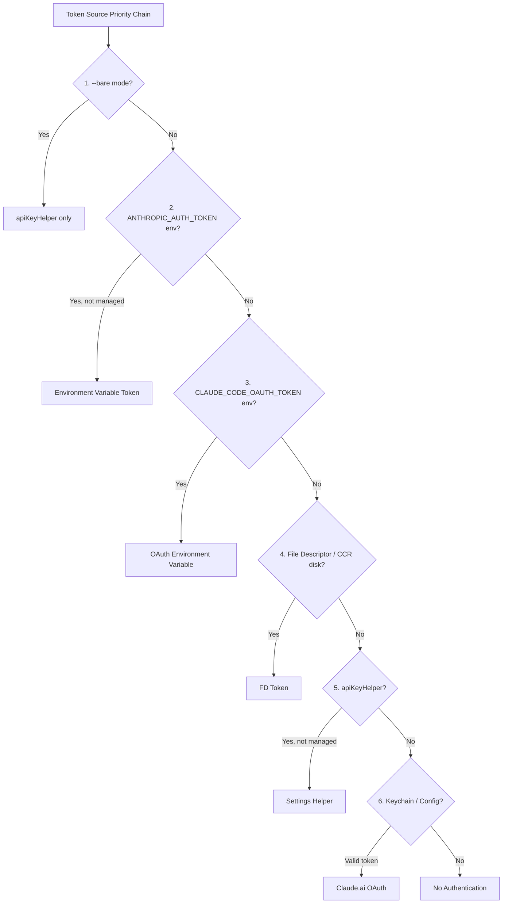
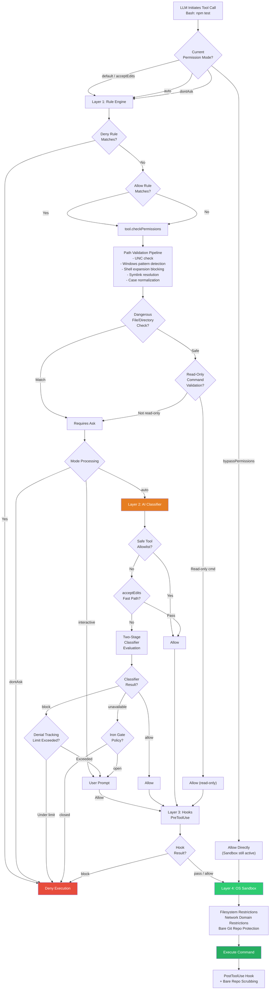

# Chapter 25: Security Model — The Complete Picture

> Claude Code's security is not a single checkpoint but a fortress composed of five layers of defense in depth. From static rule matching in the Permission Rules layer, through dynamic intent analysis by the AI Classifier, to OS-level process isolation in the Sandbox, each layer operates independently and complements the others. Even if one layer is breached, subsequent layers continue to block the attack. This chapter unifies the security mechanisms scattered across Chapters 10 and 15 with new material from the infrastructure layer, presenting the complete picture of Claude Code's security model.

---

## 25.1 The Five Security Layers

Claude Code's security architecture follows the classic **defense-in-depth** principle: no single mechanism is trusted alone. Instead, overlapping checks at every level ensure that a failure in any one layer does not compromise overall security.



**Responsibility boundaries for each layer:**

| Layer | When It Runs | Protection Target | Failure Consequence |
|-------|-------------|-------------------|---------------------|
| Permission Rules | Before tool call, static rule matching | Block known dangerous operations | Defers to Classifier |
| AI Classifier | In auto mode when rules cannot decide | Dynamic intent-based safety evaluation | Fail-closed (deny by default) |
| Hooks | Before and after tool execution | Organization-defined custom policies | Custom policies skipped |
| OS Sandbox | During process execution | Restrict filesystem and network access | Process can access all resources |
| Upstream Proxy | During network requests (CCR only) | Credential injection and domain control | No credential injection; direct external access |

These five layers are not a serial pipeline -- they take effect at different stages independently. Permission Rules and the Classifier make allow/deny decisions before tool execution. The Sandbox enforces OS-level constraints when a Bash command actually runs. The Proxy controls access as network traffic leaves the container. Even if the Classifier erroneously allows a dangerous command, the Sandbox will still prevent it from writing to protected directories.

---

## 25.2 Bash Command Security Deep Dive

The Bash tool is the largest attack surface in Claude Code -- it can execute arbitrary shell commands. The security system analyzes Bash commands with AST-level precision.

### 25.2.1 Command Parsing Pipeline



**Injection-resistant placeholder generation:**

The first step of command parsing replaces quotes and newlines with random-salted placeholders:

```typescript
function generatePlaceholders() {
  const salt = randomBytes(8).toString('hex')
  return {
    SINGLE_QUOTE: `__SINGLE_QUOTE_${salt}__`,
    DOUBLE_QUOTE: `__DOUBLE_QUOTE_${salt}__`,
    NEW_LINE: `__NEW_LINE_${salt}__`,
  }
}
```

Why the random salt? An attacker could craft a command containing the literal string `__SINGLE_QUOTE__` to interfere with parsing. The random salt makes placeholders unpredictable, eliminating this injection vector at its root.

**Line continuation security:**

A backslash followed by a newline in shell means line continuation, but if the backslash itself is escaped (even number of backslashes), the newline is a command separator. The parser counts backslash parity to handle this correctly:

```typescript
// Odd backslashes: last one escapes the newline (line continuation)
// Even backslashes: they pair up, newline is a command separator
const backslashCount = match.length - 1
if (backslashCount % 2 === 1) {
  return '\\'.repeat(backslashCount - 1) // Remove escaping backslash + newline
}
```

This defends against a subtle class of attacks: an attacker constructs `\\<newline>rm -rf /`, and if the parser incorrectly treats `\\` as a line continuation, it misclassifies `rm -rf /` as a continuation of the previous line rather than an independent command.

### 25.2.2 Redirect Target Validation

`isStaticRedirectTarget` rejects all redirect targets containing dynamic content:

| Rejected Pattern | Example | Risk |
|-----------------|---------|------|
| Shell variables | `$HOME`, `${VAR}` | Runtime path injection |
| Command substitution | `` `pwd` `` | Arbitrary command execution |
| Glob patterns | `*`, `?`, `[` | Non-deterministic file targets |
| Brace expansion | `{1,2}` | Multi-target writes |
| Tilde expansion | `~` | User directory probing |
| Process substitution | `>(cmd)`, `<(cmd)` | Implicit command execution |
| History expansion | `!!`, `!-1` | History replay |
| Zsh equals expansion | `=cmd` | Path lookup injection |
| Empty strings | `""` | Resolves to CWD |
| Comment-prefixed | `#file` | Parser differential exploitation |

### 25.2.3 Dangerous Pattern Database

The system maintains a comprehensive database of dangerous shell patterns covering cross-platform code execution entry points:

```typescript
export const CROSS_PLATFORM_CODE_EXEC = [
  // Interpreters
  'python', 'python3', 'python2', 'node', 'deno', 'tsx', 'ruby', 'perl', 'php', 'lua',
  // Package runners
  'npx', 'bunx', 'npm run', 'yarn run', 'pnpm run', 'bun run',
  // Shells
  'bash', 'sh', 'zsh', 'fish',
  // Execution primitives
  'eval', 'exec', 'env', 'xargs', 'sudo',
  // Remote
  'ssh',
]
```

For PowerShell environments, additional detection covers `iex`, `invoke-expression`, `invoke-command`, `start-process`, `add-type`, and other cmdlets, including `.exe` suffix variants.

When a user configures broad allow rules like `Bash(*)` or `python:*` in auto mode, the system automatically **strips** these rules upon entering auto mode, preventing them from bypassing the Classifier's safety evaluation.

---

## 25.3 Filesystem Security Boundaries

### 25.3.1 Path Validation Pipeline

Every file operation (read or write) passes through the unified `validatePath` validation chain:

```
validatePath(path, cwd, context, operationType)
  |
  +-- expandTilde: ~ -> $HOME; ~user BLOCKED
  +-- Block UNC paths (\\server\share, //server/share)
  +-- Block tilde variants (~root, ~+, ~-, ~N) -> TOCTOU risk
  +-- Block shell expansion syntax ($, %, =cmd) -> TOCTOU risk
  +-- Block glob patterns on write operations
  +-- For read globs: validateGlobPattern (check base directory)
  +-- Resolve path (absolutize + symlink resolution)
  +-- isPathAllowed(resolvedPath, context, operationType)
```

### 25.3.2 Windows Path Attack Vectors

`hasSuspiciousWindowsPathPattern` runs on **all platforms** (because NTFS can be mounted on Linux/macOS via ntfs-3g), detecting the following attack patterns:

| Attack Pattern | Example | Risk |
|---------------|---------|------|
| NTFS Alternate Data Streams | `file.txt::$DATA` | Hidden data access |
| 8.3 Short Names | `GIT~1`, `SETTIN~1.JSON` | Bypass string matching |
| Long Path Prefixes | `\\?\C:\...` | Bypass path validation |
| Trailing Dots/Spaces | `.git.`, `.claude ` | Windows strips during resolution |
| DOS Device Names | `.git.CON`, `settings.json.PRN` | Special device access |
| Triple Dots | `.../file.txt` | Path confusion |
| UNC Paths | `\\server\share` | Network credential leak |

### 25.3.3 Dangerous Files and Directories

The system applies additional protections to specific files and directories:

```typescript
// Modifying these files could alter system behavior or leak credentials
export const DANGEROUS_FILES = [
  '.gitconfig', '.gitmodules',
  '.bashrc', '.bash_profile', '.zshrc', '.zprofile', '.profile',
  '.ripgreprc', '.mcp.json', '.claude.json',
]

// Modifying files in these directories could lead to security bypasses
export const DANGEROUS_DIRECTORIES = [
  '.git', '.vscode', '.idea', '.claude',
]
```

Notable exception: `.claude/worktrees/` is explicitly excluded from the `.claude` directory protection because it is a structural path for git worktrees.

### 25.3.4 Symlink Resolution and Case Normalization

Two critical anti-bypass measures:

1. **Symlink resolution**: Both file paths and working directories undergo `realpathSync`, preventing attackers from using symlinks to point to protected files.
2. **Case normalization**: All path comparisons go through `toLowerCase()`, preventing bypasses on case-insensitive filesystems (macOS HFS+/APFS, Windows NTFS) using paths like `.cLauDe/Settings.locaL.json`.

---

## 25.4 Network Security

### 25.4.1 Domain Whitelists

The Sandbox layer extracts domain whitelists from `WebFetch` permission rules:

- Allow rules: `WebFetch(domain:example.com)` allows the domain
- Deny rules: `WebFetch(domain:evil.com)` blocks the domain
- `allowManagedDomainsOnly` mode: only domains declared in organization policies (policySettings) are permitted

### 25.4.2 Upstream Proxy (CCR Environment)

When running inside a Claude Code Remote (CCR) container, the system deploys a full MITM proxy architecture:



**Why WebSocket?** CCR's ingress uses GKE L7 with path-prefix routing, which does not support raw CONNECT. The WebSocket tunnel reuses the existing session-ingress channel pattern.

**The NO_PROXY exclusion list** ensures critical services bypass the proxy:

- Anthropic API (`anthropic.com`, `*.anthropic.com`)
- GitHub (`github.com`, `api.github.com`, `*.githubusercontent.com`)
- Package registries (`registry.npmjs.org`, `pypi.org`, `index.crates.io`, etc.)
- Local addresses (`localhost`, `127.0.0.1`, RFC 1918 private ranges)

---

## 25.5 Credential Security

### 25.5.1 Heap Memory Isolation

The upstream proxy in CCR containers performs a critical memory isolation step during initialization:

```
1. Read session token from /run/ccr/session_token
2. Call prctl(PR_SET_DUMPABLE, 0) -- block same-UID ptrace of heap memory
3. Download upstream proxy CA certificate, concatenate with system CA bundle
4. Start local CONNECT->WebSocket relay
5. Unlink token file -- token exists only in heap memory
6. Expose HTTPS_PROXY / SSL_CERT_FILE env vars to subprocesses
```

**`prctl(PR_SET_DUMPABLE, 0)`** is a Linux-specific security measure: even other processes running as the same user cannot read the token via `/proc/{pid}/mem`.

**Token file unlinking** ensures the token's on-disk lifetime is minimal -- the file is deleted immediately after the relay starts, and the token survives only in the process's heap memory.

### 25.5.2 Authentication Header Separation

The upstream proxy uses two distinct authentication mechanisms:
- **WebSocket upgrade**: Bearer JWT (session-level authentication)
- **CONNECT tunnel**: Basic auth with session ID + token (request-level authentication)

This separation ensures that even if one authentication mechanism is intercepted, it cannot be used for the other purpose.

### 25.5.3 OAuth Token Storage



A critical security decision: in **Managed OAuth Context** (CCR and Claude Desktop), the system skips `ANTHROPIC_AUTH_TOKEN` environment variables and `apiKeyHelper`, preventing the user's terminal API key configuration from overriding the OAuth token.

The **Keychain Prefetch** at startup parallelizes macOS Keychain reads for OAuth and legacy API keys, saving approximately 65ms of sequential wait time.

---

## 25.6 Read-Only Command Validation

### 25.6.1 Git Safe-Flag Maps

The system maintains exhaustive safe-flag maps for over 20 git subcommands:

```typescript
export type ExternalCommandConfig = {
  safeFlags: Record<string, FlagArgType>
  additionalCommandIsDangerousCallback?: (rawCommand: string, args: string[]) => boolean
  respectsDoubleDash?: boolean
}
```

Covered git subcommands include: `diff`, `log`, `show`, `shortlog`, `reflog`, `stash list`, `ls-remote`, `status`, `blame`, `ls-files`, `ls-tree`, `config --get`, `remote`, `remote show`, `merge-base`, `rev-parse`, `rev-list`, `describe`, `cat-file`, and more.

### 25.6.2 Parser Differential Attack Defense

Precise flag argument typing is critical. A real-world example:

> The `-S`, `-G`, and `-O` flags in `git diff` were originally typed as `'none'` (no argument), but git actually treats them as requiring an argument. An attacker could construct: `git diff -S -- --output=/tmp/pwned`. The validator sees `-S` as taking no argument, advances one token, hits `--` and stops checking; `--output` goes unchecked. But git sees `-S` as requiring an argument, consumes `--` as the pickaxe string, and parses `--output=...` as a long option -- resulting in **arbitrary file write**.

The fix: correct these flags' types from `'none'` to `'string'`.

### 25.6.3 Dangerous Subcommand Detection

For commands with write-capable subcommands (like `git reflog`), the system uses callback functions for fine-grained control:

```typescript
// Block 'expire', 'delete', 'exists' subcommands
// Allow: 'show', ref names (HEAD, refs/*, branch names)
additionalCommandIsDangerousCallback: (_rawCommand, args) => {
  const DANGEROUS_SUBCOMMANDS = new Set(['expire', 'delete', 'exists'])
  for (const token of args) {
    if (!token || token.startsWith('-')) continue
    if (DANGEROUS_SUBCOMMANDS.has(token)) return true
    return false
  }
  return false
}
```

The complete flag argument type enumeration:

| Type | Meaning | Example |
|------|---------|---------|
| `'none'` | No argument | `--color` |
| `'number'` | Integer argument | `--context=3` |
| `'string'` | Any string argument | `--relative=path` |
| `'char'` | Single character | delimiter |
| `'{}'` | Literal `{}` only | xargs placeholder |
| `'EOF'` | Literal `EOF` only | heredoc terminator |

---

## 25.7 The 13 Security Invariants

These are the core invariants of Claude Code's security model -- properties the system maintains across all code paths. Any violation is treated as a security vulnerability:

| # | Invariant | Rationale | Layer |
|---|-----------|-----------|-------|
| 1 | **Deny rules always take precedence over allow rules** | Deny rules are checked first in every permission flow, ensuring security policies cannot be overridden by broad allow rules | Rules |
| 2 | **Safety checks run before allow rules on writes** | Prevents accidental grants to protected files -- even with an allow rule, dangerous files like `.gitconfig` still require explicit confirmation | Rules |
| 3 | **Symlink resolution on both paths and working directories** | Prevents bypasses via symlinks pointing to protected files or directories | Filesystem |
| 4 | **Case normalization on all path comparisons** | Prevents bypasses on case-insensitive filesystems (macOS HFS+/APFS, Windows NTFS) | Filesystem |
| 5 | **Random salt in command parsing placeholders** | Prevents attackers from embedding literal placeholder strings in commands to interfere with the parsing pipeline | Bash |
| 6 | **Odd/even backslash counting for line continuations** | Prevents command hiding through backslash escape confusion -- ensures parser and shell agree on line boundaries | Bash |
| 7 | **Precise flag argument type definitions** | Prevents parser differentials between the validator and the actual shell -- a type error can lead to arbitrary file writes | Read-Only |
| 8 | **Classifier defaults to fail-closed** | The `tengu_iron_gate_closed` gate ensures operations are denied rather than allowed when the API is unavailable -- a safe default posture | Classifier |
| 9 | **Dangerous rules stripped on auto mode entry** | Broad rules like `Bash(*)` and `python:*` are temporarily removed, preventing them from bypassing the Classifier's safety evaluation | Rules |
| 10 | **Per-user temp directories with UID** | Format `claude-{uid}` prevents permission conflicts and cross-user file access in multi-user environments | Filesystem |
| 11 | **Per-process random nonce for bundled skills root** | Format `bundled-skills/{VERSION}/{nonce}` prevents symlink pre-creation attacks | Filesystem |
| 12 | **Bare git repo file scrubbing** | Detects and removes `HEAD` + `objects/` + `refs/` combinations, preventing sandbox escape via planted bare repo files | Sandbox |
| 13 | **Settings files always denied for sandbox writes** | All settings.json files across all levels and `.claude/skills/` directories are deny-write, preventing sandbox escape via configuration modification | Sandbox |

---

## 25.8 Defense-in-Depth Architecture Diagram

The following diagram shows the complete security check path for a Bash tool call from initiation to execution:



---

## 25.9 Design Philosophy of the Security Model

### 25.9.1 Static and Dynamic Complementarity

Permission Rules form the **static** defense -- making deterministic judgments based on known patterns and paths. The AI Classifier forms the **dynamic** defense -- understanding the context and intent of operations to make probabilistic judgments. The two complement each other:

- Static rules handle known dangerous patterns (`rm -rf /`, writing `.gitconfig`) at microsecond speed
- The dynamic Classifier handles novel attack scenarios (indirect attacks leveraging legitimate tool chains) at the cost of latency

### 25.9.2 The Fail-Closed Principle

The system chooses denial over allowance when uncertain:

- Classifier API unavailable: deny by default (`tengu_iron_gate_closed`)
- Flag type uncertain: treat as dangerous
- Path contains dynamic content: refuse to resolve
- Consecutive denials exceed threshold: fall back to human review

### 25.9.3 Least Privilege Evolution

Auto mode's permissions are not "bypass all" but carefully trimmed:

1. All dangerous broad rules are stripped upon entering auto mode
2. The safe tool allowlist contains only genuinely read-only tools
3. The acceptEdits fast path excludes Agent and REPL tools (their `checkPermissions` returns allow in acceptEdits mode, which would silently bypass the Classifier)
4. Denial tracking ensures the Classifier does not deny indefinitely -- beyond a threshold, it falls back to human judgment

### 25.9.4 Cross-Platform Consistency

Security checks make no assumptions about the current platform:

- Windows path pattern detection runs on **all** platforms (NTFS can be mounted on Linux/macOS via ntfs-3g)
- UNC path detection covers both `\\` and `//` formats
- PowerShell dangerous patterns include `.exe` suffix variants
- Case normalization is applied consistently across all platforms

---

## 25.10 Chapter Summary

Claude Code's security model is not a single checkpoint but a five-layer defense-in-depth system underpinned by 13 invariants. From the Permission Rules layer's static pattern matching, through the AI Classifier's dynamic intent analysis, to the OS Sandbox's process-level isolation, each layer operates independently and complements the others.

The core design philosophy of this architecture is: **never rely on a single mechanism**. Even if the Classifier is deceived, even if rules are misconfigured, the Sandbox will still block access to protected resources. Even if the Sandbox is bypassed, the settings file write protection and bare git repo scrubbing will still prevent persistent security escapes.

For engineers building similar AI agent security systems, Claude Code's security model offers a critical insight: **security is not a boolean switch but a multi-layered probability function -- each additional layer causes the probability of a successful attack to drop exponentially.**
