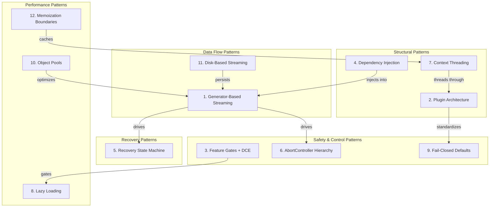
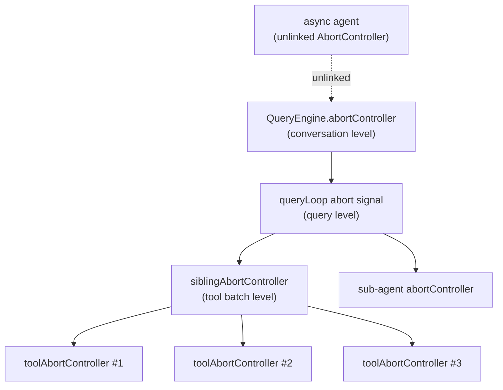

# Chapter 26: Design Patterns Catalog

> This chapter is a reference manual. The preceding chapters dissected Claude Code by subsystem; this chapter takes a cross-cutting view, extracting 12 recurring design patterns from the 513K-line TypeScript codebase. Every pattern follows a uniform structure: **Problem, Solution, Where Used, Code Example, Trade-offs.**

---

## Pattern Map



---

## 1. Generator-Based Streaming

### Problem

A single LLM interaction turn can produce dozens of messages -- API stream events, assistant responses, tool_use requests, tool_result blocks, progress updates, and attachments. Buffering all of these into a batch before returning creates perceptible latency in the UI. Pushing them through callbacks creates state management complexity and callback nesting.

### Solution

The entire query pipeline is built on `AsyncGenerator`. `queryLoop()` is an `async function*` that `yield`s messages one at a time. `QueryEngine.submitMessage()` is also an `async function*` that consumes `queryLoop`'s output and re-dispatches it. The outermost `ask()` wrapper follows the same convention. Consumers use `for await...of` to receive messages incrementally, with backpressure managed automatically by the JavaScript generator protocol.

### Where Used

- `query()` / `queryLoop()` -- the core agentic loop
- `QueryEngine.submitMessage()` -- per-turn entry point
- `runAgent()` -- sub-agent execution
- `runTools()` / `runToolsConcurrently()` -- tool orchestration
- `streamedCheckPermissionsAndCallTool()` -- stream adapter for individual tool execution

### Code Example

```typescript
// Simplified signature of queryLoop
async function* queryLoop(
  params: QueryParams,
  consumedCommandUuids: string[],
): AsyncGenerator<
  StreamEvent | Message | TombstoneMessage | ToolUseSummaryMessage,
  Terminal
> {
  while (true) {
    // Phase 3: API streaming
    for await (const message of deps.callModel({...})) {
      yield message;  // propagate upstream one at a time
    }
    // Phase 6: tool execution
    for await (const update of runTools(toolUseBlocks, ...)) {
      yield update.message;
    }
    // Assemble next State, continue
  }
}
```

### Trade-offs

**Advantages**: Backpressure comes for free from the generator protocol. Lifecycle management is clean -- `return()` and `throw()` propagate through the generator chain, and `finally` blocks handle cleanup. Composition is simple: generators can delegate to sub-generators via `yield*`.

**Costs**: Debug stack traces grow longer (each generator layer adds a frame). Error boundaries require explicit `try/catch` at each level. The semantics of `.return()` on an in-flight generator can cause subtle resource cleanup issues if `finally` blocks are missing.

---

## 2. Plugin Architecture

### Problem

The system must simultaneously support built-in tools, MCP tools, user-defined agents, slash commands, and task types. If each extension point uses a different registration and invocation mechanism, the core code becomes riddled with type-specific branches.

### Solution

Uniform interface plus registry pattern. The Tool system exemplifies this: every tool -- whether the built-in `BashTool` or a remote MCP tool -- must implement the `Tool<Input, Output, Progress>` interface (approximately 40 methods and properties). `getAllBaseTools()` serves as the single source of truth, returning the complete tool list. `assembleToolPool()` merges built-in and MCP tools, sorting each partition by name to maintain prompt cache stability.

The same pattern appears in the Agent system (`AgentDefinition` union type + `getActiveAgentsFromList()`), the Task system (`Task` interface + `getAllTasks()`), and the Command system.

### Code Example

```typescript
// Core constraints of the Tool interface (simplified)
export type Tool<I, O, P> = {
  readonly name: string
  readonly inputSchema: I
  call(args: z.infer<I>, context: ToolUseContext, ...): Promise<ToolResult<O>>
  checkPermissions(input: z.infer<I>, ctx: ToolUseContext): Promise<PermissionResult>
  isEnabled(): boolean
  isConcurrencySafe(input: z.infer<I>): boolean
  isReadOnly(input: z.infer<I>): boolean
  // ... 30+ additional methods
}

// The master registry
export function getAllBaseTools(): Tools {
  return [
    AgentTool, BashTool, FileReadTool, FileEditTool,
    ...(isToolSearchEnabledOptimistic() ? [ToolSearchTool] : []),
    // ... feature-gated tools
  ]
}

// Pool assembly: sorted partitions for prompt cache stability
export function assembleToolPool(
  permissionContext: ToolPermissionContext,
  mcpTools: Tools,
): Tools {
  const builtInTools = getTools(permissionContext)
  const allowedMcpTools = filterToolsByDenyRules(mcpTools, permissionContext)
  const byName = (a: Tool, b: Tool) => a.name.localeCompare(b.name)
  return uniqBy(
    [...builtInTools].sort(byName).concat(allowedMcpTools.sort(byName)),
    'name',
  )
}
```

### Trade-offs

**Advantages**: Adding a new tool requires only implementing the interface and registering it -- zero changes to the core loop. MCP tools flow through the exact same permission and execution pipeline as built-in tools.

**Costs**: The interface surface is wide (~40 members). Adding a new optional method requires auditing all existing implementations. The `buildTool()` factory must fill in a large set of defaults.

---

## 3. Feature Gates + Dead Code Elimination (DCE)

### Problem

The product must maintain a single codebase serving both Anthropic-internal (`ant`) and external users, with the ability to grey-roll features via flags. However, the external build must contain zero bytes of internal-only code -- even dead code can leak product direction.

### Solution

Two-layer gating:

1. **Compile-time gating**: `import { feature } from 'bun:bundle'`. The `feature()` function is evaluated by the Bun bundler at compile time to `true` or `false`. The bundler then performs dead code elimination. In the external build, `feature('BRIDGE_MODE')` evaluates to `false`, and the entire `if` block -- including the dynamic `import()` and its transitive module graph -- is stripped from the output.

2. **Runtime gating**: Statsig / GrowthBook feature gates, read via `checkStatsigFeatureGate_CACHED_MAY_BE_STALE()`. Results are snapshotted into `QueryConfig.gates` once at query entry and remain constant for the entire query loop lifecycle.

### Where Used

- `cli.tsx` fast-path dispatch table: 30+ `feature()` guards
- `getAllBaseTools()`: conditional tool registration
- `queryLoop`: `HISTORY_SNIP`, `CONTEXT_COLLAPSE`, `TOKEN_BUDGET`, etc.
- `buildQueryConfig()`: runtime gate snapshots

### Code Example

```typescript
// Compile-time DCE
import { feature } from 'bun:bundle';

if (feature('BRIDGE_MODE') && args[0] === 'remote-control') {
  const { bridgeMain } = await import('../bridge/bridgeMain.js');
  await bridgeMain(args.slice(1));
  return;
}
// In external build: this entire block = zero bytes

// Conditional require -- DCE-friendly
const coordinatorModeModule = feature('COORDINATOR_MODE')
  ? require('./coordinator/coordinatorMode.js') as typeof import('./coordinator/coordinatorMode.js')
  : null;

// Runtime gate snapshot
export function buildQueryConfig(): QueryConfig {
  return {
    sessionId: getSessionId(),
    gates: {
      streamingToolExecution: checkStatsigFeatureGate_CACHED_MAY_BE_STALE(
        'tengu_streaming_tool_execution2',
      ),
      fastModeEnabled: !isEnvTruthy(process.env.CLAUDE_CODE_DISABLE_FAST_MODE),
    },
  }
}
```

### Trade-offs

**Advantages**: External bundle size is significantly reduced. Internal feature code cannot leak. Runtime gate snapshots eliminate repeated queries within the loop.

**Costs**: `feature()` must appear at the top level of an `if` condition (cannot be assigned to a variable) for DCE to trigger. In test environments, `feature()` returns `false`, which means gated code paths require special testing strategies (e.g., the `snipReplay` injection pattern where gated logic is injected via callback rather than inline).

---

## 4. Dependency Injection

### Problem

`queryLoop` is the core loop, directly depending on heavy side-effecting functions: API calls (`callModel`), auto-compaction (`autocompact`), micro-compaction (`microcompact`). Unit tests need to mock these frequently, but module-level `spyOn` leads to boilerplate duplication across 6-8 test files and introduces module load-order fragility.

### Solution

Define a narrow interface `QueryDeps` using `typeof fn` to keep signatures in sync with the real implementations automatically. Production code uses the `productionDeps()` factory. Tests inject fakes via `params.deps`.

### Code Example

```typescript
export type QueryDeps = {
  callModel: typeof queryModelWithStreaming
  microcompact: typeof microcompactMessages
  autocompact: typeof autoCompactIfNeeded
  uuid: () => string
}

export function productionDeps(): QueryDeps {
  return {
    callModel: queryModelWithStreaming,
    microcompact: microcompactMessages,
    autocompact: autoCompactIfNeeded,
    uuid: randomUUID,
  }
}

// Inside queryLoop
const deps = params.deps ?? productionDeps()
```

The source code comment explains the rationale: *"Passing a `deps` override into QueryParams lets tests inject fakes directly instead of `spyOn`-per-module -- the most common mocks (callModel, autocompact) are each spied in 6-8 test files today with module-import-and-spy boilerplate."*

### Trade-offs

**Advantages**: Tests inject `{ callModel: mockFn }` directly, no global spy needed. `typeof fn` guarantees signatures stay in sync at compile time.

**Costs**: The scope is intentionally narrow (4 deps) to prove the pattern. If expanded carelessly, it could evolve into a full DI container, increasing conceptual overhead.

---

## 5. Recovery State Machine

### Problem

LLM calls can encounter multiple recoverable errors: prompt too long (HTTP 413), output truncated (`max_output_tokens`), media size exceeded. Surfacing these directly to the user would cause the agent loop to break frequently, losing conversation context.

### Solution

`queryLoop` models itself as an explicit state machine. Each iteration ends with a tagged `Continue` or `Terminal` value. Recovery logic follows a **withhold-then-recover** protocol:

1. During the streaming phase, **withhold** recoverable errors -- do not yield them to consumers
2. In the post-streaming phase, attempt recovery strategies in sequence
3. Recovery succeeds: assemble new State + `continue` (with the appropriate transition tag)
4. Recovery fails: yield the withheld error, then `return Terminal`

### Code Example

```typescript
// max_output_tokens recovery chain
// Step 1: Escalation -- retry at 64k tokens (one-time)
if (canEscalate) {
  state = { ...state, maxOutputTokensOverride: ESCALATED_MAX_TOKENS }
  continue  // transition: max_output_tokens_escalate
}
// Step 2: Multi-turn recovery -- inject "resume" meta message (up to 3 times)
if (recoveryCount < MAX_OUTPUT_TOKENS_RECOVERY_LIMIT) {
  messages.push(resumeMessage)
  state = { ...state, maxOutputTokensRecoveryCount: recoveryCount + 1 }
  continue  // transition: max_output_tokens_recovery
}
// Step 3: Exhausted -- yield the withheld error
yield withheldMessage
return { reason: 'prompt_too_long' }
```

Complete transition table:

| Transition | Trigger | Key State Changes |
|---|---|---|
| `collapse_drain_retry` | 413 error, context collapses available | messages = drained messages |
| `reactive_compact_retry` | 413/media error, reactive compact succeeded | `hasAttemptedReactiveCompact = true` |
| `max_output_tokens_escalate` | Output hit 8k cap | `maxOutputTokensOverride = ESCALATED_MAX_TOKENS` |
| `max_output_tokens_recovery` | Output hit limit, inject resume message | `maxOutputTokensRecoveryCount++` |
| `stop_hook_blocking` | Stop hook returned blocking errors | messages += blocking errors |
| `token_budget_continuation` | Under 90% of token budget | messages += nudge message |

### Trade-offs

**Advantages**: Users do not lose conversation context due to intermediate errors. Recovery strategies compose (try collapse first, then reactive compact, then yield).

**Costs**: The state space is large (`hasAttemptedReactiveCompact`, `maxOutputTokensRecoveryCount`, and several other flag fields). Guard conditions must be carefully designed to prevent recovery death spirals.

---

## 6. AbortController Hierarchy

### Problem

When the user presses Ctrl+C, the system needs to cancel in-flight API calls, parallel tool executions, sub-agents, and background tasks. Sharing a single global AbortController cannot distinguish between "cancel this tool" and "cancel the entire conversation."

### Solution

Build a tree of AbortControllers. Parent abort cascades automatically to all children. Children can abort for local reasons without affecting siblings.



### Code Example

```typescript
// Three-level abort in StreamingToolExecutor

// Level 1: query-level (from toolUseContext)
// Level 2: sibling-level (per tool batch)
this.siblingAbortController = new AbortController()
// Level 3: per-tool
const toolAbortController = new AbortController()

// Bash error triggers sibling cancellation
if (tool.block.name === BASH_TOOL_NAME) {
  this.hasErrored = true
  this.erroredToolDescription = this.getToolDescription(tool)
  this.siblingAbortController.abort('sibling_error')
}

// Child exceptions can bubble up to query-level
if (reason !== 'sibling_error' && !parentAborted && !this.discarded) {
  toolUseContext.abortController.abort(reason)
}
```

The design encodes a key heuristic: only Bash tool errors cancel siblings. Bash commands often form implicit dependency chains (e.g., `mkdir` fails, making subsequent commands pointless). Read/WebFetch/etc. are independent -- one failure should not terminate the rest.

### Trade-offs

**Advantages**: Fine-grained cancellation control. Async agents use independent controllers, so cancelling the main conversation does not interrupt them.

**Costs**: The propagation direction of abort reasons (child-to-parent vs. parent-to-child) must be carefully designed. The `discard()` mechanism for streaming fallback adds another state dimension.

---

## 7. Context Threading

### Problem

Every tool execution needs access to: the current tool list, abort signal, application state, file cache, MCP clients, agent definitions, permission context, and numerous setter callbacks. Passing these as individual function parameters would make function signatures unmanageable.

### Solution

Define `ToolUseContext` as an ambient context object, passed wholesale to every tool invocation. It contains approximately 40 fields spanning options, state accessors, callbacks, and tracking data. Mutations flow through functional updaters (`setAppState(prev => ...)`) rather than direct assignment.

After execution, a tool can return `ToolResult.contextModifier` -- a `context => context` function that is applied immediately in serial batches and queued for in-order application in concurrent batches.

### Code Example

```typescript
export type ToolUseContext = {
  options: {
    commands: Command[]
    tools: Tools
    mcpClients: MCPServerConnection[]
    agentDefinitions: AgentDefinitionsResult
    // ... 10+ additional options
  }
  abortController: AbortController
  readFileState: FileStateCache
  getAppState(): AppState
  setAppState(f: (prev: AppState) => AppState): void
  messages: Message[]
  // ... 30+ additional fields
}

// Sub-agents derive an isolated context via createSubagentContext
const agentToolUseContext = createSubagentContext(toolUseContext, {
  options: agentOptions,
  agentId,
  abortController: agentAbortController,
  getAppState: agentGetAppState,
  shareSetAppState: !isAsync,  // sync agents share; async agents isolate
})
```

### Trade-offs

**Advantages**: Function signatures remain compact. Adding a new context field requires only extending the type, not modifying all call sites.

**Costs**: `ToolUseContext` is effectively a god object. Any unintended mutation can produce hard-to-trace side effects. Sub-agents must explicitly control which fields are shared and which are isolated via `createSubagentContext`.

---

## 8. Lazy Loading

### Problem

`main.tsx` imports 200+ modules. Synchronously loading all of them at startup would push cold-start time to several seconds. Additionally, some modules have circular dependencies that must be broken.

### Solution

Three-tier lazy loading strategy:

1. **Fast-path dispatch**: Every `import()` in `cli.tsx`'s dispatch table is dynamic. `--version` requires zero modules. `-p` mode skips the entire Ink UI module graph.
2. **Conditional require**: `feature()` + `require()` combination. When DCE removes the feature block, the `require` call vanishes entirely.
3. **Runtime deferral**: OpenTelemetry (~400KB) + gRPC (~700KB) are deferred to `doInitializeTelemetry()`. MCP servers connect on first use.

### Code Example

```typescript
// cli.tsx -- fast path, zero module loads
if (args.includes('--version') || args.includes('-v')) {
  process.stdout.write(MACRO.VERSION + '\n')
  process.exit(0)
}

// Conditional require -- DCE-friendly
const coordinatorModeModule = feature('COORDINATOR_MODE')
  ? require('./coordinator/coordinatorMode.js') as typeof import('./coordinator/coordinatorMode.js')
  : null

// Overlapping I/O with module evaluation
profileCheckpoint('main_tsx_entry')
startMdmRawRead()           // disk I/O, ~135ms
startKeychainPrefetch()      // keychain I/O, ~65ms
// These overlap with the subsequent 200+ module imports
```

### Trade-offs

**Advantages**: Cold-start time is dramatically reduced. External bundle size shrinks due to DCE.

**Costs**: Errors in `import()` paths only surface at runtime. Conditional `require()` needs type assertions (`as typeof import(...)`). Timing of I/O prefetches must be carefully orchestrated to avoid contention with critical-path imports.

---

## 9. Fail-Closed Defaults

### Problem

Tool authors may forget to declare safety-critical properties. For example, a file-writing tool that neglects to declare `isConcurrencySafe: false` could be executed in parallel, causing race conditions.

### Solution

The `buildTool()` factory fills in **conservative defaults** for all safety-critical properties:

| Property | Default | Implication |
|---|---|---|
| `isConcurrencySafe` | `false` | Assume unsafe -- execute serially |
| `isReadOnly` | `false` | Assume writes occur |
| `isDestructive` | `false` | Not marked as destructive |
| `checkPermissions` | `allow + passthrough` | Defer to the general permission system |

### Code Example

```typescript
const TOOL_DEFAULTS = {
  isEnabled: () => true,
  isConcurrencySafe: (_input?: unknown) => false,  // safety-first
  isReadOnly: (_input?: unknown) => false,          // safety-first
  isDestructive: (_input?: unknown) => false,
  checkPermissions: (input, _ctx?) =>
    Promise.resolve({ behavior: 'allow', updatedInput: input }),
}

export function buildTool<D extends AnyToolDef>(def: D): BuiltTool<D> {
  return {
    ...TOOL_DEFAULTS,
    userFacingName: () => def.name,
    ...def,  // author's explicit declarations override defaults
  } as BuiltTool<D>
}
```

The spread order is deliberate: `TOOL_DEFAULTS` first, then a dynamic `userFacingName` derived from the tool's name, then the author's definition. TypeScript's `BuiltTool<D>` mapped type mirrors this spread at the type level.

### Trade-offs

**Advantages**: New tools follow the safest path when declarations are omitted. TypeScript's type system guarantees that all fields on `BuiltTool` are non-optional.

**Costs**: Default behavior may not match tool author expectations (e.g., `GrepTool` is inherently safe for concurrency but must explicitly opt in). There is an inherent tension between safety and performance.

---

## 10. Object Pools

### Problem

The terminal UI processes tens of thousands of cells per frame, each containing a character, style, and hyperlink. Allocating new objects for every cell every frame creates GC pressure that causes frame-rate jitter.

### Solution

Three object pools -- `CharPool`, `StylePool`, `HyperlinkPool` -- map object content to integer IDs. The cell storage uses a packed `Int32Array` layout that stores only IDs. `StylePool.transition()` maintains a transition cache mapping `(fromStyleId, toStyleId)` to the precomputed ANSI escape string.

Every 5 minutes, the Ink engine replaces old pool instances with fresh ones, releasing entries that are no longer referenced.

### Code Example

```typescript
// Screen packed cell layout
export type Screen = {
  cells: Int32Array      // 2 Int32s per cell: [charId, packed]
  cells64: BigInt64Array  // same buffer as BigInt64 view for bulk fills
  charPool: CharPool
  hyperlinkPool: HyperlinkPool
  emptyStyleId: number
}
// Packed word layout:
// Bits [31:17] = styleId (15 bits, max 32767 styles)
// Bits [16:2]  = hyperlinkId (15 bits)
// Bits [1:0]   = width (2 bits: Narrow=0, Wide=1, SpacerTail=2, SpacerHead=3)

// Style transition cache
transition(fromId: number, toId: number): string {
  if (fromId === toId) return ''
  const key = fromId * 0x100000 + toId
  let str = this.transitionCache.get(key)
  if (str === undefined) {
    str = ansiCodesToString(diffAnsiCodes(this.get(fromId), this.get(toId)))
    this.transitionCache.set(key, str)
  }
  return str
}
```

### Trade-offs

**Advantages**: Zero-GC cell storage. The transition cache reduces O(n) ANSI diff computation to O(1) Map lookup.

**Costs**: Integer IDs make debugging harder (you must reverse-lookup the pool to see actual content). The 5-minute reset interval is an empirical heuristic -- too frequent wastes CPU, too infrequent wastes memory.

---

## 11. Disk-Based Streaming

### Problem

Background agents (async agents, tasks) can produce very large outputs, but the main conversation does not necessarily consume this output in real time. Storing all output in memory causes memory explosion with many concurrent agents (observed: 292 concurrent agents consuming 36.8GB RSS).

### Solution

Every Task has an `outputFile` (disk path) and `outputOffset` (current read position). Output is written to a disk file. The reader consumes new content incrementally via `tailFile()` starting from the last offset. The UI layer maintains a capped message array (`TEAMMATE_MESSAGES_UI_CAP = 50`), discarding older messages.

### Code Example

```typescript
export type TaskStateBase = {
  id: string
  type: TaskType
  status: TaskStatus
  description: string
  outputFile: string      // disk path
  outputOffset: number    // current read offset
  // ...
}

// Memory cap: prevent UI layer from accumulating unbounded messages
export const TEAMMATE_MESSAGES_UI_CAP = 50

export function appendCappedMessage<T>(prev: T[] | undefined, item: T): T[] {
  if (prev === undefined || prev.length === 0) return [item]
  if (prev.length >= TEAMMATE_MESSAGES_UI_CAP) {
    const next = prev.slice(-(TEAMMATE_MESSAGES_UI_CAP - 1))
    next.push(item)
    return next
  }
  return [...prev, item]
}
```

### Trade-offs

**Advantages**: Memory usage is decoupled from the number of concurrent agents. Output can be persisted for disconnect recovery.

**Costs**: Disk I/O introduces latency. Concurrent reads and writes to `outputOffset` must be carefully synchronized. The capped message array means the UI cannot look back at the full history.

---

## 12. Memoization Boundaries

### Problem

Different data has different validity periods: session configuration never changes; query configuration is constant within a single query loop; UI styles may change every frame. Applying the same caching strategy to all data either invalidates too eagerly (poor performance) or too lazily (stale data).

### Solution

Establish three memoization tiers:

1. **Session level**: `init()` is wrapped with `memoize()`, executing exactly once per process lifetime. Feature gate results (`checkStatsigFeatureGate_CACHED_MAY_BE_STALE`) are cached at session level.
2. **Per-query level**: `QueryConfig` is snapshotted at `query()` entry via `buildQueryConfig()` and remains immutable throughout the loop. `FileStateCache` persists across turns within a `QueryEngine` lifetime.
3. **Per-frame level**: `StylePool.transition()`'s transition cache accumulates across frames and resets every 5 minutes. Yoga layout is recomputed per frame, but dirty flags prevent unnecessary subtree recalculation.

### Code Example

```typescript
// Session-level memoization
export const init = memoize(async (): Promise<void> => {
  enableConfigs()
  setupGracefulShutdown()
  // ... executes exactly once
})

// Per-query level snapshot
export function buildQueryConfig(): QueryConfig {
  return {
    sessionId: getSessionId(),
    gates: {
      streamingToolExecution: checkStatsigFeatureGate_CACHED_MAY_BE_STALE(
        'tengu_streaming_tool_execution2',
      ),
      // ... other gates
    },
  }
}
// Design comment from source: "Immutable values snapshotted once at query() entry.
// Separating these from the per-iteration State struct and the mutable ToolUseContext
// makes future step() extraction tractable -- a pure reducer can take
// (state, event, config) where config is plain data."

// Per-frame level: pool periodic reset
// In Ink.onRender(), every 5 minutes:
this.charPool = new CharPool()
this.hyperlinkPool = new HyperlinkPool()
```

### Trade-offs

**Advantages**: Each caching tier's invalidation strategy matches the actual change frequency of its data. The immutability of `QueryConfig` paves the way for extracting a pure `step()` reducer in the future.

**Costs**: The function name `CACHED_MAY_BE_STALE` is itself a warning to callers that cached values might be outdated. Three tiers add cognitive overhead -- "which tier does this value belong to?" is a question developers must answer correctly.

---

## Cross-Pattern Relationships

These 12 patterns do not exist in isolation. They form a supporting structure:

- **Generator-Based Streaming** is the spine. The Recovery State Machine, AbortController Hierarchy, and Disk-Based Streaming all build on top of it.
- **Plugin Architecture** defines interface contracts. **Fail-Closed Defaults** ensure those contracts have safe fallback behavior.
- **Context Threading** bridges Plugin Architecture and Dependency Injection -- `ToolUseContext` carries a DI-container-like environment, while `QueryDeps` injects core dependencies.
- **Feature Gates + DCE** and **Lazy Loading** work in tandem: compile-time DCE removes code, runtime lazy loading defers module evaluation.
- **Object Pools** and **Memoization Boundaries** both serve performance goals but operate at different layers (rendering vs. data).

Understanding the tensions between these patterns -- safety (Fail-Closed) versus performance (Object Pools), flexibility (Plugin Architecture) versus simplicity (Dependency Injection) -- is the key to understanding the architectural decisions behind Claude Code's 513K-line codebase.
