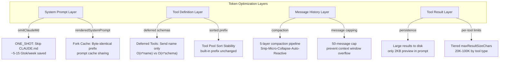
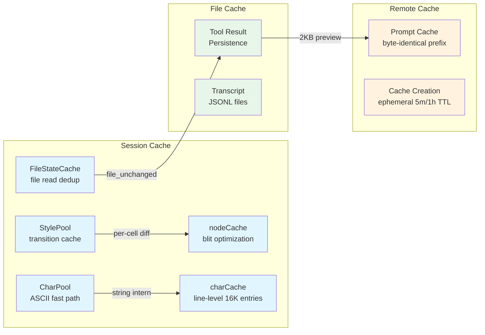

# Chapter 27: Performance Optimization Strategies

> How does a terminal application find the precise balance between startup latency, rendering frame rate, memory footprint, and API cost? Claude Code's performance engineering spans from the first microsecond of process startup to the last cent of API token spending, constructing an optimization system across seven dimensions.

---

## 27.1 Startup Performance: The Cold-Start War

For a CLI tool, startup latency directly determines user experience. Claude Code's bootstrap chain `cli.tsx -> init.ts -> main.tsx` implements aggressive optimizations at every layer.

### 27.1.1 Fast-Path Dispatch: 200x Speedup

The core design principle of `cli.tsx` is **fast-path dispatch** -- before loading the full CLI, it checks whether special flags or subcommands can allow an early exit with minimal module evaluation. The dispatch table has 15 priority levels:

| Priority | Condition | Modules Loaded | Typical Latency |
|----------|-----------|---------------|-----------------|
| 1 | `--version` / `-v` | Zero | < 5ms |
| 2 | `--dump-system-prompt` | config, model, prompts | ~50ms |
| 3-6 | MCP/Daemon subcommands | Single entry module | ~100ms |
| DEFAULT | No special flags | All 200+ modules | ~1000ms |

The critical engineering decision is that **all imports are dynamic** (`await import(...)`). When a user runs `claude --version`, the process reads a single compile-time constant `MACRO.VERSION` and exits -- no business modules loaded. This makes the fastest path approximately **200x faster** than the default path.

Additionally, the `feature()` function from `bun:bundle` is a **build-time macro**. During compilation, Bun's bundler completely removes disabled feature-gate blocks through Dead Code Elimination (DCE). The production build has over 30 feature flags controlling code path survival:

```
BRIDGE_MODE, DAEMON, BG_SESSIONS, TEMPLATES, FORK_SUBAGENT,
COORDINATOR_MODE, HISTORY_SNIP, VOICE_MODE, TEAMMEM ...
```

When a feature is disabled in the external build, the entire code block -- including the `await import(...)` statement -- occupies zero bytes in the output artifact.

### 27.1.2 Lazy Loading: ~1.1MB of Deferred OpenTelemetry

The initialization sequence in `init.ts` is designed as strictly layered loading:

```
Phase 1: Configuration     (synchronous, near-zero overhead)
Phase 2: Shutdown handlers  (synchronous)
Phase 3: Analytics          (fire-and-forget, non-blocking)
Phase 4: Auth & Settings    (void Promise, non-blocking)
Phase 5: Network            (preconnect, non-blocking)
Phase 6-8: Platform setup   (conditional)
```

The most impactful optimization is **telemetry lazy loading**. ~400KB of OpenTelemetry + protobuf modules are deferred until `doInitializeTelemetry()` runs; gRPC exporters (~700KB via `@grpc/grpc-js`) are further lazy-loaded within `instrumentation.ts`. In total, approximately **1.1MB** of modules are kept off the startup critical path.

### 27.1.3 I/O Overlap: MDM + Keychain Prefetch

At the top of `main.tsx`, three **performance-critical side-effects** execute before any regular imports:

```typescript
profileCheckpoint('main_tsx_entry');
startMdmRawRead();        // MDM subprocess read (~135ms)
startKeychainPrefetch();  // macOS Keychain prefetch (~65ms)
```

These three statements run **in parallel** with the subsequent ~135ms of import evaluation for 200+ modules. By the time imports complete, MDM data and Keychain credentials are already in memory waiting to be consumed.

```mermaid
gantt
    title Startup Timeline Optimization
    dateFormat X
    axisFormat %Lms
    section Critical Path
    cli.tsx entry          :a1, 0, 5
    Feature gate check     :a2, after a1, 10
    Dynamic import main.js :a3, after a2, 135
    Commander.js setup     :a4, after a3, 50
    section Parallel I/O
    MDM subprocess read    :b1, 15, 150
    Keychain prefetch      :b2, 15, 80
    preconnectAnthropicApi :b3, 15, 120
    section Deferred
    OpenTelemetry load     :c1, 200, 400
    gRPC exporter load     :c2, 400, 300
    Deferred prefetches    :c3, 250, 500
```



`preconnectAnthropicApi()` initiates the TCP+TLS handshake to the Anthropic API during the init phase, saving approximately **100-200ms** of network latency. `startDeferredPrefetches()` only fires after the first render, avoiding contention with the critical startup path.

---

## 27.2 Rendering Performance: The Terminal as a GPU-less Display Server

Claude Code's terminal UI framework turns a Unix terminal into a GPU-less display server: React components paint into a virtual framebuffer, and a diff engine emits the minimum ANSI sequences to update the physical screen.

### 27.2.1 Differential Updates: Cell-Level Diff

The core of the rendering pipeline is the `LogUpdate.render()` method, which compares two frames and produces a minimal patch list:

```
React Tree -> Yoga Layout -> renderNodeToOutput() -> Frame
-> Selection Overlay -> LogUpdate.render(prev, next) -> Diff[]
-> Optimizer -> writeDiffToTerminal()
```

`diffEach()` compares the previous and next frames at the cell level. Each cell is two `Int32` values (charId + packed style/hyperlink/width), and the diff only iterates cells within the damage region:

```typescript
diffEach(prev.screen, next.screen, (x, y, removed, added) => {
  moveCursorTo(screen, x, y);
  if (added) {
    const styleStr = stylePool.transition(currentStyleId, added.styleId);
    writeCellWithStyleStr(screen, added, styleStr);
  }
});
```

In steady-state frames (spinner ticks, clock updates), only the dirty node's cells are re-rendered; all other nodes are bulk-copied from the previous frame via `TypedArray.set()`. This blit optimization is the single most important performance win in the rendering pipeline.

### 27.2.2 Hardware Scroll: DECSTBM

In alt-screen mode, content scrolling uses VT100 hardware scroll instructions instead of redrawing all rows:

```typescript
if (altScreen && next.scrollHint && decstbmSafe) {
  const { top, bottom, delta } = next.scrollHint;
  shiftRows(prev.screen, top, bottom, delta);
  scrollPatch = [{
    content: setScrollRegion(top + 1, bottom + 1) +
      (delta > 0 ? csiScrollUp(delta) : csiScrollDown(-delta)) +
      RESET_SCROLL_REGION + CURSOR_HOME,
  }];
}
```

The terminal hardware completes the row shift in a single ANSI instruction, and the diff engine only needs to repaint newly exposed rows. This reduces scroll I/O from O(rows * cols) to O(cols).

### 27.2.3 Object Pools: CharPool and StylePool

**CharPool** uses string interning to avoid duplicate string object creation. The key optimization is the ASCII fast path:

```typescript
class CharPool {
  private ascii: Int32Array = new Int32Array(128).fill(-1);

  intern(char: string): number {
    if (char.length === 1) {
      const code = char.charCodeAt(0);
      if (code < 128) {
        const cached = this.ascii[code]!;
        if (cached !== -1) return cached;  // O(1) direct array lookup
      }
    }
    return this.stringMap.get(char) ?? this.allocate(char);
  }
}
```

For ASCII characters (the vast majority of terminal content), lookup is a direct array index (O(1)), bypassing `Map.get` hash computation entirely. In the hot per-cell rendering loop, this difference is measurable.

**StylePool** caches the ANSI escape sequence transition between any two style IDs:

```typescript
transition(fromId: number, toId: number): string {
  const key = fromId * 0x100000 + toId;  // Pack into single number key
  let str = this.transitionCache.get(key);
  if (!str) {
    str = ansiCodesToString(diffAnsiCodes(this.get(fromId), this.get(toId)));
    this.transitionCache.set(key, str);
  }
  return str;
}
```

Two style IDs are packed into a single number as the cache key, avoiding object allocation. Once the transition between two styles has been computed, all subsequent frames hit the cache directly.

### 27.2.4 Frame Scheduling

Frame scheduling uses a throttled microtask pattern:

- Normal renders: throttled at `FRAME_INTERVAL_MS` (leading + trailing edge)
- Scroll drain frames: `FRAME_INTERVAL_MS >> 2` (quarter interval, ~250fps practical ceiling)
- `scheduleRender` wraps `queueMicrotask` in lodash `throttle`, ensuring layout effects have committed before render begins
- A drain timer and the throttled render coordinate: entering `onRender` cancels any pending drain timer

---

## 27.3 Memory Efficiency: Every Byte Counts

### 27.3.1 Packed Int32Array Cells

The screen buffer uses packed `Int32Array` for zero-GC-pressure cell storage:

```typescript
type Screen = {
  cells: Int32Array;       // 2 Int32s per cell: [charId, packed]
  cells64: BigInt64Array;  // Same buffer as BigInt64 view for bulk fills
};
```

Cell packing layout (word1):

| Bit Range | Field | Maximum |
|-----------|-------|---------|
| [31:17] | styleId | 32,767 styles |
| [16:2] | hyperlinkId | 32,767 links |
| [1:0] | width | 4 variants (Narrow/Wide/SpacerTail/SpacerHead) |

For a 200x120 terminal, using object arrays would allocate **24,000+ objects**; the `Int32Array` compresses this into a single contiguous memory block. The `cells64` view makes full-screen clearing a single `screen.cells64.fill(0n)` call.

### 27.3.2 Message Capping: The Lesson from the 36.8GB Incident

The InProcessTeammateTask introduced a **50-message cap** that originated from a real production incident:

> A whale session with 292 concurrent agents at 500+ turns reached 36.8GB RSS.

```typescript
export const TEAMMATE_MESSAGES_UI_CAP = 50;

export function appendCappedMessage<T>(prev: T[] | undefined, item: T): T[] {
  if (prev && prev.length >= TEAMMATE_MESSAGES_UI_CAP) {
    const next = prev.slice(-(TEAMMATE_MESSAGES_UI_CAP - 1));
    next.push(item);
    return next;
  }
  return [...prev ?? [], item];
}
```

At approximately ~20MB RSS per agent per 500 turns, the 50-message cap stabilizes a single agent's UI message memory at roughly **~2MB**.

### 27.3.3 Pool Reset: Preventing Unbounded Growth

CharPool and HyperlinkPool grow without bounds during long sessions. Every 5 minutes, a pool reset replaces them with fresh instances:

```typescript
resetPools(): void {
  this.charPool = new CharPool();
  this.hyperlinkPool = new HyperlinkPool();
  migrateScreenPools(this.frontFrame.screen, this.charPool, this.hyperlinkPool);
}
```

The front frame's screen is migrated to the new pool; the back frame's pool references are updated; the old pools are handed to GC. The charCache (line-level cache) is evicted when it exceeds 16,384 entries.

---

## 27.4 Token Economics: Precision Control of API Costs

For LLM applications, API call cost is often the largest operational expense. Claude Code optimizes token consumption at multiple levels.

### 27.4.1 Prompt Cache Sharing: Byte-Identical Fork Prefixes

The core optimization of fork subagents is ensuring all fork children produce **byte-identical** API request prefixes:

```
[...history, assistant(all_tool_uses), user(placeholder_results..., directive)]
```

The mechanism works in three steps:

1. Preserve the full parent assistant message (all tool_use blocks, thinking, text)
2. Build a single user message with tool_results for every tool_use block using an **identical placeholder**: `'Fork started -- processing in background'`
3. Append a per-child directive only in the final text block

This ensures that the Anthropic API's prompt cache charges only once for the prefix portion shared across all fork children. The fork agent's `getSystemPrompt` is an empty function -- it inherits the parent's **already-rendered system prompt bytes** (threaded via `renderedSystemPrompt`), avoiding GrowthBook cold/warm divergence that would bust the cache.

### 27.4.2 ONE_SHOT Optimization: Explore Agent CLAUDE.md Omission

The Explore agent sets `omitClaudeMd: true`, skipping CLAUDE.md injection in the sub-agent's system prompt. Given a typical CLAUDE.md length of approximately **~135 chars** multiplied by **34M+ weekly** Explore invocations:

```
Savings ~ 135 chars x 34,000,000 calls/week ~ 4.6 Gtok/week (estimate)
```

Actual savings fall in the **~5-15 Gtok/week** range depending on real CLAUDE.md sizes across projects.

### 27.4.3 Tool Pool Sorting for Cache Stability

`assembleToolPool()` sorts built-in and MCP tools separately before concatenation:

```typescript
const byName = (a, b) => a.name.localeCompare(b.name);
return uniqBy(
  [...builtInTools].sort(byName).concat(allowedMcpTools.sort(byName)),
  'name',
);
```

Built-in tools form a stable, contiguous sorted prefix. When MCP tools are added or removed, the prefix remains unchanged, so the prompt cache continues to hit on the built-in tool definition portion.

### 27.4.4 Result Budgeting: Tiered Size Controls

Tool results are governed by three tiers of size control:

| Control Layer | Limit | Purpose |
|--------------|-------|---------|
| Per-tool `maxResultSizeChars` | 20K-100K (Infinity for Read) | Tool-level truncation |
| Global `DEFAULT_MAX_RESULT_SIZE_CHARS` | 50,000 chars | Global ceiling |
| `MAX_TOOL_RESULTS_PER_MESSAGE_CHARS` | 200,000 chars | Per-message aggregate cap |

Results exceeding their threshold are persisted to disk, with only a preview retained in the prompt:

```
<persisted-output>
Output too large (42.3 KB). Full output saved to: /path/to/file.txt
Preview (first 2.0 KB):
[first 2000 bytes]
...
</persisted-output>
```

Files are stored at `{projectDir}/{sessionId}/tool-results/{toolUseId}.{txt|json}`. The `ContentReplacementState` ensures cache stability: once a result's fate (inline vs. persisted) is decided, it is frozen for the conversation's lifetime.

### 27.4.5 Deferred Tool Schemas

When the total tool count exceeds a threshold, the system switches to a deferred tools mode. Deferred tools send only their name to the API (with `defer_loading: true`); the model must call `ToolSearch` to load the full schema before invoking a deferred tool:

```typescript
function isDeferredTool(tool: Tool): boolean {
  if (tool.alwaysLoad) return false;
  if (tool.isMcp) return true;       // MCP tools always deferred
  if (tool.shouldDefer) return true;  // Explicitly declared deferred
  return false;
}
```

This reduces tool definition tokens in the system prompt from O(n * avg_schema_size) to O(n * name_length). In environments with many MCP tools, this saves thousands of tokens per request.



---

## 27.5 Concurrent Execution: Tool Parallelism and Agent Dispatch

### 27.5.1 Tool Parallel Execution: Partitioned Batches

The tool execution concurrency model follows three rules:

1. **Concurrent-safe** tools may execute in parallel with other concurrent-safe tools
2. **Non-concurrent** tools must execute exclusively (serial access)
3. Results are buffered and emitted in the order tools were received

`partitionToolCalls()` divides tool calls into alternating concurrent/serial batches:

```
[Glob, Grep, Read] -> one concurrent batch (max concurrency: 10)
[FileEdit]         -> one serial batch
[Glob, Read]       -> one concurrent batch
```

| Tool | isConcurrencySafe | Rationale |
|------|------------------|-----------|
| FileReadTool | `true` | Pure read operation |
| GlobTool | `true` | Pure search operation |
| GrepTool | `true` | Pure search operation |
| WebFetchTool | `true` | Network read |
| BashTool | `isReadOnly(input)` | Only read-only commands run concurrently |
| FileEditTool | `false` (default) | File write operations |

The default concurrency limit is **10** (configurable via `CLAUDE_CODE_MAX_TOOL_USE_CONCURRENCY`). The design follows a fail-closed principle: a tool that forgets to declare `isConcurrencySafe` is treated as serial-only.

### 27.5.2 StreamingToolExecutor: Streaming Parallelism

When streaming tool execution is enabled, `StreamingToolExecutor` begins executing tools while the API is still streaming tool_use blocks:

```
API streaming: [tool_use_1] [tool_use_2] [tool_use_3] ...
Execution:      |--exec_1--|
                            |--exec_2--|--exec_3--|  (concurrent)
Result yield:   [result_1]  [result_2]  [result_3]  (ordered)
```

The abort propagation mechanism uses a three-layer AbortController chain:

```
query-level (parent)
  -> siblingAbortController (middle: Bash errors cancel siblings)
    -> toolAbortController (per-tool)
```

Only Bash tool errors cascade to cancel sibling tools (because Bash commands often have implicit dependency chains). Read/WebFetch failures do not affect siblings. This is a deliberate asymmetry: `mkdir` failure makes subsequent commands pointless, but one failing `grep` should not kill a parallel `read`.

### 27.5.3 I/O Prefetch Parallelization

Startup-phase I/O parallelization extends beyond MDM and Keychain. Phases 3-5 in `init.ts` launch all operations as `void Promise` calls, never blocking the initialization main thread:

```typescript
// Phase 3: Analytics (fire-and-forget)
void Promise.all([
  import('../services/analytics/firstPartyEventLogger.js'),
  import('../services/analytics/growthbook.js'),
]).then(([fp, gb]) => { ... });

// Phase 4: Auth & Remote Settings (void, non-blocking)
void populateOAuthAccountInfoIfNeeded();
void detectCurrentRepository();

// Phase 5: Network (overlap with module evaluation)
preconnectAnthropicApi();
```

---

## 27.6 Network Performance: Connection Establishment Optimization

### 27.6.1 DNS Preconnection

`preconnectAnthropicApi()` initiates a TCP+TLS handshake to the Anthropic API during the init phase. This exploits the time window of module evaluation (~135ms) and Commander.js setup (~50ms), so that the connection is ready when the first API call occurs.

### 27.6.2 Transport Selection

Remote mode automatically selects the optimal transport based on URL protocol:

| Transport | Read Path | Write Path | Use Case |
|-----------|-----------|------------|----------|
| WebSocket | WebSocket | WebSocket | Low-latency bidirectional |
| SSE | SSE (GET) | HTTP POST | CCR v2 |
| Hybrid | WebSocket (low latency) | HTTP POST (reliable) | Best combination |

The Hybrid Transport uses a 100ms batching window for `stream_event` messages, merging multiple small messages into a single HTTP POST to reduce request count. Write operations are serialized to avoid concurrent write conflicts on Firestore documents.

### 27.6.3 WebSocket Reconnection and Message Replay

The WebSocket transport maintains a circular buffer of sent messages. On reconnection, it sends an `X-Last-Request-Id` header for server-side replay, enabling resume from the point of disconnection:

```typescript
if (this.lastSentId) {
  headers['X-Last-Request-Id'] = this.lastSentId;
}
```

The reconnection strategy uses exponential backoff from 1s to 30s, with a 10-minute give-up timeout. Sleep detection (>60s gap between reconnects) resets the backoff budget. Permanent close codes (1002, 4001, 4003) bypass retry entirely.

---

## 27.7 Caching Strategies: Three-Tier Architecture

### 27.7.1 Session-Level Cache

| Cache | Scope | Lifetime | Eviction |
|-------|-------|----------|----------|
| StylePool transitionCache | Per-Ink instance | Render lifetime | Pool reset (5min) |
| CharPool ASCII fast path | Per-Ink instance | Render lifetime | Pool reset (5min) |
| nodeCache (blit) | Per-frame | Rebuilt each frame | Dirty flag |
| charCache (line-level) | Per-Output | Persists across frames | 16,384 entry overflow |
| FileStateCache | Per-QueryEngine | Conversation lifetime | Manual update |
| ContentReplacementState | Per-conversation | Never reset | UUID keys naturally expire |

The nodeCache deserves special attention. It stores the last-rendered rectangle for each DOM node. Clean nodes with unchanged positions are blitted from the previous frame's screen buffer instead of being re-rendered:

```typescript
if (!node.dirty && cached &&
    cached.x === x && cached.y === y &&
    cached.width === width && cached.height === height && prevScreen) {
  output.blit(prevScreen, fx, fy, fw, fh);
  return;  // Skip entire subtree
}
```

This is the single most impactful rendering optimization: in steady-state frames, only the dirty node's cells are processed; everything else is a bulk `TypedArray.set()` copy.

### 27.7.2 File-Level Cache

Tool result disk persistence (`{projectDir}/{sessionId}/tool-results/{toolUseId}.txt`) serves as both memory optimization and caching: large results exist only once on disk, with only a 2KB preview in the prompt. When the model needs the full result, it can read the persisted file via the Read tool.

### 27.7.3 Remote Cache

The prompt cache is a remote cache at the Anthropic API level. Claude Code maximizes cache hit rates through several mechanisms:

- **Fork byte-identical prefix**: All fork children share the same message prefix
- **Tool pool sorted prefix**: Built-in tool definitions are sorted consistently across all sessions
- **renderedSystemPrompt**: Forks reuse the parent's already-rendered system prompt bytes, avoiding subtle re-rendering divergence



### 27.7.4 Memoization Boundaries

Several critical functions in the system employ memoization:

- `init()` is wrapped with `memoize()` -- no matter how many times it is called, it executes exactly once
- `stringWidth()` preferentially uses `Bun.stringWidth` (native implementation, single call); the JavaScript fallback has three fast paths: pure ASCII, simple Unicode, and full grapheme segmentation
- React Compiler generates `_c` memoization slots at the component level, maximizing cross-render cache hits
- Dirty propagation in the DOM tree is suppressed when style/attribute values are unchanged (`stylesEqual()`, identity check), preventing unnecessary re-renders of subtrees

---

## 27.8 Performance Comparison Summary

| Domain | Technique | Quantified Impact |
|--------|-----------|-------------------|
| Startup: fast-path | Dynamic import + dispatch table | `--version` < 5ms vs default ~1000ms |
| Startup: lazy load | OpenTelemetry deferred | ~1.1MB off critical path |
| Startup: I/O overlap | MDM/Keychain parallel | Saves ~135ms + ~65ms |
| Startup: preconnect | TCP+TLS preconnection | Saves ~100-200ms |
| Render: diff | Cell-level differential | Steady-state: only dirty cells updated |
| Render: hardware scroll | DECSTBM | Scroll I/O: O(cols) vs O(rows*cols) |
| Render: pools | CharPool ASCII O(1) | Bypasses Map.get hashing |
| Memory: packed cells | Int32Array | Eliminates 24,000+ objects per screen |
| Memory: message cap | 50-message limit | From 36.8GB to controlled levels |
| Token: fork cache | Byte-identical prefix | Prompt cache sharing across forks |
| Token: ONE_SHOT | omitClaudeMd | ~5-15 Gtok/week saved |
| Token: deferred | Tool name only | Thousands of tokens saved per request |
| Concurrency: parallel | Partitioned batches | Max 10 concurrent tools |
| Network: transport | Hybrid WebSocket+POST | 100ms batching window |

---

## 27.9 Chapter Summary

Claude Code's performance optimization is not a collection of isolated tricks but a systematic engineering effort spanning seven dimensions:

1. **Startup performance** achieves sub-second cold start through fast-path dispatch, lazy loading, and I/O overlap
2. **Rendering performance** reaches the terminal frame rate ceiling through cell-level diff, hardware scroll, and object pools
3. **Memory efficiency** prevents long-session memory bloat through packed arrays, message capping, and pool reset
4. **Token economics** controls API cost through cache sharing, ONE_SHOT optimization, and result budgeting
5. **Concurrent execution** maximizes tool throughput through partitioned batching and streaming execution
6. **Network performance** minimizes latency through preconnection, transport selection, and message batching
7. **Caching strategies** reuse computation results at different time scales through a three-tier cache architecture

The common thread across these optimizations is **fail-closed design** and **quantifiable tradeoffs**. Every optimization has a clear cost (code complexity) and benefit (quantified improvement in latency, memory, or dollar cost), transforming performance engineering from "feels fast" to "proven fast." The 36.8GB incident that led to the 50-message cap, the ~5-15 Gtok/week savings from CLAUDE.md omission, and the 200x speedup from fast-path dispatch are not marketing numbers -- they are architectural constraints that shaped the code.
