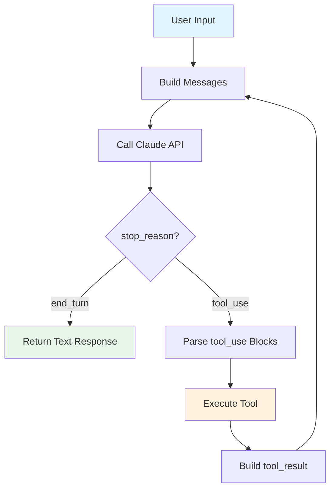
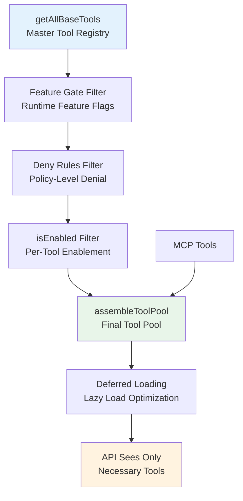
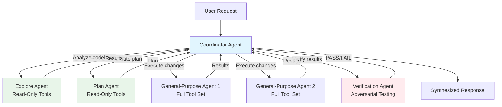
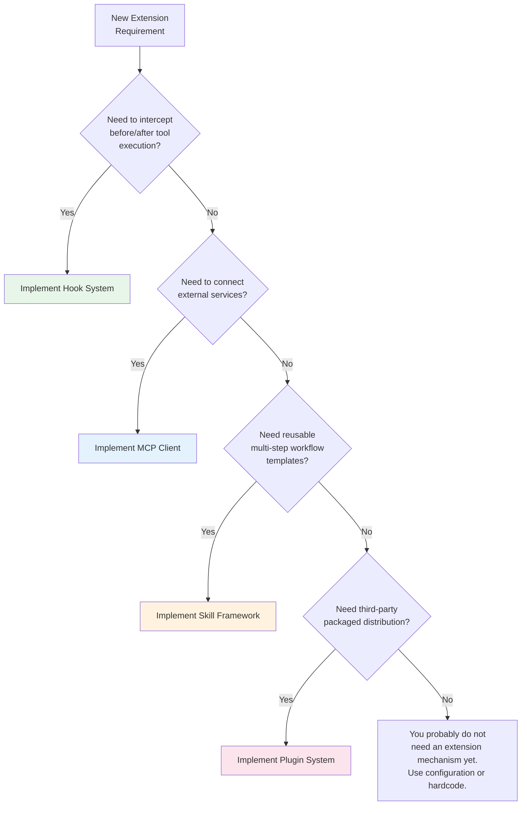

# Chapter 28: Build Your Own AI Harness

> **Chapter Summary**
>
> Over the preceding 27 chapters we have disassembled every subsystem of Claude Code, a 500,000-line production AI Harness. Now it is time to convert that knowledge into action. This chapter starts from a 50-line minimum viable Harness, progressively adds multi-turn conversation, a tool system, agent capabilities, a UI layer, and extensibility mechanisms, and concludes with a production hardening guide and an architecture decision checklist. By the end, you will have a clear roadmap for building your own AI agent framework from scratch.

---

## 28.1 Minimum Viable Harness: One API Call, One Tool

Every great system starts as a small prototype. The essence of Claude Code's architecture can be distilled into a single loop: **call the model -> check whether tools are needed -> execute the tool -> feed results back to the model -> repeat**. This is the agentic loop.

Here is a working minimal Harness in under 60 lines of TypeScript:

```typescript
import Anthropic from "@anthropic-ai/sdk";
import { execSync } from "child_process";

const client = new Anthropic();

// Define one tool: run a shell command
const tools: Anthropic.Tool[] = [
  {
    name: "run_command",
    description: "Run a shell command and return its output",
    input_schema: {
      type: "object" as const,
      properties: {
        command: { type: "string", description: "The shell command to run" },
      },
      required: ["command"],
    },
  },
];

// Execute a tool call
function executeTool(name: string, input: Record<string, string>): string {
  if (name === "run_command") {
    try {
      return execSync(input.command, { encoding: "utf-8", timeout: 30000 });
    } catch (e: any) {
      return `Error: ${e.message}`;
    }
  }
  return `Unknown tool: ${name}`;
}

// The core: Agentic Loop
async function agenticLoop(userMessage: string): Promise<string> {
  const messages: Anthropic.MessageParam[] = [
    { role: "user", content: userMessage },
  ];

  while (true) {
    const response = await client.messages.create({
      model: "claude-sonnet-4-20250514",
      max_tokens: 4096,
      tools,
      messages,
    });

    // If the model has no more tool calls, return its final text
    if (response.stop_reason === "end_turn") {
      const textBlock = response.content.find((b) => b.type === "text");
      return textBlock ? textBlock.text : "(no response)";
    }

    // Process tool calls
    messages.push({ role: "assistant", content: response.content });
    const toolResults: Anthropic.ToolResultBlockParam[] = [];
    for (const block of response.content) {
      if (block.type === "tool_use") {
        const result = executeTool(block.name, block.input as Record<string, string>);
        toolResults.push({ type: "tool_result", tool_use_id: block.id, content: result });
      }
    }
    messages.push({ role: "user", content: toolResults });
  }
}

// Entry point
const answer = await agenticLoop("List all TypeScript files in the current directory");
console.log(answer);
```

These 60 lines already exhibit the skeleton of Claude Code's architecture:



Compared to Claude Code's `queryLoop()`, what is this minimal Harness missing? Precisely what the following sections will build: multi-turn context management, a tool registration system, permission controls, agent dispatch, error recovery, and a UI layer.

---

## 28.2 Multi-Turn Conversation and Context Management

The minimal Harness grows its `messages` array without bound during a single `agenticLoop` call. In production you must solve three problems.

### Message Persistence Across Turns

Claude Code's `QueryEngine` maintains a `mutableMessages` array that persists across multiple `submitMessage()` calls within the same conversation. Mimic this pattern:

```typescript
class Conversation {
  private messages: Anthropic.MessageParam[] = [];

  async submitMessage(userMessage: string): Promise<string> {
    this.messages.push({ role: "user", content: userMessage });
    // ... run agentic loop, push assistant/tool messages to this.messages
    return finalResponse;
  }
}
```

### Context Window Management

When the message history approaches the model's context window limit, you need a compaction strategy. Claude Code employs a three-tier scheme:

1. **Microcompact**: Removes redundant system messages, compresses duplicate tool results.
2. **Autocompact**: When token usage exceeds a threshold, a smaller model generates a conversation summary that replaces older messages.
3. **Snip compaction**: Inserts "snip boundaries" into the conversation and replaces content before the boundary with a summary.

For your own Harness, the simplest starting point is a sliding window plus summarization:

```typescript
async function compactIfNeeded(messages: MessageParam[], maxTokens: number) {
  const tokenCount = estimateTokens(messages);
  if (tokenCount < maxTokens * 0.8) return messages;

  // Keep the most recent N turns, summarize the rest
  const recent = messages.slice(-10);
  const old = messages.slice(0, -10);
  const summary = await summarize(old);  // Use a small model to generate a summary
  return [{ role: "user", content: `Previous context summary: ${summary}` }, ...recent];
}
```

### System Prompt Assembly

Claude Code's system prompt is not a static string. It is dynamically assembled from multiple parts: a base prompt, user context (contents of CLAUDE.md files), tool descriptions, agent definitions, and memory prompts. Layering these is good practice:

```typescript
function buildSystemPrompt(parts: { base: string; userContext?: string; toolHints?: string }) {
  return [parts.base, parts.userContext, parts.toolHints].filter(Boolean).join("\n\n");
}
```

---

## 28.3 Implementing a Tool System: Interface, Registration, Permission Model

The tool system is the critical leap that transforms a Harness from "chat assistant" into "coding agent."

### Tool Interface Design

Claude Code's `Tool<Input, Output, Progress>` interface has nearly 50 fields, but the core requires only seven. Start with a minimal interface:

```typescript
interface Tool {
  name: string;
  description: string;
  inputSchema: Record<string, unknown>;   // JSON Schema
  call(input: unknown): Promise<ToolResult>;
  isReadOnly(input: unknown): boolean;     // Foundation for concurrency decisions
  checkPermissions(input: unknown): Promise<{ allowed: boolean; reason?: string }>;
}

interface ToolResult {
  data: string;
  isError?: boolean;
}
```

Then add fields incrementally as needed: `isConcurrencySafe()` (concurrency control), `validateInput()` (input validation), `prompt()` (dynamic prompt injection), `renderToolUseMessage()` (UI rendering).

**A lesson from Claude Code**: The `buildTool()` factory uses fail-closed defaults. A tool that forgets to declare `isConcurrencySafe` is treated as serial-only. A tool that forgets `isReadOnly` is treated as a write. This defensive design prevents hard-to-trace concurrency bugs.

### Tool Registration and Discovery

Claude Code uses a central registry `getAllBaseTools()` plus multiple filtering stages:



Your Harness can start with a simple Map-based registry:

```typescript
class ToolRegistry {
  private tools = new Map<string, Tool>();

  register(tool: Tool) { this.tools.set(tool.name, tool); }
  get(name: string) { return this.tools.get(name); }
  getAll() { return Array.from(this.tools.values()); }

  // Convert to API format
  toAPIFormat(): Anthropic.Tool[] {
    return this.getAll().map(t => ({
      name: t.name,
      description: t.description,
      input_schema: t.inputSchema,
    }));
  }
}
```

### Permission Model

Claude Code's permission system operates on three layers:

1. **Pre-model filtering**: Before sending the tool list to the model, deny rules remove prohibited tools. The model never sees them.
2. **Permission check**: Before tool execution, `checkPermissions()` validates each specific invocation. Results can be `allow`, `deny`, or `ask` (prompt the user for confirmation).
3. **Hook system**: `PreToolUse` hooks can intercept or modify calls after the permission check but before execution.

For an MVP, start with a whitelist approach:

```typescript
type PermissionMode = "ask" | "auto" | "deny";

function checkPermission(tool: Tool, input: unknown, mode: PermissionMode): boolean {
  if (mode === "deny") return false;
  if (mode === "auto") return true;
  if (tool.isReadOnly(input)) return true;  // Read operations auto-allowed
  return promptUser(`Allow ${tool.name}?`);  // Write operations require confirmation
}
```

---

## 28.4 Adding Agent Capabilities: Subagent Spawning, Task Management, Coordinator Pattern

Once the tool system is stable, the next leap is agent capability -- letting the AI dispatch subtasks to other AI instances.

### The Nature of Subagents

Claude Code's Agent Tool is fundamentally a recursive call: the parent agent invokes a special `Agent` tool that starts a new `queryLoop()` with a custom system prompt, a restricted tool set, an independent abort controller, and a turn limit. When the subagent finishes, its result flows back as the tool result.

```typescript
class AgentTool implements Tool {
  name = "Agent";

  async call(input: { agentType: string; prompt: string }): Promise<ToolResult> {
    const agent = this.registry.getAgent(input.agentType);
    const subConversation = new Conversation({
      systemPrompt: agent.systemPrompt,
      tools: agent.allowedTools,
      maxTurns: agent.maxTurns ?? 20,
    });
    const result = await subConversation.submitMessage(input.prompt);
    return { data: result };
  }
}
```

### Task Type Hierarchy

Claude Code defines seven task types: `local_bash`, `local_agent`, `remote_agent`, `in_process_teammate`, `local_workflow`, `monitor_mcp`, and `dream`. Each has an independent lifecycle (`pending -> running -> completed/failed/killed`).

For your Harness, start with two:

- **Foreground agent**: Synchronous execution, shares the parent's abort controller and state.
- **Background agent**: Asynchronous execution, independent abort controller, reports results through a notification system.

### Coordinator Pattern

When task complexity exceeds the capacity of a single agent, Claude Code introduces the Coordinator pattern: a coordinator agent understands the overall task, decomposes it into subtasks, dispatches them to specialized agents (Explore, Plan, General-purpose, Verification), and synthesizes the results.



Key design decisions:

- **Tool set isolation**: The Explore Agent only has read-only tools and cannot accidentally modify files.
- **Background execution**: The Verification Agent is designed to always run in the background.
- **Model tiering**: The Explore Agent can use a cheaper model (Haiku), while general-purpose agents use the primary model.
- **Permission inheritance**: Subagents inherit the parent's permission mode, but this can be overridden.

---

## 28.5 The UI Layer: Terminal, Web, IDE Plugin Trade-offs

The UI layer determines the user experience, but the right choice depends on context.

### Terminal

Claude Code chose the terminal as its primary UI, using React (Ink) to render TUI components. This delivers:

**Strengths**:
- The environment developers know best -- zero context-switching cost.
- Natural integration with shell and git workflows.
- Lightweight and fast to start.

**Weaknesses**:
- Limited display capabilities (no rich text, no images).
- Terminal compatibility fragmentation.
- Constrained interaction patterns.

### Web UI

Best suited for scenarios requiring rich display: code diff highlighting, project browsers, visual debugging panels.

**Trade-off**: A web UI means maintaining a frontend-backend communication protocol (WebSocket/SSE), session management, and authentication. If your Harness targets teams, the web is likely the better choice.

### IDE Plugin

Deep integration with VS Code or JetBrains -- users work within their editor.

**Trade-off**: Constrained by IDE plugin APIs and requires separate maintenance per IDE. But for code editing scenarios, IDE integration offers the best code awareness (file tree, diagnostics, LSP data).

### Recommended Path

```
Stage 1: Pure CLI (readline / stdin-stdout)
Stage 2: Terminal UI (Ink / Blessed / custom ANSI rendering)
Stage 3: Multi-frontend (CLI + Web / CLI + IDE Plugin)
```

**The key lesson from Claude Code**: Use a streaming AsyncGenerator as the core output protocol. `queryLoop()` yields structured events (Message, StreamEvent, ToolUseSummary), not formatted text. This allows the same core engine to drive different frontends without modifying any engine-layer logic.

---

## 28.6 Extensibility Design: Plugin, Skill, MCP, Hook

Claude Code provides four distinct extension mechanisms, each solving problems at a different level of abstraction.

| Mechanism | Use Case | Complexity | When to Introduce |
|-----------|----------|------------|-------------------|
| **Hook** | Inject custom logic before/after tool execution (audit, validation, transformation) | Low | When the first extension requirement appears |
| **Skill** | Pre-defined prompt + tool combinations, loaded on demand | Medium | When users repeatedly perform the same multi-step workflow |
| **Plugin** | Packaged bundles of tools + agents + hooks for distribution | High | When third parties need to extend your Harness |
| **MCP** | Standardized external tool protocol (Model Context Protocol) | Medium | When you need to connect external services (databases, APIs, IDEs) |

### Hook System

Hooks are the lightest extension point. Claude Code supports four hook timings:

- `PreToolUse`: Before tool execution -- can intercept, modify input, inject permission decisions.
- `PostToolUse`: After tool execution -- can transform output, write audit logs.
- `PreSampling`: Before the API call.
- `PostSampling`: After the API call.

Implementation sketch:

```typescript
type HookTiming = "PreToolUse" | "PostToolUse" | "PreSampling" | "PostSampling";

interface Hook {
  timing: HookTiming;
  toolName?: string;     // Apply only to a specific tool; undefined means all
  handler(context: HookContext): Promise<HookResult>;
}

// HookResult can:
// - Allow execution to continue
// - Block execution and return an error
// - Modify input/output
// - Prevent the conversation from continuing
```

### MCP Integration

MCP (Model Context Protocol) is a protocol for standardized ingestion of external tools. Claude Code treats MCP tools as first-class citizens -- they pass through the same registration, permission checking, and concurrency control pipeline as built-in tools. But there is one critical difference: MCP tools are placed after built-in tools in `assembleToolPool()` to preserve prompt cache stability.

### When to Introduce Each Mechanism



---

## 28.7 Production Hardening: Security, Performance, Monitoring

The distance from prototype to production is often greater than the distance from zero to prototype.

### Security: Layered Permissions

Claude Code's security model is defense-in-depth:

1. **Model-level**: The system prompt instructs the model not to perform dangerous operations.
2. **Pre-model filtering**: Deny rules remove tools from the model's view entirely.
3. **Tool-level**: Each tool's `checkPermissions()` validates before execution.
4. **Hook-level**: `PreToolUse` hooks can implement custom security policies.
5. **Process-level**: `BashTool` executes commands in a sandbox with restricted network and filesystem access.

For your Harness, implement at least the first three layers:

```typescript
// Layer 1: System prompt safety instructions
const SAFETY_PROMPT = "Never execute destructive commands without explicit user confirmation.";

// Layer 2: Tool list filtering
function filterTools(tools: Tool[], denyList: string[]): Tool[] {
  return tools.filter(t => !denyList.includes(t.name));
}

// Layer 3: Runtime permission check
async function executeWithPermission(tool: Tool, input: unknown, mode: PermissionMode) {
  const permission = await tool.checkPermissions(input);
  if (!permission.allowed) throw new Error(`Permission denied: ${permission.reason}`);
  return tool.call(input);
}
```

### Performance: Streaming and Caching

**Streaming**: Claude Code streams throughout. From API response to tool execution to UI rendering, messages flow as event streams rather than waiting for complete responses. This is critical for user experience -- users see the model thinking and tools executing in real time.

**Prompt cache**: Claude Code carefully maintains the ordering of the tool list and system prompt to maximize Anthropic API prompt cache hit rates. Built-in tools are sorted by name as a contiguous prefix; MCP tools follow. This means adding or removing MCP tools does not invalidate the entire cache.

**Tool result budgeting**: Large tool outputs (those exceeding a threshold) are persisted to disk, with only a preview retained in the message. This prevents a single tool call from consuming the entire context window.

### Monitoring: Telemetry

Claude Code uses OpenTelemetry (OTel) for end-to-end tracing:

- Every API call records TTFT (Time To First Token).
- Every tool execution records duration and result status.
- Every agent invocation records token consumption and tool use count.
- Error classification and recovery path tracing.

For your Harness, start with structured logging and graduate to OTel:

```typescript
function logToolExecution(toolName: string, duration: number, success: boolean) {
  const entry = { timestamp: Date.now(), tool: toolName, durationMs: duration, success };
  appendLog(entry);  // Write to structured log file
}
```

---

## 28.8 Architecture Decision Checklist

Below are the key architectural decisions you will face when building an AI Harness. Each row lists Claude Code's choice alongside alternatives for your reference.

| # | Decision | Claude Code's Choice | Alternatives | Key Consideration |
|---|----------|---------------------|--------------|-------------------|
| 1 | **Core loop pattern** | AsyncGenerator yielding event stream | Callback / Event Emitter / Observable | Generators naturally support backpressure and can be consumed with `for await` |
| 2 | **Message storage** | In-memory array + session-level persistence | Database / Redis / filesystem | In-memory suffices for single-user CLI; multi-user requires persistence |
| 3 | **Tool interface** | Single generic `Tool<I, O, P>` interface | Multiple interface inheritance / Decorator pattern | Unified interface keeps registration and filtering logic minimal |
| 4 | **Default value strategy** | Fail-closed (not concurrent, not read-only by default) | Fail-open (concurrent, read-only by default) | Fail-closed prevents safety surprises at the cost of declaration verbosity |
| 5 | **Concurrency control** | Per-tool `isConcurrencySafe` declaration, runtime batching | All serial / all concurrent / actor model | Declarative is safer and more controllable than runtime inference |
| 6 | **Permission model** | Three layers (pre-model / tool-level / hook) | Single-layer RBAC / ABAC / capability-based | Multi-layer defense-in-depth suits high-risk operations (files, shell) |
| 7 | **Context compaction** | Three tiers (microcompact / autocompact / snip) | Fixed sliding window / RAG retrieval | Multiple strategies outperform a single one but add implementation complexity |
| 8 | **Agent execution model** | Recursive `queryLoop()` call | Separate process / worker thread / remote service | In-process recursion is simplest but bounded by single-machine resources |
| 9 | **Agent tool set** | Declarative allowlist + global denylist | Full parent inheritance / full isolation | Allowlist + denylist provides fine-grained control while preserving flexibility |
| 10 | **Error recovery** | Classified recovery (413 -> compact, timeout -> retry) | Uniform retry / user intervention / give up | Per-error-type recovery strategies avoid blind retries |
| 11 | **UI protocol** | Structured event stream (Message / StreamEvent) | Formatted text stream / JSON-RPC | Structured events support multiple frontend consumers |
| 12 | **System prompt construction** | Dynamic assembly (multi-part concatenation) | Static template / template engine | Dynamic assembly adapts to context but is harder to debug |
| 13 | **Extension mechanisms** | Four layers (hook / skill / plugin / MCP) | Single plugin system / webhooks | Layered extension keeps simple needs simple |
| 14 | **Dependency injection** | Explicit `deps` parameter (4 dependencies) | DI container / service locator / global mocks | Explicit parameters are most transparent; suits a limited number of core deps |
| 15 | **Model switching** | Runtime switchable + automatic fallback | Compile-time binding / config file | Runtime switching supports per-task model selection |
| 16 | **Configuration hierarchy** | Policy > Project > User > Default | Single-layer config / environment variables | Multi-layer override supports enterprise governance + personal customization |
| 17 | **Task ID generation** | Type prefix + random suffix (`a` + 8 base36 chars) | UUID / auto-increment / Snowflake | Prefixed IDs carry type information, aiding log analysis |
| 18 | **Tool result handling** | Persist above threshold to disk, keep preview in message | Truncate / retain everything / reference-based | Persist + preview balances context cost against information completeness |

---

## 28.9 What Claude Code Teaches Us

Looking back across the entire book, Claude Code -- this 500,000-line system -- conveys several deep engineering principles.

### Principle 1: The Loop Is the Core; Everything Else Is Decoration

The soul of the system is `queryLoop()` -- a `while(true)` loop that calls the model, executes tools, and advances state. All the complexity -- compaction, recovery, streaming, agent dispatch -- is incremental enhancement of this fundamental loop. When designing your own Harness, get the loop running first and add capabilities progressively.

### Principle 2: Fail-Closed Is the Only Correct Default

When it is uncertain whether a tool can be executed concurrently, Claude Code defaults to "no." When it is uncertain whether an operation is safe, it defaults to requiring confirmation. This conservative posture is not optional in safety-critical agent systems -- it is mandatory. The security incidents caused by open defaults are categorically more severe than the performance penalties caused by conservative ones.

### Principle 3: Structured Events Over Formatted Text

`queryLoop()` yields `Message`, `StreamEvent`, `ToolUseSummary`, and other structured types -- not strings. This design decision allows the same engine to drive a terminal UI, a web UI, SDK consumers, and test frameworks without modifying the engine code. If you make only one architectural decision, make this one.

### Principle 4: Permission Is Layered, Not Binary

There is no single "safe / unsafe" switch. Claude Code uses pre-model filtering, tool-level checks, hook interception, and user confirmation -- four layers building a security boundary. Each layer alone may be permissive, but stacked together the probability of a missed threat approaches zero.

### Principle 5: Extensibility Should Be Tiered

Not every extension requirement needs a plugin system. If a hook can solve the problem, do not reach for a plugin. If a configuration option can solve it, do not reach for a hook. Claude Code's four extension tiers (hook -> skill -> plugin -> MCP) are arranged from simple to complex, and each is activated only when the previous tier is insufficient.

### Principle 6: Agents Are Constrained Recursion, Not Unlimited Freedom

Subagents do not receive the full capabilities of the system. They receive a carefully selected subset of tools, a purpose-built system prompt, a bounded turn limit, and potentially a smaller model. This design lets complex tasks be solved through decomposition while keeping each subagent's blast radius to a minimum.

### Principle 7: 80% of a Production System Is Error Handling

The happy path of `queryLoop()` -- call model, execute tools, continue -- accounts for perhaps 20% of the code. The remaining 80% handles edge cases: What if the prompt is too long? What if the output hits the token limit? What if a tool times out? What if the network drops? What if the user interrupts? Each failure mode has a dedicated recovery strategy. Your Harness must do the same.

---

## 28.10 Your Roadmap

If you are ready to start building your own AI Harness, here is a recommended phased roadmap.

**Week 1: Minimal Prototype**
- Implement the 50-line Harness from Section 28.1.
- Add 2-3 built-in tools (file read, shell execution, search).
- Verify that the agentic loop can complete simple file operation tasks.

**Week 2: Core Capabilities**
- Implement multi-turn conversation and context persistence.
- Build a tool registry with basic permission checking.
- Add sliding-window context compaction.

**Week 3: Agent System**
- Implement the Agent tool with synchronous subagent support.
- Define 2-3 agent types (read-only exploration, general-purpose execution).
- Implement basic error recovery (retry, truncate, degrade).

**Week 4: Production Readiness**
- Add a hook system.
- Implement streaming output.
- Add structured logging and telemetry.
- Conduct a security audit and harden permissions.

**Beyond**: Based on your requirements, introduce MCP integration, a plugin system, a web UI, and multi-agent coordination.

---

> **Closing the Book**
>
> From Chapter 1, "What Is an AI Harness?" to this chapter, "Build Your Own AI Harness," we have completed a full journey: from understanding every gear of a production-grade system to possessing the ability to design and build a similar one ourselves. Claude Code is one particular set of implementation choices -- not the only correct answers. But the problems it confronts -- context management, tool orchestration, permission control, agent coordination, error recovery -- are problems every AI Harness builder must answer. We hope this book has provided the knowledge and judgment you need to answer them.
>
> Now go build.
