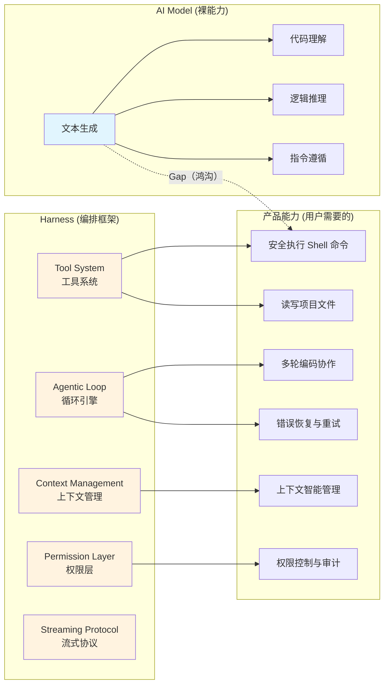
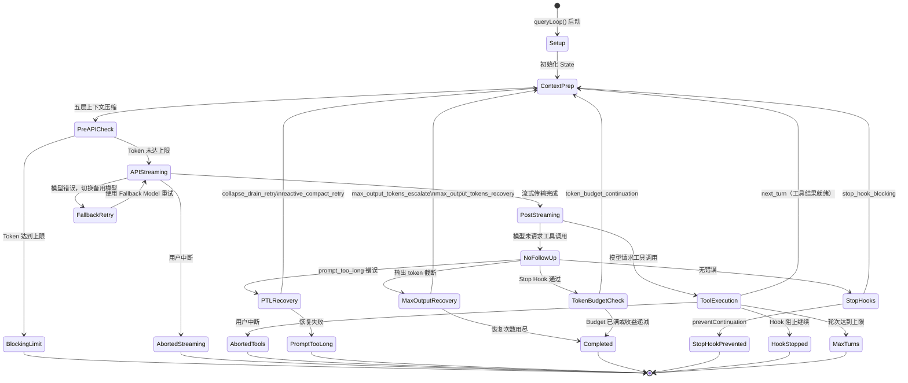
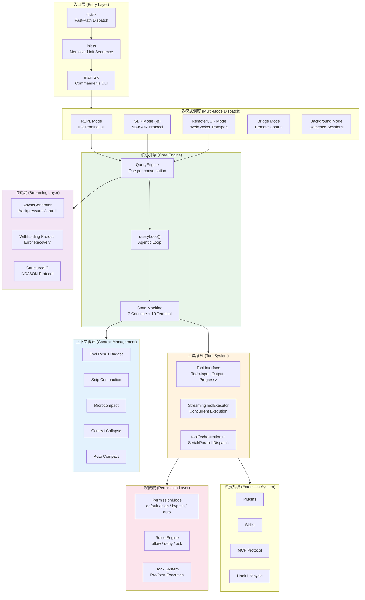

# 第一章：什么是 AI Harness？

> **本章摘要**
>
> 大语言模型（LLM）的"裸能力"与"产品能力"之间存在一道巨大的鸿沟。一个能写出正确代码片段的模型，和一个能在你的项目中安全地读取文件、执行命令、管理多轮对话、优雅处理错误的编码助手之间，差的不是更好的模型权重，而是一整套精密的工程框架。本章定义 **Harness**（编排框架）这一核心概念，以 Claude Code —— 一个 513,522 行 TypeScript、1,884 个源文件的生产级系统 —— 作为范本，系统阐述 Harness 的五大核心职责，并勾勒本书的整体结构。

---

## 1.1 裸能力与产品能力之间的鸿沟

2024-2025 年间，大语言模型的能力边界以令人目眩的速度扩展。模型可以生成编译通过的代码、合理的系统架构、甚至多步推理链。然而，当我们尝试将这些"裸能力"转化为可落地的开发者工具时，一系列工程问题随即浮现：

- **上下文有限**：模型的 Context Window 虽已扩展到 100K-1M tokens，但一个中型项目的代码量轻松超过这个上限。谁来决定什么内容进入窗口？
- **无法操作外部世界**：模型本身不能读写文件、执行 shell 命令、调用 API。谁来提供这些能力，并控制其安全边界？
- **单轮问答 vs. 多轮协作**：编码任务天然是多步的 —— 阅读代码、理解上下文、编写补丁、运行测试、修复错误。谁来维护这个循环？
- **错误不可避免**：网络断开、API 限流、上下文溢出、工具执行失败。谁来实现恢复策略？
- **安全性**：当 AI 获得执行 `rm -rf /` 的能力时，谁来守住安全底线？

这些问题的答案指向同一个工程实体：**Harness**。

### 模型能力 vs. 产品能力的差距



这道鸿沟不能靠"更好的 Prompt"来填平。它需要一个完整的软件系统 —— 一个 **Harness**。

---

## 1.2 定义：什么是 Harness？

**Harness 是将 AI 模型的裸能力编排为可用产品的框架。** 它位于模型 API 与终端用户之间，承担所有模型本身无法完成的工程职责。

这个定义有意选择了 "Harness" 而非 "Framework" 或 "Agent Runtime"。Harness 的词源含义是"驾驭线束" —— 正如马匹拥有奔跑的裸能力，harness 将其引导为有方向的拉力。AI 模型拥有推理和生成的裸能力，Harness 将其引导为安全、可控、可靠的产品行为。

从 Claude Code 的源码来看，这个类比尤为精确。在 `cli.tsx` 入口文件的注释中，工程团队甚至使用了 "Harness-science" 这个内部术语来描述他们对框架本身的科学化研究：

```typescript
// Harness-science L0 ablation baseline. Inlined here (not init.ts) because
// BashTool/AgentTool/PowerShellTool capture DISABLE_BACKGROUND_TASKS into
// module-level consts at import time — init() runs too late. feature() gate
// DCEs this entire block from external builds.
if (feature('ABLATION_BASELINE') && process.env.CLAUDE_CODE_ABLATION_BASELINE) {
  for (const k of [
    'CLAUDE_CODE_SIMPLE',
    'CLAUDE_CODE_DISABLE_THINKING',
    'DISABLE_INTERLEAVED_THINKING',
    'DISABLE_COMPACT',
    'DISABLE_AUTO_COMPACT',
    'CLAUDE_CODE_DISABLE_AUTO_MEMORY',
    'CLAUDE_CODE_DISABLE_BACKGROUND_TASKS',
  ]) {
    process.env[k] ??= '1';
  }
}
```

这段代码揭示了一个重要信息：Anthropic 团队通过系统地禁用 Harness 各层能力（Thinking、Compact、Auto Memory、Background Tasks），来量化每一层的价值贡献。这正是 Harness 的工程哲学 —— 每一层都是经过量化验证的独立价值模块。

### Harness 不是什么

在继续之前，有必要明确 Harness 的边界：

- **Harness 不是模型**。它不做推理，不生成文本。它是模型的运行容器。
- **Harness 不是 Prompt 工程**。System Prompt 是 Harness 的一个输入，但 Harness 远不止于此。
- **Harness 不是简单的 API Wrapper**。一个 `fetch` 调用加上 JSON 解析不构成 Harness。Harness 管理的是完整的交互生命周期。

---

## 1.3 Claude Code：一个范本级 Harness 案例

本书选择 Claude Code 作为 Harness 的解剖对象，原因有三：

**第一，规模够大。** 513,522 行 TypeScript 代码，1,884 个源文件，横跨 CLI 引擎、工具系统、权限框架、流式协议、终端渲染器、扩展系统等完整技术栈。这不是一个 demo，而是一个经受了数百万开发者使用检验的生产系统。

**第二，架构够深。** Claude Code 的架构覆盖了 Harness 需要解决的几乎所有核心问题：
- 一个基于 AsyncGenerator 的流式 Agentic Loop
- 一个带并发控制的工具执行引擎
- 一个支持多粒度压缩的上下文管理系统
- 一个分层的权限控制框架
- 一个支持 10 种运行模式的多态调度系统

**第三，工程决策够精。** 从 Build-time Dead Code Elimination（构建时死代码消除）到 memoized 初始化序列，从三层 AbortController 层级到 withholding protocol（消息扣留协议），处处可见高级系统设计的影子。

### 一个请求的生命周期

要理解 Harness 的价值，最直接的方式是追踪一个用户请求从输入到完成的完整生命周期。当你在终端输入 `"帮我修复这个 bug"` 并按下回车时，以下是 Claude Code 的 Harness 所做的事情：

1. **输入处理**：`processUserInput()` 检查是否为 slash command，解析输入格式
2. **System Prompt 组装**：`fetchSystemPromptParts()` 收集基础 prompt、memory prompt、自定义 prompt，通过 `asSystemPrompt()` 组装
3. **消息管理**：将用户消息压入 `mutableMessages` 数组，记录 transcript
4. **进入 Query Loop**：`QueryEngine.submitMessage()` 委托给 `query()` 函数

在 Query Loop 内部，每一轮迭代执行以下阶段：

5. **上下文准备**：应用 tool result budget、snip compaction、microcompact、context collapse、autocompact —— 五层压缩机制确保上下文不会溢出
6. **API 调用**：通过流式传输调用 Claude API，处理 fallback 模型切换
7. **工具执行**：解析模型返回的 `tool_use` block，通过权限系统验证，并发或串行执行工具
8. **结果注入**：将工具结果注入对话历史，回到步骤 5

这个循环持续运行，直到模型认为任务完成、用户中断、或触发 budget/turn 限制。

---

## 1.4 Harness 的五大核心职责

从 Claude Code 的源码分析中，我们可以提炼出 Harness 的五大核心职责。

### 1.4.1 工具编排 (Tool Orchestration)

模型需要与外部世界交互的能力 —— 读取文件、执行命令、搜索代码。Harness 通过 Tool System 提供这一能力。

在 Claude Code 中，每个工具通过 `Tool` 类型定义其完整接口：

```typescript
export type Tool<
  Input extends AnyObject = AnyObject,
  Output = unknown,
  P extends ToolProgressData = ToolProgressData,
> = {
  readonly name: string
  readonly inputSchema: Input
  call(
    args: z.infer<Input>,
    context: ToolUseContext,
    canUseTool: CanUseToolFn,
    parentMessage: AssistantMessage,
    onProgress?: ToolCallProgress<P>,
  ): Promise<ToolResult<Output>>
  isEnabled(): boolean
  isReadOnly(input: z.infer<Input>): boolean
  isConcurrencySafe(input: z.infer<Input>): boolean
  isDestructive?(input: z.infer<Input>): boolean
  maxResultSizeChars: number
  // ... 20+ 更多方法
}
```

注意 `isConcurrencySafe` 和 `isReadOnly` —— 这些不是可有可无的装饰。工具执行引擎（`StreamingToolExecutor` 和 `runTools`）依赖这些方法来决定执行策略：

```typescript
// 来自 toolOrchestration.ts
export async function* runTools(
  toolUseMessages: ToolUseBlock[],
  assistantMessages: AssistantMessage[],
  canUseTool: CanUseToolFn,
  toolUseContext: ToolUseContext,
): AsyncGenerator<MessageUpdate, void> {
  let currentContext = toolUseContext
  for (const { isConcurrencySafe, blocks } of partitionToolCalls(
    toolUseMessages, currentContext,
  )) {
    if (isConcurrencySafe) {
      // 并发执行只读工具
      for await (const update of runToolsConcurrently(blocks, ...)) {
        yield { message: update.message, newContext: currentContext }
      }
    } else {
      // 串行执行有副作用的工具
      for await (const update of runToolsSerially(blocks, ...)) {
        if (update.newContext) currentContext = update.newContext
        yield { message: update.message, newContext: currentContext }
      }
    }
  }
}
```

这段代码体现了 Harness 的核心价值：**模型只需要说"我想调用 Grep 搜索某个模式"，Harness 负责决定是并发还是串行执行，如何传播错误，如何在工具之间共享上下文**。

### 1.4.2 权限控制 (Permission Control)

当 AI 获得执行命令的能力时，安全性成为第一优先级。Claude Code 实现了一个多层权限系统：

```typescript
export type ToolPermissionContext = DeepImmutable<{
  mode: PermissionMode            // 'default' | 'plan' | 'bypass' | 'auto'
  alwaysAllowRules: ToolPermissionRulesBySource
  alwaysDenyRules: ToolPermissionRulesBySource
  alwaysAskRules: ToolPermissionRulesBySource
  isBypassPermissionsModeAvailable: boolean
  shouldAvoidPermissionPrompts?: boolean
  awaitAutomatedChecksBeforeDialog?: boolean
  // ...
}>
```

权限检查发生在每一次工具调用之前。在 SDK 模式下，权限系统甚至支持 **竞态决策（Permission Racing）**：Hook 和 SDK Host 同时评估权限请求，取先到者的结果。这是一个典型的工程权衡 —— 牺牲少量的确定性，换取显著的延迟优化。

### 1.4.3 上下文管理 (Context Management)

对话历史会不断增长，最终超过模型的 Context Window。Claude Code 实现了五层压缩机制来管理这一问题：

| 层级 | 机制 | 触发条件 | 压缩方式 |
|------|------|----------|----------|
| 1 | Tool Result Budget | 每轮迭代 | 截断过长的工具结果 |
| 2 | Snip Compaction | 历史过长时 | 移除中间轮次 |
| 3 | Microcompact | 每轮迭代 | 压缩冗余消息格式 |
| 4 | Context Collapse | 上下文溢出时 | 折叠已完成的工具调用 |
| 5 | Auto Compact | token 接近上限时 | 调用模型总结历史 |

这五层机制在 Query Loop 的每一轮迭代中按序执行，形成一个梯度压缩管线。更精妙的是，当常规压缩不足以应对 `prompt_too_long` 错误时，还有 **Reactive Compact** 作为最后的恢复手段。

### 1.4.4 多轮对话引擎 (Multi-Turn Conversation Engine)

Harness 的核心循环 —— Agentic Loop —— 是一个状态机，管理模型与工具之间的多轮交互。在 Claude Code 中，这个循环由 `queryLoop()` 函数实现：

```typescript
async function* queryLoop(
  params: QueryParams,
  consumedCommandUuids: string[],
): AsyncGenerator<
  StreamEvent | RequestStartEvent | Message | TombstoneMessage | ToolUseSummaryMessage,
  Terminal
>
```

循环的状态通过一个显式的 `State` 结构体管理：

```typescript
type State = {
  messages: Message[]
  toolUseContext: ToolUseContext
  autoCompactTracking: AutoCompactTrackingState | undefined
  maxOutputTokensRecoveryCount: number
  hasAttemptedReactiveCompact: boolean
  maxOutputTokensOverride: number | undefined
  pendingToolUseSummary: Promise<ToolUseSummaryMessage | null> | undefined
  stopHookActive: boolean | undefined
  turnCount: number
  transition: Continue | undefined
}
```

关键设计决策：**每次状态转换都创建新的 State 对象**（quasi-immutable transitions），而非修改原有状态。`transition` 字段记录了为什么从上一轮继续 —— 这使得调试和日志变得极其清晰。

循环有 7 种继续原因和 10 种终止原因，形成一个完整的状态转换图：



### 1.4.5 流式交互 (Streaming Interaction)

现代 AI 产品必须支持流式输出 —— 用户不能等待 30 秒才看到第一个字符。Claude Code 的 Harness 在每一层都基于 AsyncGenerator 实现流式传输：

```typescript
// QueryEngine 的 submitMessage 是一个 AsyncGenerator
async *submitMessage(
  prompt: string | ContentBlockParam[],
  options?: { uuid?: string; isMeta?: boolean },
): AsyncGenerator<SDKMessage, void, unknown>

// query() 也是一个 AsyncGenerator
export async function* query(
  params: QueryParams,
): AsyncGenerator<
  StreamEvent | RequestStartEvent | Message | TombstoneMessage | ToolUseSummaryMessage,
  Terminal
>
```

Generator 的使用不仅仅是为了流式传输。它还提供了一个关键的工程优势：**背压控制（Backpressure）**。消费者可以控制消费速度，不需要缓冲区管理。

更值得注意的是 **Withholding Protocol**（消息扣留协议）：当出现可恢复错误时，Harness 扣留错误消息，先尝试恢复，成功后继续循环，失败后才将错误传递给消费者。这确保了 SDK 消费者不会因为中间态错误而提前终止会话。

---

## 1.5 本书结构与阅读指南

本书围绕 Claude Code 的源码，从外到内、从宏观到微观地解剖 Harness 的每一层。

### 全书架构

| 篇章 | 主题 | 章节 | 核心问题 |
|------|------|------|----------|
| **第一篇** | 全局视野 | Ch.1-3 | Harness 是什么？整体架构如何？系统如何启动？ |
| **第二篇** | 核心引擎 | Ch.4-7 | QueryEngine 如何工作？Agentic Loop 如何运转？流式传输如何实现？上下文如何管理？ |
| **第三篇** | 工具系统 | Ch.8-11 | 工具接口如何设计？Bash/Read/Write 如何实现？执行引擎如何调度？权限如何控制？ |
| **第四篇** | Agent 编排 | Ch.12-15 | 单 Agent 如何定义？多 Agent 如何协调？任务如何路由？分布式执行如何实现？ |
| **第五篇** | 终端渲染 | Ch.16-18 | 自定义 React 渲染器如何工作？Yoga 布局如何集成？事件系统如何设计？ |
| **第六篇** | 扩展系统 | Ch.19-22 | 插件、Skills、MCP、Hook —— 四大扩展机制如何设计与实现？ |
| **第七篇** | 基础设施 | Ch.23-25 | 配置系统、Session 管理、分析与遥测如何支撑整个框架？ |
| **第八篇** | 设计模式 | Ch.26-28 | 从 Claude Code 提炼了哪些可复用的 Harness 设计模式？如何构建你自己的 Harness？ |

### 阅读建议

- **架构师/技术负责人**：从第一篇开始，重点阅读第二篇（核心引擎）和第八篇（设计模式）
- **系统工程师**：第二篇和第三篇是核心，特别是 Agentic Loop 和 Tool Execution 章节
- **安全工程师**：直接跳到第三篇第 11 章（权限系统）和第六篇第 22 章（Hook 系统）
- **前端/全栈工程师**：第五篇的终端渲染器章节展示了一个非标准环境下的 React 工程实践
- **正在构建自己的 AI Agent 系统的开发者**：第八篇是你的行动指南

---

## 1.6 Claude Code 全局架构总览

下图展示了 Claude Code 作为一个完整 Harness 的全局架构。后续章节将逐层深入每一个模块。



---

## 1.7 小结

本章建立了一个核心认知：**AI 模型的产品化不是一个 Prompt 工程问题，而是一个系统工程问题。** Harness 是解决这个问题的框架，其核心职责包括工具编排、权限控制、上下文管理、多轮对话引擎和流式交互。

Claude Code 是目前公开可分析的最复杂的 Harness 实现之一。它的 513,522 行代码不是过度工程 —— 每一行代码都在回答一个具体的工程问题：如何在模型的裸能力与用户的产品需求之间架起一座可靠的桥。

从下一章开始，我们将进入这座桥的内部结构。
