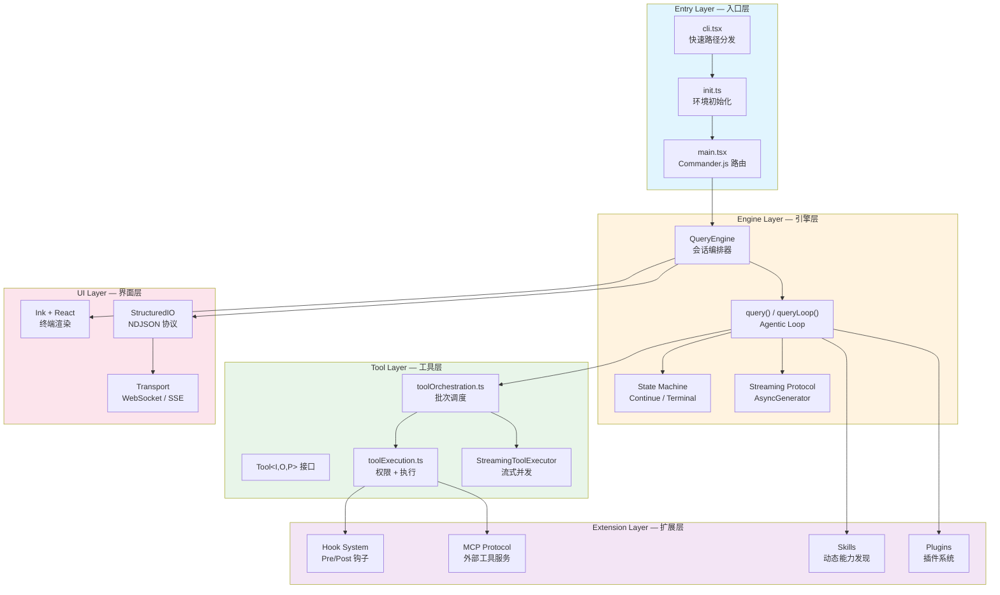
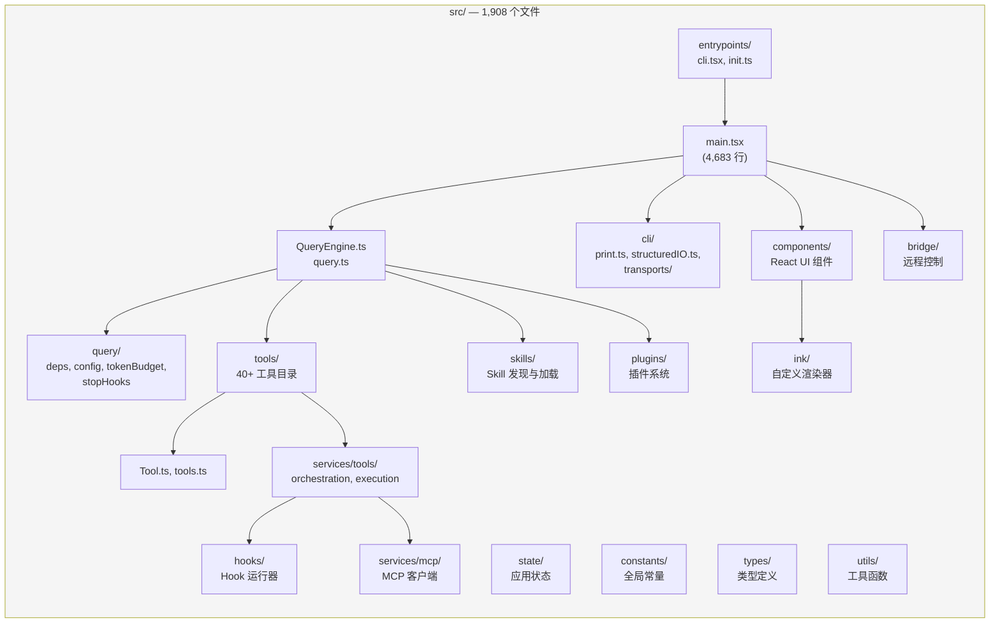

# 第二章：架构鸟瞰

> 513,522 行 TypeScript，1,908 个文件。一个成熟的 AI Agent 编排框架，其内部结构到底是什么样的？

本章将从宏观视角俯瞰 Claude Code 的完整架构。我们将依次拆解五层架构、核心数据流、关键设计决策、目录结构，以及底层技术栈选型。读完本章后，你应当能够在脑中建立起整个系统的空间模型——后续每一章的深入分析都将在这个框架中展开。

---

## 2.1 五层架构

Claude Code 的代码组织遵循清晰的分层原则。从外到内，我们可以将整个系统划分为五个层次：**Entry Layer（入口层）**、**Engine Layer（引擎层）**、**Tool Layer（工具层）**、**UI Layer（界面层）** 和 **Extension Layer（扩展层）**。



### Entry Layer（入口层）

入口层的核心职责是 **快速路径分发（fast-path dispatch）**。`cli.tsx` 是整个程序的最外层入口，它通过一张优先级表检测命令行参数，将请求路由到对应的子系统——绝大多数路径都不需要加载完整的 CLI 模块。

关键设计点：

- **所有 import 都是动态的**（`await import(...)`），避免加载不必要的模块
- `feature()` 函数来自 `bun:bundle`，实现**构建时死代码消除（DCE）**——被关闭的 feature flag 对应的代码在编译后完全消失，产物中零字节
- `startCapturingEarlyInput()` 在完整 CLI 加载前就开始缓冲 stdin 击键——用户在启动期间输入的内容不会丢失
- `init.ts` 通过 `memoize` 确保只执行一次，并将网络预连接（`preconnectAnthropicApi()`）与模块加载并行执行，节省约 100-200ms

入口层支持 10+ 种运行模式：

| 模式 | 入口 | I/O | 典型场景 |
|------|------|-----|---------|
| **REPL**（交互模式） | `claude` | Ink 终端 UI | 开发者工作站 |
| **SDK / Headless** | `claude -p "prompt"` | stdin/stdout NDJSON | Agent SDK, CI/CD |
| **Remote / CCR** | `CLAUDE_CODE_REMOTE=true` | WebSocket/SSE | 云端托管会话 |
| **Bridge** | `claude remote-control` | HTTP 轮询 + 子进程 | 远程控制宿主 |
| **Background** | `claude --bg` | 分离式会话 | 非阻塞后台任务 |
| **Server** | `--direct-connect-server-url` | WebSocket | 直连服务器 |

### Engine Layer（引擎层）

引擎层是整个系统的心脏。`QueryEngine` 是会话级编排器，**每个会话对应一个实例**。它内部的 `queryLoop()` 实现了 Agentic Loop——一个 `while(true)` 循环，驱动"API 调用 -> 工具执行 -> 上下文管理 -> 下一轮"这个核心循环。

引擎层的两个关键抽象：

1. **AsyncGenerator 流式协议** —— `submitMessage()` 和 `query()` 都是 `AsyncGenerator`，通过 `yield` 逐条推送消息，天然支持流式传输和背压控制
2. **State Machine 状态机** —— 循环的每次迭代由 `State` 结构体驱动，所有状态转换通过 `Continue`（继续原因）和 `Terminal`（终止原因）两个标签类型显式标记

### Tool Layer（工具层）

工具层定义了 AI 与外部世界交互的边界。所有工具——内置的、MCP 外部的、动态加载的——都必须实现同一个 `Tool<Input, Output, Progress>` 接口。这个接口包含 40+ 个方法，覆盖身份标识、Schema 定义、核心执行、权限校验、行为声明、结果处理和 UI 渲染等全部关切。

工具执行由 `toolOrchestration.ts` 协调，采用**分区并发模型**：

- 连续的并发安全工具（如 Read、Glob、Grep）合并为一个批次并行执行
- 非并发安全工具（如 Edit、Write）独占执行，保证顺序
- 默认并发上限为 10

### UI Layer（界面层）

界面层提供两条完全不同的渲染路径：

1. **交互模式** —— 基于 React + Ink + Yoga 的终端 UI，支持 Flexbox 布局、差分更新、键盘事件
2. **Headless 模式** —— 基于 `StructuredIO` 的 NDJSON 协议，支持 SDK 集成、权限请求/响应、控制消息

传输层抽象了三种通信协议：WebSocket（低延迟双向）、SSE（读路径低延迟 + HTTP POST 写）、Hybrid（WebSocket 读 + HTTP POST 写）。

### Extension Layer（扩展层）

扩展层提供四种机制来扩展系统能力：

1. **Hook System** —— Pre/Post 钩子，可以拦截、修改或阻止工具执行
2. **MCP Protocol** —— Model Context Protocol，连接外部工具服务器
3. **Skills** —— 动态能力发现和加载，按需扩展 Agent 技能
4. **Plugins** —— 插件系统，第三方扩展入口

---

## 2.2 核心数据流

理解了五层架构后，我们来追踪一条完整的用户请求是如何在系统中流转的。

```mermaid
sequenceDiagram
    participant User as 用户
    participant Entry as Entry Layer
    participant Engine as QueryEngine
    participant Loop as queryLoop()
    participant API as Claude API
    participant Tools as Tool Executor
    participant UI as UI Layer

    User->>Entry: 输入文本/命令
    Entry->>Engine: submitMessage(prompt)

    Note over Engine: 1. 解析配置
    Note over Engine: 2. 构建 System Prompt
    Note over Engine: 3. 处理用户输入<br/>(Slash Commands)
    Note over Engine: 4. 加载 Skills & Plugins

    Engine->>Loop: yield* query(params)

    loop Agentic Loop
        Note over Loop: Phase 1: 上下文管理<br/>Snip / Microcompact /<br/>Context Collapse / Autocompact

        Loop->>API: callModel(messages, tools, system)
        API-->>Loop: stream events (AsyncGenerator)
        Loop-->>UI: yield stream_event / assistant

        alt 无工具调用
            Note over Loop: Stop Hooks 检查
            Note over Loop: Token Budget 检查
            Loop-->>Engine: return Terminal{completed}
        else 有工具调用
            Loop->>Tools: runTools() / StreamingToolExecutor
            Note over Tools: 1. 分区: 并发 vs 串行
            Note over Tools: 2. 权限校验 (Hooks + canUseTool)
            Note over Tools: 3. 执行 tool.call()
            Note over Tools: 4. 结果预算控制
            Tools-->>Loop: yield MessageUpdate
            Loop-->>UI: yield progress / tool_result
            Note over Loop: continue → next_turn
        end
    end

    Engine-->>UI: yield result{success/error}
    UI-->>User: 渲染最终结果
```

### Phase 1: System Prompt 组装

每次 `submitMessage()` 调用时，引擎会重新组装 System Prompt。这不是简单的字符串拼接——它是一个多来源、按优先级排列的 Prompt 组装流水线：

1. **基础 System Prompt** —— 定义 Agent 的核心行为和约束
2. **用户上下文（User Context）** —— 环境信息：操作系统、工作目录、Git 状态等
3. **Memory Prompt** —— 从 CLAUDE.md 文件链加载的项目/用户记忆
4. **追加提示（Append Prompt）** —— SDK 调用方注入的额外指令
5. **工具描述** —— 每个可用工具的 `prompt()` 方法输出

这个设计确保了 **Prompt Cache 的稳定性**——内置工具按名称排序形成前缀，MCP 工具作为独立分区追加。工具集变化时，前缀保持不变，最大化缓存命中率。

### Phase 2: API 流式调用

`queryLoop()` 通过 `callModel()` 向 Claude API 发起流式请求。响应以 `AsyncGenerator` 的形式逐条到达。在流式接收过程中，引擎同时进行：

- **Tool Use 块回填（Backfill）** —— 当 `tool_use` 块的输入完整后，立即将其交给 `StreamingToolExecutor` 开始执行
- **错误扣留（Withholding）** —— 413（Prompt Too Long）和 Max Output Tokens 错误不会立即暴露给消费者，而是先尝试恢复
- **Fallback 模型切换** —— 如果主模型失败，透明地切换到 fallback 模型重试

### Phase 3: 工具执行

工具执行遵循严格的六阶段流水线：

```
输入验证 → 输入准备 → Pre-Tool Hooks → 权限决议 → 工具执行 → Post-Tool Hooks
```

**权限决议（Permission Resolution）** 是这个流水线中最复杂的环节。它需要协调三个来源的决策：

1. 静态权限规则（allow/deny/ask 规则集）
2. Hook 返回的权限结果
3. SDK 宿主的交互式授权

在 SDK 模式下，Hook 和 SDK 宿主的权限检查通过 `Promise.race` 竞争——谁先返回结果就用谁的，另一个被取消。

### Phase 4: 上下文管理

随着多轮对话的推进，上下文长度不断增长。引擎维护了一套多级压缩策略，按激进程度递增：

1. **Microcompact** —— 压缩旧的工具结果，减少冗余细节
2. **Snip Compaction** —— 剪切历史中间段，保留头尾
3. **Context Collapse** —— 折叠大块内容为摘要
4. **Autocompact** —— 自动触发全量压缩，生成 compact boundary
5. **Reactive Compact** —— 413 错误的应急恢复

### Phase 5: 状态转换

每次循环迭代以一个 `Continue` 或 `Terminal` 标签结束。这不是 ad-hoc 的 break/continue——每个转换点都被显式标记了原因：

| Continue 原因 | 触发条件 |
|---|---|
| `next_turn` | 工具结果就绪，需要调用 API 处理 |
| `collapse_drain_retry` | 413 错误，上下文折叠后重试 |
| `reactive_compact_retry` | 413/媒体错误，应急压缩后重试 |
| `max_output_tokens_escalate` | 输出截断，提升到 64k token 重试 |
| `token_budget_continuation` | Token 预算未达 90%，注入继续提示 |

| Terminal 原因 | 触发条件 |
|---|---|
| `completed` | 模型完成，无工具调用，无 Hook 阻止 |
| `aborted_streaming` | AbortController 在流式传输中触发 |
| `prompt_too_long` | 413 错误且无法恢复 |
| `max_turns` | 轮次达到上限 |
| `stop_hook_prevented` | Stop Hook 显式阻止继续 |

---

## 2.3 关键设计决策

### 决策一：Generator-Based Streaming

Claude Code 在几乎所有需要流式传输的场景中都使用了 `AsyncGenerator`：

```typescript
// QueryEngine.submitMessage —— 会话入口
async *submitMessage(prompt): AsyncGenerator<SDKMessage>

// query() —— Agentic Loop
async function* query(params): AsyncGenerator<StreamEvent | Message, Terminal>

// runTools() —— 工具执行
async function* runTools(blocks): AsyncGenerator<MessageUpdate>
```

**为什么选择 Generator 而不是 EventEmitter 或 Observable？**

1. **背压（Backpressure）天然内建** —— 消费者不调用 `next()` 时生产者自动暂停，不会出现内存溢出
2. **`yield*` 实现协议透明传递** —— `query()` 的输出通过 `yield*` 直接穿透到 `submitMessage()` 的消费者，无需手动转发
3. **`return` 值携带终止语义** —— Generator 的 `return` 类型是 `Terminal`，明确标记循环为何结束
4. **取消通过 AbortController 组合** —— Generator 与 AbortController 配合，调用 `.return()` 即可干净退出

这个选择深刻影响了整个代码库的形态——你会在 Tool Executor、Hook Runner、Compact Pipeline 等各处看到同样的 Generator 模式。

### 决策二：Plugin Architecture 与工具系统

工具系统的核心设计原则是 **Fail-Closed Defaults（失败则关闭）**：

```typescript
const TOOL_DEFAULTS = {
  isConcurrencySafe: () => false,  // 假设不安全 → 串行执行
  isReadOnly: () => false,          // 假设有写操作 → 需要权限
  isDestructive: () => false,
  checkPermissions: (input) => Promise.resolve({ behavior: 'allow', updatedInput: input }),
}
```

忘记声明 `isConcurrencySafe` 的工具会被当作串行执行——这防止了带有副作用的工具被意外并行运行。忘记声明 `isReadOnly` 的工具会被当作写操作——这确保了权限系统不会遗漏。

`buildTool()` 工厂函数负责将作者的简洁定义（`ToolDef`）与这些安全默认值合并，生成完整的 `Tool` 对象。TypeScript 的映射类型确保编译时类型与运行时 spread 顺序一致。

### 决策三：Feature Gates + Dead Code Elimination

Claude Code 使用 Bun 的 `feature()` 宏实现构建时特性门控：

```typescript
import { feature } from 'bun:bundle';

if (feature('BRIDGE_MODE') && args[0] === 'remote-control') {
  const { bridgeMain } = await import('../bridge/bridgeMain.js');
  await bridgeMain(args.slice(1));
  return;
}
// 当 BRIDGE_MODE=false 时，以上代码在编译后完全消失
```

代码库中有 30+ 个 feature flag，覆盖从 Bridge 系统到 Voice 模式的各种实验性功能。这种机制带来三个关键优势：

1. **产物体积控制** —— 外部发布版本不包含内部实验代码，零运行时开销
2. **安全边界** —— 未发布功能的代码路径在编译时被物理移除，无法通过环境变量激活
3. **渐进式发布** —— Feature flag 可以在 GrowthBook 中按用户群体逐步开放

除了 `feature()` 之外，运行时门控还有 `process.env.USER_TYPE`（区分内部/外部用户）、`isEnvTruthy()`（环境变量检查）、GrowthBook 远程配置等多种机制。

---

## 2.4 代码库结构指南



### 目录详解

```
src/
├── entrypoints/             # 入口层
│   ├── cli.tsx              # 最外层入口，快速路径分发表（302 行）
│   └── init.ts              # 环境初始化，memoized，只执行一次（341 行）
│
├── main.tsx                 # Commander.js 完整路由（4,683 行）
│                            # 200+ 模块导入，侧效应优化启动时间
│
├── QueryEngine.ts           # 会话编排器，一个实例 per 会话
├── query.ts                 # Agentic Loop 的 while(true) 实现
├── query/                   # Loop 的辅助模块
│   ├── deps.ts              # 依赖注入：callModel, autocompact, uuid
│   ├── config.ts            # 不可变查询配置快照
│   ├── tokenBudget.ts       # Token 预算跟踪与继续判定
│   └── stopHooks.ts         # Stop Hook 执行逻辑
│
├── Tool.ts                  # Tool<I,O,P> 接口定义（单文件，核心契约）
├── tools.ts                 # 工具注册表：getAllBaseTools(), getTools()
├── tools/                   # 40+ 工具实现
│   ├── BashTool/            # Shell 命令执行
│   ├── FileReadTool/        # 文件读取
│   ├── FileEditTool/        # 文件编辑（精确字符串替换）
│   ├── FileWriteTool/       # 文件写入
│   ├── GlobTool/            # 文件名模式匹配
│   ├── GrepTool/            # 内容搜索（基于 ripgrep）
│   ├── AgentTool/           # 子 Agent 派生
│   ├── WebFetchTool/        # HTTP 请求
│   ├── SkillTool/           # Skill 调用
│   ├── ToolSearchTool/      # 延迟加载工具搜索
│   └── ...                  # NotebookEdit, TodoWrite, WebSearch 等
│
├── services/
│   └── tools/
│       ├── toolOrchestration.ts   # 批次分区与并发调度
│       ├── toolExecution.ts       # 权限检查 + 单工具执行（~600 行）
│       └── StreamingToolExecutor.ts # 流式并发执行器
│
├── cli/                     # CLI 层
│   ├── print.ts             # Headless/SDK 执行路径（5,594 行，最大文件）
│   ├── structuredIO.ts      # NDJSON 协议实现（860 行）
│   ├── remoteIO.ts          # Remote/CCR 传输层
│   └── transports/          # 传输协议实现
│       ├── Transport.ts     # 传输接口
│       ├── WebSocketTransport.ts   # WebSocket（含重连）
│       ├── SSETransport.ts         # Server-Sent Events
│       └── HybridTransport.ts      # WebSocket 读 + HTTP POST 写
│
├── components/              # React 组件（Ink 渲染）
├── ink/                     # 自定义 Ink 渲染器
├── screens/                 # 页面级组件
│
├── hooks/                   # Hook 运行器与事件系统
├── skills/                  # Skill 发现、加载、搜索
├── plugins/                 # 插件系统
├── bridge/                  # Remote Control 桥接系统
├── coordinator/             # 多 Agent 协调模式
├── tasks/                   # 任务管理系统
│
├── state/                   # 应用状态管理
├── constants/               # 全局常量（toolLimits 等）
├── types/                   # TypeScript 类型定义
├── utils/                   # 通用工具函数
├── migrations/              # 配置迁移系统（当前版本 11）
├── schemas/                 # Zod Schema 定义
├── context/                 # 上下文管理与压缩
└── upstreamproxy/           # CCR 上游代理
```

### 几个值得注意的数字

| 文件 | 行数 | 角色 |
|------|------|------|
| `cli/print.ts` | 5,594 | Headless/SDK 编排，最大单文件 |
| `main.tsx` | 4,683 | Commander.js 路由与完整启动 |
| `services/tools/toolExecution.ts` | ~600 | 工具执行核心流水线 |
| `cli/structuredIO.ts` | 860 | NDJSON 协议与权限竞争 |
| `entrypoints/cli.tsx` | 302 | 快速路径分发（最薄的入口） |
| `entrypoints/init.ts` | 341 | Memoized 初始化序列 |

---

## 2.5 技术栈

### 运行时与语言

**TypeScript + Bun** 是整个项目的基础。选择 Bun 而非 Node.js 带来了几个关键能力：

- **`bun:bundle` 的 `feature()` 宏** —— 构建时死代码消除，这是 Feature Gate 系统的基石
- **原生 WebSocket** —— Bun 内置 WebSocket 支持，避免 `ws` npm 包的开销（Node.js 环境仍通过条件导入回退到 `ws`）
- **更快的启动时间** —— 对 CLI 工具而言，冷启动性能至关重要

```typescript
// 运行时检测与兼容
if (typeof Bun !== 'undefined') {
  // Bun 原生 WebSocket，支持代理与 TLS 选项
  const ws = new globalThis.WebSocket(url, { headers, proxy, tls });
} else {
  // Node.js 回退到 ws 包
  const { default: WS } = await import('ws');
  const ws = new WS(url, { headers, agent, ...tlsOptions });
}
```

### 终端 UI

**React + Ink + Yoga** 组成了终端 UI 渲染栈：

- **React** —— 组件化 UI，声明式状态管理
- **Ink** —— 将 React 组件渲染到终端（TTY），支持 Flexbox 布局
- **Yoga** —— Facebook 的跨平台布局引擎，为 Ink 提供 Flexbox 计算能力

这个组合使得终端 UI 可以像 Web 应用一样使用组件、状态、Hooks 等 React 生态工具。Claude Code 还在 `ink/` 目录下维护了自定义渲染层，处理差分更新和终端特殊行为。

### Schema 验证

**Zod** 是唯一的 Schema 验证库，用于：

- 工具输入验证（`Tool.inputSchema` 是 Zod Schema）
- 配置验证
- API 响应验证
- Feature flag 配置验证

### CLI 框架

**Commander.js** 处理命令行参数解析和子命令路由。`main.tsx` 使用 Commander 定义了完整的命令树，包括 `--version`、`--print`、`update`、`daemon` 等数十个子命令。

### 构建与打包

| 工具 | 用途 |
|------|------|
| **Bun bundler** | 打包、DCE、feature flag 展开 |
| **TypeScript** | 类型检查（但不用 `tsc` 编译） |
| **Zod** | 运行时 Schema 验证 |
| **Commander.js** | CLI 参数解析 |

### 可观测性

- **OpenTelemetry** —— 分布式追踪，延迟加载（~400KB protobuf + ~700KB gRPC）
- **GrowthBook** —— Feature flag 远程配置与 A/B 测试
- **自研 Startup Profiler** —— `profileCheckpoint()` 追踪每个启动阶段的耗时

### 依赖注入

引擎层使用 **显式 DI（Dependency Injection）** 而非框架：

```typescript
export type QueryDeps = {
  callModel: typeof queryModelWithStreaming
  microcompact: typeof microcompactMessages
  autocompact: typeof autoCompactIfNeeded
  uuid: () => string
}
```

测试代码直接传入 mock 实现，不需要 `spyOn` 或模块替换。`typeof fn` 的类型签名确保 mock 与真实实现自动保持同步。

---

## 2.6 本章小结

Claude Code 的架构可以用一句话概括：**一个基于 AsyncGenerator 的流式 Agentic Loop，运行在五层分离的 TypeScript 代码库中，通过 Feature Gates 实现构建时裁剪，通过 Plugin/Hook/MCP/Skill 四种机制实现运行时扩展。**

关键要点：

1. **分层清晰** —— Entry、Engine、Tool、UI、Extension 五层职责分明，依赖方向自上而下
2. **Generator 贯穿全栈** —— 从 `submitMessage()` 到 `runTools()`，AsyncGenerator 是唯一的流式传输原语
3. **安全默认** —— 工具系统 Fail-Closed，忘记声明就按最保守假设执行
4. **编译时裁剪** —— `feature()` + DCE 确保外部产物不包含实验代码
5. **多模式适配** —— 同一个 Engine 通过不同的 I/O 层适配 REPL、SDK、Remote 等场景

从下一章开始，我们将深入每一层的实现细节。第三章将首先拆解启动序列——从 `cli.tsx` 的第一行代码到 REPL 渲染出第一帧画面，整个过程中发生了什么。
