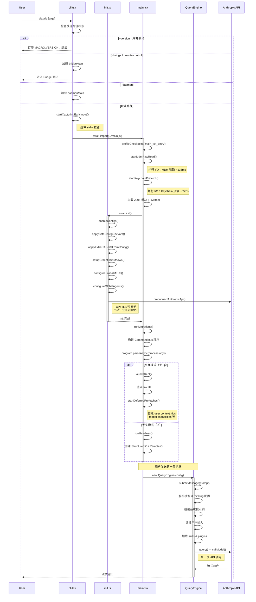

# 第三章：启动引导与生命周期

> 从命令行输入到第一次 API 调用，Claude Code 经历了一条精心设计的启动链路。每一层都在权衡两个矛盾的需求：尽可能快地响应用户，同时完成一个分布式系统所需的全部初始化工作。本章将逐层拆解这条链路，分析其中的性能优化策略与工程取舍。

## 3.1 启动链路全景

当用户在终端键入 `claude` 并按下回车，系统将依次经过三个文件完成启动：

```
cli.tsx  -->  init.ts  -->  main.tsx  -->  QueryEngine
```

这条链路的设计原则是**渐进式加载**（progressive loading）：每一层只加载当前阶段必需的模块，将重量级依赖推迟到最晚可能的时刻。这不是简单的"延迟加载"——它是一种经过精确测量的分层策略，每个阶段都有 `profileCheckpoint()` 打点，确保启动时间的任何回归都能被立即发现。

下面我们沿着这条链路，逐层深入。

## 3.2 cli.tsx -- 快速路径分发

**文件：** `src/entrypoints/cli.tsx`（302 行）

`cli.tsx` 是整个系统的最外层入口点。它的核心设计思想是一个词：**快速路径**（fast-path dispatch）。在加载完整 CLI 之前，它首先检查一系列特殊标志和子命令，如果匹配则立即执行并退出，避免加载任何不必要的模块。

### 3.2.1 顶层副作用

文件顶部有三段在任何函数调用之前执行的 side-effect 代码：

```typescript
import { feature } from 'bun:bundle';

// 1. 禁用 corepack 自动 pinning
process.env.COREPACK_ENABLE_AUTO_PIN = '0';

// 2. 为 CCR 容器设置最大堆内存（16GB 机器）
if (process.env.CLAUDE_CODE_REMOTE === 'true') {
  process.env.NODE_OPTIONS = existing
    ? `${existing} --max-old-space-size=8192`
    : '--max-old-space-size=8192';
}

// 3. Ablation baseline：feature-gated DCE 块
if (feature('ABLATION_BASELINE') && process.env.CLAUDE_CODE_ABLATION_BASELINE) {
  for (const k of [
    'CLAUDE_CODE_SIMPLE',
    'CLAUDE_CODE_DISABLE_THINKING',
    'DISABLE_INTERLEAVED_THINKING',
    // ... 更多环境变量
  ]) {
    process.env[k] ??= '1';
  }
}
```

这里的 `feature()` 函数来自 `bun:bundle`，是一个**编译时宏**。当 Bun bundler 构建生产包时，它根据 feature flag 配置将 `feature('X')` 替换为 `true` 或 `false`，然后通过 dead code elimination (DCE) 完全移除不可达的分支。这意味着在外部发布版本中，被禁用 feature 保护的代码块占用的空间是**零字节**。

### 3.2.2 快速路径分发表

`main()` 函数实现了一个按优先级排序的分发表。这是理解 Claude Code 启动行为的关键：

| 优先级 | 条件 | 动作 | 加载的模块数 |
|--------|------|------|-------------|
| 1 | `--version` / `-v` | 打印 `MACRO.VERSION` 并退出 | 零 |
| 2 | `--dump-system-prompt` | 渲染系统提示词并退出 | config, model, prompts |
| 3 | `--claude-in-chrome-mcp` | 运行 Chrome MCP 服务器 | claudeInChrome/mcpServer |
| 4 | `--chrome-native-host` | 运行 Chrome native host | claudeInChrome/chromeNativeHost |
| 5 | `--computer-use-mcp` | 运行计算机使用 MCP 服务器 | computerUse/mcpServer |
| 6 | `--daemon-worker` | 运行 daemon worker | daemon/workerRegistry |
| 7 | `remote-control` / `rc` / `bridge` | Bridge 模式主循环 | bridge/bridgeMain |
| 8 | `daemon` | Daemon supervisor | daemon/main |
| 9 | `ps` / `logs` / `attach` / `kill` / `--bg` | 后台 session 管理 | cli/bg |
| 10 | `new` / `list` / `reply` | 模板任务 | cli/handlers/templateJobs |
| 11 | `environment-runner` | BYOC runner | environment-runner/main |
| 12 | `self-hosted-runner` | Self-hosted runner | self-hosted-runner/main |
| 13 | `--tmux` + `--worktree` | Tmux worktree 执行 | utils/worktree |
| 14 | `--update` / `--upgrade` | 重写为 `update` 子命令 | （重写 argv） |
| 15 | `--bare` | 提前设置 SIMPLE 环境变量 | （环境变量） |
| **DEFAULT** | 以上都不匹配 | 加载完整 CLI | 全部模块 |

这张表揭示了一个重要的设计决策：**`--version` 的成本是零**。它不 import 任何模块，不初始化任何子系统——版本号 `MACRO.VERSION` 在编译时被内联为字符串常量。这使得 `claude --version` 成为一个近乎瞬时的操作，这在 CI/CD 环境中尤其重要，因为版本检查可能在每次构建时执行。

### 3.2.3 默认路径——进入完整 CLI

当没有匹配到任何快速路径时，执行进入默认路径：

```typescript
// 没有检测到特殊标志，加载并运行完整 CLI
const { startCapturingEarlyInput } = await import('../utils/earlyInput.js');
startCapturingEarlyInput();
profileCheckpoint('cli_before_main_import');
const { main: cliMain } = await import('../main.js');
profileCheckpoint('cli_after_main_import');
await cliMain();
profileCheckpoint('cli_after_main_complete');
```

这段代码有三个值得注意的设计点：

1. **所有 import 都是动态的**（`await import(...)`），避免在快速路径下加载不需要的模块。
2. **`startCapturingEarlyInput()`** 在加载完整 CLI 之前开始缓冲 stdin 按键。这意味着用户在启动过程中输入的任何内容都不会丢失——它们被缓冲起来，等 REPL 准备好后回放。
3. **`profileCheckpoint()`** 出自 `startupProfiler` 模块，在每个阶段埋点以监控启动性能。

## 3.3 init.ts -- 初始化序列

**文件：** `src/entrypoints/init.ts`（341 行）

`init()` 是 `cli.tsx` 进入 `main.tsx` 后首先调用的函数。它通过 `memoize` 包装，保证**不论调用多少次，只执行一次**。它的职责是完成 REPL 渲染前必须就位的所有环境设置。

```typescript
export const init = memoize(async (): Promise<void> => {
  // Phase 1: 配置
  enableConfigs();
  applySafeConfigEnvironmentVariables();
  applyExtraCACertsFromConfig();  // 必须在任何 TLS 之前（Bun 在启动时缓存 TLS）

  // Phase 2: 关停与清理
  setupGracefulShutdown();

  // Phase 3: 分析（fire-and-forget）
  void Promise.all([
    import('../services/analytics/firstPartyEventLogger.js'),
    import('../services/analytics/growthbook.js'),
  ]).then(([fp, gb]) => {
    fp.initialize1PEventLogging();
    gb.onGrowthBookRefresh(() => {
      void fp.reinitialize1PEventLoggingIfConfigChanged();
    });
  });

  // Phase 4: 认证与远程设置
  void populateOAuthAccountInfoIfNeeded();
  void initJetBrainsDetection();
  void detectCurrentRepository();
  if (isEligibleForRemoteManagedSettings()) {
    initializeRemoteManagedSettingsLoadingPromise();
  }
  if (isPolicyLimitsEligible()) {
    initializePolicyLimitsLoadingPromise();
  }

  // Phase 5: 网络
  configureGlobalMTLS();
  configureGlobalAgents();    // Proxy 设置
  preconnectAnthropicApi();   // TCP+TLS 握手重叠（节省 ~100-200ms）

  // Phase 6: CCR Upstream Proxy（条件执行）
  if (isEnvTruthy(process.env.CLAUDE_CODE_REMOTE)) {
    const { initUpstreamProxy, getUpstreamProxyEnv } = await import(
      '../upstreamproxy/upstreamproxy.js'
    );
    const { registerUpstreamProxyEnvFn } = await import(
      '../utils/subprocessEnv.js'
    );
    registerUpstreamProxyEnvFn(getUpstreamProxyEnv);
    await initUpstreamProxy();
  }

  // Phase 7: 平台特定
  setShellIfWindows();
  registerCleanup(shutdownLspServerManager);

  // Phase 8: Scratchpad
  if (isScratchpadEnabled()) {
    await ensureScratchpadDir();
  }
});
```

### 3.3.1 八个阶段的编排逻辑

这八个阶段的顺序不是随意的，它们之间存在严格的依赖关系：

**Phase 1（配置）** 必须最先执行，因为后续所有阶段都依赖配置值。特别注意 `applyExtraCACertsFromConfig()` ——它必须在任何 TLS 连接建立之前执行，因为 Bun 运行时在首次 TLS 握手时缓存证书链，之后的更改不会生效。

**Phase 2（关停）** 在配置之后立即注册，确保即使后续阶段崩溃，清理逻辑也已就位。

**Phase 3（分析）** 使用 `void` 表达式启动 Promise 但不等待结果——这是 fire-and-forget 模式。分析系统的初始化延迟不应阻塞用户交互。

**Phase 4（认证）** 同样采用 fire-and-forget 模式。OAuth 信息填充、JetBrains 检测、仓库检测都在后台并行进行。

**Phase 5（网络）** 是最关键的性能优化点。`preconnectAnthropicApi()` 在完整 CLI 还未加载完成时就开始 TCP + TLS 握手。这个预连接与后续的模块加载并行执行，节省约 100-200ms 的网络延迟。

**Phase 6（CCR Proxy）** 只在远程容器环境中执行。注意这里使用了 `await`——upstream proxy 的初始化是阻塞的，因为后续所有网络请求都要通过它路由。

**Phase 7 & 8** 处理平台兼容性和可选功能。

### 3.3.2 信任后的 Telemetry 初始化

Telemetry 不在 `init()` 中初始化——它被推迟到"信任建立之后"：

```typescript
export function initializeTelemetryAfterTrust(): void {
  if (isEligibleForRemoteManagedSettings()) {
    void waitForRemoteManagedSettingsToLoad()
      .then(async () => {
        applyConfigEnvironmentVariables();  // 信任后才应用完整环境变量
        await doInitializeTelemetry();
      });
  } else {
    void doInitializeTelemetry();
  }
}
```

这个设计区分了"安全"环境变量和"完整"环境变量。在用户确认信任项目配置之前，只应用安全的子集。这是一个安全边界：恶意项目配置不应在用户同意前影响系统行为。

## 3.4 main.tsx -- 完整 CLI 的心脏

**文件：** `src/main.tsx`（4,683 行）

`main.tsx` 是整个 CLI 的核心文件。它以三条**性能关键的 side-effect** 语句开头，这些语句必须在常规 import 之前执行：

```typescript
// Side-effect #1: 启动性能标记
profileCheckpoint('main_tsx_entry');

// Side-effect #2: 并行启动 MDM subprocess 读取（~135ms）
startMdmRawRead();

// Side-effect #3: 预读取 macOS keychain（节省 ~65ms）
startKeychainPrefetch();
```

这三条语句的目的是**将 I/O 与模块加载重叠**。`main.tsx` 接下来会导入 200+ 个模块，耗时约 135ms。在这段时间里，MDM 配置读取和 macOS keychain 预读取已经在后台并行进行，有效地将它们的延迟"隐藏"在了模块加载时间之后。

### 3.4.1 Migration 系统

`main.tsx` 包含一个版本化的 migration 系统：

```typescript
const CURRENT_MIGRATION_VERSION = 11;
function runMigrations(): void {
  if (getGlobalConfig().migrationVersion !== CURRENT_MIGRATION_VERSION) {
    migrateAutoUpdatesToSettings();
    migrateBypassPermissionsAcceptedToSettings();
    migrateEnableAllProjectMcpServersToSettings();
    resetProToOpusDefault();
    migrateSonnet1mToSonnet45();
    migrateLegacyOpusToCurrent();
    migrateSonnet45ToSonnet46();
    migrateOpusToOpus1m();
    migrateReplBridgeEnabledToRemoteControlAtStartup();
    // ... 条件 migration
    saveGlobalConfig(prev => ({
      ...prev,
      migrationVersion: CURRENT_MIGRATION_VERSION,
    }));
  }
}
```

Migration 系统的设计模式值得注意：它使用单一递增版本号 `CURRENT_MIGRATION_VERSION` 作为守卫条件，所有 migration 函数**幂等执行**——即使某个 migration 在之前版本已经运行过，再次执行也不会产生副作用。这简化了版本跳跃升级的逻辑。

### 3.4.2 Commander.js 程序构建

`main()` 函数的核心职责是构建 Commander.js 命令行程序并执行解析：

```typescript
export async function main(): Promise<CommanderCommand> {
  // ... 构建 Commander.js 程序，注册所有子命令和选项
  // ... 执行 program.parseAsync(process.argv)
}
```

解析结果决定了系统进入交互模式还是无头模式：

- **交互模式**（无 `-p` 标志）：调用 `launchRepl()`，渲染 Ink 终端 UI
- **无头模式**（`-p` 标志）：调用 `runHeadless()`，使用 NDJSON 协议通信

### 3.4.3 延迟预取

在第一次渲染完成后，系统启动一系列延迟预取操作：

```typescript
export function startDeferredPrefetches(): void {
  if (isEnvTruthy(process.env.CLAUDE_CODE_EXIT_AFTER_FIRST_RENDER) || isBareMode()) {
    return;  // 基准测试和脚本化 -p 调用跳过预取
  }
  // ... initUser, getUserContext, tips, countFiles, modelCapabilities, 等
}
```

关键设计：预取被推迟到第一次渲染之后，避免与关键启动路径竞争 CPU 和 I/O 资源。同时，基准测试模式和脚本化调用会完全跳过这些预取，保证测量结果的纯净性。

## 3.5 QueryEngine 初始化 -- 从 CLI 到 API 调用

启动链路的最后一环是 `QueryEngine` 的创建和首次 `submitMessage()` 调用。这是从"CLI 启动"到"第一次 API 调用"的桥梁。

### 3.5.1 QueryEngine 的配置面

```typescript
export type QueryEngineConfig = {
  cwd: string
  tools: Tools
  commands: Command[]
  mcpClients: MCPServerConnection[]
  agents: AgentDefinition[]
  canUseTool: CanUseToolFn
  getAppState: () => AppState
  setAppState: (f: (prev: AppState) => AppState) => void
  initialMessages?: Message[]
  readFileCache: FileStateCache
  customSystemPrompt?: string
  userSpecifiedModel?: string
  maxTurns?: number
  maxBudgetUsd?: number
  // ... 更多配置
}
```

**设计原则：一个 QueryEngine 对应一个会话。** 每次 `submitMessage()` 调用在同一会话内开启新一轮交互。消息、文件缓存、用量等状态跨轮次持久化。

### 3.5.2 submitMessage 的 22 个步骤

`submitMessage()` 是一个 `AsyncGenerator`，它按严格顺序执行以下步骤，最终将控制权交给核心 query loop：

1. 解构配置
2. 清除轮次作用域状态
3. 设置工作目录
4. 包装权限检查钩子（追踪 permission denial）
5. 解析模型
6. 解析 thinking 配置
7. 获取系统提示词片段
8. 构建用户上下文
9. 加载 memory prompt
10. 组装系统提示词
11. 注册结构化输出强制执行
12. 构建 `ProcessUserInputContext`
13. 处理 orphaned permission
14. 处理用户输入（slash command 等）
15. 推送消息
16. 持久化 transcript
17. 并行加载 skills 和 plugins
18. 生成系统初始化消息
19. 处理非查询结果
20. 快照文件历史
21. **进入 query loop** —— `for await (const message of query({...}))`
22. 在 loop 结束后确定最终结果

步骤 21 是用户的第一条消息到达 Anthropic API 的时刻。从 `cli.tsx` 的入口到这里，系统已经完成了配置加载、网络预连接、认证检查、模型解析、系统提示词组装——所有这些都在用户感知不到的几百毫秒内完成。

### 3.5.3 ask() 便捷封装

对于一次性查询场景，`ask()` 函数提供了更简洁的接口：

```typescript
export async function* ask({...params}): AsyncGenerator<SDKMessage, void, unknown>
```

它创建 `QueryEngine`，委托给 `submitMessage()`，并在 `finally` 块中将文件状态缓存写回。这是无头模式和 SDK 调用的典型入口。

## 3.6 快速路径优化：零开销的 --version

让我们具体量化"快速路径"的价值。以 `--version` 为例：

**完整路径成本：**
- 模块加载（200+ 模块）：~135ms
- `init()` 执行：~50-100ms（含网络预连接）
- Commander.js 解析：~20ms
- **总计：~200-300ms**

**快速路径成本：**
- 检查 `process.argv` 中的 `--version`：~0.01ms
- 打印内联常量 `MACRO.VERSION`：~0.01ms
- **总计：<1ms**

这是 200 倍以上的差距。在 CI 环境中，如果有 100 个并行任务各检查一次版本，快速路径节省的累计时间是 20-30 秒。

`--version` 之所以能做到零开销，关键在于 `MACRO.VERSION` 是**编译时常量**——它不需要读取 `package.json`，不需要文件系统访问，不需要导入任何模块。这是 Bun bundler 的 macro 替换能力的直接体现。

## 3.7 懒加载策略：按需加载重量级模块

Claude Code 的启动优化不仅仅是快速路径。对于必须完整加载的默认路径，系统使用了精心设计的懒加载策略来最小化冷启动时间。

### 3.7.1 OpenTelemetry -- ~1.1MB 的延迟加载

Telemetry 是最重的延迟加载目标：

- **OpenTelemetry + protobuf 模块**：~400KB，延迟到 `doInitializeTelemetry()` 执行
- **gRPC exporters**（`@grpc/grpc-js`）：~700KB，进一步在 `instrumentation.ts` 内部延迟加载

总计约 1.1MB 的模块代码被排除在关键启动路径之外。由于 telemetry 的初始化又被推迟到"信任建立之后"，在首次使用时这些模块的加载延迟完全被用户交互时间吸收。

### 3.7.2 MCP 客户端 -- 按需连接

MCP（Model Context Protocol）客户端不在启动时初始化。它们在第一次被工具调用引用时才建立连接。这意味着如果用户的对话从不涉及 MCP 工具，整个 MCP 子系统的成本为零。

### 3.7.3 Feature Gate 与 DCE 的协同

Feature gate 系统（`feature()` 宏）与 Bun 的 DCE 机制协同工作，实现了另一种形式的"懒加载"——或者更准确地说，**永不加载**：

```typescript
// 源码中：
if (feature('BRIDGE_MODE') && args[0] === 'remote-control') {
  const { bridgeMain } = await import('../bridge/bridgeMain.js');
  await bridgeMain(args.slice(1));
  return;
}

// 外部构建中（BRIDGE_MODE=false 时）：
// 这整个块被移除——输出中零字节
```

据统计，代码库中有 30+ 个 feature flag 用于 DCE（包括 `BRIDGE_MODE`、`DAEMON`、`BG_SESSIONS`、`TEMPLATES`、`COORDINATOR_MODE`、`VOICE_MODE` 等）。在面向外部用户的构建中，这些 flag 控制的代码被完全剔除，显著减小了 bundle 大小，也间接提升了启动速度（更少的代码需要解析和评估）。

### 3.7.4 条件 require 模式

对于不能使用动态 `import()` 的场景，代码库使用条件 `require()` 模式：

```typescript
const coordinatorModeModule = feature('COORDINATOR_MODE')
  ? require('./coordinator/coordinatorMode.js') as typeof import('./coordinator/coordinatorMode.js')
  : null;
```

这确保 bundler 能在 feature 禁用时 tree-shake 掉整个模块。

## 3.8 优雅退出与资源清理

一个生产级 CLI 工具不能只关心启动——它还必须能干净地关闭。Claude Code 的关停系统在 `init()` 的 Phase 2 中注册：

```typescript
setupGracefulShutdown();
```

### 3.8.1 清理注册表

系统使用 `registerCleanup()` 函数维护一个清理回调注册表。不同子系统在初始化时注册自己的清理逻辑：

```typescript
registerCleanup(shutdownLspServerManager);  // LSP 服务器管理器
```

当进程收到终止信号时，注册的清理回调按注册的**逆序**执行——这是一个经典的 LIFO（Last In, First Out）策略，确保后创建的资源先被释放，因为它们可能依赖先创建的资源。

### 3.8.2 Agent 级别的清理

在多 Agent 场景中，每个 spawned agent 都有自己的 `AbortController` 和 `unregisterCleanup` 回调：

```typescript
{
  agentType: string
  abortController?: AbortController
  unregisterCleanup?: () => void
  // ...
}
```

当一个 agent 正常完成或被取消时，它的清理函数被调用以注销自己。如果父进程收到终止信号，所有未完成 agent 的 `AbortController` 被中止，触发级联清理。

### 3.8.3 Bridge 模式的关停宽限

在 Bridge 模式下，关停有一个明确的宽限期：

```typescript
{
  shutdownGraceMs?: number;  // 30s (SIGTERM -> SIGKILL)
}
```

收到 SIGTERM 后，系统有 30 秒来完成正在进行的工作、flush 缓冲区、关闭网络连接。如果超时，进程将被强制终止。这个宽限期确保了大多数正常操作能够干净地完成，同时防止了"僵尸进程"的出现。

### 3.8.4 QueryEngine 的中断协议

`QueryEngine` 提供了 `interrupt()` 方法来实现用户发起的中断：

```typescript
interrupt(): void  // 中止 AbortController
```

中断信号通过 `AbortController` 传播到 query loop 的各个阶段。在流式传输阶段，它会触发 `aborted_streaming` 终止条件；在工具执行阶段，触发 `aborted_tools`。无论在哪个阶段被中断，系统都会生成合成的 `tool_result` 消息来填补空缺，确保对话历史的一致性——这防止了 API 因为孤立的 `tool_use` 块而拒绝后续请求。

## 3.9 启动序列图

下面的 Mermaid 序列图展示了从命令行输入到第一次 API 调用的完整路径：



## 3.10 性能时间线

将上述分析汇总为一条时间线，展示各阶段的并行关系：

```
T=0ms   cli.tsx 入口
        |
T=1ms   快速路径检查（--version 在此返回，总耗时 <1ms）
        |
T=2ms   startCapturingEarlyInput()
        |
T=3ms   开始加载 main.tsx
        |
        |  +--> startMdmRawRead()     [后台 I/O, ~135ms]
        |  +--> startKeychainPrefetch() [后台 I/O, ~65ms]
        |  +--> 模块加载              [~135ms]
        |
T=138ms 进入 init()
        |  +--> enableConfigs()
        |  +--> setupGracefulShutdown()
        |  +--> Analytics init         [fire-and-forget]
        |  +--> OAuth / repo detect    [fire-and-forget]
        |  +--> preconnectAnthropicApi() [后台: TCP+TLS, ~100-200ms]
        |
T=180ms init() 完成，runMigrations()
        |
T=200ms Commander.js 解析
        |
T=220ms launchRepl() / runHeadless()
        |
T=250ms startDeferredPrefetches()    [后台: user context, tips 等]
        |
        [等待用户输入...]
        |
T=???   QueryEngine.submitMessage()
        |
T=???+50ms 第一次 API 调用（preconnect 已完成，无需等待 TCP+TLS）
```

关键观察：由于 `preconnectAnthropicApi()` 在 `init()` 阶段就开始了 TCP + TLS 握手，当用户最终发送第一条消息时，网络连接很可能已经建立完毕。这将第一次 API 调用的延迟从"模块加载 + 网络握手"降低到了仅"模块加载"——握手延迟被完全隐藏。

## 3.11 设计启示

Claude Code 的启动链路揭示了几个值得在其他项目中借鉴的设计原则：

**原则一：快速路径是一等公民。** 不要把所有请求都走同一条代码路径。识别高频、低成本的操作（如 `--version`），为它们提供零开销的绕行通道。

**原则二：I/O 与计算重叠。** 模块加载是 CPU 密集型操作，而网络握手和文件读取是 I/O 密集型操作。通过在模块加载前启动 I/O 操作，这两类工作可以并行执行。

**原则三：信任是一个边界。** 在用户确认信任之前，只执行安全的最小子集操作。完整的环境变量注入、telemetry 初始化等都推迟到信任之后。

**原则四：编译时决策优于运行时决策。** Feature gate + DCE 机制将"这个功能是否存在"的判断从运行时提前到了编译时，消除了运行时的分支开销和模块加载成本。

**原则五：清理的注册应与初始化对称。** 每个初始化操作都应立即注册对应的清理逻辑，而不是在最后统一处理。这确保了即使中间步骤失败，已初始化的资源也能被正确释放。

这些原则不仅适用于 CLI 工具——任何需要快速启动的服务端应用、需要优雅关停的长运行进程、需要按需加载重量级依赖的前端应用，都能从中受益。
