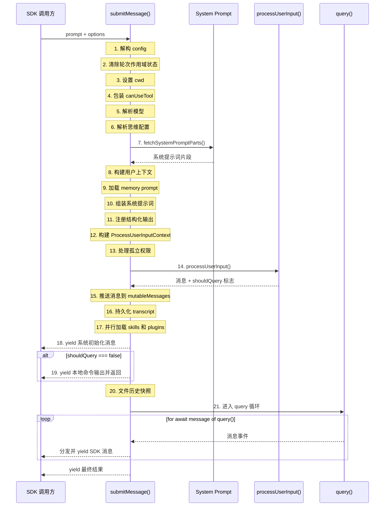
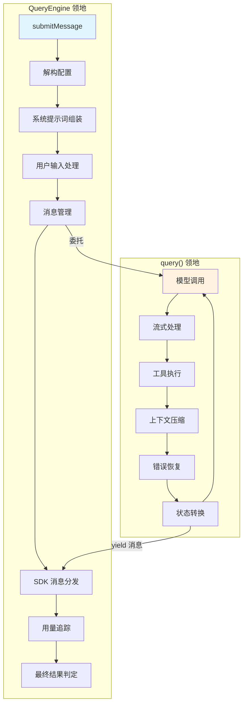

# 第四章：QueryEngine -- 指挥中心

> **源码文件**：`src/QueryEngine.ts`、`src/query.ts`、`src/query/deps.ts`、`src/query/config.ts`

在前面的章节中，我们拆解了 Claude Code 的启动流程和 CLI 解析层。现在，我们将目光聚焦到系统的真正核心——`QueryEngine`。如果把 Claude Code 比作一架客机，那么 CLI 是登机口，Tool 系统是引擎舱，而 `QueryEngine` 就是驾驶舱中的飞行管理计算机（FMC）：它不亲自执行每一个底层操作，但它编排一切、协调一切、控制一切。

本章将完整剖析 `QueryEngine` 的设计哲学、配置体系、核心方法 `submitMessage()` 的 21 步执行流程，以及依赖注入的精妙设计。对于正在构建 AI Agent 框架的工程师来说，这是一份可以直接对照实现的架构蓝图。

---

## 4.1 QueryEngine 的角色：公共 API 边界

`QueryEngine` 是 Claude Code 对外暴露的唯一正式入口。无论是 CLI 交互、SDK 调用，还是 Desktop 集成，所有对话请求最终都汇聚到 `QueryEngine.submitMessage()` 这一个方法上。

这种设计在软件架构中有一个经典名称：**Facade 模式**（外观模式）。`QueryEngine` 将内部数十个子系统——系统提示词加载、上下文注入、权限检查、模型调用、工具执行、上下文压缩、预算追踪——统一封装在一个简洁的异步生成器接口背后。

```mermaid
classDiagram
    class QueryEngine {
        -config: QueryEngineConfig
        -mutableMessages: Message[]
        -abortController: AbortController
        -permissionDenials: SDKPermissionDenial[]
        -totalUsage: NonNullableUsage
        -hasHandledOrphanedPermission: boolean
        -readFileState: FileStateCache
        -discoveredSkillNames: Set~string~
        -loadedNestedMemoryPaths: Set~string~
        +submitMessage(prompt, options) AsyncGenerator~SDKMessage~
        +interrupt() void
        +getMessages() readonly Message[]
        +getReadFileState() FileStateCache
        +getSessionId() string
        +setModel(model) void
    }

    class QueryEngineConfig {
        +cwd: string
        +tools: Tools
        +commands: Command[]
        +mcpClients: MCPServerConnection[]
        +agents: AgentDefinition[]
        +canUseTool: CanUseToolFn
        +getAppState: () => AppState
        +setAppState: (f) => void
        +initialMessages?: Message[]
        +readFileCache: FileStateCache
        ...更多配置字段
    }

    class QueryDeps {
        +callModel: typeof queryModelWithStreaming
        +microcompact: typeof microcompactMessages
        +autocompact: typeof autoCompactIfNeeded
        +uuid: () => string
    }

    QueryEngine --> QueryEngineConfig : 持有
    QueryEngine ..> QueryDeps : 间接使用
    QueryEngine ..> "query()" : 委托执行
```

设计的关键约束是：**一个 QueryEngine 实例对应一次完整对话**。每次 `submitMessage()` 调用代表对话中的一个新"轮次"（turn），而对话状态（消息历史、文件缓存、token 用量）跨轮次持久化。

---

## 4.2 QueryEngineConfig 完整解析

`QueryEngineConfig` 是构造 `QueryEngine` 时传入的配置类型，也是理解整个系统能力边界的关键。我们逐字段分析：

```typescript
export type QueryEngineConfig = {
  // === 核心运行时 ===
  cwd: string                          // 工作目录，决定文件操作的根路径
  tools: Tools                         // 可用工具的完整注册表
  commands: Command[]                  // 可用的斜杠命令列表
  mcpClients: MCPServerConnection[]    // MCP 协议的服务器连接
  agents: AgentDefinition[]            // 可用的 Agent 定义

  // === 权限与状态 ===
  canUseTool: CanUseToolFn             // 权限检查钩子函数
  getAppState: () => AppState          // 获取应用全局状态
  setAppState: (f: (prev: AppState) => AppState) => void  // 更新应用状态

  // === 消息与缓存 ===
  initialMessages?: Message[]          // 初始消息（恢复会话时使用）
  readFileCache: FileStateCache        // 文件读取状态缓存

  // === 系统提示词 ===
  customSystemPrompt?: string          // 完全替换默认系统提示词
  appendSystemPrompt?: string          // 追加到默认系统提示词末尾

  // === 模型配置 ===
  userSpecifiedModel?: string          // 用户指定的模型
  fallbackModel?: string               // 主模型失败时的回退模型
  thinkingConfig?: ThinkingConfig      // 思维模式配置

  // === 限流与预算 ===
  maxTurns?: number                    // 最大轮次数
  maxBudgetUsd?: number                // 最大 USD 花费上限
  taskBudget?: { total: number }       // API task_budget 参数

  // === 输出控制 ===
  jsonSchema?: Record<string, unknown> // 结构化输出的 JSON Schema
  verbose?: boolean                    // 详细日志模式
  replayUserMessages?: boolean         // 是否重放用户消息
  includePartialMessages?: boolean     // 是否向 SDK 发送部分消息

  // === 生命周期钩子 ===
  handleElicitation?: ToolUseContext['handleElicitation']  // 信息获取钩子
  setSDKStatus?: (status: SDKStatus) => void  // SDK 状态回调
  abortController?: AbortController    // 中断控制器

  // === 高级功能 ===
  orphanedPermission?: OrphanedPermission  // 孤立权限处理
  snipReplay?: (                       // 历史裁剪回放函数
    yieldedSystemMsg: Message,
    store: Message[],
  ) => { messages: Message[]; executed: boolean } | undefined
}
```

### 关键字段深度解读

**`canUseTool`** -- 这不是简单的布尔检查，而是一个完整的权限决策函数。`submitMessage()` 内部会对它进行二次包装，添加 `SDKPermissionDenial` 事件追踪。每当工具请求被拒绝，包装后的函数会记录拒绝事件，最终通过 SDK 状态机上报。

**`taskBudget`** -- 这与自动续写的 `TOKEN_BUDGET` 是完全不同的概念。`taskBudget` 是 API 层面的任务预算，`total` 代表整个 agentic 轮次的预算总额；剩余预算在每次循环迭代中根据累计 API 用量重新计算。

**`snipReplay`** -- 这个字段的设计体现了 Claude Code 对 feature flag 隔离的极致追求。它由 `ask()` 函数在 `HISTORY_SNIP` feature flag 激活时注入，这样 `QueryEngine` 本身不需要引用任何被 feature gate 保护的字符串。这意味着即使在测试环境中 `feature()` 返回 false，`QueryEngine` 仍然可以正常实例化和测试。

**`readFileCache`** -- 文件状态缓存在 `QueryEngine` 的生命周期内共享，使得跨轮次的文件读取操作能识别文件是否已被修改，避免无谓的重复读取。

---

## 4.3 类的内部结构

```typescript
export class QueryEngine {
  private config: QueryEngineConfig
  private mutableMessages: Message[]
  private abortController: AbortController
  private permissionDenials: SDKPermissionDenial[]
  private totalUsage: NonNullableUsage
  private hasHandledOrphanedPermission = false
  private readFileState: FileStateCache
  private discoveredSkillNames = new Set<string>()
  private loadedNestedMemoryPaths = new Set<string>()
}
```

构造函数非常简洁：

```typescript
constructor(config: QueryEngineConfig) {
  this.config = config
  this.mutableMessages = config.initialMessages ?? []
  this.abortController = config.abortController ?? createAbortController()
  this.permissionDenials = []
  this.readFileState = config.readFileCache
  this.totalUsage = EMPTY_USAGE
}
```

注意 `mutableMessages` 是唯一的可变消息存储。它在整个 `QueryEngine` 生命周期中累积，每次 `submitMessage()` 都会向其中追加新消息。这是对话历史的"单一真相来源"（single source of truth）。

---

## 4.4 submitMessage()：21 步执行流程

`submitMessage()` 是 `QueryEngine` 的核心方法，也是整个 Claude Code 的执行枢纽。它是一个 **AsyncGenerator**，通过 yield 逐步输出 `SDKMessage` 事件，实现流式传输。

```typescript
async *submitMessage(
  prompt: string | ContentBlockParam[],
  options?: { uuid?: string; isMeta?: boolean },
): AsyncGenerator<SDKMessage, void, unknown>
```

以下是其完整的 21 步执行流程：



### 步骤详解

**步骤 1-3：环境初始化**。从 `this.config` 中解构所有配置项，清除上一轮的 `discoveredSkillNames`（技能发现是每轮独立的），并通过 `setCwd(cwd)` 设置当前工作目录。

**步骤 4：权限包装**。对 `canUseTool` 进行包装，在原始权限检查逻辑外层添加拒绝事件追踪。这是一个典型的装饰器模式应用。

**步骤 5-6：模型与思维模式解析**。优先使用用户指定的模型，否则使用默认主循环模型。思维配置（ThinkingConfig）可以是用户提供的、自适应默认的、或完全禁用的。

**步骤 7-10：系统提示词组装**。这是一个精密的多源聚合过程。首先通过 `fetchSystemPromptParts()` 获取基础提示词片段，然后合并用户上下文、coordinator 上下文、memory 提示词和附加提示词，最终通过 `asSystemPrompt()` 组装成完整的系统提示词。

**步骤 11：结构化输出注册**。如果配置了 `jsonSchema`，系统会注册一个合成的输出工具（synthetic output tool），强制模型输出符合指定 schema 的 JSON。

**步骤 12-14：用户输入处理**。构建处理上下文，处理可能的孤立权限（每个 engine 生命周期最多处理一次），然后通过 `processUserInput()` 处理斜杠命令。该函数返回处理后的消息和一个 `shouldQuery` 标志——如果用户输入的是纯本地命令（如 `/help`），则不需要调用 API。

**步骤 15-17：状态持久化与并行加载**。消息被推入 `mutableMessages`，transcript 被持久化（cowork 模式下阻塞，裸模式下 fire-and-forget），同时并行加载斜杠命令工具技能和所有插件缓存。

**步骤 18-19：非查询分支**。输出系统初始化消息。如果 `shouldQuery` 为 false，直接 yield 本地命令输出并返回，完全跳过 API 调用。

**步骤 20-21：进入查询循环**。对于需要 API 调用的请求，先拍摄文件历史快照（如果启用了持久会话），然后进入 `query()` 循环——这是真正的 agentic 核心。

### 消息分发机制

在 `query()` 循环内部，`submitMessage()` 对每条消息按类型进行 switch 分发：

| 消息类型 | 处理动作 |
|---------|---------|
| `tombstone` | 跳过（用于从 UI 移除消息的控制信号） |
| `assistant` | 推入 mutableMessages，标准化后 yield，追踪 stop_reason |
| `progress` | 推入 mutableMessages，内联记录 transcript，标准化后 yield |
| `user` | 推入 mutableMessages，标准化后 yield，递增 turnCount |
| `stream_event` | 追踪用量（message_start/delta/stop），可选 yield |
| `attachment` | 推入 mutableMessages，处理 structured_output/max_turns_reached/queued_command |
| `system` | 处理 snip 边界回放、compact 边界、api_error |
| `tool_use_summary` | 直接 yield 给 SDK |

### 最终结果判定

query 循环结束后，`submitMessage()` 检查最后一条 assistant/user 消息是否成功（`isResultSuccessful()`），然后 yield 一个带有 subtype 的 result 消息：

- `success` -- 正常完成
- `error_during_execution` -- 执行过程中出错
- `error_max_turns` -- 超过最大轮次
- `error_max_budget_usd` -- 超过预算上限
- `error_max_structured_output_retries` -- 结构化输出重试超限（默认 5 次）

---

## 4.5 依赖注入：QueryDeps 的设计哲学

在 `src/query/deps.ts` 中，Claude Code 定义了一个精巧的依赖注入接口：

```typescript
export type QueryDeps = {
  callModel: typeof queryModelWithStreaming
  microcompact: typeof microcompactMessages
  autocompact: typeof autoCompactIfNeeded
  uuid: () => string
}
```

这个类型只有 4 个字段，看似简单，实则蕴含深思熟虑的设计决策。

### 为什么需要依赖注入？

源码注释中给出了直接的理由："Passing a `deps` override into QueryParams lets tests inject fakes directly instead of `spyOn`-per-module -- the most common mocks (callModel, autocompact) are each spied in 6-8 test files today with module-import-and-spy boilerplate."

翻译过来：在引入 `QueryDeps` 之前，6-8 个测试文件中都需要对 `callModel` 和 `autocompact` 进行模块级别的 `spyOn` mock，这意味着大量的样板代码和脆弱的测试耦合。通过 `QueryDeps`，测试只需要传入 `{ deps: { callModel: mockFn, ... } }` 即可。

### typeof 的巧妙运用

```typescript
callModel: typeof queryModelWithStreaming
```

使用 `typeof fn` 而不是手动声明函数签名，是一个看似微小但影响深远的选择。它保证了依赖接口与真实实现的签名**自动同步**——当 `queryModelWithStreaming` 的参数或返回类型发生变化时，`QueryDeps` 会自动反映这些变化，编译器会在所有使用点报错。

### 生产环境的默认值

```typescript
export function productionDeps(): QueryDeps {
  return {
    callModel: queryModelWithStreaming,
    microcompact: microcompactMessages,
    autocompact: autoCompactIfNeeded,
    uuid: randomUUID,
  }
}
```

在 `queryLoop` 中的使用方式：

```typescript
const deps = params.deps ?? productionDeps()
```

这个模式值得所有 Agent 框架开发者学习：**依赖注入不应该强制所有调用方提供依赖**。生产代码使用默认值，测试代码注入替代品。`??` 操作符使得 `deps` 在 `QueryParams` 中是可选的。

### 刻意的窄作用域

`QueryDeps` 只包含 4 个依赖，而 `queryLoop` 实际上依赖了数十个外部模块。为什么不把所有依赖都注入？

这是一个务实的工程决策。源码注释说得很清楚："Scope is intentionally narrow (4 deps) to prove the pattern." 这 4 个依赖是最常被 mock 的（callModel、microcompact、autocompact）加上一个确定性需求（uuid）。将所有依赖都注入会造成过度工程化，而只注入最痛的几个则以最小的改动获得最大的测试改善。

---

## 4.6 QueryEngine 与 query() 的边界

理解 `QueryEngine` 和 `query()` 之间的分工，是理解整个架构的关键：



| 职责 | QueryEngine | query() |
|------|-------------|---------|
| 系统提示词 | 负责组装 | 接收并使用 |
| 消息历史 | 持久化存储 | 只读视图 + 局部修改 |
| 权限检查 | 包装并注入 | 透传给工具 |
| 模型调用 | 不涉及 | 核心职责 |
| 工具执行 | 不涉及 | 核心职责 |
| 上下文压缩 | 不涉及 | 核心职责 |
| 用量追踪 | 汇总级别 | 不涉及 |
| SDK 协议 | 最终 yield | 中间 yield |
| 错误恢复 | 预算/重试超限 | 413/输出截断/中断 |

这个边界划分遵循了一个清晰的原则：**QueryEngine 管理对话级别的关注点，query() 管理轮次内部的关注点**。

---

## 4.7 ask() 便捷包装器

在 `QueryEngine` 之上，还有一个 `ask()` 函数作为一次性调用的便捷包装：

```typescript
export async function* ask({...params}): AsyncGenerator<SDKMessage, void, unknown>
```

它的职责很简单：
1. 创建一个 `QueryEngine`（如果 `HISTORY_SNIP` feature flag 激活，注入 `snipReplay` 回调）
2. 委托给 `engine.submitMessage(prompt, { uuid, isMeta })`
3. 在 `finally` 块中，将文件状态缓存写回：`setReadFileCache(engine.getReadFileState())`

`ask()` 存在的意义是**降低单次调用的心智负担**。大多数 SDK 消费者不需要管理 `QueryEngine` 的生命周期，他们只想发一个消息、拿到结果。

---

## 4.8 Facade 模式的工程价值

回顾整个 `QueryEngine` 的设计，我们可以看到 Facade 模式在大型系统中的典型应用价值：

**1. 复杂性封装**。`submitMessage()` 内部编排了至少 21 个步骤，涉及提示词、权限、输入处理、持久化、技能加载等子系统。但对外只暴露一个 AsyncGenerator 接口。

**2. 协议标准化**。无论内部发生了什么，SDK 消费者看到的都是统一的 `SDKMessage` 流。消息类型、格式、顺序都在 `submitMessage()` 的 switch 分发中被标准化。

**3. 变更隔离**。当内部子系统（比如压缩策略）发生重构时，只要 `submitMessage()` 的输出协议不变，所有外部消费者都不受影响。

**4. 测试友好**。`QueryEngine` 本身可以通过注入 mock config 来测试其编排逻辑；`query()` 可以通过 `QueryDeps` 来测试其循环逻辑；二者互不干扰。

---

## 4.9 对 Agent 框架设计者的启示

如果你正在构建自己的 AI Agent 框架，从 `QueryEngine` 的设计中可以提炼出几条核心原则：

**配置即能力边界**。`QueryEngineConfig` 的 26 个字段定义了 `QueryEngine` 所能做的一切。任何新能力的引入都必须通过 config 字段表达。这使得能力边界清晰可审计。

**AsyncGenerator 是 Agent 的自然接口**。Agent 本质上是一个长期运行的、产生中间结果的计算过程。AsyncGenerator 完美匹配这个语义：它支持流式输出、支持调用方按需消费、支持通过 `.return()` 优雅中断。

**分层的关注点分离**。不要试图在一个类里处理所有事情。`QueryEngine` 管对话，`query()` 管轮次，`StreamingToolExecutor` 管工具并发。每一层只关心自己的抽象级别。

**渐进式依赖注入**。不需要一开始就搭建完整的 DI 容器。从最痛的几个依赖开始，用一个简单的 `Deps` 类型加上默认工厂函数就够了。当需要注入的依赖增多时，再考虑更复杂的方案。

**Feature flag 的隔离边界**。`snipReplay` 的注入方式告诉我们：feature-gated 的代码不应该泄漏到核心类中。通过回调注入，核心类可以在 feature 关闭时保持完全可测试。

---

## 本章小结

`QueryEngine` 是 Claude Code 的指挥中心，但它不是万能类。它的力量在于精确的职责划分和清晰的委托链：

- **对外**：提供 `submitMessage()` 这一个入口，输出标准化的 `SDKMessage` 流
- **对内**：通过 21 步流程编排提示词、权限、输入处理、持久化等子系统
- **向下**：将真正的 agentic 循环委托给 `query()`，通过 `QueryDeps` 实现可测试性
- **向上**：通过 `ask()` 为单次调用提供便捷包装

在下一章中，我们将深入 `query()` 的内部——那个 `while(true)` 循环，以及它如何通过状态机驱动模型调用、工具执行和错误恢复的完整流程。
