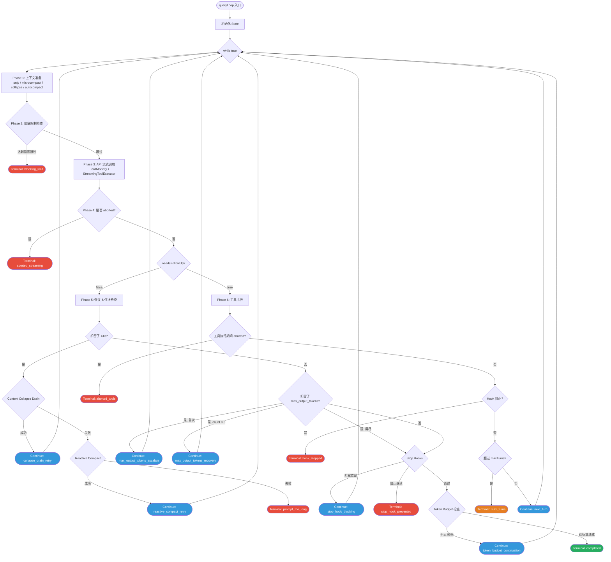
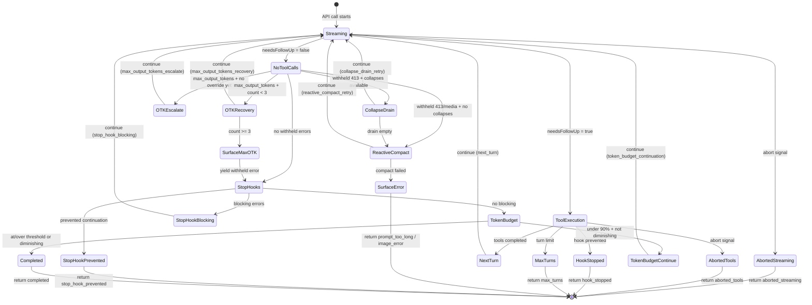

# 第五章：Agentic Loop — 引擎之心

> **本章是全书最核心的一章。** 如果说 QueryEngine 是飞机的驾驶舱，那么 Agentic Loop 就是发动机本身。理解这个循环的每一个相位、每一条状态转移路径，是理解整个 Claude Code 运行时的基础。

## 5.1 query() 函数签名与 Generator 协议

Agentic Loop 的入口是 `query()` 函数。它的签名揭示了一个核心设计决策 —— **用 AsyncGenerator 作为 AI agent 与外部世界的通信协议**：

```typescript
export async function* query(
  params: QueryParams,
): AsyncGenerator<
  | StreamEvent        // 原始 API 流事件
  | RequestStartEvent  // { type: 'stream_request_start' }
  | Message            // Assistant / User / System / Progress / Attachment
  | TombstoneMessage   // 标记为移除的消息
  | ToolUseSummaryMessage,  // Haiku 生成的工具调用摘要
  Terminal             // 返回值：循环终止原因
>
```

这个签名有三层含义：

1. **`async function*`** —— 函数是一个 AsyncGenerator，调用它不会立即执行，而是返回一个迭代器。消费者通过 `for await...of` 或手动调用 `.next()` 来拉取事件。这提供了天然的 **backpressure** —— 消费者处理不过来时，生产者自动暂停。

2. **Yield 联合类型** —— 循环在运行过程中会产出五种不同类型的事件。消费者（`QueryEngine.submitMessage`）通过 `switch(message.type)` 对每种事件执行不同的处理逻辑。

3. **Return 类型 `Terminal`** —— Generator 的返回值不是 `void`，而是一个 `Terminal` 标签类型，精确描述循环终止的原因。这使得调用者可以对不同的退出路径做出不同的响应。

`query()` 本身是一个薄包装器，它的全部工作是：

```typescript
export async function* query(params: QueryParams): AsyncGenerator<...> {
  const consumedCommandUuids: string[] = []
  const terminal = yield* queryLoop(params, consumedCommandUuids)
  // 循环正常结束后，通知命令生命周期
  for (const uuid of consumedCommandUuids) {
    notifyCommandConsumed(uuid)
  }
  return terminal
}
```

使用 `yield*` 委托给 `queryLoop()`，意味着 **所有事件直接穿透到调用者**，不需要中间缓冲。这是 Generator 组合的精髓。

### QueryParams 类型

```typescript
export type QueryParams = {
  messages: Message[]
  systemPrompt: SystemPrompt
  userContext: { [k: string]: string }
  systemContext: { [k: string]: string }
  canUseTool: CanUseToolFn
  toolUseContext: ToolUseContext
  fallbackModel?: string
  querySource: QuerySource
  maxOutputTokensOverride?: number
  maxTurns?: number
  skipCacheWrite?: boolean
  taskBudget?: { total: number }
  deps?: QueryDeps
}
```

注意 `deps` 字段 —— 这是依赖注入的入口。生产环境使用 `productionDeps()`，测试中可以注入 mock 函数。`QueryDeps` 的类型定义使用 `typeof realFunction`，确保 mock 签名永远与真实实现同步。

## 5.2 State 类型：循环的可变状态

Agentic Loop 是一个 `while(true)` 循环，但它不是通过修改散落各处的变量来维护状态的。所有可变状态被聚合到一个 `State` 结构体中：

```typescript
type State = {
  messages: Message[]
  toolUseContext: ToolUseContext
  autoCompactTracking: AutoCompactTrackingState | undefined
  maxOutputTokensRecoveryCount: number
  hasAttemptedReactiveCompact: boolean
  maxOutputTokensOverride: number | undefined
  pendingToolUseSummary: Promise<ToolUseSummaryMessage | null> | undefined
  stopHookActive: boolean | undefined
  turnCount: number
  transition: Continue | undefined
}
```

每个字段都有明确的职责：

| 字段 | 职责 |
|------|------|
| `messages` | 当前对话历史，每次迭代可能被 compact 修改 |
| `toolUseContext` | 传递给工具执行的运行时上下文 |
| `autoCompactTracking` | 自动压缩的追踪状态（轮次计数、连续失败次数） |
| `maxOutputTokensRecoveryCount` | max_output_tokens 恢复尝试次数（上限 3） |
| `hasAttemptedReactiveCompact` | 是否已尝试过 reactive compact（防止无限循环） |
| `maxOutputTokensOverride` | 输出 token 上限覆盖值（用于 escalation） |
| `pendingToolUseSummary` | 上一轮的工具摘要 Promise（延迟到下一轮 yield） |
| `stopHookActive` | 是否正处于 stop hook 激活状态 |
| `turnCount` | 当前轮次计数 |
| `transition` | 上一次 `continue` 的原因标签 |

**关键设计原则：准不可变状态转移。** State 在迭代之间 **永远不会被原地修改**。每个 `continue` 站点都会组装一个全新的 `State` 对象：

```typescript
state = {
  ...currentState,
  messages: newMessages,
  turnCount: state.turnCount + 1,
  transition: { reason: 'next_turn' },
}
continue
```

这使得循环的行为接近一个纯函数式 reducer：`(state, event, config) => state`。`transition` 字段就是这个 reducer 的 action tag。

## 5.3 Terminal 与 Continue 转移类型

循环的每一次迭代只有两种结局：**终止**（Terminal）或 **继续**（Continue）。这两组标签类型完整定义了循环的状态空间：

```typescript
// Terminal —— 循环退出时返回
type Terminal =
  | { reason: 'blocking_limit' }
  | { reason: 'image_error' }
  | { reason: 'model_error'; error: unknown }
  | { reason: 'aborted_streaming' }
  | { reason: 'aborted_tools' }
  | { reason: 'prompt_too_long' }
  | { reason: 'completed' }
  | { reason: 'stop_hook_prevented' }
  | { reason: 'hook_stopped' }
  | { reason: 'max_turns'; turnCount: number }

// Continue —— 循环继续到下一次迭代时记录
type Continue =
  | { reason: 'next_turn' }
  | { reason: 'collapse_drain_retry' }
  | { reason: 'reactive_compact_retry' }
  | { reason: 'max_output_tokens_escalate' }
  | { reason: 'max_output_tokens_recovery'; attempt: number }
  | { reason: 'stop_hook_blocking' }
  | { reason: 'token_budget_continuation' }
```

**10 个终止站点**代表了循环可能退出的所有路径。**7 个继续站点**代表了循环可能回到顶部的所有原因。这是一个封闭的状态空间 —— 没有隐含的退出路径，没有"意外"的 `break`。

将这些标签显式化带来了巨大的工程价值：
- **可追踪性**：每次循环终止或继续，日志和遥测都能精确记录原因
- **可测试性**：测试可以断言特定条件下的精确退出原因
- **可维护性**：添加新的退出路径需要显式添加新的标签，不会被遗漏

## 5.4 单次迭代完整流程：六相位结构

每次循环迭代遵循严格的六相位结构。这不是随意的代码组织 —— 每个相位的顺序都有硬性依赖关系。

### Phase 1: Setup & Context Preparation（准备阶段）

```
解构 state -> 技能发现预取 -> yield stream_request_start
-> 查询追踪初始化 -> 获取 compact 边界后的消息
-> applyToolResultBudget -> snipCompactIfNeeded
-> microcompact -> applyCollapsesIfNeeded -> autocompact
-> 更新 toolUseContext.messages
```

这个阶段的核心任务是 **上下文管理**。五层压缩系统按严格顺序执行：

1. **Snip** —— 基于 `HISTORY_SNIP` feature flag，对完整消息数组进行截断
2. **Microcompact** —— 移除冗余的工具输出细节
3. **Context Collapse** —— 基于 `CONTEXT_COLLAPSE` feature flag，将早期对话折叠为摘要
4. **Autocompact** —— 当 token 使用超阈值时，触发 AI 驱动的上下文压缩
5. **Tool Result Budget** —— 限制单个工具结果的 token 占用

顺序至关重要。Snip 先于 microcompact 执行，因为 snip 释放的 token 需要反映在后续的阈值计算中。Autocompact 在最后执行，因为它需要看到所有其他压缩的累积效果。

### Phase 2: Pre-API Checks（预检查阶段）

```
创建 StreamingToolExecutor -> 解析运行时模型
-> 创建 dumpPromptsFetch -> 阻塞限制检查
```

关键步骤是 **blocking limit check**。如果当前 token 数量已经达到上下文窗口的阻塞限制，且没有启用任何恢复机制（reactive compact 或 context collapse），循环立即终止：

```typescript
if (isAtBlockingLimit) {
  yield createAssistantAPIErrorMessage({
    content: PROMPT_TOO_LONG_ERROR_MESSAGE,
    error: 'invalid_request',
  })
  return { reason: 'blocking_limit' }
}
```

这个检查会在以下情况下被跳过：刚执行过压缩（使用数据过时）、当前是压缩查询本身（会死锁）、启用了 reactive compact（让错误流向恢复路径）。

### Phase 3: API Streaming（API 流式调用阶段）

这是循环与 Claude API 交互的阶段。它本身包含一个内嵌的重试循环，用于模型 fallback：

```typescript
while (attemptWithFallback) {
  attemptWithFallback = false
  try {
    for await (const message of deps.callModel({...})) {
      // 处理流式 fallback（tombstone 旧消息，重置）
      // 回填 tool_use 输入
      // 扣留可恢复的错误（413、max_output_tokens、media 错误）
      // yield 未被扣留的消息
      // 追踪 assistant 消息和 tool_use block
      // 将 tool_use block 喂给 StreamingToolExecutor
      // yield 已完成的 streaming tool 结果
    }
  } catch (FallbackTriggeredError) {
    currentModel = fallbackModel
    attemptWithFallback = true
    continue
  }
}
```

**扣留协议（Withholding Protocol）** 是这个阶段最精妙的设计。当 API 返回可恢复的错误时（如 413 prompt_too_long、max_output_tokens），错误消息 **不会** 被 yield 给消费者。它被存储在本地，等待后续阶段尝试恢复。只有当恢复失败时，扣留的消息才会被释放。这防止了 SDK 消费者因中间错误而过早终止会话。

### Phase 4: Post-Streaming（流式调用后处理阶段）

```
执行 post-sampling hooks -> 处理 abort（如在流式传输期间中止）
-> yield 上一轮的 pending tool use summary
```

如果在流式传输期间收到了 abort 信号，这个阶段负责善后：从 `StreamingToolExecutor` 收集合成的 tool_result（防止孤立的 tool_use block），然后返回 `{ reason: 'aborted_streaming' }`。

### Phase 5: No-Follow-Up Branch（无后续操作分支）

当模型完成输出且没有工具调用（`needsFollowUp === false`）时，进入这个阶段。这里包含了循环中最复杂的恢复逻辑。

**恢复优先级链（从高到低）：**

1. **Prompt-too-long 恢复**：
   - 先尝试 context collapse drain（`recoverFromOverflow`）
   - 再尝试 reactive compact（`tryReactiveCompact`）
   - 如果都失败，yield 扣留的错误并返回 `{ reason: 'prompt_too_long' }`

2. **Media size error 恢复**：通过 reactive compact 去除大型媒体内容

3. **Max output tokens 恢复**（详见 5.6 节）：
   - Escalation：将 token 上限提升到 64k（每轮只一次）
   - Multi-turn recovery：注入 "resume" 元消息（最多 3 次）
   - 如果用尽，yield 扣留的错误

4. **Stop hooks**：执行 `handleStopHooks()`，可能阻塞或阻止继续

5. **Token budget 检查**：如果使用不足 90% 的预算，继续运行

6. 返回 `{ reason: 'completed' }`

### Phase 6: Tool Execution（工具执行阶段）

当模型发起了工具调用（`needsFollowUp === true`）时，进入这个阶段。

```typescript
const toolUpdates = streamingToolExecutor
  ? streamingToolExecutor.getRemainingResults()
  : runTools(toolUseBlocks, assistantMessages, canUseTool, toolUseContext)

for await (const update of toolUpdates) {
  // yield 工具结果和进度消息
  // 追踪 hook 阻止标志
  // 应用 context 修改器
}
```

完成工具执行后，还需要：
- 收集 attachment 消息（文件变更、队列中的命令）
- 消费 memory 预取结果
- 消费技能发现预取结果
- 从队列中排出已消费的命令
- 刷新工具列表（MCP 服务器可能在查询期间连接）
- 检查 maxTurns 限制

最后，组装新的 `State` 并 `continue`：

```typescript
state = {
  messages: [...messagesForQuery, ...assistantMessages, ...toolResults],
  toolUseContext: updatedContext,
  turnCount: state.turnCount + 1,
  transition: { reason: 'next_turn' },
  // ... 其他字段
}
continue
```

## 5.5 终止条件评估：7 个 Continue 站点与 10 个 Terminal 站点

### Continue 站点总览

| 转移原因 | 触发条件 | 关键状态变更 |
|---------|---------|-------------|
| `next_turn` | 工具执行完成，需要再次调用 API | messages 追加工具结果，turnCount++ |
| `collapse_drain_retry` | 413 错误，有可用的 context collapse | messages 替换为 drained 版本 |
| `reactive_compact_retry` | 413/media 错误，reactive compact 成功 | messages 替换为压缩后版本，hasAttemptedReactiveCompact = true |
| `max_output_tokens_escalate` | 输出命中 8k 上限，首次 escalation | maxOutputTokensOverride = ESCALATED_MAX_TOKENS |
| `max_output_tokens_recovery` | 输出命中上限，注入 resume 消息 | messages 追加恢复消息，count++ |
| `stop_hook_blocking` | Stop hook 返回阻塞错误 | messages 追加错误消息，stopHookActive = true |
| `token_budget_continuation` | Token 使用不足 90% | messages 追加 nudge 消息 |

### Terminal 站点总览

| 终止原因 | 触发条件 |
|---------|---------|
| `blocking_limit` | Token 数达到阻塞限制，且未启用自动压缩 |
| `image_error` | ImageSizeError 或 ImageResizeError |
| `model_error` | callModel 抛出未处理的错误 |
| `aborted_streaming` | 流式传输期间 AbortController 触发 |
| `aborted_tools` | 工具执行期间 AbortController 触发 |
| `prompt_too_long` | 扣留的 413 错误无法恢复 |
| `completed` | 模型完成输出（无工具调用），且无 hook 阻塞 |
| `stop_hook_prevented` | Stop hook 显式阻止继续 |
| `hook_stopped` | 工具级 hook 阻止继续 |
| `max_turns` | 轮次计数超过 maxTurns |

## 5.6 错误恢复状态机

Agentic Loop 中最精密的子系统是错误恢复机制。它不是简单的 try/catch —— 它是一个完整的状态机，有明确的状态转移和终止条件。

### maxOutputTokens 恢复

当模型输出命中 `max_output_tokens` 限制时，有两种恢复策略按优先级执行：

**策略一：Escalation（升级上限）**
- 条件：当前上限为 8k 默认值，且未进行过 escalation
- 动作：将 `maxOutputTokensOverride` 设为 `ESCALATED_MAX_TOKENS`（64k）
- 转移：`{ reason: 'max_output_tokens_escalate' }`
- 只能执行一次

**策略二：Multi-turn Recovery（多轮恢复）**
- 条件：`maxOutputTokensRecoveryCount < MAX_OUTPUT_TOKENS_RECOVERY_LIMIT`（3）
- 动作：注入一条 "resume from where you left off" 元消息
- 转移：`{ reason: 'max_output_tokens_recovery', attempt: count }`
- 最多执行 3 次

如果两种策略都用尽，扣留的错误消息被 yield 给消费者，循环继续到 stop hooks 阶段。

### Reactive Compact 恢复

当 API 返回 413（prompt too long）或 media size error 时，恢复链如下：

1. **Context Collapse Drain**：尝试通过折叠更多上下文来释放空间。如果释放了足够的 token，以 `collapse_drain_retry` 继续。
2. **Reactive Compact**：如果 drain 不够，调用 AI 驱动的紧急压缩。成功则以 `reactive_compact_retry` 继续。
3. **Surface Error**：如果两者都失败，yield 错误并以 `prompt_too_long` 终止。

**关键保护机制**：`hasAttemptedReactiveCompact` 标志防止无限循环。该标志在 `stop_hook_blocking` 转移中被保留，防止以下死亡螺旋：compact -> 仍然太长 -> 错误 -> stop hook blocking -> compact -> ...

## 5.7 循环流程图

### 主循环流程图



### 错误恢复状态机图



## 5.8 走读一次完整迭代

让我们以一个具体场景走读完整的单次迭代。假设用户要求 Claude Code "读取 README.md 并修复其中的拼写错误"。

**当前状态**：`turnCount: 2`，上一轮 Claude 已经调用了 `ReadFile` 工具读取了文件内容。现在是第二次迭代，消息中已经包含了文件内容。

**Phase 1**：解构 state，提取 `messages`、`turnCount: 2`、`transition: { reason: 'next_turn' }`。执行上下文压缩管线 —— 消息不多，所有压缩层都是 no-op。

**Phase 2**：检查 token 使用，远低于阻塞限制。创建新的 `StreamingToolExecutor`。

**Phase 3**：调用 `deps.callModel()`。API 以流式返回 assistant 消息。模型输出一个 `tool_use` block，调用 `EditFile` 工具来修复拼写错误。`StreamingToolExecutor.addTool()` 在 tool_use block 到达时立即将其入队。因为 EditFile 不是并发安全的（它修改文件），所以标记为非并发。

**Phase 4**：流式传输正常完成，没有 abort。`needsFollowUp = true`（存在工具调用）。yield 上一轮的 tool use summary。

**Phase 5**：跳过（进入 Phase 6）。

**Phase 6**：`streamingToolExecutor.getRemainingResults()` 等待 EditFile 工具完成。工具执行成功，返回包含修改结果的 tool_result 消息。检查 maxTurns —— 当前 turnCount 2 未超过默认值。组装新的 State：

```typescript
state = {
  messages: [...messages, assistantMessage, toolResultMessage],
  turnCount: 3,
  transition: { reason: 'next_turn' },
  maxOutputTokensRecoveryCount: 0,
  hasAttemptedReactiveCompact: false,
  // ...
}
continue
```

循环回到 Phase 1。第三次迭代中，模型看到工具执行成功的结果，生成一条总结性的 assistant 消息，没有工具调用。进入 Phase 5，stop hooks 通过，token budget 检查通过，返回 `{ reason: 'completed' }`。

## 5.9 设计洞察

### AsyncGenerator 作为原始抽象

整个引擎建立在 **嵌套 AsyncGenerator** 之上。这提供了四个关键能力：

1. **流式传输**：事件在产生时就能流向消费者
2. **背压**：消费者按自己的节奏拉取
3. **取消**：`generator.return()` 沿链关闭
4. **组合**：`yield*` 在 generator 之间无缝委托

### 准不可变状态与 Reducer 模式

State 在迭代之间不被原地修改的设计，使得循环的行为接近一个 reducer：`(state, event, config) => state`。源码注释中明确提到，这种设计使得未来提取出纯 `step()` 函数变得可行。

### 扣留-恢复模式

对于可恢复的 API 错误，循环采用 "先扣留、再恢复" 的模式。这是一个深思熟虑的设计 —— 它将错误处理的 **决策时机** 从错误发生时推迟到了所有恢复手段都尝试完毕之后，防止 SDK 消费者因中间错误而过早终止会话。

### 三层 AbortController 层级

```
Query AbortController（顶层 — 查询级）
  -> SiblingAbortController（中层 — Bash 错误级联）
    -> Per-tool AbortController（底层 — 单工具取消）
```

只有 Bash 工具的错误会级联取消兄弟工具。其他工具（ReadFile、WebFetch 等）的失败是独立的。这反映了一个重要的领域洞察：Bash 命令往往有隐含的依赖链（mkdir 失败后续命令就没意义了），而读取操作是独立的。

---

> **本章小结**：Agentic Loop 是 Claude Code 的心脏。它用 `while(true)` + AsyncGenerator 构建了一个 6 相位的迭代结构，通过 10 个 Terminal 和 7 个 Continue 标签精确控制状态转移，用准不可变的 State 类型实现了接近 reducer 的行为模式。扣留-恢复模式和三层 AbortController 层级展示了生产级 AI agent 系统在错误处理上的深度思考。理解这个循环，就理解了让 AI agent "持续行动直到完成任务" 的核心机制。
