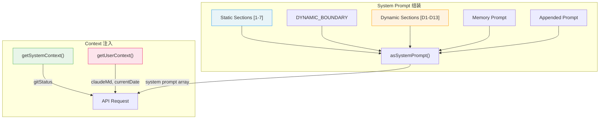
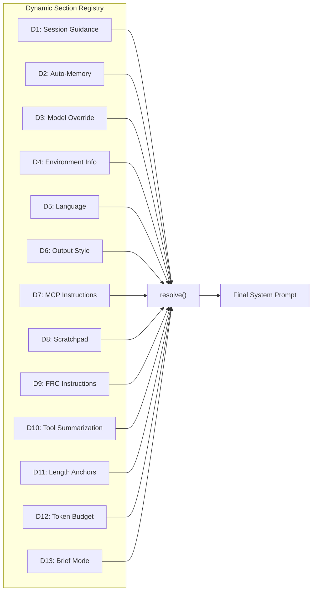
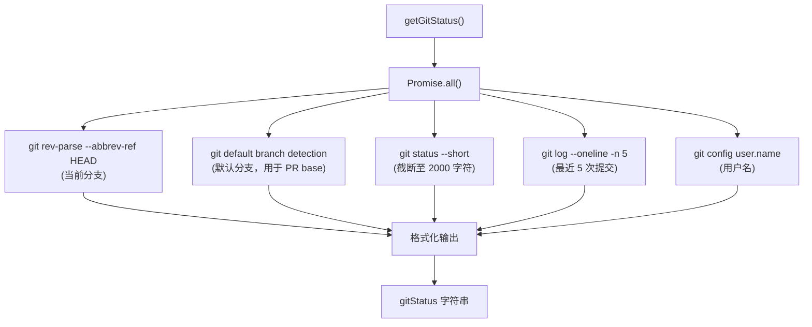
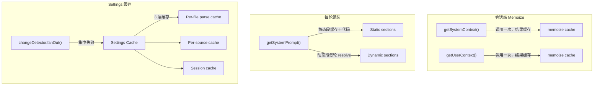
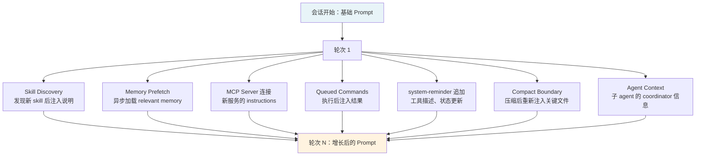
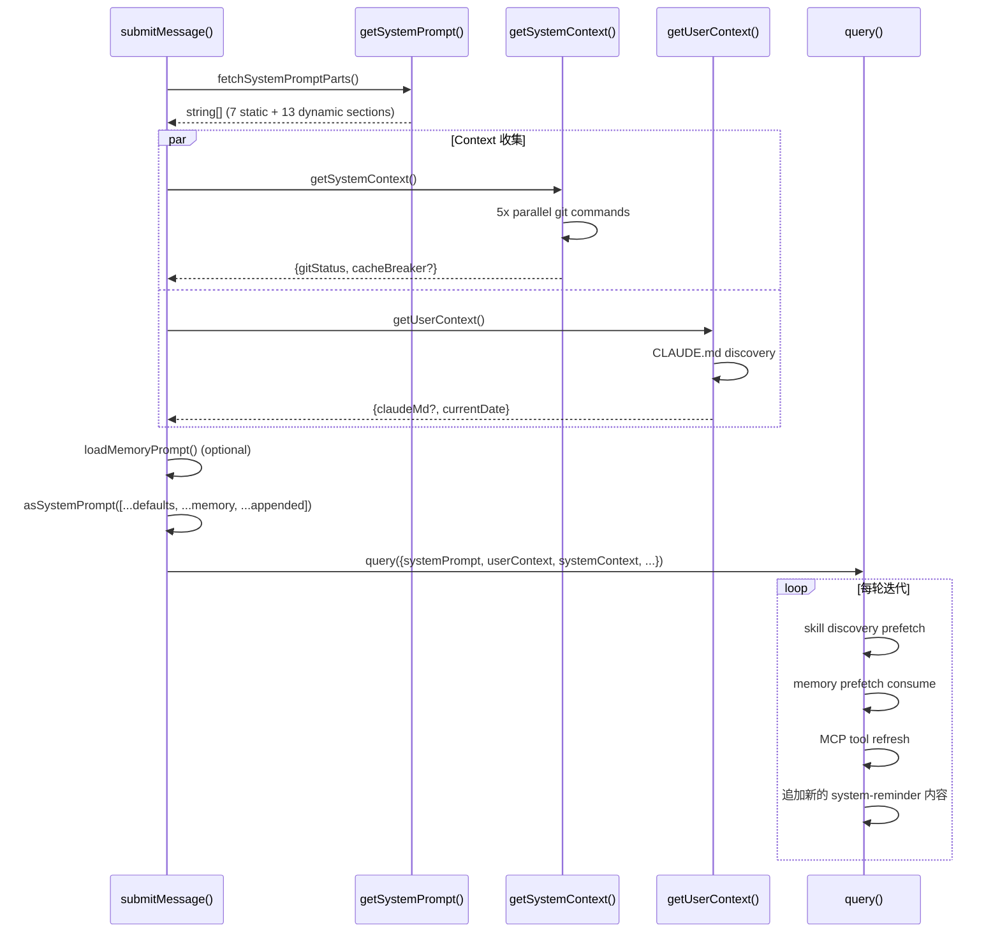

# 第六章：System Prompt 与 Context 组装

> **源文件**: `src/constants/prompts.ts` (~700 行), `src/context.ts` (190 行), `src/QueryEngine.ts`
>
> 你发送给大语言模型的每一个 API 请求，真正决定其行为边界的不是 user message，而是 system prompt。Claude Code 的 system prompt 不是一段写死的文本，而是一条 **运行时组装的流水线** ——它会在每次对话开始时，根据当前环境、用户配置、会话状态，动态拼装出一个包含 20+ 段落的指令集合。本章将拆解这条流水线的每一个环节。

---

## 6.1 分层架构总览

Claude Code 将传递给 API 的上下文分为三个独立的通道（channel），它们在 API 请求中各自占据不同的位置：

| 通道 | API 字段 | 生命周期 | 典型内容 |
|------|----------|----------|----------|
| **System Prompt** | `system` | 整个会话不变（静态段）+ 每轮可变（动态段） | 行为准则、工具使用规范、输出风格 |
| **User Context** | `system` (作为 `system-reminder` 注入) | 会话开始时 memoize 一次 | CLAUDE.md 内容、当前日期 |
| **System Context** | `system` (作为 `system-reminder` 注入) | 会话开始时 memoize 一次 | Git 状态、cache breaker |

这三条通道在 `submitMessage()` 中汇合，通过 `asSystemPrompt()` 函数合并成最终的 `SystemPrompt` 对象，传递给 `query()` 进入 agentic loop。



关键设计决策：**System prompt 与 context 是独立组装的**。System prompt 由 `getSystemPrompt()` 返回一个 `string[]`，每个元素是一个段落；User/System context 由各自的 `getXxxContext()` 函数返回 `{[k: string]: string}` 字典。这种分离使得 prompt 的缓存策略可以按段粒度控制。

---

## 6.2 静态段：7 个不变的行为基座

`getSystemPrompt()` 函数（文件：`src/constants/prompts.ts`）返回的数组，前 7 个元素构成 **静态区（Static Zone）**。这些内容在同一组织内的所有会话中保持一致，可以被 Anthropic API 的 prompt cache 命中：

### [1] `getSimpleIntroSection(outputStyle)`

开场白，定义 Claude Code 的核心身份：

```
"You are an interactive agent that helps users..."
```

尾部附加 `CYBER_RISK_INSTRUCTION`——一段关于安全编码的强制性指令。如果用户配置了 `outputStyle`，会在此处注入风格前缀。

### [2] `getSimpleSystemSection()`

系统级规则，包含：
- **输出格式**：Markdown 渲染、等宽字体使用规范
- **权限模式感知**：告知模型当前处于 `default`/`plan`/`auto` 模式
- **`system-reminder` 标签**：解释 `<system-reminder>` 是可信的系统注入
- **Prompt injection 检测**：指导模型识别并拒绝嵌入在用户输入中的恶意指令
- **Hooks 说明**：告知模型用户可配置 pre/post hooks
- **自动压缩提示**：说明长对话会被自动摘要

### [3] `getSimpleDoingTasksSection()`

任务执行原则：
- 软件工程上下文设定
- 代码风格准则（**不镀金、不做投机性抽象**）
- 注释策略（解释 *why*，不解释 *what*）
- 安全意识（永远不硬编码 secrets）

### [4] `getActionsSection()`

操作安全规范：
- **可逆性评估**：执行前判断操作是否可回退
- **影响面考量**：评估变更的波及范围
- **破坏性操作清单**：`git reset --hard`, `rm -rf` 等需要显式确认
- **授权范围**：不得超越用户授予的权限

### [5] `getUsingYourToolsSection(enabledTools)`

工具使用指南，动态接收当前启用的工具列表：
- **专用工具优先**：`Read > cat`, `Edit > sed`, `Grep > grep`
- **TodoWrite/TaskCreate 使用时机**
- **并行工具调用**：指导模型何时可以在一个回复中调用多个工具

### [6] `getSimpleToneAndStyleSection()`

语气与格式规范：
- 除非用户要求，不使用 emoji
- 文件路径使用 `file_path:line_number` 格式
- GitHub 引用使用 `owner/repo#123` 格式
- 工具调用前不使用冒号

### [7] `getOutputEfficiencySection()`

输出效率控制，根据用户类型分支：
- **内部用户（Ant）**：详细沟通指南，流畅散文体，倒金字塔结构
- **外部用户**：简洁输出规则，避免冗长

### [8] `SYSTEM_PROMPT_DYNAMIC_BOUNDARY`

一个特殊标记，将静态区与动态区分隔开。这个边界在 API 层面具有重要意义——它告知 prompt cache 机制：**边界之前的内容可以跨请求缓存，边界之后的内容每次请求可能不同**。

---

## 6.3 动态段：13+ 个会话级段落

`SYSTEM_PROMPT_DYNAMIC_BOUNDARY` 之后的内容通过一个 **动态段注册表（Dynamic Section Registry）** 管理。每个段落通过 `systemPromptSection()` 注册，运行时异步解析：



### [D1] `getSessionSpecificGuidanceSection()`

这是最复杂的动态段，包含多个子模块：

- **AskUserQuestion 指南**：何时向用户提问、如何结构化问题
- **`!` 命令提示**：告知模型用户可用 `!` 前缀执行 shell 命令
- **Agent 工具段**：根据当前 agent 配置注入 fork/delegate 决策指南
- **Explore Agent 指南**：搜索与探索类 agent 的行为约束
- **Skill 工具使用**：如何发现并调用 skills
- **DiscoverSkills 指南**：技能发现的触发条件
- **Verification Agent 契约**：验证类 agent 的输入/输出规范

### [D2] `loadMemoryPrompt()`

加载 auto-memory 内容。Claude Code 的记忆系统允许模型在对话过程中保存重要信息到 `~/.claude/memory/` 目录。此段落将已有的记忆内容注入 system prompt，使模型在新对话中能"记住"之前学到的偏好和上下文。

### [D3] `getAntModelOverrideSection()`

仅对 Anthropic 内部用户生效，注入模型后缀信息。

### [D4] `computeSimpleEnvInfo(model, dirs)`

环境信息，包含：
- 当前工作目录
- 操作系统与平台
- 使用的模型名称
- Shell 类型

### [D5] `getLanguageSection()`

如果用户在 settings 中配置了 `language` 字段，注入语言偏好指令。

### [D6] `getOutputStyleSection()`

如果配置了 `outputStyle`，注入自定义输出风格指令。

### [D7] `getMcpInstructionsSection()`

已连接的 MCP server 的使用说明。每个 MCP server 可以声明自己的 `instructions` 字段，此段落将所有活跃 MCP server 的指令聚合注入。

### [D8] `getScratchpadInstructions()`

Scratchpad 目录的使用指南——模型可以在 `.claude/scratchpad/` 中创建临时文件。

### [D9] `getFunctionResultClearingSection()`

FRC（Function Result Clearing）指令——指导模型如何处理被清除的旧工具结果。

### [D10] `SUMMARIZE_TOOL_RESULTS_SECTION`

工具结果摘要指令——告知模型当工具输出过长时如何生成摘要。

### [D11] Length Anchors（仅内部用户）

数字化长度锚点，例如 `"<=25 words between tool calls"`，用于精确控制工具调用之间的文本长度。

### [D12] Token Budget（Feature-gated）

当 `TOKEN_BUDGET` feature flag 启用时，注入 token 预算跟踪指令。

### [D13] Brief Mode（Feature-gated）

当 brief mode 启用时，注入极简输出指令。

---

## 6.4 Context 注入：Git 状态与 Memory 文件

Context 注入是独立于 system prompt 组装的另一条流水线。它负责收集当前环境的实时状态，并作为 `system-reminder` 注入到 API 请求中。

### 6.4.1 System Context：5 个并行 Git 命令

`getSystemContext()` 函数（文件：`src/context.ts`）被 `memoize` 包装，在整个会话中只执行一次：

```typescript
export const getSystemContext = memoize(async () => {
  const gitStatus = await getGitStatus()
  const injection = getSystemPromptInjection()
  return {
    ...(gitStatus && { gitStatus }),
    ...(injection && { cacheBreaker: `[CACHE_BREAKER: ${injection}]` }),
  }
})
```

`getGitStatus()` 的核心是 **5 个并行执行的 Git 命令**：



输出格式：

```
This is the git status at the start of the conversation...
Current branch: feature/new-ui
Main branch: main
Git user: Gary Huang
Status:
 M src/app.ts
?? src/new-file.ts
Recent commits:
a1b2c3d Fix login validation
e4f5g6h Add user settings page
...
```

跳过条件——以下情况下 Git 状态不会被收集：
- 在 CCR（Cloud Code Runner）环境中运行
- 用户通过 settings 禁用了 `includeGitInstructions`

### 6.4.2 User Context：CLAUDE.md 发现与注入

`getUserContext()` 同样被 `memoize`，会话内只执行一次：

```typescript
export const getUserContext = memoize(async () => {
  const claudeMd = shouldDisableClaudeMd ? null
    : getClaudeMds(filterInjectedMemoryFiles(await getMemoryFiles()))
  setCachedClaudeMdContent(claudeMd || null)
  return {
    ...(claudeMd && { claudeMd }),
    currentDate: `Today's date is ${getLocalISODate()}.`,
  }
})
```

CLAUDE.md 文件发现链：

```
getMemoryFiles()
  -> 扫描 ~/.claude/CLAUDE.md (全局)
  -> 扫描 <cwd>/.claude/CLAUDE.md (项目级)
  -> 扫描 <cwd>/CLAUDE.md (项目根)
  -> 扫描 <parent-dirs>/CLAUDE.md (向上遍历)
  -> filterInjectedMemoryFiles() 过滤已通过其他途径注入的文件
  -> getClaudeMds() 合并所有内容
```

禁用条件：
- 设置了 `CLAUDE_CODE_DISABLE_CLAUDE_MDS` 环境变量
- 使用 `--bare` 模式（除非显式 `--add-dir`）

### 6.4.3 两类 Context 的区别

| 特性 | User Context | System Context |
|------|-------------|----------------|
| **内容** | CLAUDE.md、当前日期 | Git 状态、cache breaker |
| **来源** | 文件系统扫描 | Git 命令 |
| **可见性** | 用户可通过 CLAUDE.md 完全控制 | 系统自动收集，用户不直接编辑 |
| **用途** | 项目规范、个人偏好 | 环境上下文、代码库状态 |
| **API 位置** | `system-reminder` 注入 | `system-reminder` 注入 |

---

## 6.5 Memoization 缓存策略

三类 context 函数都使用了 `memoize` 装饰器，但其缓存粒度和生命周期各不相同：



### 为什么 Context 只收集一次？

Git 状态和 CLAUDE.md 只在会话开始时收集一次，而不是每轮对话都重新收集。这是一个刻意的设计决策：

1. **性能**：5 个 Git 命令的并行执行仍需数十毫秒，每轮执行会增加明显延迟
2. **一致性**：会话过程中 Git 状态会因模型操作而改变，如果每轮刷新，模型会看到自己造成的变更，形成反馈循环
3. **缓存友好**：固定的 context 内容使 API 的 prompt cache 命中率更高

### Settings 缓存的特殊性

Settings 使用三级缓存但支持热重载——当文件系统变更触发 `changeDetector` 时，`fanOut()` 函数会集中清除所有缓存层，然后通知订阅者重新加载。这与 context 的"收集一次不变"策略形成鲜明对比。

---

## 6.6 动态 Prompt：Memory 机制与 Agent 定义

### 6.6.1 Memory 机制

Claude Code 的 memory 系统是一个允许模型跨会话持久化知识的机制。在 system prompt 中，memory 通过两个途径注入：

**途径一：CLAUDE.md（User Context）**

用户手动维护的项目记忆文件。内容直接进入 `getUserContext()` 的 `claudeMd` 字段，作为 `system-reminder` 注入。这是用户对模型行为的显式控制通道。

**途径二：Auto-Memory（Dynamic Section D2）**

模型在对话过程中通过 `loadMemoryPrompt()` 自动保存的记忆片段，存储在 `~/.claude/memory/` 或用户配置的 `autoMemoryDirectory` 中。这些记忆在下次对话时被加载到 system prompt 的动态段。

嵌套记忆加载：`QueryEngine` 维护一个 `loadedNestedMemoryPaths` 集合，追踪已加载的记忆文件路径，防止循环引用和重复加载。

### 6.6.2 Agent 定义注入

当用户通过 `--agent` 参数或 settings 中的 `agent` 字段指定了 agent 时，agent 的 prompt 会覆盖或追加到 system prompt。这在 `submitMessage()` 的步骤 8-10 中发生：

```
步骤 7: fetchSystemPromptParts()  → 获取默认 system prompt
步骤 8: 合并 base user context + coordinator context
步骤 9: loadMemoryPrompt()        → 可选，自定义 prompt + memory 路径
步骤 10: asSystemPrompt([...defaults, ...memory, ...appended])
```

如果存在 `customSystemPrompt`（来自 `QueryEngineConfig`），它会完全替换默认的 system prompt，但 memory 和 appended 部分仍然保留——这保证了即使使用自定义 agent，memory 系统和用户追加指令仍然生效。

---

## 6.7 System Prompt 如何随对话增长

System prompt 并非在会话开始时一次性确定后就不再改变。多个机制使其在对话过程中动态演变：

### 7 种增长途径



**1. Skill Discovery**

每轮迭代开始时，`queryLoop` 会启动一个非阻塞的 skill discovery prefetch。如果发现了新的 skill（`discoveredSkillNames`），相关说明会被追加到 system prompt。

**2. Memory Prefetch**

`startRelevantMemoryPrefetch()` 在 `queryLoop` 初始化时通过 `using` 关键字启动（自动释放）。当 prefetch 完成且结果可用时，memory 内容被追加。

**3. MCP Server 动态连接**

MCP server 可能在会话中途连接。`queryLoop` 的工具执行阶段（Phase 6 步骤 10）会刷新工具列表，新连接的 MCP server 的 `instructions` 会被合并到 system prompt。

**4. Queued Commands**

通过 `attachment` 消息中的 `queued_command` 类型，命令执行结果被注入后续轮次。

**5. system-reminder 追加**

工具描述和状态更新通过 `system-reminder` 标签持续追加。这包括 deferred tool 的 schema 加载结果、permission 模式变更通知等。

**6. Compact 后重建**

当自动压缩触发后，system prompt 不会缩减——相反，`POST_COMPACT_MAX_FILES_TO_RESTORE`（默认 5）个最近读取的文件内容会被重新注入，以保证模型不会因压缩而"遗忘"关键上下文。

**7. Coordinator Context**

在多 agent 场景中，coordinator 的信息（团队成员列表、任务分配、通信协议）会追加到 base user context。

### Proactive Mode：完全替换

值得特别说明的是，当 proactive mode 激活时，整个 prompt 结构会被替换为极简版本：

```
"You are an autonomous agent. Use the available tools to do useful work."
+ CYBER_RISK_INSTRUCTION
+ system reminders
+ memory prompt
+ env info
+ MCP instructions
+ scratchpad
+ FRC
+ summarize tool results
+ proactive section
```

这反映了一个重要的架构原则：**prompt 结构不是铁板一块，而是可以根据运行模式整体替换的模板**。

---

## 6.8 完整的 Prompt 组装流水线

将以上所有环节串联，一次完整的 prompt 组装过程如下：



---

## 6.9 架构启示

### 启示一：Prompt 即配置

Claude Code 将 system prompt 当作一个**运行时配置系统**来管理——它有静态默认值、动态覆盖、层级合并、缓存策略。这与传统软件中的配置管理思路完全一致。如果你在构建自己的 AI agent 框架，不要把 prompt 当作一个字符串常量，而应当作一个有生命周期的配置对象。

### 启示二：Cache-Aware 分区

静态/动态分区不是随意的——它直接对应 Anthropic API 的 prompt cache 机制。静态段在多次 API 调用间可以被缓存复用，节省 token 计费和延迟。如果你需要设计大型 system prompt，**把不变的部分放在前面**。

### 启示三：Context 与 Prompt 正交分离

将 "模型应该怎么做"（system prompt）和 "模型需要知道什么"（context）分离到独立通道，使两者可以独立演化。CLAUDE.md 的变更不需要重新编写 prompt 逻辑；Git 状态的收集不需要了解 prompt 的段落结构。

### 启示四：Memoize 的边界选择

System context 和 user context 使用会话级 memoize，而 system prompt 的动态段每轮重新 resolve。这个边界的选择反映了一个核心权衡：**环境状态在会话内相对稳定，但模型的行为指令需要根据对话进展动态调整**。

---

## 小结

本章揭示了 Claude Code 中 system prompt 和 context 组装的完整机制：

- **三通道架构**：System Prompt、User Context、System Context 各自独立组装，在 API 请求中汇合
- **静态 + 动态分区**：7 个静态段提供缓存友好的行为基座，13+ 个动态段提供会话级定制
- **5 路并行 Git 收集**：System Context 通过 5 个并行 Git 命令高效收集环境状态
- **CLAUDE.md 层级发现**：从全局到项目级的多层 memory 文件扫描
- **Memoization 策略**：Context 函数使用会话级 memoize，Settings 使用可热重载的三级缓存
- **持续增长**：Prompt 在对话过程中通过 skill discovery、memory prefetch、MCP 连接等 7 种途径持续增长

下一章，我们将深入 State Management，探索 `createStore<T>()` 这个仅 35 行的响应式状态管理器如何支撑整个应用的状态流转。
