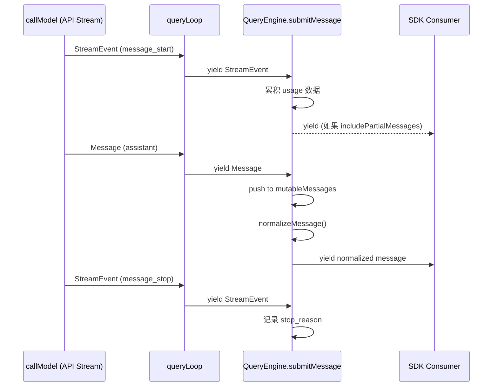
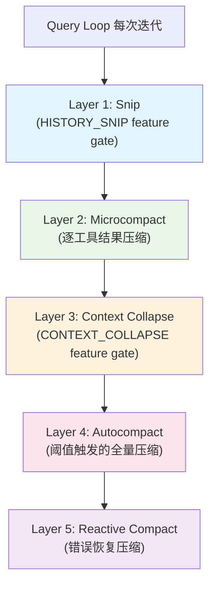
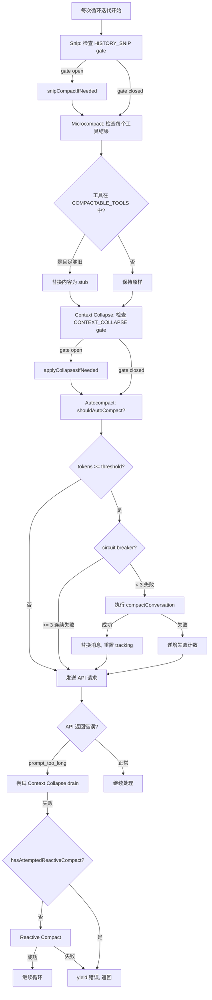
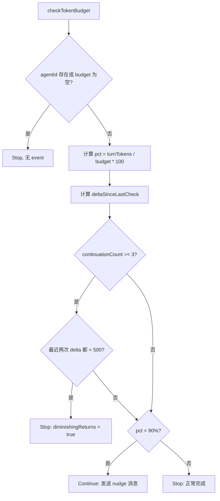
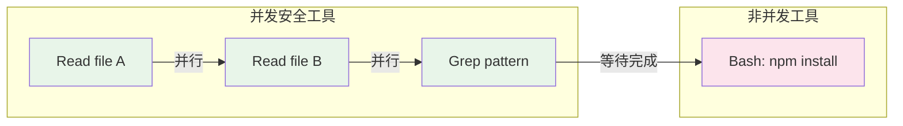
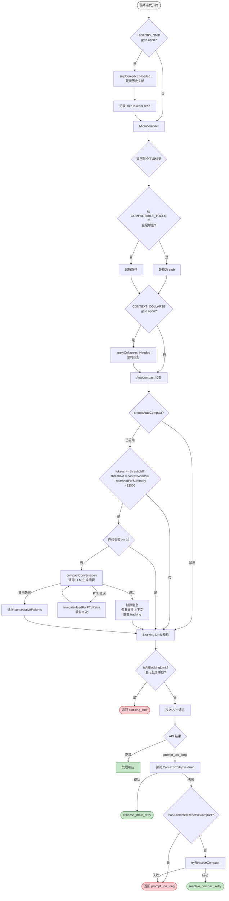

# 第七章：Streaming 与 Context Compaction

> 如何在有限的上下文窗口中支撑无限长的对话？这是每个 LLM 驱动的 Agent 系统都必须正面回答的问题。Claude Code 给出的答案是一套五层 Compaction 架构，配合 AsyncGenerator 驱动的流式协议和精密的 Token Budget 管理系统。本章将逐层剖析这些机制的设计与实现。

---

## 7.1 基于 AsyncGenerator 的 Streaming 协议

Claude Code 的整个引擎建立在 **嵌套 AsyncGenerator** 之上。从最底层的 API 调用到最外层的 SDK 消费者，每一层都是一个 AsyncGenerator，事件流自内而外逐级传递。

### 7.1.1 核心 Generator 链

```
callModel()  →  queryLoop()  →  query()  →  submitMessage()  →  SDK Consumer
  (API流)        (主循环)       (薄包装)     (QueryEngine)       (外部消费者)
```

`queryLoop` 是整个链的核心。它的签名清晰地展示了这种设计：

```typescript
async function* queryLoop(
  params: QueryParams,
  consumedCommandUuids: string[],
): AsyncGenerator<
  | StreamEvent
  | RequestStartEvent
  | Message
  | TombstoneMessage
  | ToolUseSummaryMessage,
  Terminal
>
```

返回类型 `Terminal` 是一个 discriminated union，记录循环退出的原因：

```typescript
type Terminal =
  | { reason: 'blocking_limit' }
  | { reason: 'model_error'; error: unknown }
  | { reason: 'aborted_streaming' }
  | { reason: 'aborted_tools' }
  | { reason: 'prompt_too_long' }
  | { reason: 'completed' }
  | { reason: 'stop_hook_prevented' }
  | { reason: 'max_turns'; turnCount: number }
  // ... 更多原因
```

### 7.1.2 为什么选择 AsyncGenerator？

选择 AsyncGenerator 而非 EventEmitter 或 Observable 有四个关键理由：

1. **Streaming**：事件在产生时即可传递给消费者，无需等待整个响应完成
2. **Backpressure**：消费者按自身节奏拉取，慢消费者不会导致内存溢出
3. **Cancellation**：调用 `generator.return()` 即可关闭整条链
4. **Composability**：`yield*` 可以在 generator 之间无缝委托

### 7.1.3 流式事件路由



在 `submitMessage` 内部，一个 switch 语句对每种消息类型做分发处理：

| 类型 | 处理方式 |
|------|---------|
| `assistant` | 推入 mutableMessages，归一化后 yield |
| `progress` | 推入 mutableMessages，内联记录 transcript |
| `user` | 推入 mutableMessages，递增 turnCount |
| `stream_event` | 追踪 usage，条件性 yield |
| `attachment` | 处理 structured_output / max_turns_reached |
| `system` | 处理 snip boundary / compact boundary / api_error |
| `tombstone` | 跳过（UI 消息删除的控制信号） |
| `stream_request_start` | 抑制（不向 SDK 暴露） |

### 7.1.4 Withhold-Then-Recover 模式

对于可恢复的 API 错误，Claude Code 采用 **先暂扣后恢复** 策略：

1. **Streaming 期间**：错误消息被暂扣（不 yield 给 SDK）
2. **Streaming 之后**：尝试恢复（Context Collapse 排放、Reactive Compact、Token 升级）
3. **恢复成功**：循环以新状态继续
4. **恢复失败**：释放暂扣的错误消息，循环返回

这种设计防止 SDK 消费者（如 Desktop 客户端）因中间错误而过早终止会话。

---

## 7.2 StreamEvent 类型系统

`queryLoop` yield 的类型是一个精心设计的 union：

```typescript
AsyncGenerator<
  | StreamEvent        // 原始 API 流事件 (message_start, content_block_delta 等)
  | RequestStartEvent  // { type: 'stream_request_start' } 请求开始标记
  | Message            // Assistant, User, System, Progress, Attachment 消息
  | TombstoneMessage   // { type: 'tombstone', message: AssistantMessage }
  | ToolUseSummaryMessage  // Haiku 生成的工具使用摘要
  ,
  Terminal             // 返回值：循环结束原因
>
```

### 7.2.1 消息流经过三层处理

```
queryLoop yields → submitMessage switch-dispatch → SDK consumer
```

每条消息在到达 SDK 消费者之前经历：
- **Transcript 记录**（assistant, user, compact_boundary）
- **推入 mutableMessages**（assistant, progress, user, attachment, system）
- **归一化**（通过 `normalizeMessage()` 统一格式）
- **Usage 累积**（从 stream_event 中提取 message_start/delta/stop 的 token 计数）
- **选择性过滤**（stream_request_start 不暴露；大部分 system 子类型不暴露）

### 7.2.2 Loop State Machine

queryLoop 内部维护一个准不可变的状态机：

```typescript
type State = {
  messages: Message[]
  toolUseContext: ToolUseContext
  autoCompactTracking: AutoCompactTrackingState | undefined
  maxOutputTokensRecoveryCount: number
  hasAttemptedReactiveCompact: boolean
  maxOutputTokensOverride: number | undefined
  pendingToolUseSummary: Promise<ToolUseSummaryMessage | null> | undefined
  stopHookActive: boolean | undefined
  turnCount: number
  transition: Continue | undefined
}
```

每次 `continue` 时，都会组装新的 `State` 对象而非原地修改。`transition` 字段记录循环继续的原因，使状态流转可追溯：

```typescript
type Continue =
  | { reason: 'next_turn' }
  | { reason: 'collapse_drain_retry'; committed: number }
  | { reason: 'reactive_compact_retry' }
  | { reason: 'max_output_tokens_escalate' }
  | { reason: 'token_budget_continuation' }
  // ...
```

---

## 7.3 五层 Compaction 架构

Compaction 系统是 Claude Code 的核心创新之一。它通过五个不同层级的策略，在有限的 Context Window 中维持无限长的对话。这五层按严格顺序在每次循环迭代中执行：



### 7.3.1 Layer 1: Snip Compaction

**执行时机**：最先执行，在 Microcompact 之前。
**Feature Gate**：`HISTORY_SNIP`
**操作对象**：完整的消息数组

Snip 是最轻量的 compaction 层。它直接截断历史消息的头部，释放 token 空间。

```typescript
// queryLoop Phase 1:
if (feature('HISTORY_SNIP')) {
  const snipResult = snipModule!.snipCompactIfNeeded(messagesForQuery)
  messagesForQuery = snipResult.messages
  snipTokensFreed = snipResult.tokensFreed
  if (snipResult.boundaryMessage) {
    yield snipResult.boundaryMessage
  }
}
```

关键设计细节：`snipTokensFreed` 会传递给后续的 Autocompact 层。因为 `tokenCountWithEstimation` 基于上一条 assistant 消息的 usage 数据估算 token 数——而 Snip 截断后，这条 assistant 消息的内容未变，原始估算无法反映 Snip 释放的空间。不传递这个值会导致 Autocompact 误判。

在 `QueryEngine.submitMessage` 中，Snip boundary 通过注入的 `snipReplay` 回调处理：

```typescript
snipReplay: (yielded: Message, store: Message[]) => {
  if (!snipProjection!.isSnipBoundaryMessage(yielded)) return undefined
  return snipModule!.snipCompactIfNeeded(store, { force: true })
}
```

当 replay 执行时，`mutableMessages` 被整体替换：

```typescript
if (snipResult.executed) {
  this.mutableMessages.length = 0
  this.mutableMessages.push(...snipResult.messages)
}
```

### 7.3.2 Layer 2: Microcompact

**执行时机**：Snip 之后，Context Collapse 之前。
**操作对象**：单个工具结果

Microcompact 是细粒度压缩——它不处理整个对话，而是逐个清理旧的工具调用结果。

```typescript
const microcompactResult = await deps.microcompact(
  messagesForQuery,
  toolUseContext,
  querySource,
)
messagesForQuery = microcompactResult.messages
```

只有特定工具的结果会被压缩：

```typescript
const COMPACTABLE_TOOLS = new Set([
  FILE_READ_TOOL_NAME,
  ...SHELL_TOOL_NAMES,   // Bash, PowerShell
  GREP_TOOL_NAME,
  GLOB_TOOL_NAME,
  WEB_SEARCH_TOOL_NAME,
  WEB_FETCH_TOOL_NAME,
  FILE_EDIT_TOOL_NAME,
  FILE_WRITE_TOOL_NAME,
])
```

对于 Anthropic 内部用户（ant-only），还有一种 **Cached Microcompact** 变体。它使用 `cache_edits` blocks 增量清理旧内容，而不破坏 API 的 prompt cache：

```typescript
export function consumePendingCacheEdits(): CacheEditsBlock | null
export function getPinnedCacheEdits(): PinnedCacheEdits[]
export function pinCacheEdits(userMessageIndex, block): void
```

Token 估算采用保守策略，为文本、图片（约 2000 tokens/张）、thinking blocks 等分别计数，最终乘以 4/3 作为安全余量。

### 7.3.3 Layer 3: Context Collapse

**执行时机**：Microcompact 之后，Autocompact 之前。
**Feature Gate**：`CONTEXT_COLLAPSE`
**核心特征**：只读投影，不修改原始数据

```typescript
if (feature('CONTEXT_COLLAPSE') && contextCollapse) {
  const collapseResult = await contextCollapse.applyCollapsesIfNeeded(
    messagesForQuery,
    toolUseContext,
    querySource,
  )
  messagesForQuery = collapseResult.messages
}
```

Context Collapse 的设计哲学不同于其他层——它是一个 **读时投影**（read-time projection）。折叠后的视图不会修改 REPL 的完整历史记录：

> "Nothing is yielded -- the collapsed view is a read-time projection over the REPL's full history. Summary messages live in the collapse store, not the REPL array. This is what makes collapses persist across turns: `projectView()` replays the commit log on every entry."

这种设计使折叠可以跨 turn 持久化——`projectView()` 在每次进入循环时重放折叠历史。

Context Collapse 还有一个错误恢复路径 `recoverFromOverflow`，用于在 Reactive Compact 之前处理 prompt-too-long 错误。

### 7.3.4 Layer 4: Autocompact

**执行时机**：Context Collapse 之后，API 调用之前。
**触发条件**：Token 数超过阈值。
**操作方式**：调用 LLM 生成对话摘要，替换原始消息。

```typescript
const { compactionResult, consecutiveFailures } = await deps.autocompact(
  messagesForQuery,
  toolUseContext,
  {
    systemPrompt, userContext, systemContext,
    toolUseContext, forkContextMessages: messagesForQuery,
  },
  querySource,
  tracking,
  snipTokensFreed,
)
```

#### 阈值计算

```typescript
AUTOCOMPACT_BUFFER_TOKENS = 13_000
WARNING_THRESHOLD_BUFFER_TOKENS = 20_000
MANUAL_COMPACT_BUFFER_TOKENS = 3_000
MAX_OUTPUT_TOKENS_FOR_SUMMARY = 20_000

effectiveContextWindow = contextWindow - reservedTokensForSummary
autoCompactThreshold = effectiveContextWindow - AUTOCOMPACT_BUFFER_TOKENS
warningThreshold = threshold - 20_000
blockingLimit = effectiveContextWindow - 3_000
```

#### 触发决策

`shouldAutoCompact()` 依次检查：

1. 不是递归调用（排除 session_memory、compact、marble_origami query source）
2. Auto-compact 已启用（非 DISABLE_COMPACT、非 DISABLE_AUTO_COMPACT）
3. 非 reactive-only 模式
4. 非 context-collapse 模式
5. Token 数超过阈值

#### Circuit Breaker 机制

连续 3 次 autocompact 失败后，系统停止重试。这防止在 context 不可恢复的 session 中浪费 API 调用。

```typescript
MAX_CONSECUTIVE_AUTOCOMPACT_FAILURES = 3
```

#### CompactionResult 结构

```typescript
export interface CompactionResult {
  boundaryMarker: SystemMessage        // 压缩边界标记
  summaryMessages: UserMessage[]       // 摘要消息
  attachments: AttachmentMessage[]     // 附件
  hookResults: HookResultMessage[]     // Hook 结果
  messagesToKeep?: Message[]           // 保留的消息
  preCompactTokenCount?: number        // 压缩前 token 数
  postCompactTokenCount?: number       // 压缩后 token 数
  truePostCompactTokenCount?: number   // 真实的压缩后 token 数
}
```

#### Post-Compact 恢复

压缩后会恢复关键上下文：

```typescript
POST_COMPACT_MAX_FILES_TO_RESTORE = 5
POST_COMPACT_TOKEN_BUDGET = 50_000
POST_COMPACT_MAX_TOKENS_PER_FILE = 5_000
POST_COMPACT_MAX_TOKENS_PER_SKILL = 5_000
POST_COMPACT_SKILLS_TOKEN_BUDGET = 25_000
```

当 compact API 调用本身遇到 prompt-too-long 时，`truncateHeadForPTLRetry` 执行渐进式截断：

1. 按 API round 分组消息
2. 计算需要丢弃的组数（根据 token gap 或 20% 回退策略）
3. 丢弃最旧的组（至少保留一组）
4. 必要时在头部插入合成 user 标记
5. 最多重试 3 次

图片密集的会话在发送给 compaction 模型之前，会通过 `stripImagesFromMessages()` 将所有图片/文档块替换为 `[image]`/`[document]` 文本标记。

### 7.3.5 Layer 5: Reactive Compact（错误恢复）

**执行时机**：仅在 prompt-too-long 或 media-size 错误发生时。
**Feature Gate**：`REACTIVE_COMPACT`
**本质**：最后的防线。

```typescript
const compacted = await reactiveCompact.tryReactiveCompact({
  hasAttempted: hasAttemptedReactiveCompact,
  querySource,
  aborted: toolUseContext.abortController.signal.aborted,
  messages: messagesForQuery,
  cacheSafeParams: {
    systemPrompt, userContext, systemContext,
    toolUseContext, forkContextMessages: messagesForQuery,
  },
})
```

关键安全机制：`hasAttemptedReactiveCompact` 标志防止无限循环。一旦尝试过 reactive compact，该标志在下一个 State 中被设为 `true`。即使在 stop-hook blocking 状态转换中，该标志也会被保留——防止形成死循环：compact -> 仍然太长 -> 错误 -> stop hook blocking -> compact -> ...

---

## 7.4 Compaction 触发条件与策略

### 7.4.1 完整触发流程



### 7.4.2 策略选择逻辑

五层的设计遵循 **渐进式压缩** 原则：

| 层级 | 成本 | 信息损失 | 触发频率 | 是否阻塞 |
|------|------|---------|---------|---------|
| Snip | 零 API 调用 | 高（直接截断） | 每次迭代 | 否 |
| Microcompact | 零 API 调用 | 低（只清理旧工具结果） | 每次迭代 | 否 |
| Context Collapse | 零 API 调用 | 中（折叠为摘要） | 每次迭代 | 否 |
| Autocompact | 一次 LLM 调用 | 中（LLM 生成摘要） | 超过阈值时 | 是 |
| Reactive Compact | 一次 LLM 调用 | 中-高 | 仅错误恢复 | 是 |

前三层是"免费"的——不需要额外的 API 调用。系统总是先尝试低成本策略，只有在无法避免时才触发 LLM compaction。

---

## 7.5 Token Budget 管理

### 7.5.1 BudgetTracker

Token Budget 系统（通过 `TOKEN_BUDGET` feature gate 控制）跟踪 agent 在单次 turn 中的 token 消耗：

```typescript
export type BudgetTracker = {
  continuationCount: number       // 已继续次数
  lastDeltaTokens: number         // 上次检查的增量 token 数
  lastGlobalTurnTokens: number    // 上次检查时的全局 turn token 数
  startedAt: number               // 开始时间戳
}
```

### 7.5.2 TokenBudgetDecision

```typescript
type ContinueDecision = {
  action: 'continue'
  nudgeMessage: string          // 提醒消息
  continuationCount: number
  pct: number                   // 预算使用百分比
  turnTokens: number
  budget: number
}

type StopDecision = {
  action: 'stop'
  completionEvent: {
    continuationCount: number
    pct: number
    turnTokens: number
    budget: number
    diminishingReturns: boolean   // 是否因收益递减而停止
    durationMs: number
  } | null
}

export type TokenBudgetDecision = ContinueDecision | StopDecision
```

### 7.5.3 决策逻辑

```typescript
export function checkTokenBudget(
  tracker: BudgetTracker,
  agentId: string | undefined,
  budget: number | null,
  globalTurnTokens: number,
): TokenBudgetDecision
```

核心常量：

```typescript
COMPLETION_THRESHOLD = 0.9    // 90% 的预算
DIMINISHING_THRESHOLD = 500   // token 增量阈值
```

决策流程：



收益递减检测是一个精巧的设计：如果连续 3 次以上 continuation 后，最近两次检查的 token 增量都低于 500，说明模型已经在"空转"。此时继续运行只会浪费预算，应当主动停止。

### 7.5.4 Budget 与 Compaction 的交互

在 queryLoop 中，Token Budget 检查发生在 Phase 5（No-Follow-Up Branch）：

```typescript
// 简化的逻辑
if (budgetTracker) {
  const decision = checkTokenBudget(
    budgetTracker,
    agentId,
    budget,
    globalTurnTokens,
  )
  if (decision.action === 'continue') {
    // 注入 nudge 消息，继续循环
    // transition = { reason: 'token_budget_continuation' }
  } else {
    // 停止
  }
}
```

注意 `taskBudget`（API 的 task_budget）和 `TOKEN_BUDGET`（auto-continue 功能）是不同的概念：
- `taskBudget` 是整个 agentic turn 的预算上限，`remaining` 根据累计 API usage 逐次递减
- `TOKEN_BUDGET` 控制 agent 是否应该自动继续工作直到预算用尽

---

## 7.6 StreamingToolExecutor：流式并发工具执行

StreamingToolExecutor 解决了一个微妙的问题：如何在 API 仍在 streaming 响应的同时，提前开始执行已经完整的工具调用？

### 7.6.1 核心类型

```typescript
type ToolStatus = 'queued' | 'executing' | 'completed' | 'yielded'

type TrackedTool = {
  id: string
  block: ToolUseBlock
  assistantMessage: AssistantMessage
  status: ToolStatus
  isConcurrencySafe: boolean
  promise?: Promise<void>
  results?: Message[]
  pendingProgress: Message[]
  contextModifiers?: Array<(context: ToolUseContext) => ToolUseContext>
}
```

### 7.6.2 三规则并发模型



1. **Concurrent-safe 工具**可以与其他 concurrent-safe 工具并行执行
2. **Non-concurrent 工具**必须独占执行
3. **结果按提交顺序 yield**，而非完成顺序

```typescript
private canExecuteTool(isConcurrencySafe: boolean): boolean {
  const executingTools = this.tools.filter(t => t.status === 'executing')
  return (
    executingTools.length === 0 ||
    (isConcurrencySafe && executingTools.every(t => t.isConcurrencySafe))
  )
}
```

### 7.6.3 三级 AbortController 层次

```
Query AbortController (parent -- query 级别)
  → siblingAbortController (child -- Bash 错误时级联取消)
    → toolAbortController (grandchild -- 单个工具)
```

**错误级联规则**：只有 Bash 工具的错误会取消兄弟工具。因为 Bash 命令常有隐式依赖链（mkdir 失败 -> 后续命令无意义）。Read/WebFetch 等工具是独立的——一个失败不应影响其余。

```typescript
if (tool.block.name === BASH_TOOL_NAME) {
  this.hasErrored = true
  this.erroredToolDescription = this.getToolDescription(tool)
  this.siblingAbortController.abort('sibling_error')
}
```

### 7.6.4 两种结果消费方式

**`getCompletedResults()`**（同步 Generator）—— 在 streaming 期间调用，排空已就绪的结果：
- 立即 yield 所有 pending progress 消息
- 按顺序 yield 已完成的工具结果
- 遇到正在执行的 non-concurrent 工具时 break

**`getRemainingResults()`**（async Generator）—— streaming 结束后调用，排空所有剩余：
- 处理队列，yield 已完成结果
- 通过 `Promise.race` 等待正在执行的工具或 progress
- 使用 progress-available 信号模式：存储的 `resolve` 回调，工具有 progress 时调用

---

## 7.7 Compaction 决策流程图

以下是完整的 compaction 决策流程，展示了从一次循环迭代开始到最终发送 API 请求的全部决策路径：



### 7.7.1 顺序约束的工程意义

五层的执行顺序不是随意的：

1. **Snip 在 Microcompact 之前**：Snip 减少总消息数，使 Microcompact 需要扫描的工具结果更少
2. **Microcompact 在 Context Collapse 之前**：先清理单个工具结果的噪音，再做整体折叠
3. **Context Collapse 在 Autocompact 之前**：Collapse 是免费的（不需要 API 调用），应尽量先用；如果 Collapse 够用，就不需要触发昂贵的 Autocompact
4. **Autocompact 在 API 调用之前**：确保发出的 prompt 在 context window 内
5. **Reactive Compact 仅在错误后**：作为最后防线，在所有预防措施都失败时启动

### 7.7.2 Blocking Limit 预检的跳过条件

预检会在以下情况被跳过：
- Compaction 刚刚执行（usage 数据过时）
- 当前是 compact/session_memory query source（会导致死锁）
- Reactive compact 已启用且 auto-compact 开启（让错误流向恢复路径）
- Context Collapse 负责恢复（同理）

---

## 7.8 小结

Claude Code 的 streaming 与 compaction 系统展现了工程上的精密设计：

**AsyncGenerator 链**将整个引擎统一在一个抽象之下——从 API 流到 SDK 消费者，每一层都是一个 generator，自然获得 streaming、backpressure 和 cancellation。

**五层 Compaction 架构**遵循渐进式原则：三个免费层（Snip、Microcompact、Context Collapse）先尽力释放空间，两个需要 API 调用的层（Autocompact、Reactive Compact）仅在必要时启动。严格的执行顺序确保每一层都能看到前一层的结果。

**Token Budget 系统**不仅是简单的阈值检查，还包含收益递减检测——当 agent 连续多次 continuation 但每次只产生极少 token 时，系统能识别"空转"并主动停止。

**StreamingToolExecutor** 在保持结果有序的前提下实现了真正的并发——concurrent-safe 工具并行执行，non-concurrent 工具阻塞队列，三级 AbortController 层次提供精确的取消语义。

这些机制共同回答了开篇的问题：在有限的 context window 中支撑无限对话，不是一个单一算法能解决的问题，而是需要一整套协调工作的系统。
