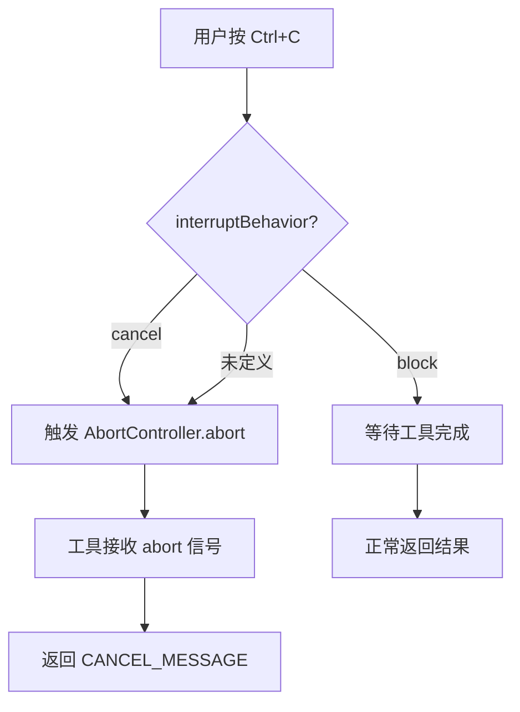
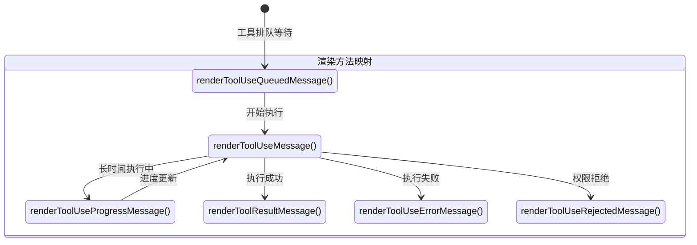
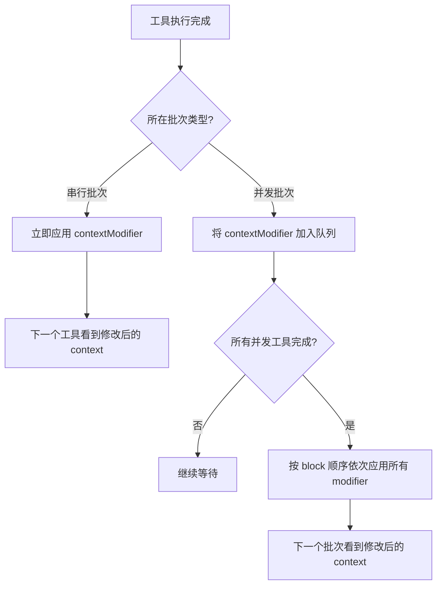
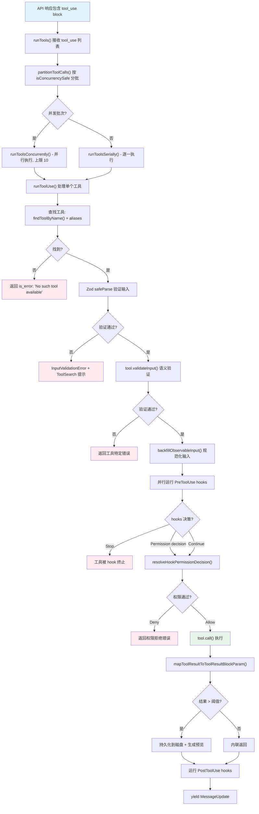

# 第八章：Tool Interface -- 一切能力的基石

> Claude Code 的 513,522 行 TypeScript 代码中，几乎所有外部可观测行为 -- 读文件、执行命令、搜索代码、编辑文件 -- 最终都归结为一次 Tool 调用。Tool 不仅是 Agent 与外界交互的手段，更是整个系统的类型契约、权限边界和并发调度单元。本章将完整解剖 `Tool<Input, Output, Progress>` 泛型接口的每一个字段，从 `buildTool()` 工厂的 fail-closed 默认值，到 `ToolUseContext` 这个贯穿所有工具执行的"上帝对象"，再到 `ToolResult<T>` 的 contextModifier 反馈机制。

---

## 8.1 `Tool<Input, Output, Progress>` 泛型接口：完整解剖

所有 Tool -- 无论是内置的 BashTool、MCP 动态加载的外部工具，还是 ToolSearch 发现的延迟工具 -- 都必须遵循同一个泛型接口。它定义在 `src/Tool.ts` 中，是整个 Tool 系统的类型契约。

### 8.1.1 完整类型定义

```typescript
export type Tool<
  Input extends AnyObject = AnyObject,
  Output = unknown,
  P extends ToolProgressData = ToolProgressData,
> = {
  // --- 身份标识 ---
  readonly name: string
  aliases?: string[]                    // 向后兼容：重命名前的旧名
  searchHint?: string                   // ToolSearch 关键词匹配短语 (3-10 词)

  // --- Schema ---
  readonly inputSchema: Input           // Zod schema，用于输入验证
  readonly inputJSONSchema?: ToolInputJSONSchema  // MCP 工具：原始 JSON Schema
  outputSchema?: z.ZodType<unknown>     // 可选输出 schema

  // --- 核心执行 ---
  call(
    args: z.infer<Input>,
    context: ToolUseContext,
    canUseTool: CanUseToolFn,
    parentMessage: AssistantMessage,
    onProgress?: ToolCallProgress<P>,
  ): Promise<ToolResult<Output>>

  // --- 权限与验证 ---
  validateInput?(input: z.infer<Input>, context: ToolUseContext): Promise<ValidationResult>
  checkPermissions(input: z.infer<Input>, context: ToolUseContext): Promise<PermissionResult>
  preparePermissionMatcher?(input: z.infer<Input>): Promise<(pattern: string) => boolean>

  // --- 行为声明 ---
  isEnabled(): boolean
  isConcurrencySafe(input: z.infer<Input>): boolean
  isReadOnly(input: z.infer<Input>): boolean
  isDestructive?(input: z.infer<Input>): boolean
  interruptBehavior?(): 'cancel' | 'block'
  isSearchOrReadCommand?(input: z.infer<Input>):
    { isSearch: boolean; isRead: boolean; isList?: boolean }
  isOpenWorld?(input: z.infer<Input>): boolean
  requiresUserInteraction?(): boolean
  inputsEquivalent?(a: z.infer<Input>, b: z.infer<Input>): boolean

  // --- 描述与提示词 ---
  description(input: z.infer<Input>, options: { ... }): Promise<string>
  prompt(options: {
    getToolPermissionContext: () => Promise<ToolPermissionContext>
    tools: Tools
    agents: AgentDefinition[]
    allowedAgentTypes?: string[]
  }): Promise<string>
  userFacingName(input: Partial<z.infer<Input>> | undefined): string
  userFacingNameBackgroundColor?(input: ...): keyof Theme | undefined
  getToolUseSummary?(input: ...): string | null
  getActivityDescription?(input: ...): string | null
  toAutoClassifierInput(input: z.infer<Input>): unknown

  // --- 结果处理 ---
  maxResultSizeChars: number
  mapToolResultToToolResultBlockParam(
    content: Output, toolUseID: string
  ): ToolResultBlockParam
  backfillObservableInput?(input: Record<string, unknown>): void
  getPath?(input: z.infer<Input>): string

  // --- UI 渲染 ---
  renderToolUseMessage(input: Partial<z.infer<Input>>, options: { ... }): React.ReactNode
  renderToolResultMessage?( ... ): React.ReactNode
  renderToolUseProgressMessage?( ... ): React.ReactNode
  renderToolUseQueuedMessage?(): React.ReactNode
  renderToolUseRejectedMessage?( ... ): React.ReactNode
  renderToolUseErrorMessage?( ... ): React.ReactNode
  renderGroupedToolUse?( ... ): React.ReactNode | null
  renderToolUseTag?(input: ...): React.ReactNode
  isResultTruncated?(output: Output): boolean
  extractSearchText?(out: Output): string
  isTransparentWrapper?(): boolean

  // --- 延迟加载 ---
  readonly shouldDefer?: boolean
  readonly alwaysLoad?: boolean

  // --- MCP/LSP 标记 ---
  isMcp?: boolean
  isLsp?: boolean
  mcpInfo?: { serverName: string; toolName: string }

  // --- 严格模式 ---
  readonly strict?: boolean
}
```

### 8.1.2 三组泛型参数

`Tool<Input, Output, P>` 的三个泛型参数各有明确职责：

| 泛型参数 | 约束 | 用途 |
|---------|------|------|
| `Input extends AnyObject` | 必须是 Zod Object 类型 | 定义工具的输入 schema，通过 `z.infer<Input>` 推导出运行时类型 |
| `Output = unknown` | 无约束 | 工具执行结果的数据类型，由 `ToolResult<Output>` 包装 |
| `P extends ToolProgressData` | 进度数据联合类型 | 工具在长时间执行中上报的进度类型 (如 `BashProgress`) |

这种设计使得每个工具的输入验证、输出序列化和进度上报都是端到端类型安全的。编译期即可捕获类型不匹配。

---

## 8.2 核心方法：从执行到验证

### 8.2.1 `call()` -- 执行入口

```typescript
call(
  args: z.infer<Input>,
  context: ToolUseContext,
  canUseTool: CanUseToolFn,
  parentMessage: AssistantMessage,
  onProgress?: ToolCallProgress<P>,
): Promise<ToolResult<Output>>
```

`call()` 是工具的核心执行方法。它接收五个参数：

1. **args**: 经过 Zod schema 验证的输入数据
2. **context**: `ToolUseContext`，提供全局状态、文件缓存、abort 信号等（详见 8.7 节）
3. **canUseTool**: 权限回调函数，用于嵌套工具调用的权限检查
4. **parentMessage**: 触发本次调用的 Assistant 消息，用于上下文关联
5. **onProgress**: 可选的进度回调，长时间工具 (如 BashTool) 用它流式上报执行进度

返回类型 `Promise<ToolResult<Output>>` 不仅包含工具执行结果，还可以携带 context 修改器和新消息（详见 8.8 节）。

### 8.2.2 `description()` 与 `prompt()`

```typescript
description(input: z.infer<Input>, options: { ... }): Promise<string>
prompt(options: { ... }): Promise<string>
```

这两个方法服务于不同的消费者：

- **`description()`** 是面向用户的简短说明，通常显示在 UI 的工具调用标签中。它接收工具输入，因此可以动态生成（例如 BashTool 显示命令摘要）。
- **`prompt()`** 是注入到系统提示词中的指令文本，告诉模型如何正确使用这个工具。它不接收具体输入，而是接收全局配置（权限上下文、可用工具列表、Agent 定义）。

### 8.2.3 `checkPermissions()` 与 `validateInput()`

```typescript
checkPermissions(input: z.infer<Input>, context: ToolUseContext): Promise<PermissionResult>
validateInput?(input: z.infer<Input>, context: ToolUseContext): Promise<ValidationResult>
```

验证与权限检查在执行流水线中按严格顺序执行：

1. **Zod schema 验证** (框架层面) -- 结构性验证
2. **`validateInput()`** (工具层面) -- 语义验证，如 FileEditTool 检查文件是否存在、`old_string` 是否唯一
3. **Pre-hook 执行** -- 外部钩子可决定权限
4. **`checkPermissions()`** (工具层面) -- 最终权限裁定

`ValidationResult` 是一个简洁的 discriminated union：

```typescript
type ValidationResult =
  | { result: true }
  | { result: false; message: string; errorCode: number }
```

---

## 8.3 元数据声明：行为语义的静态描述

Tool 接口中最富洞察力的设计是一组 **行为声明方法**。这些方法不执行业务逻辑，而是向调度器声明工具的行为特性，调度器据此做出并发、中断和权限决策。

### 8.3.1 `isConcurrencySafe(input)` -- 并发安全声明

```typescript
isConcurrencySafe(input: z.infer<Input>): boolean
```

这是并发调度的核心判断依据。当模型在同一轮中请求多个工具调用时，`toolOrchestration.ts` 中的 `partitionToolCalls()` 会依据此声明将工具分成并行批次和串行批次：

| Tool | isConcurrencySafe | 原因 |
|------|------------------|------|
| FileReadTool | `true` | 纯读取，无副作用 |
| GlobTool | `true` | 纯搜索 |
| GrepTool | `true` | 纯搜索 |
| WebFetchTool | `true` | 网络读取 |
| BashTool | `this.isReadOnly(input)` | 仅只读命令可并发 |
| FileEditTool | `false` (默认) | 写文件，必须串行 |

**关键设计决策**：`buildTool()` 的默认值是 `false`。忘记声明的工具被保守地视为不安全，绝不会被意外并行执行。

### 8.3.2 `isReadOnly(input)` -- 只读声明

```typescript
isReadOnly(input: z.infer<Input>): boolean
```

标记工具调用是否产生副作用。只读工具在权限系统中可以获得更宽松的处理。对于 BashTool，此声明由 `checkReadOnlyConstraints()` 函数实现，该函数解析 shell 命令并检查是否仅包含读取类命令（如 `cat`、`ls`、`git status`）。

### 8.3.3 `isDestructive(input)` -- 破坏性声明

```typescript
isDestructive?(input: z.infer<Input>): boolean
```

比 `isReadOnly` 更强的语义标记。破坏性操作（如 `rm -rf`、`git push --force`）在权限系统中受到额外审查。此方法是可选的，`buildTool()` 默认值为 `false`。

### 8.3.4 `interruptBehavior()` -- 中断策略

```typescript
interruptBehavior?(): 'cancel' | 'block'
```

当用户在工具执行期间按 Ctrl+C 时：
- **`'cancel'`**: 立即取消工具执行（默认行为）
- **`'block'`**: 阻塞中断，等待工具完成（用于不可安全中断的操作）



---

## 8.4 UI 渲染协议

Tool 接口定义了一套完整的 UI 渲染协议，每个生命周期阶段都有对应的渲染方法。这使得 CLI 的 React/Ink 渲染层可以为每个工具提供定制化的展示。

### 8.4.1 渲染方法全景



### 8.4.2 各渲染方法职责

| 方法 | 必需/可选 | 触发时机 | 典型用途 |
|------|----------|---------|---------|
| `renderToolUseMessage` | **必需** | 工具调用开始时 | 显示工具名称、输入参数摘要 |
| `renderToolResultMessage` | 可选 | 工具执行成功后 | 显示执行结果（如文件内容、搜索结果） |
| `renderToolUseProgressMessage` | 可选 | 长时间执行过程中 | 显示进度（如 BashTool 的输出流） |
| `renderToolUseQueuedMessage` | 可选 | 工具在并发队列中等待时 | 显示等待状态 |
| `renderToolUseRejectedMessage` | 可选 | 权限被拒绝时 | 显示拒绝原因 |
| `renderToolUseErrorMessage` | 可选 | 执行出错时 | 显示错误信息 |
| `renderGroupedToolUse` | 可选 | 多个相同工具被分组显示时 | 将多次 Grep 调用合并为一个搜索结果面板 |
| `renderToolUseTag` | 可选 | 工具标签渲染时 | 自定义标签外观（如背景色） |

### 8.4.3 `renderGroupedToolUse` -- 分组渲染

```typescript
renderGroupedToolUse?( ... ): React.ReactNode | null
```

这是一个高级渲染优化。当模型在同一轮中发出多次相同类型的工具调用（例如 5 次 Grep 搜索），`renderGroupedToolUse` 可以将它们合并为一个紧凑的 UI 组件，而非逐一展示。返回 `null` 表示放弃分组，回退到逐一渲染。

---

## 8.5 `buildTool()` 工厂模式与 Fail-Closed 安全默认值

### 8.5.1 设计动机

`buildTool()` 是创建 `Tool` 实例的唯一工厂函数（定义在 `src/Tool.ts`）。它解决了一个关键问题：Tool 接口有数十个字段，但大多数工具只需要定制其中少数几个。`buildTool()` 为常见字段提供安全默认值，使工具定义保持简洁，同时保证生成的 Tool 对象总是完整的。

### 8.5.2 可默认字段与默认值

```typescript
type DefaultableToolKeys =
  | 'isEnabled'
  | 'isConcurrencySafe'
  | 'isReadOnly'
  | 'isDestructive'
  | 'checkPermissions'
  | 'toAutoClassifierInput'
  | 'userFacingName'
```

完整的默认值表：

| 字段 | 默认值 | 安全策略 |
|------|-------|---------|
| `isEnabled` | `() => true` | 工具默认启用 |
| `isConcurrencySafe` | `() => false` | **Fail-closed**: 假定并发不安全，防止意外并行 |
| `isReadOnly` | `() => false` | **Fail-closed**: 假定有写操作，不跳过写权限检查 |
| `isDestructive` | `() => false` | 软默认，工具显式 opt-in |
| `checkPermissions` | `(input) => Promise.resolve({ behavior: 'allow', updatedInput: input })` | 委托给通用权限系统 |
| `toAutoClassifierInput` | `() => ''` | 跳过分类器 |
| `userFacingName` | `() => def.name` | 从工具名称派生 |

### 8.5.3 实现：展开顺序决定优先级

```typescript
export function buildTool<D extends AnyToolDef>(def: D): BuiltTool<D> {
  return {
    ...TOOL_DEFAULTS,            // 1. 安全默认值垫底
    userFacingName: () => def.name,  // 2. 动态名称默认值
    ...def,                      // 3. 作者定义覆盖一切
  } as BuiltTool<D>
}
```

JavaScript 的对象展开语义保证：后展开的属性覆盖先展开的。因此，工具作者提供的任何字段都会覆盖默认值，而未提供的字段则获得安全默认。

### 8.5.4 类型层面的保证

```typescript
type BuiltTool<D> = Omit<D, DefaultableToolKeys> & {
  [K in DefaultableToolKeys]-?: K extends keyof D
    ? undefined extends D[K] ? ToolDefaults[K] : D[K]
    : ToolDefaults[K]
}
```

`-?` 修饰符移除了可选性：BuiltTool 中的所有 DefaultableToolKeys 都变成了必需字段。TypeScript 编译器保证，`buildTool()` 的返回值在类型层面上永远是完整的 -- 调用者无需做 undefined 检查。

---

## 8.6 Zod Schema 验证集成

### 8.6.1 输入验证的两级架构

Tool 的输入验证分为两级：

**第一级：Zod schema 结构验证**

```typescript
const parsedInput = tool.inputSchema.safeParse(toolUse.input)
if (!parsedInput.success) {
  // 生成 InputValidationError
  // 对于延迟工具，附加 ToolSearch 提示
}
```

在 `checkPermissionsAndCallTool()` 流水线中，Zod 验证是第一道关卡。它验证类型、必需字段和基本约束。

**第二级：工具语义验证**

```typescript
if (tool.validateInput) {
  const validation = await tool.validateInput(parsedInput.data, context)
  if (!validation.result) {
    // 返回工具特定的错误信息
  }
}
```

通过 Zod 验证后，工具可选地执行语义验证。例如 FileEditTool 的 `validateInput` 执行 11 项检查：

1. 团队记忆密钥检测
2. `old_string === new_string` 拒绝
3. Deny rule 匹配
4. UNC 路径安全检查 (Windows NTLM)
5. 文件大小限制 (1 GiB)
6. 文件存在性检查
7. Notebook 文件重定向
8. Read-before-write 强制
9. 文件修改时间戳检查
10. 字符串匹配存在性和唯一性
11. 设置文件验证

### 8.6.2 语义类型强制转换

模型有时会将数字或布尔值以字符串形式输出。Claude Code 通过 semantic coercer 处理此问题：

```typescript
semanticNumber(z.number().optional())   // "123" -> 123
semanticBoolean(z.boolean().optional()) // "true" -> true
```

这些包装函数在 BashTool 的 `timeout`、`run_in_background` 和 `dangerouslyDisableSandbox` 字段中广泛使用。

### 8.6.3 延迟 Schema 与 ToolSearch 协议

当工具数量超过阈值时，Claude Code 切换到"延迟工具"模式。延迟工具仅向 API 发送名称（`defer_loading: true`），模型需先调用 `ToolSearch` 加载完整 schema：

```typescript
export function isDeferredTool(tool: Tool): boolean {
  if (tool.alwaysLoad === true) return false    // 显式 opt-out
  if (tool.isMcp === true) return true           // MCP 工具始终延迟
  if (tool.name === TOOL_SEARCH_TOOL_NAME) return false  // 自身不延迟
  return tool.shouldDefer === true
}
```

当模型尝试调用未加载 schema 的延迟工具时，系统会在 Zod 验证错误中附加提示：

```
This tool's schema was not sent to the API...
Load the tool first: call ToolSearch with query "select:ToolName"
```

---

## 8.7 ToolUseContext -- 桥接工具与全局状态的"上帝对象"

### 8.7.1 为什么需要 ToolUseContext

每次工具调用都需要访问大量外部状态：abort 信号、文件缓存、权限配置、MCP 客户端、UI 回调。与其让 `call()` 方法接收几十个参数，不如将所有运行时上下文封装为一个对象 -- 这就是 `ToolUseContext`。

### 8.7.2 关键字段解析

```typescript
export type ToolUseContext = {
  // --- 核心选项 ---
  options: {
    tools: Tools                        // 当前可用的工具列表
    mainLoopModel: string               // 当前使用的模型 (如 "claude-sonnet-4-20250514")
    mcpClients: MCPServerConnection[]   // 已连接的 MCP 服务器
    isNonInteractiveSession: boolean    // 是否为非交互式会话 (CI/CD)
    debug: boolean                      // 调试模式标志
    verbose: boolean                    // 详细输出标志
    maxBudgetUsd?: number               // 预算上限
    refreshTools?: () => Tools          // 动态刷新工具列表
  }

  // --- 状态管理 ---
  abortController: AbortController      // 全局中止信号
  readFileState: FileStateCache          // 文件读取缓存，Read-before-Write 的依据
  getAppState(): AppState                // 获取全局应用状态（不可变快照）
  setAppState(f: (prev: AppState) => AppState): void  // 函数式状态更新

  // --- UI 交互 ---
  setToolJSX?: SetToolJSXFn             // 注入工具 JSX 到 UI
  addNotification?: (notif: Notification) => void  // 发送通知
  sendOSNotification?: (opts: { ... }) => void     // OS 级通知
  handleElicitation?: ( ... ) => Promise<ElicitResult>  // 请求用户输入

  // --- 消息与跟踪 ---
  messages: Message[]                    // 当前对话的完整消息历史
  setInProgressToolUseIDs: (f: (prev: Set<string>) => Set<string>) => void
  setResponseLength: (f: (prev: number) => number) => void
  updateFileHistoryState: ( ... ) => void  // 文件历史追踪（undo 支持）
  updateAttributionState: ( ... ) => void  // 归因状态追踪

  // --- Agent 与 Skill ---
  agentId?: AgentId                      // 当前 Agent ID（子 Agent 场景）
  agentType?: string                     // Agent 类型
  nestedMemoryAttachmentTriggers?: Set<string>  // 嵌套记忆触发器
  dynamicSkillDirTriggers?: Set<string>         // 动态 Skill 目录触发器

  // --- 限制与配额 ---
  fileReadingLimits?: { maxTokens?: number; maxSizeBytes?: number }
  globLimits?: { maxResults?: number }
  contentReplacementState?: ContentReplacementState  // 结果预算管理

  // --- 权限缓存 ---
  toolDecisions?: Map<string, {
    source: string
    decision: 'accept' | 'reject'
    timestamp: number
  }>
}
```

### 8.7.3 "不可变约定" 与函数式更新器

`ToolUseContext` 在概念上是不可变的。状态修改通过函数式更新器（functional updater）进行：

```typescript
// 不要直接修改：
// context.appState.something = newValue  // 错误！

// 使用函数式更新器：
context.setAppState(prev => ({
  ...prev,
  something: newValue,
}))
```

这种模式确保了：
1. **并发安全**：多个工具可以安全地"读取"同一个 context，因为它们看到的是快照
2. **可追溯性**：状态变化通过 `contextModifier` 链式传播，便于调试
3. **可组合性**：串行工具可以看到前一个工具的状态修改

### 8.7.4 `readFileState` -- Read-before-Write 的实现基础

`readFileState: FileStateCache` 是 Claude Code 实施"先读后写"策略的关键。FileEditTool 的 `validateInput` 会检查目标文件是否已经在 `readFileState` 中缓存：

- 如果未缓存，拒绝编辑并提示模型先读取文件
- 如果已缓存，还会比对文件时间戳以检测外部修改

这防止了模型在不了解文件当前内容的情况下盲目覆写。

---

## 8.8 `ToolResult<T>` 返回类型与 contextModifier 模式

### 8.8.1 类型定义

```typescript
export type ToolResult<T> = {
  data: T
  newMessages?: (UserMessage | AssistantMessage | AttachmentMessage | SystemMessage)[]
  contextModifier?: (context: ToolUseContext) => ToolUseContext
  mcpMeta?: {
    _meta?: Record<string, unknown>
    structuredContent?: Record<string, unknown>
  }
}
```

### 8.8.2 三个返回通道

`ToolResult<T>` 不仅仅是一个数据容器，它是工具执行的三通道返回机制：

**通道 1: `data`** -- 工具的核心执行结果，类型由泛型 `T` 约定。例如 BashTool 返回 `{ stdout, stderr, interrupted, ... }`，GlobTool 返回 `{ filenames, numFiles, truncated, ... }`。

**通道 2: `newMessages`** -- 工具可以向对话历史中注入新消息。这用于场景如：工具执行触发了系统提示更新，或者需要向模型反馈额外上下文信息。

**通道 3: `contextModifier`** -- 最精妙的设计。工具可以返回一个纯函数，修改后续工具执行的 `ToolUseContext`。

### 8.8.3 contextModifier 的并发语义

`contextModifier` 的应用时机取决于工具的并发批次归属：



这是一个关键的设计权衡：

- **串行批次**：`contextModifier` 在工具之间立即传播，允许前一个工具的副作用影响后一个工具的执行环境
- **并发批次**：`contextModifier` 被排队，在所有并发工具完成后才按顺序应用，确保并发工具看到一致的 context 快照

### 8.8.4 结果预算与大结果持久化

工具结果并非无限大。每个工具声明 `maxResultSizeChars`：

| Tool | maxResultSizeChars | 说明 |
|------|-------------------|------|
| BashTool | 30,000 | 中等输出 |
| FileReadTool | **Infinity** | 自限于 token 限制；持久化会导致循环读取 |
| FileEditTool | 100,000 | Diff 可能很大 |
| GlobTool | 100,000 | 大量文件路径 |
| GrepTool | 20,000 | head_limit 默认 250 已内置限制 |
| WebFetchTool | 100,000 | 网页内容可能很大 |

超过阈值的结果会被持久化到磁盘，API 中仅保留预览：

```
<persisted-output>
Output too large (42.3 KB). Full output saved to: /path/to/file.txt

Preview (first 2.0 KB):
[前 2000 字节内容]
...
</persisted-output>
```

---

## 8.9 完整的工具生命周期

将以上所有组件串联起来，一次工具调用的完整生命周期如下：



---

## 8.10 设计哲学总结

Claude Code 的 Tool 接口设计体现了几个核心哲学：

**Fail-Closed by Default**：`buildTool()` 的默认值始终选择更安全的选项。忘记声明并发安全性？串行执行。忘记声明只读？按写操作处理。这消除了一整类并发和权限 bug。

**声明式行为描述**：工具不通过 `if` 分支决定自己如何被调度，而是通过 `isConcurrencySafe`、`isReadOnly`、`isDestructive` 等声明告诉调度器自己的行为特性。调度器拥有最终决策权。

**Context 单向流动**：`ToolUseContext` 从调度器流向工具，工具通过 `contextModifier` 向调度器反馈状态变更。没有全局可变状态，没有隐式共享。

**渲染与逻辑分离**：Tool 接口将业务逻辑（`call`）与 UI 渲染（`renderToolUseMessage` 系列）清晰分离。同一个工具可以在 CLI、Web UI 或无头模式下运行，只需提供不同的渲染实现。

**渐进式复杂度**：通过 `buildTool()` 工厂、可选方法（`?` 修饰符）和安全默认值，一个简单工具的定义只需要 `name`、`inputSchema`、`call` 和 `renderToolUseMessage` 四个字段。而一个完整的生产级工具可以精确控制接口中的每一个行为声明。

这种设计使得 Claude Code 的 Tool 系统既能快速扩展新工具，又能在 30+ 工具并发运行的生产环境中保持安全性和可预测性 -- 这正是工程级 AI Agent 系统的基础要求。
