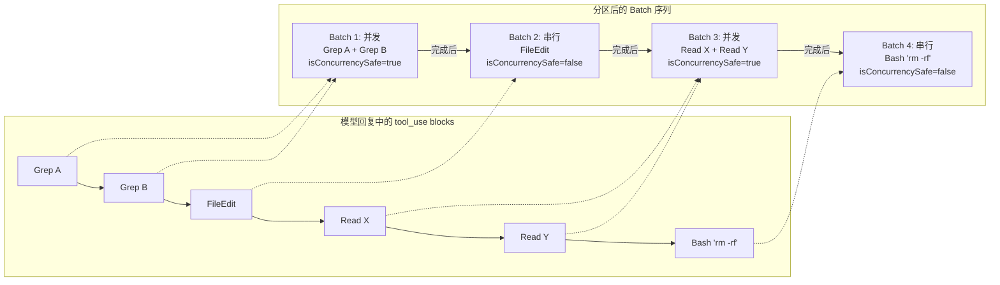
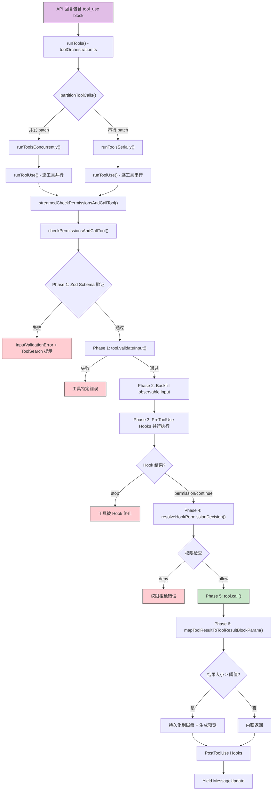
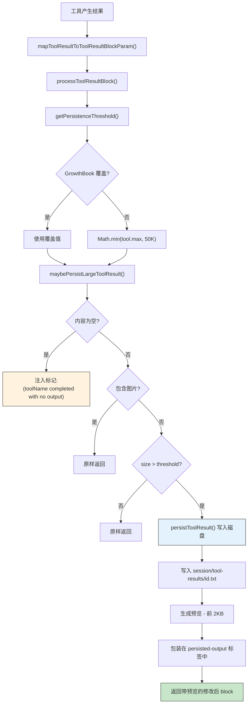

# 第九章：Tool Execution Engine

> 当 Claude 的一次回复中包含五个 tool_use block -- 两个 Grep、一个 FileEdit、两个 Read -- 它们应该怎样执行？哪些可以并发？哪些必须串行？如果某个工具返回了 200KB 的结果，上下文窗口如何承受？这些问题的答案隐藏在 Claude Code 的 Tool Execution Engine 中：一个由 `toolOrchestration.ts` 和 `toolExecution.ts` 两个文件构成的精密管线。本章将从并发分区策略开始，逐步深入 20 步执行管线、流式并发执行器、结果预算系统和错误恢复机制。

---

## 9.1 Tool 编排：`toolOrchestration.ts` 的并发分区策略

### 9.1.1 问题定义

一次 API 回复可能包含多个 `tool_use` block。天真的串行执行浪费时间，天真的并发执行则会引发竞态条件 -- 假设两个 FileEdit 同时修改同一个文件，结果将不可预测。Claude Code 需要一种策略：在保证安全的前提下最大化并发。

解法是 **并发分区算法**（Concurrency Partitioning）。

### 9.1.2 分区算法

`partitionToolCalls()` 函数是编排层的核心。它接收一组 `ToolUseBlock`，根据每个工具的 `isConcurrencySafe()` 声明，将它们划分为有序的 Batch 序列：

```typescript
function partitionToolCalls(
  toolUseMessages: ToolUseBlock[],
  toolUseContext: ToolUseContext,
): Batch[] {
  return toolUseMessages.reduce((acc: Batch[], toolUse) => {
    const tool = findToolByName(toolUseContext.options.tools, toolUse.name)
    const parsedInput = tool?.inputSchema.safeParse(toolUse.input)
    const isConcurrencySafe = parsedInput?.success
      ? tool?.isConcurrencySafe(parsedInput.data) ?? false
      : false
    if (isConcurrencySafe && acc[acc.length - 1]?.isConcurrencySafe) {
      acc[acc.length - 1]!.blocks.push(toolUse)  // 合并到当前 batch
    } else {
      acc.push({ isConcurrencySafe, blocks: [toolUse] })  // 开启新 batch
    }
    return acc
  }, [])
}
```

算法逻辑精练但关键设计决策值得展开：

1. **连续合并**：相邻的 concurrency-safe 工具被合并进同一个 batch。一旦遇到非安全工具，立即切断，开启新的 serial batch。
2. **Fail-closed 默认**：当 `isConcurrencySafe()` 抛出异常（例如 shell-quote 解析失败），默认为 `false`。当工具未定义此方法时，`buildTool()` 的默认值也是 `false`。
3. **输入依赖**：注意 `isConcurrencySafe` 接收 `parsedInput.data` 作为参数。BashTool 的并发安全性取决于命令内容 -- 只有只读命令（如 `cat`、`ls`、`git status`）才被标记为安全。

### 9.1.3 分区可视化

考虑模型一次回复中包含以下六个 tool_use block 的场景：



Batch 之间严格按顺序执行。Batch 内部，并发 batch 使用 `all()` 并行运行，串行 batch 使用 `for...of` 逐一执行。

### 9.1.4 各工具的并发安全声明

下表是核心工具的安全性声明：

| Tool | `isConcurrencySafe` | `isReadOnly` | 设计理由 |
|------|---------------------|-------------|----------|
| BashTool | `this.isReadOnly(input)` | 通过 `checkReadOnlyConstraints` 检测 | 仅只读命令可并发 |
| FileReadTool | `true` | `true` | 纯读取操作 |
| FileEditTool | `false` (默认) | `false` (默认) | 写入文件，可能冲突 |
| FileWriteTool | `false` (默认) | `false` (默认) | 写入文件 |
| GlobTool | `true` | `true` | 纯搜索 |
| GrepTool | `true` | `true` | 纯搜索 |
| WebFetchTool | `true` | `true` | 网络只读 |
| AgentTool | `false` (默认) | `false` (默认) | 子 Agent 有副作用 |

`buildTool()` 的默认值设计为 **fail-closed**：忘记声明 `isConcurrencySafe` 的工具被当作串行执行，忘记声明 `isReadOnly` 的工具被当作写操作。这避免了意外的并发写入。

---

## 9.2 20 步执行管线

`checkPermissionsAndCallTool()` 是执行引擎的心脏，一个约 600 行的函数。每一次工具调用都经历完整的 20 步管线。

### 9.2.1 管线全景



### 9.2.2 Phase 1: Input Validation（步骤 1-2）

**步骤 1 -- Zod Schema 验证**：对模型提供的 JSON 输入执行 `inputSchema.safeParse()`。如果验证失败，且该工具是 deferred tool（schema 未发送给模型），系统会在错误消息中附加 ToolSearch 引导提示：

```typescript
export function buildSchemaNotSentHint(tool, messages, tools): string | null {
  if (!isDeferredTool(tool)) return null
  const discovered = extractDiscoveredToolNames(messages)
  if (discovered.has(tool.name)) return null
  return `This tool's schema was not sent to the API...
    Load the tool first: call ${TOOL_SEARCH_TOOL_NAME} with query "select:${tool.name}"`
}
```

**步骤 2 -- 工具特定验证**：调用 `tool.validateInput()`。以 FileEditTool 为例，它在此阶段执行 11 项检查：秘密检测、old_string === new_string 拒绝、文件存在性、read-before-write 强制、字符串唯一性等。

### 9.2.3 Phase 2: Input Preparation（步骤 3-5）

**步骤 3 -- 投机性 Bash Classifier 启动**：对 BashTool，在 hooks 运行之前就启动 classifier 检查，与 hooks 并行执行以降低延迟：

```typescript
if (tool.name === BASH_TOOL_NAME) {
  startSpeculativeClassifierCheck(
    command, toolPermissionContext, signal, isNonInteractiveSession
  )
}
```

**步骤 4 -- 防御性清理**：从模型输入中剥离 `_simulatedSedEdit` 字段。该字段仅供内部使用，属于纵深防御措施。

**步骤 5 -- Observable Input 回填**：创建输入的浅拷贝，在拷贝上填充派生字段（如绝对路径），供 hooks 和权限检查使用。原始输入保留不变，用于 `tool.call()` 和结果记录，确保 transcript 的稳定性。

### 9.2.4 Phase 3: Pre-Tool Hooks（步骤 6）

**步骤 6**：并行执行所有 `PreToolUse` hooks。Hook 可以返回四种结果：

- **hookPermissionResult**：覆盖权限决策（allow/deny）
- **hookUpdatedInput**：修改工具输入
- **preventContinuation**：允许执行但阻止后续模型循环
- **stop**：立即终止工具执行

Hook 进度通过同一个 progress pipeline 上报，耗时超过 500ms（`HOOK_TIMING_DISPLAY_THRESHOLD_MS`）时会在 UI 中内联显示。

### 9.2.5 Phase 4: Permission Resolution（步骤 7-10）

**步骤 7**：启动 OTel tool span 以追踪执行。

**步骤 8**：`resolveHookPermissionDecision()` 合并 hook 权限结果与 `canUseTool` 交互式检查。Hook 结果优先级高于交互式检查。

**步骤 9**：记录 `tool_decision` OTel 事件。

**步骤 10**：如果权限被拒绝，生成错误消息并触发 `PermissionDenied` hooks。

### 9.2.6 Phase 5: Tool Execution（步骤 11-14）

**步骤 11 -- 输入协调**：如果 hooks 未修改 `file_path`，恢复模型的原始路径。

**步骤 12**：启动 session activity tracking。

**步骤 13 -- 核心调用**：执行 `tool.call(args, context, canUseTool, parentMessage, onProgress)`。`onProgress` 回调使工具能在执行过程中推送进度更新。

**步骤 14**：记录执行时长。

### 9.2.7 Phase 6: Post-Execution（步骤 15-20）

**步骤 15**：调用 `mapToolResultToToolResultBlockParam()` 将工具输出转换为 API 格式。

**步骤 16**：大结果持久化处理（详见 9.5 节）。

**步骤 17**：附加权限决策的 accept feedback 和 content blocks。

**步骤 18**：执行 `PostToolUse` hooks。对 MCP 工具，hooks 可以修改输出内容。

**步骤 19**：将工具结果中的 `newMessages` 注入消息流。

**步骤 20**：处理 pre-hooks 设置的 `shouldPreventContinuation` 标记。

---

## 9.3 `StreamingToolExecutor`：流式并发执行

### 9.3.1 从同步到流式的桥接

`checkPermissionsAndCallTool()` 是一个返回 `Promise<MessageUpdateLazy[]>` 的 async 函数，而编排层需要 `AsyncIterable<MessageUpdateLazy>` 以支持流式 UI 更新。`streamedCheckPermissionsAndCallTool()` 负责这个桥接：

```typescript
function streamedCheckPermissionsAndCallTool(
  ...
): AsyncIterable<MessageUpdateLazy> {
  const stream = new Stream<MessageUpdateLazy>()
  checkPermissionsAndCallTool(
    ...,
    progress => {
      stream.enqueue({
        message: createProgressMessage({ ... })
      })
    },
  )
    .then(results => {
      for (const r of results) stream.enqueue(r)
    })
    .catch(error => { stream.error(error) })
    .finally(() => { stream.done() })
  return stream
}
```

`Stream` 是一个自定义的 async iterable，本质上是一个带 enqueue/done/error 接口的通道。它允许生产者（工具执行）和消费者（UI 渲染）异步解耦。

### 9.3.2 入口函数 `runTools()`

`runTools()` 是整个引擎的顶层入口。它是一个 AsyncGenerator，按 batch 顺序 yield `MessageUpdate` 事件：

```typescript
export async function* runTools(
  toolUseMessages: ToolUseBlock[],
  assistantMessages: AssistantMessage[],
  canUseTool: CanUseToolFn,
  toolUseContext: ToolUseContext,
): AsyncGenerator<MessageUpdate, void> {
  let currentContext = toolUseContext
  for (const { isConcurrencySafe, blocks } of partitionToolCalls(...)) {
    if (isConcurrencySafe) {
      for await (const update of runToolsConcurrently(...)) { ... }
      // 按 block 顺序应用排队的 context modifiers
    } else {
      for await (const update of runToolsSerially(...)) { ... }
    }
  }
}
```

### 9.3.3 并发执行路径

```typescript
async function* runToolsConcurrently(...) {
  yield* all(
    toolUseMessages.map(async function* (toolUse) { ... }),
    getMaxToolUseConcurrency(),  // 默认: 10
  )
}
```

`all()` 是 `utils/generators.ts` 中的辅助函数，它以指定的并发上限运行多个 AsyncGenerator，将它们的输出交织成单一流。并发上限通过 `CLAUDE_CODE_MAX_TOOL_USE_CONCURRENCY` 环境变量配置，默认为 10。

### 9.3.4 串行执行路径与 Context Modifier

```typescript
async function* runToolsSerially(...) {
  let currentContext = toolUseContext
  for (const toolUse of toolUseMessages) {
    for await (const update of runToolUse(...)) {
      if (update.contextModifier) {
        currentContext = update.contextModifier.modifyContext(currentContext)
      }
      yield { message: update.message, newContext: currentContext }
    }
  }
}
```

**关键差异**：串行路径中，`contextModifier` 在每个工具完成后立即应用。并发路径中，modifier 被排队，在整个 batch 完成后按 block 原始顺序统一应用。

这个设计保证了：一个工具的副作用对后续串行工具立即可见，但并发工具之间互不干扰。

---

## 9.4 并发模型深度分析

### 9.4.1 Context Modifier 的排队语义

`ToolResult<T>` 类型包含可选的 `contextModifier` 字段：

```typescript
export type ToolResult<T> = {
  data: T
  newMessages?: Message[]
  contextModifier?: (context: ToolUseContext) => ToolUseContext
}
```

Context modifier 是工具向执行环境反馈状态变更的唯一机制。典型用例包括：

- FileEditTool 更新 `readFileState` 缓存
- Hook 修改 `toolDecisions` 映射
- MCP 工具更新 `mcpClients` 状态

在并发 batch 中，如果两个工具同时修改同一个 context 字段，先完成的会被后完成的覆盖。排队后按 block 顺序应用确保了确定性。

### 9.4.2 BashTool 的动态并发性

BashTool 是唯一一个 `isConcurrencySafe` 依赖于输入内容的内建工具。它的实现链为：

```
isConcurrencySafe(input)
  -> isReadOnly(input)
    -> checkReadOnlyConstraints(command)
```

`checkReadOnlyConstraints` 使用 shell-quote 解析命令，与预定义的命令分类集对比：

```typescript
BASH_SEARCH_COMMANDS = ['find', 'grep', 'rg', 'ag', 'ack', 'locate', ...]
BASH_READ_COMMANDS   = ['cat', 'head', 'tail', 'less', 'more', 'wc', ...]
BASH_LIST_COMMANDS   = ['ls', 'tree', 'du']
```

只有命令完全匹配这些集合中的条目才被标记为只读。一个 `ls -la && rm file` 的复合命令会因为 `rm` 的存在被标记为非只读，进而进入串行 batch。

### 9.4.3 并发上限与反压

并发上限默认 10，可通过环境变量调整：

```typescript
function getMaxToolUseConcurrency(): number {
  return parseInt(
    process.env.CLAUDE_CODE_MAX_TOOL_USE_CONCURRENCY || '', 10
  ) || 10
}
```

`all()` 辅助函数实现了 semaphore 语义：当活跃的 generator 数量达到上限时，新的 generator 等待，直到某个正在运行的 generator yield 或完成。这提供了自然的反压机制。

---

## 9.5 结果预算系统

### 9.5.1 问题背景

LLM 的上下文窗口是有限的。如果一个 `grep` 命令返回了 500KB 的匹配结果，直接送入提示词会迅速耗尽 token 预算。Claude Code 的结果预算系统通过分层阈值和磁盘持久化来解决这个问题。

### 9.5.2 常量表

| 常量 | 值 | 用途 |
|------|------|------|
| `DEFAULT_MAX_RESULT_SIZE_CHARS` | 50,000 | 全局默认持久化阈值 |
| `MAX_TOOL_RESULT_TOKENS` | 100,000 | 单个结果的 token 上限 |
| `BYTES_PER_TOKEN` | 4 | token 到字节的换算因子 |
| `MAX_TOOL_RESULT_BYTES` | 400,000 | 单个结果的字节上限 |
| `MAX_TOOL_RESULTS_PER_MESSAGE_CHARS` | 200,000 | 单条消息的结果聚合上限 |
| `TOOL_SUMMARY_MAX_LENGTH` | 50 | 工具摘要最大长度 |

### 9.5.3 Per-Tool `maxResultSizeChars` 设置

| Tool | `maxResultSizeChars` | 设计理由 |
|------|---------------------|----------|
| BashTool | 30,000 | 中等输出量 |
| FileReadTool | **Infinity** | 通过 maxTokens 自限；持久化会导致循环 Read |
| FileEditTool | 100,000 | diff 可能很大 |
| GlobTool | 100,000 | 大量文件路径 |
| GrepTool | 20,000 | 已有 head_limit 默认值 250 约束 |
| WebFetchTool | 100,000 | 网页可能很大 |

注意 FileReadTool 设置为 `Infinity`。这是刻意的：如果读取结果被持久化到磁盘，模型会再次调用 Read 来获取持久化文件，导致无限循环。因此 FileReadTool 通过 `maxTokens` 参数在源头自限。

### 9.5.4 持久化阈值解析

```typescript
export function getPersistenceThreshold(
  toolName: string,
  declaredMaxResultSizeChars: number,
): number {
  // Infinity = 硬性退出（FileReadTool）
  if (!Number.isFinite(declaredMaxResultSizeChars))
    return declaredMaxResultSizeChars
  // GrowthBook 覆盖优先
  const override = overrides?.[toolName]
  if (typeof override === 'number' && override > 0)
    return override
  // 钳制到全局默认值
  return Math.min(declaredMaxResultSizeChars, DEFAULT_MAX_RESULT_SIZE_CHARS)
}
```

三层优先级：Infinity 退出 > GrowthBook 远程覆盖 > `min(tool 声明, 全局默认)`。

### 9.5.5 磁盘持久化流程



### 9.5.6 持久化结果格式

当结果被写入磁盘后，模型看到的内容如下：

```xml
<persisted-output>
Output too large (42.3 KB). Full output saved to: /path/to/session/tool-results/abc123.txt

Preview (first 2.0 KB):
[前 2000 字节的内容]
...
</persisted-output>
```

文件存储路径为 `{projectDir}/{sessionId}/tool-results/{toolUseId}.{txt|json}`。

### 9.5.7 空结果处理

空的 `tool_result` 出现在提示词末尾时，会导致模型生成 stop sequence。这是一个微妙的 bug，解决方案是为每个空结果注入标记：

```typescript
if (isToolResultContentEmpty(content)) {
  return {
    ...toolResultBlock,
    content: `(${toolName} completed with no output)`
  }
}
```

### 9.5.8 聚合预算与 Content Replacement State

单条消息的结果聚合上限为 200,000 字符（`MAX_TOOL_RESULTS_PER_MESSAGE_CHARS`）。系统通过 `ContentReplacementState` 跟踪预算使用：

```typescript
export type ContentReplacementState = {
  seenIds: Set<string>              // 已通过预算检查的结果
  replacements: Map<string, string> // 已持久化结果 -> 预览字符串
}
```

这个状态有两个关键属性：

1. **不可重置**：一旦某个 `tool_use_id` 的命运被决定（内联或持久化），决定被冻结。过期的 UUID 键是惰性的。
2. **子 Agent 克隆**：当派生子 Agent 时，状态被克隆。这确保了缓存共享分支需要相同的决策，维护了 prompt cache 的稳定性。

---

## 9.6 Progress Reporting

### 9.6.1 类型层级

```typescript
export type ToolProgress<P extends ToolProgressData> = {
  toolUseID: string
  data: P
}

export type ToolCallProgress<P extends ToolProgressData = ToolProgressData> = (
  progress: ToolProgress<P>,
) => void
```

`ToolProgressData` 是一个 discriminated union，包含多种工具特定的进度类型：

| 类型 | 字段 | 典型使用场景 |
|------|------|-------------|
| `BashProgress` | output, fullOutput, elapsedTimeSeconds, totalLines, totalBytes | 长时间运行的命令 |
| `MCPProgress` | MCP 执行进度 | MCP 工具调用 |
| `AgentToolProgress` | 子 Agent 状态 | 嵌套 Agent 执行 |
| `WebSearchProgress` | 搜索进度 | 网络搜索 |
| `TaskOutputProgress` | 任务输出流 | 后台任务 |
| `SkillToolProgress` | Skill 进度 | Skill 执行 |

### 9.6.2 Progress 流转路径

```
tool.call(onProgress)
  -> streamedCheckPermissionsAndCallTool(onToolProgress)
    -> stream.enqueue(createProgressMessage(...))
      -> runToolsConcurrently/runToolsSerially yields MessageUpdate
        -> UI 通过 renderToolUseProgressMessage() 渲染
```

BashTool 是 progress reporting 的主要用户。它使用 generator 模式持续 yield 进度更新：

```typescript
do {
  generatorResult = await commandGenerator.next();
  if (!generatorResult.done && onProgress) {
    onProgress({
      toolUseID: `bash-progress-${progressCounter++}`,
      data: {
        type: 'bash_progress',
        output: progress.output,
        fullOutput: progress.fullOutput,
        elapsedTimeSeconds: progress.elapsedTimeSeconds,
        totalLines: progress.totalLines,
        totalBytes: progress.totalBytes,
      },
    });
  }
} while (!generatorResult.done);
```

进度更新只在工具执行超过 2 秒（`PROGRESS_THRESHOLD_MS = 2000`）后才开始显示。

### 9.6.3 Hook Progress 与时序

Pre/Post hooks 同样通过 progress pipeline 上报进度：

```typescript
for await (const result of runPreToolUseHooks(...)) {
  switch (result.type) {
    case 'message':
      if (result.message.message.type === 'progress') {
        onToolProgress(result.message.message)
      }
      break
  }
}
```

Hook 的耗时会被追踪。当 hook 执行超过 500ms（`HOOK_TIMING_DISPLAY_THRESHOLD_MS`）时，耗时信息会内联显示在 UI 中。

---

## 9.7 错误分类与恢复

### 9.7.1 错误分类表

执行管线的不同阶段产生不同类型的错误：

| 阶段 | 错误类型 | 结果处理 |
|------|---------|---------|
| 工具查找 | 工具不存在 | `is_error: true`，"No such tool available" |
| 中止信号 | AbortError | 返回 `CANCEL_MESSAGE` tool_result |
| Zod 验证 | InputValidationError | `is_error: true`，格式化的 Zod 错误 |
| 工具验证 | ValidationResult.false | `is_error: true`，工具特定消息 |
| 权限拒绝 | deny behavior | `is_error: true`，拒绝消息 |
| 工具执行 | 任意 Error | `is_error: true`，格式化的错误消息 |
| MCP 认证 | McpAuthError | 更新 MCP client 状态为 'needs-auth' |

### 9.7.2 错误恢复策略

所有错误都被转换为 `is_error: true` 的 `tool_result` 消息送回模型。这个设计有一个重要含义：**模型可以从错误中恢复**。当模型收到一个 `is_error: true` 的结果时，它可以：

1. 修正输入参数后重试
2. 选择使用不同的工具
3. 向用户报告错误并请求帮助

MCP 认证错误是唯一的特例：它不仅返回错误消息，还更新 MCP client 的状态为 `needs-auth`，触发 UI 层面的重新认证流程。

### 9.7.3 Abort Signal 的传播

`ToolUseContext` 携带一个 `AbortController`，其 `signal` 贯穿整个管线。在管线的多个检查点，系统会检查 `signal.aborted`：

- 工具查找后（步骤 1 之后）
- Hook 执行前（步骤 6 之前）
- 权限检查后（步骤 10 之后）
- `tool.call()` 内部（工具自行检查）

中止时，系统返回 `CANCEL_MESSAGE` 而非错误，让模型知道这是用户发起的取消而非执行失败。

### 9.7.4 Deferred Tool 的优雅降级

当模型调用一个 deferred tool 而未先加载其 schema 时，Zod 验证必然失败。但系统不是简单报错，而是在错误消息中附加引导提示：

```
This tool's schema was not sent to the API.
Load the tool first: call ToolSearch with query "select:ToolName"
```

这种设计使模型能够自我修复：下一轮循环中，模型会先调用 ToolSearch 加载 schema，然后重新调用目标工具。

---

## 9.8 架构设计总结

Tool Execution Engine 的设计体现了几个核心原则：

1. **Fail-closed 安全**：默认假设工具不安全、会写入、不可并发。安全的行为必须显式声明。
2. **流式优先**：整个编排层基于 AsyncGenerator，支持流式 UI 更新和自然的反压机制。
3. **确定性并发**：通过分区算法将并发决策前移到执行之前。Context modifier 的排队语义确保了并发 batch 内的确定性。
4. **分层预算**：结果预算系统通过 per-tool 阈值、全局默认、远程覆盖、聚合上限四层控制，在保留足够信息的同时防止上下文窗口溢出。
5. **可恢复错误**：所有错误都被转换为结构化的 tool_result 返回模型，使模型具备自我修复能力。

这些设计使 Claude Code 能够在单次交互中安全地并发执行数十个工具调用，同时在有限的上下文窗口内维持对话的连贯性。
