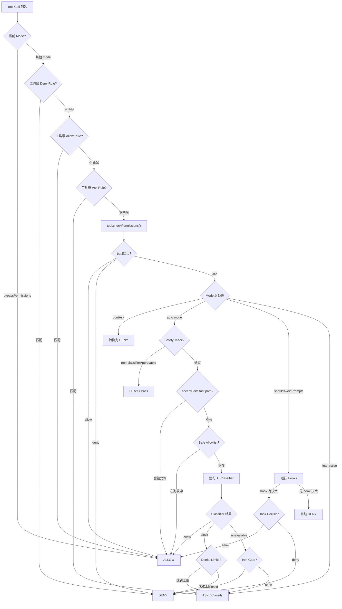
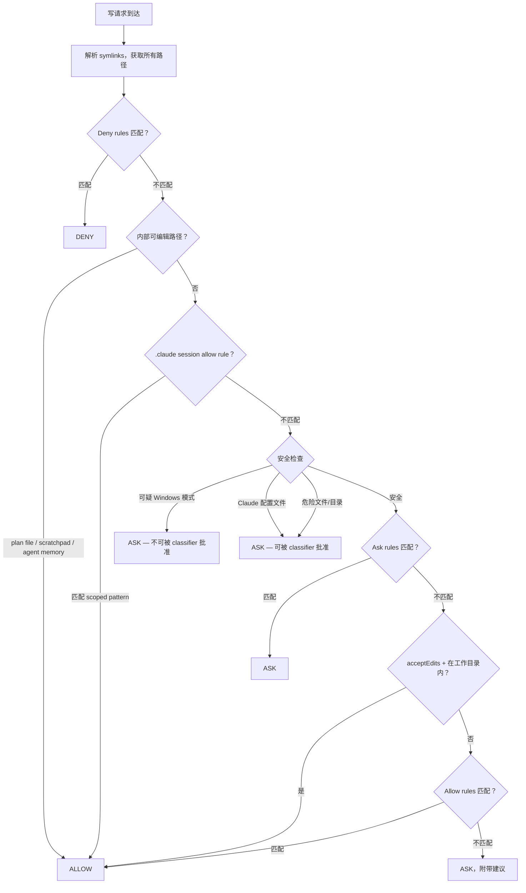
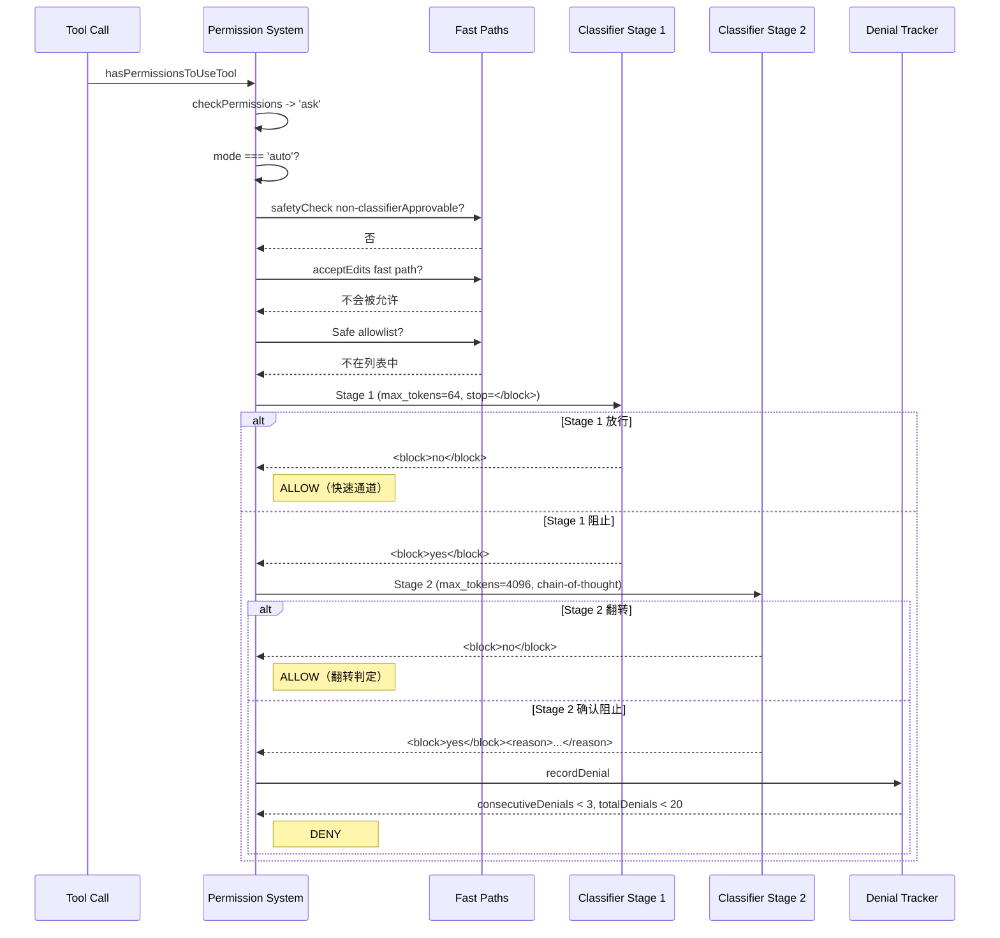

# 第十章：Permission System — 多层安全架构

> 在一个能读写文件、执行任意 Shell 命令、调用外部 API 的 AI Agent 系统中，权限控制不是可选功能，而是核心架构约束。Claude Code 的 Permission System 由七个 rule source、六种 permission mode、一个完整的 decision tree、一套 AI classifier pipeline 和 OS 级 sandbox 共同构成。本章将完整剖析这套多层安全体系的设计、实现与安全不变量。

---

## 10.1 Permission Mode 枚举

Claude Code 的所有权限判断都以当前 **permission mode** 为起点。Mode 决定了系统对每一次工具调用的基本态度：是直接放行、自动拒绝、交给 AI classifier 判断，还是弹出 prompt 让用户决策。

### 10.1.1 外部可见 Mode

面向用户的五种 mode 定义在 `src/types/permissions.ts`：

```typescript
export const EXTERNAL_PERMISSION_MODES = [
  'acceptEdits',
  'bypassPermissions',
  'default',
  'dontAsk',
  'plan',
] as const
```

### 10.1.2 内部 Mode

内部增加了两种 mode，不暴露给普通用户：

```typescript
export type InternalPermissionMode = ExternalPermissionMode | 'auto' | 'bubble'
```

### 10.1.3 Mode 行为矩阵

| Mode | 行为描述 | CWD 内文件编辑 | Bash 命令 | 使用 Classifier |
|------|---------|---------------|----------|----------------|
| `default` | 每次写入/执行都 prompt | Ask | Ask | 否 |
| `acceptEdits` | 自动允许工作目录内的文件编辑 | Allow (in CWD) | Ask | 否 |
| `bypassPermissions` | 跳过所有权限检查 | Allow | Allow | 否 |
| `dontAsk` | 永不弹窗；需要询问时直接 deny | Deny | Deny | 否 |
| `plan` | 只读规划模式；规划期间可激活 auto classifier | 视情况 | 视情况 | 条件性 |
| `auto` | AI classifier 自主决定 allow/deny | Classifier | Classifier | 是 |
| `bubble` | 内部专用 mode | N/A | N/A | 否 |

### 10.1.4 Mode 初始化优先级

`permissionSetup.ts` 中的 `initialPermissionModeFromCLI` 函数按以下优先级解析 mode：

1. `--dangerously-skip-permissions` CLI flag -> `bypassPermissions`
2. `--permission-mode` CLI flag -> 解析的 mode
3. `settings.permissions.defaultMode` -> settings 中的 mode
4. Fallback -> `default`

关键安全守卫：
- `bypassPermissions` 可被 Statsig gate `tengu_disable_bypass_permissions_mode` 或 settings `permissions.disableBypassPermissionsMode: 'disable'` 禁用
- `auto` mode 在 circuit breaker 激活时被阻止（`tengu_auto_mode_config.enabled === 'disabled'`）
- 在 CCR（Claude Code Remote）环境中，settings 只允许 `acceptEdits`、`plan` 和 `default` 三种 mode

### 10.1.5 Mode 转换

`transitionPermissionMode` 函数集中管理所有状态转换：

```
default <-> acceptEdits : 直接切换
default <-> auto        : 切换时剥离/恢复危险权限
default <-> plan        : 保存 prePlanMode，处理 plan attachments
auto    <-> plan        : auto 在 plan mode 内保持激活
```

进入 `auto` mode 时的关键操作：
- 调用 `setAutoModeActive(true)`
- `stripDangerousPermissionsForAutoMode` 移除会绕过 classifier 的规则（如 `Bash(*)`、`Bash(python:*)`）
- 被剥离的规则保存到 `strippedDangerousRules`，退出时恢复

这是一个重要的安全不变量：如果用户之前设置了 `Bash(*)` 的 always-allow 规则，在切换到 auto mode 时系统会**主动剥离**这些规则，确保 classifier 不被旁路。

---

## 10.2 Rule System：来源与优先级

### 10.2.1 Rule 类型定义

每条 permission rule 由三部分组成：

```typescript
export type PermissionRule = {
  source: PermissionRuleSource       // 来自哪一层
  ruleBehavior: PermissionBehavior   // 'allow' | 'deny' | 'ask'
  ruleValue: PermissionRuleValue     // 工具名 + 匹配内容
}
```

其中 `PermissionRuleValue` 定义了目标工具和匹配模式：

```typescript
export type PermissionRuleValue = {
  toolName: string      // e.g., "Bash", "Edit", "mcp__server1__tool1"
  ruleContent?: string  // e.g., "npm test:*", "/.env", "domain:example.com"
}
```

### 10.2.2 八层 Rule Source

Rule source 按优先级从高到低排列：

```typescript
export type PermissionRuleSource =
  | 'policySettings'    // 组织级策略（最高优先级）
  | 'flagSettings'      // Feature flag / 远程配置
  | 'localSettings'     // .claude/settings.local.json
  | 'projectSettings'   // .claude/settings.json
  | 'userSettings'      // ~/.claude/settings.json
  | 'cliArg'            // --allowed-tools, --disallowed-tools
  | 'command'           // Slash commands
  | 'session'           // 会话级瞬态规则（最低优先级）
```



```mermaid
graph TB
    subgraph "Rule Source 优先级栈（从高到低）"
        P["1. policySettings — 组织策略<br/>管理员通过 MDM/策略配置下发<br/>不可被用户覆盖"]
        FL["2. flagSettings — Feature Flags<br/>Statsig 远程配置<br/>运行时动态下发"]
        L["3. localSettings — .claude/settings.local.json<br/>本地私有配置<br/>不提交到 Git"]
        PR["4. projectSettings — .claude/settings.json<br/>项目级配置<br/>团队共享，提交到 Git"]
        U["5. userSettings — ~/.claude/settings.json<br/>用户全局配置<br/>跨项目生效"]
        C["6. cliArg — CLI 参数<br/>--allowed-tools, --disallowed-tools<br/>单次运行生效"]
        CMD["7. command — Slash Commands<br/>通过 /command 注入<br/>运行期间生效"]
        S["8. session — 会话级规则<br/>用户在会话中授权<br/>会话结束即失效"]
    end

    P --> FL --> L --> PR --> U --> C --> CMD --> S

    subgraph "行为优先级"
        D["deny > ask > allow"]
        M["同一行为内：首次匹配胜出"]
    end
```

### 10.2.3 Rule 匹配机制

规则匹配分两个层次：

**Tool 级匹配**（`toolMatchesRule`）：
- 精确匹配：规则 `Bash` 匹配工具 `Bash`
- MCP Server 级：规则 `mcp__server1` 匹配 `mcp__server1__tool1`
- MCP 通配符：规则 `mcp__server1__*` 匹配 server1 的所有工具

**Content 级匹配**（`filesystem.ts` 中的 `matchingRuleForInput`）：
- 使用 `ignore` 库（gitignore 风格 glob 匹配）
- Pattern 前缀决定解析根目录：
  - `//path` -> 文件系统根目录的绝对路径
  - `~/path` -> 相对于用户 home 目录
  - `/path` -> 相对于 settings 文件所在目录
  - `path` -> 无根（任何位置匹配）

### 10.2.4 危险规则检测

`dangerousPatterns.ts` 定义了会绕过 auto-mode classifier 的危险模式：

```typescript
export const DANGEROUS_BASH_PATTERNS: readonly string[] = [
  // 解释器
  'python', 'python3', 'python2', 'node', 'deno', 'tsx', 'ruby', 'perl', 'php', 'lua',
  // 包运行器
  'npx', 'bunx', 'npm run', 'yarn run', 'pnpm run', 'bun run',
  // Shell
  'bash', 'sh', 'zsh', 'fish',
  // 执行原语
  'eval', 'exec', 'env', 'xargs', 'sudo',
  // 远程
  'ssh',
]
```

检测逻辑（`isDangerousBashPermission`）：
- 无内容的工具级 allow（如 `Bash`、`Bash(*)`、`Bash()`）-> 危险
- 解释器前缀模式（如 `python:*`、`python*`、`python *`）-> 危险
- Dash-wildcard 模式（如 `python -c*`）-> 危险

---

## 10.3 Decision Flow：完整决策树

### 10.3.1 主入口

`hasPermissionsToUseTool` 是所有权限检查的统一入口。它接收工具实例、输入参数和权限上下文，返回 allow / ask / deny 三种决策之一。

### 10.3.2 内层决策（`hasPermissionsToUseToolInner`）

```
1. mode === 'bypassPermissions' ?  -> allow（带 sandbox override 检查）
2. 工具级 allow rule 匹配？       -> allow
3. 工具级 deny rule 匹配？        -> deny
4. 工具级 ask rule 匹配？         -> ask
5. tool.checkPermissions(input, context) -> 工具特定逻辑
```

### 10.3.3 外层后处理

内层返回的结果在外层经过 mode-specific 后处理：



### 10.3.4 Decision 类型系统

```typescript
export type PermissionDecision<Input> =
  | { behavior: 'allow'; updatedInput?; decisionReason? }
  | { behavior: 'ask'; message; suggestions?; pendingClassifierCheck? }
  | { behavior: 'deny'; message; decisionReason }
```

每个 decision 都携带 `decisionReason`，用于审计和调试：

```typescript
export type PermissionDecisionReason =
  | { type: 'rule'; rule: PermissionRule }
  | { type: 'mode'; mode: PermissionMode }
  | { type: 'classifier'; classifier: string; reason: string }
  | { type: 'hook'; hookName: string }
  | { type: 'sandboxOverride'; reason: string }
  | { type: 'safetyCheck'; reason: string; classifierApprovable: boolean }
  | { type: 'workingDir'; reason: string }
  | { type: 'subcommandResults'; reasons: Map<string, PermissionResult> }
  // ... 更多类型
```

---

## 10.4 Bash 命令安全分析

Bash 工具是 Claude Code 安全模型中风险最高的表面。一条 `Bash` 调用可以执行任意 shell 命令，因此系统对其实施了多层防御。

### 10.4.1 Command Parsing：注入抵抗

`commands.ts` 中的 `splitCommandWithOperators` 函数是 bash 安全分析的基础。

**随机 Salt Placeholder 生成**：

```typescript
function generatePlaceholders() {
  const salt = randomBytes(8).toString('hex')
  return {
    SINGLE_QUOTE: `__SINGLE_QUOTE_${salt}__`,
    DOUBLE_QUOTE: `__DOUBLE_QUOTE_${salt}__`,
    NEW_LINE: `__NEW_LINE_${salt}__`,
    // ...
  }
}
```

为什么需要随机 salt？如果 placeholder 是固定字符串（如 `__SINGLE_QUOTE__`），攻击者可以构造包含该字面量的命令，导致在 placeholder 还原阶段被错误替换。随机 salt 使得 placeholder 不可预测，从根本上消除了这类注入风险。

**Line Continuation 安全处理**：

```typescript
// 安全规则：只在反斜杠数量为奇数时合并行
// 偶数：反斜杠成对，换行符是命令分隔符
// 奇数：最后一个反斜杠转义换行符（行续接）
const commandWithContinuationsJoined = processedCommand.replace(
  /\\+\n/g,
  match => {
    const backslashCount = match.length - 1
    if (backslashCount % 2 === 1) {
      return '\\'.repeat(backslashCount - 1)
    }
    return match
  },
)
```

### 10.4.2 Redirection 检测

`isStaticRedirectTarget` 函数拒绝重定向目标中的所有动态内容：

| 拒绝的模式 | 示例 | 风险 |
|-----------|------|------|
| Shell 变量 | `$HOME`, `${VAR}` | 运行时路径不可预测 |
| Command substitution | `` `pwd` `` | 任意命令执行 |
| Glob 模式 | `*`, `?`, `[` | 目标文件不确定 |
| Brace expansion | `{1,2}` | 多目标展开 |
| Tilde expansion | `~` | 用户目录解析 |
| Process substitution | `>(cmd)`, `<(cmd)` | 隐式命令执行 |
| History expansion | `!!`, `!-1` | 重放历史命令 |
| 空字符串 | `""` | 会被解析为 CWD |
| Comment-prefixed | `#file` | Parser 混淆 |

### 10.4.3 Read-Only 命令验证

`readOnlyCommandValidation.ts` 为 20+ 个 git 子命令和外部命令定义了详尽的安全 flag 映射：

```typescript
export type FlagArgType =
  | 'none'    // 无参数（--color）
  | 'number'  // 整数参数（--context=3）
  | 'string'  // 任意字符串参数
  | 'char'    // 单个字符
  | '{}'      // 仅匹配字面量 "{}"
  | 'EOF'     // 仅匹配字面量 "EOF"
```

**Parser Differential 漏洞**：

这是 bash 安全中最微妙的攻击面之一。考虑以下场景：

```
git diff -S -- --output=/tmp/pwned
```

如果验证器将 `-S` 标记为 `'none'`（不接受参数），它会：
1. 看到 `-S`，消费 1 个 token，继续
2. 遇到 `--`，停止检查（后面都是位置参数）
3. `--output=/tmp/pwned` 未被检查 -> 通过

但 git 实际上将 `-S` 视为需要参数的 flag：
1. `-S` 消费下一个 token `--` 作为 pickaxe 搜索字符串
2. `--output=/tmp/pwned` 被解析为长选项 -> **任意文件写入**

修复方案：将 `-S`、`-G`、`-O` 的 flag 类型从 `'none'` 修正为 `'string'`。

### 10.4.4 危险子命令检测

```typescript
// git reflog 安全检查
additionalCommandIsDangerousCallback: (_rawCommand, args) => {
  const DANGEROUS_SUBCOMMANDS = new Set(['expire', 'delete', 'exists'])
  for (const token of args) {
    if (!token || token.startsWith('-')) continue
    if (DANGEROUS_SUBCOMMANDS.has(token)) return true
    return false  // 第一个非 flag token 不是危险子命令
  }
  return false
}
```

---

## 10.5 Filesystem 权限

### 10.5.1 Path 验证流水线

`pathValidation.ts` 中的 `validatePath` 是文件路径安全的统一入口：

```
validatePath(path, cwd, context, operationType)
  |
  +-- expandTilde（~ -> $HOME；~user 被阻止）
  +-- 阻止 UNC 路径（containsVulnerableUncPath）
  +-- 阻止 tilde 变体（~root, ~+, ~-, ~N）-> TOCTOU 风险
  +-- 阻止 shell 展开语法（$, %, =cmd）-> TOCTOU 风险
  +-- 写操作阻止 glob 模式
  +-- 读操作 glob：validateGlobPattern（检查基目录）
  +-- 解析路径（绝对路径 + symlink 解析）
  +-- isPathAllowed(resolvedPath, context, operationType)
```

### 10.5.2 Write Permission Flow



### 10.5.3 危险文件与目录

```typescript
export const DANGEROUS_FILES = [
  '.gitconfig', '.gitmodules',
  '.bashrc', '.bash_profile', '.zshrc', '.zprofile', '.profile',
  '.ripgreprc', '.mcp.json', '.claude.json',
]

export const DANGEROUS_DIRECTORIES = [
  '.git', '.vscode', '.idea', '.claude',
]
```

例外：`.claude/worktrees/` 被显式排除在 `.claude` 目录检查之外，因为它是 git worktree 的结构路径。

### 10.5.4 Windows 路径攻击面

`hasSuspiciousWindowsPathPattern` 检测的攻击模式：

| 模式 | 示例 | 风险 |
|------|------|------|
| NTFS Alternate Data Streams | `file.txt::$DATA` | 隐藏数据访问 |
| 8.3 短名称 | `SETTIN~1.JSON` | 绕过字符串匹配 |
| 长路径前缀 | `\\?\C:\...` | 绕过路径验证 |
| 尾部点/空格 | `.git.`, `.claude ` | Windows 解析时会剥离 |
| DOS 设备名 | `.git.CON` | 特殊设备访问 |
| UNC 路径 | `\\server\share` | 网络凭证泄露（NTLM） |

关键设计决策：这些检查在**所有平台**上执行（不仅仅是 Windows），因为 NTFS 文件系统可以通过 ntfs-3g 挂载在 Linux/macOS 上。

### 10.5.5 Case 不敏感安全

```typescript
export function normalizeCaseForComparison(path: string): string {
  return path.toLowerCase()
}
```

在所有路径比较中统一应用，防止在 macOS/Windows 等大小写不敏感文件系统上利用 `.cLauDe/Settings.locaL.json` 这类变体绕过检查。

### 10.5.6 临时目录处理

```typescript
export const getClaudeTempDir = memoize(function getClaudeTempDir(): string {
  const baseTmpDir = process.env.CLAUDE_CODE_TMPDIR || '/tmp'
  const resolvedBaseTmpDir = fs.realpathSync(baseTmpDir)  // 解析 symlinks
  return join(resolvedBaseTmpDir, `claude-${uid}`) + sep
})
```

三层防御：
1. **Per-user 目录**（`claude-{uid}`）：防止多用户权限冲突
2. **Symlink 解析**：macOS 上 `/tmp` -> `/private/tmp`，确保路径匹配一致
3. **Per-process nonce**：bundled skills root 使用随机 nonce，防御 symlink 预创建攻击

---

## 10.6 Classifier System

### 10.6.1 Auto-Mode（Yolo）Classifier 架构

Auto mode 的核心是一个**两阶段 XML classifier**，使用 AI 模型在无用户交互的情况下判断工具调用是否安全。

| 模式 | Stage 1（快速） | Stage 2（思考） | 描述 |
|------|---------------|----------------|------|
| `both`（默认） | 是（max_tokens=64） | 仅当 Stage 1 阻止时 | 快速通道：pass 则放行，block 则升级 |
| `fast` | 是（max_tokens=256） | 否 | Stage 1 判定为最终结果 |
| `thinking` | 否 | 是（max_tokens=4096） | 跳过快速阶段 |



### 10.6.2 Transcript 构建安全

Classifier 的 transcript 构建有一个关键安全设计：

```typescript
export function buildTranscriptEntries(messages: Message[]): TranscriptEntry[]
```

- **包含**：用户文本消息和 assistant 的 `tool_use` block
- **排除**：assistant 的文本内容

为什么排除 assistant text？因为 assistant 文本是模型生成的，理论上可以被 prompt injection 利用来影响 classifier 的判断。只保留用户指令和实际的工具调用，确保 classifier 基于事实做判断。

### 10.6.3 Safe Tool Allowlist

以下工具完全跳过 classifier 评估：

```typescript
const SAFE_YOLO_ALLOWLISTED_TOOLS = new Set([
  FILE_READ_TOOL_NAME,           // 只读文件操作
  GREP_TOOL_NAME,                // 搜索
  GLOB_TOOL_NAME,                // 文件查找
  LSP_TOOL_NAME,                 // 语言服务
  TODO_WRITE_TOOL_NAME,          // 任务管理
  ASK_USER_QUESTION_TOOL_NAME,   // 用户交互
  SLEEP_TOOL_NAME,               // 延时
  // ... 更多只读/元数据工具
])
```

注意：Write/Edit 工具**不在**此列表中。它们使用 `acceptEdits` fast-path 检查来避免不必要的 classifier 调用。

### 10.6.4 Fail-Closed / Fail-Open 行为

| 场景 | Iron Gate 关闭（默认） | Iron Gate 开放 |
|------|---------------------|---------------|
| Classifier API 错误 | Deny + 重试引导 | 回退到正常 prompt |
| Transcript 超长 | Abort（headless）/ 回退 prompt | 回退到正常 prompt |

### 10.6.5 Denial Tracking

```typescript
export const DENIAL_LIMITS = {
  maxConsecutive: 3,
  maxTotal: 20,
}
```

当连续拒绝达到 3 次或总拒绝达到 20 次时，系统回退到交互式 prompting。这防止 auto mode 进入无限拒绝循环，同时给用户一个审查和修正的机会。

---

## 10.7 Sandbox 架构

### 10.7.1 OS 级隔离

Sandbox system（`sandbox-adapter.ts`）为 bash 命令提供操作系统级的进程隔离：

- **macOS**：使用 `sandbox-exec`
- **Linux**：使用 `bubblewrap`
- **WSL2+**：使用 `bubblewrap`（WSL1 不支持）

### 10.7.2 Sandbox 配置结构

```typescript
export function convertToSandboxRuntimeConfig(settings): SandboxRuntimeConfig {
  return {
    network: {
      allowedDomains,       // 从 WebFetch allow rules 提取
      deniedDomains,        // 从 WebFetch deny rules 提取
      allowUnixSockets,
      allowLocalBinding,
    },
    filesystem: {
      denyRead,             // Read deny rules + sandbox.filesystem.denyRead
      allowRead,            // sandbox.filesystem.allowRead
      allowWrite,           // Edit allow rules + sandbox.filesystem.allowWrite
      denyWrite,            // Settings 路径 + sandbox.filesystem.denyWrite
    },
    ignoreViolations,
    enableWeakerNestedSandbox,
  }
}
```

### 10.7.3 文件系统限制

**始终可写**：
- 当前工作目录
- Claude 临时目录（`getClaudeTempDir()`）
- Git worktree 主仓库路径
- `--add-dir` 指定的额外目录

**始终拒绝写入**：
- 所有 settings.json 文件（所有 setting source）
- 托管 settings 下发目录
- `.claude/skills/` 目录

### 10.7.4 Bare Git Repo 防护

```typescript
const bareGitRepoFiles = ['HEAD', 'objects', 'refs', 'hooks', 'config']
```

这是一个精妙的安全防护：Git 的 `is_git_directory()` 函数会将包含 `HEAD + objects/ + refs/` 的目录识别为 bare repo。如果攻击者能在工作目录中植入这些文件，Claude 的非沙箱 git 操作可能会**逃逸沙箱**。

防御策略：
- 如果这些文件已存在：deny-write（只读 bind mount）
- 如果不存在：命令执行后清理（`scrubBareGitRepoFiles`）

### 10.7.5 Excluded Commands

通过 `sandbox.excludedCommands` 配置可以指定不经沙箱的命令。当命令被排除时，permission decision 会记录 `{ type: 'sandboxOverride' }`，确保可审计。

---

## 10.8 安全不变量与设计原则

Claude Code 的 Permission System 建立在 13 条核心安全不变量之上：

| # | 不变量 | 实现位置 |
|---|-------|---------|
| 1 | **Deny rules 始终优先于 allow rules** | 每个 permission flow 中首先检查 deny |
| 2 | **写入的安全检查在 allow rules 之前执行** | `checkWritePermissionForTool` 流程 |
| 3 | **路径和工作目录都解析 symlink** | `pathValidation.ts` 中 `fs.realpathSync` |
| 4 | **所有路径比较进行 case 归一化** | `normalizeCaseForComparison` |
| 5 | **命令解析 placeholder 使用随机 salt** | `generatePlaceholders` 中 `randomBytes(8)` |
| 6 | **奇偶反斜杠计数处理行续接** | `splitCommandWithOperators` |
| 7 | **Flag 参数类型必须精确匹配** | `readOnlyCommandValidation.ts` 类型定义 |
| 8 | **Classifier 默认 fail-closed** | `tengu_iron_gate_closed` gate |
| 9 | **进入 auto mode 时剥离危险规则** | `stripDangerousPermissionsForAutoMode` |
| 10 | **Per-user 临时目录（带 UID）** | `getClaudeTempDir` |
| 11 | **Per-process 随机 nonce（bundled skills root）** | `getBundledSkillsRoot` |
| 12 | **Bare git repo 文件清理** | `scrubBareGitRepoFiles` |
| 13 | **Settings 文件对 sandbox 写始终拒绝** | `convertToSandboxRuntimeConfig` |

### 设计原则总结

**纵深防御**（Defense in Depth）：每一层独立有效。Path validation 不依赖 sandbox；rule engine 不依赖 classifier；sandbox 不依赖 rule engine。即使某一层被绕过，其他层仍然提供保护。

**Fail-Closed**：在不确定的情况下拒绝。Classifier 不可用时默认 deny；unknown flag 被视为 dangerous；未匹配的规则 fallback 到 ask。

**最小权限**（Least Privilege）：`auto` mode 不信任已有的宽泛规则；`acceptEdits` 只放行工作目录内的编辑；sandbox 只开放必要的文件系统和网络路径。

**可审计性**（Auditability）：每个 permission decision 都携带 `decisionReason`，记录是哪条规则、哪个 classifier、哪个 hook 做出了决策。这不仅用于调试，也为事后安全审计提供了完整的决策链。

---

## 10.9 本章小结

Claude Code 的 Permission System 不是一个简单的 allow/deny 网关，而是一个由多个正交安全层协同工作的架构：

1. **Mode** 设定基调——系统对工具调用的默认态度
2. **Rules** 提供细粒度控制——八层 source 的优先级栈
3. **Decision Tree** 编排所有判断——从 tool call 到 allow/deny 的完整路径
4. **Bash Security** 深度分析命令——placeholder injection 防护、parser differential 防护、redirection 检测
5. **Filesystem Security** 守卫文件访问——path validation、glob matching、dangerous file/directory 检测
6. **Classifier** 实现自主安全——两阶段 AI 评估 + denial tracking + fail-closed
7. **Sandbox** 提供最后一道防线——OS 级隔离 + bare git repo 防护

这套系统的设计哲学是：**没有单点信任**。每一层都假设其他层可能被绕过，独立维护自己的安全不变量。这种纵深防御架构确保了即使在赋予 AI Agent 强大能力的同时，系统的安全边界仍然是可控和可审计的。
