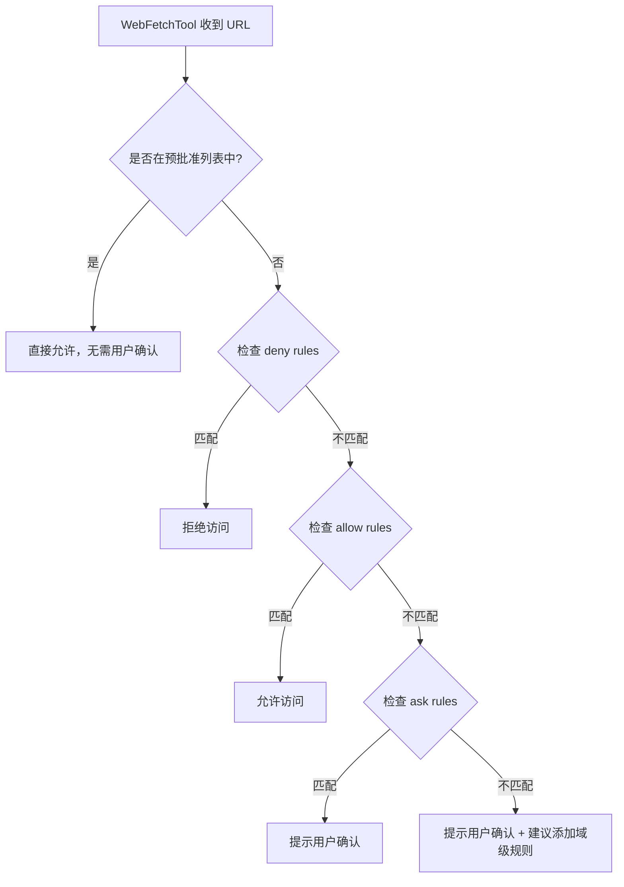
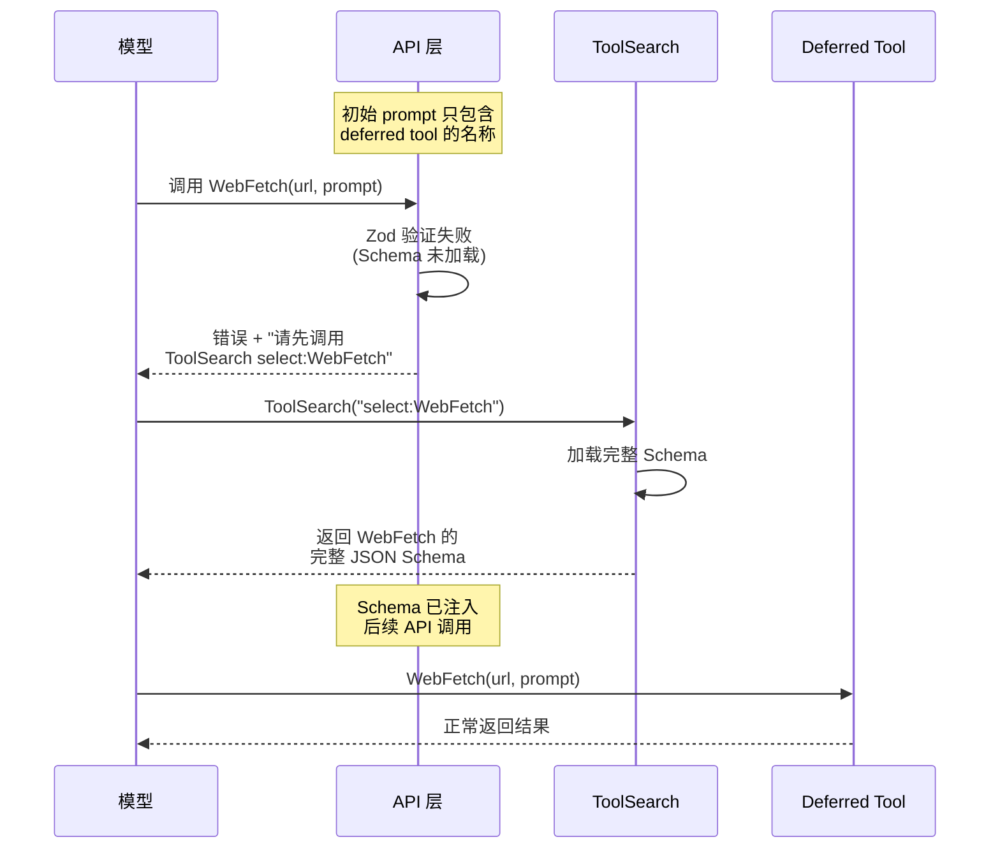
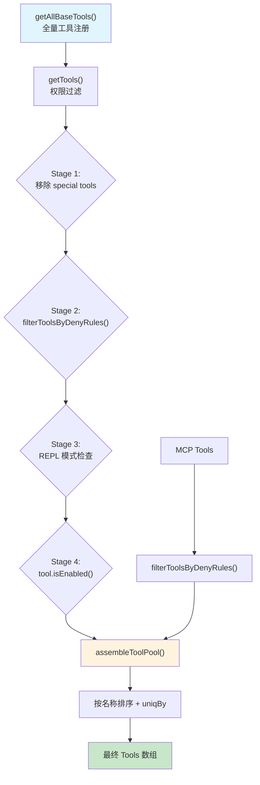
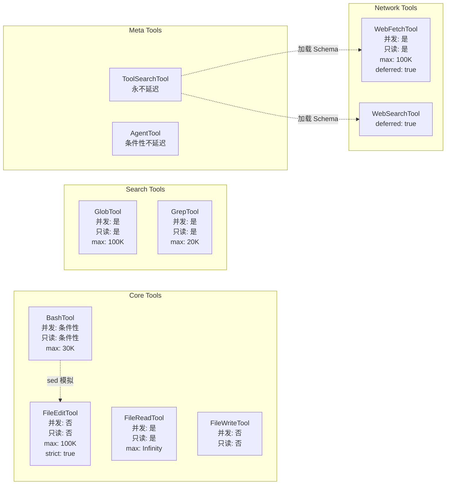

# 第十一章：Built-in Tools 深度剖析

> Claude Code 的每一个"能力"——执行命令、读写文件、搜索代码、获取网页——都被封装为一个 Tool。这些 Tool 不是简单的函数调用包装器，而是携带了安全声明、并发属性、权限模型和输出预算的完整执行单元。本章将逐一拆解七大核心内置 Tool 的设计决策与实现细节，揭示它们如何在保障安全的前提下最大化效率。

---

## 11.1 BashTool：命令执行引擎

BashTool 是 Claude Code 中最复杂的单体 Tool，也是唯一一个真正需要 **运行时行为分析** 才能确定安全属性的 Tool。它不只是"在 shell 里执行命令"那么简单。

### 11.1.1 输入 Schema 与隐藏字段

```typescript
z.strictObject({
  command: z.string(),
  timeout: semanticNumber(z.number().optional()),
  description: z.string().optional(),
  run_in_background: semanticBoolean(z.boolean().optional()),
  dangerouslyDisableSandbox: semanticBoolean(z.boolean().optional()),
  _simulatedSedEdit: z.object({
    filePath: z.string(),
    newContent: z.string(),
  }).optional(),
})
```

注意两个关键设计：

1. **`semanticNumber` / `semanticBoolean`**：模型有时会将数值输出为字符串 `"123"` 而非 `123`。这些 coercer 在 Zod 验证层自动转换类型，消除了模型输出的类型不确定性。

2. **`_simulatedSedEdit`**：这是一个纯内部字段，永远不会出现在发送给模型的 JSON Schema 中。它的作用是在权限预览阶段，将 `sed` 命令预编译为文件内容的结构化变更。模型输入中如果包含此字段，会被强制剥离——这是 defense-in-depth 策略的体现。

### 11.1.2 命令分类集

BashTool 将所有可能执行的命令分为五个集合，这些集合驱动了并发安全判断和 UI 提示：

```typescript
BASH_SEARCH_COMMANDS = ['find', 'grep', 'rg', 'ag', 'ack', 'locate',
                        'which', 'whereis']
BASH_READ_COMMANDS   = ['cat', 'head', 'tail', 'less', 'more', 'wc',
                        'stat', 'file', 'strings', 'jq', 'awk',
                        'cut', 'sort', 'uniq', 'tr']
BASH_LIST_COMMANDS   = ['ls', 'tree', 'du']
BASH_SILENT_COMMANDS = ['mv', 'cp', 'rm', 'mkdir', 'rmdir', 'chmod',
                        'chown', 'chgrp', 'touch', 'ln', 'cd',
                        'export', 'unset', 'wait']
BASH_SEMANTIC_NEUTRAL_COMMANDS = ['echo', 'printf', 'true', 'false', ':']
```

这些分类并非装饰性的。它们直接决定了三个关键行为：

- **并发安全**：`isConcurrencySafe(input)` 委托给 `isReadOnly(input)`，后者通过 `checkReadOnlyConstraints()` 分析命令。只有 search/read/list 类命令才被判定为并发安全。
- **UI 标记**：`isSearchOrReadCommand()` 返回 `{ isSearch, isRead, isList }` 三元组，控制 UI 中的图标和行为描述。
- **权限分类**：silent 命令（有副作用但无输出）得到特殊的权限处理。

### 11.1.3 并发安全判断的保守性

BashTool 的并发安全判断是整个工具系统中最复杂的。它使用 shell-quote 库解析命令，提取出所有管道段和子命令，然后逐一检查。关键原则是 **fail-closed**：

```
git status                    -> 并发安全 (read-only)
cat file.txt | grep pattern   -> 并发安全 (管道两端都是只读)
npm install                   -> 非并发安全 (写操作)
echo "hello" > file.txt       -> 非并发安全 (重定向写)
unknown_command               -> 非并发安全 (未知命令保守处理)
```

当 shell-quote 解析失败时（例如遇到不平衡的引号），默认返回 `false`——宁可串行执行也不冒并发风险。

### 11.1.4 后台任务与阻塞预算

BashTool 实现了一套完整的后台任务机制，核心常量是：

```typescript
ASSISTANT_BLOCKING_BUDGET_MS = 15_000  // 15 秒阻塞预算
```

当模型设置 `run_in_background: true`，或命令执行时间超过阻塞预算时，任务会被转入后台。后台任务获得一个 `taskId`，模型可以通过后续的 Bash 命令查询其状态。

### 11.1.5 Sandbox 集成

`shouldUseSandbox()` 判断是否需要在沙盒环境中执行命令。沙盒通过 `SandboxManager` 管理，提供文件系统级别的隔离。`dangerouslyDisableSandbox` 参数允许显式绕过沙盒，但这个操作本身需要通过权限检查。

### 11.1.6 输出流与 Progress Reporting

BashTool 通过 async generator 实现输出流式传输：

```typescript
do {
  generatorResult = await commandGenerator.next();
  if (!generatorResult.done && onProgress) {
    onProgress({
      toolUseID: `bash-progress-${progressCounter++}`,
      data: {
        type: 'bash_progress',
        output: progress.output,
        fullOutput: progress.fullOutput,
        elapsedTimeSeconds: progress.elapsedTimeSeconds,
        totalLines: progress.totalLines,
        totalBytes: progress.totalBytes,
      },
    });
  }
} while (!generatorResult.done);
```

进度报告有一个 2 秒的阈值 (`PROGRESS_THRESHOLD_MS = 2000`)——短命令不会产生任何 progress 事件，避免了 UI 上的闪烁噪音。

### 11.1.7 Sed 模拟

当模型尝试执行 `sed` 命令修改文件时，BashTool 的权限预览阶段会将 sed 命令预编译为 `_simulatedSedEdit` 结构，包含目标文件路径和预期的新内容。这使得权限系统可以展示一个清晰的 diff 视图，而不是让用户面对晦涩的 sed 表达式。

---

## 11.2 FileReadTool：多态读取引擎

FileReadTool 的核心设计目标是成为一个统一的文件读取入口，无论目标是纯文本、图片、PDF 还是 Jupyter Notebook。

### 11.2.1 六种输出类型

FileReadTool 的输出 Schema 是一个 discriminated union，覆盖六种完全不同的返回格式：

```typescript
z.discriminatedUnion('type', [
  z.object({ type: z.literal('text'),
    file: { filePath, content, numLines, startLine, totalLines } }),
  z.object({ type: z.literal('image'),
    file: { base64, type, originalSize, dimensions } }),
  z.object({ type: z.literal('notebook'),
    file: { filePath, cells } }),
  z.object({ type: z.literal('pdf'),
    file: { filePath, base64, originalSize } }),
  z.object({ type: z.literal('parts'),
    file: { filePath, originalSize, count, outputDir } }),
  z.object({ type: z.literal('file_unchanged'),
    file: { filePath } }),
])
```

`file_unchanged` 类型特别值得注意——当文件自上次读取后未被修改时，FileReadTool 返回这个标记而非重复传输内容，节省了宝贵的 context window token。

### 11.2.2 Infinity 持久化策略

FileReadTool 是唯一将 `maxResultSizeChars` 设为 `Infinity` 的 Tool：

| Tool | maxResultSizeChars | 原因 |
|------|-------------------|------|
| BashTool | 30,000 | 适中的命令输出 |
| FileReadTool | **Infinity** | 自限于 token 上限；持久化会导致循环 Read |
| FileEditTool | 100,000 | diff 输出可能很大 |
| GrepTool | 20,000 | 由 head_limit 限制 |
| WebFetchTool | 100,000 | 网页可能很大 |

为什么选 Infinity？因为 FileReadTool 内部已经通过 `MaxFileReadTokenExceededError` 和 `fileReadingLimits` 进行了自限。如果再走外层的持久化流程（将大结果写入磁盘后返回预览），模型会再次调用 Read 去读取持久化文件，形成无限循环。

### 11.2.3 设备路径阻断

FileReadTool 显式阻断了一系列危险的设备路径：

```
/dev/zero, /dev/random, /dev/urandom, /dev/stdin, /dev/null
```

这些路径要么会产生无限输出（`/dev/zero`），要么会阻塞进程（`/dev/stdin`），要么会消耗系统熵池（`/dev/random`）。阻断它们是防止 DoS 攻击的基本措施。

### 11.2.4 Token 预算控制

FileReadTool 的读取量受两层限制控制：

1. **`fileReadingLimits`**：通过 `ToolUseContext` 传入，包含 `maxTokens` 和 `maxSizeBytes`
2. **`offset` / `limit` 参数**：允许精确的分页读取

当文件超过 token 限制时，工具抛出 `MaxFileReadTokenExceededError`，引导模型使用 offset/limit 参数进行分段读取。

### 11.2.5 安全属性声明

```typescript
isConcurrencySafe: () => true,   // 纯读取，无副作用
isReadOnly: () => true,           // 不修改任何状态
```

FileReadTool 是无条件并发安全的——无论输入参数如何，它永远只是读取。这与 BashTool 形成了鲜明对比。

---

## 11.3 FileEditTool：精密的字符串替换引擎

FileEditTool 采用了一种看似简单但经过深思熟虑的编辑模型：**精确字符串匹配替换**，而非基于行号或 AST 的编辑。

### 11.3.1 输入 Schema

```typescript
z.strictObject({
  file_path: z.string(),
  old_string: z.string(),
  new_string: z.string(),
  replace_all: z.boolean().optional().default(false),
})
```

为什么选择字符串匹配而非行号？因为在多轮对话中，模型上一次看到的行号可能已经过期（中间有其他编辑）。字符串匹配是 **内容寻址** 的——只要目标文本存在，无论它移动到哪一行，编辑都能正确执行。

### 11.3.2 十一项验证检查

FileEditTool 的 `validateInput()` 执行了一系列严格的验证，每一项都对应了一个真实的错误场景：

1. **Team memory secret 检测**：防止将敏感信息写入代码文件
2. **`old_string === new_string` 拒绝**：空操作无意义，提前中断
3. **Deny rule 文件路径匹配**：权限系统可以禁止编辑特定路径
4. **UNC 路径安全检查**：在 Windows 上阻止 `\\server\share` 路径，防止 NTLM 凭证泄露
5. **文件大小限制**（1 GiB）：防止处理超大文件导致内存溢出
6. **文件存在性检查**：当 `old_string` 为空时，允许创建新文件
7. **Notebook 文件检测**：`.ipynb` 文件重定向到 NotebookEditTool
8. **Read-before-write 强制**：通过 `readFileState` 缓存验证模型在编辑前已读取过文件
9. **文件修改时间戳检查**：检测编辑冲突（文件在 Read 之后被外部修改）
10. **字符串唯一性验证**：`old_string` 必须在文件中唯一匹配（除非 `replace_all: true`）
11. **Settings 文件验证**：对配置文件进行额外的格式合法性检查

### 11.3.3 引号保留机制

LLM 在生成代码时经常将直引号 `'` 替换为智能引号 `'` `'`，或反过来。FileEditTool 实现了 `findActualString` 和 `preserveQuoteStyle` 函数来处理这个问题：

```
模型输出: old_string = "console.log('hello')"  (智能引号)
文件内容: console.log('hello')                  (直引号)
-> FileEditTool 自动匹配并保留文件原有的引号风格
```

这个看似微小的功能极大地提升了编辑的成功率。

### 11.3.4 Strict Mode

FileEditTool 是少数设置了 `strict: true` 的 Tool 之一。在 strict mode 下，输入 Schema 中的所有属性都是必需的，Zod 验证不会接受额外的未声明字段。这防止模型发送包含幻觉字段的输入。

### 11.3.5 LSP 集成

编辑完成后，FileEditTool 会触发 LSP（Language Server Protocol）诊断清除。这确保了编辑后的文件不会遗留过时的错误标记。

---

## 11.4 GlobTool 与 GrepTool：搜索双引擎

这两个工具构成了 Claude Code 的代码搜索能力。它们共享一些核心设计理念，但在实现上各有侧重。

### 11.4.1 GlobTool：文件名搜索

```typescript
// 输入
z.strictObject({
  pattern: z.string(),  // glob 模式，如 "**/*.ts"
  path: z.string().optional(),
})

// 输出
z.object({
  durationMs: z.number(),
  numFiles: z.number(),
  filenames: z.array(z.string()),
  truncated: z.boolean(),
})
```

GlobTool 的关键设计决策：

- **默认结果上限 100**：通过 `globLimits` 上下文参数控制，防止返回数千个文件名淹没 context
- **路径相对化**：返回的路径相对于 `cwd`，而非绝对路径，节省 token
- **按修改时间排序**：最近修改的文件排在前面，符合开发者的直觉

### 11.4.2 GrepTool：内容搜索

GrepTool 是 ripgrep 的结构化包装器，提供了远比直接调用 `rg` 更丰富的接口：

```typescript
z.strictObject({
  pattern: z.string(),
  path: z.string().optional(),
  glob: z.string().optional(),
  output_mode: z.enum(['content', 'files_with_matches', 'count']).optional(),
  '-B': z.number().optional(),     // before context
  '-A': z.number().optional(),     // after context
  '-C': z.number().optional(),     // symmetric context
  context: z.number().optional(),  // -C 的别名
  '-n': z.boolean().optional(),    // 行号
  '-i': z.boolean().optional(),    // 大小写不敏感
  type: z.string().optional(),     // 文件类型过滤
  head_limit: z.number().optional(),
  offset: z.number().optional(),
  multiline: z.boolean().optional(),
})
```

### 11.4.3 VCS 排除策略

两个工具都自动排除版本控制系统目录：

```
.git, .svn, .hg, .bzr, .jj, .sl
```

注意这个列表不仅包含 Git，还覆盖了 Subversion、Mercurial、Bazaar、Jujutsu 和 Sapling。这反映了 Claude Code 对多种 VCS 环境的适配。GrepTool 还额外排除了插件缓存目录中匹配的文件。

### 11.4.4 共享的安全属性

两个搜索工具声明了完全相同的安全属性：

```typescript
isConcurrencySafe: () => true,
isReadOnly: () => true,
```

这意味着模型可以同时发起多个搜索操作——比如在不同目录中搜索不同模式——所有搜索都会并行执行，然后以 batch 形式返回结果。

---

## 11.5 WebFetchTool 与 WebSearchTool：网络能力

这两个工具赋予了 Claude Code 访问互联网的能力，但同时实施了严格的权限控制。

### 11.5.1 WebFetchTool：URL 获取

```typescript
// 输入
z.strictObject({
  url: z.string().url(),
  prompt: z.string(),
})

// 行为
shouldDefer: true  // 延迟加载
isConcurrencySafe: () => true
isReadOnly: () => true
maxResultSizeChars: 100_000
```

WebFetchTool 的工作流程是：获取 URL 内容，将 HTML 转换为 Markdown，然后应用 `prompt` 参数提取所需信息。`prompt` 参数的存在很有意义——它让工具可以在返回前就过滤掉不相关的内容，节省 context window。

### 11.5.2 域级权限模型

WebFetchTool 实现了三层权限检查：



预批准主机列表使得常见的文档站点（如 GitHub、Stack Overflow）不需要反复确认。域级权限规则采用 `domain:hostname` 格式，一旦用户批准了某个域，该域下的所有 URL 都自动获得权限。

### 11.5.3 安全提醒

WebFetchTool 的 prompt 文本中始终包含认证警告，提醒模型不要在请求中发送凭证或 token。这是一个提示级别的安全措施，与权限系统的代码级保护互为补充。

### 11.5.4 WebSearchTool

WebSearchTool 提供网络搜索能力，与 WebFetchTool 共享类似的权限模型，但语义不同——它搜索信息而非获取特定 URL 的内容。

---

## 11.6 ToolSearch 与 Deferred Loading

当工具数量超过阈值时，将所有工具的完整 Schema 放入 system prompt 会严重消耗 context window。Deferred loading 机制是 Claude Code 对这个问题的回答。

### 11.6.1 Deferred Tool 判定逻辑

```typescript
function isDeferredTool(tool: Tool): boolean {
  if (tool.alwaysLoad === true) return false      // MCP 显式标记
  if (tool.isMcp === true) return true             // MCP 工具一律延迟
  if (tool.name === 'ToolSearch') return false      // ToolSearch 自身不延迟
  if (tool.name === AGENT_TOOL_NAME &&
      isForkSubagentEnabled()) return false         // Agent 在 fork 模式下不延迟
  if (tool.name === BRIEF_TOOL_NAME) return false   // Brief 是通信通道，不延迟
  return tool.shouldDefer === true                  // 显式声明延迟
}
```

被延迟的工具只向 API 发送名称（携带 `defer_loading: true` 标记），不发送完整的 JSON Schema。模型在需要使用这些工具时，必须先调用 ToolSearch 加载 Schema。

### 11.6.2 ToolSearch 的三种搜索模式

```
"select:Read,Edit,Grep"    -> 直接按名称选择
"notebook jupyter"          -> 关键词搜索
"+slack send"               -> 要求名称包含 "slack"，按其余词排序
```

直接选择模式是最精确的，关键词搜索则使用评分算法，解析 CamelCase 名称和 MCP 前缀，匹配工具的 `searchHint`、描述和名称片段。

### 11.6.3 Schema 未加载的引导

当模型尝试调用一个未加载 Schema 的 deferred tool 时，Zod 验证必然失败。此时系统会附加一条引导提示：

```typescript
function buildSchemaNotSentHint(tool, messages, tools): string | null {
  if (!isDeferredTool(tool)) return null
  const discovered = extractDiscoveredToolNames(messages)
  if (discovered.has(tool.name)) return null
  return `This tool's schema was not sent to the API...
    Load the tool first: call ToolSearch with query "select:${tool.name}"`
}
```

这个提示被附加到 Zod 验证错误消息中，引导模型执行正确的加载流程。

### 11.6.4 searchHint 属性

每个 Tool 可以声明一个 `searchHint` 属性（3-10 个单词的短语），用于 ToolSearch 的关键词匹配。这个属性不参与模型可见的 Schema，纯粹服务于工具发现。



---

## 11.7 Tool 注册与 Feature Gate

### 11.7.1 getAllBaseTools()：主注册表

`getAllBaseTools()` 是所有工具的唯一注册入口，位于 `src/tools.ts`。它返回一个包含所有内置工具的数组：

```typescript
function getAllBaseTools(): Tools {
  return [
    AgentTool,
    BashTool,
    ...(hasEmbeddedSearchTools() ? [] : [GlobTool, GrepTool]),
    FileReadTool,
    FileEditTool,
    FileWriteTool,
    NotebookEditTool,
    WebFetchTool,
    WebSearchTool,
    // ... 30+ 条件性工具 ...
    ...(isToolSearchEnabledOptimistic() ? [ToolSearchTool] : []),
  ]
}
```

注意 GlobTool 和 GrepTool 的条件包含——当嵌入式搜索工具（如 embedded search）可用时，它们会被替代方案取代。

### 11.7.2 五种 Feature Gate 模式

| 模式 | 示例 | 机制 |
|------|------|------|
| `feature('FLAG')` | `feature('PROACTIVE')` | 构建时常量折叠 + dead code elimination |
| `process.env.USER_TYPE` | `=== 'ant'` | 运行时环境变量检查 |
| `isEnvTruthy()` | `ENABLE_LSP_TOOL` | Truthy 环境变量检查 |
| 工具函数 | `isWorktreeModeEnabled()` | 封装复杂运行时逻辑 |
| 条件 `require()` | `feature('X') ? require(...) : null` | 配合 DCE 的懒加载 |

**Ant-only 工具**（Anthropic 内部）：`ConfigTool`、`TungstenTool`、`SuggestBackgroundPRTool`、`REPLTool`。它们通过 `USER_TYPE === 'ant'` 门控，确保不会出现在公开版本中。

### 11.7.3 assembleToolPool()：最终工具池组装

```typescript
function assembleToolPool(
  permissionContext: ToolPermissionContext,
  mcpTools: Tools,
): Tools {
  const builtInTools = getTools(permissionContext)
  const allowedMcpTools = filterToolsByDenyRules(mcpTools, permissionContext)
  const byName = (a: Tool, b: Tool) => a.name.localeCompare(b.name)
  return uniqBy(
    [...builtInTools].sort(byName).concat(allowedMcpTools.sort(byName)),
    'name',
  )
}
```

这个函数的设计有一个微妙但关键的优化：**Prompt cache 稳定性**。内置工具按名称排序后作为前缀，MCP 工具按名称排序后作为后缀。这种分区排序确保了：

- 添加/删除 MCP 工具不会改变内置工具前缀的排列
- API prompt cache 可以复用内置工具部分的缓存
- `uniqBy('name')` 确保内置工具在名称冲突时优先

### 11.7.4 三阶段过滤流水线



从 `getAllBaseTools()` 的全量注册到最终的 `Tools` 数组，工具经过了四个过滤阶段。每个阶段都是纯函数式的——输入一个工具数组，输出过滤后的子集。这种设计使得过滤逻辑可以独立测试和推理。

---

## 11.8 工具目录全景

下面的图示展示了所有核心内置工具及其关键属性的全景视图：



---

## 11.9 设计模式总结

纵观七大核心工具，几个共通的设计模式浮现出来：

**Fail-closed 默认值**：`buildTool()` 工厂的默认值始终选择最安全的选项。忘记声明 `isConcurrencySafe` 的工具被视为串行执行。忘记声明 `isReadOnly` 的工具被视为写操作。这种保守策略确保了新增工具不会因遗漏声明而引入并发风险。

**内容寻址而非位置寻址**：FileEditTool 选择字符串匹配而非行号，BashTool 选择命令分类而非白名单。这些选择都指向同一个原则：在多轮、异步的 agent 循环中，位置信息容易过期，内容信息更加稳定。

**自描述的安全属性**：每个工具都通过 `isConcurrencySafe`、`isReadOnly`、`isDestructive` 等方法声明自身的安全属性。编排层不需要维护一个中心化的安全规则表——它只需要查询每个工具的自我声明。这是一种去中心化的安全治理模式。

**分层预算控制**：从全局的 `DEFAULT_MAX_RESULT_SIZE_CHARS`（50K）到每个工具的 `maxResultSizeChars`，再到 GrowthBook 动态覆盖，结果大小控制是一个三层系统。FileReadTool 用 `Infinity` 跳出了这个系统，因为它有自己的 token 级限制，而外层持久化会导致循环读取。

这些设计决策不是孤立的技术选择。它们共同构成了一个在安全性和效率之间取得平衡的工具系统——一个让 AI agent 在人类监督下安全行事的运行时环境。
