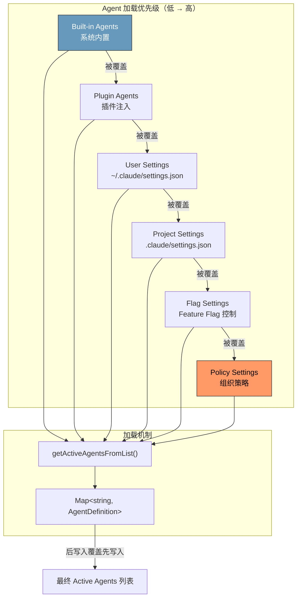
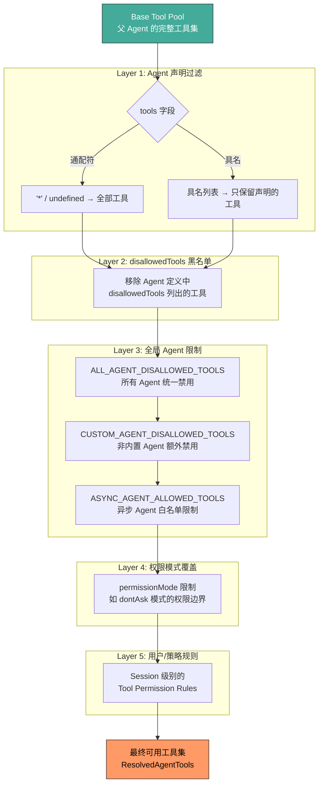

# 第十二章：Agent 定义与加载

> 在 Claude Code 的多 Agent 架构中，每一个 Sub-agent 在被调度之前，都必须先经过一套严格的定义、加载、验证和工具过滤流程。这一过程决定了一个 Agent 能做什么、不能做什么、使用什么模型、如何构建 System Prompt。本章将完整剖析 AgentDefinition 的 schema 设计、三种 Agent 来源的加载优先级、六个内置 Agent 的逐一分析，以及工具过滤 pipeline 的五层架构。

---

## 12.1 AgentDefinition Schema 完整分析

### 12.1.1 基础类型：BaseAgentDefinition

所有 Agent 共享一个 Base 类型，定义了 20+ 个配置字段。这是整个 Agent 系统的核心数据结构：

```typescript
export type BaseAgentDefinition = {
  // === 身份与描述 ===
  agentType: string                    // 唯一标识符，如 'Explore', 'Plan'
  whenToUse: string                    // 描述何时应该使用此 Agent

  // === 工具控制 ===
  tools?: string[]                     // 可用工具列表，'*' 表示全部
  disallowedTools?: string[]           // 禁用工具黑名单
  skills?: string[]                    // 可加载的 Skill 列表

  // === MCP 集成 ===
  mcpServers?: AgentMcpServerSpec[]    // MCP Server 连接配置
  requiredMcpServers?: string[]        // 必须可用的 MCP Server

  // === 生命周期钩子 ===
  hooks?: HooksSettings                // SubagentStart 等 Hook 配置

  // === 外观与模型 ===
  color?: AgentColorName               // 终端显示颜色
  model?: string                       // 指定模型（'inherit', 'haiku', 'sonnet' 等）
  effort?: EffortValue                 // 推理努力级别

  // === 权限与安全 ===
  permissionMode?: PermissionMode      // 权限模式覆盖

  // === 执行控制 ===
  maxTurns?: number                    // 最大对话轮数
  background?: boolean                 // 是否后台执行
  initialPrompt?: string               // 初始提示

  // === 文件与路径 ===
  filename?: string                    // 定义文件路径
  baseDir?: string                     // 基础目录

  // === 上下文优化 ===
  omitClaudeMd?: boolean               // 是否省略 CLAUDE.md 注入
  criticalSystemReminder_EXPERIMENTAL?: string  // 每轮注入的关键提醒

  // === 记忆与隔离 ===
  memory?: AgentMemoryScope            // 'user' | 'project' | 'local'
  isolation?: 'worktree' | 'remote'    // 执行隔离方式

  // === 内部状态 ===
  pendingSnapshotUpdate?: { snapshotTimestamp: string }
}
```

每一个字段都经过精心设计。让我们关注几个关键字段的设计考量：

**`omitClaudeMd`** -- 这个看似简单的 boolean 背后是一个重大的成本优化决策。CLAUDE.md 文件通常包含大量项目配置（几百到几千 token），对于只做搜索的 Explore Agent 来说完全是浪费。考虑到 Explore Agent 每周被调用 3400 万次以上，即便每次省下几百 token，周积累也达到 5-15 Gtok 的节省量。

**`criticalSystemReminder_EXPERIMENTAL`** -- 这个字段会在 Agent 的每一个对话轮次中注入。Verification Agent 用它来对抗 LLM 的"顺从倾向"——模型容易被诱导跳过真正的验证步骤。

**`memory`** -- 三种作用域（user/project/local）决定了 Agent 记忆的持久化范围。当 `isAutoMemoryEnabled()` 为 true 时，`getSystemPrompt()` 会自动追加对应的记忆提示。

### 12.1.2 三种 Discriminated 子类型

BaseAgentDefinition 通过 `source` 字段派生出三种子类型，形成一个 Discriminated Union：

```typescript
// 内置 Agent：动态 System Prompt，接收 ToolUseContext
export type BuiltInAgentDefinition = BaseAgentDefinition & {
  source: 'built-in'
  baseDir: 'built-in'
  callback?: () => void
  getSystemPrompt: (params: {
    toolUseContext: Pick<ToolUseContext, 'options'>
  }) => string
}

// 自定义 Agent：来自用户/项目/策略设置
export type CustomAgentDefinition = BaseAgentDefinition & {
  getSystemPrompt: () => string
  source: SettingSource    // 'userSettings' | 'projectSettings' | 'flagSettings' | 'policySettings'
  filename?: string
  baseDir?: string
}

// 插件 Agent：来自已安装的插件
export type PluginAgentDefinition = BaseAgentDefinition & {
  getSystemPrompt: () => string
  source: 'plugin'
  filename?: string
  plugin: string           // 插件标识符
}

// 联合类型
export type AgentDefinition =
  | BuiltInAgentDefinition
  | CustomAgentDefinition
  | PluginAgentDefinition
```

三种子类型之间的关键差异在于 `getSystemPrompt` 的签名：

- **Built-in** 接收 `toolUseContext`，可以根据运行时状态动态构建 Prompt。Claude Code Guide Agent 就利用这一点将当前可用的 MCP Server、Custom Skill 等信息注入到 Prompt 中。
- **Custom** 和 **Plugin** 使用无参数的 `getSystemPrompt()`，Prompt 在加载时就已确定（可能附带 Memory 注入的闭包）。

配套的 Type Guard 函数提供了类型安全的分支判断：

```typescript
export function isBuiltInAgent(agent): agent is BuiltInAgentDefinition {
  return agent.source === 'built-in'
}
export function isCustomAgent(agent): agent is CustomAgentDefinition {
  return agent.source !== 'built-in' && agent.source !== 'plugin'
}
export function isPluginAgent(agent): agent is PluginAgentDefinition {
  return agent.source === 'plugin'
}
```

---

## 12.2 Agent 加载的三种来源

### 12.2.1 加载优先级链

Agent 从多个来源加载，当名称冲突时，优先级高的定义覆盖优先级低的：

```
built-in < plugin < userSettings < projectSettings < flagSettings < policySettings
```

这个优先级链体现了一个清晰的设计原则：**越接近管理端的配置，权限越高**。组织的 Policy 可以覆盖一切，项目配置覆盖用户偏好，而用户偏好覆盖系统内置。



核心的加载函数 `getActiveAgentsFromList()` 使用 Map 的覆盖语义实现优先级：

```typescript
export function getActiveAgentsFromList(
  allAgents: AgentDefinition[]
): AgentDefinition[] {
  const agentGroups = [
    builtInAgents,
    pluginAgents,
    userAgents,
    projectAgents,
    flagAgents,
    managedAgents,   // policySettings
  ]
  const agentMap = new Map<string, AgentDefinition>()
  for (const agents of agentGroups) {
    for (const agent of agents) {
      agentMap.set(agent.agentType, agent)  // 后者覆盖前者
    }
  }
  return Array.from(agentMap.values())
}
```

### 12.2.2 Custom Agent 的两种定义格式

自定义 Agent 支持 JSON 和 Markdown 两种格式。

**JSON Schema 格式**（通过 Zod 校验）：

```typescript
const AgentJsonSchema = z.object({
  description: z.string().min(1),
  tools: z.array(z.string()).optional(),
  disallowedTools: z.array(z.string()).optional(),
  prompt: z.string().min(1),
  model: z.string().trim().min(1).transform(...).optional(),
  effort: z.union([z.enum(EFFORT_LEVELS), z.number().int()]).optional(),
  permissionMode: z.enum(PERMISSION_MODES).optional(),
  mcpServers: z.array(AgentMcpServerSpecSchema()).optional(),
  hooks: HooksSchema().optional(),
  maxTurns: z.number().int().positive().optional(),
  skills: z.array(z.string()).optional(),
  initialPrompt: z.string().optional(),
  memory: z.enum(['user', 'project', 'local']).optional(),
  background: z.boolean().optional(),
  isolation: z.enum(['worktree', 'remote']).optional(),
})
```

**Markdown 格式**（YAML Frontmatter + 正文）：

`parseAgentFromMarkdown()` 函数从 Markdown 文件中提取 Agent 定义：
- Frontmatter 的 `name` 映射为 `agentType`
- Frontmatter 的 `description` 映射为 `whenToUse`
- `tools`, `disallowedTools`, `skills` 通过 `parseAgentToolsFromFrontmatter()` 解析
- Markdown 正文作为 System Prompt，通过闭包包装为 `getSystemPrompt()` 方法

当 Agent Memory 启用时，闭包会在运行时动态追加记忆上下文：

```typescript
getSystemPrompt: () => {
  if (isAutoMemoryEnabled() && memory) {
    return systemPrompt + '\n\n' + loadAgentMemoryPrompt(agentType, memory)
  }
  return systemPrompt
}
```

### 12.2.3 加载结果结构

```typescript
export type AgentDefinitionsResult = {
  activeAgents: AgentDefinition[]    // 经过优先级合并后的活跃 Agent
  allAgents: AgentDefinition[]       // 所有来源的原始 Agent
  failedFiles?: Array<{              // 加载失败的文件记录
    path: string
    error: string
  }>
  allowedAgentTypes?: string[]       // 策略允许的 Agent 类型白名单
}
```

`failedFiles` 的存在体现了容错设计——单个 Agent 文件解析失败不会阻止其他 Agent 的加载。

---

## 12.3 六个内置 Agent 深度分析

### 12.3.1 加载逻辑与 Feature Gate

`getBuiltInAgents()` 函数负责组装内置 Agent 列表：

- **始终包含**：General Purpose Agent, Statusline Setup Agent
- **Feature Gate 控制**：Explore Agent 和 Plan Agent 受 `tengu_amber_stoat` 门控
- **Feature Gate 控制**：Verification Agent 受 `tengu_hive_evidence` 门控
- **条件包含**：Claude Code Guide Agent 仅在非 SDK 入口时包含
- **模式切换**：Coordinator 模式下，全部替换为 `getCoordinatorAgents()`

### 12.3.2 General Purpose Agent -- 全能执行者

```
agentType:  'general-purpose'
tools:      ['*']              // 通配符 — 拥有所有工具
model:      (默认 subagent model)
background: (未指定)
```

General Purpose Agent 是默认的通用执行 Agent。它的核心特征是 `tools: ['*']`——通配符意味着它可以访问父 Agent 的全部工具池（经过标准过滤后）。这使它能够搜索、分析、编辑文件、执行命令等，完成任意多步骤任务。

它的 System Prompt 使用了一套共享的前缀（`SHARED_PREFIX`）和通用指导准则（`SHARED_GUIDELINES`），这些模块在多个内置 Agent 之间复用，确保行为一致性。

### 12.3.3 Explore Agent -- 只读搜索专家

```
agentType:      'Explore'
model:          'inherit' (内部) / 'haiku' (外部)
disallowedTools: ['Agent', 'ExitPlanMode', 'FileEdit', 'FileWrite', 'NotebookEdit']
omitClaudeMd:   true
```

Explore Agent 是调用量最大的内置 Agent（每周 3400 万次以上），专为代码搜索和导航设计。它的设计处处体现成本优化：

1. **只读约束**：通过 `disallowedTools` 禁止所有写操作和递归 Agent 调用
2. **轻量模型**：外部用户使用 Haiku（成本远低于 Sonnet/Opus）
3. **省略 CLAUDE.md**：`omitClaudeMd: true` 避免将项目配置注入上下文。按每次节省约 500 token 估算，每周节省 5-15 Gtok
4. **自适应工具集**：检测是否有内嵌搜索工具（bfs/ugrep），动态调整 Prompt 中的搜索指导

### 12.3.4 Plan Agent -- 架构规划师

```
agentType:      'Plan'
model:          'inherit'
disallowedTools: (与 Explore 相同)
omitClaudeMd:   true
```

Plan Agent 与 Explore Agent 共享工具配置和只读约束，但有不同的职责。它的 System Prompt 引导模型输出结构化的实施计划，特别要求包含 "Critical Files for Implementation" 章节。

Plan Agent 和 Explore Agent 的关系是"同源异构"——相同的工具能力，不同的 Prompt 指导。这种设计减少了维护成本，同时允许独立演进各自的 Prompt 策略。

### 12.3.5 Verification Agent -- 对抗性测试者

```
agentType:      'verification'
color:          'red'
background:     true             // 始终后台运行
model:          'inherit'
disallowedTools: ['Agent', 'ExitPlanMode', 'FileEdit', 'FileWrite', 'NotebookEdit']
criticalSystemReminder_EXPERIMENTAL: (每轮注入)
```

Verification Agent 是六个内置 Agent 中设计最复杂的一个。它体现了对 LLM 行为弱点的深刻理解：

1. **强制后台执行**：`background: true` 确保它不会阻塞主对话流。验证是耗时操作，没有理由让用户等待。

2. **Red 配色**：终端中以红色标识，视觉上提醒用户这是一个"挑战者"角色。

3. **对抗性 Prompt 设计**：约 130 行的 Prompt 专门设计用来对抗 LLM 的常见弱点——跳过验证直接认可、给出模糊结论、不实际执行测试命令。

4. **Critical System Reminder**：通过 `criticalSystemReminder_EXPERIMENTAL` 在每一轮对话中注入强制提醒，防止模型在长对话中"遗忘"自己的验证职责。

5. **有限写权限**：虽然禁止修改项目文件，但可以写入 `/tmp` 目录来创建临时测试脚本。

6. **结构化裁决**：必须以 `VERDICT: PASS`、`VERDICT: FAIL` 或 `VERDICT: PARTIAL` 结尾，强制模型给出明确结论。

### 12.3.6 Claude Code Guide Agent -- 文档查询助手

```
agentType:       'claude-code-guide'
model:           'haiku'
permissionMode:  'dontAsk'
tools:           ['Glob', 'Grep', 'Read', 'WebFetch', 'WebSearch']
```

Claude Code Guide Agent 是架构中最"动态"的内置 Agent。它的 `getSystemPrompt()` 接收 `toolUseContext`，在运行时注入：

- 当前可用的 Custom Skill 列表
- 已注册的 Custom Agent 列表
- 活跃的 MCP Server 列表
- Plugin Commands
- 用户个人设置

此外，它还会从 `code.claude.com` 和 `platform.claude.com` 获取外部文档映射，使得模型可以引导用户查找正确的文档。`permissionMode: 'dontAsk'` 确保查询文档时不会弹出权限确认，提供流畅的帮助体验。

### 12.3.7 Statusline Setup Agent -- 最小化工具集

```
agentType:  'statusline-setup'
tools:      ['Read', 'Edit']
model:      'sonnet'
color:      'orange'
```

Statusline Setup Agent 是最小的内置 Agent，仅有两个工具。它的职责极其单一：将用户 Shell 的 PS1 配置转换为 Claude Code 的 `statusLine` 命令，并写入 `~/.claude/settings.json`。

选择 Sonnet 模型（而非 Haiku）说明这个任务虽然工具集小，但需要对 Shell 配置语法有较好的理解能力。

---

## 12.4 omitClaudeMd 优化：Token 经济学

`omitClaudeMd` 字段值得单独分析，因为它是 Claude Code 在规模化运营中成本控制的一个缩影。

### 12.4.1 问题背景

每一次 Agent 调用都会注入 User Context，其中包含 CLAUDE.md 的内容。对于 Explore 和 Plan 这类只读 Agent，CLAUDE.md 中的项目规范（代码风格、提交规则等）完全无用——它们不会写代码或执行命令。

### 12.4.2 规模量化

以 Explore Agent 为例：

| 指标 | 数值 |
|------|------|
| 每周调用量 | 3400 万+ |
| 典型 CLAUDE.md 大小 | 500-2000 tokens |
| 保守估计每次节省 | 500 tokens |
| 每周节省 | 17 Gtok（170 亿 token） |
| 月节省 | ~68 Gtok |

在 `runAgent()` 的初始化阶段，当检测到 `omitClaudeMd: true` 时，CLAUDE.md 内容会从 User Context 中被剥离：

```
Agent 启动 → 检查 omitClaudeMd → 为 true → 从 userContext 中移除 CLAUDE.md 内容
```

配合 `omitClaudeMd`，Explore 和 Plan Agent 的 system context 中的 git status 信息也会被剥离（kill switch: `tengu_slim_subagent_claudemd`），进一步减少无用上下文。

---

## 12.5 工具过滤 Pipeline

Agent 的工具可用性不是简单的"列表匹配"，而是经过一个五层过滤 pipeline，逐步缩减工具池。

### 12.5.1 Pipeline 全景



### 12.5.2 Layer 1: Agent 声明过滤

第一层由 `resolveAgentTools()` 执行。Agent 定义中的 `tools` 字段决定初始工具池：

- **通配符（`'*'` 或 `undefined`）**：继承父 Agent 的全部可用工具。General Purpose Agent 使用此模式。
- **具名列表**：仅保留声明的工具名称。Statusline Setup Agent 的 `['Read', 'Edit']` 就是此模式。

工具名称通过 `availableToolMap` 进行匹配，未匹配的名称被记录为 `invalidTools`。

### 12.5.3 Layer 2: disallowedTools 黑名单

在通配符展开之前，`disallowedTools` 中声明的工具先被移除。这是 Explore、Plan、Verification 等只读 Agent 的核心安全机制。

典型的黑名单配置：
```typescript
disallowedTools: ['Agent', 'ExitPlanMode', 'FileEdit', 'FileWrite', 'NotebookEdit']
```

这五个工具的禁用覆盖了：递归 Agent 创建、计划模式退出、文件编辑、文件写入、Notebook 编辑。

### 12.5.4 Layer 3: 全局 Agent 限制

`filterToolsForAgent()` 函数施加三类全局限制：

1. **`ALL_AGENT_DISALLOWED_TOOLS`**：所有 Agent 统一禁用的工具。这些通常是只有顶层主循环才能使用的工具。
2. **`CUSTOM_AGENT_DISALLOWED_TOOLS`**：非内置 Agent 额外禁用的工具，防止自定义 Agent 获得过高权限。
3. **`ASYNC_AGENT_ALLOWED_TOOLS`**：异步（后台）Agent 的白名单限制。后台 Agent 只能使用此列表中的工具，例外情况是 In-Process Teammate 可以额外获得 `Agent` 工具和任务工具。

特殊规则：
- MCP 工具（`mcp__` 前缀）始终被允许，不受上述限制
- `ExitPlanMode` 仅在 Agent 处于 Plan Mode 时被允许

### 12.5.5 Layer 4-5: 权限模式与用户规则

第四层和第五层处理运行时权限：

- **Permission Mode**：Agent 可以通过 `permissionMode` 字段指定自己的权限级别。`runAgent()` 中的 `agentGetAppState` 封装器负责在运行时覆盖权限设置——除非父 Agent 已经处于 `bypassPermissions`、`acceptEdits` 或 `auto` 模式。
- **Session Tool Permission Rules**：来自 SDK `cliArg` 的规则被保留，而 Session 级别的规则在子 Agent 中被替换为 Agent 专属的规则。

### 12.5.6 解析结果结构

完整的工具解析结果包含诊断信息：

```typescript
export type ResolvedAgentTools = {
  hasWildcard: boolean          // 是否使用了通配符
  validTools: string[]          // 成功匹配的工具名
  invalidTools: string[]        // 未匹配的工具名（警告）
  resolvedTools: Tools          // 最终可用的工具实例
  allowedAgentTypes?: string[]  // 可调用的子 Agent 类型白名单
}
```

---

## 12.6 System Prompt 的动态渲染

Agent 的 System Prompt 不是静态文本，而是在 `runAgent()` 初始化阶段动态构建的。

### 12.6.1 Built-in Agent 的动态 Prompt

Built-in Agent 的 `getSystemPrompt()` 接收 `toolUseContext`，这使得 Prompt 可以根据以下因素动态变化：

- **可用工具集**：Explore Agent 检测是否存在内嵌搜索工具（bfs/ugrep），据此调整搜索指导
- **运行时配置**：Claude Code Guide Agent 注入当前的 MCP Server、Skill、Plugin 信息
- **共享模块**：多个 Agent 复用 `SHARED_PREFIX` 和 `SHARED_GUIDELINES`，保证行为一致

### 12.6.2 Custom Agent 的 Prompt 闭包

Custom Agent 的 System Prompt 在加载时通过闭包捕获：

```typescript
// Markdown 格式的 Agent
getSystemPrompt: () => {
  if (isAutoMemoryEnabled() && memory) {
    return systemPrompt + '\n\n' + loadAgentMemoryPrompt(agentType, memory)
  }
  return systemPrompt
}
```

闭包确保每次调用 `getSystemPrompt()` 时都能获取最新的 Memory 状态，而不是加载时的快照。

### 12.6.3 上下文剥离规则

`runAgent()` 在组装上下文时执行条件性剥离：

| 条件 | 操作 |
|------|------|
| `omitClaudeMd: true` | 从 userContext 中移除 CLAUDE.md |
| Explore / Plan Agent | 从 systemContext 中移除 git status |
| `tengu_slim_subagent_claudemd` kill switch | 全局控制 CLAUDE.md 剥离行为 |

---

## 12.7 MCP Server 依赖与初始化

### 12.7.1 Required MCP Servers

Agent 可以声明 `requiredMcpServers` 来指定它依赖的 MCP Server。匹配使用大小写不敏感的子串匹配：

```typescript
export function hasRequiredMcpServers(
  agent: AgentDefinition,
  availableServers: string[],
): boolean {
  return agent.requiredMcpServers.every(pattern =>
    availableServers.some(server =>
      server.toLowerCase().includes(pattern.toLowerCase()),
    ),
  )
}
```

如果所需的 MCP Server 不可用，Agent 不会出现在可用列表中。

### 12.7.2 Agent MCP Server 初始化

`initializeAgentMcpServers()` 支持两种 MCP Server 规格：

- **字符串引用**：按名称查找已有的 MCP 连接（共享连接，Agent 退出时不清理）
- **内联定义**：`{ [name]: config }` 形式创建新连接（Agent 退出时清理）

安全策略检查：只有来自可信来源（plugin、built-in、policySettings）的 Agent 才能绕过内联 MCP Server 的策略限制。

---

## 12.8 本章小结

本章剖析了 Claude Code Agent 系统的"出生证明"——从 BaseAgentDefinition 的 20+ 个配置字段，到三种来源的优先级加载，再到六个内置 Agent 各自的设计哲学。

几个关键洞察：

1. **Discriminated Union + Type Guard** 是处理多态 Agent 定义的基础模式。`source` 字段决定了加载行为、Prompt 构建方式和运行时能力。

2. **优先级覆盖链**（built-in → policy）遵循"管理端权限最高"原则，同时保留了用户自定义 Agent 的灵活性。

3. **工具过滤 Pipeline 的五层架构**确保了最小权限原则：每一层都在收窄工具池，没有任何一层会扩大可用范围。

4. **omitClaudeMd 的 Token 经济学**展示了在规模化 AI 系统中，一个简单的 boolean 字段可以每周节省数十亿 token。

5. **Verification Agent 的对抗性设计**是对 LLM 行为弱点的工程化应对——不是靠单条指令解决，而是通过多层机制（专属 Prompt、每轮提醒、结构化裁决、后台隔离）综合施策。

下一章将深入 `runAgent()` 的执行引擎，分析 Agent 从初始化到完成的完整生命周期。
