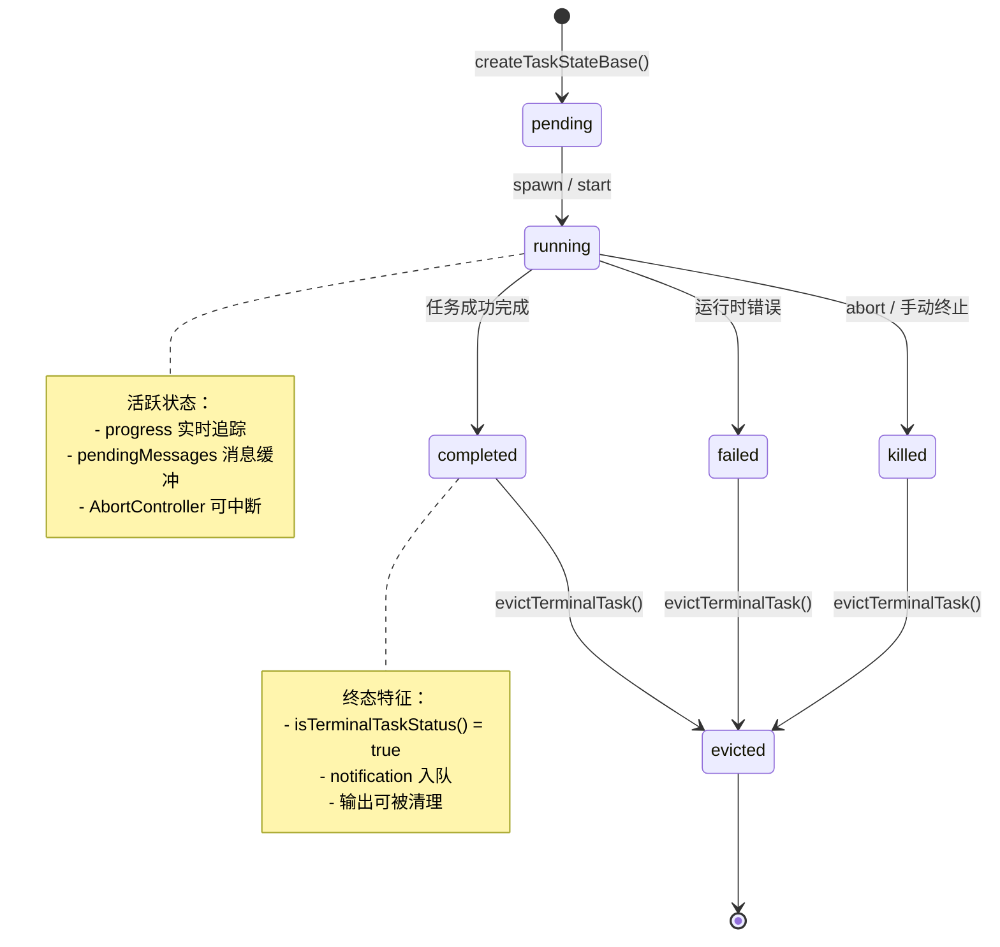
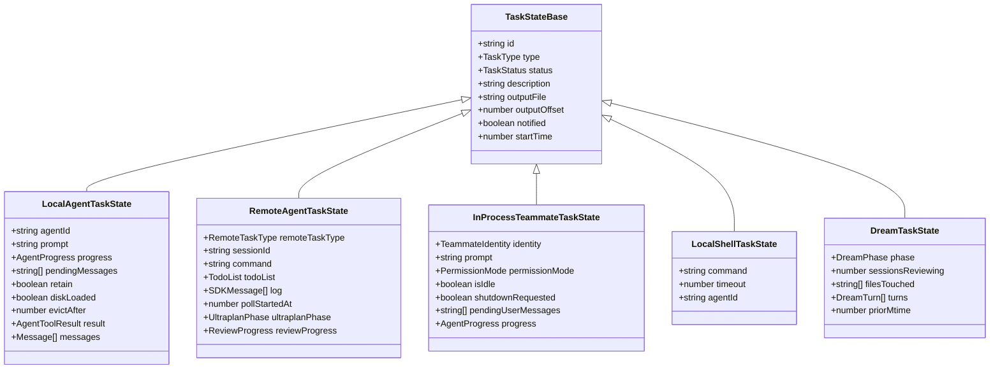

# 第十三章：任务管理系统

Claude Code 的任务管理系统是支撑其多 Agent 并发能力的基础设施。当用户触发一个后台 Agent、启动一个 shell 命令、或发起一次云端远程会话时，系统需要统一地追踪每个任务的生命周期、缓冲输出流、协调资源释放。本章将从类型系统出发，逐层解剖这套任务管理架构——从 7 种 TaskType 枚举到状态机迁移，从磁盘输出流的 offset 追踪到每种任务实现的独特扩展字段。

## 13.1 TaskType 枚举与 TaskStatus 状态机

### 七种任务类型

系统通过一个联合类型枚举定义了所有可能的任务种类：

```typescript
export type TaskType =
  | 'local_bash'
  | 'local_agent'
  | 'remote_agent'
  | 'in_process_teammate'
  | 'local_workflow'
  | 'monitor_mcp'
  | 'dream'
```

每种类型对应一个独立的运行时语义：

| TaskType | 职责 | 典型场景 |
|----------|------|----------|
| `local_bash` | 后台 shell 命令执行 | 长时间运行的编译、测试命令 |
| `local_agent` | 本地后台 Agent 执行 | 异步子 Agent 调查代码库 |
| `remote_agent` | 云端远程会话 | CCR（Cloud Code Runner）任务 |
| `in_process_teammate` | 进程内协作 Agent | Swarm 模式下的队友 Agent |
| `local_workflow` | 本地工作流脚本 | 自动化工作流执行（feature-gated） |
| `monitor_mcp` | MCP 监控任务 | MCP 服务器监控（feature-gated） |
| `dream` | 后台记忆整合 | 会话间知识沉淀 |

### 五态状态机

所有任务共享统一的五态生命周期：

```typescript
export type TaskStatus =
  | 'pending'
  | 'running'
  | 'completed'
  | 'failed'
  | 'killed'
```

系统提供了一个终态守卫函数，用于判断任务是否已结束：

```typescript
export function isTerminalTaskStatus(status: TaskStatus): boolean {
  return status === 'completed' || status === 'failed' || status === 'killed'
}
```

三个终态（`completed`、`failed`、`killed`）一旦到达便不可逆转。这个简洁的判断函数在任务系统的各个角落被调用——从资源清理到通知分发，再到 UI 状态渲染。

### 状态迁移图



这个状态机的设计哲学值得注意：它刻意保持了极简的五态结构，而将每种任务类型的特殊状态（如 DreamTask 的 phase、RemoteAgentTask 的 ultraplanPhase）下放到各自的扩展类型中。这种分层策略使得核心状态机逻辑可以统一处理所有任务类型的生命周期管理。

## 13.2 TaskStateBase：所有任务的共同基因

每种任务状态都继承自同一个基类型：

```typescript
export type TaskStateBase = {
  id: string            // 前缀 + base-36 随机 ID
  type: TaskType        // 任务种类鉴别器
  status: TaskStatus    // 当前状态
  description: string   // 人类可读描述
  toolUseId?: string    // 关联的工具调用 ID
  startTime: number     // 创建时间戳
  endTime?: number      // 终止时间戳
  totalPausedMs?: number // 累计暂停时间
  outputFile: string    // 磁盘输出文件路径
  outputOffset: number  // 上次读取的偏移量
  notified: boolean     // 是否已通知父级
}
```

这12个字段构成了任务管理的"最小公共接口"。其中几个字段的设计值得深入分析：

**`outputFile` + `outputOffset` 模式**：这是一个优雅的磁盘流追踪方案。每个任务将输出写入一个独立的文件，`outputOffset` 记录了父级上次读取到的位置。当父级需要查看任务进度时，只需从 `outputOffset` 开始读取增量内容，而不必重新扫描整个输出。这种设计让长时间运行的后台任务（如编译输出、Agent 工作日志）能够以流式增量的方式向父级报告，而不会产生内存压力。

**`notified` 标记**：确保每个终态任务恰好通知一次。任务完成后设置 `notified = true`，防止重复发送完成通知。

**`toolUseId` 关联**：将任务与触发它的工具调用关联，使得通知消息可以正确路由回调用方。

## 13.3 任务生命周期：从注册到回收

一个任务的完整生命周期可以概括为六个阶段：

```
register → running → complete/fail/kill → notify → evict
```

**Register（注册）**：任务被创建并注册到 AppState 的任务列表中。此时状态为 `pending`，但大多数任务实现会在注册的同时立即转入 `running`。

**Running（运行）**：任务的核心执行阶段。各任务类型在此阶段表现各异——LocalAgentTask 驱动 `runAgent()` 的异步生成器循环，RemoteAgentTask 轮询远程 WebSocket 会话，InProcessTeammateTask 在 idle 和 executing 之间交替。

**Complete/Fail/Kill（终止）**：三条终止路径：
- `completed`：任务正常结束，产出可用结果
- `failed`：运行时错误，携带错误信息
- `killed`：外部中断，通过 `AbortController.abort()` 触发

**Notify（通知）**：终态到达后，系统通过 `enqueuePendingNotification()` 向父级推送一条 XML 格式的通知消息。

**Evict（回收）**：任务的输出资源被清理。对于 LocalAgentTask，这涉及 `retain` / `evictAfter` 机制——如果 UI 面板正在展示该任务，`retain = true` 会阻止立即回收，直到面板关闭后才启动 `evictAfter` 倒计时。

## 13.4 Task ID 生成：前缀化的 base-36 标识符

每个任务的 ID 由一个单字符前缀加上 8 位 base-36 随机字符组成：

```typescript
const TASK_ID_PREFIXES: Record<string, string> = {
  local_bash: 'b',
  local_agent: 'a',
  remote_agent: 'r',
  in_process_teammate: 't',
  local_workflow: 'w',
  monitor_mcp: 'm',
  dream: 'd',
}

const TASK_ID_ALPHABET = '0123456789abcdefghijklmnopqrstuvwxyz'

export function generateTaskId(type: TaskType): string {
  const prefix = getTaskIdPrefix(type)
  const bytes = randomBytes(8)
  let id = prefix
  for (let i = 0; i < 8; i++) {
    id += TASK_ID_ALPHABET[bytes[i]! % TASK_ID_ALPHABET.length]
  }
  return id
}
```

8 位 base-36 字符提供 36^8（约 2.8 万亿）种组合，在单个会话的生命周期内冲突概率可忽略不计。前缀的设计让调试时一眼就能看出任务类型——`a3k7xm2p` 是一个 local_agent 任务，`b9f2q1n8` 是一个 shell 任务。使用 `crypto.randomBytes()` 而非 `Math.random()` 确保了密码学级别的随机性。

## 13.5 任务类型层级



每种任务类型通过 TypeScript 的交叉类型（`TaskStateBase &`）扩展基类型，增添自己独特的状态字段。下面逐一分析。

## 13.6 LocalAgentTask：本地后台 Agent

LocalAgentTask 是最复杂的任务实现，管理着后台 Agent 的完整生命周期。

### 状态扩展

```typescript
export type LocalAgentTaskState = TaskStateBase & {
  type: 'local_agent'
  agentId: string
  prompt: string
  selectedAgent?: AgentDefinition
  agentType: string
  model?: string
  abortController?: AbortController
  unregisterCleanup?: () => void
  error?: string
  result?: AgentToolResult
  progress?: AgentProgress
  retrieved: boolean
  messages?: Message[]
  lastReportedToolCount: number
  lastReportedTokenCount: number
  isBackgrounded: boolean
  pendingMessages: string[]
  retain: boolean
  diskLoaded: boolean
  evictAfter?: number
}
```

### 进度追踪

AgentProgress 结构提供了实时的执行度量：

```typescript
export type AgentProgress = {
  toolUseCount: number      // 工具调用次数
  tokenCount: number        // 累计 token 消耗
  lastActivity?: ToolActivity  // 最近一次工具活动
  recentActivities?: ToolActivity[]  // 最近 5 次活动
  summary?: string          // 当前工作摘要
}
```

`ProgressTracker` 在每次消息流迭代中更新，维护一个最多 5 条记录的滑动窗口（`recentActivities`），使 UI 能够展示 Agent 当前正在做什么——"正在搜索 `*.ts` 文件"、"正在读取 `src/config.ts`"。

### 消息缓冲：pendingMessages

`pendingMessages` 是一个字符串队列，实现了"发送消息给运行中 Agent"的能力：

```typescript
export function queuePendingMessage(taskId, msg, setAppState): void
export function drainPendingMessages(taskId, getAppState, setAppState): string[]
```

当用户通过 `SendMessage` 工具向后台 Agent 发送消息时，消息被追加到 `pendingMessages` 数组。Agent 在每个 tool-round 边界处调用 `drainPendingMessages()` 取走所有积压消息，注入为用户消息继续对话。这种设计避免了在 Agent 执行中途强行打断，保证了对话流的完整性。

### retain/evict 生命周期

当一个后台 Agent 完成时，其状态不会立即从内存中移除。`retain` 标记指示 UI 面板是否正在展示该任务：

- `retain = true`：UI 正在查看，阻止回收
- `retain = false` 且设置了 `evictAfter`：到达时间戳后清理
- `diskLoaded`：标记侧链 JSONL 是否已加载到内存

这种延迟回收机制确保用户在切换面板时不会丢失刚完成的 Agent 结果。

## 13.7 RemoteAgentTask：云端远程会话

RemoteAgentTask 管理云端 CCR（Cloud Code Runner）会话，支持多种远程任务子类型。

### 状态扩展

```typescript
export type RemoteAgentTaskState = TaskStateBase & {
  type: 'remote_agent'
  remoteTaskType: RemoteTaskType
  remoteTaskMetadata?: RemoteTaskMetadata
  sessionId: string
  command: string
  title: string
  todoList: TodoList
  log: SDKMessage[]
  isLongRunning?: boolean
  pollStartedAt: number
  isRemoteReview?: boolean
  reviewProgress?: {
    stage?: 'finding' | 'verifying' | 'synthesizing'
    bugsFound: number
    bugsVerified: number
    bugsRefuted: number
  }
  isUltraplan?: boolean
  ultraplanPhase?: Exclude<UltraplanPhase, 'running'>
}
```

### 远程任务子类型

`RemoteTaskType` 进一步细分为五种远程操作模式：

```typescript
type RemoteTaskType =
  | 'remote-agent'    // 通用远程 Agent
  | 'ultraplan'       // 超级规划（多阶段）
  | 'ultrareview'     // 超级代码审查
  | 'autofix-pr'      // PR 自动修复
  | 'background-pr'   // 后台 PR 处理
```

### WebSocket 轮询与完成检查

远程任务的核心挑战在于，执行发生在云端，本地只能通过轮询获取状态更新。`pollStartedAt` 记录轮询开始时间，用于超时检测。

系统使用可插拔的完成检查器：

```typescript
export function registerCompletionChecker(
  remoteTaskType: RemoteTaskType,
  checker: RemoteTaskCompletionChecker,
): void
```

每次轮询 tick 时，系统调用对应的 `RemoteTaskCompletionChecker` 判断远程任务是否已结束。这种插件化设计允许不同远程任务类型定义各自的完成条件。

### Ultraplan 阶段追踪

对于 `ultraplan` 类型的任务，`ultraplanPhase` 追踪规划的多阶段进程。这是一个排除了 `'running'` 的枚举——因为 `'running'` 由通用的 `TaskStatus` 覆盖，`ultraplanPhase` 只需记录规划特有的子阶段（如 gathering、synthesizing）。

### 前置检查与元数据持久化

启动远程任务前，系统执行一系列前置检查：

```typescript
export async function checkRemoteAgentEligibility():
  Promise<RemoteAgentPreconditionResult>
```

检查项包括：用户登录状态、云环境可用性、Git 仓库状态、GitHub remote 配置、GitHub App 安装状态、策略许可。

远程任务的元数据会持久化到会话侧文件，以支持会话恢复：

```typescript
async function persistRemoteAgentMetadata(meta): Promise<void>
async function removeRemoteAgentMetadata(taskId): Promise<void>
```

## 13.8 InProcessTeammateTask：进程内协作

InProcessTeammateTask 是 Swarm 模式下最精巧的任务类型，它在单一 Node.js 进程内运行多个协作 Agent，通过 AsyncLocalStorage 实现上下文隔离。

### 身份系统

每个进程内队友拥有结构化的身份标识：

```typescript
export type TeammateIdentity = {
  agentId: string         // "researcher@my-team"
  agentName: string       // "researcher"
  teamName: string
  color?: string
  planModeRequired: boolean
  parentSessionId: string
}
```

`agentId` 采用 `name@team` 的邮箱式格式，天然支持多团队场景。

### 状态扩展

```typescript
export type InProcessTeammateTaskState = TaskStateBase & {
  type: 'in_process_teammate'
  identity: TeammateIdentity
  prompt: string
  model?: string
  selectedAgent?: AgentDefinition
  abortController?: AbortController
  currentWorkAbortController?: AbortController
  unregisterCleanup?: () => void
  awaitingPlanApproval: boolean
  permissionMode: PermissionMode
  error?: string
  result?: AgentToolResult
  progress?: AgentProgress
  messages?: Message[]
  inProgressToolUseIDs?: Set<string>
  pendingUserMessages: string[]
  spinnerVerb?: string
  pastTenseVerb?: string
  isIdle: boolean
  shutdownRequested: boolean
  onIdleCallbacks?: Array<() => void>
  lastReportedToolCount: number
  lastReportedTokenCount: number
}
```

几个关键字段值得特别关注：

**双层 AbortController**：`abortController` 控制整个队友生命周期，`currentWorkAbortController` 只中断当前 turn。这种设计允许"取消当前工作但不杀死队友"的细粒度控制。

**`isIdle` 与 `shutdownRequested`**：这两个布尔值驱动了队友的核心协作循环。`isIdle = true` 表示队友已完成当前任务、正在等待新指令；`shutdownRequested = true` 表示 leader 希望队友退出，但退出决策由模型自行判断（软关闭）。

**`pendingUserMessages`**：类似 LocalAgentTask 的 `pendingMessages`，但来源更广——包括 UI 面板的直接输入、邮箱消息、以及 leader 的中继消息。

### AsyncLocalStorage 隔离

多个队友 Agent 运行在同一个 Node.js 进程中，共享事件循环。AsyncLocalStorage 提供了每个异步执行链的私有上下文空间，使得不同队友的 `toolUseContext`、`getAppState` 等回调不会相互干扰。每个队友在 spawn 时创建独立的 `TeammateContext`，通过 AsyncLocalStorage 绑定到其异步执行链上。

### Idle 状态与邮箱轮询

队友在 turn 间进入 idle 状态，以 500ms 间隔轮询消息来源。轮询优先级严格排序：

1. 内存中的 `pendingUserMessages`（来自 UI 面板交互）
2. 邮箱中的 shutdown 请求（最高优先级，防止饥饿）
3. Leader 消息（代表用户意图）
4. 第一条未读 peer 消息（FIFO 顺序）
5. 共享任务列表中的未认领任务

这种优先级设计确保了 leader 的指令总能优先于 peer-to-peer 消息得到处理。

### 内存管理：消息封顶

在大规模 Swarm 场景下（曾观察到：292 个并发 Agent 导致 36.8GB RSS），UI 侧的消息缓存必须严格控制：

```typescript
export const TEAMMATE_MESSAGES_UI_CAP = 50

export function appendCappedMessage<T>(prev: T[] | undefined, item: T): T[] {
  if (prev === undefined || prev.length === 0) return [item]
  if (prev.length >= TEAMMATE_MESSAGES_UI_CAP) {
    const next = prev.slice(-(TEAMMATE_MESSAGES_UI_CAP - 1))
    next.push(item)
    return next
  }
  return [...prev, item]
}
```

每个队友最多保留 50 条 UI 消息。当达到上限时，新消息加入的同时丢弃最早的消息。这是一个经典的滑动窗口策略——牺牲历史完整性换取内存可控。

### Shutdown 协商

队友的关闭不是简单的 `abort()`，而是一个协商过程：

1. Leader 发送 shutdown 请求
2. 请求被写入队友的邮箱
3. 队友在 idle 轮询中检测到 shutdown 请求
4. 请求被作为用户消息注入到模型上下文
5. 模型决定是否立即退出或完成当前工作后退出

这种"软关闭"设计尊重了 Agent 的自主性——如果模型正在执行关键操作（如文件写入的原子性保证），它可以选择先完成再退出。

## 13.9 LocalShellTask：后台命令执行

LocalShellTask 管理后台 bash 命令，具有独特的 stall 检测能力：

```typescript
export type LocalShellSpawnInput = {
  command: string
  description: string
  timeout?: number
  toolUseId?: string
  agentId?: AgentId
  kind?: 'bash' | 'monitor'
}
```

核心特性：
- **Stall 检测**：每 5 秒检查一次输出增量，如果 45 秒内没有新输出则标记为可能 stall
- **交互式模式匹配**：检测 `(y/n)`、`Press Enter` 等交互式提示模式，在后台任务遇到需要用户输入的情况时发送通知
- **输出尾部监控**：通过 `tailFile()` 实现输出流的实时监控

## 13.10 DreamTask：后台记忆整合

DreamTask 实现了一种独特的"做梦"机制——在后台整合多个会话的记忆：

```typescript
export type DreamPhase = 'starting' | 'updating'

export type DreamTaskState = TaskStateBase & {
  type: 'dream'
  phase: DreamPhase
  sessionsReviewing: number
  filesTouched: string[]
  turns: DreamTurn[]         // 最多 30 turns
  abortController?: AbortController
  priorMtime: number         // 用于 kill 时回滚锁
}
```

DreamTask 的两个阶段转换具有明确的触发条件：
- `'starting'` -> `'updating'`：当第一个 `Edit/Write` 工具调用发生时
- Kill 时回滚：通过 `rollbackConsolidationLock()` 恢复锁的 mtime，确保被中断的整合不会留下不一致状态

`priorMtime` 字段记录了整合锁修改前的原始时间戳。如果整合过程被 kill，系统通过回滚这个时间戳来释放锁，让下一次整合可以正常进行。这是一种类似数据库事务回滚的防御性设计。

## 13.11 XML 通知格式

当任务到达终态时，系统通过 XML 格式的通知消息告知父级（通常是 Coordinator 或主对话循环）：

```xml
<task-notification>
  <task-id>{taskId}</task-id>
  <tool-use-id>{toolUseId}</tool-use-id>
  <output-file>{outputPath}</output-file>
  <status>{completed|failed|killed}</status>
  <summary>{人类可读摘要}</summary>
  <result>{最终消息内容}</result>
  <usage>
    <total_tokens>N</total_tokens>
    <tool_uses>N</tool_uses>
    <duration_ms>N</duration_ms>
  </usage>
  <worktree>
    <worktree-path>{path}</worktree-path>
    <worktree-branch>{branch}</worktree-branch>
  </worktree>
</task-notification>
```

选择 XML 而非 JSON 作为通知格式有其实际考量：XML 格式的结构化标签在 LLM 的上下文中更容易被准确解析。Coordinator 模式下的系统提示明确告诉模型"Workers report via `<task-notification>` XML messages"，使得模型能够可靠地从对话流中提取任务状态更新。

## 13.12 任务注册表与查找

所有任务实现通过一个中央注册表管理：

```typescript
export function getAllTasks(): Task[] {
  const tasks: Task[] = [
    LocalShellTask,
    LocalAgentTask,
    RemoteAgentTask,
    DreamTask,
  ]
  if (LocalWorkflowTask) tasks.push(LocalWorkflowTask)
  if (MonitorMcpTask) tasks.push(MonitorMcpTask)
  return tasks
}

export function getTaskByType(type: TaskType): Task | undefined {
  return getAllTasks().find(t => t.type === type)
}
```

核心的四个任务类型（shell、local agent、remote agent、dream）始终存在，而 `LocalWorkflowTask` 和 `MonitorMcpTask` 是 feature-gated 的——只有对应的功能标志启用时才会注册。

每个注册的 `Task` 对象实现统一的接口：

```typescript
export type Task = {
  name: string
  type: TaskType
  kill(taskId: string, setAppState: SetAppState): Promise<void>
}
```

`kill` 方法是每种任务都必须实现的——无论内部执行逻辑多么不同，系统需要一个统一的途径来终止任何运行中的任务。

## 13.13 设计总结

Claude Code 的任务管理系统展示了几个值得借鉴的架构模式：

**统一基类型 + 鉴别扩展**：`TaskStateBase` 提供公共字段，每种任务通过交叉类型添加特有字段，`type` 字段作为鉴别器。这是 TypeScript 中管理多态状态的惯用手法。

**磁盘流追踪**：`outputFile` + `outputOffset` 模式将输出持久化到磁盘，父级通过 offset 增量读取。这种设计将内存使用与任务生命周期解耦。

**延迟回收**：`retain` / `evictAfter` 机制避免了"任务完成即销毁"带来的 UI 闪烁问题，同时通过定时回收防止内存泄漏。

**软关闭协商**：InProcessTeammateTask 的 shutdown 不是强制中断，而是通过消息注入让模型自行决策退出时机。这种设计在 Agent 自主性和系统可控性之间取得了平衡。

**前缀化 ID**：单字符前缀让任务 ID 同时承载了类型信息和唯一性，在日志分析和调试时极为实用。

这套系统的核心设计决策——将异构的任务类型统一在一个五态状态机之下，通过类型扩展处理差异性，通过 XML 通知格式桥接 LLM 理解——体现了在复杂 Agent 系统中管理并发工作负载的务实方法论。
