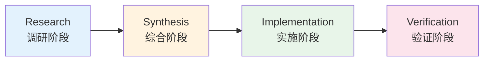
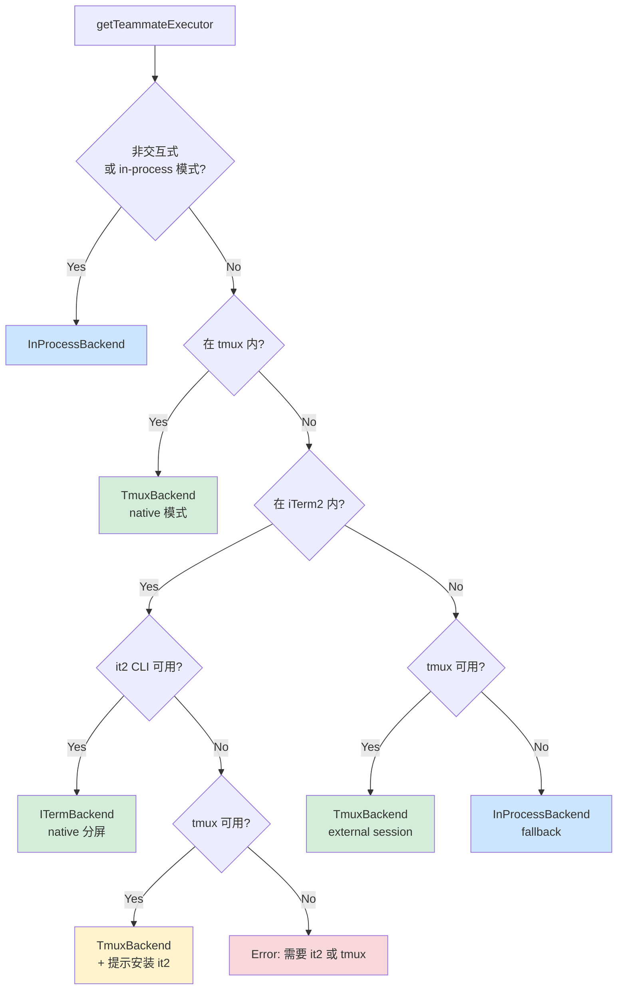
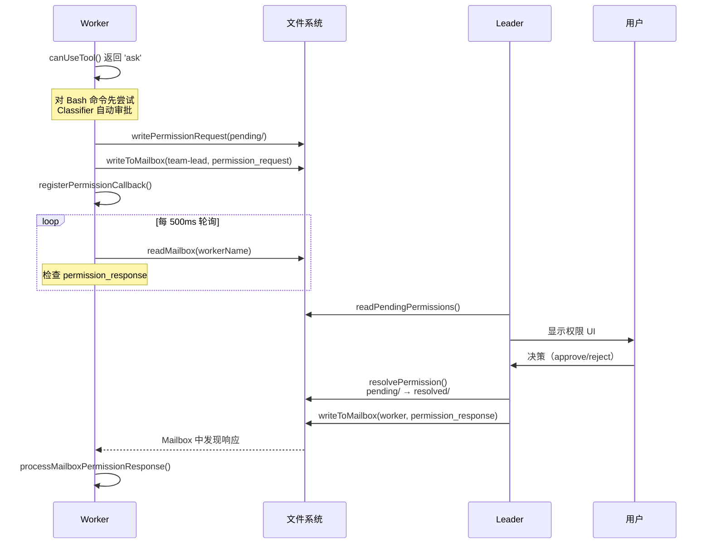
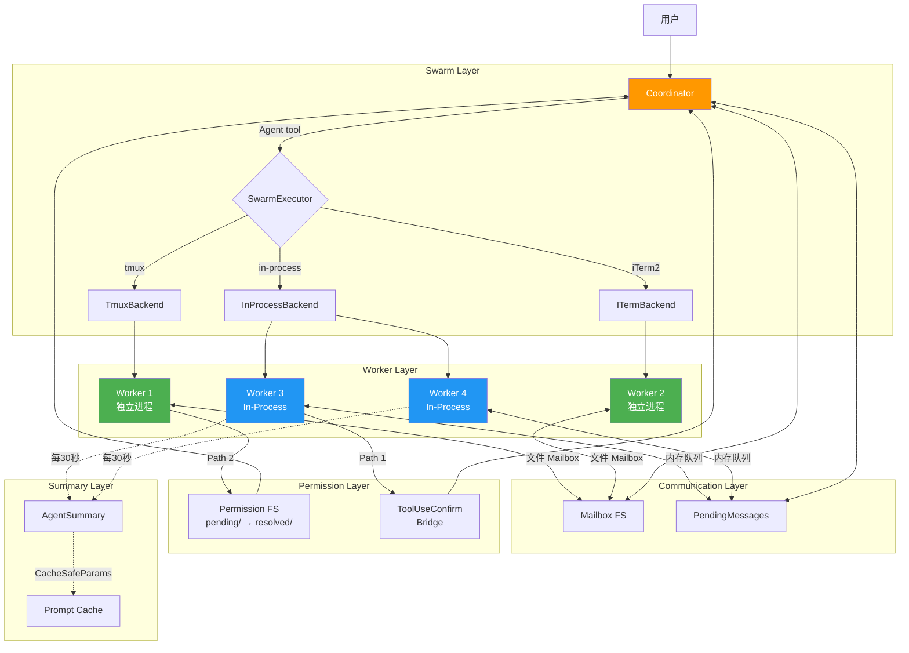

# 第十四章：多 Agent 协调

## 引言

在前几章中，我们分析了 Claude Code 的单 Agent 执行循环 —— 从 prompt 构建到工具调用再到消息流处理。但单 Agent 架构在面对大规模工程任务时存在根本性的效率瓶颈：一个 Agent 一次只能读一个文件、执行一条命令、编辑一处代码。当任务涉及跨模块调研、并行修改多个文件、同时运行测试时，串行执行的代价变得不可接受。

Claude Code 的多 Agent 协调系统是整个架构中最复杂的部分。它解决了一组本质上相互矛盾的设计约束：Agent 间需要共享上下文但又要避免状态耦合；需要并行执行但又要同步权限决策；需要分布式运行但又要让用户感知为一个统一的会话。

本章将从 Coordinator Mode 的 orchestrator/executor 二元模型出发，逐层剖析 Swarm 后端体系、In-Process Runner 的 idle 循环、Permission Synchronization 的双路径设计、Fork Subagent 的缓存优化策略、Agent Summary 的周期性摘要服务，以及 Inter-Agent Communication 的消息路由机制。

---

## 14.1 Coordinator Mode：Orchestrator 与 Executor 的分离

### 14.1.1 模式检测

Coordinator Mode 是 Claude Code 多 Agent 系统的顶层架构模式。它将传统的单一 Agent 拆分为两个角色：**Coordinator**（编排器）和 **Worker**（执行器）。

模式检测逻辑非常直接：

```typescript
export function isCoordinatorMode(): boolean {
  if (feature('COORDINATOR_MODE')) {
    return isEnvTruthy(process.env.CLAUDE_CODE_COORDINATOR_MODE)
  }
  return false
}
```

当 Coordinator Mode 激活时，内置 Agent 注册表被完全替换 —— `getBuiltInAgents()` 不再返回通用的 Explore、Plan、General Purpose Agent，而是返回 `getCoordinatorAgents()` 定义的协调器专用 Agent 集合。

### 14.1.2 ~370 行 System Prompt 的设计哲学

Coordinator 接收一份约 370 行的 System Prompt，这份 prompt 定义了它的全部行为边界。其核心设计原则值得深入分析：

**角色定义**：Coordinator 是纯粹的编排器 —— 它不直接读文件、不执行命令、不编辑代码。它的唯一职责是：（1）分解任务，（2）指挥 Worker，（3）综合结果，（4）与用户沟通。

**可用工具集**严格限制：

| 工具 | 用途 |
|------|------|
| `Agent` | 创建新 Worker |
| `SendMessage` | 向已有 Worker 发送消息 |
| `TaskStop` | 终止运行中的 Worker |
| `subscribe_pr_activity` | 订阅 GitHub PR 事件 |

**四阶段工作流**：



| 阶段 | 执行者 | 目标 |
|------|--------|------|
| Research | Worker（并行） | 调研代码库，收集信息 |
| Synthesis | Coordinator | 阅读调研结果，制定详细方案 |
| Implementation | Worker | 根据方案修改代码，提交 commit |
| Verification | Worker | 测试变更，验证正确性 |

### 14.1.3 Prompt Engineering 的反模式检测

这份 System Prompt 中最有价值的部分是它对 **anti-pattern** 的显式防御：

**"Workers 看不到 Coordinator 的对话"** —— 这是多 Agent 系统中最常见的认知错误。Coordinator 向 Worker 发出的每一条指令都必须是自包含的（self-contained），不能依赖任何隐式上下文。

**"永远不要写 'based on your findings'"** —— 这个反模式看似微不足道，实际上暴露了一个深层问题：当 Coordinator 说"基于你的发现"时，它假设 Worker 的 context window 中包含了之前的调研结果。但 Worker 是独立的 Agent 实例，每次对话从零开始。

**Continue vs. Spawn 决策矩阵** —— Prompt 中定义了明确的决策标准：如果新任务与已完成 Worker 的上下文高度重叠（例如让调研者根据自己的调研结果进行修改），应该通过 `SendMessage` 继续已有 Worker；如果任务完全独立，则创建新 Worker。

### 14.1.4 Worker 工具上下文

Coordinator 向 Worker 传递的上下文通过 `getCoordinatorUserContext()` 构建：

```typescript
export function getCoordinatorUserContext(
  mcpClients: ReadonlyArray<{ name: string }>,
  scratchpadDir?: string,
): { [k: string]: string }
```

这个函数为 Worker 提供三类信息：
1. **可用工具列表** —— 从 `ASYNC_AGENT_ALLOWED_TOOLS` 中去除内部工具（如 `TeamCreate`、`SendMessage`）
2. **MCP Server 名称** —— Worker 可以调用的外部服务
3. **Scratchpad 目录** —— 用于跨 Worker 知识共享的临时文件系统

内部工具被显式过滤：

```typescript
const INTERNAL_WORKER_TOOLS = new Set([
  TEAM_CREATE_TOOL_NAME,
  TEAM_DELETE_TOOL_NAME,
  SEND_MESSAGE_TOOL_NAME,
  SYNTHETIC_OUTPUT_TOOL_NAME,
])
```

这确保了 Worker 不能自行创建团队或发送消息 —— 这些能力只属于 Coordinator。

---

## 14.2 Swarm 后端体系

### 14.2.1 三种后端类型

Swarm 系统是 Claude Code 多 Agent 执行的物理基础设施层。它提供三种后端实现：

```typescript
export type BackendType = 'tmux' | 'iterm2' | 'in-process'
```

每种后端对应不同的运行环境和能力集合：

| 后端 | 隔离级别 | 可视化 | 适用场景 |
|------|----------|--------|----------|
| Tmux | 进程级 | 独立 pane | Linux 服务器、SSH |
| iTerm2 | 进程级 | 原生分屏 | macOS 桌面 |
| In-Process | 线程级 | 无独立 UI | 非交互式、CI/CD |

### 14.2.2 TeammateExecutor 统一接口

无论底层使用哪种后端，上层通过统一的 `TeammateExecutor` 接口交互：

```typescript
export type TeammateExecutor = {
  readonly type: BackendType
  isAvailable(): Promise<boolean>
  spawn(config: TeammateSpawnConfig): Promise<TeammateSpawnResult>
  sendMessage(agentId: string, message: TeammateMessage): Promise<void>
  terminate(agentId: string, reason?: string): Promise<boolean>
  kill(agentId: string): Promise<boolean>
  isActive(agentId: string): Promise<boolean>
}
```

这个接口的设计体现了清晰的生命周期语义：`spawn` 创建、`sendMessage` 通信、`terminate` 优雅关闭（发送 shutdown 请求让 Agent 自行清理）、`kill` 强制终止（直接 abort）。

### 14.2.3 后端检测级联



检测逻辑的关键规则：
1. **tmux 内部运行时，始终使用 tmux** —— 即使在 iTerm2 中运行 tmux，也选择 tmux 后端
2. **iTerm2 需要 `it2` CLI** —— 没有 CLI 时回退到 tmux
3. **最终 fallback 是 In-Process** —— 保证在任何环境下都能运行多 Agent

### 14.2.4 Pane 后端的底层操作

Tmux 和 iTerm2 后端共享 `PaneBackend` 接口，提供终端 pane 级别的操作原语：

```typescript
export type PaneBackend = {
  createTeammatePaneInSwarmView(name, color): Promise<CreatePaneResult>
  sendCommandToPane(paneId, command): Promise<void>
  setPaneBorderColor(paneId, color): Promise<void>
  killPane(paneId): Promise<boolean>
  hidePane(paneId): Promise<boolean>
  showPane(paneId, target): Promise<boolean>
  rebalancePanes(windowTarget, hasLeader): Promise<void>
  // ...
}
```

Tmux 后端使用序列化锁机制（`acquirePaneCreationLock`）防止并行 spawn 造成的竞态条件，并在 pane 创建后添加 200ms 延迟等待 shell 初始化。

---

## 14.3 In-Process Runner：连续 Prompt 循环

### 14.3.1 Teammate 生命周期

In-Process Runner 是最轻量的多 Agent 执行方式 —— teammate 作为异步任务在主进程内运行，不创建独立进程。

Spawn 阶段创建：
1. 独立的 `AbortController`（不链接到 parent —— teammate 在 leader 查询中断时继续存活）
2. `TeammateIdentity`（存储在 AppState 中的纯数据结构）
3. `InProcessTeammateTaskState`（初始状态：`running`、`isIdle: false`、`shutdownRequested: false`）

```typescript
export type TeammateIdentity = {
  agentId: string      // "researcher@my-team"
  agentName: string    // "researcher"
  teamName: string
  color?: string
  planModeRequired: boolean
  parentSessionId: string
}
```

### 14.3.2 核心执行循环

`runInProcessTeammate()` 的核心是一个 **continuous prompt loop** —— 与一般 Agent 执行一次后退出不同，In-Process Teammate 在完成一轮任务后进入 idle 状态，等待下一条指令：

```
1. 构建 system prompt（default + addendum）
2. 解析 Agent 定义，注入 teammate 必需工具
3. 创建 canUseTool（带权限桥接）
4. 设置初始 prompt
5. LOOP:
   a. 创建 turn AbortController
   b. 运行 runAgent()，收集消息
   c. 追踪进度，更新 AppState
   d. 标记为 idle
   e. 发送 idle 通知给 leader
   f. 等待下一个 prompt / shutdown / abort
   g. 处理 mailbox 消息（leader 优先于 peer）
   h. 检查 task list 中的未认领任务
   i. 收到新 prompt：注入为 user message，继续循环
   j. 收到 shutdown：注入为 user message，让模型决定
   k. 被 abort：退出循环
6. 标记任务 completed/failed，清理资源
```

### 14.3.3 Idle 状态与 Polling

Teammate 在 idle 状态下每 500ms 轮询一次：

```typescript
type WaitResult =
  | { type: 'shutdown_request'; request; originalMessage }
  | { type: 'new_message'; message; from; color?; summary? }
  | { type: 'aborted' }
```

轮询优先级设计值得注意：

1. **内存中的 `pendingUserMessages`** —— 最高优先级，来自 transcript 查看
2. **Shutdown 请求** —— 防止 shutdown 被消息洪泛饿死
3. **Team-lead 消息** —— leader 代表用户意图
4. **Peer 消息** —— 同级 teammate 的 FIFO 消息
5. **未认领任务** —— 从共享 task list 中认领

### 14.3.4 内存管理

大规模 Swarm 场景下的内存管理是一个实际的工程挑战。源码中记录了一个极端案例：292 个并发 Agent 导致 36.8GB 内存占用，每个 Agent 在 500+ turn 时约占 20MB RSS。

解决方案是 UI 层的消息上限：

```typescript
export const TEAMMATE_MESSAGES_UI_CAP = 50

export function appendCappedMessage<T>(prev: T[] | undefined, item: T): T[] {
  if (prev && prev.length >= TEAMMATE_MESSAGES_UI_CAP) {
    const next = prev.slice(-(TEAMMATE_MESSAGES_UI_CAP - 1))
    next.push(item)
    return next
  }
  return [...prev ?? [], item]
}
```

---

## 14.4 Permission Synchronization：双路径权限同步

### 14.4.1 问题定义

多 Agent 系统中的权限同步是一个独特的挑战：Worker 需要执行可能修改文件系统的操作，但权限决策权属于用户。在分布式执行环境中，Worker 可能运行在不同的进程甚至不同的终端 pane 中，无法直接显示 UI 对话框。

Claude Code 设计了双路径权限同步系统来解决这个问题。

### 14.4.2 Path 1：Leader ToolUseConfirm 桥接（首选）

当 Worker 与 Leader 在同一进程内运行时，Worker 可以直接将权限请求注入 Leader 的 UI 队列：

```typescript
function createInProcessCanUseTool(
  identity: TeammateIdentity,
  abortController: AbortController,
): CanUseToolFn
```

工作流程：
1. Worker 的 `canUseTool()` 返回 `'ask'`
2. Worker 通过 `getLeaderToolUseConfirmQueue()` 注入请求
3. Leader UI 显示 ToolUseConfirm 对话框，带有 Worker 标识（颜色）
4. 用户做出决策（allow/reject）
5. 回调函数将结果传回 Worker
6. 权限更新写回 Leader 的上下文（`preserveMode: true`）

### 14.4.3 Path 2：文件系统 Mailbox Fallback

当 Worker 运行在独立进程中（Tmux/iTerm2 后端）时，使用文件系统作为通信媒介：



### 14.4.4 文件系统布局

```
~/.claude/teams/{teamName}/permissions/
  pending/
    {requestId}.json    # Worker 写入，Leader 读取
    .lock               # 目录级文件锁
  resolved/
    {requestId}.json    # Leader 写入，Worker 读取
```

请求 Schema 包含完整的上下文信息：

```typescript
export const SwarmPermissionRequestSchema = z.object({
  id: z.string(),
  workerId: z.string(),
  workerName: z.string(),
  workerColor: z.string().optional(),
  teamName: z.string(),
  toolName: z.string(),
  toolUseId: z.string(),
  description: z.string(),
  input: z.record(z.string(), z.unknown()),
  status: z.enum(['pending', 'approved', 'rejected']),
  resolvedBy: z.enum(['worker', 'leader']).optional(),
  feedback: z.string().optional(),
  updatedInput: z.record(z.string(), z.unknown()).optional(),
  permissionUpdates: z.array(z.unknown()).optional(),
  createdAt: z.number(),
})
```

所有写操作通过 `lockfile.lock()` 实现目录级文件锁，防止并发写入损坏数据。

### 14.4.5 Bash 命令的特殊处理

对于 Bash 命令，Worker 在发起权限请求前先尝试 Classifier 自动审批（`awaitClassifierAutoApproval()`）。Classifier 是一个轻量级的安全分类模型，可以判断命令是否安全（如 `ls`、`cat`、`git status`）。只有当 Classifier 无法自动批准时，才走完整的权限同步流程。

---

## 14.5 Fork Subagent：缓存优化的并行分支

### 14.5.1 设计动机

Fork Subagent 是一种特殊的 Agent 创建方式，它的核心创新在于 **prompt cache sharing** —— 通过构造字节级一致（byte-identical）的 API 请求前缀，让多个并行 fork 共享同一份 prompt cache，显著降低 token 成本。

```typescript
export const FORK_AGENT = {
  agentType: 'fork',
  tools: ['*'],
  maxTurns: 200,
  model: 'inherit',
  permissionMode: 'bubble',
  source: 'built-in',
  getSystemPrompt: () => '',  // 不使用 -- fork 继承 parent 的渲染字节
}
```

注意 `getSystemPrompt` 返回空字符串 —— 这是有意为之。Fork 路径通过 `override.systemPrompt` 传递 parent 已经渲染好的 system prompt 字节。重新调用 `getSystemPrompt()` 可能因为 GrowthBook 的 cold/warm 状态差异导致结果不同，从而破坏 prompt cache。

### 14.5.2 buildForkedMessages() —— Cache 共享的关键

```typescript
export function buildForkedMessages(
  directive: string,
  assistantMessage: AssistantMessage,
): MessageType[]
```

所有 fork children 的 API 请求结构：

```
[系统提示（parent 的渲染字节）]
[工具定义（相同的工具池）]
[对话历史（相同）]
[Assistant 消息（所有 tool_use blocks）]
[User 消息：占位符 tool_results... + 每个 child 独有的 directive]
```

占位符文本：`'Fork started -- processing in background'`

只有最后的 directive 文本块在每个 child 之间不同，这最大化了 cache 命中率。

### 14.5.3 递归 Fork 防护

Fork children 保留了 Agent 工具在其工具池中（为了保持工具定义的缓存一致性），因此需要显式的递归防护：

```typescript
export function isInForkChild(messages: MessageType[]): boolean {
  return messages.some(m => {
    if (m.type !== 'user') return false
    return m.message.content.some(
      block => block.type === 'text' &&
        block.text.includes(`<${FORK_BOILERPLATE_TAG}>`)
    )
  })
}
```

通过检测对话历史中是否存在 fork boilerplate tag 来判断当前是否已在 fork child 中 —— 如果是，则禁止再次 fork。

### 14.5.4 Child 的行为约束

每个 fork child 接收一份包含 10 条不可违反规则的 directive：

1. "你是一个 forked worker 进程，不是主 Agent"
2. "不要创建子 Agent，直接执行"
3. 不要对话、提问或建议后续步骤
4. 直接使用工具（Bash、Read、Write）
5. 如果修改了文件，提交 commit 并包含 hash
6. 不要在工具调用之间输出文本
7. 严格限定在 directive 范围内
8. 报告控制在 500 字以内
9. 响应必须以 "Scope:" 开头
10. 报告结构化事实后停止

### 14.5.5 与 Coordinator Mode 的互斥

Fork Subagent 和 Coordinator Mode 是互斥的：

```typescript
export function isForkSubagentEnabled(): boolean {
  if (feature('FORK_SUBAGENT')) {
    if (isCoordinatorMode()) return false  // 互斥
    if (getIsNonInteractiveSession()) return false
    return true
  }
  return false
}
```

这是架构层面的设计决策 —— Coordinator Mode 已经有自己的并行 Worker 管理机制，再引入 fork 会导致复杂度爆炸。

---

## 14.6 Agent Summary 服务

### 14.6.1 周期性摘要机制

当多个 Agent 并行运行时，用户需要了解每个 Agent 正在做什么。Agent Summary 服务提供 30 秒周期的自动摘要：

```typescript
export function startAgentSummarization(
  taskId: string,
  agentId: AgentId,
  cacheSafeParams: CacheSafeParams,
  setAppState: TaskContext['setAppState'],
): { stop: () => void }
```

关键设计决策：
- **间隔：30 秒**（`SUMMARY_INTERVAL_MS = 30_000`）
- **使用 `runForkedAgent()`** 分叉 sub-agent 的对话来生成摘要
- **工具保留但禁用** —— 工具定义保留在请求中以匹配 cache key，但通过 `canUseTool` 回调全部拒绝
- **不设置 `maxOutputTokens`** —— 避免破坏 prompt cache
- **Timer 在完成后重置** —— 防止重叠摘要

### 14.6.2 摘要 Prompt 设计

```typescript
function buildSummaryPrompt(previousSummary: string | null): string
```

要求生成 3-5 个单词的现在时描述，命名具体的文件或函数：

- **好的**: "Reading runAgent.ts", "Fixing null check in validate.ts"
- **差的**: "Analyzed the branch diff"（过去时）, "Investigating the issue"（过于模糊）

如果存在前一次摘要，会附带指令要求说些不同的内容。

### 14.6.3 Cache 共享与 CacheSafeParams

摘要服务通过 `CacheSafeParams` 与父 Agent 共享 prompt cache。这意味着摘要请求的前缀部分（system prompt + 工具定义 + 对话历史）与父 Agent 的请求完全一致，只有末尾的摘要指令不同 —— 与 fork subagent 使用相同的缓存优化策略。

### 14.6.4 执行流程

1. Timer 触发
2. 通过 `getAgentTranscript(agentId)` 读取当前消息
3. 消息少于 3 条则跳过
4. 过滤不完整的 tool calls
5. 用当前消息构建 fork 参数
6. 运行 forked agent（工具被禁用）
7. 从第一条 assistant 消息中提取文本
8. 通过 `updateAgentSummary()` 更新 task 状态
9. 在完成后（而非之前）安排下一次 timer

---

## 14.7 Inter-Agent Communication：消息路由

### 14.7.1 SendMessage Tool

`SendMessage` 是 Agent 间通信的核心工具：

```typescript
const inputSchema = z.object({
  to: z.string().describe('收件人：teammate 名称、"*" 广播、...'),
  summary: z.string().optional().describe('5-10 字 UI 预览摘要'),
  message: z.union([
    z.string(),
    StructuredMessage(),
  ]),
})
```

消息体可以是纯文本或结构化消息。结构化消息支持三种协议类型：

```typescript
const StructuredMessage = z.discriminatedUnion('type', [
  z.object({ type: z.literal('shutdown_request'), reason: z.string().optional() }),
  z.object({ type: z.literal('shutdown_response'), request_id: z.string(),
             approve: semanticBoolean(), reason: z.string().optional() }),
  z.object({ type: z.literal('plan_approval_response'), request_id: z.string(),
             approve: semanticBoolean(), feedback: z.string().optional() }),
])
```

### 14.7.2 四路消息路由

`SendMessage` 的 `call()` 方法实现了四条路由路径：

**Path 1：跨 Session 通信**
- `uds:/path/to.sock` —— 通过 Unix Domain Socket 连接本地 Claude 会话
- `bridge:session_...` —— 通过 Anthropic 服务器的 Remote Control 连接远程 peer

**Path 2：In-Process Subagent**
- 查找 `appState.agentNameRegistry` 或转换为 `AgentId`
- 运行中的 Agent：`queuePendingMessage()` 在下一个 tool round 交付
- 已停止的 Agent：`resumeAgentBackground()` 自动恢复

**Path 3：Teammate Mailbox**
- 单个收件人：`writeToMailbox(recipientName, ...)`
- 广播（`*`）：遍历所有 team 成员（开销与 team 大小线性相关）

**Path 4：结构化协议消息**
- `shutdown_request` → `handleShutdownRequest()` → 写入目标 mailbox
- `shutdown_response`（approve）→ `handleShutdownApproval()` → abort in-process / graceful shutdown pane-based
- `plan_approval_response` → 写入 approval/rejection 到 mailbox

### 14.7.3 XML 通知格式

后台 Agent 通过 XML 结构化通知报告完成状态：

```xml
<task-notification>
  <task-id>{taskId}</task-id>
  <tool-use-id>{toolUseId}</tool-use-id>
  <output-file>{outputPath}</output-file>
  <status>{completed|failed|killed}</status>
  <summary>{人类可读摘要}</summary>
  <result>{最终消息}</result>
  <usage>
    <total_tokens>N</total_tokens>
    <tool_uses>N</tool_uses>
    <duration_ms>N</duration_ms>
  </usage>
</task-notification>
```

这些通知通过 `enqueuePendingNotification()` 推入待处理队列，作为 user-role 消息到达 parent/coordinator。

### 14.7.4 Teammate Mailbox 协议

文件系统 Mailbox 是跨进程 Agent 通信的底层传输层：

```typescript
writeToMailbox(recipientName, message, teamName): Promise<void>
readMailbox(agentName, teamName): Promise<MailboxMessage[]>
markMessageAsReadByIndex(agentName, teamName, index): Promise<void>
```

支持的特殊消息类型：
- `createShutdownRequestMessage()` —— 关闭请求
- `createShutdownApprovedMessage()` —— 关闭批准（包含 paneId/backendType 用于清理）
- `createIdleNotification()` —— 空闲状态通知
- `createPermissionRequestMessage()` —— 权限委托请求
- `createPermissionResponseMessage()` —— 权限决议响应

---

## 14.8 整体架构：各组件的协作关系



---

## 小结

Claude Code 的多 Agent 协调系统展现了一种务实的工程哲学：不追求理论上的完美分布式系统，而是在实际约束下找到可行的解决方案。

Coordinator Mode 的 ~370 行 system prompt 不是配置文件，而是行为规范 —— 它通过自然语言定义了一个完整的任务编排协议。Swarm 后端的三层级联确保了从 Linux 服务器到 macOS 桌面到 CI 环境的全覆盖。In-Process Runner 的 idle 循环将 Agent 从"执行一次退出"变为"持续服务"的长期进程。Permission Synchronization 的双路径设计在进程内直接桥接和跨进程文件系统之间优雅切换。Fork Subagent 的字节级一致性前缀是一个精巧的成本优化手段。Agent Summary 的 30 秒周期摘要解决了多 Agent 可观测性问题。

这些组件共同构成了一个能够实际运行的多 Agent 系统 —— 它不完美，存在 500ms 轮询延迟、文件锁竞争、内存上限等工程妥协，但它在真实的软件工程任务中提供了显著的并行加速。

下一章我们将分析 Claude Code 的远程执行与 Headless 模式，看它如何将本章介绍的多 Agent 能力延伸到云端。
